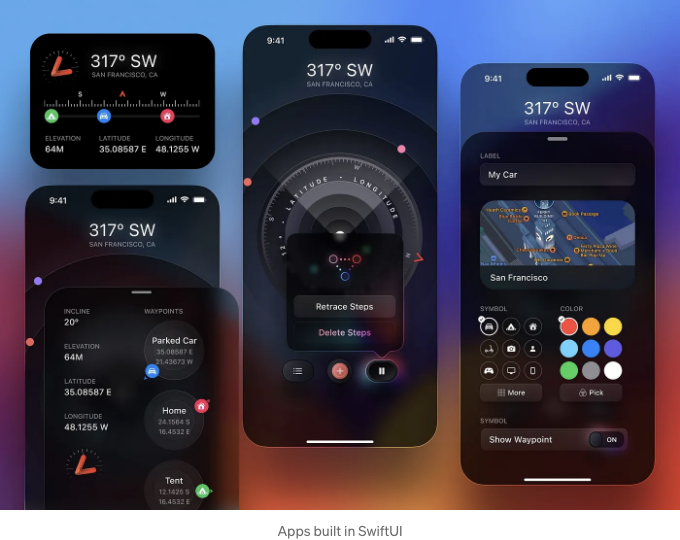
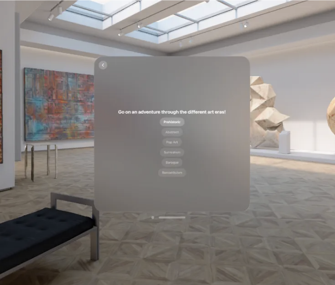
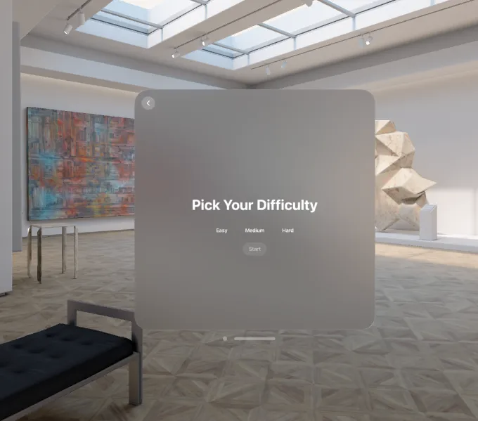
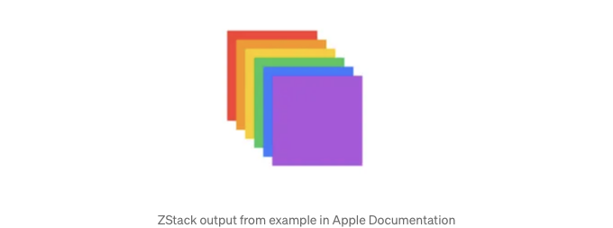

당신의 VisionOS 앱에 사용할 SwiftUI 뷰를 만드는 간단한 안내서



VisionOS는 SwiftUI 기반으로 작성되었기 때문에, Vision Pro 앱을 통해 탐색하기 위해 같은 기술을 활용합니다.

이 글에서는 Vision Pro 앱을 개발하면서 추가할 수 있는 다양한 뷰 및 구성 요소를 살펴보겠습니다. 이를 통해 탐색 및 데이터 표시가 보다 쉬워집니다. 또한 시뮬레이터에서의 모습과 해당 작업에 필요한 적절한 도구 선택 방법에 대해 알아보겠습니다.

<!-- ui-log 수평형 -->

<ins class="adsbygoogle"
      style="display:block"
      data-ad-client="ca-pub-4877378276818686"
      data-ad-slot="9743150776"
      data-ad-format="auto"
      data-full-width-responsive="true"></ins>
<component is="script">
(adsbygoogle = window.adsbygoogle || []).push({});
</component>

우리가 탐색할 요소 중 일부는 다음과 같습니다:

- VStack, HStack 및 ZStack
- NavigationStack
- NavigationSplitView

각각의 예제가 포함되어 있어 다양한 사용 사례를 확인할 수 있습니다.

VStack, HStack 및 ZStack

<!-- ui-log 수평형 -->

<ins class="adsbygoogle"
      style="display:block"
      data-ad-client="ca-pub-4877378276818686"
      data-ad-slot="9743150776"
      data-ad-format="auto"
      data-full-width-responsive="true"></ins>
<component is="script">
(adsbygoogle = window.adsbygoogle || []).push({});
</component>

SwiftUI에서는 사용자에게 제시하기 위해 항목을 다양한 미리 정의된 방식으로 정렬하기 위해 (V, H, Z)-Stacks를 사용할 수 있습니다. 스택 안의 다른 문자는 항목이 나열되는 방향을 나타냅니다. 예를 들어, V는 수직을 의미하며, 항목은 위에서 아래로 나열됩니다. 마찬가지로, H 및 Z 스택은 항목을 좌에서 우로, 배경에서 전경으로 순서대로 나열합니다.

Vision Pro의 경우, 이러한 동작은 정확히 같지만 사용 사례가 변경됩니다. 예를 들어 이제 이러한 스택을 항목 선택에 사용할 수 있습니다. 스택의 각 항목은 클릭 시 나타낼 수 있는 주어진 3D 에셋과 대응할 수 있습니다.

예를 들어, 보기의 일부로 이 VStack을 사용하여 클릭 시 에셋을 열 수 있는 버튼 목록을 표시할 수 있습니다:

```js
struct StoryView: View {
    // 여러 부울 상태 변수들

    var body: some View {
        NavigationStack {
            VStack {
                Text("다양한 미술 시대를 통해 모험을 떠나보세요!")
                    .font(.title)
            }

            VStack {
                Toggle("선사 시대", isOn: $showPrehistoric)
                    .toggleStyle(.button)

                Toggle("추상적", isOn: $showAbstract)
                    .toggleStyle(.button)
                    .disabled(dataModel.stage < 1)

                Toggle("팝 아트", isOn: $showPopArt)
                    .toggleStyle(.button)
                    .disabled(dataModel.stage < 2)

                Toggle("초현실주의", isOn: $showSurrealism)
                    .toggleStyle(.button)
                    .disabled(dataModel.stage < 3)

                Toggle("바로크", isOn: $showBaroque)
                    .toggleStyle(.button)
                    .disabled(dataModel.stage < 4)

                Toggle("로맨티시즘", isOn: $showRomanticism)
                    .toggleStyle(.button)
                    .disabled(dataModel.stage < 5)
            }
        }
    }
}
```

<!-- ui-log 수평형 -->

<ins class="adsbygoogle"
      style="display:block"
      data-ad-client="ca-pub-4877378276818686"
      data-ad-slot="9743150776"
      data-ad-format="auto"
      data-full-width-responsive="true"></ins>
<component is="script">
(adsbygoogle = window.adsbygoogle || []).push({});
</component>

결과물은 다음과 같이 보일 것입니다:



VStack과 마찬가지로, HStack은 항목들을 가로로 표시하는 데 사용됩니다. 예를 들어, 다음 코드:

```swift
struct FreestyleView: View {
    @State private var selectedDifficulty: String?
    let difficulty = ["Easy", "Medium", "Hard"]

    var body: some View {
        NavigationStack {
            VStack {
                Text("난이도 선택")
                    .font(.extraLargeTitle)
                    .padding()

                HStack {
                    ForEach(difficulty, id: \.self) { option in
                        Button(action: {
                            self.selectedDifficulty = option
                        }) {
                            Text(option)
                                .foregroundColor(.white)
                                .frame(width: 100, height: 30) // 필요에 따라 너비와 높이 조정
                                .background(selectedDifficulty == option ? Color.gray.opacity(0.7) : Color.clear)
                                .cornerRadius(10)
                        }
                        .padding(1) // 작은 간격
                        .buttonStyle(PlainButtonStyle()) // 버튼 스타일 제거
                    }
                }.padding()

                Toggle("시작", isOn: $showFreestyleMode)
                    .toggleStyle(.button)
                    .disabled(selectedDifficulty == nil)
            }
        }
    }
}
```

<!-- ui-log 수평형 -->

<ins class="adsbygoogle"
      style="display:block"
      data-ad-client="ca-pub-4877378276818686"
      data-ad-slot="9743150776"
      data-ad-format="auto"
      data-full-width-responsive="true"></ins>
<component is="script">
(adsbygoogle = window.adsbygoogle || []).push({});
</component>

위 내용은 다음과 같이 표시됩니다:



두 경우 모두 여러 옵션을 선택할 수 있습니다. 중요한 점은 버튼을 초기화하는 다양한 방법을 사용하지만 결국에는 동일한 데이터를 나타낸다는 것입니다. 이들은 두 가지 다른 스택으로 캡슐화되어 있어서 서로 다른 방향으로 항목을 표시할 수 있습니다.

ZStack은 항목들을 "레이어링"할 수 있는 특별한 구조입니다. 개인적으로 이 구성 요소에 대한 사용 사례를 아직 찾지 못했지만, 애플 문서에서는 주로 레이어 형식의 아트를 만드는 능력이라고 설명하고 있습니다.

<!-- ui-log 수평형 -->

<ins class="adsbygoogle"
      style="display:block"
      data-ad-client="ca-pub-4877378276818686"
      data-ad-slot="9743150776"
      data-ad-format="auto"
      data-full-width-responsive="true"></ins>
<component is="script">
(adsbygoogle = window.adsbygoogle || []).push({});
</component>



Navigation Stack

네비게이션 스택은 사용자에게 다른 보기를 표시하는 것을 전환하고 싶을 때 필수적입니다. 이전에 React / React Native를 사용해본 사람들에게는 스택 내비게이터와 매우 유사합니다.

그러나 SwiftUI가 이를 구현하는 방식은 조금 다릅니다. SwiftUI는 더 유연한 접근 방식을 취합니다. 특정 뷰 내에서 네비게이션 스택을 선언하고 불리언 조건에 따라 런타임에서 다른 창 뷰로 열도록 결정할 수 있습니다. 네비게이션 스택은 또한 네비게이션을 위한 "뒤로" 버튼을 암시적으로 제공합니다.

<!-- ui-log 수평형 -->

<ins class="adsbygoogle"
      style="display:block"
      data-ad-client="ca-pub-4877378276818686"
      data-ad-slot="9743150776"
      data-ad-format="auto"
      data-full-width-responsive="true"></ins>
<component is="script">
(adsbygoogle = window.adsbygoogle || []).push({});
</component>

이전 코드를 기반으로 한 예제가 있습니다:

```js
struct FreestyleView: View {
    @Environment(\.openImmersiveSpace) var openImmersiveSpace
    @Environment(\.dismissImmersiveSpace) var dismissImmersiveSpace

    @State private var showFreestyleMode = false
    @State private var freestyleModeShown = false
    @State private var selectedDifficulty: String?
    let difficulty = ["쉬움", "보통", "어려움"]

    var body: some View {
        NavigationStack { // 여기서 사용된 네비게이션 스택
            VStack {
                ...
                }.padding()

            }.onChange(of: showFreestyleMode) { _, newValue in
                Task {
                    if newValue && selectedDifficulty == "쉬움" {
                        switch await openImmersiveSpace(id: "EasyMode") {
                        case .opened:
                            freestyleModeShown = true
                        case .error, .userCancelled:
                            fallthrough
                        @unknown default:
                            freestyleModeShown = false
                            showFreestyleMode = false
                        }
                    } else if freestyleModeShown {
                        await dismissImmersiveSpace()
                        freestyleModeShown = false
                    }
                }
            }
            // 다른 난이도에 대한 변경 트리거에 대한 자세한 정보
    }
}
```

여기에서 우리는 네비게이션 스택에 "onChange" 문을 추가했습니다. 이것은 변수인 showFreestyleMode의 변경을 청취하고 선택한 난이도에 따라 지정된 공간을 엽니다.

네비게이션 분할 보기

<!-- ui-log 수평형 -->

<ins class="adsbygoogle"
      style="display:block"
      data-ad-client="ca-pub-4877378276818686"
      data-ad-slot="9743150776"
      data-ad-format="auto"
      data-full-width-responsive="true"></ins>
<component is="script">
(adsbygoogle = window.adsbygoogle || []).push({});
</component>

이 컴포넌트는 좀 더 "특별한" 사용 케이스를 위한 것입니다. 현재 뷰 창을 쪼개어 측면 메뉴와 주 창을 가지도록 합니다. 사용자가 측면에서 선택을 할 수 있게 하고, 주 창 내에서 트리거된 어떤 상호 반응이 있도록 하고 싶을 때 이 뷰가 훌륭합니다.

이 효과는 다음과 같습니다:


해당 코드는 다음과 같습니다:

<!-- ui-log 수평형 -->

<ins class="adsbygoogle"
      style="display:block"
      data-ad-client="ca-pub-4877378276818686"
      data-ad-slot="9743150776"
      data-ad-format="auto"
      data-full-width-responsive="true"></ins>
<component is="script">
(adsbygoogle = window.adsbygoogle || []).push({});
</component>

```swift
NavigationView {
    // 상태 변수

    var body: some View {

        // 뷰는 음악 사이드 메뉴와 주 컨트롤 메뉴 사이로 분할됩니다
        NavigationSplitView {
            List {
                ForEach(["Jazz", "Classic Rock", "Piano", "Opera" ], id: \.self) { item in
                    ListItemView(title: item,
                                 isHovered: hoveredItem == item,
                                 isSelected: selectedItem == item)
                    .hoverEffect(.automatic)
                    .onTapGesture {
                        musicPlaying = true
                        selectedItem = item
                        let state = musicSelection.from(musicChoice: selectedItem)
                        dataModel.playMusic(music: state, currMusicPlaying: musicPlaying)
                    }
                }
            }.toolbar {
                ToolbarItem(placement: .topBarLeading) {
                    VStack (alignment: .leading) {
                        Text("음악 라이브러리")
                            .font(.largeTitle)
                    }
                }
            }

            // 메인 메뉴 내용
        } detail: {
            Toggle("벽난로 표시", isOn: $showFireplaceView)
                .toggleStyle(.button)
                .onChange(of: showFireplaceView) {_, isShowing in
                    if isShowing {
                        openWindow(id: "FireplaceView")
                        dataModel.playFireplaceSounds();
                    } else {
                        dismissWindow(id: "FireplaceView")
                        dataModel.stopFireplaceSounds();
                    }
                }

            // 다른 코드 묶음
            }
        }
    }
}
```

뷰 본문에서 Navigation Split View를 정의했습니다. 그런 다음 툴바 섹션의 일부로 하이라이팅되는 제목이 있는 것을 볼 수 있습니다. 메인 메뉴 콘텐츠는 "detail" 섹션 내에 정의되어 있으며, 여기에는 벽난로가 나타나는 버튼 및 표시되지 않는 기능이 포함되어 있습니다.

뷰를 사용자 정의하는 데 사용할 수 있는 몇 가지 구성 요소에 대해 이야기했습니다. 이것들은 대부분의 시간을 사용하게 될 중요한 구성 요소입니다. 앱을 최대한 활용하기 위해 Vision Pro 앱 내에서 이러한 뷰의 다양한 유형을 활용하여 사용자 인터페이스를 더 매력적이고 직관적으로 만드는 것을 권장드립니다.
