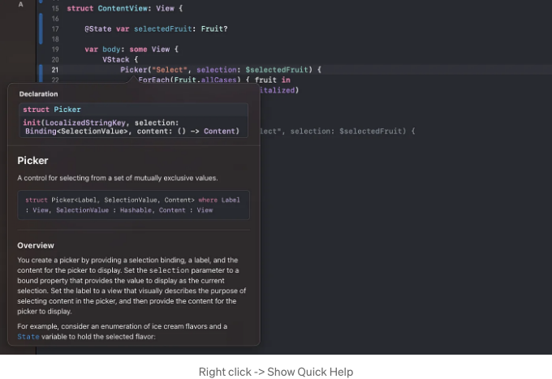
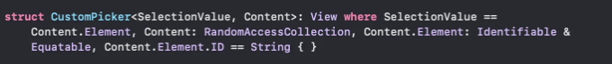
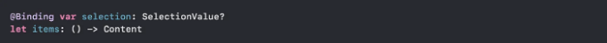
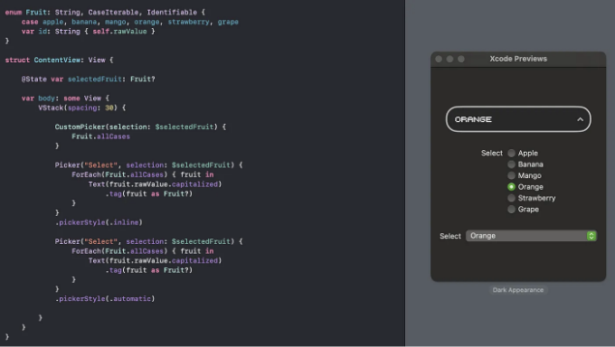

우리는 Apple의 구현을 모방한 자체 Picker를 만들 것입니다. 이 Picker는 미리 정의된 모델이 필요하지 않아 더 유연하고 재사용 가능합니다.

이를 위해 우리의 사용자 정의 picker가 특정 요구 사항을 충족하는 모든 유형을 처리할 수 있어야 합니다. 여기서 제네릭이 중요한 역할을 합니다.

첫 번째로 구현할 것은 기본 Picker를 구현하여 해당 구현에 대한 힌트를 얻을 수 있는지 확인하는 것입니다.

```js
enum Fruit: String, CaseIterable, Identifiable {
    case apple, banana, mango, orange, strawberry, grape
    var id: String { self.rawValue }
}

struct ContentView: View {

    @State var selectedFruit: Fruit?

    var body: some View {
        VStack {
            Picker("선택", selection: $selectedFruit) {
                ForEach(Fruit.allCases) { fruit in
                    Text(fruit.rawValue.capitalized)
                        .tag(fruit as Fruit?)
                }
            }
            .pickerStyle(.inline)
        }
    }
}
```

<!-- ui-log 수평형 -->

<ins class="adsbygoogle"
      style="display:block"
      data-ad-client="ca-pub-4877378276818686"
      data-ad-slot="9743150776"
      data-ad-format="auto"
      data-full-width-responsive="true"></ins>
<component is="script">
(adsbygoogle = window.adsbygoogle || []).push({});
</component>

피커에 대한 빠른 도움은 초기화자에 대한 정보를 제공합니다.



피커 초기화자는 현재 선택 사항을 나타내는 정의되지 않은 SelectionValue 유형과 클로저를 취하는 Content 또 다른 유형을 사용합니다. 나중에 구조체 정의에서 이러한 정의되지 않은 유형이 일부 제약 사항을 받는 것을 볼 수 있습니다. SelectionValue는 Hashable을 준수해야 하며 Content는 View를 준수해야 합니다. 이는 Picker View가 내부적으로 이러한 유형을 해당 프로토콜을 준수하는 유형으로 처리할 것을 의미합니다.

자체 CustomPicker를 위한 구조체 정의를 만들어 봅시다.

<!-- ui-log 수평형 -->

<ins class="adsbygoogle"
      style="display:block"
      data-ad-client="ca-pub-4877378276818686"
      data-ad-slot="9743150776"
      data-ad-format="auto"
      data-full-width-responsive="true"></ins>
<component is="script">
(adsbygoogle = window.adsbygoogle || []).push({});
</component>



여기서 우리는 기본적으로 Content가 RandomAccessCollection을 준수하는 모든 유형일 수 있다고 말하고, SelectionValue가 Content의 요소와 동일한 유형이라고 말합니다. 그리고 또한 CustomPicker에 대해 Content.Element나 SelectionValue가 Equatable & Identifiable을 준수해야 한다는 요구 사항을 설정합니다. 이제 이 유형이 Identifiable이므로 ID 속성이 있을 것이라는 것을 알고 있습니다. 또한 Content.Element.ID가 String과 같아야 한다는 새로운 제약을 정의할 수 있습니다.

이 시점에서 우리는 View를 구축하기 시작할 수 있습니다. 여기에 내부 속성을 선언하는 방법입니다.



<!-- ui-log 수평형 -->

<ins class="adsbygoogle"
      style="display:block"
      data-ad-client="ca-pub-4877378276818686"
      data-ad-slot="9743150776"
      data-ad-format="auto"
      data-full-width-responsive="true"></ins>
<component is="script">
(adsbygoogle = window.adsbygoogle || []).push({});
</component>

그리고 명심해 주세요, SelectionValue와 Content는 위에서 선언된 속성을 갖는 제네릭 타입이라는 것을 알고 있습니다. 그래서 ForEach와 items를 함께 사용할 수 있다는 것을 알고 있습니다. 왜냐하면 RandomAccessCollection을 준수하기 때문이죠. 그리고 선택한 selection.ID는 String이거나 nil일 것이라는 것도 알고 있습니다.

이제 우리가 원하는 대로 View를 구성해보겠습니다. 접근 방식은 꽤 간단합니다.

- 초기 텍스트가 "Select"로 설정된 버튼 또는 원하는 어떤 뷰 하나, 이 뷰의 상태를 변경하는 @State var isPicking: Bool을 가집니다.
- 이 버튼 바로 아래에 표시되는 오버레이
- 전체 View에 zIndex를 설정하여 오버레이가 그려지면 현재 보기의 다른 요소들 위에 표시되도록 합니다.

이제 항상 연습하다보니 이렇게 만들었습니다. 디자인에 따라, Petyka의 멋진 폰트를 사용하여 극적이고 레트로한 느낌으로 선택했습니다. 사용자 정의 색상 세트를 사용했고 몇 가지 애니메이션도 도입했습니다.

<!-- ui-log 수평형 -->

<ins class="adsbygoogle"
      style="display:block"
      data-ad-client="ca-pub-4877378276818686"
      data-ad-slot="9743150776"
      data-ad-format="auto"
      data-full-width-responsive="true"></ins>
<component is="script">
(adsbygoogle = window.adsbygoogle || []).push({});
</component>

Picker는 iOS와 macOS에서 모두 작동합니다.


## SwiftUI 코드

<!-- ui-log 수평형 -->

<ins class="adsbygoogle"
      style="display:block"
      data-ad-client="ca-pub-4877378276818686"
      data-ad-slot="9743150776"
      data-ad-format="auto"
      data-full-width-responsive="true"></ins>
<component is="script">
(adsbygoogle = window.adsbygoogle || []).push({});
</component>

```js
// 선택 버튼-선택된 항목
        HStack {
            Text(selection?.id.capitalized ?? "선택")
                .lineLimit(1)
                .minimumScaleFactor(0.8)
            Spacer()
            Text(">")
                .rotationEffect(isPicking ? Angle(degrees: 90) : Angle(degrees: -90))
        }
```

```js
// 피커
        .overlay(alignment: .topLeading) {
            VStack {
                if isPicking {
                    Spacer(minLength: buttonHeight + 10)

                    ScrollView {
                        VStack(spacing: 0) {
                            ForEach(items()) { item in

                                Divider()

                                Button {

                                    selection = item
                                    isPicking.toggle()

                                } label: {

                                    Text(item.id.capitalized)
                                        .lineLimit(1)
                                        .minimumScaleFactor(0.7)
                                        .frame(height: buttonHeight)
                                        .frame(maxWidth: .infinity, alignment: .center)
                                        .padding(.horizontal, 10)
                                        .background {
                                            RoundedRectangle(cornerRadius: cornerRadius)
                                                .fill(hoveredItem == item ? Color.accentColor.opacity(0.8) : Color.clear)
                                                .padding(.horizontal, 8)
                                                .padding(.bottom, 10)
                                                .offset(y: 5)
                                        }
                                        .onHover { isHovered in
                                            if isHovered {
                                                hoveredItem = item
                                            }
                                        }
                                }
                                .buttonStyle(.plain)

                                Divider()
                            }
                        }
                        .frame(maxWidth: .infinity)
                    }
                    .scrollIndicators(.never)
                    .frame(height: 200)
                    .background(Color("PickerColor"))
                    .clipShape(RoundedRectangle(cornerRadius: cornerRadius))
                    .overlay(
                        RoundedRectangle(cornerRadius: cornerRadius)
                        .stroke(Color.primary, lineWidth: 2.2)
                    )
                    .transition(.scale(scale: 0.8, anchor: .top).combined(with: .opacity).combined(with: .offset(y: -10)))
                }
            }

        }
```

그런 다음, `Fruit` enum의 모든 케이스를 제공해서 바인딩만 지정하여 `CustomPicker`를 초기화합니다. 얼마나 간단한지 확인해보세요!

```js
CustomPicker(selection: $selectedFruit) {
                Fruit.allCases
            }
```

<!-- ui-log 수평형 -->

<ins class="adsbygoogle"
      style="display:block"
      data-ad-client="ca-pub-4877378276818686"
      data-ad-slot="9743150776"
      data-ad-format="auto"
      data-full-width-responsive="true"></ins>
<component is="script">
(adsbygoogle = window.adsbygoogle || []).push({});
</component>



저는 전체 Xcode 프로젝트를 깃허브에 업로드했어요. 마음껏 사용해보세요.

제네릭에 대해 더 알고 싶다면, 닉 사르노의 이 비디오를 추천해요. 사실, 플레이리스트 전체를 시청하는 걸 강력히 추천합니다. 매우 가치 있는 내용이에요.
