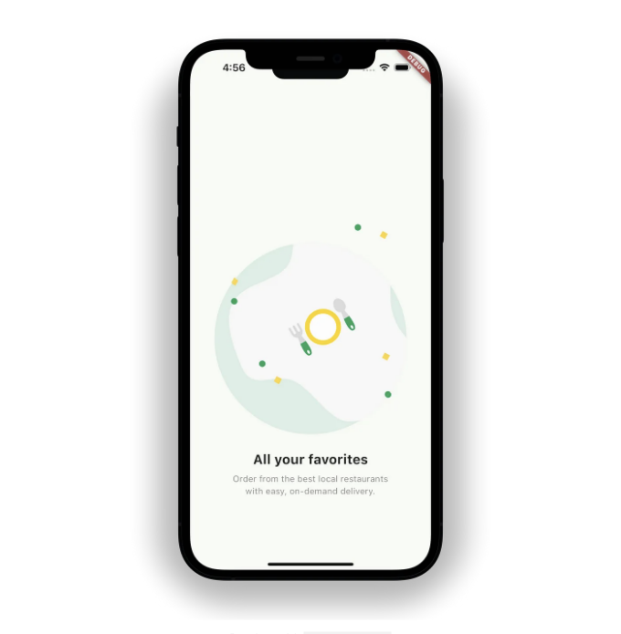

플러터 앱에서 아래와 같이 보여지는 온보딩 페이지를 만드는 방법을 배워볼 거에요.


인디케이터가 애니메이션되는 걸 보면, 놀라울 정도로 단 10줄의 코드만 필요하다구요!

## 시작하기

<!-- ui-log 수평형 -->

<ins class="adsbygoogle"
      style="display:block"
      data-ad-client="ca-pub-4877378276818686"
      data-ad-slot="9743150776"
      data-ad-format="auto"
      data-full-width-responsive="true"></ins>
<component is="script">
(adsbygoogle = window.adsbygoogle || []).push({});
</component>

OnboardingPage부터 시작해보겠습니다. 이 페이지는 StatefulWidget입니다. 또한 \_selectedIndex라는 변수를 정의하고 기본 값을 0으로 설정하세요.

```dart
class OnboardingPage extends StatefulWidget {
  const OnboardingPage({Key? key});

  @override
  State<OnboardingPage> createState() => _OnboardingPageState();
}

class _OnboardingPageState extends State<OnboardingPage> {
  int _selectedIndex = 0;
  @override
  Widget build(BuildContext context) {
    return Scaffold(
      body: SafeArea(
        child: Column(
          children: [
            // TODO: Onboard Content

            // TODO: Animated Dots

            // TODO: Button
          ],
        ),
      ),
    );
  }
}

List<Map<String, dynamic>> demoData = [
  {
    "illustration": "assets/Illustrations/Illustrations_1.svg",
    "title": "All your favorites",
    "text":
        "Order from the best local restaurants \nwith easy, on-demand delivery.",
  },
  {
    "illustration": "assets/Illustrations/Illustrations_2.svg",
    "title": "Free delivery offers",
    "text":
        "Free delivery for new customers via Apple Pay\nand others payment methods.",
  },
  {
    "illustration": "assets/Illustrations/Illustrations_3.svg",
    "title": "Choose your food",
    "text":
        "Easily find your type of food craving and\nyou’ll get delivery in wide range.",
  },
];
```

## Onboard Content

OnboardContent에서는 일러스트레이션부터 시작합니다. 그 다음으로 큰 텍스트로 제목을 설정하고 style을 titleLarge로 설정합니다. 마지막으로 짧은 설명이 있습니다. 이것이 일러스트레이션, 제목 및 설명이라는 세 가지 매개변수가 있는 이유입니다.

<!-- ui-log 수평형 -->

<ins class="adsbygoogle"
      style="display:block"
      data-ad-client="ca-pub-4877378276818686"
      data-ad-slot="9743150776"
      data-ad-format="auto"
      data-full-width-responsive="true"></ins>
<component is="script">
(adsbygoogle = window.adsbygoogle || []).push({});
</component>

```js
class OnboardContent extends StatelessWidget {
  const OnboardContent({
    super.key,
    required this.illustration,
    required this.title,
    required this.text,
  });

  final String illustration, title, text;

  @override
  Widget build(BuildContext context) {
    return Column(
      children: [
        Expanded(
          child: AspectRatio(
            aspectRatio: 1,
            child: SvgPicture.asset(illustration),
          ),
        ),
        const SizedBox(height: 16),
        Text(
          title,
          style: Theme.of(context)
              .textTheme
              .titleLarge!
              .copyWith(fontWeight: FontWeight.bold),
        ),
        const SizedBox(height: 8),
        Text(
          text,
          style: Theme.of(context).textTheme.bodyMedium,
          textAlign: TextAlign.center,
        ),
      ],
    );
  }
}
```

이제 OnboardContent를 온보딩 페이지에 적용해 봅시다. 미리보기를 살펴보면 사용자가 좌우로 스와이프할 수 있음을 알 수 있습니다. 이것은 PageView를 사용하여 구현합니다. 페이지가 변경될 때 \_selectedindex를 업데이트합니다. 이것은 나중에 페이지 위치를 나타내는 애니메이션 도트를 추가할 때 유용합니다. 아래 코드로 TODO: 온보드 컨텐츠를 교체하세요.

```js
const Spacer(flex: 2),
SizedBox(
  height: 500,
  child: PageView.builder(
    itemCount: demoData.length,
    onPageChanged: (value) {
      setState(() {
        _selctedIndex = value;
      });
    },
    itemBuilder: (context, index) {
      return OnboardContent(
        illustration: demoData[index]['illustration'],
        title: demoData[index]['title'],
        text: demoData[index]['text'],
      );
    },
  ),
),
const Spacer(),
```



<!-- ui-log 수평형 -->

<ins class="adsbygoogle"
      style="display:block"
      data-ad-client="ca-pub-4877378276818686"
      data-ad-slot="9743150776"
      data-ad-format="auto"
      data-full-width-responsive="true"></ins>
<component is="script">
(adsbygoogle = window.adsbygoogle || []).push({});
</component>

## 애니메이션된 점들

애니메이션된 점들을 만들 때, 우리는 Implicit 애니메이션을 선택합니다. 컨트롤러나 복잡한 설정이 필요 없어서 간단하고 직관적이기 때문입니다. 우리는 단순히 기간을 정의하기만 하면 됩니다. AnimatedContainer가 그 중 하나입니다. 여기서 점이 활성화되면 너비가 24로 확장되고, 그렇지 않으면 6으로 유지됩니다. 24에서 6으로의 전환은 즉시 일어나지 않고, 지정된 기간 동안 점진적으로 일어납니다.

```js
class AnimatedDot extends StatelessWidget {
  const AnimatedDot({
    super.key,
    required this.isActive,
  });

  final bool isActive;

  @override
  Widget build(BuildContext context) {
    return AnimatedContainer(
      duration: const Duration(milliseconds: 300),
      height: 6,
      width: isActive ? 20 : 6,
      decoration: BoxDecoration(
        color:
            isActive ? primaryColor : const Color(0xFF868686).withOpacity(0.25),
        borderRadius: const BorderRadius.all(Radius.circular(12)),
      ),
    );
  }
}
```

이제 페이지에 점들을 표시하려면, 단순히 `TODO: Animated Dots`를 아래 코드로 바꿔주세요.

<!-- ui-log 수평형 -->

<ins class="adsbygoogle"
      style="display:block"
      data-ad-client="ca-pub-4877378276818686"
      data-ad-slot="9743150776"
      data-ad-format="auto"
      data-full-width-responsive="true"></ins>
<component is="script">
(adsbygoogle = window.adsbygoogle || []).push({});
</component>

```dart
테이블을 Markdown 형식으로 변경하십시오.
```


## 버튼

거의 다 왔어요! 완성해야 할 유일한 구성 요소는 버튼입니다. 아래 코드로 TODO: 버튼을 대체해 완료하겠습니다.

<!-- ui-log 수평형 -->

<ins class="adsbygoogle"
      style="display:block"
      data-ad-client="ca-pub-4877378276818686"
      data-ad-slot="9743150776"
      data-ad-format="auto"
      data-full-width-responsive="true"></ins>
<component is="script">
(adsbygoogle = window.adsbygoogle || []).push({});
</component>

```dart
ElevatedButton(
  onPressed: () {},
  child: Text(
    "시작하기".toUpperCase(),
  ),
),
const Spacer(),
```

## 더 흥미로운 것을 탐색해 보세요!

이 온보딩 페이지는 저희 포괄적인 레스토랑/음식 배달 앱 템플릿의 초기 화면으로 제공됩니다. 전체 템플릿을 살펴보려면 FlutterLibrary.com을 방문해 주세요.


<!-- ui-log 수평형 -->

<ins class="adsbygoogle"
      style="display:block"
      data-ad-client="ca-pub-4877378276818686"
      data-ad-slot="9743150776"
      data-ad-format="auto"
      data-full-width-responsive="true"></ins>
<component is="script">
(adsbygoogle = window.adsbygoogle || []).push({});
</component>

정말 감사드립니다. 도움이 되셨길 바랍니다. 의견이나 피드백이 있으시면 언제든 알려주세요. 여러분을 위해 더 나은 콘텐츠를 만드는 데 도움이 될 것입니다.

<!-- ui-log 수평형 -->

<ins class="adsbygoogle"
      style="display:block"
      data-ad-client="ca-pub-4877378276818686"
      data-ad-slot="9743150776"
      data-ad-format="auto"
      data-full-width-responsive="true"></ins>
<component is="script">
(adsbygoogle = window.adsbygoogle || []).push({});
</component>
