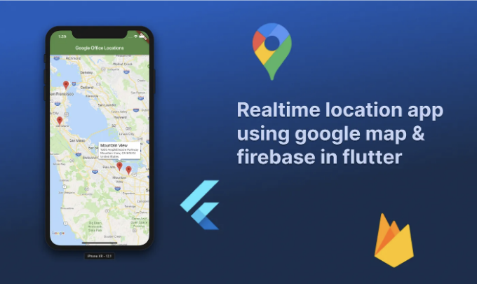
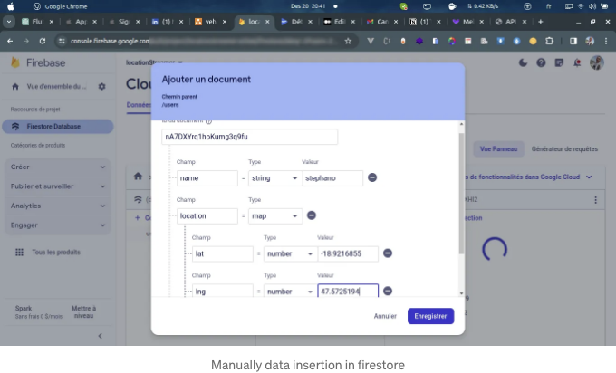

모바일 앱 개발의 동적한 풍경 속에서 실시간 위치 추적 기능을 제공하는 애플리케이션을 만드는 것이 점점 더 중요해지고 있습니다. 실시간 위치를 친구들과 공유하거나 배달 서비스를 추적하거나 다양한 산업 분야에서 사용자 경험을 향상시키는 등, 실시간 위치를 추적하는 앱에 대한 수요가 계속해서 증가하고 있습니다. 이 기사에서는 Flutter, Firebase 및 Google Maps의 힘을 이용하여 강력한 실시간 위치 앱을 개발하는 흥미로운 여정을 살펴보겠습니다.

# 준비물

본 기사에서는 Firebase 프로젝트를 생성하거나 Google API 키를 얻는 과정에 대해 다루지 않습니다. 이미 해당 단계에 익숙하다고 가정합니다 🤝. 익숙하지 않다면, 이전 기사에서 Firebase에 대해 다룬 적이 있고 Google API 키를 얻는 방법은 여기에서 찾을 수 있습니다. 이제 다음 단계로 이동합시다 🤸‍♂️:

<!-- ui-log 수평형 -->

<ins class="adsbygoogle"
      style="display:block"
      data-ad-client="ca-pub-4877378276818686"
      data-ad-slot="9743150776"
      data-ad-format="auto"
      data-full-width-responsive="true"></ins>
<component is="script">
(adsbygoogle = window.adsbygoogle || []).push({});
</component>

# 1. 프로젝트 설정 :

새로운 Flutter 프로젝트를 생성해보세요:

```js
flutter create location_streamer
```

이제 앱에 필요한 종속성을 통합해봅시다:

<!-- ui-log 수평형 -->

<ins class="adsbygoogle"
      style="display:block"
      data-ad-client="ca-pub-4877378276818686"
      data-ad-slot="9743150776"
      data-ad-format="auto"
      data-full-width-responsive="true"></ins>
<component is="script">
(adsbygoogle = window.adsbygoogle || []).push({});
</component>

- google_maps_flutter: 구글 맵 통합을 위해.
- geolocator: 사용자의 실시간 위치를 얻기 위해.
- firebase_core 및 cloud_firestore: Firebase를 사용한 실시간 데이터베이스 기능을 위해.
- permission_handler: 앱에서 필요한 권한을 관리하기 위해.

pubspec.yaml 파일을 열고 다음 라인을 추가하세요:

```js
dependencies:
  google_maps_flutter: ^<latest_version>
  geolocator: ^<latest_version>
  firebase_core: ^<latest_version>
  cloud_firestore: ^<latest_version>
  permission_handler: ^<latest_version>
```

## 1.1 구글 맵 구성하기:

<!-- ui-log 수평형 -->

<ins class="adsbygoogle"
      style="display:block"
      data-ad-client="ca-pub-4877378276818686"
      data-ad-slot="9743150776"
      data-ad-format="auto"
      data-full-width-responsive="true"></ins>
<component is="script">
(adsbygoogle = window.adsbygoogle || []).push({});
</component>

플러터 프로젝트를 설정하고 필요한 종속 항목을 설치한 후에는 Google Maps를 통합하는 방법에 대한 설명서를 참조하세요. 추가로 AndroidManifest.xml 파일에 다음 권한을 포함하십시오:

```js
    <!-- 애플리케이션이 인터넷에 액세스하는 것을 허용합니다 -->
    <uses-permission android:name="android.permission.INTERNET" />

    <!-- 애플리케이션이 포그라운드 서비스를 실행하는 것을 허용합니다 -->
    <uses-permission android:name="android.permission.FOREGROUND_SERVICE" />

    <!-- GPS를 사용하여 정확한 위치에 액세스하는 것을 허용합니다 -->
    <uses-permission android:name="android.permission.ACCESS_FINE_LOCATION" />

    <!-- 네트워크 기반 방법을 사용하여 대략적인 위치에 액세스하는 것을 허용합니다 -->
    <uses-permission android:name="android.permission.ACCESS_COARSE_LOCATION" />

    <!-- 백그라운드에서 위치에 액세스하는 것을 허용합니다 -->
    <uses-permission android:name="android.permission.ACCESS_BACKGROUND_LOCATION" />
```

## 1.2 Firestore 데이터베이스 구성:

- Firebase 콘솔로 이동하여 프로젝트를 선택하거나 필요한 경우 새로운 프로젝트를 생성합니다.
- 프로젝트 내에서 데이터를 저장할 Firestore 인스턴스를 테스트 모드로 생성합니다.
- google-services.json 파일을 다운로드하여 Flutter 앱 디렉토리, 특히 android/app/ 하위에 배치합니다. 또는 CLI 도구를 사용하여 Firebase 구성을 Flutter 앱과 동기화할 수도 있습니다.

<!-- ui-log 수평형 -->

<ins class="adsbygoogle"
      style="display:block"
      data-ad-client="ca-pub-4877378276818686"
      data-ad-slot="9743150776"
      data-ad-format="auto"
      data-full-width-responsive="true"></ins>
<component is="script">
(adsbygoogle = window.adsbygoogle || []).push({});
</component>

Firestore에서 "users"라는 컬렉션을 만들고 다음 형식으로 데이터를 추가하십시오 :

```js
class Location {
  final double lat;
  final double lng;

  Location({
    required this.lat,
    required this.lng,
  });

}

class User {
  final String name;
  final Location location;
  User({
    required this.name,
    required this.location,
  });
}

// 위의 형식은 위도와 경도를 포함하는 Location 클래스와 이름 및 위치를 포함하는 User 클래스를 포함합니다. Firestore의 데이터가
// 이 구조를 따르도록하여 플러터 앱과의 적절한 통합을 보장하십시오.
```



위 좌표 주변의 위치 값을 LatLng(-18.9216855, 47.5725194)로 추가하면 동일한 카메라 뷰에서 모든 사용자를 볼 수 있습니다. 이것은 가짜 데이터일 뿐이지만 실제 애플리케이션에서는 코드에서 관리합니다.

<!-- ui-log 수평형 -->

<ins class="adsbygoogle"
      style="display:block"
      data-ad-client="ca-pub-4877378276818686"
      data-ad-slot="9743150776"
      data-ad-format="auto"
      data-full-width-responsive="true"></ins>
<component is="script">
(adsbygoogle = window.adsbygoogle || []).push({});
</component>

## 1.3 Firestore 구현하기

Firestore 데이터 관리를 위한 Firestore 서비스를 만들어봅시다. 여기서는 사용자 위치를 업데이트하는 메소드와 Firestore 데이터베이스에서 사용자 목록을 가져오는 스트림 메소드를 정의합니다.

```js
class FirestoreService {
  static final _firestore = FirebaseFirestore.instance;

  static Future<void> updateUserLocation(String userId, LatLng location) async {
    try {
      await _firestore.collection('users').doc(userId).update({
        'location': {'lat': location.latitude, 'lng': location.longitude},
      });
    } on FirebaseException catch (e) {
      print('파이어베이스 에러 발생 $e');
    } catch (err) {
      print('에러 발생 $err');
    }
  }

  static Stream<List<User>> userCollectionStream() {
    return _firestore.collection('users').snapshots().map((snapshot) =>
        snapshot.docs.map((doc) => User.fromMap(doc.data())).toList());
  }
}
```

## 1.4 지오로케이션 구현하기

<!-- ui-log 수평형 -->

<ins class="adsbygoogle"
      style="display:block"
      data-ad-client="ca-pub-4877378276818686"
      data-ad-slot="9743150776"
      data-ad-format="auto"
      data-full-width-responsive="true"></ins>
<component is="script">
(adsbygoogle = window.adsbygoogle || []).push({});
</component>

이제 사용자의 위치가 변경될 때 데이터베이스로 위치를 전송해 봅시다. 이를 위해 geolocator 플러그인을 활용할 것입니다. 그러나 사용자의 위치에 액세스하기 전에, permission_handler를 사용하여 필요한 권한을 얻는 것이 중요합니다.

```js
class StreamLocationService {

   static const LocationSettings _locationSettings =
       LocationSettings(distanceFilter: 1);
   static bool _isLocationGranted = false;

   static  Stream<Position>? get onLocationChanged  {
     if (_isLocationGranted) {
       return Geolocator.getPositionStream(locationSettings: _locationSettings);
     }
     return null;
   }

   static Future<bool> askLocationPermission() async {
     _isLocationGranted = await Permission.location.request().isGranted;
     return _isLocationGranted;
   }

}
```

## 1.5 Google 지도 화면에 실시간 사용자 위치 추가:

- StreamLocationService 및 FirestoreService를 사용하여 실시간 사용자 추적을 위한 위치 스트림 설정:

<!-- ui-log 수평형 -->

<ins class="adsbygoogle"
      style="display:block"
      data-ad-client="ca-pub-4877378276818686"
      data-ad-slot="9743150776"
      data-ad-format="auto"
      data-full-width-responsive="true"></ins>
<component is="script">
(adsbygoogle = window.adsbygoogle || []).push({});
</component>

```dart
late StreamSubscription<Position>? locationStreamSubscription;

@override
void initState() {
  super.initState();
  locationStreamSubscription =
      StreamLocationService.onLocationChanged?.listen(
    (position) async {
      await FirestoreService.updateUserLocation(
        'nA7DXYrq1hoKumg3q9fu', // 하드코딩된 uid이지만, 인증 서비스를 사용할 때 연결된 사용자의 uid입니다
        LatLng(position.latitude, position.longitude),
      );
    },
  );
}
```

- 구글맵 위젯을 StreamBuilder로 감싸고 스트림 데이터로 마커를 업데이트하십시오:

```dart
StreamBuilder<List<User>>(
    stream: FirestoreService.userCollectionStream(),
    builder: (context, snapshot) {
      if (!snapshot.hasData) {
        return const Center(
          child: CircularProgressIndicator(),
        );
      }
      final Set<Marker> markers = {};
      for (var i = 0; i < snapshot.data!.length; i++) {
        final user = snapshot.data![i];
        markers.add(
          Marker(
            markerId: MarkerId('${user.name} position $i'),
            icon: user.name == 'stephano'
                ? BitmapDescriptor.defaultMarkerWithHue(
                    BitmapDescriptor.hueRed,
                  )
                : BitmapDescriptor.defaultMarkerWithHue(
                    BitmapDescriptor.hueYellow,
                  ),
            position: LatLng(user.location.lat, user.location.lng),
            onTap: () => {},
          ),
        );
      }
      return GoogleMap(
        initialCameraPosition: _initialPosition,
        markers: markers,
        onMapCreated: (GoogleMapController controller) {
          _controller.complete(controller);
        },
      );
    },
  )
```

스트림을 dispose하는 것을 잊지 마세요.```

<!-- ui-log 수평형 -->

<ins class="adsbygoogle"
      style="display:block"
      data-ad-client="ca-pub-4877378276818686"
      data-ad-slot="9743150776"
      data-ad-format="auto"
      data-full-width-responsive="true"></ins>
<component is="script">
(adsbygoogle = window.adsbygoogle || []).push({});
</component>

md
클래스(MapScreen) 구현이 완료되었습니다:

```js
class MapScreen extends StatefulWidget {
  const MapScreen({super.key});

  @override
  State<MapScreen> createState() => MapScreenState();
}

class MapScreenState extends State<MapScreen> {
  final Completer<GoogleMapController> _controller =
      Completer<GoogleMapController>();

  static const CameraPosition _initialPosition = CameraPosition(
    target: LatLng(-18.9216855, 47.5725194),// 안타나나리보, 마다가스카르 LatLng 🇲🇬
    zoom: 14.4746,
  );

  late StreamSubscription<Position>? locationStreamSubscription;

  @override
  void initState() {
    super.initState();
    locationStreamSubscription =
        StreamLocationService.onLocationChanged?.listen(
      (position) async {
        await FirestoreService.updateUserLocation(
          'nA7DXYrq1hoKumg3q9fu', //하드코딩된 uid이나 이는 인증 서비스를 사용할 때 연결된 사용자의 uid입니다
          LatLng(position.latitude, position.longitude),
        );
      },
    );
  }

  @override
  Widget build(BuildContext context) {
    return Scaffold(
      body: StreamBuilder<List<User>>(
        stream: FirestoreService.userCollectionStream(),
        builder: (context, snapshot) {
          if (!snapshot.hasData) {
            return const Center(
              child: CircularProgressIndicator(),
            );
          }
          final Set<Marker> markers = {};
          for (var i = 0; i < snapshot.data!.length; i++) {
            final user = snapshot.data![i];
            markers.add(
              Marker(
                markerId: MarkerId('${user.name} position $i'),
                icon: user.name == 'stephano'
                    ? BitmapDescriptor.defaultMarkerWithHue(
                        BitmapDescriptor.hueRed,
                      )
                    : BitmapDescriptor.defaultMarkerWithHue(
                        BitmapDescriptor.hueYellow,
                      ),
                position: LatLng(user.location.lat, user.location.lng),
                onTap: () => {},
              ),
            );
          }
          return GoogleMap(
            initialCameraPosition: _initialPosition,
            markers: markers,
            onMapCreated: (GoogleMapController controller) {
              _controller.complete(controller);
            },
          );
        },
      ),
    );
  }

  @override
  void dispose() {
    super.dispose();
    locationStreamSubscription?.cancel();
  }
}
```

<!-- ui-log 수평형 -->

<ins class="adsbygoogle"
      style="display:block"
      data-ad-client="ca-pub-4877378276818686"
      data-ad-slot="9743150776"
      data-ad-format="auto"
      data-full-width-responsive="true"></ins>
<component is="script">
(adsbygoogle = window.adsbygoogle || []).push({});
</component>
