목표: 네이티브 위젯을 만드는 방법을 배우고 위젯을 클릭하여 애플리케이션의 홈 화면을 열 때 리액트 네이티브 앱과 정보를 공유합니다.

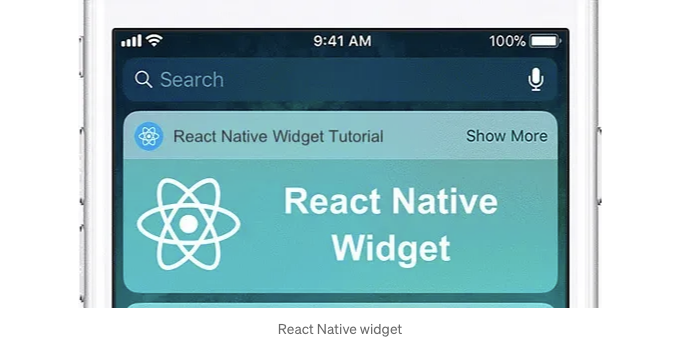

위젯은 앱에 중요한 추가 요소이며 종종 요청이 많이 들어오는 기능입니다.

안타깝게도 React Native를 직접적으로 위젯을 만들 때 사용할 수 없습니다.

<!-- ui-log 수평형 -->

<ins class="adsbygoogle"
      style="display:block"
      data-ad-client="ca-pub-4877378276818686"
      data-ad-slot="9743150776"
      data-ad-format="auto"
      data-full-width-responsive="true"></ins>
<component is="script">
(adsbygoogle = window.adsbygoogle || []).push({});
</component>

# 안드로이드

# 1. 위젯 파일 생성

안드로이드 스튜디오에서 안드로이드 폴더를 엽니다. 그런 다음 안드로이드 스튜디오에서 res에서 마우스 오른쪽 버튼을 클릭하고 새 위젯 '앱 위젯을 선택합니다:
위젯의 이름을 지정하고 구성하고, 끝을 클릭하세요.
다음 창에서 프로젝트에 추가될 파일 몇 개를 보여줍니다. Widget.java 파일은 위젯 동작을 코딩할 위치입니다. 나머지 파일은 위젯 UI 구성 요소를 구현하는 위치입니다. 추가를 클릭하세요.

이제 앱을 실행하면 위젯을 볼 수 있어야 합니다:

<!-- ui-log 수평형 -->

<ins class="adsbygoogle"
      style="display:block"
      data-ad-client="ca-pub-4877378276818686"
      data-ad-slot="9743150776"
      data-ad-format="auto"
      data-full-width-responsive="true"></ins>
<component is="script">
(adsbygoogle = window.adsbygoogle || []).push({});
</component>

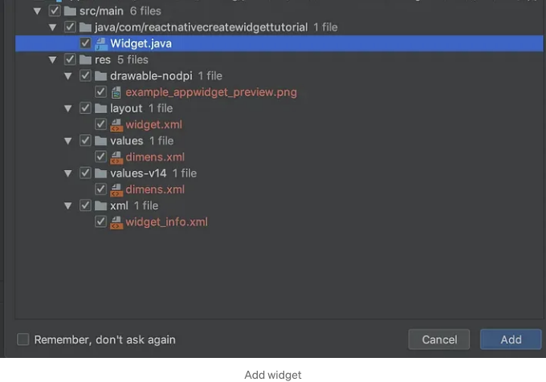

Android Studio에서 애플리케이션을 실행하면 에뮬레이터에서 위젯을 볼 수 있습니다. 이제 위젯이 실행 중이니 조금 개인 설정해봅시다.

2. 위젯 UI 개인 설정 하기 Android Studio에서 앱 폴더를 열고 res -` layout -` widget.xml 파일을 선택하세요:

이렇게 위젯의 레이아웃이 열립니다. "WIDGET"이라고 쓰인 텍스트 뷰가 있는 것을 보실 수 있습니다. 클릭하면 더 많은 세부 정보를 보실 수 있습니다:

<!-- ui-log 수평형 -->

<ins class="adsbygoogle"
      style="display:block"
      data-ad-client="ca-pub-4877378276818686"
      data-ad-slot="9743150776"
      data-ad-format="auto"
      data-full-width-responsive="true"></ins>
<component is="script">
(adsbygoogle = window.adsbygoogle || []).push({});
</component>

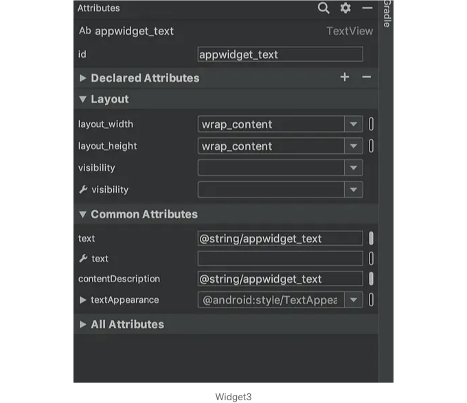

라벨 텍스트를 바꿔봅시다. 라벨 속성을 보시면 텍스트가 "@string/appwidget_text"로 되어 있는 걸 확인할 수 있어요. 이는 res `values` strings.xml에 위치해 있어요.
이 파일을 열어보시면 텍스트가 정의되어 있는 걸 볼 수 있을 거에요.
"위젯"이라는 텍스트를 "안녕"으로 바꾸고, 파일을 저장한 후 앱을 다시 실행하면 위젯에 반영되어 있을 거에요.

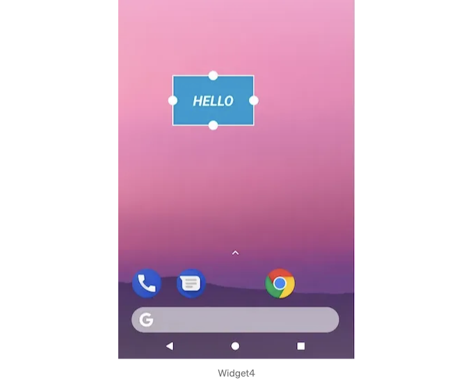

좋아요, 이제 위젯을 커스터마이징하는 방법을 알았네요. 그 다음은 React Native 앱을 통해 이를 구현하는 방법을 알아봅시다.

<!-- ui-log 수평형 -->

<ins class="adsbygoogle"
      style="display:block"
      data-ad-client="ca-pub-4877378276818686"
      data-ad-slot="9743150776"
      data-ad-format="auto"
      data-full-width-responsive="true"></ins>
<component is="script">
(adsbygoogle = window.adsbygoogle || []).push({});
</component>

# 3. 위젯과 React Native 앱 간의 통신 채널 생성하기

그럼 이제 다시 재미있는 부분으로 넘어가볼게요. 우리 React Native 앱이 위젯에 무엇을 보여줄지 제어하도록 해보겠습니다. 이를 위해서는 React Native 앱이 위젯과 통신할 수 있는 방법을 구현해야 합니다. 이를 위해 SharedPreferences Android-native 모듈을 사용하여 위젯과 React Native 앱 간에 공유 저장소를 만들 것입니다.

우리는 React Native 앱이 SharedPreferences에 쓰고, 그 값을 위젯이 읽을 수 있도록 할 것입니다. 첫 번째 문제는 공식적인 React Native 방법이 없다는 것이었고, 이를 위한 좋은 라이브러리를 찾지 못했습니다. 그래서 직접 구현해보도록 하겠습니다.

호출하기 위해서 React Native와 네이티브 Android 간의 브리지를 만들 것입니다.

<!-- ui-log 수평형 -->

<ins class="adsbygoogle"
      style="display:block"
      data-ad-client="ca-pub-4877378276818686"
      data-ad-slot="9743150776"
      data-ad-format="auto"
      data-full-width-responsive="true"></ins>
<component is="script">
(adsbygoogle = window.adsbygoogle || []).push({});
</component>

프로젝트 내 MainActivity.java 파일 옆에 SharedStorage.java 및 SharedStoragePackager.java 파일을 두 개 추가해주세요:

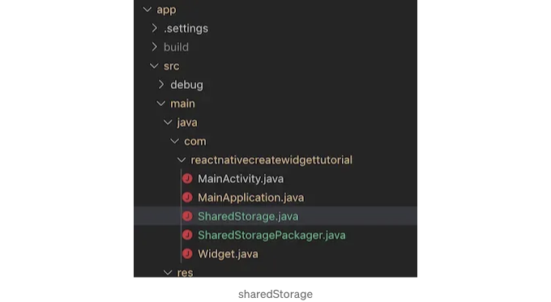

다음 내용을 SharedStoragePackager.java 파일에 복사해주세요:

```js
// 패키지 이름을 여기에 넣어주세요. MainApplication.java 파일에 있는 패키지 이름과 같아야 합니다.
package com.reactnativecreatewidgettutorial;

import com.facebook.react.ReactPackage;
import com.facebook.react.bridge.JavaScriptModule;
import com.facebook.react.bridge.NativeModule;
import com.facebook.react.bridge.ReactApplicationContext;
import com.facebook.react.uimanager.ViewManager;

import java.util.ArrayList;
import java.util.Collections;
import java.util.List;

public class SharedStoragePackager implements ReactPackage {

 @Override
 public List<ViewManager> createViewManagers(ReactApplicationContext reactContext) {
  return Collections.emptyList();
 }

 @Override
 public List<NativeModule> createNativeModules(ReactApplicationContext reactContext) {
  List<NativeModule> modules = new ArrayList<>();

  modules.add(new SharedStorage(reactContext));

  return modules;
 }

}
```

<!-- ui-log 수평형 -->

<ins class="adsbygoogle"
      style="display:block"
      data-ad-client="ca-pub-4877378276818686"
      data-ad-slot="9743150776"
      data-ad-format="auto"
      data-full-width-responsive="true"></ins>
<component is="script">
(adsbygoogle = window.adsbygoogle || []).push({});
</component>

중요한 점: 패키지 이름 com.reactnativecreatewidgettutorial을 자신의 것으로 변경해주세요. 그리고 Widget.class를 자신의 위젯 클래스 이름으로 바꿔주세요.

이제 React Native에서 SharedStorage를 호출할 수 있습니다. 코드에 나와 있는 것처럼, 이 기능은 JSON을 받아 SharedPreferences에 저장한 다음 위젯에게 업데이트하라고 알려줍니다.

Android가 모듈이 존재함을 알 수 있도록 MainApplication.java 파일의 패키지 목록에 추가하십시오.

```js
new SharedStoragePackager();
```

<!-- ui-log 수평형 -->

<ins class="adsbygoogle"
      style="display:block"
      data-ad-client="ca-pub-4877378276818686"
      data-ad-slot="9743150776"
      data-ad-format="auto"
      data-full-width-responsive="true"></ins>
<component is="script">
(adsbygoogle = window.adsbygoogle || []).push({});
</component>

# 4. React Native 앱에서 위젯 콘텐츠 제어하기

React Native 측에서 모듈을 가져오겠습니다.

참고: 이미 React Native 코드를 수정했다면, 이 부분은 건너뛰세요.

```js
import { NativeModules } from "react-native";
const SharedStorage = NativeModules.SharedStorage;
```

<!-- ui-log 수평형 -->

<ins class="adsbygoogle"
      style="display:block"
      data-ad-client="ca-pub-4877378276818686"
      data-ad-slot="9743150776"
      data-ad-format="auto"
      data-full-width-responsive="true"></ins>
<component is="script">
(adsbygoogle = window.adsbygoogle || []).push({});
</component>

그럼 저장소로 데이터를 전송해 봅시다:

```js
SharedStorage.set(JSON.stringify({ text: "이것은 React Native 앱에서 가져온 데이터입니다" }));
```

예를 들어 App.tsx 파일이나 React Native 코드에서 데이터를 설정하기에 적절한 위치에 이 작업을 할 수 있습니다:

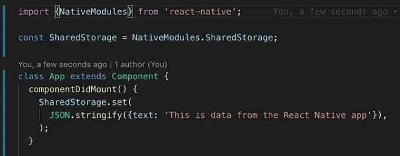

<!-- ui-log 수평형 -->

<ins class="adsbygoogle"
      style="display:block"
      data-ad-client="ca-pub-4877378276818686"
      data-ad-slot="9743150776"
      data-ad-format="auto"
      data-full-width-responsive="true"></ins>
<component is="script">
(adsbygoogle = window.adsbygoogle || []).push({});
</component>

이제 남은 일은 위젯이 데이터를 읽고 UI에 삽입하는 것입니다. 위젯을, 데이터를 읽은 다음 "HELLO" 라벨에 데이터를 출력하기 위해 연결할 것입니다.

Widget 폴더의 Widget.java 파일로 이동하고 다음 모듈을 가져오세요:

```java
import android.content.SharedPreferences;
import org.json.JSONException;
import org.json.JSONObject;
```

이제 widget.java 파일의 updateAppWidget 함수를 다음처럼 수정하세요:

<!-- ui-log 수평형 -->

<ins class="adsbygoogle"
      style="display:block"
      data-ad-client="ca-pub-4877378276818686"
      data-ad-slot="9743150776"
      data-ad-format="auto"
      data-full-width-responsive="true"></ins>
<component is="script">
(adsbygoogle = window.adsbygoogle || []).push({});
</component>

```java
package com.reactnativecreatewidgettutorial;

import android.appwidget.AppWidgetManager;
import android.appwidget.AppWidgetProvider;
import android.content.Context;
import android.widget.RemoteViews;
import android.content.SharedPreferences;

import org.json.JSONException;
import org.json.JSONObject;
/**
 * App 위젯 기능 구현.
 */
public class Widget extends AppWidgetProvider {

    static void updateAppWidget(Context context, AppWidgetManager appWidgetManager,
                                int appWidgetId) {

  try {
   SharedPreferences sharedPref = context.getSharedPreferences("DATA", Context.MODE_PRIVATE);
   String appString = sharedPref.getString("appData", "{\"text\":'no data'}");
   JSONObject appData = new JSONObject(appString);

   // RemoteViews 객체 생성
   RemoteViews views = new RemoteViews(context.getPackageName(), R.layout.widget);
   views.setTextViewText(R.id.appwidget_text, appData.getString("text"));
    // 위젯을 업데이트하도록 위젯 관리자에 지시
    appWidgetManager.updateAppWidget(appWidgetId, views);
  }catch (JSONException e) {
   e.printStackTrace();
  }
    }

    @Override
    public void onUpdate(Context context, AppWidgetManager appWidgetManager, int[] appWidgetIds) {
        // 여러 위젯이 활성 상태일 수 있으므로 모두 업데이트
        for (int appWidgetId : appWidgetIds) {
            updateAppWidget(context, appWidgetManager, appWidgetId);
        }
    }

    @Override
    public void onEnabled(Context context) {
        // 첫 번째 위젯이 생성될 때의 기능 수행
    }

    @Override
    public void onDisabled(Context context) {
        // 마지막 위젯이 비활성화될 때의 기능 수행
    }
}
```

updateAppWidget 함수를 수정하여 위젯 내용을 업데이트하는 역할인데, 이제 위젯은 SharedPreferences 데이터베이스에서 읽어와 텍스트 라벨에 데이터를 표시하도록 설정됩니다.

여기까지입니다. 이제 React Native 앱이 위젯 내용을 제어합니다. 앱을 실행하고 위젯을 확인해보세요 (앱을 실행하고 열어서 SharedStorage에 쓰도록 해야합니다):

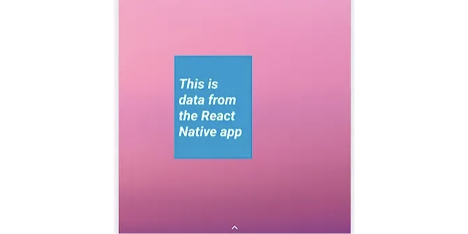
```

<!-- ui-log 수평형 -->

<ins class="adsbygoogle"
      style="display:block"
      data-ad-client="ca-pub-4877378276818686"
      data-ad-slot="9743150776"
      data-ad-format="auto"
      data-full-width-responsive="true"></ins>
<component is="script">
(adsbygoogle = window.adsbygoogle || []).push({});
</component>

# iOS

# 1. 위젯 파일 만들기

위젯(이 iOS에서는 Today Extension이라고 불립니다)을 Xcode에서 워크스페이스 파일을 열고 File > New > Target를 클릭하여 생성하세요:

Today Extension을 선택하고 Next를 클릭하세요.

<!-- ui-log 수평형 -->

<ins class="adsbygoogle"
      style="display:block"
      data-ad-client="ca-pub-4877378276818686"
      data-ad-slot="9743150776"
      data-ad-format="auto"
      data-full-width-responsive="true"></ins>
<component is="script">
(adsbygoogle = window.adsbygoogle || []).push({});
</component>

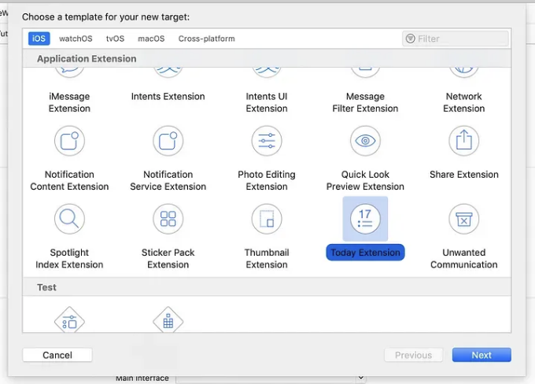

Give it a name, and choose your preferred language. In this case, I’m going to choose Swift. Click Finish:

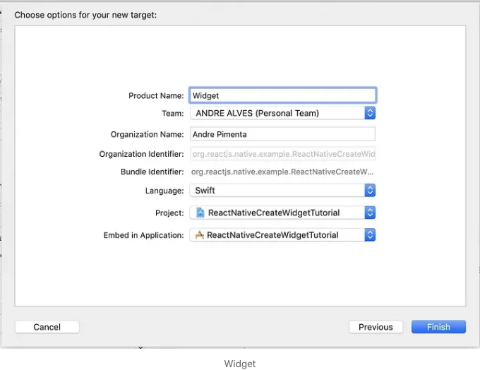

You should see the Widget folder on your project:

<!-- ui-log 수평형 -->

<ins class="adsbygoogle"
      style="display:block"
      data-ad-client="ca-pub-4877378276818686"
      data-ad-slot="9743150776"
      data-ad-format="auto"
      data-full-width-responsive="true"></ins>
<component is="script">
(adsbygoogle = window.adsbygoogle || []).push({});
</component>


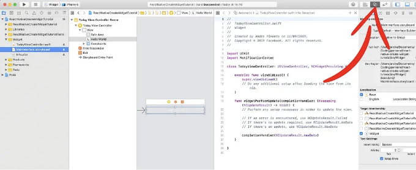

<!-- ui-log 수평형 -->

<ins class="adsbygoogle"
      style="display:block"
      data-ad-client="ca-pub-4877378276818686"
      data-ad-slot="9743150776"
      data-ad-format="auto"
      data-full-width-responsive="true"></ins>
<component is="script">
(adsbygoogle = window.adsbygoogle || []).push({});
</component>

두 가지 함수인 viewDidLoad와 widgetPerformUpdate가 있는 것을 볼 수 있어요. viewDidLoad 함수는 사용자가 위젯 화면으로 전환할 때마다 실행돼요. 그래서 이곳에서 변수, 레이블 또는 뷰를 초기화해야 해요. widgetPerformUpdate 함수는 위젯 콘텐츠를 업데이트해야 할 때 호출돼요.

2. 위젯 UI를 사용자 정의하세요. 화면에서 "Hello World" 텍스트가 있는 레이블을 볼 수 있어요. 이 레이블을 코드로 드래그하여 사용자 정의할 수 있어요. 레이블을 마우스 오른쪽 버튼으로 클릭하고 새 참조 아웃렛을 클래스 내 코드로 직접 드래그하세요.

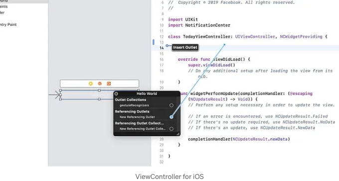

# 3. 위젯과 React Native 앱 간의 통신 채널을 생성하기

<!-- ui-log 수평형 -->

<ins class="adsbygoogle"
      style="display:block"
      data-ad-client="ca-pub-4877378276818686"
      data-ad-slot="9743150776"
      data-ad-format="auto"
      data-full-width-responsive="true"></ins>
<component is="script">
(adsbygoogle = window.adsbygoogle || []).push({});
</component>

그럼 이제 즐거운 부분을 시작해봅시다. React Native 앱이 위젯이 표시하는 내용을 제어하도록 해 보겠습니다. 이를 위해 React Native 앱과 위젯 사이의 통신 방법을 구현해야 합니다. 이를 위해 UserDefaults iOS 네이티브 모듈을 사용하여 구현할 거에요.

React Native 앱이 UserDefaults에 작성하고 위젯이 그것을 읽도록 할 거예요. 첫 번째 문제는 공식적인 React Native 방법이 없다는 것을 발견했으며, 이를 수행할 수 있는 좋은 라이브러리를 찾지 못했습니다. 그래서 React Native와 네이티브 iOS 사이에 브릿지를 만들어 직접 구현해 봅시다.

먼저, 앱 내에 위젯과 앱 간 통신을 가능하게 하는 공간을 만들어야 해요. 이는 Capabilities 탭 아래에 위치한 App Groups를 사용하여 수행할 수 있습니다.

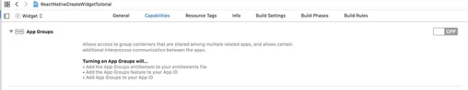

<!-- ui-log 수평형 -->

<ins class="adsbygoogle"
      style="display:block"
      data-ad-client="ca-pub-4877378276818686"
      data-ad-slot="9743150776"
      data-ad-format="auto"
      data-full-width-responsive="true"></ins>
<component is="script">
(adsbygoogle = window.adsbygoogle || []).push({});
</component>

활성화한 다음 그룹을 선택하거나 추가하세요.

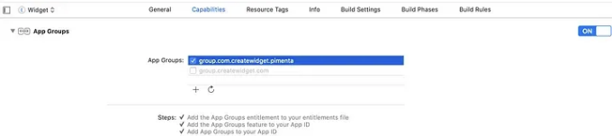

프로젝트를 선택하고 새 파일을 추가하려면 마우스 오른쪽 버튼을 클릭하세요.

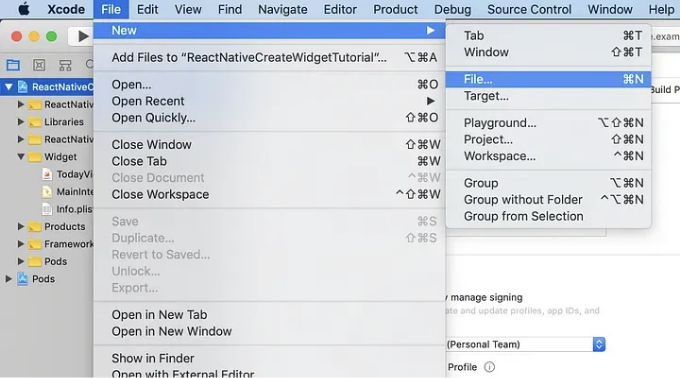

<!-- ui-log 수평형 -->

<ins class="adsbygoogle"
      style="display:block"
      data-ad-client="ca-pub-4877378276818686"
      data-ad-slot="9743150776"
      data-ad-format="auto"
      data-full-width-responsive="true"></ins>
<component is="script">
(adsbygoogle = window.adsbygoogle || []).push({});
</component>

Cocoa Touch Class를 선택하고 다음을 클릭하세요:

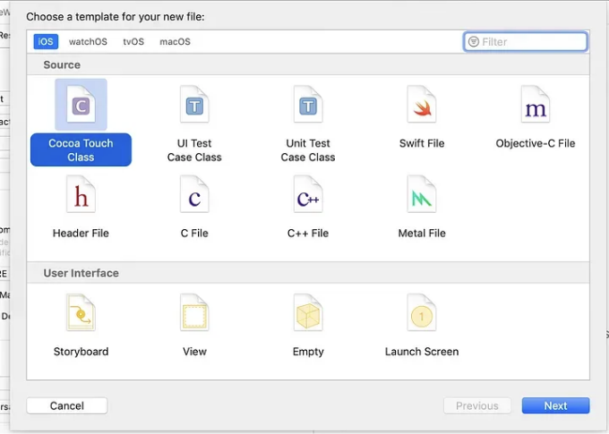

위젯과 React Native 앱에서 공유될 저장소이기 때문에 SharedStorage로 이름 짓겠습니다. Objective-C를 선택하고 다음을 클릭하세요:

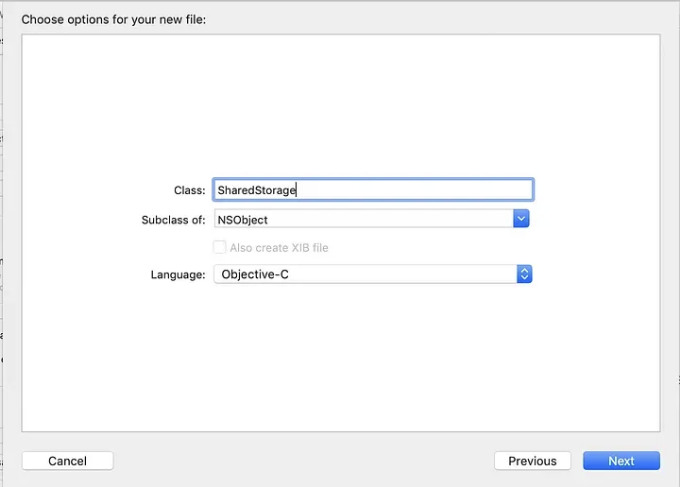

<!-- ui-log 수평형 -->

<ins class="adsbygoogle"
      style="display:block"
      data-ad-client="ca-pub-4877378276818686"
      data-ad-slot="9743150776"
      data-ad-format="auto"
      data-full-width-responsive="true"></ins>
<component is="script">
(adsbygoogle = window.adsbygoogle || []).push({});
</component>

이제 프로젝트에 새 파일이 나타났어요:
이 파일들을 편집합시다. 먼저 이 내용을 SharedStorage.h 파일에 복사해주세요.

```js
//
//  SharedStorage.h
//  hodl
//
//  Created by Andre Pimenta on 19/09/2018.
//  Copyright © 2018 Facebook. All rights reserved.
//

#import "React/RCTBridgeModule.h"

@interface SharedStorage : NSObject <RCTBridgeModule>

@end
```

그리고 이 내용을 SharedStorage.m 파일에 붙여넣어주세요:

```js
//
//  SharedStorage.m
//  hodl
//
//  Created by Andre Pimenta on 19/09/2018.
//  Copyright © 2018 Facebook. All rights reserved.
//

#import "SharedStorage.h"
#import "React/RCTLog.h"

@implementation SharedStorage

RCT_EXPORT_MODULE();

// 우리 JavaScript 환경으로 promise를 전송할 수 있어요 :)
RCT_EXPORT_METHOD(set:(NSString *)data
                  resolver:(RCTPromiseResolveBlock)resolve
                  rejecter:(RCTPromiseRejectBlock)reject)
{
  @try{
    // 여기서 그룹을 변경해주세요
    NSUserDefaults *shared = [[NSUserDefaults alloc]initWithSuiteName:@"group.com.createwidget.pimenta"];
    [shared setObject:data forKey:@"data"];
    [shared synchronize];
    resolve(@"true");
  }@catch(NSException *exception){
    reject(@"get_error",exception.reason, nil);
  }

}

@end
```

<!-- ui-log 수평형 -->

<ins class="adsbygoogle"
      style="display:block"
      data-ad-client="ca-pub-4877378276818686"
      data-ad-slot="9743150776"
      data-ad-format="auto"
      data-full-width-responsive="true"></ins>
<component is="script">
(adsbygoogle = window.adsbygoogle || []).push({});
</component>

중요: 그룹 이름 (group.com.createwidget.pimenta)을 App 그룹에서 생성한 이름으로 변경해주세요.

이제 React Native에서 SharedStorage를 호출할 수 있습니다. 코드에서 볼 수 있듯이, SharedStorage는 단순히 JSON을 받아 UserDefaults 저장소에 저장합니다.

# 4. React Native 앱으로 위젯 콘텐츠 제어하기

React Native 측에서 모듈을 가져와봅시다:

<!-- ui-log 수평형 -->

<ins class="adsbygoogle"
      style="display:block"
      data-ad-client="ca-pub-4877378276818686"
      data-ad-slot="9743150776"
      data-ad-format="auto"
      data-full-width-responsive="true"></ins>
<component is="script">
(adsbygoogle = window.adsbygoogle || []).push({});
</component>

```js
import { NativeModules } from "react-native";
const SharedStorage = NativeModules.SharedStorage;
```

그런 다음 저장소로 일부 데이터를 보내 봅시다:

```js
SharedStorage.set(JSON.stringify({ text: "리액트 네이티브 앱에서 온 데이터입니다" }));
```

예를 들어 App.tsx 파일이나 데이터를 설정하는 것이 적절한 React Native 코드에서 이 작업을 수행할 수 있습니다:```

<!-- ui-log 수평형 -->

<ins class="adsbygoogle"
      style="display:block"
      data-ad-client="ca-pub-4877378276818686"
      data-ad-slot="9743150776"
      data-ad-format="auto"
      data-full-width-responsive="true"></ins>
<component is="script">
(adsbygoogle = window.adsbygoogle || []).push({});
</component>

이제 해야 할 일은 위젯이 데이터를 읽어 UI에 삽입하도록 만드는 것뿐입니다. 위젯을 UserDefaults에 연결하고 데이터를 읽은 다음에 그 데이터를 "Hello World" 텍스트 레이블에 출력할 것입니다.

Widget 폴더의 TodayViewController.swift 파일로 이동하여 viewDidLoad 함수를 다음과 같이 편집하세요:

```js
package com.reactnativecreatewidgettutorial;

import android.appwidget.AppWidgetManager;
import android.appwidget.AppWidgetProvider;
import android.content.Context;
import android.widget.RemoteViews;
import android.content.SharedPreferences;

import org.json.JSONException;
import org.json.JSONObject;
/**
 * App 위젯 기능 구현.
 */
public class Widget extends AppWidgetProvider {

    static void updateAppWidget(Context context, AppWidgetManager appWidgetManager,
                                int appWidgetId) {

  try {
   SharedPreferences sharedPref = context.getSharedPreferences("DATA", Context.MODE_PRIVATE);
   String appString = sharedPref.getString("appData", "{\"text\":'no data'}");
   JSONObject appData = new JSONObject(appString);

   // RemoteViews 객체 생성
   RemoteViews views = new RemoteViews(context.getPackageName(), R.layout.widget);
   views.setTextViewText(R.id.appwidget_text, appData.getString("text"));
    // 위젯 매니저에 위젯 업데이트 지시
    appWidgetManager.updateAppWidget(appWidgetId, views);
  }catch (JSONException e) {
   e.printStackTrace();
  }
    }

    @Override
    public void onUpdate(Context context, AppWidgetManager appWidgetManager, int[] appWidgetIds) {
        // 활성 상태인 여러 위젯이 있을 수 있으므로 모두 업데이트
        for (int appWidgetId : appWidgetIds) {
            updateAppWidget(context, appWidgetManager, appWidgetId);
        }
    }

    @Override
    public void onEnabled(Context context) {
        // 첫 번째 위젯이 생성될 때 필요한 기능 입력
    }

    @Override
    public void onDisabled(Context context) {
        // 마지막 위젯이 비활성화될 때 필요한 기능 입력
    }
}
```

중요: 그룹 이름 (group.com.createwidget.pimenta)을 App Groups에서 만든 그룹 이름으로 바꿔주세요.

<!-- ui-log 수평형 -->

<ins class="adsbygoogle"
      style="display:block"
      data-ad-client="ca-pub-4877378276818686"
      data-ad-slot="9743150776"
      data-ad-format="auto"
      data-full-width-responsive="true"></ins>
<component is="script">
(adsbygoogle = window.adsbygoogle || []).push({});
</component>

어플리케이션을 실행해서 위젯을 확인해 보세요 (SharedStorage를 작성하기 위해 앱을 실행하고 열어야 합니다):

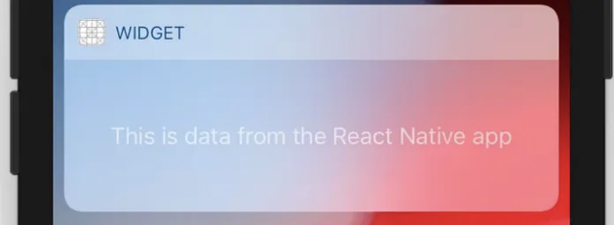

이로써 iOS에 대한 내용은 마무리되었습니다.

이 기사를 읽어 주셔서 감사합니다! 👏를 누르지 않으셨다면 잊지 마세요.

<!-- ui-log 수평형 -->

<ins class="adsbygoogle"
      style="display:block"
      data-ad-client="ca-pub-4877378276818686"
      data-ad-slot="9743150776"
      data-ad-format="auto"
      data-full-width-responsive="true"></ins>
<component is="script">
(adsbygoogle = window.adsbygoogle || []).push({});
</component>
