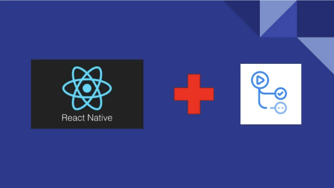

# 소개

이전 글에서 Github Actions를 사용하여 Android 및 iOS 앱을 빌드하는 방법에 대해 설명했습니다. 아래 링크에서 확인할 수 있어요: [링크](https://medium.com/scaleuptech/how-to-make-react-native-builds-with-github-actions-8d0203801eff)

본 글에서는 이 빌드를 Firebase App Distribution에 테스트 용으로 업로드하는 방법과 Play 스토어 및 App 스토어에 제품으로 업로드하는 방법에 대해 설명하겠습니다.

<!-- ui-log 수평형 -->

<ins class="adsbygoogle"
      style="display:block"
      data-ad-client="ca-pub-4877378276818686"
      data-ad-slot="9743150776"
      data-ad-format="auto"
      data-full-width-responsive="true"></ins>
<component is="script">
(adsbygoogle = window.adsbygoogle || []).push({});
</component>

# Firebase App Distribution에 업로드하기

'스테이징' 브랜치를 사용하여 Firebase App Distribution에 업로드하면 테스트 프로세스를 간소화할 수 있습니다. 이를 통해 테스터들이 다양한 기기에서 앱의 성능을 철저히 평가할 수 있는 제어된 환경을 제공합니다. 이 접근 방식을 통해 제품 단계에서 앱이 더 넓은 관객에게 도달하기 전에 잠재적인 문제점을 식별하고 해결할 수 있습니다.

실제 워크플로로 넘어가기 전에 몇 가지 작업을 해야하고 Github 시크릿을 추가해야 합니다.

## 앱 ID

<!-- ui-log 수평형 -->

<ins class="adsbygoogle"
      style="display:block"
      data-ad-client="ca-pub-4877378276818686"
      data-ad-slot="9743150776"
      data-ad-format="auto"
      data-full-width-responsive="true"></ins>
<component is="script">
(adsbygoogle = window.adsbygoogle || []).push({});
</component>

Firebase 프로젝트로 이동하여 일반 설정 페이지로 이동하세요. iOS appId와 Android appId를 찾을 수 있어요.

찾으셨다면, 이제 그것들을 저장소 시크릿에 추가해야 해요. 이를 위해 Github 프로젝트로 이동한 다음, 설정을 누르고, 시크릿과 변수, 그리고 액션으로 이동하세요. 거기에서 '새 저장소 시크릿' 버튼을 볼 수 있어요. 두 개의 저장소 시크릿이 필요할 거예요. 여기 있어요:

FIREBASE_ANDROID_APP_ID
Android appId를 'Secret'로 표시된 텍스트 상자에 붙여넣으세요.

FIREBASE_IOS_APP_ID
iOS appId를 'Secret'로 표시된 텍스트 상자에 붙여넣으세요.

<!-- ui-log 수평형 -->

<ins class="adsbygoogle"
      style="display:block"
      data-ad-client="ca-pub-4877378276818686"
      data-ad-slot="9743150776"
      data-ad-format="auto"
      data-full-width-responsive="true"></ins>
<component is="script">
(adsbygoogle = window.adsbygoogle || []).push({});
</component>

## serviceCredentialsFileContent

서비스 자격 증명 파일 내용을 가져오려면 다음 단계를 따르세요:

- Google Cloud Console을 엽니다
- 프로젝트를 선택합니다
- 서비스 계정 생성을 클릭합니다
- 계정 이름을 입력하고 생성 및 계속하기를 누릅니다
- 역할 입력란에서 Firebase App Distribution Admin을 선택하고 완료를 클릭합니다
- 그런 다음 계정 목록에서 새로 생성된 서비스 계정을 찾습니다. 3점 메뉴를 클릭하고 키 관리를 클릭합니다
- 키 추가를 클릭하고 새 키를 생성하십시오
- 유형을 JSON으로 선택하고 만들기를 클릭합니다
- 이후에 파일이 디스크로 다운로드되어야 합니다. 파일을 열고 해당 내용을 복사합니다
- 새 비밀을 생성합니다. CREDENTIAL_FILE_CONTENT로 이름을 지정합니다. 비밀 값은 9번에서 복사한 파일 내용입니다

이제 모든 준비가 완료되어 실제 워크플로로 이동할 수 있습니다.

<!-- ui-log 수평형 -->

<ins class="adsbygoogle"
      style="display:block"
      data-ad-client="ca-pub-4877378276818686"
      data-ad-slot="9743150776"
      data-ad-format="auto"
      data-full-width-responsive="true"></ins>
<component is="script">
(adsbygoogle = window.adsbygoogle || []).push({});
</component>

## iOS 앱을 App Distribution에 업로드하기

여기에는 ipa 파일을 App Distribution에 업로드하는 yaml 파일 부분이 있습니다.

```js
  distribute_on_linux:
    runs-on: ubuntu-latest
    needs: [build_with_signing]
    steps:
      - name: 코드 체크아웃
        uses: actions/checkout@v2

      - name: 아티팩트 다운로드
        uses: actions/download-artifact@v2
        with:
          name: your_app.ipa

      - name: Firebase App Distribution으로 아티팩트 업로드
        uses: wzieba/Firebase-Distribution-Github-Action@v1
        with:
          appId: ${{ secrets.FIREBASE_IOS_APP_ID }}
          serviceCredentialsFileContent: ${{ secrets.FIREBASE_CREDENTIAL_FILE_CONTENT }}
          testers: |
            example1@gmail.com
            example2@gmail.com
          file: your_app.ipa
```

그리고 전체 yaml 파일은 다음과 같습니다:

<!-- ui-log 수평형 -->

<ins class="adsbygoogle"
      style="display:block"
      data-ad-client="ca-pub-4877378276818686"
      data-ad-slot="9743150776"
      data-ad-format="auto"
      data-full-width-responsive="true"></ins>
<component is="script">
(adsbygoogle = window.adsbygoogle || []).push({});
</component>

```js
name: "iOS 스테이징 앱 빌드"

on:
  push:
    branches:
      - staging

jobs:
  build_with_signing:
    runs-on: macos-latest
    steps:
      - name: Xcode 버전 확인
        run: /usr/bin/xcodebuild -version
      - name: 저장소 체크아웃
        uses: actions/checkout@v3
      - name: 디버그 워크플로 변수
        run: |
          echo "CERTIFICATE_PATH: $CERTIFICATE_PATH"
          echo "PP_PATH: $PP_PATH"
          echo "KEYCHAIN_PATH: $KEYCHAIN_PATH"
          echo "P12_PASSWORD: $P12_PASSWORD"
      - name: Apple 인증서 및 프로비저닝 프로파일 설치
        env:
          BUILD_CERTIFICATE_BASE64: ${secrets.BUILD_CERTIFICATE_BASE64}
          P12_PASSWORD: ${secrets.P12_PASSWORD}
          PROVISION_PROFILES_BASE64: ${secrets.PROVISION_PROFILES_BASE64}
          KEYCHAIN_PASSWORD: ${secrets.KEYCHAIN_PASSWORD}
        run: |
          CERTIFICATE_PATH=$RUNNER_TEMP/build_certificate.p12
          PP_ARCHIVE=$RUNNER_TEMP/mobile_pp.tgz
          KEYCHAIN_PATH=$RUNNER_TEMP/app-signing.keychain-db

          echo -n "$BUILD_CERTIFICATE_BASE64" | base64 --decode -o $CERTIFICATE_PATH
          echo -n "$PROVISION_PROFILES_BASE64" | base64 --decode -o $PP_ARCHIVE

          security create-keychain -p "$KEYCHAIN_PASSWORD" $KEYCHAIN_PATH
          security set-keychain-settings -lut 21600 $KEYCHAIN_PATH
          security unlock-keychain -p "$KEYCHAIN_PASSWORD" $KEYCHAIN_PATH

          echo "P12_PASSWORD: $P12_PASSWORD"
          security import $CERTIFICATE_PATH -P "$P12_PASSWORD" -A -t cert -f pkcs12 -k $KEYCHAIN_PATH
          security list-keychain -d user -s $KEYCHAIN_PATH

          mkdir -p ~/Library/MobileDevice/Provisioning\ Profiles
          tar xzvf $PP_ARCHIVE -C $RUNNER_TEMP
          for PROVISION in `ls $RUNNER_TEMP/*.mobileprovision`
          do
            UUID=`/usr/libexec/PlistBuddy -c 'Print :UUID' /dev/stdin <<< $(security cms -D -i $PROVISION)`
            cp $PROVISION ~/Library/MobileDevice/Provisioning\ Profiles/$UUID.mobileprovision
          done

          security find-identity -v -p codesigning
          ls -l ~/Library/MobileDevice/Provisioning\ Profiles

      - uses: actions/setup-node@v3
        with:
          node-version: '18'
          cache: 'yarn'

      - name: 작업공간 정리
        run: |
          git clean -ffdx
          npm cache clean --force

      - name: Xcode 빌드 정리
        run: |
          cd ios
          xcodebuild clean -workspace your_app.xcworkspace -scheme your_app

      - name: yarn 종속성 설치
        run: |
          cd ios
          yarn install

      - name: Cocoapod 종속성 설치
        run: |
          cd ios
          pod repo update
          pod install

      - name: 아카이브 빌드
        run: |
          cd ios
          xcodebuild -workspace your_app.xcworkspace \
          -scheme "your_app" \
          -sdk iphoneos \
          -configuration Debug \
          -destination generic/platform=iOS \
          -archivePath $RUNNER_TEMP/your_app.xcarchive \
          archive

      - name: ipa 내보내기
        env:
          EXPORT_OPTIONS_PLIST: ${secrets.EXPORT_OPTIONS_PLIST}
        run: |
          EXPORT_OPTS_PATH=$RUNNER_TEMP/ExportOptions.plist
          echo -n "$EXPORT_OPTIONS_PLIST" | base64 --decode -o $EXPORT_OPTS_PATH
          xcodebuild -exportArchive -archivePath $RUNNER_TEMP/your_app.xcarchive -exportOptionsPlist $EXPORT_OPTS_PATH -exportPath $RUNNER_TEMP/build

      - name: 애플리케이션 업로드
        uses: actions/upload-artifact@v3
        with:
          name: your_app.ipa
          path: ${runner.temp}/build/Apps/your_app.ipa

  distribute_on_linux:
    runs-on: ubuntu-latest
    needs: [build_with_signing]
    steps:
      - name: 코드 체크아웃
        uses: actions/checkout@v2

      - name: 아티팩트 다운로드
        uses: actions/download-artifact@v2
        with:
          name: your_app.ipa

      - name: Firebase 앱 배포에 아티팩트 업로드
        uses: wzieba/Firebase-Distribution-Github-Action@v1
        with:
          appId: ${secrets.FIREBASE_IOS_APP_ID}
          serviceCredentialsFileContent: ${secrets.FIREBASE_CREDENTIAL_FILE_CONTENT}
          testers: |
            example1@gmail.com
            example2@gmail.com
          file: your_app.ipa
```

중요한 점은 이 작업을 위해 두 개의 작업을 가지고 있어야 한다는 것입니다. 첫 번째는 macOS에서 실행되는 ipa 파일을 빌드하고 내보내는 작업이고, 두 번째는 해당 ipa 파일을 다운로드하고 ubuntu에서 앱 배포에 업로드하는 작업입니다. 두 번째 작업에서는 다음 라인을 추가해야 합니다:

```js
needs: [build_with_signing];
```

이는 업로드를 하기 위해 먼저 ipa 파일을 얻어야 하기 때문에 필요합니다.```

<!-- ui-log 수평형 -->

<ins class="adsbygoogle"
      style="display:block"
      data-ad-client="ca-pub-4877378276818686"
      data-ad-slot="9743150776"
      data-ad-format="auto"
      data-full-width-responsive="true"></ins>
<component is="script">
(adsbygoogle = window.adsbygoogle || []).push({});
</component>

## Android 앱을 App Distribution에 업로드하는 방법

이곳은 apk 파일을 App Distribution에 업로드하는 부분을 처리하는 yaml 파일의 일부입니다.

```js
      - name: Firebase App Distribution에 아티팩트 업로드
        uses: wzieba/Firebase-Distribution-Github-Action@v1
        with:
          appId: ${ secrets.FIREBASE_ANDROID_APP_ID }
          serviceCredentialsFileContent: ${ secrets.FIREBASE_CREDENTIAL_FILE_CONTENT }
          testers: |
            examle1@gmail.com
            example2@gmail.com
          file: android/app/build/outputs/apk/release/app-release.apk
```

여기에 전체 yaml 파일이 있습니다:

<!-- ui-log 수평형 -->

<ins class="adsbygoogle"
      style="display:block"
      data-ad-client="ca-pub-4877378276818686"
      data-ad-slot="9743150776"
      data-ad-format="auto"
      data-full-width-responsive="true"></ins>
<component is="script">
(adsbygoogle = window.adsbygoogle || []).push({});
</component>

```yaml
이름: "Android 스테이징 앱 빌드"

작업:
  푸시:
    브랜치:
      - staging

작업:
  빌드:
    동작 환경: ubuntu-latest
    작업:
      - 이름: 리포지토리 체크아웃
        사용: actions/checkout@v2

      - 이름: Java 설치
        사용: actions/setup-java@v3
        with:
          java-version: 17
          distribution: adopt
          cache: gradle

      - 이름: Gradle 래퍼 유효성 검사
        사용: gradle/wrapper-validation-action@v1

      - 이름: Node 설정
        사용: actions/setup-node@v3
        with:
          node-version: '18'
          cache: 'yarn'

      - 이름: Yarn 설치 실행
        run: |
             npm i -g corepack
             yarn install

      - 이름: 애플리케이션 빌드
        run: |
             cd android
             ./gradlew assembleRelease

      - 이름: 애플리케이션 업로드
        사용: actions/upload-artifact@v2
        with:
          name: app
          path: android/app/build/outputs/apk/release/app-release.apk
          retention-days: 3

      - 이름: Firebase 앱 배포에 아티팩트 업로드
        사용: wzieba/Firebase-Distribution-Github-Action@v1
        with:
          appId: ${{ secrets.FIREBASE_ANDROID_APP_ID }}
          serviceCredentialsFileContent: ${{ secrets.FIREBASE_CREDENTIAL_FILE_CONTENT }}
          testers: |
            examle1@gmail.com
            examle2@gmail.com
          file: android/app/build/outputs/apk/release/app-release.apk
```

# 앱 스토어 및 플레이 스토어 업로드

당신의 앱이 프로덕션에 적합해지면, 다음 단계는 'main' 브랜치에서 각 스토어에 업로드하는 것입니다.

## App store Testflight로 iOS 앱 업로드

<!-- ui-log 수평형 -->

<ins class="adsbygoogle"
      style="display:block"
      data-ad-client="ca-pub-4877378276818686"
      data-ad-slot="9743150776"
      data-ad-format="auto"
      data-full-width-responsive="true"></ins>
<component is="script">
(adsbygoogle = window.adsbygoogle || []).push({});
</component>

실제 워크플로우로 이동하기 전에 몇 가지 작업을 수행하고 몇 가지 Github 비밀을 추가해야 합니다.

새 비밀을 생성하세요. 이름을 APPLE_DEVELOPER_USERNAME으로 지정하세요. 비밀 값은 App Store Connect 사용자 이름으로 지정한 사용자 이름입니다.

하나 더 비밀을 생성하세요. 이름을 APPLE_DEVELOPER_PASSWORD로 지정하세요. 여기로 이동해 새 App별 비밀번호를 생성해야 합니다: https://appleid.apple.com/account/manage. 이 비밀번호를 이 비밀의 값으로 입력하세요.

다음은 ipa 파일을 Testflight로 업로드하는 yaml 파일 부분입니다:

<!-- ui-log 수평형 -->

<ins class="adsbygoogle"
      style="display:block"
      data-ad-client="ca-pub-4877378276818686"
      data-ad-slot="9743150776"
      data-ad-format="auto"
      data-full-width-responsive="true"></ins>
<component is="script">
(adsbygoogle = window.adsbygoogle || []).push({});
</component>

```js
   - name: TestFlight에 발행하기
     env:
        USERNAME: ${ secrets.APPLE_DEVELOPER_USERNAME }
        PASSWORD: ${ secrets.APPLE_DEVELOPER_PASSWORD }
     run: |
        cd ios && xcrun altool --upload-app -f $RUNNER_TEMP/build/Apps/your_app.ipa -t ios -u $USERNAME -p $PASSWORD
```

그리고 전체 YAML 파일은 다음과 같습니다:

```js
name: "iOS 제품 앱 빌드"

on:
  push:
    branches:
      - main

jobs:
  build_with_signing:
    runs-on: macos-latest
    steps:
        - name: Xcode 버전 확인
          run: /usr/bin/xcodebuild -version
        - name: 저장소 체크아웃
          uses: actions/checkout@v3
        - name: 디버그 워크플로 변수
          run: |
            echo "CERTIFICATE_PATH: $CERTIFICATE_PATH"
            echo "PP_PATH: $PP_PATH"
            echo "KEYCHAIN_PATH: $KEYCHAIN_PATH"
            echo "P12_PASSWORD: $P12_PASSWORD"
        - name: Apple 인증서 및 프로비전 프로필 설치
          env:
            BUILD_CERTIFICATE_BASE64: ${ secrets.BUILD_CERTIFICATE_BASE64 }
            P12_PASSWORD: ${ secrets.P12_PASSWORD }
            PROVISION_PROFILES_BASE64: ${ secrets.PROVISION_PROFILES_BASE64 }
            KEYCHAIN_PASSWORD: ${ secrets.KEYCHAIN_PASSWORD }
          run: |
            CERTIFICATE_PATH=$RUNNER_TEMP/build_certificate.p12
            PP_ARCHIVE=$RUNNER_TEMP/mobile_pp.tgz
            KEYCHAIN_PATH=$RUNNER_TEMP/app-signing.keychain-db

            echo -n "$BUILD_CERTIFICATE_BASE64" | base64 --decode -o $CERTIFICATE_PATH
            echo -n "$PROVISION_PROFILES_BASE64" | base64 --decode -o $PP_ARCHIVE

            security create-keychain -p "$KEYCHAIN_PASSWORD" $KEYCHAIN_PATH
            security set-keychain-settings -lut 21600 $KEYCHAIN_PATH
            security unlock-keychain -p "$KEYCHAIN_PASSWORD" $KEYCHAIN_PATH

            echo "P12_PASSWORD: $P12_PASSWORD"
            security import $CERTIFICATE_PATH -P "$P12_PASSWORD" -A -t cert -f pkcs12 -k $KEYCHAIN_PATH
            security list-keychain -d user -s $KEYCHAIN_PATH

            mkdir -p ~/Library/MobileDevice/Provisioning\ Profiles
            tar xzvf $PP_ARCHIVE -C $RUNNER_TEMP
            for PROVISION in `ls $RUNNER_TEMP/*.mobileprovision`
            do
              UUID=`/usr/libexec/PlistBuddy -c 'Print :UUID' /dev/stdin <<< $(security cms -D -i $PROVISION)`
              cp $PROVISION ~/Library/MobileDevice/Provisioning\ Profiles/$UUID.mobileprovision
            done

            security find-identity -v -p codesigning
            ls -l ~/Library/MobileDevice/Provisioning\ Profiles

        - uses: actions/setup-node@v3
          with:
            node-version: '18'
            cache: 'yarn'

        - name: 작업 공간 정리
          run: |
            git clean -ffdx
            npm cache clean --force

        - name: Xcode 빌드 정리
          run: |
            cd ios
            xcodebuild clean -workspace your_app.xcworkspace -scheme your_app

        - name: yarn 종속성 설치
          run: |
            cd ios
            yarn install

        - name: CocoaPod 종속성 설치
          run: |
            cd ios
            pod repo update
            pod install

        - name: 아카이브 빌드
          run: |
            cd ios
            xcodebuild -workspace your_app.xcworkspace \
            -scheme "your_app" \
            -sdk iphoneos \
            -configuration Debug \
            -destination generic/platform=iOS \
            -archivePath $RUNNER_TEMP/your_app.xcarchive \
            archive

        - name: ipa 내보내기
          env:
            EXPORT_OPTIONS_PLIST: ${ secrets.EXPORT_OPTIONS_PLIST }
          run: |
            EXPORT_OPTS_PATH=$RUNNER_TEMP/ExportOptions.plist
            echo -n "$EXPORT_OPTIONS_PLIST" | base64 --decode -o $EXPORT_OPTS_PATH
            xcodebuild -exportArchive -archivePath $RUNNER_TEMP/your_app.xcarchive -exportOptionsPlist $EXPORT_OPTS_PATH -exportPath $RUNNER_TEMP/build

        - name: 애플리케이션 업로드
          uses: actions/upload-artifact@v3
          with:
            name: app
            path: ${ runner.temp }/build
            retention-days: 3

        - name: TestFlight에 발행하기
          env:
            USERNAME: ${ secrets.APPLE_DEVELOPER_USERNAME }
            PASSWORD: ${ secrets.APPLE_DEVELOPER_PASSWORD }
          run: |
            cd ios && xcrun altool --upload-app -f $RUNNER_TEMP/build/Apps/your_app.ipa -t ios -u $USERNAME -p $PASSWORD
```

## 안드로이드 앱 Play 스토어 내부 테스트로 업로드하기```

<!-- ui-log 수평형 -->

<ins class="adsbygoogle"
      style="display:block"
      data-ad-client="ca-pub-4877378276818686"
      data-ad-slot="9743150776"
      data-ad-format="auto"
      data-full-width-responsive="true"></ins>
<component is="script">
(adsbygoogle = window.adsbygoogle || []).push({});
</component>

새로운 비밀 키를 생성하고 SERVICE_ACCOUNT_JSON이라는 이름을 지정해야 합니다. 다음 단계를 따라 서비스 계정 JSON을 얻을 수 있습니다:

- Google Cloud Console을 엽니다
- 프로젝트를 선택합니다
- 서비스 계정 만들기를 클릭합니다
- 이름을 선택하고 적절한 권한을 추가합니다 (예: '소유자')
- 새로 만든 서비스 계정을 열고 키 탭을 클릭하고 새 키를 추가합니다. 유형은 JSON입니다.
- 성공적으로 완료되면 JSON 파일이 자동으로 다운로드됩니다.
- 이 파일의 내용을 SERVICE_ACCOUNT_JSON Github 비밀로 저장합니다.

이제 Google Play 콘솔에 사용자를 추가해야 합니다. 다음을 수행하세요:

- Google Play 콘솔을 열고 개발자 계정을 선택합니다
- 사용자 및 권한을 엽니다
- 새 사용자 초대를 클릭하고 이전 단계에서 생성한 서비스 계정의 이메일을 추가합니다
- 서비스 계정이 앱에 배포할 권한을 부여합니다.

<!-- ui-log 수평형 -->

<ins class="adsbygoogle"
      style="display:block"
      data-ad-client="ca-pub-4877378276818686"
      data-ad-slot="9743150776"
      data-ad-format="auto"
      data-full-width-responsive="true"></ins>
<component is="script">
(adsbygoogle = window.adsbygoogle || []).push({});
</component>

여기는 내부 테스트를 위해 aab 파일을 업로드하는 부분입니다:

```js
      - name: Play Store에 애플리케이션 업로드
        uses: r0adkll/upload-google-play@v1
        with:
            serviceAccountJsonPlainText: ${ secrets.SERVICE_ACCOUNT_JSON }
            packageName: com.your_app
            releaseFiles: android/app/build/outputs/bundle/release/app-release.aab
            track: internal
```

이 구성에서 ‘track’의 값을 변경함으로써 AAB 파일 업로드의 대상을 결정할 수 있습니다. ‘production’을 사용하면 앱이 자동으로 검토를 받도록 제출됩니다. 그러나 릴리스 프로세스를 더 잘 제어하기 위해 여기서는 ‘internal’을 사용했습니다. 이 track으로 앱을 내부 테스트용으로 업로드하면 나중에 수동으로 프로덕션으로 승격시킬 수 있어 릴리스 주기를 더 잘 제어하고 감독할 수 있게 됩니다.

그리고 여기가 전체 yaml 파일입니다:

<!-- ui-log 수평형 -->

<ins class="adsbygoogle"
      style="display:block"
      data-ad-client="ca-pub-4877378276818686"
      data-ad-slot="9743150776"
      data-ad-format="auto"
      data-full-width-responsive="true"></ins>
<component is="script">
(adsbygoogle = window.adsbygoogle || []).push({});
</component>

```yaml
name: "안드로이드 프로덕션 앱 빌드"

on:
  push:
    branches:
      - main

jobs:
  build:
    runs-on: ubuntu-latest
    steps:
      - name: 저장소 체크아웃
        uses: actions/checkout@v2

      - name: Java 설치
        uses: actions/setup-java@v3
        with:
          java-version: 17
          distribution: adopt
          cache: gradle

      - name: Gradle 래퍼 유효성 검사
        uses: gradle/wrapper-validation-action@v1

      - name: Node 설정
        uses: actions/setup-node@v3
        with:
          node-version: "18"
          cache: "yarn"

      - name: Yarn 설치 실행
        run: |
          npm i -g corepack
          yarn install

      - name: 애플리케이션 빌드
        run: |
          cd android
          ./gradlew bundleRelease

      - name: 애플리케이션 업로드
        uses: actions/upload-artifact@v2
        with:
          name: app
          path: android/app/build/outputs/bundle/release/app-release.aab
          retention-days: 3

      - name: Play 스토어에 애플리케이션 업로드
        uses: r0adkll/upload-google-play@v1
        with:
          serviceAccountJsonPlainText: ${{ secrets.SERVICE_ACCOUNT_JSON }}
          packageName: com.your_app
          releaseFiles: android/app/build/outputs/bundle/release/app-release.aab
          track: internal
```

# 결론

이 종합 가이드에서는 iOS 및 안드로이드 앱의 빌드 및 배포 프로세스를 자동화하는 GitHub Actions의 강력함을 탐색했습니다. 이러한 워크플로우를 구현함으로써 개발자들은 앱 배포를 크게 간소화하고 테스트를 단순화하며 제품으로의 원활한 전환을 보장할 수 있습니다.

GitHub Actions를 앱 개발 파이프라인에 신속하게 통합할 수 있는 능력은 시간을 절약할 뿐만 아니라 수동 오류를 최소화하여 팀이 혁신에 더 많은 시간을 투자하고 반복적인 작업을 줄일 수 있도록 도와줍니다.```

<!-- ui-log 수평형 -->

<ins class="adsbygoogle"
      style="display:block"
      data-ad-client="ca-pub-4877378276818686"
      data-ad-slot="9743150776"
      data-ad-format="auto"
      data-full-width-responsive="true"></ins>
<component is="script">
(adsbygoogle = window.adsbygoogle || []).push({});
</component>
