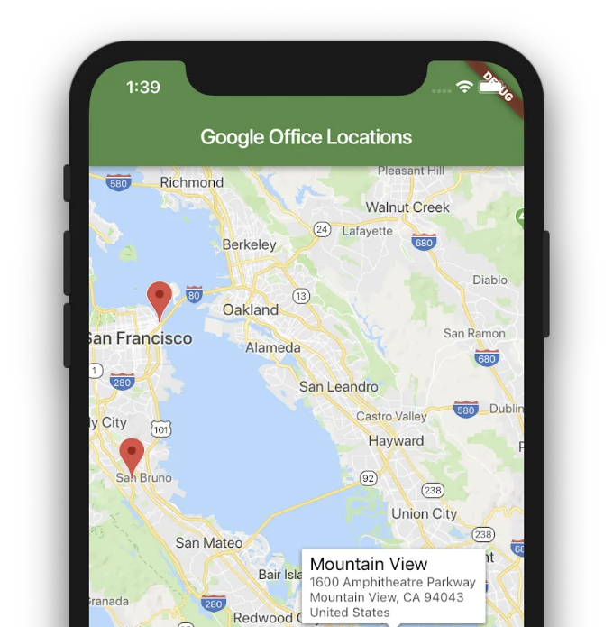

플러터 앱에 구글 지도 추가에 대한 포괄적인 튜토리얼


만약 위치 기반 서비스가 필요한 모바일 앱을 개발 중이라면, 플러터 앱에 Google Maps를 통합하는 것이 좋은 아이디어입니다. Google Maps는 맵, 위성 이미지, 거리뷰, 그리고 실시간 교통 업데이트를 포함한 다양한 기능을 제공하여 개발자들 사이에서 인기가 높습니다.

Google Maps는 플러터 앱의 사용자 경험을 향상시킬 수 있는 인기있는 매핑 플랫폼입니다. 이 기사에서는 구글 클라우드 플랫폼 계정 설정부터 앱에서 지도를 표시하는 방법까지 모두 다룰 것입니다.

<!-- ui-log 수평형 -->

<ins class="adsbygoogle"
      style="display:block"
      data-ad-client="ca-pub-4877378276818686"
      data-ad-slot="9743150776"
      data-ad-format="auto"
      data-full-width-responsive="true"></ins>
<component is="script">
(adsbygoogle = window.adsbygoogle || []).push({});
</component>

준비 사항

시작하기 전에 필요한 몇 가지가 있습니다:

- Google Cloud Platform 계정
- Flutter 프로젝트
- Google Maps API 키

단계 1: Google Cloud Platform 계정 만들기

<!-- ui-log 수평형 -->

<ins class="adsbygoogle"
      style="display:block"
      data-ad-client="ca-pub-4877378276818686"
      data-ad-slot="9743150776"
      data-ad-format="auto"
      data-full-width-responsive="true"></ins>
<component is="script">
(adsbygoogle = window.adsbygoogle || []).push({});
</component>

Google 맵을 앱에서 사용하려면 Google Cloud Platform 계정을 만들어야 합니다. 이미 계정이 있는 경우 다음 단계로 건너뛰십시오.

- Google Cloud Platform 콘솔(https://console.cloud.google.com/)로 이동합니다.


- Google 계정으로 로그인하거나, 아직 계정이 없는 경우 새로 만듭니다.
- 화면 상단의 "프로젝트 선택" 드롭다운을 클릭한 후 "새 프로젝트"를 선택하여 새 프로젝트를 생성합니다. 프로젝트 이름을 지정하고 "만들기"를 클릭합니다.

<!-- ui-log 수평형 -->

<ins class="adsbygoogle"
      style="display:block"
      data-ad-client="ca-pub-4877378276818686"
      data-ad-slot="9743150776"
      data-ad-format="auto"
      data-full-width-responsive="true"></ins>
<component is="script">
(adsbygoogle = window.adsbygoogle || []).push({});
</component>


단계 2: Google Maps 플랫폼 API 활성화하기

- Cloud Console에서 “APIs & Services” > “Library” 탭으로 이동합니다.
- "Maps SDK for Android" 및 "Maps SDK for iOS"를 검색하여 두 API를 활성화합니다.


<!-- ui-log 수평형 -->

<ins class="adsbygoogle"
      style="display:block"
      data-ad-client="ca-pub-4877378276818686"
      data-ad-slot="9743150776"
      data-ad-format="auto"
      data-full-width-responsive="true"></ins>
<component is="script">
(adsbygoogle = window.adsbygoogle || []).push({});
</component>

- 다음으로 "자격 증명" 탭으로 이동하여 "자격 증명 생성"을 클릭하세요. "API 키"를 선택합니다.
- API 키를 복사하고 안전한 곳에 보관하세요. 나중에 사용할 것입니다.


단계 3: Google Maps Flutter 플러그인 추가하기

- 첫 번째 단계는 선호하는 IDE나 명령줄을 사용하여 새 Flutter 프로젝트를 만드는 것입니다. 프로젝트를 생성한 후 다음 단계를 진행할 수 있습니다.
- Google Maps 패키지 추가하기
- 이제 Google Maps 패키지를 프로젝트에 추가해야 합니다. 이를 위해 pubspec.yaml 파일에 다음 종속성을 추가할 수 있습니다.

<!-- ui-log 수평형 -->

<ins class="adsbygoogle"
      style="display:block"
      data-ad-client="ca-pub-4877378276818686"
      data-ad-slot="9743150776"
      data-ad-format="auto"
      data-full-width-responsive="true"></ins>
<component is="script">
(adsbygoogle = window.adsbygoogle || []).push({});
</component>

```js
dependencies:
  flutter:
    sdk: flutter
  google_maps_flutter: ^1.2.0
```

의존성을 추가한 후 터미널에서 다음 명령을 실행하세요:

```js
flutter pub get
```

이렇게 하면 Google Maps 패키지가 다운로드되고 설치됩니다.

<!-- ui-log 수평형 -->

<ins class="adsbygoogle"
      style="display:block"
      data-ad-client="ca-pub-4877378276818686"
      data-ad-slot="9743150776"
      data-ad-format="auto"
      data-full-width-responsive="true"></ins>
<component is="script">
(adsbygoogle = window.adsbygoogle || []).push({});
</component>

단계 4: 지도 보기 설정하기

앱의 main.dart 파일을 열고 다음 코드를 추가하세요:

```js
import 'package:flutter/material.dart';
import 'package:google_maps_flutter/google_maps_flutter.dart';

void main() => runApp(MyApp());

class MyApp extends StatelessWidget {
  @override
  Widget build(BuildContext context) {
    return MaterialApp(
      title: 'Google Maps Demo',
      home: Scaffold(
        appBar: AppBar(
          title: Text('Google Maps Demo'),
        ),
        body: GoogleMap(
          initialCameraPosition: CameraPosition(
            target: LatLng(23.0225, 72.5714),
            zoom: 12,
          ),
        ),
      ),
    );
  }
}
```

- LatLng(23.0225, 72.5714)를 지도에 표시하려는 위치의 위도와 경도로 대체하세요.

<!-- ui-log 수평형 -->

<ins class="adsbygoogle"
      style="display:block"
      data-ad-client="ca-pub-4877378276818686"
      data-ad-slot="9743150776"
      data-ad-format="auto"
      data-full-width-responsive="true"></ins>
<component is="script">
(adsbygoogle = window.adsbygoogle || []).push({});
</component>

**단계 5: API 키 추가**

Google Cloud Platform 계정으로 돌아가서 2단계에서 생성한 API 키를 찾으세요.

API 키를 획득했다면 앱에서 설정해야 합니다. 이를 위해 AndroidManifest.xml 파일(안드로이드용) 또는 Info.plist 파일(iOS용)에 다음 코드를 추가하십시오:

Android:

<!-- ui-log 수평형 -->

<ins class="adsbygoogle"
      style="display:block"
      data-ad-client="ca-pub-4877378276818686"
      data-ad-slot="9743150776"
      data-ad-format="auto"
      data-full-width-responsive="true"></ins>
<component is="script">
(adsbygoogle = window.adsbygoogle || []).push({});
</component>

앱에 이전 단계에서 생성한 API 키를 사용하여 Google 지도를 통합하려면 제공된 지침을 따라 필요한 코드를 복사하여 붙여넣어야 합니다.

먼저 플러터 프로젝트를 열고 다음 위치의 파일로 이동하십시오: android/app/src/main/AndroidManifest.xml.

다음으로 아래 코드를 붙여넣으십시오:

```js
<application>
  <meta-data android:name="com.google.android.geo.API_KEY" android:value="여기에 API 키를 입력하세요" />
</application>
```

<!-- ui-log 수평형 -->

<ins class="adsbygoogle"
      style="display:block"
      data-ad-client="ca-pub-4877378276818686"
      data-ad-slot="9743150776"
      data-ad-format="auto"
      data-full-width-responsive="true"></ins>
<component is="script">
(adsbygoogle = window.adsbygoogle || []).push({});
</component>


iOS:
iOS 기기용 플러터 앱에서 Google 지도를 구현하는 과정은 안드로이드와 유사합니다.

첫 번째 단계는 애플리케이션 델리게이트 내에서 API 키를 정의하는 것입니다. ios/Runner/AppDelegate.swift

```swift
import UIKit
import Flutter
import GoogleMaps

@UIApplicationMain
@objc class AppDelegate: FlutterAppDelegate {
    override func application(
        _ application: UIApplication,
        didFinishLaunchingWithOptions launchOptions: [UIApplication.LaunchOptionsKey: Any]?
    ) -> Bool {
        GeneratedPluginRegistrant.register(with: self)
        GMSServices.provideAPIKey("YOUR-KEY")
        return super.application(application, didFinishLaunchingWithOptions: launchOptions)
    }
}
```

<!-- ui-log 수평형 -->

<ins class="adsbygoogle"
      style="display:block"
      data-ad-client="ca-pub-4877378276818686"
      data-ad-slot="9743150776"
      data-ad-format="auto"
      data-full-width-responsive="true"></ins>
<component is="script">
(adsbygoogle = window.adsbygoogle || []).push({});
</component>

API 키를 응용프로그램 델리게이트에서 지정한 후, 다음 단계는 Xcode를 열고 info.plist 파일에 위치 권한을 포함하는 것입니다.

```js
<key>io.flutter.embedded_views_preview</key>
<true/>
<key>NSLocationWhenInUseUsageDescription</key>
<string>이 앱은 활성화될 때 위치에 대한 액세스가 필요합니다.</string>
<key>NSLocationAlwaysAndWhenInUseUsageDescription</key>
<string>이 앱은 백그라운드에서 위치에 대한 액세스가 필요합니다.</string>
<key>NSLocationAlwaysUsageDescription</key>
<string>이 앱은 백그라운드에서 위치에 대한 액세스가 필요합니다.</string>
<key>NSContactsUsageDescription</key>
<string>지도에 연락처를 표시하기 위해 이 앱은 연락처에 액세스해야 합니다.</string>
<key>NSPhotoLibraryUsageDescription</key>
<string>지도에 사진을 표시하기 위해 이 앱은 사진에 액세스해야 합니다.</string>
<key>NSCameraUsageDescription</key>
<string>지도에 사진을 표시하기 위해 이 앱은 카메라에 액세스해야 합니다.</string>
```

이제 API 키를 구성했으므로 앱에서 지도를 표시할 수 있습니다.



<!-- ui-log 수평형 -->

<ins class="adsbygoogle"
      style="display:block"
      data-ad-client="ca-pub-4877378276818686"
      data-ad-slot="9743150776"
      data-ad-format="auto"
      data-full-width-responsive="true"></ins>
<component is="script">
(adsbygoogle = window.adsbygoogle || []).push({});
</component>

## 결론

이 튜토리얼을 통해 Google Maps를 Flutter 앱에 통합하는 과정을 보여드리고, 지도의 모양을 개인화하고 조정하는 여러 방법을 강조해왔습니다. Maps API를 활성화하는 필수 단계, API 키를 생성하고 제어하는 방법, Flutter 애플리케이션에서 지도를 설정하고 사용자 정의하는 방법 등을 다루었습니다.

Google Maps를 앱에 통합하면 다양한 가능성을 높일 수 있습니다. 기초가 이제 당신의 도구로 사용 가능해져, 지도 기반 기능과 상호 작용하는 지도를 Flutter 애플리케이션에 구축하는 데 잘 준비되었습니다.

읽어 주셔서 감사합니다.
