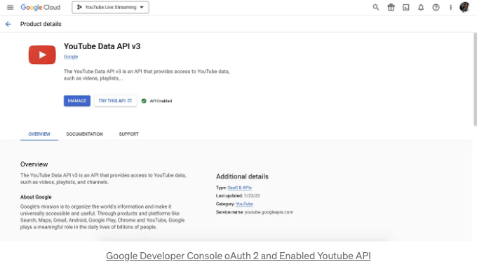
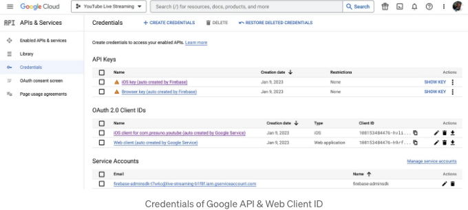
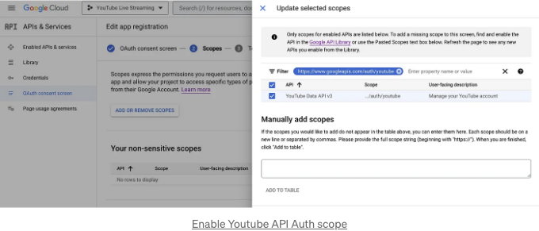
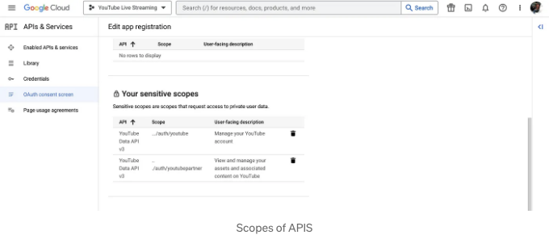
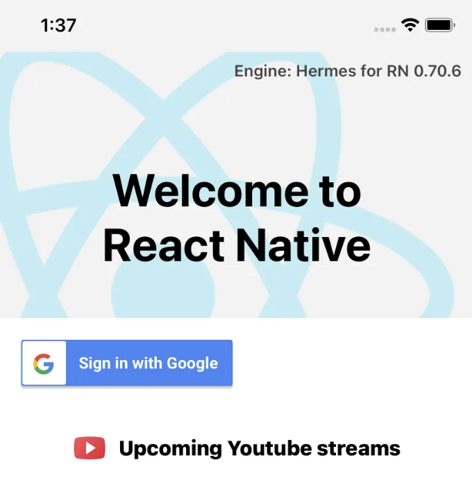

리액트 네이티브는 모바일 애플리케이션을 구축하는 인기 있는 프레임워크입니다. YouTube 라이브 스트리밍 API 통합을 통해 사용자들이 모바일 기기에서 직접 라이브 비디오를 송출할 수 있기 때문에 리액트 네이티브 앱의 기능성이 크게 향상될 수 있습니다.

본 포괄적인 안내서는 Google 서비스에 OAuth 2를 통해 연결하는 방법을 포함하여 YouTube 라이브 스트리밍 API를 리액트 네이티브 모바일 애플리케이션에 통합하는 데 필요한 단계를 안내해 드립니다.

통합 과정에 들어가기 전에 우선 전제 조건들을 살펴보겠습니다:

<!-- ui-log 수평형 -->

<ins class="adsbygoogle"
      style="display:block"
      data-ad-client="ca-pub-4877378276818686"
      data-ad-slot="9743150776"
      data-ad-format="auto"
      data-full-width-responsive="true"></ins>
<component is="script">
(adsbygoogle = window.adsbygoogle || []).push({});
</component>

- Google 계정
- YouTube 계정
- YouTube 채널
- React Native 앱
- React Native, OAuth 2 및 JavaScript 프로그래밍 언어에 대한 기본 지식

위의 모든 것을 갖추었다면 다음 단계로 넘어갈 수 있습니다: Google Developers 콘솔에서 API 키를 얻고 OAuth 2 인증을 설정해보세요.

이를 위해 Google Developers 콘솔에 가서 새 프로젝트를 생성하고 YouTube API를 활성화해야 합니다. 그런 다음 OAuth 2 자격 증명을 생성해야 하는데, 클라이언트 ID 및 비밀번호를 포함하게 됩니다. 이 자격 증명을 사용하여 앱을 인증할 수 있습니다.



<!-- ui-log 수평형 -->

<ins class="adsbygoogle"
      style="display:block"
      data-ad-client="ca-pub-4877378276818686"
      data-ad-slot="9743150776"
      data-ad-format="auto"
      data-full-width-responsive="true"></ins>
<component is="script">
(adsbygoogle = window.adsbygoogle || []).push({});
</component>

다음으로, React Native 앱에 Google Sign-in 라이브러리를 설치해야합니다.

React Native 앱에서 " @react-native-google-signin/google-signin"을 사용하려면 먼저 다음 명령을 실행하여 라이브러리를 설치해야합니다:

```js
npm install @react-native-google-signin/google-signin --save
```

다음으로, 다음 명령을 실행하여 네이티브 모듈을 React Native 앱에 연결해야합니다:

<!-- ui-log 수평형 -->

<ins class="adsbygoogle"
      style="display:block"
      data-ad-client="ca-pub-4877378276818686"
      data-ad-slot="9743150776"
      data-ad-format="auto"
      data-full-width-responsive="true"></ins>
<component is="script">
(adsbygoogle = window.adsbygoogle || []).push({});
</component>

```js
react-native link @react-native-google-signin/google-signin
```

라이브러리를 설치하고 연결한 후에 앱에서 사용할 수 있습니다. 해야 할 첫 번째 작업은 라이브러리를 가져와 Google API 자격 증명으로 구성하는 것입니다. 다음은 이를 수행하는 방법의 예시입니다:

```js
import GoogleSignIn from "@react-native-google-signin/google-signin";

GoogleSignIn.configure({
  webClientId: "your-web-client-id",
  offlineAccess: true,
});
```

이 예시에서는 configure 메서드를 사용하여 Google API 프로젝트 ID인 web 클라이언트 ID를 설정하고 앱이 오프라인 액세스를 필요로 하는 것을 지정했습니다.

<!-- ui-log 수평형 -->

<ins class="adsbygoogle"
      style="display:block"
      data-ad-client="ca-pub-4877378276818686"
      data-ad-slot="9743150776"
      data-ad-format="auto"
      data-full-width-responsive="true"></ins>
<component is="script">
(adsbygoogle = window.adsbygoogle || []).push({});
</component>

아래는 Markdown 형식으로 표를 변환한 것입니다.



다음으로 GoogleSignInButton 컴포넌트를 사용하여 앱에 Google 로그인 버튼을 추가할 수 있습니다:

```js
import { GoogleSignInButton } from "@react-native-google-signin/google-signin";

<GoogleSignInButton style={{ width: 192, height: 48 }} size={GoogleSignInButton.Size.Wide} color={GoogleSignInButton.Color.Dark} onPress={this.signIn} />;
```

GoogleSignInButton 컴포넌트는 로그인 버튼을 표시하며, onPress 속성은 버튼을 눌렀을 때 호출될 함수를 지정합니다.

<!-- ui-log 수평형 -->

<ins class="adsbygoogle"
      style="display:block"
      data-ad-client="ca-pub-4877378276818686"
      data-ad-slot="9743150776"
      data-ad-format="auto"
      data-full-width-responsive="true"></ins>
<component is="script">
(adsbygoogle = window.adsbygoogle || []).push({});
</component>

사용자를 로그인하려면 사용자의 구글 계정 정보를 반환하는 Promise를 처리하는 sign-in 메서드를 호출해야 합니다:

```js
const signIn = async () => {
  try {
    const user = await GoogleSignIn.signIn();
    console.log(user);
  } catch (error) {
    console.error(error);
  }
};
```

이 예제에서는 signIn 메서드가 호출되어 구글 로그인 버튼이 눌렸을 때 사용자의 구글 계정 정보를 반환하는 Promise를 처리합니다.

이러한 단계를 통해 React Native 앱에 " @react-native-google-signin/google-signin " 라이브러리를 성공적으로 통합했습니다. Google OAuth 로그인을 위해 사용할 수 있습니다.

<!-- ui-log 수평형 -->

<ins class="adsbygoogle"
      style="display:block"
      data-ad-client="ca-pub-4877378276818686"
      data-ad-slot="9743150776"
      data-ad-format="auto"
      data-full-width-responsive="true"></ins>
<component is="script">
(adsbygoogle = window.adsbygoogle || []).push({});
</component>

“@react-native-google-signin/google-signin” 라이브러리는 앱에 Google API 자격 증명을 설정할 수 있는 configure 메서드를 제공합니다. Google API 프로젝트에 "https://www.googleapis.com/auth/youtube" 스코프를 활성화하려면 configure 메서드로 전달되는 옵션 객체의 scopes 속성에 추가해야 합니다.



다음은 "@react-native-google-signin/google-signin" 라이브러리를 "https://www.googleapis.com/auth/youtube" 스코프로 구성하는 예시입니다:

```js
import GoogleSignIn from "@react-native-google-signin/google-signin";

GoogleSignIn.configure({
  scopes: ["https://www.googleapis.com/auth/youtube", "https://www.googleapis.com/auth/youtube.readonly"], // 사용자를 대신하여 액세스하려는 API, 기본값은 이메일 및 프로필
  webClientId: webClientId,
  offlineAccess: true, // 사용자의 서버에서 Google API에 액세스하려는 경우
  hostedDomain: "", // 호스팅 도메인 제한을 지정
  forceCodeForRefreshToken: true, // [Android] `serverAuthCode`에 관련, 아래 링크의 문서 참조 *
  accountName: "", // [Android] 장치에서 사용할 계정 이름을 지정
  iosClientId: iosClientId, // [iOS] iOS 유형의 클라이언트 ID를 지정하려는 경우 (그렇지 않은 경우 GoogleService-Info.plist에서 가져옴)
  googleServicePlistPath: "", // [iOS] GoogleService-Info 파일 이름을 변경한 경우 여기에 새 이름 입력, 예: GoogleService-Info-Staging
  openIdRealm: "", // [iOS] 홈 웹 서버의 OpenID2 영역. 이를 통해 Google은 OpenID 식별자를 OpenID Connect ID 토큰에 포함할 수 있습니다.
  profileImageSize: 120, // [iOS] 프로필 이미지의 원하는 높이(및 너비). 기본값은 120px입니다.
});
```

<!-- ui-log 수평형 -->

<ins class="adsbygoogle"
      style="display:block"
      data-ad-client="ca-pub-4877378276818686"
      data-ad-slot="9743150776"
      data-ad-format="auto"
      data-full-width-responsive="true"></ins>
<component is="script">
(adsbygoogle = window.adsbygoogle || []).push({});
</component>



이 예제에서 configure 메서드는 scopes 속성을 포함한 옵션 객체와 함께 호출됩니다. 이 속성은 사용자의 Google 계정에 대한 원하는 스코프를 지정하는 문자열 배열입니다. 여기에는 "https://www.googleapis.com/auth/youtube" 스코프가 포함됩니다.

위 코드로, "https://www.googleapis.com/auth/youtube", "https://www.googleapis.com/auth/youtube.readonly" 등이 포함된 사용자의 Google 계정에 대한 스코프가 성공적으로 구성되었습니다.

<!-- ui-log 수평형 -->

<ins class="adsbygoogle"
      style="display:block"
      data-ad-client="ca-pub-4877378276818686"
      data-ad-slot="9743150776"
      data-ad-format="auto"
      data-full-width-responsive="true"></ins>
<component is="script">
(adsbygoogle = window.adsbygoogle || []).push({});
</component>

YouTube API 액세스를 위한 스코프입니다.

이제, REST API 요청을 하기 위해 fetch 메소드를 사용하여 YouTube API의 실시간 방송 목록을 가져올 수 있습니다. 이 요청을 위한 API 엔드포인트는 "https://www.googleapis.com/youtube/v3/liveBroadcasts" 입니다.

React Native에서 fetch 메소드를 사용하여 liveBroadcasts 엔드포인트로 GET 요청을 하는 예시는 다음과 같습니다:

```js
async function getLiveBroadcastSchedules() {
  const API_KEY = "your-api-key";
  const response = await fetch(`https://www.googleapis.com/youtube/v3/liveBroadcasts?part=id,snippet&key=${API_KEY}`);
  const data = await response.json();
  console.log(data);
  return data;
}
```

<!-- ui-log 수평형 -->

<ins class="adsbygoogle"
      style="display:block"
      data-ad-client="ca-pub-4877378276818686"
      data-ad-slot="9743150776"
      data-ad-format="auto"
      data-full-width-responsive="true"></ins>
<component is="script">
(adsbygoogle = window.adsbygoogle || []).push({});
</component>



이 예제에서 getLiveBroadcasts 함수는 part 매개변수를 id, snippet으로 설정하고 키 매개변수를 API 키로 설정하여 liveBroadcasts 엔드포인트에 GET 요청을 보냅니다. API 응답은 JSON 형식으로 변환되어 JSON 메서드를 사용하여 콘솔에 기록됩니다.

Google Cloud 콘솔에서 YouTube Data API v3에 액세스 권한을 활성화하는 단계는 다음과 같습니다:

- Google Cloud 콘솔로 이동: https://console.cloud.google.com/
- 프로젝트를 선택하거나 새 프로젝트를 만듭니다.
- 상단 왼쪽 구석에 있는 햄버거 메뉴(세 개의 수평 선)를 클릭하고 "API 및 서비스"를 선택합니다.
- "라이브러리" 탭을 클릭합니다.
- 검색 창에서 "YouTube Data API v3"을 검색합니다.
- "YouTube Data API v3" 카드를 클릭합니다.
- "활성화" 버튼을 클릭합니다.
- "YouTube Data API v3" 페이지에서 "자격 증명 만들기" 버튼을 클릭합니다.
- 생성할 자격 증명 유형으로 "API 키"를 선택합니다.
- API 키가 생성되고 표시됩니다. 원하는 경우 API 키를 특정 IP 주소나 참조자에 제한할 수 있습니다.
- API 키를 저장하고 코드에서 사용하여 YouTube Data API v3에 요청을 보냅니다.

<!-- ui-log 수평형 -->

<ins class="adsbygoogle"
      style="display:block"
      data-ad-client="ca-pub-4877378276818686"
      data-ad-slot="9743150776"
      data-ad-format="auto"
      data-full-width-responsive="true"></ins>
<component is="script">
(adsbygoogle = window.adsbygoogle || []).push({});
</component>

이러한 단계를 통해 Google Cloud 콘솔에서 YouTube Data API v3에 액세스 권한을 성공적으로 활성화했습니다.

다음은 YouTube API의 liveBroadcasts 엔드포인트를 사용하여 YouTube 스트리밍을 위한 새로 예약된 이벤트를 생성하는 예시입니다. 이것은 OAuth 2.0로 인증이 필요한 POST 요청입니다.

```js
async function createScheduledEvent(accessToken) {
  const API_KEY = "your-api-key";
  const headers = new Headers({
    Authorization: `Bearer ${accessToken}`,
    "Content-Type": "application/json",
  });
  const body = JSON.stringify({
    snippet: {
      title: "My Scheduled Event",
      scheduledStartTime: "2023-02-06T12:00:00Z",
    },
    status: {
      privacyStatus: "private",
    },
  });
  const response = await fetch(`https://www.googleapis.com/youtube/v3/liveBroadcasts?part=snippet,status&key=${API_KEY}`, {
    method: "POST",
    headers: headers,
    body: body,
  });
  const data = await response.json();
  console.log(data);
  return data;
}
```


<!-- ui-log 수평형 -->

<ins class="adsbygoogle"
      style="display:block"
      data-ad-client="ca-pub-4877378276818686"
      data-ad-slot="9743150776"
      data-ad-format="auto"
      data-full-width-responsive="true"></ins>
<component is="script">
(adsbygoogle = window.adsbygoogle || []).push({});
</component>

이 예제에서 createScheduledEvent 함수는 liveBroadcasts 엔드포인트로 part 매개변수를 snippet, status로 설정하고 key 매개변수를 사용하여 POST 요청을 수행합니다. 요청 헤더는 OAuth 2.0 액세스 토큰이 Authorization 헤더에 포함되고 Content-Type 헤더가 application/json으로 설정됩니다. 요청 본문에는 제목, 예정된 시작 시간 및 프라이버시 상태와 같은 예약된 이벤트의 세부 정보가 포함됩니다.

API 응답은 JSON 방식으로 변환된 후 JSON 메서드를 사용하여 콘솔에 기록됩니다.

이 코드로 YouTube API의 liveBroadcasts 엔드포인트를 React Native 앱에 성공적으로 통합하여 YouTube 스트리밍용 새로운 예약 이벤트를 생성했습니다.

이 튜토리얼을 읽어주셔서 감사합니다. 도움이 되었다면 더 많은 유익한 콘텐츠를 확인하려면 소셜 미디어에서 제 팔로우를 고려해보세요.
