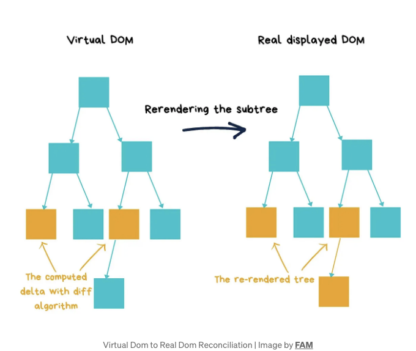
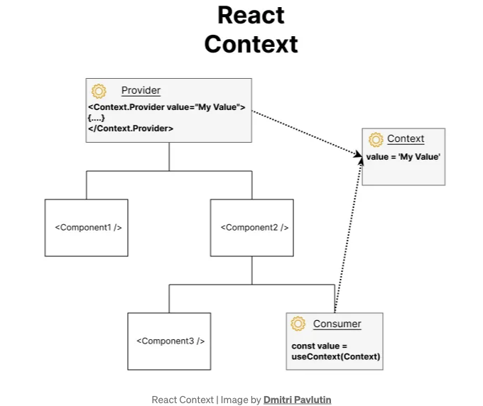

리액트의 다시 렌더링 과정과 성능 최적화에 대한 메커니즘을 이해하기


컴포넌트의 상태나 속성을 수정할 때 어떤 어둠의 마법이나 검은 마법이 작용하는지 궁금해하며 여기에 도착한 것 같습니다. UI가 자동으로 새로 고침되는 것은 기본 Android 또는 iOS 앱 개발과 다르며, 변경 사항에 따라 업데이트하라는 명령을 내려야 하는 과정이 필요하지 않습니다.

솔직히 말해서, 전문적으로 몇 년간 리액트와 함께 일해왔지만, 다시 렌더링 과정이 완전히 이해되지 않았다고 이제야 깨달았습니다.

<!-- ui-log 수평형 -->

<ins class="adsbygoogle"
      style="display:block"
      data-ad-client="ca-pub-4877378276818686"
      data-ad-slot="9743150776"
      data-ad-format="auto"
      data-full-width-responsive="true"></ins>
<component is="script">
(adsbygoogle = window.adsbygoogle || []).push({});
</component>

많은 React 개발자에게 이것이 사실인 것 같아요. 그들은 그저 필요한 만큼 알지만, "React에서 리렌더링을 일으키는 것은 무엇인가요?"와 같은 질문을 하면 다양한 모호한 답변을 받을 확률이 높습니다.

더 깊게 파고들기 전에, React Native의 두 가지 성능 단계를 이해해야 합니다:

- 초기 렌더링
  이는 컴포넌트가 처음으로 표시될 때 발생합니다.
- 리렌더링
  이는 이미 화면에 표시된 컴포넌트의 후속 렌더링을 가리킵니다. 리렌더링은 일반적으로 React Native가 앱 구성 요소를 새 데이터로 업데이트해야 할 때 트리거됩니다.

초기 렌더링은 화면에 컴포넌트를 표시하는 데 필요하며, 우리는 이를 제거할 방법이 없기 때문에 React Native에서 리렌더링, 그 일반적인 원인 및 어떻게 피할지에 초점을 맞출 것입니다.

<!-- ui-log 수평형 -->

<ins class="adsbygoogle"
      style="display:block"
      data-ad-client="ca-pub-4877378276818686"
      data-ad-slot="9743150776"
      data-ad-format="auto"
      data-full-width-responsive="true"></ins>
<component is="script">
(adsbygoogle = window.adsbygoogle || []).push({});
</component>

사용자 상호 작용 (예: 버튼 클릭, 텍스트 입력 값 변경), 비동기 요청을 통한 외부 데이터의 도착 (예: API 호출, 소켓 연결), 또는 구독 모델에서의 업데이트 (예: 리스너) 등으로 인해 다시 렌더링이 발생할 수 있습니다.

이 글에서는 다음 내용을 다룰 것입니다:

- React Native에서 렌더링은 어떻게 작동합니까?
- 다시 렌더링이 어떻게 트리거되나요?
- 불필요한 다시 렌더링을 어떻게 방지할 수 있나요?
- 어떻게 강제로 다시 렌더링할 수 있나요?

# React Native에서 렌더링은 어떻게 작동하나요?

<!-- ui-log 수평형 -->

<ins class="adsbygoogle"
      style="display:block"
      data-ad-client="ca-pub-4877378276818686"
      data-ad-slot="9743150776"
      data-ad-format="auto"
      data-full-width-responsive="true"></ins>
<component is="script">
(adsbygoogle = window.adsbygoogle || []).push({});
</component>

리액트는 개발자가 UI가 어떻게 나타나야 하는지 설명하는 것과 애플리케이션이 실제로 렌더링을 수행하는 노력 사이에 위치한 가상 DOM을 사용합니다. 브라우저에서 UI를 렌더링하려면 앱이 브라우저의 문서 객체 모델(DOM)을 수정해야 합니다.

공식 리액트 웹사이트에서 가상 DOM에 대한 정의:



리액트 조정은 diffing 메커니즘을 사용합니다. 기존 가상 DOM과 새로운 가상 DOM의 두 트리를 검사하여 변경하는 가장 효율적인 방법을 찾습니다. O(n³)의 느린 최악의 경우를 피하기 위해 비교 작업은 선형 시간인 O(n)에 수행되도록합니다.

<!-- ui-log 수평형 -->

<ins class="adsbygoogle"
      style="display:block"
      data-ad-client="ca-pub-4877378276818686"
      data-ad-slot="9743150776"
      data-ad-format="auto"
      data-full-width-responsive="true"></ins>
<component is="script">
(adsbygoogle = window.adsbygoogle || []).push({});
</component>

이 효율성을 달성하기 위해, 이 알고리즘은 두 가지 핵심 가정에 기반을 두고 있어요:

- 두 요소가 서로 다른 타입을 가지고 있을 때, 그 결과로 나타나는 트리 구조 또한 다르다는 것이죠.
- 개발자들은 알고리즘을 돕기 위해 어떤 자식 요소들이 여러 번 랜더링될 때도 일관되게 유지될 가능성이 높다는 것을 나타낼 수 있어요. 이를 위해 각 자식에 고유한 key prop을 할당함으로써 이 작업이 수행됩니다.

이러한 가정들을 활용함으로써, React는 두 트리 간의 차이점을 신속하게 식별하고 필요한 업데이트를 정확히 적용할 수 있어요.

그럼, 이제 React Native로 시작해볼게요. React Native는 브라우저의 DOM에 렌더링하는 대신, iOS 컴포넌트를 위해 네이티브 Objective-C API를 호출하고, Android 컴포넌트를 위해 네이티브 Java API를 호출해요. 이는 종종 웹 기반 뷰를 렌더링하는 다른 크로스 플랫폼 앱 개발 대안과 구별되는 특징이에요.

<!-- ui-log 수평형 -->

<ins class="adsbygoogle"
      style="display:block"
      data-ad-client="ca-pub-4877378276818686"
      data-ad-slot="9743150776"
      data-ad-format="auto"
      data-full-width-responsive="true"></ins>
<component is="script">
(adsbygoogle = window.adsbygoogle || []).push({});
</component>

# 리렌더링은 어떻게 트리거되나요?

초기 렌더링이 완료된 후에 React에 다시 렌더링을 지시하는 몇 가지 다른 방법이 있습니다:

- 상태(state) 및/또는 속성(props)이 변경될 때 컴포넌트를 다시 렌더링합니다.
- 컨텍스트 스토어의 값이 변경될 때
- key prop이 변경될 때 다시 렌더링합니다.

## 1. 상태(state) 및/또는 속성(props)이 변경될 때 컴포넌트를 다시 렌더링

<!-- ui-log 수평형 -->

<ins class="adsbygoogle"
      style="display:block"
      data-ad-client="ca-pub-4877378276818686"
      data-ad-slot="9743150776"
      data-ad-format="auto"
      data-full-width-responsive="true"></ins>
<component is="script">
(adsbygoogle = window.adsbygoogle || []).push({});
</component>

리액트는 컴포넌트의 상태, 프롭스 또는 리스너에서 발생하는 이벤트 변경과 같은 변화가 발생하면 렌더링 준비를 합니다. 일단 예약이 되면 렌더가 발생하며, 리액트는 최적의 다시 렌더링 시간을 찾아냅니다.

리액트의 setState 메서드는 상태를 업데이트합니다 (훅은 useState를 사용합니다). 컴포넌트의 렌더 함수가 호출되고, 모든 하위 컴포넌트가 프롭스나 상태에 관계없이 다시 렌더링됩니다.

위의 예시에서 선험해보겠습니다. A`B`C 컴포넌트 트리가 있다고 가정합시다. 이제 B 컴포넌트에서 증가하는 카운터 값을 가졌다고 생각해봅시다.

위 예시에서 B 컴포넌트에서 setCounter를 호출할 때, 리액트가 다음을 수행합니다:

<!-- ui-log 수평형 -->

<ins class="adsbygoogle"
      style="display:block"
      data-ad-client="ca-pub-4877378276818686"
      data-ad-slot="9743150776"
      data-ad-format="auto"
      data-full-width-responsive="true"></ins>
<component is="script">
(adsbygoogle = window.adsbygoogle || []).push({});
</component>

- 우리는 B에서 setCounter를 호출하여 B를 다시 렌더링 대기열로 집어 넣습니다.
- React는 트리의 맨 위부터 렌더링을 시작합니다.
- A가 B의 부모이므로 다시 렌더링이 필요하지 않으므로 React는 트리에서 계속 진행합니다.
- React는 B가 업데이트가 필요하다는 것을 인식하고 렌더링합니다. B는 `C /`를 반환합니다.
- 원래 C는 다시 렌더링이나 업데이트가 필요하지 않았지만, 부모인 B가 렌더링되므로 React는 C를 다시 렌더링합니다.

## 2. 컨텍스트 스토어 값 변경

컨텍스트 스토어 값 변경은 다시 렌더링의 일반적인 원인 중 하나입니다. 컨텍스트 값 변경시 모든 컨텍스트 소비자들(useContext)이 자동으로 다시 렌더링됩니다.

이를 피하기 위해 불필요한 컨텍스트 변경을 제거하고 컴포넌트 트리 전체에 강제 업데이트를 피하기 위해 컨텍스트 스토어를 메모이즈하세요.

<!-- ui-log 수평형 -->

<ins class="adsbygoogle"
      style="display:block"
      data-ad-client="ca-pub-4877378276818686"
      data-ad-slot="9743150776"
      data-ad-format="auto"
      data-full-width-responsive="true"></ins>
<component is="script">
(adsbygoogle = window.adsbygoogle || []).push({});
</component>



여러분, 예제를 통해 함께 이해해보겠습니다:

이 예제에서는 React Context를 사용하여 상태를 관리하고 컴포넌트 간에 공유합니다. 다음은 작동 방식입니다:

- MyContext는 컨텍스트 객체로 생성됩니다.
- MyProvider는 이 컨텍스트 값을 자식 컴포넌트에 제공하는 컴포넌트입니다. 이는 count 상태와 increment 함수를 초기화하고 관리합니다.
- 여러 컴포넌트 (ParentComponent1, ParentComponent2, ChildComponent1, ChildComponent2, GrandChildComponent1)는 컨텍스트 값을 사용하여 count 상태를 표시하고 버튼을 누를 때 increment 함수를 트리거합니다.
- 어떤 컴포넌트에서든 increment 함수가 호출되면 MyProvider에서 count 상태를 업데이트합니다.
- 업데이트된 상태를 사용하는 모든 컨텍스트 소비 컴포넌트와 그 자식들은 다시 렌더링됩니다.

<!-- ui-log 수평형 -->

<ins class="adsbygoogle"
      style="display:block"
      data-ad-client="ca-pub-4877378276818686"
      data-ad-slot="9743150776"
      data-ad-format="auto"
      data-full-width-responsive="true"></ins>
<component is="script">
(adsbygoogle = window.adsbygoogle || []).push({});
</component>

자식 구성 요소를 업데이트할 필요가 없는 경우가 있습니다. 왜냐하면 그 상태나 속성이 변경되지 않아도 부모 구성 요소가 다시 그려지기 때문입니다. 다음 섹션에서는 불필요한 재렌더링을 피하는 방법에 대해 다룰 것입니다.

## 3. key 속성 변경 시 다시 렌더링

key 속성은 목록의 렌더링에 영향을 미칠 수 있습니다. 목록은 SectionList, FlatList 또는 배열을 순회하여 만든 목록일 수 있습니다.

목록 항목에 키를 추가할 때는 항상 변경되지 않는 키를 할당하려고 노력해야 합니다.

<!-- ui-log 수평형 -->

<ins class="adsbygoogle"
      style="display:block"
      data-ad-client="ca-pub-4877378276818686"
      data-ad-slot="9743150776"
      data-ad-format="auto"
      data-full-width-responsive="true"></ins>
<component is="script">
(adsbygoogle = window.adsbygoogle || []).push({});
</component>

리렌더링 될 때 React 컴포넌트의 상태(state)와 속성(props)을 항상 업데이트하세요. key props로 다시 렌더링이 트리거되는 것을 피하세요.

# 불필요한 리렌더링을 방지하는 방법은?

우선, 방지하는 방법을 배우기 전에 필요한 리렌더링과 불필요한 리렌더링의 차이를 알아야 합니다.

React Native에서는 두 가지 유형의 리렌더링이 있습니다:

<!-- ui-log 수평형 -->

<ins class="adsbygoogle"
      style="display:block"
      data-ad-client="ca-pub-4877378276818686"
      data-ad-slot="9743150776"
      data-ad-format="auto"
      data-full-width-responsive="true"></ins>
<component is="script">
(adsbygoogle = window.adsbygoogle || []).push({});
</component>

- 필요한 다시 렌더링
  컴포넌트의 상태나 속성이 변경된 후에는 자체적으로 및 관련 컴포넌트를 새로 고쳐야 합니다.

- 불필요한 다시 렌더링
  React Native의 앱 컴포넌트는 필요 이상으로 자주 새로고침될 수 있습니다.

대부분의 경우 React에게 다시 렌더링 처리를 맡길 수 있습니다. 요즘 React는 상당히 똑똑하고 빠릅니다. React는 다시 렌더링이 트리거되는 시간을 단축하기 위해 버전 18이 출시된 이후 상태 변수 수정을 한꺼번에 처리하려고 합니다.

React 컴포넌트가 필요하지 않은 경우 다시 렌더링을 방지하는 방법이 있습니다.

<!-- ui-log 수평형 -->

<ins class="adsbygoogle"
      style="display:block"
      data-ad-client="ca-pub-4877378276818686"
      data-ad-slot="9743150776"
      data-ad-format="auto"
      data-full-width-responsive="true"></ins>
<component is="script">
(adsbygoogle = window.adsbygoogle || []).push({});
</component>

- 구성 요소와 해당 자식의 재-렌더링을 트리거하는 것은 프롭(prop)이나 상태(state)를 수정할 때 발생합니다. 그래서 컴포넌트로는 필요한 프롭과 상태만 전달하도록 하세요.
- 재-렌더링을 보다 잘 제어하기 위해 개발자는 메모이제이션(memoization)을 구현할 수 있습니다. 이를 통해 메모이징된 값(예: 컴포넌트, 값, 함수)이 변경될 때에만 재-렌더링이 발생합니다.

React는 성능을 향상시키기 위해 메모이제이션을 기반으로 하는 두 가지 훅을 제공합니다:

- useMemo()
- useCallback()

이 두 훅은 결과를 캐시하고, 입력이 변경되지 않는 한 동일한 결과를 반환하여 재-렌더링 횟수를 줄일 수 있게 해줍니다. 입력 데이터가 변경되면 캐시가 무효화되고 새로운 반환 값이 생성됩니다.

<!-- ui-log 수평형 -->

<ins class="adsbygoogle"
      style="display:block"
      data-ad-client="ca-pub-4877378276818686"
      data-ad-slot="9743150776"
      data-ad-format="auto"
      data-full-width-responsive="true"></ins>
<component is="script">
(adsbygoogle = window.adsbygoogle || []).push({});
</component>

## useMemo()

useMemo 훅은 비싼 작업이 필요 없이 실행되는 것을 방지하는 데 사용할 수 있습니다.

예를 통해 이해해 봅시다. 화면에 두 개의 카운터와 비싼 시간 또는 메모리 작업이 있는 상황을 가정해 보겠습니다. 다음 코드 스니펫을 살펴보세요:

countFirst의 값이 변경될 때 컴포넌트는 비싼 작업을 다시 계산합니다. 하지만 countSecond의 값이 변경되더라도 여전히 작업 함수가 실행되는 것을 볼 수 있는데, 이는 이상적이지 않습니다.

<!-- ui-log 수평형 -->

<ins class="adsbygoogle"
      style="display:block"
      data-ad-client="ca-pub-4877378276818686"
      data-ad-slot="9743150776"
      data-ad-format="auto"
      data-full-width-responsive="true"></ins>
<component is="script">
(adsbygoogle = window.adsbygoogle || []).push({});
</component>

그럴거면, useMemo 훅을 사용해서 expensiveCalculatedValue를 메모이제이션할 수 있어요.

이제 이 코드를 실행하면, countFirst 값이 변경될 때만 expensiveCalculatedValue가 계산됩니다.

## useCallback()

React useCallback 훅은 리소스를 많이 사용하는 함수를 자동으로 다시 렌더링되지 않도록 메모이제이션된 콜백 함수를 반환해줍니다.

<!-- ui-log 수평형 -->

<ins class="adsbygoogle"
      style="display:block"
      data-ad-client="ca-pub-4877378276818686"
      data-ad-slot="9743150776"
      data-ad-format="auto"
      data-full-width-responsive="true"></ins>
<component is="script">
(adsbygoogle = window.adsbygoogle || []).push({});
</component>

콜백 훅은 그 종속성 중 하나가 업데이트될 때만 실행되며 성능을 향상시킬 수 있습니다.

이 예시에서는 텍스트와 버튼이 있는 컴포넌트가 있습니다. 이 컴포넌트를 부모 컴포넌트에서 두 번 사용합니다. 첫 번째 컴포넌트에서 버튼을 누르면 count라는 값을 변경하고 다시 렌더링됩니다.

함수 incrementFirstCount와 incrementSecondCount가 다시 초기화되므로 두 컴포넌트가 다시 렌더링됩니다.

이러한 동작을 막기 위해 incrementFirstCount와 incrementSecondCount에서 useCallback을 사용하여 종속성이 변경될 때만 다시 계산되도록 할 수 있습니다.

<!-- ui-log 수평형 -->

<ins class="adsbygoogle"
      style="display:block"
      data-ad-client="ca-pub-4877378276818686"
      data-ad-slot="9743150776"
      data-ad-format="auto"
      data-full-width-responsive="true"></ins>
<component is="script">
(adsbygoogle = window.adsbygoogle || []).push({});
</component>

아래 예시를 참고하여 첫 번째 컴포넌트의 onPress를 호출할 때 두 번째 컴포넌트가 다시 렌더링되는 것을 줄일 수 있습니다. 그 반대의 경우도 마찬가지입니다.

## React.memo

React.memo는 하이어 오더 컴포넌트(HOC)입니다. HOC는 다른 컴포넌트를 매개변수로 받아 다른 컴포넌트를 반환하는 컴포넌트에 사용되는 멋진 이름입니다.

React.memo는 props(또는 그 안에 있는 값들)가 변경되지 않았다면 컴포넌트의 다시 렌더링을 막습니다.

<!-- ui-log 수평형 -->

<ins class="adsbygoogle"
      style="display:block"
      data-ad-client="ca-pub-4877378276818686"
      data-ad-slot="9743150776"
      data-ad-format="auto"
      data-full-width-responsive="true"></ins>
<component is="script">
(adsbygoogle = window.adsbygoogle || []).push({});
</component>

위의 예제에서는 TextButton 컴포넌트를 React.memo로 감싸고, 새로운 컴포넌트 TextButtonView를 만들어 앱에서 사용했음을 볼 수 있습니다.

이제, 부모 컴포넌트가 다시 렌더링될 때마다 useCallback과 React.memo가 함께 사용되어, TextButton의 onPress 함수가 변경되지 않았다면 TextButton 컴포넌트를 다시 렌더링하지 않습니다.

여기서 useCallback를 사용해야 하는 주요 영역입니다. 자식 컴포넌트에 함수나 값이 종속성으로 전달될 때, 해당 컴포넌트를 React.memo로 감싸고 함수에는 useCallback을 값에는 useMemo를 사용해야 합니다.

# 어떻게 다시 렌더링을 유도할까요?

<!-- ui-log 수평형 -->

<ins class="adsbygoogle"
      style="display:block"
      data-ad-client="ca-pub-4877378276818686"
      data-ad-slot="9743150776"
      data-ad-format="auto"
      data-full-width-responsive="true"></ins>
<component is="script">
(adsbygoogle = window.adsbygoogle || []).push({});
</component>

리액트 네이티브에서 컴포넌트를 수동으로 다시 렌더링할 수 있는 몇 가지 방법이 있어요.

클래스 컴포넌트를 사용 중이라면, 다시 렌더링을 트리거하고 싶은 때마다 forceUpdate를 간단히 호출하면 돼요.

forceUpdate를 호출하면 컴포넌트를 강제로 다시 렌더링하게 되고, 따라서 컴포넌트의 render 메서드를 직접 호출하게 되며 shouldComponentUpdate 메서드를 건너뛰게 되요.

함수형 컴포넌트를 사용하는 경우, 재렌더링을 트리거하기 위해 useReducer를 사용해야 해요.

<!-- ui-log 수평형 -->

<ins class="adsbygoogle"
      style="display:block"
      data-ad-client="ca-pub-4877378276818686"
      data-ad-slot="9743150776"
      data-ad-format="auto"
      data-full-width-responsive="true"></ins>
<component is="script">
(adsbygoogle = window.adsbygoogle || []).push({});
</component>

그러나 주목할 점은 useState가 내부적으로 useReducer를 사용한다는 점인데, 이는 useState로 처리할 수 있는 모든 작업에 useReducer를 사용할 수 있다는 것을 시사합니다.

```js
const [_, forceRender] = useReducer((newVal) => newVal + 1, 0);
```

위의 useReducer 훅을 사용하면 다시 렌더링을 수행할 수 있습니다.

# 왜 렌더링했니?

<!-- ui-log 수평형 -->

<ins class="adsbygoogle"
      style="display:block"
      data-ad-client="ca-pub-4877378276818686"
      data-ad-slot="9743150776"
      data-ad-format="auto"
      data-full-width-responsive="true"></ins>
<component is="script">
(adsbygoogle = window.adsbygoogle || []).push({});
</component>

성능을 최적화하고 원하지 않는 다시 렌더링의 이유를 식별할 때 개발자들이 왜 렌더 패키지를 신뢰할 수 있을까요? 이 유용한 도구는 컴포넌트의 불필요한 다시 렌더링에 대한 이유에 대한 소중한 통찰력을 제공합니다.

특정 컴포넌트가 다시 렌더링된 이유에 대한 자세한 정보를 제공함으로써, 개발자들은 중복 렌더링 주기를 식별하고 해결하여 애플리케이션의 성능을 세밀하게 조정하고 최적화된 사용자 경험을 제공할 수 있습니다.

# 주요 포인트

- React Native에서 다시 렌더링을 이해하는 것은 성능 최적화와 원활한 사용자 경험 제공에 중요합니다.
- 렌더링 개념을 이해하고 트리거를 식별하며 불필요한 다시 렌더링을 방지하기 위한 전략을 구현함으로써, 개발자들은 코드를 최적화하고 효율성을 향상시킬 수 있습니다.
- “Why Did You Render”과 같은 도구는 최적화를 위한 가치 있는 통찰력을 제공합니다.
- 다시 렌더링을 완벽히 이해하면, 개발자들은 UI를 효율적으로 업데이트하고 렌더링 주기를 최소화하면서 뛰어난 성능을 발휘하는 React Native 앱을 구축할 수 있습니다.

<!-- ui-log 수평형 -->

<ins class="adsbygoogle"
      style="display:block"
      data-ad-client="ca-pub-4877378276818686"
      data-ad-slot="9743150776"
      data-ad-format="auto"
      data-full-width-responsive="true"></ins>
<component is="script">
(adsbygoogle = window.adsbygoogle || []).push({});
</component>

렌더링 프로세스의 기본 메커니즘을 더 잘 이해하려면 다음의 글을 참고해보세요:

- https://reactnative.dev/architecture/render-pipeline
- https://dev.to/teo_garcia/understanding-rendering-in-react-i5i
- https://reactjs.org/docs/faq-internals.html

더 많은 내용은 다음의 글에서 useMemo, useCallback 및 React.memo에 대해 읽어보세요:

- https://react.dev/reference/react/useMemo
- https://react.dev/reference/react/useCallback
- https://react.dev/reference/react/memo
