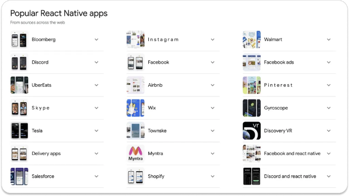
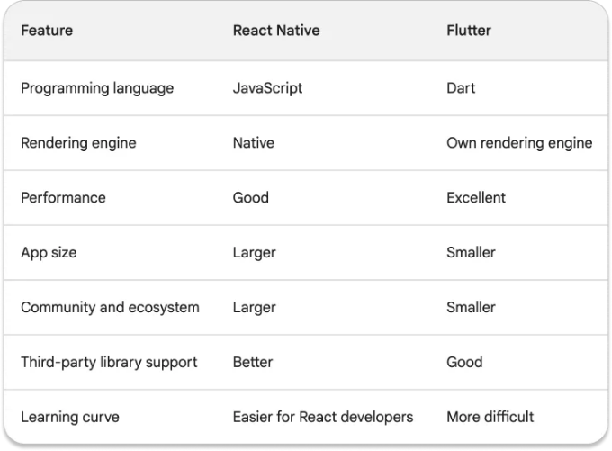

React Native와 Flutter는 두 가지 인기 있는 크로스 플랫폼 모바일 개발 프레임워크입니다. 두 프레임워크 모두 단일 코드베이스를 사용하여 iOS 및 Android용 네이티브 앱을 작성할 수 있습니다. 이를 통해 두 플랫폼에 앱을 개발 중이라면 많은 시간과 비용을 절약할 수 있습니다.

그러나 어떤 프레임워크가 성능이 더 우수할까요? React Native인가요, Flutter인가요?

# React Native

<!-- ui-log 수평형 -->

<ins class="adsbygoogle"
      style="display:block"
      data-ad-client="ca-pub-4877378276818686"
      data-ad-slot="9743150776"
      data-ad-format="auto"
      data-full-width-responsive="true"></ins>
<component is="script">
(adsbygoogle = window.adsbygoogle || []).push({});
</component>

React Native은 Facebook에서 만든 크로스 플랫폼 모바일 개발 프레임워크입니다. 이를 통해 단일 코드베이스를 사용하여 iOS 및 Android용 네이티브 앱을 개발할 수 있습니다. React Native은 인기 있는 JavaScript 라이브러리인 React 위에 구축되었습니다.

# Flutter

Flutter는 Google에서 개발한 크로스 플랫폼 모바일 개발 프레임워크입니다. 단일 코드베이스를 사용하여 iOS 및 Android용 네이티브 앱을 개발할 수 있습니다. Flutter는 자체 렌더링 엔진을 사용하며 이는 C++로 작성되었습니다.

<!-- ui-log 수평형 -->

<ins class="adsbygoogle"
      style="display:block"
      data-ad-client="ca-pub-4877378276818686"
      data-ad-slot="9743150776"
      data-ad-format="auto"
      data-full-width-responsive="true"></ins>
<component is="script">
(adsbygoogle = window.adsbygoogle || []).push({});
</component>

# 비교

React Native와 Flutter의 비교입니다:

<!-- ui-log 수평형 -->

<ins class="adsbygoogle"
      style="display:block"
      data-ad-client="ca-pub-4877378276818686"
      data-ad-slot="9743150776"
      data-ad-format="auto"
      data-full-width-responsive="true"></ins>
<component is="script">
(adsbygoogle = window.adsbygoogle || []).push({});
</component>

# React Native 대 Flutter 성능 비교

일반적으로, Flutter 앱이 React Native 앱보다 성능이 더 우수한 경향이 있습니다. 이는 Flutter가 자체 렌더링 엔진을 사용하기 때문입니다. 이 엔진은 C++로 작성되었으며 매우 최적화되어 있어 원시 품질의 그래픽과 애니메이션을 생성할 수 있습니다.

반면에 React Native는 각 플랫폼의 원시 렌더링 엔진을 사용합니다. 이는 React Native 앱이 궁극적으로 기본 네이티브 UI 요소의 성능에 제한을 받는다는 것을 의미합니다.

그러나 React Native와 Flutter 앱 간의 성능 차이는 상대적으로 미미하다는 점을 인지하는 것이 중요합니다. 대부분의 앱에서는 사용자가 이를 눈치채지 못할 것입니다.

<!-- ui-log 수평형 -->

<ins class="adsbygoogle"
      style="display:block"
      data-ad-client="ca-pub-4877378276818686"
      data-ad-slot="9743150776"
      data-ad-format="auto"
      data-full-width-responsive="true"></ins>
<component is="script">
(adsbygoogle = window.adsbygoogle || []).push({});
</component>

그러나 게임이나 실시간 스트리밍 앱과 같이 성능이 중요한 앱을 개발 중이라면, 플러터가 더 나은 선택일 수 있습니다.

# 성능에 영향을 미치는 요인들

리액트 네이티브 또는 플러터 앱의 성능에 영향을 미칠 수 있는 여러 요소가 있습니다. 이에는 다음이 포함됩니다:

- 앱의 UI 복잡성
- 앱이 처리해야 하는 데이터 양
- 코드의 품질
- 앱이 실행되는 기기

<!-- ui-log 수평형 -->

<ins class="adsbygoogle"
      style="display:block"
      data-ad-client="ca-pub-4877378276818686"
      data-ad-slot="9743150776"
      data-ad-format="auto"
      data-full-width-responsive="true"></ins>
<component is="script">
(adsbygoogle = window.adsbygoogle || []).push({});
</component>

성능에 관심이 있다면, 코드를 최적화하고 적절한 라이브러리와 도구를 사용하는 것이 중요합니다. 또한 앱을 다양한 기기에서 테스트하여 모든 기기에서 잘 작동하는지 확인해야 합니다.

# 🤔 왜 Facebook, Instagram, Walmart, Pinterest, Myntra 등 대규모 애플리케이션이 Flutter 대신 React Native으로 개발되었을까요?

- React Native이 더 성숙합니다. React Native은 2015년에 출시되었고, Flutter는 2017년에 출시되었습니다. 이는 React Native이 더 큰 커뮤니티와 생태계를 갖고 있고 더 많은 개발자들이 익숙하다는 것을 의미합니다.
- React Native은 서드파티 라이브러리에 대한 지원이 더 좋습니다. React Native은 인기 있는 JavaScript 라이브러리인 React를 기반으로 만들어졌습니다. 이는 React Native 앱이 React를 위해 개발된 다양한 서드파티 라이브러리에 액세스할 수 있다는 것을 의미합니다.
- React Native은 React 개발자에게 배우기 쉽습니다. 이미 React에 익숙하다면 React Native를 배우는 것이 쉬울 것입니다. 이는 React Native이 React와 동일한 구문과 컨셉을 사용하기 때문입니다.

# 언제 React Native를 선택해야 할까요?

<!-- ui-log 수평형 -->

<ins class="adsbygoogle"
      style="display:block"
      data-ad-client="ca-pub-4877378276818686"
      data-ad-slot="9743150776"
      data-ad-format="auto"
      data-full-width-responsive="true"></ins>
<component is="script">
(adsbygoogle = window.adsbygoogle || []).push({});
</component>

- 웹 개발에서 이미 React를 사용하고 있으며 이와 유사한 프레임워크를 모바일 개발에 활용하고 싶습니다.
- 빠르고 쉽게 앱을 개발해야 합니다.
- 다양한 타사 라이브러리에 접근해야 합니다.
- 구식 기기를 포함한 다양한 기기를 대상으로 합니다.

# Flutter를 선택해야 하는 경우

- 고성능 앱을 개발해야 합니다.
- 작은 앱 크기의 앱을 개발해야 합니다.
- 최신 기기를 대상으로 합니다.
- 아직 적극적인 개발이 이루어지고 있는 프레임워크를 사용하고 싶습니다.

# 결론

<!-- ui-log 수평형 -->

<ins class="adsbygoogle"
      style="display:block"
      data-ad-client="ca-pub-4877378276818686"
      data-ad-slot="9743150776"
      data-ad-format="auto"
      data-full-width-responsive="true"></ins>
<component is="script">
(adsbygoogle = window.adsbygoogle || []).push({});
</component>

React Native와 Flutter는 모두 강력한 크로스 플랫폼 모바일 개발 프레임워크입니다. iOS 및 Android용 고품질 앱을 개발하는 데 사용할 수 있습니다.

가장 적합한 프레임워크는 여러분의 특정한 요구사항과 필요에 따라 달라질 것입니다. 학습이 쉽고 커뮤니티가 큰 프레임워크를 찾는다면 React Native가 좋은 선택일 것입니다. 최상의 성능을 원한다면 Flutter가 더 나은 선택일 것입니다.

최종적으로 여러분에게 적합한 프레임워크를 결정하는 가장 좋은 방법은 두 프레임워크를 모두 사용해보고 어느 것을 선호하는지 확인하는 것입니다.
