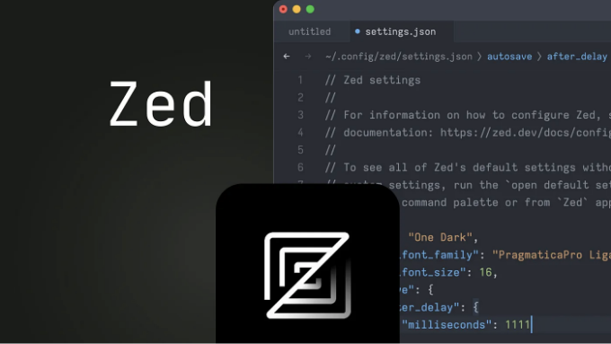
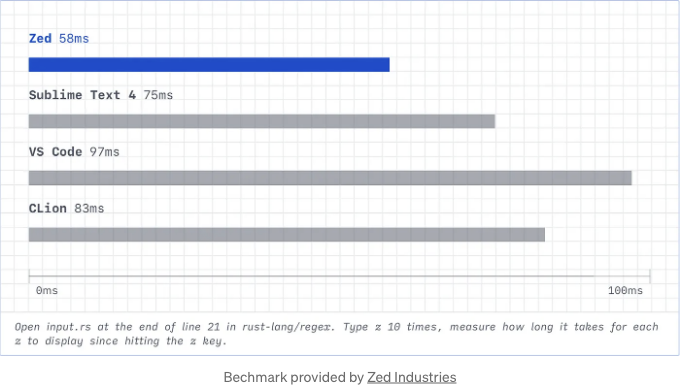
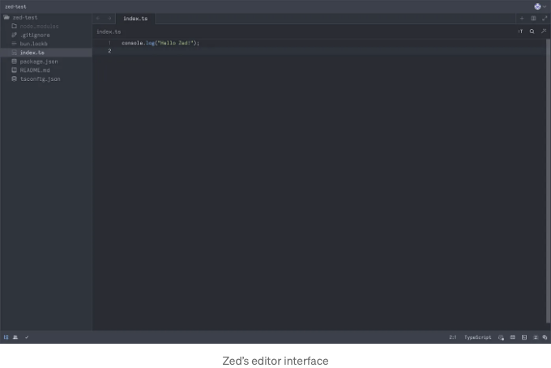
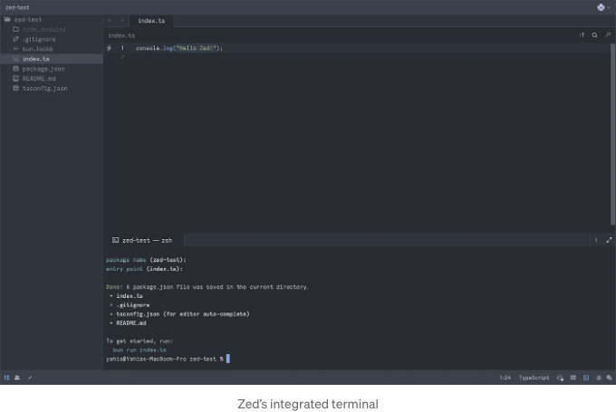
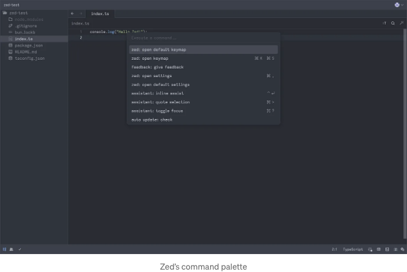
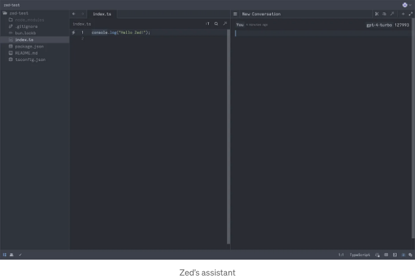
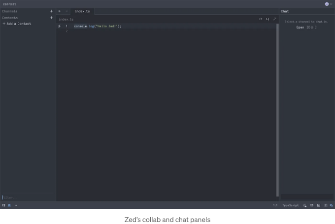
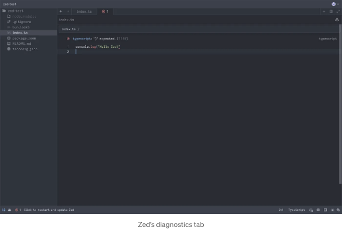
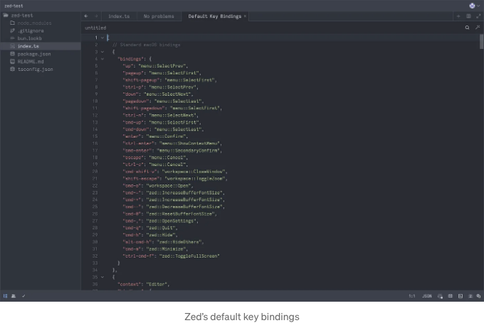

## 새로운 기술

# 고지사항

작성 시점에서 Zed는 완전히 개발된 IDE가 아닙니다. 아직 베타 버전이며, 이 기사는 이 단계에서 제공하는 것에 대한 초기 미리보기입니다. 현실적으로는 현재 사용 중인 VSCode 또는 다른 IDE에 충실해야 할 것입니다. 에디터의 속도를 정말 중요하게 생각하지 않는 한요.

<!-- ui-log 수평형 -->

<ins class="adsbygoogle"
      style="display:block"
      data-ad-client="ca-pub-4877378276818686"
      data-ad-slot="9743150776"
      data-ad-format="auto"
      data-full-width-responsive="true"></ins>
<component is="script">
(adsbygoogle = window.adsbygoogle || []).push({});
</component>

# 간단히

Zed는 Sublime Text보다 빠르며 강력한 기능을 기본 제공하는 새로운 오픈 소스 IDE입니다.

현재 베타 버전으로 Mac 기기에서만 다운로드할 수 있지만, Windows 및 Linux 지원이 준비 중에 있습니다.

# #0: 현재 문제

<!-- ui-log 수평형 -->

<ins class="adsbygoogle"
      style="display:block"
      data-ad-client="ca-pub-4877378276818686"
      data-ad-slot="9743150776"
      data-ad-format="auto"
      data-full-width-responsive="true"></ins>
<component is="script">
(adsbygoogle = window.adsbygoogle || []).push({});
</component>

VSCode는 현재 프로그래밍 여정을 시작하려는 누구에게나 가장 적합한 편집기입니다. 현재 가장 인기 있는 통합 개발 환경(IDE)입니다. 현대적이고 우아하며 기능이 풍부하며 강력합니다. HTML, CSS 및 JavaScript로 완전히 작성되어 대부분의 개발자에게 접근하기 쉽게 확장할 수 있으며 이미 다수의 확장 기능이 있어 행동을 수정하거나 테마를 변경하거나 무수히 많은 언어 및 프레임워크를 지원하도록 확장할 수 있습니다.

VSCode는 거의 완벽하지만 중요한 문제가 있습니다: 속도가 느립니다.

이전에 언급했듯이 VSCode는 웹 기술만으로 구축되었으며 여러 플랫폼에서 이를 달성하기 위해 Electron.js를 사용합니다 - HTML, CSS 및 JavaScript를 사용하여 크로스 플랫폼 데스크톱 앱을 구축하는 프레임워크입니다. Electron은 인기가 많고 강력하지만 느리고 렉이 걸리고 메모리를 많이 사용하는 것으로 알려져 있습니다. 그래서 최근에 성능이 우수한 Tauri와 같은 프레임워크가 급부상하고 있습니다.

VSCode의 성능 문제는 새로운, 더 빠르고 메모리 사용량이 적은 대안의 개발로 이어졌습니다. 최근 인기를 얻은 경쟁 옵션 중 하나는 Zed입니다.

<!-- ui-log 수평형 -->

<ins class="adsbygoogle"
      style="display:block"
      data-ad-client="ca-pub-4877378276818686"
      data-ad-slot="9743150776"
      data-ad-format="auto"
      data-full-width-responsive="true"></ins>
<component is="script">
(adsbygoogle = window.adsbygoogle || []).push({});
</component>

# #1: 새로운 IDE

Zed은 Atom과 Tree-sitter의 창시자들이 개발한 것으로, VSCode의 위치를 대체할 새로운 IDE로 자리 잡으려고 합니다.

최근 오픈 소스로 공개되었으며, 다음과 같은 강력한 기능들을 내장하고 있습니다:

## 놀라운 속도

<!-- ui-log 수평형 -->

<ins class="adsbygoogle"
      style="display:block"
      data-ad-client="ca-pub-4877378276818686"
      data-ad-slot="9743150776"
      data-ad-format="auto"
      data-full-width-responsive="true"></ins>
<component is="script">
(adsbygoogle = window.adsbygoogle || []).push({});
</component>

제드는 이 벤치마크에서 보듯이 서브라임 텍스트와 같은 경량 편집기보다 우수한 성능을 발휘할 수 있으며, VSCode보다 거의 2배 빠르게 작동합니다:

제드의 독특한 성능은 두 가지 주요 이유로 설명할 수 있습니다:

- 제드는 러스트로 개발되어 GPU의 성능을 활용하는 GPUI 라는 새로 개발된 프레임워크를 사용하여 뛰어난 속도와 안정성을 구현합니다.
- 제드를 효율적으로 만드는 또 다른 기능은 다중 코어 및 멀티스레딩을 활용하는 능력입니다. 이는 이전에 썼던 이 글에서 Conflict-Free Replicated Data Types 또는 CRDTs를 사용함으로써 달성됩니다. 관련 내용은 링크에서 자세히 읽어볼 수 있어요.

<!-- ui-log 수평형 -->

<ins class="adsbygoogle"
      style="display:block"
      data-ad-client="ca-pub-4877378276818686"
      data-ad-slot="9743150776"
      data-ad-format="auto"
      data-full-width-responsive="true"></ins>
<component is="script">
(adsbygoogle = window.adsbygoogle || []).push({});
</component>

## 원활한 협업

Zed가 빛을 발하는 또 다른 기능은 강력한 협업 도구입니다. Zed는 CRDT를 사용하여 실시간 코드 협업을 기본으로 지원하며 향상된 경험을 위해 통합된 채팅 인터페이스도 제공합니다.

## 통합된 인공 지능

Zed에는 GitHub Copilot을 지원하는 내장 기능뿐만 아니라, ChatGPT-3.5 또는 GPT-4와 통합된 어시스턴트도 포함되어 있어 여러 줄의 코드를 순식간에 작성하고 리팩터링할 수 있습니다.

<!-- ui-log 수평형 -->

<ins class="adsbygoogle"
      style="display:block"
      data-ad-client="ca-pub-4877378276818686"
      data-ad-slot="9743150776"
      data-ad-format="auto"
      data-full-width-responsive="true"></ins>
<component is="script">
(adsbygoogle = window.adsbygoogle || []).push({});
</component>

## 상자 안의 내용

Zed의 몇 가지 추가적인 멋진 기능들은 다음과 같습니다:

- 전체 문법 트리를 유지하므로 쓰시는 동안 모든 버퍼에 대한 언어 인식이 가능하며, 이에 Language Server Protocol (LSP) 지원을 더하면 정확한 코드 하이라이팅, 강력한 자동 완성, 그리고 다른 혜택들을 누릴 수 있습니다.
- 내장된 완전한 터미널을 통해 에디터에서 즉시 쉘 액세스를 제공합니다.
- 처음부터 코딩 능력을 높이기 위한 내장된 Vim 모드 및 VSCode 스타일의 기본 바인딩이 제공됩니다.
- 에디터를 자신의 것으로 만들기 위한 다양한 밝은 테마와 어두운 테마를 선택할 수 있으며, Zed 1.0에 가까워짐에 따라 사용자 정의 테마를 만들고 로드하는 방법이 약속되어 있습니다.
- 에디터로부터 바로 설치할 수 있는 CLI 도구를 통해 터미널에서 파일과 프로젝트를 열 수 있습니다.

이것이 Zed가 제공하는 모든 기능은 아닙니다. 더 많은 기능들은 그들의 웹사이트에서 확인할 수 있습니다.

<!-- ui-log 수평형 -->

<ins class="adsbygoogle"
      style="display:block"
      data-ad-client="ca-pub-4877378276818686"
      data-ad-slot="9743150776"
      data-ad-format="auto"
      data-full-width-responsive="true"></ins>
<component is="script">
(adsbygoogle = window.adsbygoogle || []).push({});
</component>

## 단점

베타 버전인 Zed에는 현재 몇 가지 문제가 있습니다.

- 물론 버그가 있어요.
- 완전히 다듬어지지 않은 타이핑 경험.
- 현재는 맥 디바이스에서만 다운로드 가능하지만, 윈도우 및 리눅스 지원이 곧 될 예정입니다.
- 현재 확장 프로그램을 만들거나 사용하는 방법은 없지만, 향후 버전에서 지원될 예정입니다.
- VSCode를 사용해본 적이 있다면 내장 소스 컨트롤, 디버깅 및 테스트 패널, 그리고 파일 개요와 같은 일부 기능이 부족합니다.

지금 Zed가 가지고 있는 이러한 문제들은 일반적으로 베타 제품에는 있을 수 있는 것이라고 할 수 있습니다. 희망차 너무나도 많이 이 문제들이 1.0이 되기 전에 모두 해결될 것입니다.

<!-- ui-log 수평형 -->

<ins class="adsbygoogle"
      style="display:block"
      data-ad-client="ca-pub-4877378276818686"
      data-ad-slot="9743150776"
      data-ad-format="auto"
      data-full-width-responsive="true"></ins>
<component is="script">
(adsbygoogle = window.adsbygoogle || []).push({});
</component>

# #2: 사진

그만 이야기하고, 실제 편집기를 봐볼까요:

<!-- ui-log 수평형 -->

<ins class="adsbygoogle"
      style="display:block"
      data-ad-client="ca-pub-4877378276818686"
      data-ad-slot="9743150776"
      data-ad-format="auto"
      data-full-width-responsive="true"></ins>
<component is="script">
(adsbygoogle = window.adsbygoogle || []).push({});
</component>

<!-- ui-log 수평형 -->

<ins class="adsbygoogle"
      style="display:block"
      data-ad-client="ca-pub-4877378276818686"
      data-ad-slot="9743150776"
      data-ad-format="auto"
      data-full-width-responsive="true"></ins>
<component is="script">
(adsbygoogle = window.adsbygoogle || []).push({});
</component>

# #3: 결론

Zed는 성능, 기능 및 강력함에서 독특한 IDE이며 베타 버전이지만 이미 인상적인 작업 도구이며 미래에 더 많은 기능을 갖추어 널리 사용되는 VSCode에 강력한 경쟁 상대가 될 것이라고 확신합니다.

# Stackademic

<!-- ui-log 수평형 -->

<ins class="adsbygoogle"
      style="display:block"
      data-ad-client="ca-pub-4877378276818686"
      data-ad-slot="9743150776"
      data-ad-format="auto"
      data-full-width-responsive="true"></ins>
<component is="script">
(adsbygoogle = window.adsbygoogle || []).push({});
</component>
