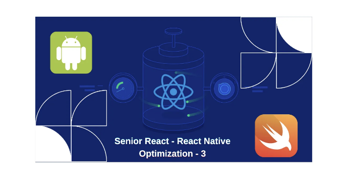
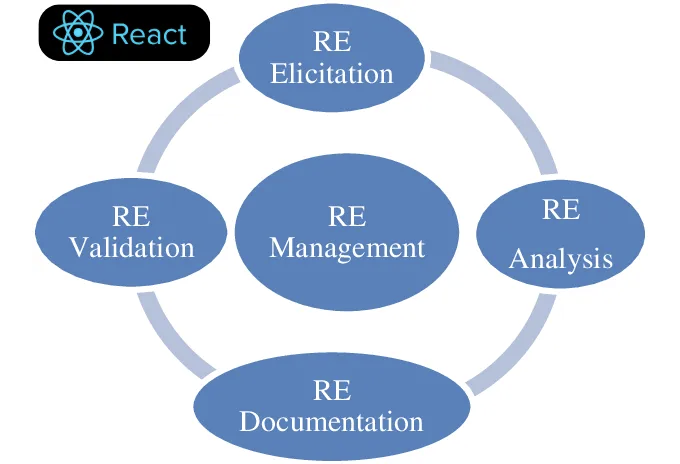
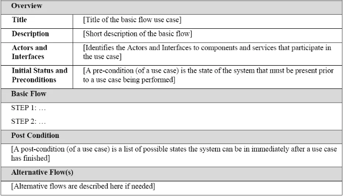

제 3부



⛵ 여러분들 다시 한 번 인사드립니다

얼마간 시간이 부족해서 고수 수준의 리액트 네이티브 최적화 기사를 계속하지 못했어요. 이번 주에는 죄송하다는 말과 함께 멋진 글을 계속하겠습니다.

<!-- ui-log 수평형 -->

<ins class="adsbygoogle"
      style="display:block"
      data-ad-client="ca-pub-4877378276818686"
      data-ad-slot="9743150776"
      data-ad-format="auto"
      data-full-width-responsive="true"></ins>
<component is="script">
(adsbygoogle = window.adsbygoogle || []).push({});
</component>

나는 이전 기사에서 다음과 같은 주제에 많은 강조를 해왔어

- 코드의 품질과 최적화
- 응용 프로그램의 디자인과 아키텍처
  이러한 주제에 대해 조금 더 이야기하고 싶어.

이 요구사항 엔지니어링은 이 시점에서 매우 중요한 위치를 차지한다. 소프트웨어 프로세스에 참여해본 적이 있다면, 이 프로세스가 코드를 작성하는 것만큼 중요하지 않다는 것을 알 것이다. 코드를 작성하는 대신 시스템이 기대하는 것은 무엇이며, 시스템과 사용자 간에 어떤 상호 작용이 있어야 하는지, 사용자가 시스템에 대해 기본적으로 어떤 기대를 가지고 있는지와 같은 질문에 대답하는 것이 코드 작성만큼 중요하다.

프로그래머가 아닌 엔지니어인 경우, 이 프로세스가 훨씬 중요한 위치를 차지한다. 소프트웨어 엔지니어링의 기초는 대안적 요구사항과 기본적 요구사항 엔지니어링에 기반을 두고 있다.



<!-- ui-log 수평형 -->

<ins class="adsbygoogle"
      style="display:block"
      data-ad-client="ca-pub-4877378276818686"
      data-ad-slot="9743150776"
      data-ad-format="auto"
      data-full-width-responsive="true"></ins>
<component is="script">
(adsbygoogle = window.adsbygoogle || []).push({});
</component>

시니어 레벨 엔지니어가 되고 싶다면 요구사항 엔지니어링을 잘 적용하고 시스템의 복잡성을 최소화해야 해요. 제가 안겨준 정보는 매우 중요하니 꼼꼼히 읽지 않으면 그냥 넘어가지 마세요. 이 프로세스는 모바일 애플리케이션을 개발할 때도 똑같이 작동해요. 은행 애플리케이션이나 모바일 프로젝트를 진행 중이라면 요구사항 엔지니어링을 적용하지 않으면 시스템을 최적화하기 어려울 뿐 아니라 미래의 새로운 요구사항에 대응하기도 어려워질 거예요.

리액트 세계에서 요구사항 엔지니어링이 어떻게 진행되는지에 대한 설명적인 자료는 많지 않아요. 이것은 요구사항 엔지니어링을 적용하는 것이 부분 분야에서 유사하기 때문이에요. 하지만 리액트 네이티브와 리액트 세계의 요구사항을 모든 소프트웨어 개발 프로세스와 마찬가지로 생각하는 시니어 개발자는 없어요.

이 단락은 아주 중요해요 ❗

리액트 네이티브로 개발할 때 사용하는 패키지와 상태 관리는 복잡성을 최소화하기 위해 설계되어야 해요.

<!-- ui-log 수평형 -->

<ins class="adsbygoogle"
      style="display:block"
      data-ad-client="ca-pub-4877378276818686"
      data-ad-slot="9743150776"
      data-ad-format="auto"
      data-full-width-responsive="true"></ins>
<component is="script">
(adsbygoogle = window.adsbygoogle || []).push({});
</component>

앱 코딩을 시작할 때 최적화를 고려해야 합니다. 시니어 레벨에 위치하기 위해서는 이겁니다. 그렇지 않으면 진전을 이루지 못하고 애플리케이션이 복잡한 최적화로부터 멀어질 것입니다.

React Native 세계에서 상태 관리는 가장 중요한 요구 사항 공학을 바탕으로 합니다.

어플리케이션이 기본적으로 무엇을 충족해야 하는지 결정한 후에 상태 관리를 최소화하십시오.

상태 관리가 복잡하고 관리하기 어렵다면 이 프로젝트에서 어떤 최적화 혜택도 기대하지 마십시오. 여기서 약간 냉혹할 필요가 있습니다. 상태 관리가 좋지 않으면 어떻게 보면 잘 작동하더라도 프로젝트는 좋지 않습니다.

<!-- ui-log 수평형 -->

<ins class="adsbygoogle"
      style="display:block"
      data-ad-client="ca-pub-4877378276818686"
      data-ad-slot="9743150776"
      data-ad-format="auto"
      data-full-width-responsive="true"></ins>
<component is="script">
(adsbygoogle = window.adsbygoogle || []).push({});
</component>

🧠 요구 사항 확인 프로세스를 통해 당신에게서 기대되는 기본 기능들을 걸러냅니다.

📌 리액트 네이티브에서 이 프로세스는 어떻게 진행되나요?

- 먼저, 프로젝트에 대해 알려받아야 합니다. 이 어플리케이션으로부터 원하는 것이 무엇인지, 어플리케이션의 주요 목적은 무엇인지, 사용자가 어떻게 반응해야 하는지, 프로젝트가 완료되었을 때 고객이 기대하는 것은 무엇인지, 속도 측면에서 중요한 부분들은 무엇인지를 파악해야 합니다. 즉, 요구 사항의 체계적인 수동 분석을 수행하세요.

이러한 접근법이 어떻게 도움이 될까요?

<!-- ui-log 수평형 -->

<ins class="adsbygoogle"
      style="display:block"
      data-ad-client="ca-pub-4877378276818686"
      data-ad-slot="9743150776"
      data-ad-format="auto"
      data-full-width-responsive="true"></ins>
<component is="script">
(adsbygoogle = window.adsbygoogle || []).push({});
</component>

위의 기사가 제공하는 혜택은 전체 애플리케이션에 영향을 줄 중요한 요소입니다. 이것은 프로젝트 흐름에 완전히 영향을 미치며 애플리케이션에서 사용할 패키지, 상태 관리 및 구성 요소 구조와 같은 여러 문제에 대해 당신을 깨우칠 것입니다.

❗❗ 남은 리액트 네이티브 요구 엔지니어링 항목은, 간단히 말해, 프로토타이핑 및 테스트 케이스 제출입니다. 나중에 이에 대해 이야기하겠습니다. 지금은 첫 번째 항목에 집중해봅시다.

첫 번째 항목에 초점을 맞추었습니다. 자, 마음 속에 시나리오를 만들어 봅시다. 우리의 시나리오는 간단합니다. 고객이 와서 다음을 말했습니다:

1- 홈페이지에 사용자가 있을 것이며 모든 사용자가 이 페이지에 표시될 것입니다. 회사에는 총 3500 명의 직원이 있습니다.👇🏻

<!-- ui-log 수평형 -->

<ins class="adsbygoogle"
      style="display:block"
      data-ad-client="ca-pub-4877378276818686"
      data-ad-slot="9743150776"
      data-ad-format="auto"
      data-full-width-responsive="true"></ins>
<component is="script">
(adsbygoogle = window.adsbygoogle || []).push({});
</component>

- 여기에서는 즉시 시니어 요구 사항 엔지니어링을 고려해야 합니다. 이것이 무엇인가요?

🪝 클라이언트가 페이지를 요청했습니다. 그는 이 페이지에서 1000명 이상의 직원을 볼 것이라고 명시했습니다. 여기서 고려해야 할 직원이 한 명 이상이라면서 그 수가 명확하지 않다면 동적으로 유지해야 합니다. 나중에 새로운 직원이 추가된다면 어떻게 할지 생각해야 합니다. 이것은 요구 사항 엔지니어링이 진화 조건을 충족한다는 것을 의미합니다. 이는 새로운 요구 사항에 따라 발전할 수 있다는 것을 의미합니다.

이 경우 직원이 나열될 것이므로 scrollview와 같은 구성 요소를 작성해야 합니다. 하지만 여기서 스스로 물어봐야 할 것이 있습니다: scrollview를 사용해야 할까요, FlatList를 사용해야 할까요? 답은 물론 flatlist입니다. 시니어 수준에 도달하려면 최적화에 주의해야 합니다. FlatList는 메모리 관리를 제공합니다. scrollview는 모든 데이터를 렌더링하지만 flatlist는 스크롤할 때 렌더링합니다. 이것은 엄청난 최적화를 제공합니다. 속도 측면에서 매우 효율적이며 메모리를 방치합니다.

```js
<ScrollView>
  {data.map((item) => {
    return <당신의구성요소 key={item?.id} subtitle={item?.subtitle} />;
  })}
</ScrollView>
```

<!-- ui-log 수평형 -->

<ins class="adsbygoogle"
      style="display:block"
      data-ad-client="ca-pub-4877378276818686"
      data-ad-slot="9743150776"
      data-ad-format="auto"
      data-full-width-responsive="true"></ins>
<component is="script">
(adsbygoogle = window.adsbygoogle || []).push({});
</component>

```js
<FlatList
  data={YOURDATA}
  renderItem={({item}) => <YourComponent subtitle={item?.subtitle />} />
  keyExtractor={item => item?.id}
/>
```

📝 위와 같이 flatlist를 사용해야 해

💡 보는 것처럼 당신 머릿속에서 어떤 변화가 일어나기 시작했어요. React Native에서 시니어 레벨의 요구사항 공학을 이해하기 시작했어요. 다음 질문은 여기에 나타낼 직원들이 클릭될까요?

<!-- ui-log 수평형 -->

<ins class="adsbygoogle"
      style="display:block"
      data-ad-client="ca-pub-4877378276818686"
      data-ad-slot="9743150776"
      data-ad-format="auto"
      data-full-width-responsive="true"></ins>
<component is="script">
(adsbygoogle = window.adsbygoogle || []).push({});
</component>

고객이 '예'라고 하면 즉시 코드 측면과 시스템 측면에서 어떻게 진행할지 상상해야 합니다. 각 직원마다 다른 데이터가 있고 그 데이터를 끌어내야 합니다. 이를 구별해내고 문맥 구조를 설정해야 합니다.

🛠️ 각 직원마다 다른 데이터가 있고 그 데이터를 끌어내야 합니다. 이를 구별해내고 문맥 구조를 설정해야 합니다. 이제 우리가 상태에 깊숙이 파고들고 있다는 걸 알 수 있습니다. 상태 관리를 고려할 때, Context API를 사용하거나 대체 시나리오를 고려하고 있습니다.

```js
import React, { useState, createContext } from "react";

export const YourContext = createContext();

export const YourProvider = ({ children }) => {
  const [worker, setWorker] = useState(0);

  return <YourContext.Provider value={(worker, setWorker)}>{children}</YourContext.Provider>;
};
```

위와 같이 Context를 생성하고 프로젝트 외부를 Provider로 감싸면, 원하는 직원 ID를 기반으로 요청을 만들고 데이터를 끌어내어 세부 정보를 보여줄 수 있습니다. 보시다시피, 우리는 고객과 대화하고 시스템 설계에 대해 고민하며 시스템이 어떻게 응답해야 하며 어떤 작업을 해야 하는지 생각합니다. 이로써 React Native에서 요구 사항 공학에 대해 이야기한 첫 번째 포인트를 구현한 것을 확인할 수 있습니다.

<!-- ui-log 수평형 -->

<ins class="adsbygoogle"
      style="display:block"
      data-ad-client="ca-pub-4877378276818686"
      data-ad-slot="9743150776"
      data-ad-format="auto"
      data-full-width-responsive="true"></ins>
<component is="script">
(adsbygoogle = window.adsbygoogle || []).push({});
</component>

2- 애플리케이션에 몇 페이지가 들어갈지 다음 단계입니다.

고객은 애플리케이션에 3페이지가 들어갈 것이라고 말했습니다. 하나는 방금 언급한 직원 목록 페이지이고, 다른 하나는 설정 페이지이며, 또 다른 하나는 직원을 클릭했을 때 열리는 상세 페이지입니다.

⚠️⚠️ 요구 사항 공학을 기반으로 상세 페이지에 무엇이 있어야 하며, 설정 페이지가 어디에 위치해야 하는지에 대해 즉시 질문해야 합니다.

고객은 홈 페이지와 설정 페이지가 하단에 있어야 한다고도 말했습니다.

<!-- ui-log 수평형 -->

<ins class="adsbygoogle"
      style="display:block"
      data-ad-client="ca-pub-4877378276818686"
      data-ad-slot="9743150776"
      data-ad-format="auto"
      data-full-width-responsive="true"></ins>
<component is="script">
(adsbygoogle = window.adsbygoogle || []).push({});
</component>

📣📣📣📣

이 경우, 우리의 목표는 이 네비게이션 프로세스를 최적화된 방식으로 어떻게 관리할 수 있는지를 고려하는 것입니다. 왜냐하면 미래에 새로운 페이지들이 추가될 수 있기 때문이죠. 나중에는 다른 프로바이더를 사용할 수도 있으니, 전체적인 HOC를 사용하는 것이 아니라 페이지별 프로바이더를 사용할 것을 고려해야 합니다. 이것은 리액트 네이티브에서 완전히 상급 수준의 요구 사항 엔지니어링 구현입니다. 이것은 매우 중요합니다, 제가 언급한 상황들을 습관화해주세요.

📣📣📣📣

```js
import { Navigation } from "react-native-navigation";
import withSafeAreaView from "ui/components/SafeAreaView";
import withDropdownAlert from "ui/components/WithDropdownAlert";
import withModal from "ui/components/ModalComponent";
import withStatusBar from "ui/components/WithStatusBar";
import withBackPress from "ui/components/BackPress";
import withKeyboardMonitor from "ui/components/KeyboardMonitor";
import Home from "ui/views/wallet/Home";
import WalletResetRequirePassword from "ui/views/wallet/WalletResetRequirePassword";
import PrivacyPolicy from "ui/views/onboarding/PrivacyPolicy";
import MigrationComponent from "ui/components/Migration";
import { isIPhoneX, isAndroid } from "libs/device";

function applyHOCs(screen) {
  const withHOCs = (c) => withKeyboardMonitor(withDropdownAlert(withStatusBar(withModal(c))));
  if (isIPhoneX) {
    return withHOCs(withSafeAreaView(screen));
  }
  if (isAndroid) {
    return withBackPress(withHOCs(screen));
  }
  return withHOCs(screen);
}

export default function registerScreens(store, Provider) {
  Navigation.registerComponentWithRedux("migration", () => applyHOCs(MigrationComponent), Provider, store);
  Navigation.registerComponentWithRedux("home", () => applyHOCs(Home), Provider, store);
  Navigation.registerComponentWithRedux("walletResetConfirm", () => applyHOCs(WalletResetConfirmation), Provider, store);
  Navigation.registerComponentWithRedux("walletResetRequirePassword", () => applyHOCs(WalletResetRequirePassword), Provider, store);
  Navigation.registerComponentWithRedux("privacyPolicy", () => applyHOCs(PrivacyPolicy), Provider, store);
}
```

<!-- ui-log 수평형 -->

<ins class="adsbygoogle"
      style="display:block"
      data-ad-client="ca-pub-4877378276818686"
      data-ad-slot="9743150776"
      data-ad-format="auto"
      data-full-width-responsive="true"></ins>
<component is="script">
(adsbygoogle = window.adsbygoogle || []).push({});
</component>

당신이 상기 제시한 예시와 같은 페이지 구조를 사용할 것이라고 즉시 상상할 수 있을 것입니다. 이것에 대해 생각하면서 시간이 지남에 따라 도달하게 될 것입니다. 당신의 상상력과 코드 품질은 시간이 지남에 따라 향상될 것입니다.

3- 고객이 각 직원이 여러 개의 이미지를 가지고 있다고 말합니다.

이 경우, 요구 사항 엔지니어링을 통해 이미지를 어떻게 함께 관리할 수 있는지 상상하고 즉각적인 최적화를 보장하기 위해 고객에게 마음속에 있는 질문을 하십시오. 여기에서 먼저 떠오르는 것은 직원이 얼마나 많은 사진을 가질 것이고 이를 어떻게 최적화할 수 있는지 일 것입니다.

⚠️ 이를 위해 이미지를 캐시에 보관하는 아이디어를 상상해 보세요. 그리고 이미지를 받는 상황을 고려해 보세요. 이미지는 어떤 형식으로 제공될지 물어보는 것을 망설이지 마세요. Base64로 올 것인가요, 아니면 다른 형식일까요? 변환해야 하나요? 이는 응용 프로그램의 최적화와 발전에 매우 중요합니다.

<!-- ui-log 수평형 -->

<ins class="adsbygoogle"
      style="display:block"
      data-ad-client="ca-pub-4877378276818686"
      data-ad-slot="9743150776"
      data-ad-format="auto"
      data-full-width-responsive="true"></ins>
<component is="script">
(adsbygoogle = window.adsbygoogle || []).push({});
</component>

사진 작업을 하면서 고위차원의 해결책을 어떻게 생산할 수 있을지 상상합니다. 빠른 이미지와 같은 패키지를 검토하거나 사용자 정의 캐시에서 빠른 최적화에 유용한 구성 요소와 함수를 작성할 수도 있습니다.

이러한 습관을 습득하고 요구 사항 검토, 발견 및 분류를 적용하면 요구 사항 엔지니어링의 첫 번째 단계로 좋은 최적화를 달성할 수 있습니다. 요구 사항을 우선순위로 지정하고 문서화해도 됩니다.



React Native 및 React 프로젝트에서 유스케이스 사용 방법과 이후 사전 및 사후 조건을 결정해야 하는 방법에 대해 이야기하겠습니다. 언급한 주제는 고위차원의 소프트웨어 엔지니어링의 기초를 포함하고 있습니다. 이를 적용하고 이러한 단계로 React Native 프로젝트를 구축하면 최상의 최적화와 품질을 제공할 수 있습니다. 이 문서를 잘 살펴보세요. 인터넷에는 이와 같은 것이 없습니다. 😉

<!-- ui-log 수평형 -->

<ins class="adsbygoogle"
      style="display:block"
      data-ad-client="ca-pub-4877378276818686"
      data-ad-slot="9743150776"
      data-ad-format="auto"
      data-full-width-responsive="true"></ins>
<component is="script">
(adsbygoogle = window.adsbygoogle || []).push({});
</component>
