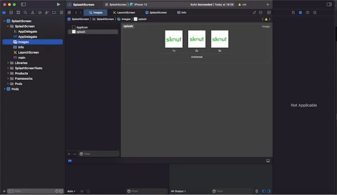

안녕하세요 여러분. 좋은 하루 되시길 바랍니다. 이번에는 리액트 네이티브 앱에서 안드로이드 및 iOS용 스플래시 화면을 설정하는 경험을 공유하려고 해요. 함께 알아보겠습니다..


이를 위해 라이브러리가 필요합니다. https://www.npmjs.com/package/react-native-splash-screen 가 널리 사용되는 라이브러리입니다. 그래서 인기도와 활발한 업데이트로 인해 이것을 선택할 거에요.

스플래시 화면은 사용자가 앱의 기능을 이용하기 전에 나타나는 첫 화면입니다. 스플래시 화면은 모바일 애플리케이션의 브랜드 이름과 아이콘을 사용자에게 기억되게 하는 가장 좋은 방법 중 하나라고 할 수 있어요. 더 많은 내용은 여기에서 확인해보세요: https://docs.expo.dev/develop/user-interface/splash-screen/

<!-- ui-log 수평형 -->

<ins class="adsbygoogle"
      style="display:block"
      data-ad-client="ca-pub-4877378276818686"
      data-ad-slot="9743150776"
      data-ad-format="auto"
      data-full-width-responsive="true"></ins>
<component is="script">
(adsbygoogle = window.adsbygoogle || []).push({});
</component>

React Native에서 스플래시 화면을 만드는 것에는 많은 이점이 있어요. 예를 들어 API에서 데이터를 로드하는 시나리오를 생각해보세요. 사용자가 기다리는 동안 로더를 보여주는 것은 좋은 사용자 경험입니다. 같은 원리가 스플래시 화면에도 적용됩니다. 앱이 시작되자마자 로더를 보여주면 사용자가 앱을 기다리는 동안 깔끔하고 잘 디자인된 화면을 제공할 수 있어요.

이 React Native 스플래시 화면 데모에서 Android와 iOS용 스플래시 화면을 만들어볼 거에요. 이 튜토리얼은 올바른 이미지 크기를 준비하고 필요한 파일을 업데이트하며 앱을 로드할 때 스플래시 화면을 숨기는 방법을 안내할 거예요. 완성된 앱은 아래 스크린샷처럼 보일 거에요:


<!-- ui-log 수평형 -->

<ins class="adsbygoogle"
      style="display:block"
      data-ad-client="ca-pub-4877378276818686"
      data-ad-slot="9743150776"
      data-ad-format="auto"
      data-full-width-responsive="true"></ins>
<component is="script">
(adsbygoogle = window.adsbygoogle || []).push({});
</component>

모바일 애플리케이션을 위한 스플래시 화면을 만드는 것은 조심스러울 수 있습니다. 스플래시 화면 해상도의 불일치로 인해 일부 기기에서 표시 문제가 발생하지 않도록 조심해야 합니다. 예를 들어, 안드로이드 기기의 요구 사항은 iOS와는 전혀 다릅니다. 대부분의 숙련된 디자이너들은 두 기기 모두에 필요한 스플래시 화면 해상도를 처음부터 만들어낼 수 있습니다.

그러나 안드로이드와 iOS용 스플래시 화면을 만들어주는 많은 제3자 도구들이 있습니다. 이 튜토리얼에서는 안드로이드 및 iOS 앱용 아이콘 및 이미지를 만들 수 있는 온라인 플랫폼인 '앱 아이콘 생성기'를 사용하겠습니다.

먼저, Appicon에 들어가세요. 이미지를 상자에 끌어다 놓고, 기본 크기로 4배를 선택해주세요. iOS와 Android 모두에 체크하고 '생성'을 클릭하십시오.

<!-- ui-log 수평형 -->

<ins class="adsbygoogle"
      style="display:block"
      data-ad-client="ca-pub-4877378276818686"
      data-ad-slot="9743150776"
      data-ad-format="auto"
      data-full-width-responsive="true"></ins>
<component is="script">
(adsbygoogle = window.adsbygoogle || []).push({});
</component>

그럼, 이제 다운로드한 파일을 추출해서 iOS 및 Android 폴더를 클론한 스타터 프로젝트의 assets 디렉토리에 위치한 assets 폴더로 복사해주세요:


```js
// 의존성 패키지를 설치하려면 다음 명령을 실행하세요
/* npm */
npm i react-native-splash-screen --save

/* yarn */
yarn add react-native-splash-screen
```

# iOS용 스플래시 화면 구축

<!-- ui-log 수평형 -->

<ins class="adsbygoogle"
      style="display:block"
      data-ad-client="ca-pub-4877378276818686"
      data-ad-slot="9743150776"
      data-ad-format="auto"
      data-full-width-responsive="true"></ins>
<component is="script">
(adsbygoogle = window.adsbygoogle || []).push({});
</component>

```js
cd ios // IOS 디렉터리로 이동하세요
pod install
```

다음으로, AppDelegate.mm 파일로 이동하여 다음 코드를 업데이트하세요. 코드 #import "RNSplashScreen"을 추가하고 기본적으로 스플래시 화면을 표시하도록 설정하세요 [RNSplashScreen show]

```js
#import "AppDelegate.h"
#import "RNSplashScreen.h"

#import <React/RCTBundleURLProvider.h>

@implementation AppDelegate
- (BOOL)application:(UIApplication *)application didFinishLaunchingWithOptions:(NSDictionary *)launchOptions
{
  self.moduleName = @"Aptster";
  // 아래 사전에 사용자 정의 초기 속성을 추가할 수 있습니다.
  // React Native에서 사용하는 ViewController로 전달됩니다.
  self.initialProps = @{};
  BOOL ret = [super application:application didFinishLaunchingWithOptions:launchOptions];
  if (ret == YES)
  {
    [RNSplashScreen show];
  }
  return ret;
}

...............
...
...
```

이제 Xcode에서 프로젝트 워크스페이스를 열고 Images를 클릭한 다음 Appicon 아래 아무 곳이나 마우스 오른쪽 버튼을 클릭하고 새 이미지 세트를 선택하세요. 이미지 이름을 "splash"로 설정하고 assets 폴더를 열어 iOS 폴더로 이동하세요. iOS의 세 가지 이미지를 Xcode의 1x, 2x 및 3x란에 각각 드래그하세요:```

<!-- ui-log 수평형 -->

<ins class="adsbygoogle"
      style="display:block"
      data-ad-client="ca-pub-4877378276818686"
      data-ad-slot="9743150776"
      data-ad-format="auto"
      data-full-width-responsive="true"></ins>
<component is="script">
(adsbygoogle = window.adsbygoogle || []).push({});
</component>



다음으로, LaunchScreen.storyboard를 선택하세요. View Controller Scene `View Controller` View를 선택하고, SplashScreen과 Powered by React Native 라벨을 클릭한 후 키보드에서 Delete를 눌러주세요.

다음으로, View를 선택하고 Xcode 오른쪽 상단의 줄자 아이콘을 클릭하세요. Safe Area Layout Guide 옵션을 해제하고, 더하기 아이콘 +를 클릭하고 객체 검색란에 "이미지 뷰"를 입력한 다음 "이미지 뷰"를 View 캔버스로 끌어다가주세요:


<!-- ui-log 수평형 -->

<ins class="adsbygoogle"
      style="display:block"
      data-ad-client="ca-pub-4877378276818686"
      data-ad-slot="9743150776"
      data-ad-format="auto"
      data-full-width-responsive="true"></ins>
<component is="script">
(adsbygoogle = window.adsbygoogle || []).push({});
</component>

이미지 뷰를 설정했으니 이미지 속성 아이콘을 클릭하고 이미지를 "splash"로 변경하세요. 콘텐츠 모드를 "aspect fit"으로 설정하세요. 아래와 같이 설정해주세요:


# Android용 스플래시 화면 만들기

MainActivity.kt 파일에 다음 라인을 추가하세요:-

<!-- ui-log 수평형 -->

<ins class="adsbygoogle"
      style="display:block"
      data-ad-client="ca-pub-4877378276818686"
      data-ad-slot="9743150776"
      data-ad-format="auto"
      data-full-width-responsive="true"></ins>
<component is="script">
(adsbygoogle = window.adsbygoogle || []).push({});
</component>

```js
package com.techoedgecorp.aptster
import android.os.Bundle; // 이 줄 추가
import com.facebook.react.ReactActivity
import com.facebook.react.ReactActivityDelegate
import com.facebook.react.defaults.DefaultNewArchitectureEntryPoint.fabricEnabled
import com.facebook.react.defaults.DefaultReactActivityDelegate
import org.devio.rn.splashscreen.SplashScreen;

class MainActivity : ReactActivity() {

   override fun onCreate(savedInstanceState: Bundle?) {
    SplashScreen.show(this);  // 이 줄 추가
    super.onCreate(null)
  }
```

다음으로, app/src/main/res/layout에 launch_screen.xml이라는 파일을 만드세요. 또한, layout 폴더를 만들어야 하는 경우도 있습니다:

```xml
<!-- launch_screen.xml -->

<?xml version="1.0" encoding="utf-8"?>
<RelativeLayout xmlns:android="http://schemas.android.com/apk/res/android"
    android:orientation="vertical" android:layout_width="match_parent"
    android:layout_height="match_parent">
    <ImageView android:layout_width="match_parent" android:layout_height="match_parent" android:src="@drawable/launch_screen" android:scaleType="centerCrop" />
</RelativeLayout>
```

```

<!-- ui-log 수평형 -->

<ins class="adsbygoogle"
      style="display:block"
      data-ad-client="ca-pub-4877378276818686"
      data-ad-slot="9743150776"
      data-ad-format="auto"
      data-full-width-responsive="true"></ins>
<component is="script">
(adsbygoogle = window.adsbygoogle || []).push({});
</component>

위 이미지에 표시된 대로, 적절한 폴더에 만들어둔 스플래시 화면용 launch_screen.png 이미지를 추가하세요.

메인 `styles.xml`에 다음 줄을 추가하여 안드로이드 시스템에서 제공하는 기본 스플래시 화면을 투명하게 만드세요. 안드로이드 12부터는 사용자가 앱 아이콘을 클릭할 때마다 안드로이드 시스템 앱 런처가 기본 스플래시 화면을 제공합니다. 그렇지 않으면 먼저 안드로이드 기본 스플래시 화면을 본 후에 우리의 스플래시 화면을 볼 것입니다.

```js
<resources>

    <!-- Base application theme. -->
    <style name="AppTheme" parent="Theme.AppCompat.DayNight.NoActionBar">
        <!-- Customize your theme here. -->
        <item name="android:editTextBackground">@drawable/rn_edit_text_material</item>
        <item name="android:windowIsTranslucent">true</item>
            <!-- 위 줄 추가..>
    </style>

</resources>
```

# 앱이 로드된 후 스플래시 화면 숨기기

<!-- ui-log 수평형 -->

<ins class="adsbygoogle"
      style="display:block"
      data-ad-client="ca-pub-4877378276818686"
      data-ad-slot="9743150776"
      data-ad-format="auto"
      data-full-width-responsive="true"></ins>
<component is="script">
(adsbygoogle = window.adsbygoogle || []).push({});
</component>

```js
import SplashScreen from 'react-native-splash-screen';
...
...

useEffect(() => {
    SplashScreen.hide();
  }, []);
```

2023년 6월 23일 문제 해결 — React Native "0.72.0" 스플래시 화면이 AppDelegate.mm에 숨겨지지 않는 문제입니다. 이에 우리는 iOS에서 다음 코드를 작성했습니다. 그렇지 않으면 단순히 [RNSplashScreen show]; 이면 충분했을 것입니다.

```js
BOOL ret = [super application:application didFinishLaunchingWithOptions:launchOptions];
if (ret == YES)
{
  [RNSplashScreen show];
}
return ret;
```

# 결론

<!-- ui-log 수평형 -->

<ins class="adsbygoogle"
      style="display:block"
      data-ad-client="ca-pub-4877378276818686"
      data-ad-slot="9743150776"
      data-ad-format="auto"
      data-full-width-responsive="true"></ins>
<component is="script">
(adsbygoogle = window.adsbygoogle || []).push({});
</component>

그거야. 우리는 iOS와 Android용 스플래시 에셋으로 스플래시 화면을 만들었어. 고마워.
