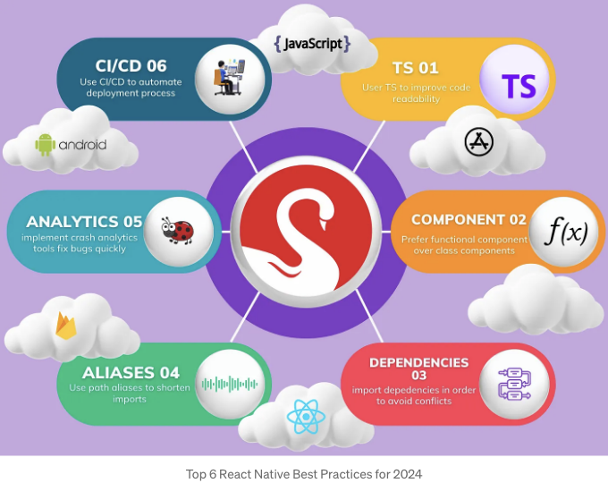
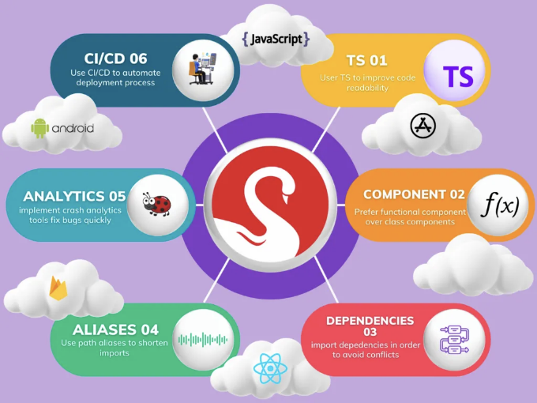

# React Native 프로젝트를 한 단계 높이고 싶으신가요? 혁신적인 소프트웨어 솔루션의 신뢰할 수 있는 파트너 Striver와 연결하세요.



코딩에서의 Best Practices 이해하기

코딩 세계에서 'best practices(최고의 관행)'는 엄격한 규칙보다는 지침을 의미합니다. 처음에는 선택 사항처럼 보일 수 있지만, 이러한 제안에 따르는 것은 코드베이스가 확장됨에 따라 중요해집니다. 처음에는 이러한 규칙 없이도 코드가 적절하게 작동할 수 있지만, 코드가 성장함에 따라 그 유지와 가독성을 유지하는 것이 점점 더 어려워집니다.

<!-- ui-log 수평형 -->

<ins class="adsbygoogle"
      style="display:block"
      data-ad-client="ca-pub-4877378276818686"
      data-ad-slot="9743150776"
      data-ad-format="auto"
      data-full-width-responsive="true"></ins>
<component is="script">
(adsbygoogle = window.adsbygoogle || []).push({});
</component>


알았어요, 이제 본 요점으로 들어가볼게요. React Native의 최상의 규칙들은 무엇일까요? 이건 유지보수 가능한 코드 기반을 만들기 위해 따르는 일련의 지침입니다. 이 글에서는 이러한 규칙들에 대해 더 자세히 알아보겠습니다.

React Native 개발에 몰두하고 모바일 앱 프로젝트에서 탁월함을 추구하고 있나요? Striver는 당신의 성공 여정을 안내해줄 수 있는 귀중한 통찰과 최상의 실천 방법을 제공합니다.



<!-- ui-log 수평형 -->

<ins class="adsbygoogle"
      style="display:block"
      data-ad-client="ca-pub-4877378276818686"
      data-ad-slot="9743150776"
      data-ad-format="auto"
      data-full-width-responsive="true"></ins>
<component is="script">
(adsbygoogle = window.adsbygoogle || []).push({});
</component>

1. 리액트 네이티브 앱에 TypeScript 사용하기

TypeScript는 정적 타입을 갖는 프로그래밍 언어입니다. 이는 변수, 함수 및 기타 요소의 데이터 유형을 명시적으로 정의해야 한다는 것을 의미합니다. 이는 신뢰할 수 있는 코드 작성뿐만 아니라 컴파일 프로세스 중 버그를 잡는 데 도움이 됩니다.

주문 가격을 계산하는 다음을 고려해보세요

```js
function calculatePrice(order) {
  return order.price + 200;
}
```

<!-- ui-log 수평형 -->

<ins class="adsbygoogle"
      style="display:block"
      data-ad-client="ca-pub-4877378276818686"
      data-ad-slot="9743150776"
      data-ad-format="auto"
      data-full-width-responsive="true"></ins>
<component is="script">
(adsbygoogle = window.adsbygoogle || []).push({});
</component>

현재 코드는 잘 작동하지만 주문 객체가 어떤 속성을 포함하는지에 대해 많은 정보를 제공하지 않습니다. 이는 속성이 존재하지 않는 속성에 액세스하려고 할 때 더 큰 충돌로 이어질 수 있습니다.

충돌을 방지하고 가독성을 향상시키기 위해 TypeScript를 사용할 수 있습니다. TypeScript는 JavaScript에 유형을 추가하는 프로그래밍 언어입니다. 이는 객체의 각 속성의 유형을 지정할 수 있어 오류를 방지하는 데 도움이 됩니다.

```js
interface Order {
  price: number;
  name: string;
  taxPercentage: number;
}

function calculatePrice(order: Order) {
  const { price, taxPercentage } = order;
  const taxValue = price * taxPercentage;
  return price + taxValue;
}
```

이제 동일한 기능을 가진 함수를 제공하며 이제 코드에서 객체 속성 및 해당 유형을 인식하기 때문에 기능을 확장하는 것이 더 쉬워집니다.

<!-- ui-log 수평형 -->

<ins class="adsbygoogle"
      style="display:block"
      data-ad-client="ca-pub-4877378276818686"
      data-ad-slot="9743150776"
      data-ad-format="auto"
      data-full-width-responsive="true"></ins>
<component is="script">
(adsbygoogle = window.adsbygoogle || []).push({});
</component>

2. 클래스 컴포넌트 대신 함수형 컴포넌트 사용하기

리액트 네이티브에서는 주로 두 가지 컴포넌트를 사용합니다: 함수형 컴포넌트와 클래스 컴포넌트입니다. 그러나 리액트 네이티브에서는 함수형 컴포넌트를 사용하는 편이 좋습니다. 이 컴포넌트들은 클래스 컴포넌트보다 간단하고 더 간결하며 빠릅니다. 이러한 특징으로 인해 함수형 컴포넌트는 코드를 읽고 쓰고 테스트하기 쉽습니다. 게다가 앱의 성능을 향상시킬 수 있습니다.

컴포넌트가 무엇인지 잘 모르겠다면, 컴포넌트는 리액트 엘리먼트를 반환하는 함수들이라고 생각하시면 됩니다. 따라서 리액트 네이티브 코드를 개선하고 싶다면 클래스 컴포넌트보다 함수형 컴포넌트를 사용하세요. 이것이 리액트 네이티브 개발의 미래입니다.

```jsx
함수형 컴포넌트 예시
```

<!-- ui-log 수평형 -->

<ins class="adsbygoogle"
      style="display:block"
      data-ad-client="ca-pub-4877378276818686"
      data-ad-slot="9743150776"
      data-ad-format="auto"
      data-full-width-responsive="true"></ins>
<component is="script">
(adsbygoogle = window.adsbygoogle || []).push({});
</component>

```js
import React, { Component } from "react";
class ClassComponent extends Component {
  constructor(props) {
    super(props);
    this.state = {
      count: 0,
    };
  }
  incrementCount = () => {
    this.setState({ count: this.state.count + 1 });
  };
  render() {
    return (
      <View>
        <Text style={styles.h1}>Class Component</Text>
        <Text>Count: {this.state.count}</Text>
        <Button title="Increment" onPress={this.incrementCount} />
      </View>
    );
  }
}
export default ClassComponent;
```

이 클래스 컴포넌트 예제에서는 React의 Component 클래스를 사용하여 컴포넌트를 생성합니다. 상태는 컴포넌트의 생성자 내에서 관리되며, 렌더 메서드는 컴포넌트의 UI를 정의합니다.

함수형 컴포넌트 예제

```js
import React, { useState } from "react";
const FunctionalComponent = () => {
  const [count, setCount] = useState(0);
  const incrementCount = () => {
    setCount(count + 1);
  };
  return (
    <View>
      <Text style={styles.h1}>Functional Component</Text>
      <Text>Count: {count}</Text>
      <Button title="Increment" onPress={incrementCount} />
    </View>
  );
};
export default FunctionalComponent;
```

<!-- ui-log 수평형 -->

<ins class="adsbygoogle"
      style="display:block"
      data-ad-client="ca-pub-4877378276818686"
      data-ad-slot="9743150776"
      data-ad-format="auto"
      data-full-width-responsive="true"></ins>
<component is="script">
(adsbygoogle = window.adsbygoogle || []).push({});
</component>

이 함수형 컴포넌트 예제에서는 리액트의 useState 훅을 사용하여 상태를 관리합니다. 컴포넌트는 UI를 렌더링하기 위해 JSX를 반환하는 간단한 JavaScript 함수로 정의됩니다.

3. 의존성을 순서대로 가져오세요

하나의 파일에 많은 import가 있을 때, 제대로 된 정리를 하지 않았다면 필요한 특정 import를 찾는 것이 귀찮을 수 있습니다. 따라서 import를 반드시 순서대로 정리하는 것이 중요합니다.

동시에 의존성이 올바른 순서로 import되도록도 확인해야 합니다. 순서가 올바르지 않으면 컴포넌트의 동작에 영향을 미치고 찾기 어려운 버그를 발생시킬 수 있습니다.

<!-- ui-log 수평형 -->

<ins class="adsbygoogle"
      style="display:block"
      data-ad-client="ca-pub-4877378276818686"
      data-ad-slot="9743150776"
      data-ad-format="auto"
      data-full-width-responsive="true"></ins>
<component is="script">
(adsbygoogle = window.adsbygoogle || []).push({});
</component>

여기에 가져온 항목을 구성하는 방법 예제가 있어요:

- 외부에서 가져온 항목 — react
- 상대 경로와 같은 내부에서 가져온 항목 — ../button
- ./styles.ts와 같은 폴더 안에서 가져온 항목
- 모든 그룹에서 가져온 항목은 알파벳 순으로 정렬할 수 있어요
- 각각의 그룹은 공백으로 구분돼야 해요

Markdown 형식으로 테이블 태그를 변경하는 예시 코드입니다:

```js
import React from "react";
import { TouchableOpacity, View } from "react-native";
import { Button, Card } from "../components";
import { MainLayout } from "../layouts";
import { StyledCard } from "./styles.ts";
```

이러한 문제를 피하기 위해 올바른 가져오기 순서를 자동화하고 강제할 수 있는 Eslint와 Prettier와 같은 형식 지원 도구를 사용할 수 있어요.

<!-- ui-log 수평형 -->

<ins class="adsbygoogle"
      style="display:block"
      data-ad-client="ca-pub-4877378276818686"
      data-ad-slot="9743150776"
      data-ad-format="auto"
      data-full-width-responsive="true"></ins>
<component is="script">
(adsbygoogle = window.adsbygoogle || []).push({});
</component>

4. 긴 임포트를 피하려면 경로 별칭을 사용하세요

경로 별칭은 코드에서 더 짧고 의미 있는 임포트 경로를 생성하는 방법입니다. 이는 깊거나 중첩된 폴더 구조를 가지고 있을 때 유용하며, 임포트를 더 읽고 이해하기 쉽게 만들 수 있습니다.

예를 들어, 다음과 같이 긴 임포트를 작성하는 대신:

```js
import { IconButton } from "../../components/buttons";
import { CircleButton } from "components/buttons";
OR;
import { CircleButton } from "buttons";
```

<!-- ui-log 수평형 -->

<ins class="adsbygoogle"
      style="display:block"
      data-ad-client="ca-pub-4877378276818686"
      data-ad-slot="9743150776"
      data-ad-format="auto"
      data-full-width-responsive="true"></ins>
<component is="script">
(adsbygoogle = window.adsbygoogle || []).push({});
</component>

아래는 TypeScript와 React Native에서 경로 별칭을 사용하여 코드에서 더 짧고 의미 있는 가져오기 경로를 생성하는 방법입니다.

- TypeScript에서의 경로 별칭

1. 프로젝트에 tsconfig.json 파일이 없다면 만들거나 업데이트하세요.
2. baseUrl을 . 으로 설정하여 디렉토리의 루트를 나타냅니다. 이는 모든 경로 별칭의 시작점을 설정합니다.
3. paths 객체에 경로 별칭을 추가하세요. 이 예시에서는 두 개의 경로 별칭이 정의되어 있습니다.

<!-- ui-log 수평형 -->

<ins class="adsbygoogle"
      style="display:block"
      data-ad-client="ca-pub-4877378276818686"
      data-ad-slot="9743150776"
      data-ad-format="auto"
      data-full-width-responsive="true"></ins>
<component is="script">
(adsbygoogle = window.adsbygoogle || []).push({});
</component>

```json
// tsconfig.json
{
  "extends": "expo/tsconfig.base",
  "compilerOptions": {
    "strict": true,
    // Path alias config
    "baseUrl": ".",
    "paths": {
      // This needs to be mirrored in babel.config.js
      // Components is a directory with sub directories
      "components/*": ["src/components/*"],
      // We want to expose the exports of the buttons index file
      "buttons": ["src/components/buttons/index"]
    }
  }
}
```

이제 TypeScript는 다음과 같은 import문을 이해하고 구문 분석할 수 있게 될 것입니다:

```js
import { CircleButton } from "components/buttons";
import { CircleButton } from "buttons";
```

2. React Native 경로 별칭

<!-- ui-log 수평형 -->

<ins class="adsbygoogle"
      style="display:block"
      data-ad-client="ca-pub-4877378276818686"
      data-ad-slot="9743150776"
      data-ad-format="auto"
      data-full-width-responsive="true"></ins>
<component is="script">
(adsbygoogle = window.adsbygoogle || []).push({});
</component>

먼저 개발자 의존성으로 babel-plugin-module-resolver를 설치해주세요.

```js
yarn add - dev babel-plugin-module-resolver
npm install babel-plugin-module-resolver --save-dev
```

이제 babel.config.js 파일을 업데이트하여 **module-resolver** 플러그인을 사용하고 디렉토리를 가리킬 수 있습니다.

```js
// babel.config.js
module.exports = function (api) {
  api.cache(true);
  return {
    presets: ["babel-preset-expo"],
    plugins: [
      [
        "module-resolver",
        {
          alias: {
            // tsconfig.json 파일과 같이 맞춰야 합니다
            components: "./src/components",
            buttons: "./src/components/buttons",
          },
        },
      ],
    ],
  };
};
```

<!-- ui-log 수평형 -->

<ins class="adsbygoogle"
      style="display:block"
      data-ad-client="ca-pub-4877378276818686"
      data-ad-slot="9743150776"
      data-ad-format="auto"
      data-full-width-responsive="true"></ins>
<component is="script">
(adsbygoogle = window.adsbygoogle || []).push({});
</component>

5. React Native 앱에서 반응형 레이아웃 만들기

React에서 반응형 스타일 속성은 다양한 화면 크기 및 방향에 맞춰 조정되는 적응형 사용자 인터페이스 또는 레이아웃을 만들기 위해 함수를 사용하는 것을 의미합니다. 반응형 React Native 앱을 개발하는 방법은 여러 가지가 있으며 그 중 하나는 react-native-normalize를 사용하는 것입니다. 이 편리한 라이브러리는 반응형 레이아웃을 손쉽게 만들 수 있도록 도와주는 함수를 제공합니다.

6. 충돌 분석 도구 구현하기

충돌 분석 도구는 앱을 24시간 365일 감시해주는 마법 도구와 같습니다. 이 도구들은 실시간 모니터링을 통해 충돌 및 오류를 식별하는 데 도움을 줍니다. 이 도구들은 충돌 데이터를 분석하고 무슨 일이 일어나고 있는지 파악할 수 있도록 도와줍니다.

<!-- ui-log 수평형 -->

<ins class="adsbygoogle"
      style="display:block"
      data-ad-client="ca-pub-4877378276818686"
      data-ad-slot="9743150776"
      data-ad-format="auto"
      data-full-width-responsive="true"></ins>
<component is="script">
(adsbygoogle = window.adsbygoogle || []).push({});
</component>

그래서, 개발 과정 중에 어플이 갑자기 크래시가 발생했을 때, 크래시 분석을 도입하면 쉽게 크래시 발생 원인을 찾을 수 있어요.

Sentry, Firebase, Crashlytics 등과 같이 멋진 크래시 분석 도구들이 많이 있어요. 이들은 당신의 믿을 수 있는 동반자 같아서 앱이 잠재적인 크래시로부터 디버깅하고 구조로 구출하는 데 도움을 줘요.

# Striver와 함께 더 깊게 들어가보세요

React Native 최고의 실천 방법과 더불어 깊이 있는 탐구를 하려면, Medium의 특집 블로그인 'React Native Best Practices by Striver'를 읽어보세요.

<!-- ui-log 수평형 -->

<ins class="adsbygoogle"
      style="display:block"
      data-ad-client="ca-pub-4877378276818686"
      data-ad-slot="9743150776"
      data-ad-format="auto"
      data-full-width-responsive="true"></ins>
<component is="script">
(adsbygoogle = window.adsbygoogle || []).push({});
</component>
