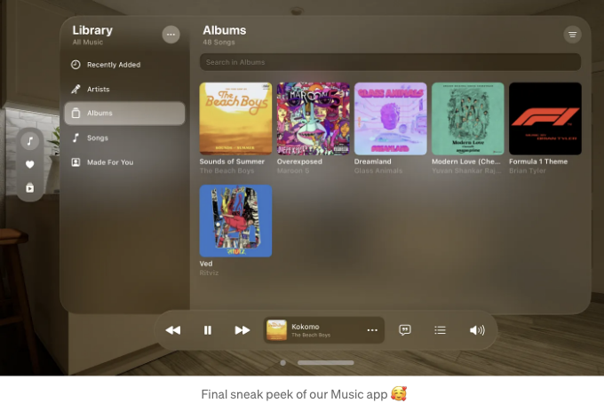
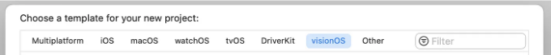
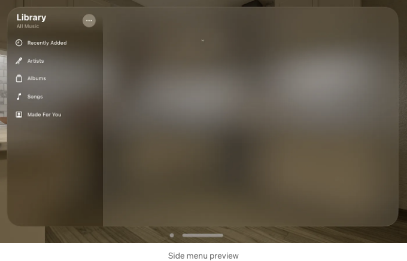
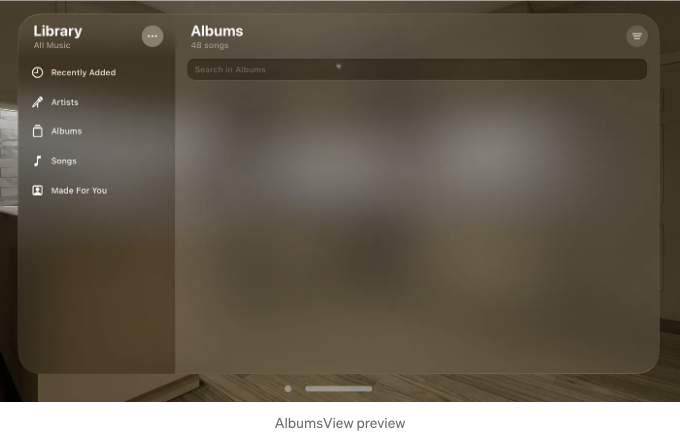
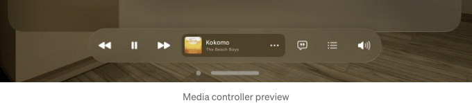
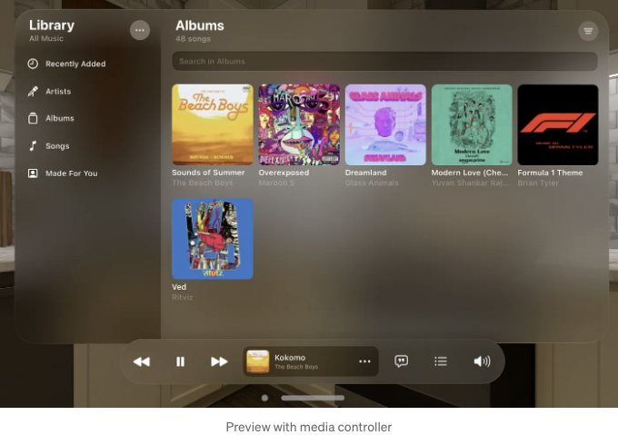
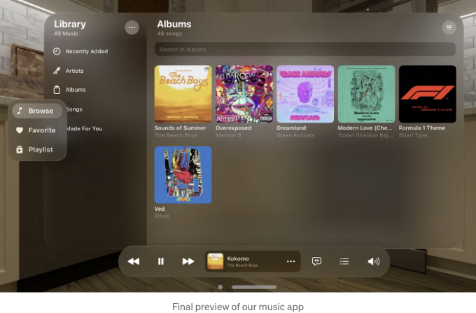

Apple은 방금 첫 번째 공간 컴퓨터인 VisionPro를 발표했어요! 분명히 벌써 소문을 들었을 거에요 — 어디에서든 대단히 화제가 되고 있었죠! 하지만 최고의 부분은 뭘까요? 개발자들 입장에서 이것은 정말 혁신적인 변화죠! 마치 새로운 가능성의 세계가 열리는 듯해요! 새로운 VisionPro를 위해 앱을 개발할 수 있는 새로운 VisionOS SDK를 포함한 Xcode 15와 함께 우리는 곧바로 앱을 만들 수 있어요. 함께 새로운 모험을 시작하며 VisionOS를 위한 음악 앱을 만들어봅시다.



## 시작해봐요

VisionOS를 위한 앱을 만들기 위해 필요한 첫 번째 것은 Xcode 15에요. 이 글을 쓰는 지금, Xcode 15의 베타 버전을 다운로드할 수 있어요. 미래에서 이 글을 보고 있다면, 아마도 이미 Xcode 15 이상의 새 버전이 있을 거예요. 아직 다운로드하지 않았다면, 다운로드하고 프로그램을 열어주세요. 새 프로젝트를 만들기를 클릭해주세요. 그리고 VisionOS 탭에 있는지 확인해주세요. 그 후에는 Xcode에서 다른 프로젝트를 만드는 것과 동일한 단계를 따르시면 됩니다.

<!-- ui-log 수평형 -->

<ins class="adsbygoogle"
      style="display:block"
      data-ad-client="ca-pub-4877378276818686"
      data-ad-slot="9743150776"
      data-ad-format="auto"
      data-full-width-responsive="true"></ins>
<component is="script">
(adsbygoogle = window.adsbygoogle || []).push({});
</component>



VisionPro용 첫 번째 앱을 만든 것을 축하해요! 이제 이 샘플 앱을 우리가 원하는 앱으로 바꿔볼까요? 다음 작업은 ContentView의 기존 코드를 아래의 새 코드로 변경하는 것입니다.

```js
import SwiftUI

struct ContentView: View {
    var body: some View {
        NavigationSplitView {
            // TODO: 사이드 메뉴
        } detail: {
              // TODO: 앨범 보기
        }
    }
}

#미리보기 {
    ContentView()
}
```

## 사이드 메뉴

<!-- ui-log 수평형 -->

<ins class="adsbygoogle"
      style="display:block"
      data-ad-client="ca-pub-4877378276818686"
      data-ad-slot="9743150776"
      data-ad-format="auto"
      data-full-width-responsive="true"></ins>
<component is="script">
(adsbygoogle = window.adsbygoogle || []).push({});
</component>

지금은 빈 화면만 보여요. 먼저 사이드 메뉴를 시작해볼까요? 우선, 메뉴 모델을 만들어야 해요.

```js
import Foundation

struct SideMenuItem: Identifiable, Hashable {
    var id = UUID()
    var name: String
    var icon: String
}

let sideMenuItems: [SideMenuItem] = [
    SideMenuItem(name: "최근 추가된 항목", icon: "clock"),
    SideMenuItem(name: "아티스트", icon: "music.mic"),
    SideMenuItem(name: "앨범", icon: "square.stack"),
    SideMenuItem(name: "노래", icon: "music.note"),
    SideMenuItem(name: "당신을 위한 리스트", icon: "person.crop.square"),
]
```

여기서 우리는 사이드 메뉴 모델을 만들었고 메뉴를 담는 목록을 생성했어요. 이제 사이드 메뉴를 만들어볼게요.

```js
import SwiftUI

struct SideMenuView: View {
    @State private var selectedMenu: SideMenuItem? = sideMenuItems.first!
    var body: some View {

        List(sideMenuItems) { item in
            NavigationLink(destination: EmptyView()) {
                Label(item.name, systemImage: item.icon)
                    .foregroundStyle(.primary)
            }
        }
        .navigationDestination(for: SideMenuItem.self) { item in
            // TODO: 앨범 보기
        }
        .toolbar {
            ToolbarItemGroup(placement: .topBarLeading) {
                VStack (alignment: .leading) {
                    Text("라이브러리")
                        .font(.largeTitle)
                    Text("모든 음악")
                        .foregroundStyle(.tertiary)
                }
                .padding(.all, 8)
            }
            ToolbarItem {
                Button {} label: {
                    Image(systemName: "ellipsis")
                }

            }
        }
    }
}
```

<!-- ui-log 수평형 -->

<ins class="adsbygoogle"
      style="display:block"
      data-ad-client="ca-pub-4877378276818686"
      data-ad-slot="9743150776"
      data-ad-format="auto"
      data-full-width-responsive="true"></ins>
<component is="script">
(adsbygoogle = window.adsbygoogle || []).push({});
</component>

마지막으로 해야 할 일은 `TODO: Side Menu`를 `SideMenuView()`로 교체하는 것이며, 그럼 우리의 사이드 메뉴 작업이 완료됩니다.



## 앨범 뷰

우리는 사이드 메뉴를 마무리했고, 멋지게 보이네요! 이제 다음 큰 파트로 넘어가서 `AlbumsView`를 만들어봅시다. 이 뷰는 상단에 검색 필드를 가지고 있으며, 앨범 목록이 표시됩니다. 음악이 재생 중이라면 하단에 음악 컨트롤러가 나타납니다. 이제 `AlbumsView`를 생성해봅시다.

<!-- ui-log 수평형 -->

<ins class="adsbygoogle"
      style="display:block"
      data-ad-client="ca-pub-4877378276818686"
      data-ad-slot="9743150776"
      data-ad-format="auto"
      data-full-width-responsive="true"></ins>
<component is="script">
(adsbygoogle = window.adsbygoogle || []).push({});
</component>

```swift
struct AlbumsView: View {
    @State private var searchText: String = ""
    var body: some View {
        ScrollView {

            TextField("앨범에서 검색", text: $searchText)
                .textFieldStyle(.roundedBorder)
                .padding(.bottom)

            // TODO: 앨범 그리드
        }
        .padding(.horizontal, 24)
        .toolbar {
            ToolbarItemGroup(placement: .topBarLeading) {
                VStack (alignment: .leading) {
                    Text("앨범")
                        .font(.largeTitle)
                    Text("48 곡")
                        .foregroundStyle(.tertiary)
                }
                .padding(.all, 8)
            }
            ToolbarItem {
                Button {} label: {
                    Image(systemName: "line.3.horizontal.decrease")
                }

            }
        }
      // TODO: 미디어 컨트롤러
    }
}
```



앨범 뷰에는 검색 필드와 툴바 아이템이 있습니다. 이제 앨범을 추가할 준비가 되었습니다. 하지만 그 전에 앨범 모델을 만들어야 합니다.

```swift
import Foundation

struct Album: Identifiable {
    var id = UUID()
    var image: String
    var title: String
    var subTitle: String
}

let albums: [Album] = [
    Album(image: "https://i.postimg.cc/ZvLtPzmB/Rectangle-4.png", title: "Sounds of Summer", subTitle: "The Beach Boys"),
    Album(image: "https://i.postimg.cc/nMKJfBmF/Rectangle-5.png", title: "Overexposed", subTitle: "Maroon 5"),
    Album(image: "https://i.postimg.cc/XpQ6pWxt/Rectangle-6.png", title: "Dreamland", subTitle: "Glass Animals"),
    Album(image: "https://i.postimg.cc/G4twDf5t/Rectangle-7.png", title: "Modern Love (Chennai)", subTitle: "Yuvan Shankar Raja, Ila.."),
    Album(image: "https://i.postimg.cc/9RZjMqNB/Rectangle-3.png", title: "Formula 1 Theme", subTitle: "Brian Tyler"),
    Album(image: "https://i.postimg.cc/RNMzSh1c/Rectangle-8.png", title: "Ved", subTitle: "Ritviz"),
]
```

<!-- ui-log 수평형 -->

<ins class="adsbygoogle"
      style="display:block"
      data-ad-client="ca-pub-4877378276818686"
      data-ad-slot="9743150776"
      data-ad-format="auto"
      data-full-width-responsive="true"></ins>
<component is="script">
(adsbygoogle = window.adsbygoogle || []).push({});
</component>

우리는 사이드 메뉴에 대해 한 것과 비슷한 작업을 했어요. 변수 이름 columns을 만들어요. 이 변수에 그리드에 원하는 레이아웃을 설명할 거에요.

```js
let columns: [GridItem] = [GridItem(.adaptive(minimum: 160, maximum: 200))]
```

TODO: 앨범 그리드를 아래 코드로 대체하세요.

```js
LazyVGrid(columns: columns, spacing: 24) {
    ForEach(albums) { album in
        Button(action: {}) {
            VStack(alignment: .leading) {
                AsyncImage(url: URL(string: album.image)) { image in
                    image.resizable()
                } placeholder: {
                    Rectangle().foregroundStyle(.tertiary)
                }.aspectRatio(1, contentMode: .fill)
                    .scaledToFill()
                    .cornerRadius(10)

                Text(album.title)
                    .lineLimit(1)
                Text(album.subTitle)
                    .foregroundStyle(.tertiary)
                    .lineLimit(1)
            }
            .hoverEffect()
        }
        .buttonStyle(.plain)
    }
}
```

<!-- ui-log 수평형 -->

<ins class="adsbygoogle"
      style="display:block"
      data-ad-client="ca-pub-4877378276818686"
      data-ad-slot="9743150776"
      data-ad-format="auto"
      data-full-width-responsive="true"></ins>
<component is="script">
(adsbygoogle = window.adsbygoogle || []).push({});
</component>

ContentView로 돌아가서 TODO: Albums View를 AlbumsView()로 교체해주세요.

## 미디어 컨트롤러



<!-- ui-log 수평형 -->

<ins class="adsbygoogle"
      style="display:block"
      data-ad-client="ca-pub-4877378276818686"
      data-ad-slot="9743150776"
      data-ad-format="auto"
      data-full-width-responsive="true"></ins>
<component is="script">
(adsbygoogle = window.adsbygoogle || []).push({});
</component>

VisionOS에서는 툴바를 사용하여 하단 중앙에 부유하게 나타낼 수 있습니다. 이를 위해 ToolbarItemGroup 배치를 bottomOrnament로 설정해야 합니다. 아래 코드로 TODO: 미디어 컨트롤러를 교체하세요.

```js
.toolbar {
    ToolbarItemGroup(placement: .bottomOrnament) {
        HStack {
            Button(action: {}, label: {
                Image(systemName: "backward.fill")
            })

            Button(action: {}, label: {
                Image(systemName: "pause.fill")
            })

            Button(action: {}, label: {
                Image(systemName: "forward.fill")
            })

            // TODO: 재생 중인 음악 뷰

            Button(action: {}, label: {
                Image(systemName: "quote.bubble")
            })

            Button(action: {}, label: {
                Image(systemName: "list.bullet")
            })

            Button(action: {}, label: {
                Image(systemName: "speaker.wave.3.fill")
            })
        }.padding(.vertical, 8)
    }
}
```

PlayingSongCardView를 생성해봅시다.

```js
struct PlayingSongCardView: View {
    var body: some View {
        HStack {
            AsyncImage(url: URL(string: "https://i.postimg.cc/ZvLtPzmB/Rectangle-4.png")) { image in
                image.resizable()
            } placeholder: {
                Rectangle().foregroundStyle(.tertiary)
            }.frame(width: 48, height: 49)
                .cornerRadius(6)

            VStack (alignment: .leading) {
                Text("Kokomo")
                Text("The Beach Boys")
                    .font(.caption2)
                    .foregroundStyle(.tertiary)
            }.frame(width: 160, alignment: .leading)

            Button(action: {}, label: {
                Image(systemName: "ellipsis")
            }).buttonBorderShape(.circle)

        }
        .padding(.all, 8)
        .background(.regularMaterial, in: .rect(cornerRadius: 14))
    }
}
```

<!-- ui-log 수평형 -->

<ins class="adsbygoogle"
      style="display:block"
      data-ad-client="ca-pub-4877378276818686"
      data-ad-slot="9743150776"
      data-ad-format="auto"
      data-full-width-responsive="true"></ins>
<component is="script">
(adsbygoogle = window.adsbygoogle || []).push({});
</component>

지금 TODO: Playing Song View를 PlayingSongCardView()로 교체해주세요.



## 탭 바

마지막으로 탭 바를 추가하겠습니다. 이는 VisionOS에서 창의 leading 쪽에 고정된 위치에 떠 있는 수직 탭 바입니다. ContentView에서 NavigationSplitView를 TabView로 감싸세요. 그런 다음 세부 사항에 tabItem을 추가하세요.

<!-- ui-log 수평형 -->

<ins class="adsbygoogle"
      style="display:block"
      data-ad-client="ca-pub-4877378276818686"
      data-ad-slot="9743150776"
      data-ad-format="auto"
      data-full-width-responsive="true"></ins>
<component is="script">
(adsbygoogle = window.adsbygoogle || []).push({});
</component>

```js
struct ContentView: View {
    var body: some View {
        TabView {
            NavigationSplitView {
                SideMenuView()
            } detail: {
                AlbumsView()
            }.tabItem {
                Label("탐색", systemImage: "music.note")
            }
            .tag(0)
            Text("즐겨찾기")
                .tabItem {
                    Label("즐겨찾기", systemImage: "heart.fill")
                }
                .tag(1)
            Text("재생 목록").tabItem {
                Label("재생 목록", systemImage: "play.square.stack")
            }
            .tag(2)
        }
    }
}
```

```js
#Preview {
    NavigationStack {
        ContentView()
    }
}
```



우리 함께 해냈어요 🥳! 즐거운 새로운 것을 배울 수 있기를 바라며.

<!-- ui-log 수평형 -->

<ins class="adsbygoogle"
      style="display:block"
      data-ad-client="ca-pub-4877378276818686"
      data-ad-slot="9743150776"
      data-ad-format="auto"
      data-full-width-responsive="true"></ins>
<component is="script">
(adsbygoogle = window.adsbygoogle || []).push({});
</component>

그게 잘못된 게 있다면? 댓글로 알려주세요. 나는 개선하고 싶어요.

이 게시물이 도움이 되었다면 👏 박수를 쳐주세요.

<!-- ui-log 수평형 -->

<ins class="adsbygoogle"
      style="display:block"
      data-ad-client="ca-pub-4877378276818686"
      data-ad-slot="9743150776"
      data-ad-format="auto"
      data-full-width-responsive="true"></ins>
<component is="script">
(adsbygoogle = window.adsbygoogle || []).push({});
</component>
