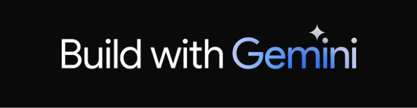
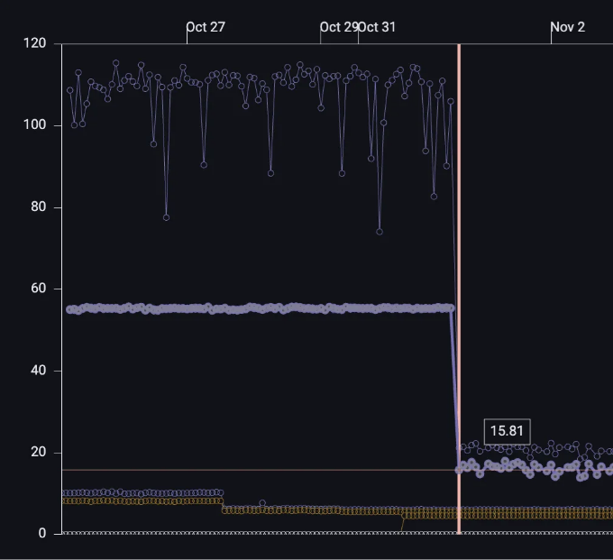
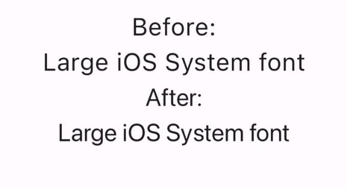
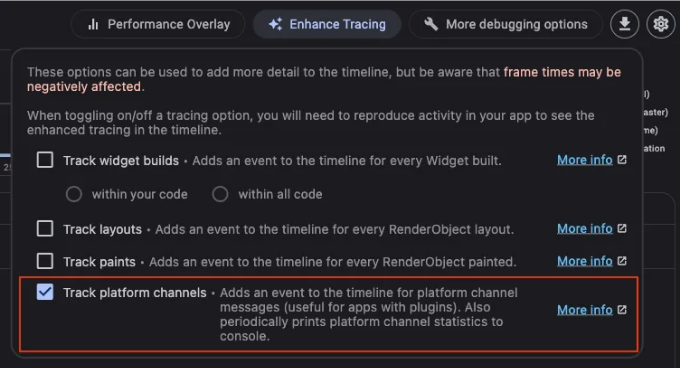

오늘은 새로운 Flutter 릴리스, Flutter 3.19를 소개합니다. 이번 릴리스에서는 Gemini용 새로운 Dart SDK, 위젯 애니메이션에 세밀한 제어를 추가할 수 있는 위젯, Impeller 업데이트로 렌더링 성능 향상, 딥 링크 구현을 돕는 도구, Windows Arm64 지원 등이 제공됩니다!

Flutter 커뮤니티는 계속해서 놀라운 작업을 하고 있습니다. 168명의 커뮤니티 멤버가 1429개의 풀 리퀘스트를 머지했으며, 그 중 43명은 처음으로 Flutter 풀 리퀘스트를 커밋했습니다!

이번 최신 릴리스에 기여된 모든 새로운 추가 및 개선 사항에 대해 알아보려면 계속 읽어보세요!

# AI 통합

<!-- ui-log 수평형 -->

<ins class="adsbygoogle"
      style="display:block"
      data-ad-client="ca-pub-4877378276818686"
      data-ad-slot="9743150776"
      data-ad-format="auto"
      data-full-width-responsive="true"></ins>
<component is="script">
(adsbygoogle = window.adsbygoogle || []).push({});
</component>

## Gemini Google AI Dart SDK beta release

Google AI Dart SDK가 베타 버전으로 출시되었습니다. 이를 통해 Google의 최신 AI 모델 패밀리인 Gemini의 기능을 활용하여 Dart 또는 Flutter 앱에 생성적 AI 기능을 구축할 수 있습니다. 이제 pub.dev에 google_generative_ai 패키지가 있습니다. Google AI Dart SDK를 활용하여 어떻게 빌드하는지에 대해 더 알아보려면 이 블로그 포스트를 확인하거나 Dart 퀵스타트로 바로 이동하세요.



# 프레임워크

<!-- ui-log 수평형 -->

<ins class="adsbygoogle"
      style="display:block"
      data-ad-client="ca-pub-4877378276818686"
      data-ad-slot="9743150776"
      data-ad-format="auto"
      data-full-width-responsive="true"></ins>
<component is="script">
(adsbygoogle = window.adsbygoogle || []).push({});
</component>

## 스크롤 개선 사항

이제 두 손가락으로 드래그하는 경우 플러터는 두 배로 빠르게 스크롤되었습니다. 이제 MultiTouchDragStrategy.latestPointer를 사용하여 표준 ScrollBehavior를 구성하여 손가락 개수에 중립적인 스크롤 동작을 얻을 수 있습니다. 이 변경 사항에 대한 자세한 내용은 이관 안내서를 참조하십시오.

또한 SingleChildScrollView와 ReorderableList의 버그 수정을 완료하여 다수의 신고된 충돌 및 예기치 않은 동작을 해결했습니다.

2차원 스크롤링에서는 이제 양방향으로 스크롤이 진행 중일 때 드래그하거나 탭하면 스크롤 활동이 예상대로 중지됩니다.

<!-- ui-log 수평형 -->

<ins class="adsbygoogle"
      style="display:block"
      data-ad-client="ca-pub-4877378276818686"
      data-ad-slot="9743150776"
      data-ad-format="auto"
      data-full-width-responsive="true"></ins>
<component is="script">
(adsbygoogle = window.adsbygoogle || []).push({});
</component>

two_dimensional_scrollables 패키지의 TableView 위젯도 지난 릴리스 이후 업데이트되어 더 많이 개선되었습니다. 병합된 셀을 지원하고 3.16 안정 버전 이후 2D foundation의 새로운 기능들을 더 많이 도입했습니다.

## AnimationStyle

Flutter 커뮤니티 멤버인 @TahaTesser의 기여 덕분에 Flutter는 MaterialApp, ExpansionTile, PopupMenuButton 등의 위젯에서 기본 애니메이션 동작을 재정의할 수 있는 AnimationStyle 위젯이 생겼습니다. 개발자는 애니메이션 곡선 및 지속 시간을 재정의할 수 있는 기능을 제공받게 되었습니다.

## SegmentedButton.styleFrom

<!-- ui-log 수평형 -->

<ins class="adsbygoogle"
      style="display:block"
      data-ad-client="ca-pub-4877378276818686"
      data-ad-slot="9743150776"
      data-ad-format="auto"
      data-full-width-responsive="true"></ins>
<component is="script">
(adsbygoogle = window.adsbygoogle || []).push({});
</component>

플러터 커뮤니티 멤버인 @AcarFurkan이 다른 버튼 유형에서 제공되는 것과 같이 styleFrom 정적 유틸리티 메서드를 추가했습니다. 이 메서드를 사용하면 빠르게 SegmentedButton의 ButtonStyle을 생성하여 다른 분할 버튼에서 공유하거나 앱의 SegmentedButtonTheme을 구성하는 데 사용할 수 있습니다.

## 적응형 스위치

이 적응형 컴포넌트는 macOS 및 iOS에서 네이티브로 보이고 느껴지며 다른 곳에서는 Material Design 느낌을 가지고 있습니다. 이 컴포넌트는 Cupertino 라이브러리에 의존하지 않으므로 모든 플랫폼에서 API가 정확히 동일합니다.

Adaptive switch 풀 리퀘스트 및 Switch.adaptive 생성자 API 페이지에서 라이브 예제를 확인하세요.

<!-- ui-log 수평형 -->

<ins class="adsbygoogle"
      style="display:block"
      data-ad-client="ca-pub-4877378276818686"
      data-ad-slot="9743150776"
      data-ad-format="auto"
      data-full-width-responsive="true"></ins>
<component is="script">
(adsbygoogle = window.adsbygoogle || []).push({});
</component>

## 의미속성 접근성 식별자

SemanticsProperties의 새로운 접근성 식별자는 네이티브 접근성 계층에서 의미 노드를 식별하는 데 사용됩니다. Android에서는 리소스 ID로 나타납니다. iOS에서는 UIAccessibilityElement.accessibilityIdentifier를 설정합니다. 엔진과 프레임워크에 걸쳐 이 변경 사항을 제안해 준 커뮤니티 회원 @bartekpacia님께 감사드립니다.

## 텍스트 위젯 상태에 대한 액세스 증가

TextField 및 TextFormField에 MaterialStatesController 지원이 추가되어 MaterialState 변경 사항을 감지할 수 있습니다.

<!-- ui-log 수평형 -->

<ins class="adsbygoogle"
      style="display:block"
      data-ad-client="ca-pub-4877378276818686"
      data-ad-slot="9743150776"
      data-ad-format="auto"
      data-full-width-responsive="true"></ins>
<component is="script">
(adsbygoogle = window.adsbygoogle || []).push({});
</component>

## 되돌리기 기록 스택

일본어 키보드에서 되돌리기/다시하기 기록이 사라지는 문제를 해결했습니다. 이제 UndoHistory 스택에 푸시되기 전에 항목을 수정할 수 있습니다.

# 엔진

## 임펠러 진행률

<!-- ui-log 수평형 -->

<ins class="adsbygoogle"
      style="display:block"
      data-ad-client="ca-pub-4877378276818686"
      data-ad-slot="9743150776"
      data-ad-format="auto"
      data-full-width-responsive="true"></ins>
<component is="script">
(adsbygoogle = window.adsbygoogle || []).push({});
</component>

안드로이드 OpenGL 미리보기

3.16 안정 버전에서는 Vulkan을 사용할 수 있는 안드로이드 장치에서 Impeller를 시도해 볼 것을 사용자들에게 초대했습니다. 현장에서 77%의 안드로이드 장치를 커버합니다. 지난 몇 달 동안 Impeller의 OpenGL 백엔드를 Vulkan 백엔드와 기능적으로 동등하게 업그레이드했습니다. 예를 들어 MSAA(다중 샘플링 안티얼라이싱) 지원을 추가했습니다. 이로 인해 거의 모든 안드로이드 장치에서 Flutter 앱이 올바르게 렌더링될 것으로 예상됩니다. 사용 중인 기능 중 몇 가지 예정된 기능을 제외하고는, 예를 들어 사용자 정의 셰이더 및 외부 텍스처에 대한 완전한 지원과 같은 것들이 있습니다.

Flutter 개발자들에게 최신 안정 버전으로 업그레이드하고, Impeller를 활성화할 때 관찰된 어떤 부족한 점이라도 문제를 제기해 주시기를 요청합니다. 이 단계에서의 피드백은 Impeller가 안드로이드에서 성공적으로 작동하도록 하고, 이번 해 후반에 발표될 렌더러로 자신있게 만들기 위해 귀중합니다. 안드로이드 하드웨어 생태계는 iOS 생태계보다 훨씬 다양합니다. 그래서 Impeller에 대한 가장 유용한 피드백은 문제가 발생한 구체적인 장치와 안드로이드 버전에 대한 자세한 정보를 포함해야 합니다.

게다가, 메모로, Impeller의 Vulkan 백엔드는 Skia와 함께 사용하는 디버깅 능력을 넘어서는 추가 디버깅 기능을 디버그 빌드에서 활성화합니다. 이러한 기능은 추가 실행 시간 오버헤드가 발생합니다. 그러므로 Impeller의 성능에 대한 피드백을 프로필이나 릴리스 빌드에서 제공하는 것이 중요합니다. 버그 보고서는 DevTools에서의 타임라인과 같은 기기에서 Skia 백엔드와의 비교를 포함해야 합니다. 마지막으로, 항상 그렇지만, 우리는 문제를 명확히 보여주는 간단한 재현 가능한 테스트 케이스를 사용한 피드백에 대해 매우 감사합니다.

<!-- ui-log 수평형 -->

<ins class="adsbygoogle"
      style="display:block"
      data-ad-client="ca-pub-4877378276818686"
      data-ad-slot="9743150776"
      data-ad-format="auto"
      data-full-width-responsive="true"></ins>
<component is="script">
(adsbygoogle = window.adsbygoogle || []).push({});
</component>

로드맵

렌더링의 정확성을 완성한 후, Impeller의 Android 미리보기 단계에서 우리의 주요 관심사는 성능입니다. 우리는 점진적인 성과를 이어가고 있지만, 몇 가지 큰 개선 사항도 진행 중에 있습니다. Vulkan 서브패스를 활용하여 고급 블렌드 모드의 성능을 크게 향상시킬 것으로 기대하고 있습니다. 또한 CPU에서 항상 모든 경로를 타일 처리하지 않고 Stencil-이후-커버 접근 방식으로 렌더링 전략을 변경함으로써 Impeller의 CPU 사용량을 크게 줄일 것으로 예상하고 있습니다. 마지막으로, 가우시안 블러링의 새로운 구현이 Skia 구현의 처리량과 iOS에서 흐름을 매치하고 블러링의 관용적 사용을 개선할 것으로 예상하고 있습니다.

## API 개선

글리프 정보

<!-- ui-log 수평형 -->

<ins class="adsbygoogle"
      style="display:block"
      data-ad-client="ca-pub-4877378276818686"
      data-ad-slot="9743150776"
      data-ad-format="auto"
      data-full-width-responsive="true"></ins>
<component is="script">
(adsbygoogle = window.adsbygoogle || []).push({});
</component>

이 업데이트에는 dart:ui의 Paragraph 객체에 두 가지 새로운 메소드가 포함되어 있습니다: getClosestGlyphInfoForOffset 및 getGlyphInfoAt이 있습니다. 각 메소드는 새로운 유형 GlyphInfo의 객체를 반환합니다. 새로운 GlyphInfo 유형에 대한 문서를 확인해보세요.

GPU 추적

Metal (iOS, macOS, Simulator)의 Impeller 및 Vulkan을 활성화한 Android 기기에서 이제 Flutter 엔진은 디버그 및 프로파일 빌드에 각 프레임의 GPU 시간을 타임라인에 보고합니다. GPU 프레임 타이밍은 DevTools의 "GPUTracer" 제목 아래에서 검사할 수 있습니다.


<!-- ui-log 수평형 -->

<ins class="adsbygoogle"
      style="display:block"
      data-ad-client="ca-pub-4877378276818686"
      data-ad-slot="9743150776"
      data-ad-format="auto"
      data-full-width-responsive="true"></ins>
<component is="script">
(adsbygoogle = window.adsbygoogle || []).push({});
</component>

혹시 Vulkan을 지원하지 않는 안드로이드 기기들은 GPU 타이밍 조회를 잘못 보고할 수 있으므로, Impeller의 GPU 추적은 이러한 기기들에서만 AndroidManifest.xml 파일에 플래그를 설정하여 활성화할 수 있습니다.

```js
<meta-data android:name="io.flutter.embedding.android.EnableOpenGLGPUTracing" android:value="true" />
```

## 성능 최적화

특수화 상수

<!-- ui-log 수평형 -->

<ins class="adsbygoogle"
      style="display:block"
      data-ad-client="ca-pub-4877378276818686"
      data-ad-slot="9743150776"
      data-ad-format="auto"
      data-full-width-responsive="true"></ins>
<component is="script">
(adsbygoogle = window.adsbygoogle || []).push({});
</component>

팀은 임펠러에서 전문화 상수 지원을 추가했어요. 임펠러의 셰이더에서 이 기능을 활용하면 플러터 엔진의 압축 해제되지 않은 이진 크기가 거의 350KB 정도 줄어들었답니다.

배경 필터 속도 향상

그렇지만 더 많은 작업이 남아 있어요. 하지만 이 릴리스에는 임펠러 상의 배경 필터와 흐림에 대한 몇 가지 좋은 성능 향상이 포함되어 있답니다. 특히, 오픈 소스 기여자인 @knopp은 임펠러가 화면 텍스처에서 읽기 기능을 실수로 요청하고 있음을 발견했어요. 본 기능을 제거하면 복잡성에 따라 벤치마크에서 여러 배경 필터를 포함하는 장면의 성능이 20~70% 향상됩니다.

게다가, 임펠러는 이제 모든 배경 필터에 대해 무조건 스텐실 버퍼를 저장하지 않아요. 대신, 모든 클립 영향을 받는 작업이 기록되고, 배경 필터용 저장 레이어를 복원할 때 새 스텐실 버퍼로 다시 재생됩니다.

<!-- ui-log 수평형 -->

<ins class="adsbygoogle"
      style="display:block"
      data-ad-client="ca-pub-4877378276818686"
      data-ad-slot="9743150776"
      data-ad-format="auto"
      data-full-width-responsive="true"></ins>
<component is="script">
(adsbygoogle = window.adsbygoogle || []).push({});
</component>



이 변경으로 인해, Impeller에서 Vulkan 백엔드를 실행하는 Pixel 7 Pro에서 애니메이션 고급 블랜드 모드의 벤치마크가 평균 GPU 프레임 시간을 55ms에서 16ms로 개선하였으며, 약 110ms인 90% 타일르래스드 CPU 시간이 22ms로 개선되었습니다.

# 안드로이드

## 웹 검증 도구 (Deeplinking)

<!-- ui-log 수평형 -->

<ins class="adsbygoogle"
      style="display:block"
      data-ad-client="ca-pub-4877378276818686"
      data-ad-slot="9743150776"
      data-ad-format="auto"
      data-full-width-responsive="true"></ins>
<component is="script">
(adsbygoogle = window.adsbygoogle || []).push({});
</component>

개발자들로부터 깊은 링킹(웹 URL에서 모바일 앱의 특정 페이지로 이동하는 것)이 항상 구현하기 어렵고 오류를 발생시키기 쉽다는 피드백을 받았습니다. 따라서 먼저 잘못 구성된 링크를 개발자들이 이해하고 구현 지침을 제공하는 검증 도구를 만들었습니다. 저희는 기쁘게도 Flutter 딥링크 검증기의 초기 버전이 이제 사용 가능하다는 소식을 전해드립니다!

이 초기 버전에서는 Flutter 딥링크 검증기가 안드로이드에서 웹 검사를 지원합니다. 이는 assetlinks.json 파일의 설정을 유효성 검사하는 것을 의미합니다. 개발 도구를 열고 Deep Links 탭으로 이동한 다음 딥링크가 포함된 Flutter 프로젝트를 가져올 수 있습니다. 딥링킹 검증기는 웹 파일이 올바르게 구성되어 있는지 알려줍니다. 자세한 내용은 딥링크 검증 도구의 테스트 지침을 참조할 수 있습니다.

이 도구가 깊은 링킹 구현 여정을 간소화할 수 있는 첫 번째 단계가 되기를 바랍니다. 앞으로 iOS에서 웹 검사 및 iOS 및 Android 양쪽에서 앱 검사를 지원하는 미래 지원을 계속 제공할 예정입니다!

<!-- ui-log 수평형 -->

<ins class="adsbygoogle"
      style="display:block"
      data-ad-client="ca-pub-4877378276818686"
      data-ad-slot="9743150776"
      data-ad-format="auto"
      data-full-width-responsive="true"></ins>
<component is="script">
(adsbygoogle = window.adsbygoogle || []).push({});
</component>

## Share.invoke 지원

안드로이드의 텍스트 필드 및 뷰에 대한 기본 공유 버튼은 이전에 누락되었었지만, 우리는 각 플랫폼에서 기본 context 메뉴 버튼이 사용 가능하도록 하는 지속적인 노력의 일환으로 이를 이번 릴리즈에 추가했습니다. 계속 진행 중인 작업은 PR #107578에서 확인하실 수 있습니다.

## Native assets 기능

Flutter와 다른 언어의 기능과의 상호 운용성에 관심이 있다면, 우리는 지속적인 Native assets 지원을 위한 작업의 일환으로 Android에서 Native assets를 통해 FFI 호출을 수행할 수 있도록 했습니다.

<!-- ui-log 수평형 -->

<ins class="adsbygoogle"
      style="display:block"
      data-ad-client="ca-pub-4877378276818686"
      data-ad-slot="9743150776"
      data-ad-format="auto"
      data-full-width-responsive="true"></ins>
<component is="script">
(adsbygoogle = window.adsbygoogle || []).push({});
</component>

## 텍스처 레이어 하이브리드 구성 (TLHC) 모드

Flutter 3.19에는 Google 지도 및 텍스트 입력 확대기가 TLHC 모드에서 작동하도록 하는 작업이 포함되어 있습니다. 즉, 앱의 성능이 향상되었습니다. Google 지도를 사용 중이라면 변경 사항을 테스트하고 피드백을 주시기를 권장합니다!

이 작업은 Framework 또는 Engine 하위의 커밋을 포함하지 않지만, PR 5408에서 해당 내용을 확인할 수 있습니다. 또한 THLC를 테스트하는 단계도 함께 제공됩니다.

## 사용자 정의 시스템 전체 텍스트 선택 툴바 버튼

<!-- ui-log 수평형 -->

<ins class="adsbygoogle"
      style="display:block"
      data-ad-client="ca-pub-4877378276818686"
      data-ad-slot="9743150776"
      data-ad-format="auto"
      data-full-width-responsive="true"></ins>
<component is="script">
(adsbygoogle = window.adsbygoogle || []).push({});
</component>

안녕하세요! 안드로이드 앱에서는 모든 텍스트 선택 메뉴(텍스트를 길게 누르면 나타나는 메뉴)에 나타나는 사용자 지정 텍스트 선택 메뉴 항목을 추가할 수 있어요. Flutter의 TextField 선택 메뉴는 이제 해당 항목을 포함하고 있어요.

# iOS

## Flutter iOS 네이티브 폰트

Flutter 텍스트는 이제 iOS에서 더 조밀하고 더 네이티브한 모습을 가지고 있어요. Apple 디자인 가이드라인에 따르면 iOS에서 작은 글꼴은 모바일에서 더 쉽게 읽을 수 있도록 좀 더 간격을 둬야 하고, 큰 글꼴은 공간이 적게 차지하도록 더 조밀해야 해요. 이전에는 우리가 모든 경우에 작은 더 간격이 더 많이 된 글꼴을 잘못 사용하고 있었어요. 이제 기본적으로 Flutter는 큰 텍스트에 대해 조밀한 글꼴을 사용할 거예요.

<!-- ui-log 수평형 -->

<ins class="adsbygoogle"
      style="display:block"
      data-ad-client="ca-pub-4877378276818686"
      data-ad-slot="9743150776"
      data-ad-format="auto"
      data-full-width-responsive="true"></ins>
<component is="script">
(adsbygoogle = window.adsbygoogle || []).push({});
</component>



# DevTools

## DevTools 업데이트

이번 릴리스에서 DevTools의 주요 업데이트 몇 가지는 다음과 같습니다:

<!-- ui-log 수평형 -->

<ins class="adsbygoogle"
      style="display:block"
      data-ad-client="ca-pub-4877378276818686"
      data-ad-slot="9743150776"
      data-ad-format="auto"
      data-full-width-responsive="true"></ins>
<component is="script">
(adsbygoogle = window.adsbygoogle || []).push({});
</component>

- 안드로이드에서 딥링크 설정을 확인하는 새로운 기능과 화면이 DevTools에 추가되었습니다.
- 플러그인을 사용하는 앱에서 유용한 플랫폼 채널 활동 추적을 위한 'Enhance Tracing' 메뉴에 옵션이 추가되었습니다.



- 앱과 연결된 상태가 없을 때 퍼포먼스 및 CPU 프로파일러 화면이 이제 사용 가능합니다. 이전에 DevTools에서 저장된 성능 데이터나 CPU 프로필은 이러한 화면에서 불러와서 볼 수 있습니다.
- VS Code의 Flutter 사이드바에서 현재 프로젝트에 활성화되지 않은 새 플랫폼을 사용할 수 있도록 업데이트되었으며, 사이드바의 DevTools 메뉴에서 외부 브라우저 창에서 DevTools를 열 수 있는 옵션이 추가되었습니다.

더 많은 정보는 DevTools 릴리스 노트, 2.29.0, 2.30.0 및 2.31.0을 확인해보세요.

<!-- ui-log 수평형 -->

<ins class="adsbygoogle"
      style="display:block"
      data-ad-client="ca-pub-4877378276818686"
      data-ad-slot="9743150776"
      data-ad-format="auto"
      data-full-width-responsive="true"></ins>
<component is="script">
(adsbygoogle = window.adsbygoogle || []).push({});
</component>

# 데스크톱

## Windows Arm64 지원

윈도우용 플러터가 이제 Arm64 아키텍처에 대한 초기 지원을 환영합니다. 이는 커뮤니티 멤버인 @pbo-linaro의 훌륭한 노력 덕분에 가능해졌습니다. 이 초기 지원은 윈도우 Arm64 기기에서 네이티브로 실행되는 더 효율적이고 성능이 우수한 플러터 애플리케이션을 제작할 수 있는 기반을 마련해줍니다. 아직 개발 중이지만 GitHub issue #62597에서 진행 상황을 추적할 수 있으며, 이번 변화는 플러터 개발자들이 애플리케이션을 더 넓은 범위의 Windows 기기에 최적화하려는 노력에 희망을 불어넣는 중요한 발전을 의미합니다.

# 생태계

<!-- ui-log 수평형 -->

<ins class="adsbygoogle"
      style="display:block"
      data-ad-client="ca-pub-4877378276818686"
      data-ad-slot="9743150776"
      data-ad-format="auto"
      data-full-width-responsive="true"></ins>
<component is="script">
(adsbygoogle = window.adsbygoogle || []).push({});
</component>

## 필요한 이유의 개인정보 보호 선언

플러터(Flutter)는 애플의 다가오는 요구 사항을 충족하기 위해 iOS에 개인정보 보호 선언을 포함하게 되었습니다.

## 플러터(Flutter)와 다트(Dart) 패키지 생태계의 진행 상황

놓치지 마세요. 1월 블로그 게시물에서 플러터(Flutter)와 다트(Dart) 패키지 생태계의 진행 상황을 확인해보세요.

<!-- ui-log 수평형 -->

<ins class="adsbygoogle"
      style="display:block"
      data-ad-client="ca-pub-4877378276818686"
      data-ad-slot="9743150776"
      data-ad-format="auto"
      data-full-width-responsive="true"></ins>
<component is="script">
(adsbygoogle = window.adsbygoogle || []).push({});
</component>

# 폐기 예정 및 변경 사항

## Windows 7 및 8 지원 중단

Flutter가 진화하는 과정에서 Dart 3.3 및 Flutter 3.19 릴리스를 통해 Windows 7 및 8을 지원 중단하여 최신 기술에 집중하고자 합니다. 이 전환은 Microsoft의 전략과 일치하며, 최신 운영 체제에서 Flutter를 향상시킬 수 있게 합니다. 개발자들로부터 필요한 조정에 대한 감사의 마음을 표하며, 이 전환 기간 동안 지원해 드리겠습니다. 이동은 Windows의 지원 버전에서 더 안전하고 효율적이며 기능이 풍부한 개발 환경으로 나아가는 길을 열어 줍니다. Flutter 에코 시스템에서 계속 혁신하는 과정에서 지속적인 이해와 적응에 감사드립니다.

## 임펠러 디더링 플래그

<!-- ui-log 수평형 -->

<ins class="adsbygoogle"
      style="display:block"
      data-ad-client="ca-pub-4877378276818686"
      data-ad-slot="9743150776"
      data-ad-format="auto"
      data-full-width-responsive="true"></ins>
<component is="script">
(adsbygoogle = window.adsbygoogle || []).push({});
</component>

3.16 안정 버전 릴리스 노트에 언급된 대로, Paint.enableDithering 전역 플래그가 제거되었습니다. 자세한 내용은 웹사이트의 주요 변경 사항 안내를 참조해주세요.

## iOS 11 폐기

특정 네트워킹 API를 호출할 때 런타임 충돌이 발생하여 Flutter는 더 이상 iOS 11을 지원하지 않습니다. 따라서 Flutter 3.16.6 이상 버전으로 빌드된 앱은 해당 기기에서 실행되지 않습니다.

## 자동 렌더 모드 폐기

<!-- ui-log 수평형 -->

<ins class="adsbygoogle"
      style="display:block"
      data-ad-client="ca-pub-4877378276818686"
      data-ad-slot="9743150776"
      data-ad-format="auto"
      data-full-width-responsive="true"></ins>
<component is="script">
(adsbygoogle = window.adsbygoogle || []).push({});
</component>

이 릴리스의 주요 변경 사항은 v3.16 이후에 만료된 API가 포함되어 있다는 것입니다. 영향을 받는 모든 API 및 추가적인 맥락 및 이주 안내를 보려면 이 릴리스에 대한 폐기 안내서를 참조하세요. 이러한 폐기 중 많은 것들이 Flutter fix에 의해 지원되며, IDE에서 빠른 수정도 가능합니다. 대량 수정은 dart fix 명령줄 도구로 평가하고 적용할 수 있습니다.

언제나 커뮤니티에 감사드리며, 이러한 중요 변경 사항을 식별하는 데 도움이 되는 테스트를 기여해주신 모든 분들에게 감사드립니다. 더 자세히 알아보려면 Flutter의 중단 변경 정책을 확인해보세요.

이번 릴리스는 flutter와 flutter_test가 이미 지원되는 것에 추가하여 flutter_driver 패키지를 폐기 정책에 도입한 첫 번째 릴리스입니다.

# 결론

<!-- ui-log 수평형 -->

<ins class="adsbygoogle"
      style="display:block"
      data-ad-client="ca-pub-4877378276818686"
      data-ad-slot="9743150776"
      data-ad-format="auto"
      data-full-width-responsive="true"></ins>
<component is="script">
(adsbygoogle = window.adsbygoogle || []).push({});
</component>

이 발표의 시작 부분에서 우리가 뛰어난 기여자들의 수를 강조했던 것은 목적이 분명했습니다. Flutter가 강력하고 효율적인 툴킷으로 진화한 것은 우리 놀라운 커뮤니티의 헌신과 노고의 직접적인 증거입니다. 모두 여러분께 진심으로 감사드립니다.

이번 출시로 이루어진 성취의 구체적인 내용을 살펴보기 위해 Flutter 3.19에 추가된 사항의 포괄적인 목록을 확인하시기 바랍니다. 또한 Dart 3.3와 함께 제공됩니다.

Flutter 3.19은 안정 채널에서 이제 사용 가능합니다. 이 최신 버전의 Flutter와 함께 새로운 여정을 떠나려면 간단히 flutter upgrade를 실행하면 됩니다.
