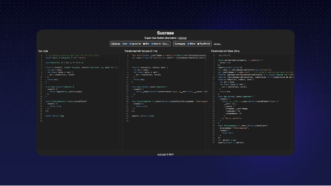

안녕하세요 👋

오늘은 상위 1% 개발자들이 사용하는 8개의 React 저장소에 대해 살펴보겠습니다 (그리고 아마 들어본 적이 없는 것들입니다).

준비됐나요?

<!-- ui-log 수평형 -->

<ins class="adsbygoogle"
      style="display:block"
      data-ad-client="ca-pub-4877378276818686"
      data-ad-slot="9743150776"
      data-ad-format="auto"
      data-full-width-responsive="true"></ins>
<component is="script">
(adsbygoogle = window.adsbygoogle || []).push({});
</component>


우리가 최고 개발자들이 무엇을 사용하는지 찾은 이야기는 많은 데이터 탐구와 어렵고 복잡한 모델링에 근간을 두고 있어요.

지금은 Quine에서 개발자들을 DevRank를 기반으로 순위를 매기고 있어요.

간단하게 말해, DevRank는 구글의 PageRank 알고리즘을 사용하여 개발자들이 오픈 소스 레포에 기여한 정도에 따라 개발자의 중요성을 측정해요.

<!-- ui-log 수평형 -->

<ins class="adsbygoogle"
      style="display:block"
      data-ad-client="ca-pub-4877378276818686"
      data-ad-slot="9743150776"
      data-ad-format="auto"
      data-full-width-responsive="true"></ins>
<component is="script">
(adsbygoogle = window.adsbygoogle || []).push({});
</component>

이 목록을 만들기 위해 상위 1%가 스타를 한 저장소를 살펴보았어요. 🌟

그런 다음 상위 1% 개발자가 저장소에 스타를 남길 확률과 하위 50%가 그렇게 하지 않을 확률을 계산했어요.


마지막으로, 손수 고르고 나서 아래 8개 저장소를 찾았어요. 👇

<!-- ui-log 수평형 -->

<ins class="adsbygoogle"
      style="display:block"
      data-ad-client="ca-pub-4877378276818686"
      data-ad-slot="9743150776"
      data-ad-format="auto"
      data-full-width-responsive="true"></ins>
<component is="script">
(adsbygoogle = window.adsbygoogle || []).push({});
</component>

이 저장소들은 멋진 웹 앱을 만들고 싶을 때 특히 유용합니다.

작은 앱을 만들기에 관심이 있고 응용 AI 측면을 즐기는 경우, ChatGPT, Claude, Gemini 등을 사용하여 멋진 GenerativeAI 앱을 만드는 개발자들을 보상하는 오픈 소스 챌린지인 Creator Quests를 확인해보는 것을 추천합니다. 🙃 💰

최신 Creator Quest는 Generative AI를 사용하여 개발자 도구를 만드는 것을 도전합니다. 참여하려면 간단히 Quine에 가입하고 Quests로 이동하면 됩니다.

현재 상금 풀은 $2028이며 참가자가 늘어날수록 더 커질 것입니다! 아래 이미지를 클릭해서 시도해보세요! ⬇️

<!-- ui-log 수평형 -->

<ins class="adsbygoogle"
      style="display:block"
      data-ad-client="ca-pub-4877378276818686"
      data-ad-slot="9743150776"
      data-ad-format="auto"
      data-full-width-responsive="true"></ins>
<component is="script">
(adsbygoogle = window.adsbygoogle || []).push({});
</component>


# 🪮 jsxstyle/jsxstyle

No more JS to CSS jumping


<!-- ui-log 수평형 -->

<ins class="adsbygoogle"
      style="display:block"
      data-ad-client="ca-pub-4877378276818686"
      data-ad-slot="9743150776"
      data-ad-format="auto"
      data-full-width-responsive="true"></ins>
<component is="script">
(adsbygoogle = window.adsbygoogle || []).push({});
</component>

왜 신경 써야 하냐구요? 웹 개발에서 React나 Preact와 함께 컴포넌트(버튼, 메뉴 등)를 스타일링해야 합니다. 전통적으로는 이를 별도의 CSS 파일이나 복잡한 스타일링 시스템을 사용하여 처리했는데, 이는 관리하기 번거로울 뿐만 아니라 시간이 많이 소요될 수 있습니다. jsxstyle은 이러한 프로세스를 간소화하여 JavaScript 코드 내에서 스타일을 직접 정의할 수 있게 해줍니다. 다시 말해, JS와 CSS 파일 사이를 오가야 하는 번거로움이 사라지게 됩니다.

설치 방법: npm install jsxstyle
예시 사용 사례: 다음과 같이 코드를 작성할 수 있어요. 👇

```js
<Row padding={15}>
  <Block
    backgroundColor="#EEE"
    boxShadow="inset 0 0 0 1px rgba(0,0,0,0.15)"
    borderRadius={5}
    height={64}
    width={64}
    marginRight={15}
    backgroundSize="contain"
    backgroundImage="url(http://graph.facebook.com/justinbieber/picture?type=large)"
  />
  <Col fontFamily="sans-serif" fontSize={16} lineHeight="24px">
    <Block fontWeight={600}>Justin Bieber</Block>
    <Block fontStyle="italic">Canadian</Block>
  </Col>
</Row>
```

https://github.com/jsxstyle/jsxstyle

<!-- ui-log 수평형 -->

<ins class="adsbygoogle"
      style="display:block"
      data-ad-client="ca-pub-4877378276818686"
      data-ad-slot="9743150776"
      data-ad-format="auto"
      data-full-width-responsive="true"></ins>
<component is="script">
(adsbygoogle = window.adsbygoogle || []).push({});
</component>

# 💨 alangpierce/sucrase

Babel 대체로 빠른 도구



왜 신경 써야 하나요? Babel은 현대 JavaScript 코드를 오래된 브라우저가 이해할 수 있는 형식으로 변환하는 웹 개발에서 널리 사용되는 도구입니다. Sucrase는 Babel에 대한 빠른 대안입니다.

<!-- ui-log 수평형 -->

<ins class="adsbygoogle"
      style="display:block"
      data-ad-client="ca-pub-4877378276818686"
      data-ad-slot="9743150776"
      data-ad-format="auto"
      data-full-width-responsive="true"></ins>
<component is="script">
(adsbygoogle = window.adsbygoogle || []).push({});
</component>

설정:

```js
yarn add --dev sucrase
# 또는
npm install --save-dev sucrase node -r sucrase/register main.ts
```

예시 사용법: Sucrase를 JS에서 직접 호출할 수 있습니다:

```js
import { transform } from "sucrase";
const compiledCode = transform(code, { transforms: ["typescript", "imports"] }).code;
```

<!-- ui-log 수평형 -->

<ins class="adsbygoogle"
      style="display:block"
      data-ad-client="ca-pub-4877378276818686"
      data-ad-slot="9743150776"
      data-ad-format="auto"
      data-full-width-responsive="true"></ins>
<component is="script">
(adsbygoogle = window.adsbygoogle || []).push({});
</component>

https://github.com/alangpierce/sucrase

# 🎨 wooorm/refractor

웹 페이지 코드에 색을 입혀서 당신의 삶을 더 쉽게 만들어드립니다


<!-- ui-log 수평형 -->

<ins class="adsbygoogle"
      style="display:block"
      data-ad-client="ca-pub-4877378276818686"
      data-ad-slot="9743150776"
      data-ad-format="auto"
      data-full-width-responsive="true"></ins>
<component is="script">
(adsbygoogle = window.adsbygoogle || []).push({});
</component>

왜 이것이 중요한지 궁금하신가요? Refractor는 하이라이팅을 추가하여 프로젝트의 가독성을 향상시킬 수 있기 때문에 중요합니다. 특히 웹 애플리케이션에 코드 조각을 추가할 때 유용합니다. 이를 통해 270가지 이상의 프로그래밍 언어로 코드를 표현할 수 있으며, 특히 기존의 HTML 기반 하이라이팅이 적합하지 않은 CLI 형식과 같은 곳에서 특히 유용합니다.

설정 방법: npm install refractor

사용 예시:

```js
import { refractor } from "refractor";

const tree = refractor.highlight('"use strict";', "js");

console.log(tree);
```

<!-- ui-log 수평형 -->

<ins class="adsbygoogle"
      style="display:block"
      data-ad-client="ca-pub-4877378276818686"
      data-ad-slot="9743150776"
      data-ad-format="auto"
      data-full-width-responsive="true"></ins>
<component is="script">
(adsbygoogle = window.adsbygoogle || []).push({});
</component>

아래와 같이 변환되었습니다:

```js
{ type: 'root', children: [ { type: 'element', tagName: 'span', properties: {className: ['token', 'string']}, children: [{type: 'text', value: '"use strict"'}] }, { type: 'element', tagName: 'span', properties: {className: ['token', 'punctuation']}, children: [{type: 'text', value: ';'}] } ] }
```

[https://github.com/wooorm/refractor](https://github.com/wooorm/refractor)

# 🐦 transitive-bullshit/react-static-tweets

<!-- ui-log 수평형 -->

<ins class="adsbygoogle"
      style="display:block"
      data-ad-client="ca-pub-4877378276818686"
      data-ad-slot="9743150776"
      data-ad-format="auto"
      data-full-width-responsive="true"></ins>
<component is="script">
(adsbygoogle = window.adsbygoogle || []).push({});
</component>

귀하의 웹 사이트에 트윗을 추가하는 가장 좋은 선택지입니다.


왜 신경 써야 하나요? 웹 사이트에 트윗을 추가하는 것은 많은 랜딩 페이지에서 볼 수 있는 멋진 기능입니다. React Static Tweets은 트위터의 표준 임베딩 방법과 비교했을 때 훨씬 빠른 로드 시간과 더 나은 성능을 제공하여 웹 프로젝트에 트윗을 삽입하는 매우 효율적인 방법을 제공합니다.

설치 방법:

<!-- ui-log 수평형 -->

<ins class="adsbygoogle"
      style="display:block"
      data-ad-client="ca-pub-4877378276818686"
      data-ad-slot="9743150776"
      data-ad-format="auto"
      data-full-width-responsive="true"></ins>
<component is="script">
(adsbygoogle = window.adsbygoogle || []).push({});
</component>

```js
npm install react-static-tweets static-tweets date-fns
# 또는
yarn add react-static-tweets static-tweets date-fns
```

예시 사용법:

```js
import React from "react";
import { fetchTweetAst } from "static-tweets";
import { Tweet } from "react-static-tweets";

const tweetId = "1358199505280262150";

export const getStaticProps = async () => {
  try {
    const tweetAst = await fetchTweetAst(tweetId);

    return {
      props: {
        tweetAst,
      },
      revalidate: 10,
    };
  } catch (err) {
    console.error("error fetching tweet", err);

    throw err;
  }
};

export default function Example({ tweetAst }) {
  return <Tweet ast={tweetAst} />;
}
```

https://github.com/transitive-bullshit/react-static-tweets

<!-- ui-log 수평형 -->

<ins class="adsbygoogle"
      style="display:block"
      data-ad-client="ca-pub-4877378276818686"
      data-ad-slot="9743150776"
      data-ad-format="auto"
      data-full-width-responsive="true"></ins>
<component is="script">
(adsbygoogle = window.adsbygoogle || []).push({});
</component>

# 🖨️ preactjs/preact-render-to-string

HTML로 컴포넌트를 렌더링해보세요


왜 이게 중요한가요?
"preact-render-to-string"은 웹 사이트를 더 빨리 불러오고 검색 엔진에서 더 잘 나타나게 하는 데 도움이 되는 도구입니다. Preact 같은 JS 프레임워크를 사용하여 만든 웹사이트는 브라우저가 먼저 JavaScript를 실행해야 하기 때문에 콘텐츠를 표시하는 데 시간이 걸립니다. 이 저장소는 서버 측에서 컴포넌트를 준비된 HTML로 변환함으로써 브라우저가 페이지를 빠르게 로드할 수 있게 합니다. 그래서 누군가 웹사이트를 방문하면 인터넷이 느려도 바로 콘텐츠를 볼 수 있습니다.

<!-- ui-log 수평형 -->

<ins class="adsbygoogle"
      style="display:block"
      data-ad-client="ca-pub-4877378276818686"
      data-ad-slot="9743150776"
      data-ad-format="auto"
      data-full-width-responsive="true"></ins>
<component is="script">
(adsbygoogle = window.adsbygoogle || []).push({});
</component>

설정: npm install preact-render-to-string

사용 예시:

```js
import { render } from "preact-render-to-string";
import { h, Component } from "preact";
/** @jsx h */

// 클래식한 컴포넌트도 작동합니다
class Fox extends Component {
  render({ name }) {
    return <span class="fox">{name}</span>;
  }
}

// ... 그리고 순수한 함수형 컴포넌트도 동작합니다
const Box = ({ type, children }) => <div class={`box box-${type}`}>{children}</div>;

let html = render(
  <Box type="open">
    <Fox name="Finn" />
  </Box>
);

console.log(html);
// <div class="box box-open"><span class="fox">Finn</span></div>
```

https://github.com/preactjs/preact-render-to-string

<!-- ui-log 수평형 -->

<ins class="adsbygoogle"
      style="display:block"
      data-ad-client="ca-pub-4877378276818686"
      data-ad-slot="9743150776"
      data-ad-format="auto"
      data-full-width-responsive="true"></ins>
<component is="script">
(adsbygoogle = window.adsbygoogle || []).push({});
</component>

# 🏆 bikeshaving/crank

단순한 JavaScript 프레임워크


왜 이게 중요할까요? React와 같은 전통적인 웹 프레임워크에서는 웹 구성 요소가 한 번 구성되고 명시적으로 지정할 때에만 변경됩니다. 이는 업데이트가 수동으로 필요한 정적 이미지처럼 보입니다. Crank.js는 위젯이 새로운 데이터에 응답하여 자체적으로 업데이트되도록 허용함으로써 이를 바꿉니다. 이는 실시간 데이터를 관리하는 웹 애플리케이션에 특히 유용하며, 실시간 스포츠 스코어나 제품 업데이트와 같은 데이터를 처리할 때 특히 유용합니다.

<!-- ui-log 수평형 -->

<ins class="adsbygoogle"
      style="display:block"
      data-ad-client="ca-pub-4877378276818686"
      data-ad-slot="9743150776"
      data-ad-format="auto"
      data-full-width-responsive="true"></ins>
<component is="script">
(adsbygoogle = window.adsbygoogle || []).push({});
</component>

이 저장소는 인기를 얻기 위해 더 많은 사람들이 마이그레이션하면 좋겠지만, 여전히 주목할 가치가 있는 멋진 저장소입니다. 👀

설치 방법:

```bash
$ npm i @b9g/crank
```

사용 예시:

```js
import { renderer } from "@b9g/crank/dom";

function Greeting({ name = "World" }) {
  return <div>Hello {name}</div>;
}
renderer.render(<Greeting />, document.body);
```

<!-- ui-log 수평형 -->

<ins class="adsbygoogle"
      style="display:block"
      data-ad-client="ca-pub-4877378276818686"
      data-ad-slot="9743150776"
      data-ad-format="auto"
      data-full-width-responsive="true"></ins>
<component is="script">
(adsbygoogle = window.adsbygoogle || []).push({});
</component>

https://github.com/bikeshaving/crank

# 🎯 evoluhq/evolu

나는 로컬-퍼스트를 선호하는 사람이에요


<!-- ui-log 수평형 -->

<ins class="adsbygoogle"
      style="display:block"
      data-ad-client="ca-pub-4877378276818686"
      data-ad-slot="9743150776"
      data-ad-format="auto"
      data-full-width-responsive="true"></ins>
<component is="script">
(adsbygoogle = window.adsbygoogle || []).push({});
</component>

왜 신경 써야 하나요? 웹 애플리케이션은 일반적으로 사용자 데이터를 서버에 저장하여 인터넷 연결을 계속 유지해야 하며 개인 정보 보호 및 데이터 보안에 대한 우려가 제기됩니다. 이러한 서버 기반 접근 방식은 성능이 느리고 서버가 다운되거나 회사가 운영을 중지할 경우 잠재적으로 데이터 손실이 발생할 수 있습니다.

Evolu는 "로컬 우선" 접근 방식을 소개합니다. 이 방식은 데이터를 사용자 기기에 직접 저장합니다. 이는 응용 프로그램이 오프라인에서 작동하고 데이터에 더 빠르게 액세스하며 향상된 개인 정보 보호와 보안을 제공할 수 있다는 것을 의미합니다. 이는 오프라인 Chrome/브라우저 앱을 개발하는 경우 유용할 것입니다.

설치 방법: npm install @evolu/react

이를 시작하려면 이 훌륭한 안내서를 여기에서 찾을 수 있습니다.

<!-- ui-log 수평형 -->

<ins class="adsbygoogle"
      style="display:block"
      data-ad-client="ca-pub-4877378276818686"
      data-ad-slot="9743150776"
      data-ad-format="auto"
      data-full-width-responsive="true"></ins>
<component is="script">
(adsbygoogle = window.adsbygoogle || []).push({});
</component>

https://github.com/evoluhq/evolu

# 📸 jest-community/snapshot-diff

Jest를 위한 스냅샷 차이 비교 유틸리티


<!-- ui-log 수평형 -->

<ins class="adsbygoogle"
      style="display:block"
      data-ad-client="ca-pub-4877378276818686"
      data-ad-slot="9743150776"
      data-ad-format="auto"
      data-full-width-responsive="true"></ins>
<component is="script">
(adsbygoogle = window.adsbygoogle || []).push({});
</component>

왜 신경 써야 하나요? React 컴포넌트나 다른 JavaScript 값들을 테스트할 때 개발자들은 일반적으로 전체 상태나 결과물을 비교합니다. 이는 특정 변경 사항을 찾는 것이 마치 바늘을 건초더미에서 찾는 것과 같은 대량의 데이터를 처리해야 한다는 것을 의미합니다. 스냅샷-차이는 두 가지 다른 컴포넌트 상태(또는 두 가지 다른 JavaScript 값)를 직접 비교하고 차이점만 강조하는 집중된 비교 도구입니다.

React 컴포넌트를 테스트하는 경우 특히 유용한데, 이를 통해 두 상태 간에 변경된 내용을 정확히 확인하여 코드 변경 사항의 영향을 식별하고 이해하는 데 훨씬 쉬워집니다.

설정 방법: yarn add --dev snapshot-diff

사용 예시: 기본 Jest Matcher

<!-- ui-log 수평형 -->

<ins class="adsbygoogle"
      style="display:block"
      data-ad-client="ca-pub-4877378276818686"
      data-ad-slot="9743150776"
      data-ad-format="auto"
      data-full-width-responsive="true"></ins>
<component is="script">
(adsbygoogle = window.adsbygoogle || []).push({});
</component>

```js
const snapshotDiff = require("snapshot-diff");

test("두 문자열 간의 스냅샷 차이", () => {
  expect(snapshotDiff(a, b)).toMatchSnapshot();
});

const React = require("react");
const Component = require("./Component");

test("두 React 컴포넌트 상태 간의 스냅샷 차이", () => {
  expect(snapshotDiff(<Component test="say" />, <Component test="my name" />)).toMatchSnapshot();
});
```

<!-- ui-log 수평형 -->

<ins class="adsbygoogle"
      style="display:block"
      data-ad-client="ca-pub-4877378276818686"
      data-ad-slot="9743150776"
      data-ad-format="auto"
      data-full-width-responsive="true"></ins>
<component is="script">
(adsbygoogle = window.adsbygoogle || []).push({});
</component>
