## Muzli 디자인 영감 통해

더 많은 일일 영감이 필요하세요?
Muzli 확장 프로그램을 다운로드하세요 - 디자인 영감의 필수 출처!


이 게시물에서는 2024년 Figma를 위한 45가지 인기 있는 실용적인 플러그인 최종 컬렉션을 찾을 수 있습니다. 멋지게 선별된 이 플러그인들은 작업 효율을 높이고 창의성을 증진하며 Figma 경험을 높일 것입니다. Figma와 함께하는 협업 디자인 여정에서 최상의 역할을 하도록 정성껏 제작된 이 선별된 선택지로 빠져보세요.

<!-- ui-log 수평형 -->

<ins class="adsbygoogle"
      style="display:block"
      data-ad-client="ca-pub-4877378276818686"
      data-ad-slot="9743150776"
      data-ad-format="auto"
      data-full-width-responsive="true"></ins>
<component is="script">
(adsbygoogle = window.adsbygoogle || []).push({});
</component>

## Figma to Webflow (HTML, CSS 및 웹사이트)

Figma to Webflow 플러그인은 Webflow Labs에서 개발하여 정적 디자인을 깔끔하고 제품용으로 사용 가능한 Webflow HTML 및 CSS로 변환할 수 있습니다. Webflow 상호작용을 추가하고 강력한 CMS를 사용하여 콘텐츠를 연결하고 클릭 한 번으로 가장 빠른 호스팅 인프라에 발행할 수 있습니다.

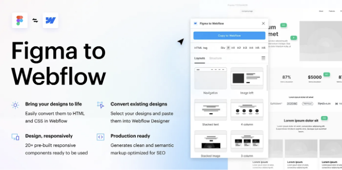

<!-- ui-log 수평형 -->

<ins class="adsbygoogle"
      style="display:block"
      data-ad-client="ca-pub-4877378276818686"
      data-ad-slot="9743150776"
      data-ad-format="auto"
      data-full-width-responsive="true"></ins>
<component is="script">
(adsbygoogle = window.adsbygoogle || []).push({});
</component>

## Figma에서 HTML로 Framer로

Figma 디자인을 쉽게 Framer에 붙여넣기하여 내보내세요. 이 플러그인은 디자인을 Framer의 레이아웃 도구에 실시간으로 맞춰 줍니다. 그래서 여러분은 멋진 웹사이트를 만들기에만 집중하면 됩니다.


.

<!-- ui-log 수평형 -->

<ins class="adsbygoogle"
      style="display:block"
      data-ad-client="ca-pub-4877378276818686"
      data-ad-slot="9743150776"
      data-ad-format="auto"
      data-full-width-responsive="true"></ins>
<component is="script">
(adsbygoogle = window.adsbygoogle || []).push({});
</component>

## 빠른 이소메트릭

빠른 이소메트릭은 다양한 도구와 템플릿을 통해 이소메트릭 디자인을 신속하게 만들 수 있는 Figma 플러그인입니다. 이를 통해 인상적인 3D 그래픽과 인터페이스를 손쉽게 만들 수 있습니다.


<!-- ui-log 수평형 -->

<ins class="adsbygoogle"
      style="display:block"
      data-ad-client="ca-pub-4877378276818686"
      data-ad-slot="9743150776"
      data-ad-format="auto"
      data-full-width-responsive="true"></ins>
<component is="script">
(adsbygoogle = window.adsbygoogle || []).push({});
</component>

## 브레이크포인트

Figma 프레임 내에서 반응형 레이아웃 미리보기 및 애니메이션 프로토타입을 공유해보세요.

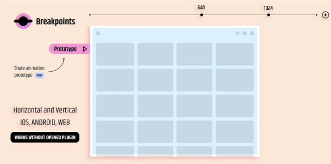

.

<!-- ui-log 수평형 -->

<ins class="adsbygoogle"
      style="display:block"
      data-ad-client="ca-pub-4877378276818686"
      data-ad-slot="9743150776"
      data-ad-format="auto"
      data-full-width-responsive="true"></ins>
<component is="script">
(adsbygoogle = window.adsbygoogle || []).push({});
</component>

## Relume

Relume 사이트 빌더를 사용하여 웹사이트를 만들고, 플러그인을 통해 Figma에서 손쉽게 편집할 수 있습니다.


<!-- ui-log 수평형 -->

<ins class="adsbygoogle"
      style="display:block"
      data-ad-client="ca-pub-4877378276818686"
      data-ad-slot="9743150776"
      data-ad-format="auto"
      data-full-width-responsive="true"></ins>
<component is="script">
(adsbygoogle = window.adsbygoogle || []).push({});
</component>

## Musho AI

Musho는 단순한 레이아웃, 훌륭한 콘텐츠 및 멋진 이미지로 거의 완성된 개발용 웹사이트로 귀하의 프롬프트를 변환합니다.


.

<!-- ui-log 수평형 -->

<ins class="adsbygoogle"
      style="display:block"
      data-ad-client="ca-pub-4877378276818686"
      data-ad-slot="9743150776"
      data-ad-format="auto"
      data-full-width-responsive="true"></ins>
<component is="script">
(adsbygoogle = window.adsbygoogle || []).push({});
</component>

## ARC — 텍스트를 굽힙시다!

텍스트를 위로, 아래로 또는 원형으로 휘어지게 만들어보세요

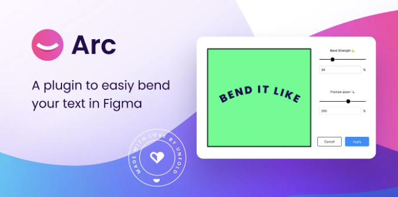

<!-- ui-log 수평형 -->

<ins class="adsbygoogle"
      style="display:block"
      data-ad-client="ca-pub-4877378276818686"
      data-ad-slot="9743150776"
      data-ad-format="auto"
      data-full-width-responsive="true"></ins>
<component is="script">
(adsbygoogle = window.adsbygoogle || []).push({});
</component>

## 언스플래시

디자인에 아름다운 이미지를 언스플래시에서 삽입하세요.
언스플래시 라이선스는 상업적 및 개인 프로젝트에 자유롭게 사용할 수 있는 이미지 사용을 허용합니다.

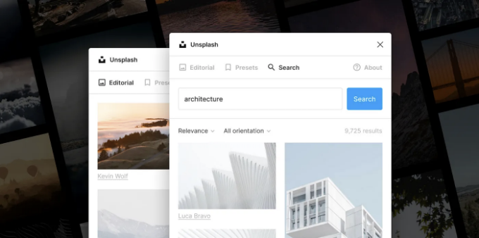

<!-- ui-log 수평형 -->

<ins class="adsbygoogle"
      style="display:block"
      data-ad-client="ca-pub-4877378276818686"
      data-ad-slot="9743150776"
      data-ad-format="auto"
      data-full-width-responsive="true"></ins>
<component is="script">
(adsbygoogle = window.adsbygoogle || []).push({});
</component>

## Jitter · Figma용 애니메이션

Jitter로 전문적인 애니메이션 컨텐츠를 만드세요. 브랜드에 딱 맞는 UI, 비디오, 소셜 미디어 포스트, 웹사이트, 앱, 로고 등을 설계하는 데 사용할 수 있습니다. 무료 회원가입하세요.


<!-- ui-log 수평형 -->

<ins class="adsbygoogle"
      style="display:block"
      data-ad-client="ca-pub-4877378276818686"
      data-ad-slot="9743150776"
      data-ad-format="auto"
      data-full-width-responsive="true"></ins>
<component is="script">
(adsbygoogle = window.adsbygoogle || []).push({});
</component>

## 마술사

AI의 힘으로 복사부터 텍스트로부터 고유한 아이콘을 생성하는 모든 것을 할 수 있습니다.


.

<!-- ui-log 수평형 -->

<ins class="adsbygoogle"
      style="display:block"
      data-ad-client="ca-pub-4877378276818686"
      data-ad-slot="9743150776"
      data-ad-format="auto"
      data-full-width-responsive="true"></ins>
<component is="script">
(adsbygoogle = window.adsbygoogle || []).push({});
</component>

## 배경 제거

이미지의 배경을 한 번의 클릭으로 자동으로 제거하세요.


<!-- ui-log 수평형 -->

<ins class="adsbygoogle"
      style="display:block"
      data-ad-client="ca-pub-4877378276818686"
      data-ad-slot="9743150776"
      data-ad-format="auto"
      data-full-width-responsive="true"></ins>
<component is="script">
(adsbygoogle = window.adsbygoogle || []).push({});
</component>

## Anima — Figma to Code: React, HTML, Vue, CSS, Tailwind

Anima가 AI 코드 개인화로 당신처럼 코드를 작성합니다.
당신의 디자인을 기반으로 코드를 얻어 디자인에서 개발로의 프로세스를 가속화하세요.


## Icons8 — 아이콘, 일러스트, 사진

<!-- ui-log 수평형 -->

<ins class="adsbygoogle"
      style="display:block"
      data-ad-client="ca-pub-4877378276818686"
      data-ad-slot="9743150776"
      data-ad-format="auto"
      data-full-width-responsive="true"></ins>
<component is="script">
(adsbygoogle = window.adsbygoogle || []).push({});
</component>

가장 크고 일관된 그래픽 컬렉션으로 흐름을 유지하세요. Figma를 벗어나지 않고 150만 개 이상의 아이콘, 사진 및 삽화를 얻어보세요!


.

## 콘텐츠 목록

<!-- ui-log 수평형 -->

<ins class="adsbygoogle"
      style="display:block"
      data-ad-client="ca-pub-4877378276818686"
      data-ad-slot="9743150776"
      data-ad-format="auto"
      data-full-width-responsive="true"></ins>
<component is="script">
(adsbygoogle = window.adsbygoogle || []).push({});
</component>

한 팔렛트에서 텍스트 문자열, 이미지 및 아이콘을 가져와 레이아웃을 효율적으로 설계하세요. Content Reel을 사용하면 사용자 정의 콘텐츠를 만들고 다른 Figma 사용자와 공유할 수 있습니다.

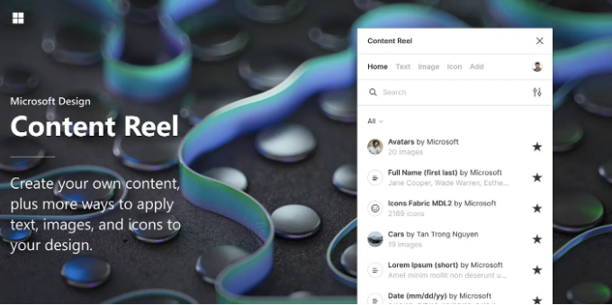

.

## 3D로 변환하기

<!-- ui-log 수평형 -->

<ins class="adsbygoogle"
      style="display:block"
      data-ad-client="ca-pub-4877378276818686"
      data-ad-slot="9743150776"
      data-ad-format="auto"
      data-full-width-responsive="true"></ins>
<component is="script">
(adsbygoogle = window.adsbygoogle || []).push({});
</component>

이 플러그인은 텍스트와 벡터 노드를 한 번의 클릭으로 3D 모델로 변환해줍니다! 변환된 모델은 GPU 레이 트레이싱으로 자동 배치되어 렌더링됩니다. 3D 전문가가 아니어도 멋진 3D 아이콘, 텍스트 또는 다른 3D 스타일 이미지를 렌더링하는 데 사용할 수 있습니다.


.

## 모형(Mockup)

<!-- ui-log 수평형 -->

<ins class="adsbygoogle"
      style="display:block"
      data-ad-client="ca-pub-4877378276818686"
      data-ad-slot="9743150776"
      data-ad-format="auto"
      data-full-width-responsive="true"></ins>
<component is="script">
(adsbygoogle = window.adsbygoogle || []).push({});
</component>

그냥 장치를 선택하고 프레임을 선택하면 설계가 화면에 나타납니다. 매우 쉬운 모의실험 플러그인

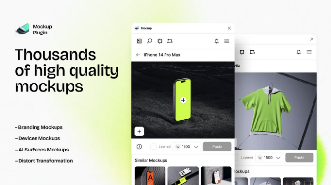

## 자동 흐름

<!-- ui-log 수평형 -->

<ins class="adsbygoogle"
      style="display:block"
      data-ad-client="ca-pub-4877378276818686"
      data-ad-slot="9743150776"
      data-ad-format="auto"
      data-full-width-responsive="true"></ins>
<component is="script">
(adsbygoogle = window.adsbygoogle || []).push({});
</component>

Figma에서 흐름 화살표를 자동으로 그려보세요! 손 그림 또는 최소주의 스타일로 사용자 흐름, 다이어그램 또는 그래픽을 그려 보세요.


## Bobs

<!-- ui-log 수평형 -->

<ins class="adsbygoogle"
      style="display:block"
      data-ad-client="ca-pub-4877378276818686"
      data-ad-slot="9743150776"
      data-ad-format="auto"
      data-full-width-responsive="true"></ins>
<component is="script">
(adsbygoogle = window.adsbygoogle || []).push({});
</component>

친구야, 버튼을 클릭하면 유기적인 덩어리 모양을 만들 수 있어. 각 모양은 이전 것과 다르게 만들어지니까 진짜 독특하게 나올 거야. 얼마나 독특한지와 점의 개수를 조절할 수 있어.


.

## 발광

<!-- ui-log 수평형 -->

<ins class="adsbygoogle"
      style="display:block"
      data-ad-client="ca-pub-4877378276818686"
      data-ad-slot="9743150776"
      data-ad-format="auto"
      data-full-width-responsive="true"></ins>
<component is="script">
(adsbygoogle = window.adsbygoogle || []).push({});
</component>

요소에 매끄럽고 아름다운 빛을 적용하세요.

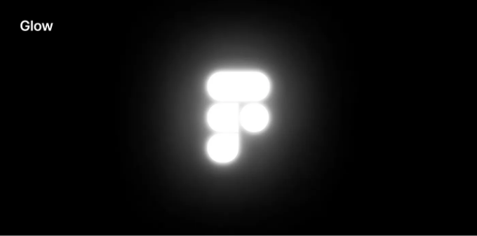

---

## LottieFiles — Figma에서 애니메이션 생성 및 내보내기

<!-- ui-log 수평형 -->

<ins class="adsbygoogle"
      style="display:block"
      data-ad-client="ca-pub-4877378276818686"
      data-ad-slot="9743150776"
      data-ad-format="auto"
      data-full-width-responsive="true"></ins>
<component is="script">
(adsbygoogle = window.adsbygoogle || []).push({});
</component>

로티파일 for Figma는 애니메이션 제작을 재정의하여 디자이너들이 디자인을 손쉽게 Lottie 애니메이션으로 변환할 수 있게 합니다. 이 강력한 기능은 기본 애니메이션부터 다중 프레임 및 다중 변형 구성 요소 시퀀스까지 모두 지원합니다.


.

## 경로로 변환

<!-- ui-log 수평형 -->

<ins class="adsbygoogle"
      style="display:block"
      data-ad-client="ca-pub-4877378276818686"
      data-ad-slot="9743150776"
      data-ad-format="auto"
      data-full-width-responsive="true"></ins>
<component is="script">
(adsbygoogle = window.adsbygoogle || []).push({});
</component>

테이블 태그를 마크다운 형식으로 변경해주세요.

```
| Header One | Header Two |
|------------|------------|
| Row 1      | Data 1     |
| Row 2      | Data 2     |
```

<!-- ui-log 수평형 -->

<ins class="adsbygoogle"
      style="display:block"
      data-ad-client="ca-pub-4877378276818686"
      data-ad-slot="9743150776"
      data-ad-format="auto"
      data-full-width-responsive="true"></ins>
<component is="script">
(adsbygoogle = window.adsbygoogle || []).push({});
</component>

Figma용 노이즈 플러그인은 사용자 정의 가능한 노이즈 패턴으로 디자인에 질감과 깊이를 더합니다. Perlin, simplex 및 cellular 노이즈를 생성하고, 스케일 및 불투명도와 같은 매개변수를 조절하며 실시간으로 변경 사항을 미리 볼 수 있습니다. 이 귀중한 도구로 빠르고 효율적으로 디자인을 향상시키세요.

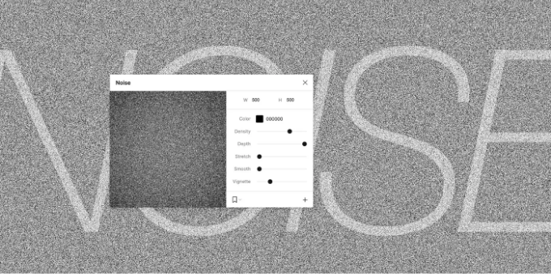

## 테이블 생성기

<!-- ui-log 수평형 -->

<ins class="adsbygoogle"
      style="display:block"
      data-ad-client="ca-pub-4877378276818686"
      data-ad-slot="9743150776"
      data-ad-format="auto"
      data-full-width-responsive="true"></ins>
<component is="script">
(adsbygoogle = window.adsbygoogle || []).push({});
</component>

편집하고 콘텐츠에 자동으로 맞추기 쉬운 사용자 정의 스타일 테이블을 만들어보세요. 요소를 수정하여 테이블의 디자인을 제어하세요.

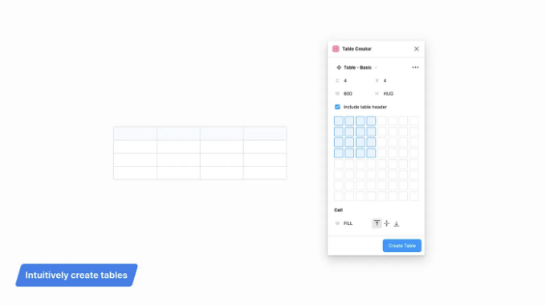

.

## 차트

<!-- ui-log 수평형 -->

<ins class="adsbygoogle"
      style="display:block"
      data-ad-client="ca-pub-4877378276818686"
      data-ad-slot="9743150776"
      data-ad-format="auto"
      data-full-width-responsive="true"></ins>
<component is="script">
(adsbygoogle = window.adsbygoogle || []).push({});
</component>

Chart는 Figma에서 실제 또는 임의의 데이터를 사용하여 18 종류의 차트를 만들 수 있는 가장 강력한 플러그인입니다. Chart는 Excel, Numbers, Google Sheets와 같은 편집기로부터 복사하여 붙여넣기를 지원하며, Google Sheets와의 실시간 연결, 원격 JSON(REST API), 로컬 CSV 및 JSON 파일을 지원합니다.


## Stark — 명암 대비 및 접근성 도구

<!-- ui-log 수평형 -->

<ins class="adsbygoogle"
      style="display:block"
      data-ad-client="ca-pub-4877378276818686"
      data-ad-slot="9743150776"
      data-ad-format="auto"
      data-full-width-responsive="true"></ins>
<component is="script">
(adsbygoogle = window.adsbygoogle || []).push({});
</component>

이제 기록 산출물로 접근성 있는 소프트웨어를 작성하고 테스트할 수 있어요. 웹사이트, 온라인 쇼핑몰, 모바일 앱 또는 SaaS 제품을 만들고 있다면, Stark는 모든 디자이너, 엔지니어, PM 및 QA 전문가에게 수동 및 자동화된 도구를 제공하여 손쉽게 접근성을 확보할 수 있도록 도와줘요.


.

## 3D Wave: 모든 것을 원단처럼 부드럽게 만들어요

<!-- ui-log 수평형 -->

<ins class="adsbygoogle"
      style="display:block"
      data-ad-client="ca-pub-4877378276818686"
      data-ad-slot="9743150776"
      data-ad-format="auto"
      data-full-width-responsive="true"></ins>
<component is="script">
(adsbygoogle = window.adsbygoogle || []).push({});
</component>

모든 것을 3D 웨이브로 만들어 보세요!

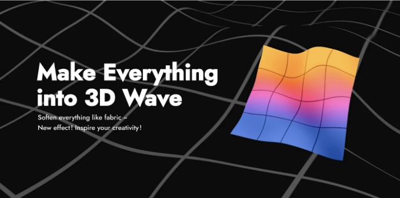

.

## 웨이브 받기

<!-- ui-log 수평형 -->

<ins class="adsbygoogle"
      style="display:block"
      data-ad-client="ca-pub-4877378276818686"
      data-ad-slot="9743150776"
      data-ad-format="auto"
      data-full-width-responsive="true"></ins>
<component is="script">
(adsbygoogle = window.adsbygoogle || []).push({});
</component>

Get Waves는 다음 디자인을 위한 고유한 SVG 웨이브를 만들 수 있는 무료 SVG 웨이브 생성기입니다. 곡선을 선택하고 복잡도를 조절하며 무작위로 설정하세요!


.

## 사용자 프로필 | 아바타

<!-- ui-log 수평형 -->

<ins class="adsbygoogle"
      style="display:block"
      data-ad-client="ca-pub-4877378276818686"
      data-ad-slot="9743150776"
      data-ad-format="auto"
      data-full-width-responsive="true"></ins>
<component is="script">
(adsbygoogle = window.adsbygoogle || []).push({});
</component>

디자이너들이 디자인 프로토타입에 아름다운 생성된 아바타를 표시할 수 있게 해줍니다. 📸


.

## UI Faces — 무료 AI 아바타

<!-- ui-log 수평형 -->

<ins class="adsbygoogle"
      style="display:block"
      data-ad-client="ca-pub-4877378276818686"
      data-ad-slot="9743150776"
      data-ad-format="auto"
      data-full-width-responsive="true"></ins>
<component is="script">
(adsbygoogle = window.adsbygoogle || []).push({});
</component>

친구야, 창의적인 프로젝트를 위한 무료 AI 생성 아바타를 만나보세요.


.

## 소음 및 질감

<!-- ui-log 수평형 -->

<ins class="adsbygoogle"
      style="display:block"
      data-ad-client="ca-pub-4877378276818686"
      data-ad-slot="9743150776"
      data-ad-format="auto"
      data-full-width-responsive="true"></ins>
<component is="script">
(adsbygoogle = window.adsbygoogle || []).push({});
</component>

피그마 플러그인으로 연속적인 타일 잡음, 질감, 패턴, 그라데이션 등을 동적으로 생성합니다. 레이어를 선택하고 잡음이나 질감을 추가하세요. 설정을 변경하면 실시간으로 레이어가 업데이트됩니다.


## 그라데이션 메쉬

<!-- ui-log 수평형 -->

<ins class="adsbygoogle"
      style="display:block"
      data-ad-client="ca-pub-4877378276818686"
      data-ad-slot="9743150776"
      data-ad-format="auto"
      data-full-width-responsive="true"></ins>
<component is="script">
(adsbygoogle = window.adsbygoogle || []).push({});
</component>

그라데이션 이미지와 2D 그리드가 함께 표시되며, 그리드의 꼭지점 및 선을 편집하여 완벽한 그라데이션 룩을 얻을 수 있습니다.


.

## 아름다운 그림자

<!-- ui-log 수평형 -->

<ins class="adsbygoogle"
      style="display:block"
      data-ad-client="ca-pub-4877378276818686"
      data-ad-slot="9743150776"
      data-ad-format="auto"
      data-full-width-responsive="true"></ins>
<component is="script">
(adsbygoogle = window.adsbygoogle || []).push({});
</component>

플러그인을 통해 선택한 요소에 그림자를 툭하면서 그림자를 만들 수 있어요. ‘광원’을 드래그하여 선택한 요소에 그림자를 드리울 수 있어요.


## 료리 스플라인

<!-- ui-log 수평형 -->

<ins class="adsbygoogle"
      style="display:block"
      data-ad-client="ca-pub-4877378276818686"
      data-ad-slot="9743150776"
      data-ad-format="auto"
      data-full-width-responsive="true"></ins>
<component is="script">
(adsbygoogle = window.adsbygoogle || []).push({});
</component>

어떤 곡선에도 gradient along path 효과를 추가하여 고품질의 spline, 모양, spot을 만들어보세요. 250개 이상의 수제 커브 및 색상을 완전히 편집할 수 있으며, 무한한 조합 옵션을 가지게 됩니다.


**Pixels**

<!-- ui-log 수평형 -->

<ins class="adsbygoogle"
      style="display:block"
      data-ad-client="ca-pub-4877378276818686"
      data-ad-slot="9743150776"
      data-ad-format="auto"
      data-full-width-responsive="true"></ins>
<component is="script">
(adsbygoogle = window.adsbygoogle || []).push({});
</component>

이미지에 픽셀화 / 8비트 효과 필터를 적용하세요. Raster 및 Vector.


.

## Drawkit 3D Builder

<!-- ui-log 수평형 -->

<ins class="adsbygoogle"
      style="display:block"
      data-ad-client="ca-pub-4877378276818686"
      data-ad-slot="9743150776"
      data-ad-format="auto"
      data-full-width-responsive="true"></ins>
<component is="script">
(adsbygoogle = window.adsbygoogle || []).push({});
</component>

DrawKit 3D 빌더로 멋진 디자인을 만들어보세요. 3D 일러스트와 아이콘을 쉽게 섞어서 매치하고 Figma 파일에 삽입할 수 있어요.

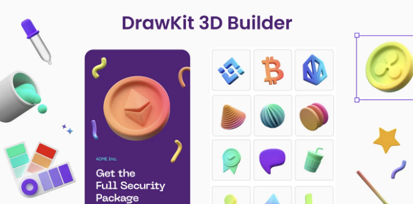

.

## 사인파

<!-- ui-log 수평형 -->

<ins class="adsbygoogle"
      style="display:block"
      data-ad-client="ca-pub-4877378276818686"
      data-ad-slot="9743150776"
      data-ad-format="auto"
      data-full-width-responsive="true"></ins>
<component is="script">
(adsbygoogle = window.adsbygoogle || []).push({});
</component>

몇 번의 클릭만으로 사인파를 쉽게 생성하세요


.

## 곡선 맞춤

<!-- ui-log 수평형 -->

<ins class="adsbygoogle"
      style="display:block"
      data-ad-client="ca-pub-4877378276818686"
      data-ad-slot="9743150776"
      data-ad-format="auto"
      data-full-width-responsive="true"></ins>
<component is="script">
(adsbygoogle = window.adsbygoogle || []).push({});
</component>

핏 커브 플러그인은 Figma에서 부드러운 곡률을 가진 곡선을 만드는 데 도움이 됩니다. 원형 버튼과 슬라이더로 구성된 직관적인 인터페이스를 갖추고 있어, 베지에 곡선 세그먼트의 핸들 길이를 정확하게 수정할 수 있습니다.


.

## 피그마를 엘리먼터로

<!-- ui-log 수평형 -->

<ins class="adsbygoogle"
      style="display:block"
      data-ad-client="ca-pub-4877378276818686"
      data-ad-slot="9743150776"
      data-ad-format="auto"
      data-full-width-responsive="true"></ins>
<component is="script">
(adsbygoogle = window.adsbygoogle || []).push({});
</component>

피그마 디자인을 엘리멘터 위젯으로 쉽게 변환하는 피그마 플러그인입니다. 이 플러그인에서 생성된 JSON 데이터는 엘리멘터 편집기에 직접 붙여넣을 수 있습니다. 엘리멘터 편집기에서 마우스 오른쪽 버튼을 클릭하고 `다른 사이트에서 붙여넣기`를 선택하거나 Ctrl + V를 누릅니다. 잘 그룹화된 디자인에 더 잘 작동합니다.


## 반복자 효과

<!-- ui-log 수평형 -->

<ins class="adsbygoogle"
      style="display:block"
      data-ad-client="ca-pub-4877378276818686"
      data-ad-slot="9743150776"
      data-ad-format="auto"
      data-full-width-responsive="true"></ins>
<component is="script">
(adsbygoogle = window.adsbygoogle || []).push({});
</component>

테이블 태그를 Markdown 형식으로 변경하세요.

| Syntax    | Description |
| --------- | ----------- |
| Header    | Title       |
| Paragraph | Text        |

<!-- ui-log 수평형 -->

<ins class="adsbygoogle"
      style="display:block"
      data-ad-client="ca-pub-4877378276818686"
      data-ad-slot="9743150776"
      data-ad-format="auto"
      data-full-width-responsive="true"></ins>
<component is="script">
(adsbygoogle = window.adsbygoogle || []).push({});
</component>

몇 분 안에 자신의 이미지로 심벌 패턴을 만드세요.

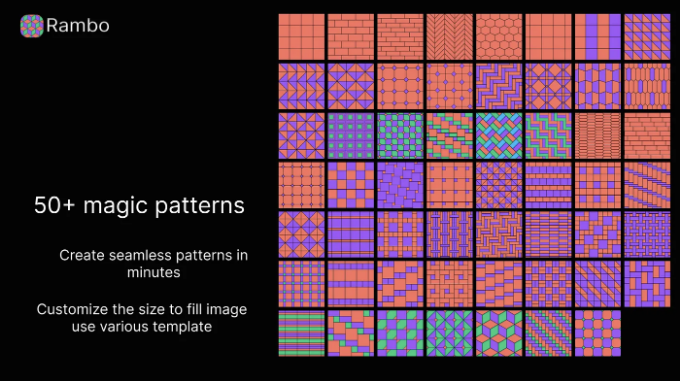

.

## 타입 스케일

<!-- ui-log 수평형 -->

<ins class="adsbygoogle"
      style="display:block"
      data-ad-client="ca-pub-4877378276818686"
      data-ad-slot="9743150776"
      data-ad-format="auto"
      data-full-width-responsive="true"></ins>
<component is="script">
(adsbygoogle = window.adsbygoogle || []).push({});
</component>

빠르게 간단한 타입스케일/모듈러 스케일을 생성하세요.


---

## html.to.design

<!-- ui-log 수평형 -->

<ins class="adsbygoogle"
      style="display:block"
      data-ad-client="ca-pub-4877378276818686"
      data-ad-slot="9743150776"
      data-ad-format="auto"
      data-full-width-responsive="true"></ins>
<component is="script">
(adsbygoogle = window.adsbygoogle || []).push({});
</component>

웹 사이트를 완전히 편집 가능한 Figma 디자인으로 변환하실 수 있습니다. 기존 웹 사이트를 활용하여 해당 웹페이지의 HTML을 Figma로 가져와 스크래치에서 각 요소를 구축하지 않고 자신만의 디자인을 시작하세요.

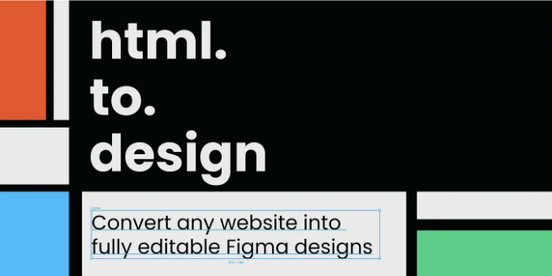

.

## 이름 바꾸기

<!-- ui-log 수평형 -->

<ins class="adsbygoogle"
      style="display:block"
      data-ad-client="ca-pub-4877378276818686"
      data-ad-slot="9743150776"
      data-ad-format="auto"
      data-full-width-responsive="true"></ins>
<component is="script">
(adsbygoogle = window.adsbygoogle || []).push({});
</component>

Figma 파일을 정리하고 레이어와 프레임 일괄 이름 바꾸기해요.


## 문서 정리

<!-- ui-log 수평형 -->

<ins class="adsbygoogle"
      style="display:block"
      data-ad-client="ca-pub-4877378276818686"
      data-ad-slot="9743150776"
      data-ad-format="auto"
      data-full-width-responsive="true"></ins>
<component is="script">
(adsbygoogle = window.adsbygoogle || []).push({});
</component>

Automagically organize and clean up your Figma document.


.

## Styles to Variables

<!-- ui-log 수평형 -->

<ins class="adsbygoogle"
      style="display:block"
      data-ad-client="ca-pub-4877378276818686"
      data-ad-slot="9743150776"
      data-ad-format="auto"
      data-full-width-responsive="true"></ins>
<component is="script">
(adsbygoogle = window.adsbygoogle || []).push({});
</component>

테이블 태그를 마크다운 형식으로 변경해 보세요.
