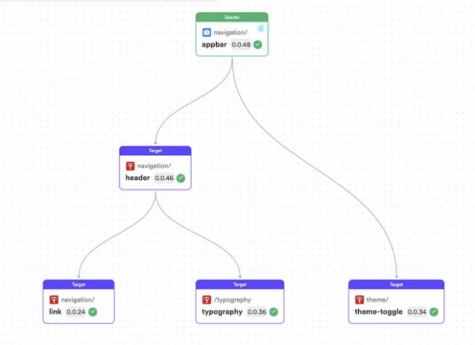

## 빠르고 효과적인 프론트엔드 아키텍처 설계를 위한 실용적인 통찰력

웹 애플리케이션의 복잡성이 증가함에 따라, 더 효율적이고 확장 가능하며 유지보수가 쉬운 코드와 향상된 개발자 경험이 필수적이 되었습니다.

현대 프론트엔드 아키텍처는 이러한 품질 속성을 해결하기 위해 크게 발전해 왔으며, 개발자들은 새로운 아키텍처 스타일, 패턴, 도구, 및 관행을 채택하고 있습니다.

# 1. 디자인 시스템

<!-- ui-log 수평형 -->

<ins class="adsbygoogle"
      style="display:block"
      data-ad-client="ca-pub-4877378276818686"
      data-ad-slot="9743150776"
      data-ad-format="auto"
      data-full-width-responsive="true"></ins>
<component is="script">
(adsbygoogle = window.adsbygoogle || []).push({});
</component>


프론트엔드를 구현하기 전에 애플리케이션 전반에 사용되는 디자인 시스템을 만드는 데 투자하는 것이 가치가 있습니다. 이러한 대부분의 디자인 시스템은 Material UI, Chakra UI, Headless UI와 같은 인기 있는 컴포넌트 라이브러리를 기반으로 합니다.

하지만 현대적인 디자인 시스템은 컴포넌트 라이브러리를 넘어서도 많은 영역에 대해 다룹니다. 디자이너와 개발자가 이해하는 디자인 언어를 포함하며, 디자인 시스템의 UI 구성 요소는 단순한 버튼과 텍스트 상자부터 위젯, 대화상자 같은 복잡한 구성까지 다양합니다. 또한 테마 설정, 타이포그래피, 아이콘 등을 다룹니다.



<!-- ui-log 수평형 -->

<ins class="adsbygoogle"
      style="display:block"
      data-ad-client="ca-pub-4877378276818686"
      data-ad-slot="9743150776"
      data-ad-format="auto"
      data-full-width-responsive="true"></ins>
<component is="script">
(adsbygoogle = window.adsbygoogle || []).push({});
</component>

디자인 시스템을 개발하면서 각 컴포넌트를 독립적으로 개발, 미리보기 및 테스트할 수 있어야 합니다. 각 컴포넌트는 한 개 또는 여러 애플리케이션에서 높은 재사용성을 가지므로 참조하기 쉽게 잘 문서화되어야 합니다.

# 2. 컴포넌트 재사용

프론트엔드 아키텍처는 백엔드와 비교하여 독특하며, 애플리케이션 전체에서 일관된 룩 앤 필이 필요합니다. 이를 달성하는 가장 자연스러운 방법은 프론트엔드의 다른 부분에서 컴포넌트를 많이 재사용하는 것입니다.

과거에는 애플리케이션 전체에서 재사용되는 공통 UI 컴포넌트를 저장하기 위해 공유 디렉토리를 유지했습니다.

<!-- ui-log 수평형 -->

<ins class="adsbygoogle"
      style="display:block"
      data-ad-client="ca-pub-4877378276818686"
      data-ad-slot="9743150776"
      data-ad-format="auto"
      data-full-width-responsive="true"></ins>
<component is="script">
(adsbygoogle = window.adsbygoogle || []).push({});
</component>

```js
src/
├── components/
│   ├── shared/
│   │   ├── NavBar.jsx           // 네비게이션 바 공유 컴포넌트
│   │   ├── Footer.jsx           // 공유 푸터 컴포넌트
│   │   ├── CustomButton.jsx     // 앱 전반에 걸쳐 사용되는 스타일이 적용된 버튼
│   │   ├── CustomCard.jsx       // 여러 곳에서 사용되는 카드 컴포넌트
│   │   └── ModalWrapper.jsx     // 재사용을 위한 일반적인 모달 래퍼
│   ├── HomePage/
│   │   ├── HomePage.jsx         // 홈페이지의 주요 콘텐츠 및 레이아웃
│   │   └── HomeFeature.jsx      // 홈페이지에서만 사용되는 특정 기능/컴포넌트
│   ├── AboutPage/
│   │   ├── AboutPage.jsx        // 소개 페이지의 주요 콘텐츠
│   │   └── TeamMembers.jsx      // About 페이지 전용 팀 멤버를 표시하는 컴포넌트
│   ├── ContactPage/
│   │   ├── ContactPage.jsx      // 연락처 페이지의 주요 콘텐츠
│   │   └── ContactForm.jsx      // 연락처 페이지 전용 연락 양식
│   └── Dashboard/
│       ├── DashboardPage.jsx    // 대시보드 페이지 레이아웃 및 콘텐츠
│       ├── DashboardWidget.jsx  // 대시보드 내에서 사용되는 위젯 컴포넌트
│       └── StatsCard.jsx        // 대시보드 전용 통계를 표시하는 카드
├── App.jsx                      // 라우팅을 포함한 주요 앱 컴포넌트
├── index.js                     // React 애플리케이션 진입점
```

그리고 우리 모두 아는 대로 공유 폴더의 컴포넌트는 점점 커져서 재사용하기 어려워집니다. 이를 피하는 가장 간단한 단계는 프로젝트를 디자인 시 최소한의 요소부터 가장 복잡한 페이지까지 매끄럽게 재사용하는 것이며, 디자인 시스템을 채택하는 것입니다.

```js
src/
├── components/
│   ├── layout/
│   │   ├── NavBar.jsx
│   │   └── Footer.jsx
│   ├── ui/
│   │   ├── CustomButton.jsx
│   │   ├── CustomCard.jsx
│   │   └── ModalWrapper.jsx
│   ├── forms/
│   │   ├── TextFieldGroup.jsx
│   │   ├── SelectField.jsx
│   │   └── FormActions.jsx
│   ├── dataDisplay/
│   │   ├── UserList.jsx
│   │   ├── ProductCardGrid.jsx
│   │   └── ChartWrapper.jsx
│   └── navigation/
│       ├── Breadcrumbs.jsx
│       ├── DrawerMenu.jsx
│       └── TabsPanel.jsx
├── templates/
│   ├── MainLayout.jsx           // 네비게이션 바와 푸터를 포함한 주요 레이아웃 템플릿
│   └── DashboardLayout.jsx      // 대시보드 페이지를 위한 특별한 레이아웃
├── pages/
│   ├── HomePage.jsx             // MainLayout 템플릿 사용
│   ├── AboutPage.jsx            // MainLayout 템플릿 사용
│   ├── ContactPage.jsx          // MainLayout 템플릿 사용
│   ├── DashboardPage.jsx        // DashboardLayout 템플릿 사용
│   └── ProfilePage.jsx          // MainLayout 템플릿 사용, UserList와 같은 특정 컴포넌트 포함 가능
```

그러나 일정 규모를 넘어서면 이 모노리틱 구조는 여러 이유로 개발자의 생산성을 제한할 수 있습니다.

<!-- ui-log 수평형 -->

<ins class="adsbygoogle"
      style="display:block"
      data-ad-client="ca-pub-4877378276818686"
      data-ad-slot="9743150776"
      data-ad-format="auto"
      data-full-width-responsive="true"></ins>
<component is="script">
(adsbygoogle = window.adsbygoogle || []).push({});
</component>

- 수정해야 할 구성요소를 찾는 데 높은 인지 부하.
- 구성요소를 수정한 후, 프로젝트 전체에 미치는 영향을 테스트하고 이해하는 것.
- 기업에서 이러한 구성요소를 여러 응용 프로그램에 재사용하기 어려움.
- 각 구성요소를 개발하고 테스트하기 위해 전체 애플리케이션을 실행해야 함. 따라서 개발자들은 관련 UI를 로드하기 위해 몇 가지 조치를 취해야 할 수도 있습니다.


이 문제들을 해결하기 위해서는 독립적인 구성요소를 사용하여 프론트엔드 프로젝트를 구성 가능한 플랫폼으로 재구성할 수 있는 유연한 접근 방식이 필요합니다. 이를 통해 프론트엔드 아키텍처를 다양한 프로젝트 구조와 아키텍처 스타일로 장기적으로 발전시킬 수 있습니다.

# 3. 자산 최적화

<!-- ui-log 수평형 -->

<ins class="adsbygoogle"
      style="display:block"
      data-ad-client="ca-pub-4877378276818686"
      data-ad-slot="9743150776"
      data-ad-format="auto"
      data-full-width-responsive="true"></ins>
<component is="script">
(adsbygoogle = window.adsbygoogle || []).push({});
</component>

프론트엔드 애플리케이션에서 다양한 유형의 에셋을 최적화하는 것은 사용자 경험을 향상시키는 데 중요합니다. 또한 SEO를 향상시키기 위해 공개 웹 애플리케이션의 로드 시간을 최소화하는 것이 중요합니다. 그러나 여기서 주요 도전 과제는 다른 에셋이 특정 최적화 전략을 필요로 한다는 것입니다:

## 1. 이미지

라스터 이미지: JPEG, PNG, GIF 및 WebP 형식의 경우, 파일 크기를 줄이기 위해 압축 도구를 사용하여 시각적 품질에 큰 영향을 미치지 않도록 합니다. WebP와 같은 차세대 형식을 사용하여 압축과 품질을 더욱 높일 수 있습니다. 사용자 기기에 따라 올바른 이미지 크기를 제공하기 위해 srcset을 사용하여 반응형 이미지를 구현하세요.

벡터 이미지: SVG 파일은 기본적으로 확장 가능하며 일반적으로 작은 크기입니다. SVG 파일을 최소화하고 아이콘용으로 인라인 SVG를 고려하여 HTTP 요청을 줄이세요.

<!-- ui-log 수평형 -->

<ins class="adsbygoogle"
      style="display:block"
      data-ad-client="ca-pub-4877378276818686"
      data-ad-slot="9743150776"
      data-ad-format="auto"
      data-full-width-responsive="true"></ins>
<component is="script">
(adsbygoogle = window.adsbygoogle || []).push({});
</component>

## 2. JavaScript

라이브러리 및 프레임워크: 무겁고 복잡한 라이브러리 및 프레임워크를 최소화하세요. 트리 쉐이킹을 활용하여 번들에서 사용되지 않는 코드를 제거하세요. JavaScript 파일을 번들링하고 최소화하며, 코드 분할을 사용하여 필요할 때 코드를 로드하세요.

사용자 정의 스크립트: 사용자 정의 JavaScript 또는 TypeScript 파일을 최소화하고 압축하세요 (Gzip 또는 Brotli를 사용). 즉시 필요하지 않은 스크립트의 경우 지연 로딩을 사용하세요.

리소스를 더 효율적으로 로드하려면 HTTP/2를 사용할 수도 있습니다.

<!-- ui-log 수평형 -->

<ins class="adsbygoogle"
      style="display:block"
      data-ad-client="ca-pub-4877378276818686"
      data-ad-slot="9743150776"
      data-ad-format="auto"
      data-full-width-responsive="true"></ins>
<component is="script">
(adsbygoogle = window.adsbygoogle || []).push({});
</component>

## 3. CSS

CSS 파일: CSS 파일을 최소화하여 크기를 줄입니다. CSS 압축을 사용하고 콘텐츠를 더 빠르게 렌더링하기 위해 필수적인 스타일을 인라인으로 로드하는 중요한 CSS 기술을 고려하세요.

PostCSS나 유사한 도구를 활용하여 자동 접두사를 추가하고 CSS를 최적화하여 다양한 브라우저와의 호환성을 확보하세요.

## 4. Fonts and Icons

<!-- ui-log 수평형 -->

<ins class="adsbygoogle"
      style="display:block"
      data-ad-client="ca-pub-4877378276818686"
      data-ad-slot="9743150776"
      data-ad-format="auto"
      data-full-width-responsive="true"></ins>
<component is="script">
(adsbygoogle = window.adsbygoogle || []).push({});
</component>

웹 폰트: 더 나은 압축을 위해 WOFF2와 같은 폰트 형식을 선택하세요. 폰트 로딩 중에도 텍스트가 보이도록 font-display: swap을 사용해주세요. 폰트 변형의 수를 제한하고 필요한 문자만 로드하세요.

아이콘 파일: 아이콘에 대해 SVG 스프라이트 또는 아이콘 폰트를 사용할 수 있습니다. SVG를 최소화하고, React와 같은 프레임워크를 위한 아이콘 컴포넌트를 사용하여 SVG를 인라인으로 처리해 HTTP 요청 수를 줄이세요.

## 5. 비디오와 오디오

비디오 파일: 비디오 파일을 압축하고 WebM과 같은 현대적인 형식을 사용하여 더 낮은 비트레이트로 더 좋은 품질을 유지하세요. 비디오에 대해 lazy loading을 구현하고 사용자가 상호 작용할 때까지 플레이스홀더 이미지를 고려하세요.

<!-- ui-log 수평형 -->

<ins class="adsbygoogle"
      style="display:block"
      data-ad-client="ca-pub-4877378276818686"
      data-ad-slot="9743150776"
      data-ad-format="auto"
      data-full-width-responsive="true"></ins>
<component is="script">
(adsbygoogle = window.adsbygoogle || []).push({});
</component>

**오디오 파일:** 오디오 파일을 압축하고 AAC와 같은 형식을 사용하여 파일 크기와 품질 사이의 균형을 유지하세요. 대역폭을 절약하기 위해 필요할 때에만 오디오 파일을 로드하세요.

## 6. 문서

PDF, 워드 문서, 엑셀 시트: 문서 파일을 압축하고 초기 로딩 시간을 절약하기 위해 사용자 요청 시에만 로딩될 수 있도록 고려하세요.

이러한 최적화 작업은 두 가지 수준에서 수행할 수 있습니다. 첫 번째 옵션은 빌드 시 최적화 작업을 수행하는 것입니다. 일반적으로 코드 번들을 할 때 자바스크립트, CSS 및 이미지와 같은 자산을 최적화할 수 있습니다.

<!-- ui-log 수평형 -->

<ins class="adsbygoogle"
      style="display:block"
      data-ad-client="ca-pub-4877378276818686"
      data-ad-slot="9743150776"
      data-ad-format="auto"
      data-full-width-responsive="true"></ins>
<component is="script">
(adsbygoogle = window.adsbygoogle || []).push({});
</component>


## 성능 측정 및 최적화 도구

애플리케이션 성능과 각 에셋 유형의 영향을 분석하는 데 Chrome 개발자 콘솔 도구인 성능 인사이트, 네트워크, 그리고 라이트하우스를 활용할 수 있습니다. 이 도구들은 개선 영역과 최적화 전략에 대한 통찰을 제공합니다.

CSS: CSS 파일을 최소화하고 중요한 CSS를 사용하여 지각된 로딩 시간을 개선할 수 있습니다. React와 같은 프레임워크에서는 CSS 모듈이나 styled-components를 활용하여 범위와 최적화를 고려해보세요.

<!-- ui-log 수평형 -->

<ins class="adsbygoogle"
      style="display:block"
      data-ad-client="ca-pub-4877378276818686"
      data-ad-slot="9743150776"
      data-ad-format="auto"
      data-full-width-responsive="true"></ins>
<component is="script">
(adsbygoogle = window.adsbygoogle || []).push({});
</component>

각 에셋 유형에 대한 최적화 전략에 집중함으로써 프론트엔드 애플리케이션의 로딩 시간 및 전반적인 성능을 크게 향상시킬 수 있습니다. 이는 더 나은 사용자 경험과 잠재적으로 높은 SEO 순위로 이어질 수 있어요.

# 4. 다양한 수준에서의 캐싱

캐싱은 프론트엔드 아키텍처에서 성능을 향상시키고 서버 부하를 줄이며 최종 사용자에게 더 빠른 콘텐츠 전달을 제공하는 데 중요한 전략입니다. 다양한 수준에서 캐싱을 구현하면 웹 애플리케이션의 반응성을 크게 향상시킬 수 있어요. 여기 캐싱을 적용할 수 있는 주요 영역 몇 가지를 소개합니다:

## 브라우저 캐싱

<!-- ui-log 수평형 -->

<ins class="adsbygoogle"
      style="display:block"
      data-ad-client="ca-pub-4877378276818686"
      data-ad-slot="9743150776"
      data-ad-format="auto"
      data-full-width-responsive="true"></ins>
<component is="script">
(adsbygoogle = window.adsbygoogle || []).push({});
</component>

정적 자산: CSS, JavaScript, 이미지 및 글꼴과 같은 정적 자산에 대해 HTTP 캐시 헤더 (Cache-Control, Expires)를 구성하세요. 이렇게 하면 브라우저가 이 파일들을 로컬에 저장하고 서버에서 재요청하지 않고 이후 방문에서 재사용하도록 지시합니다.

서비스 워커: 서비스 워커를 사용하여 동적 콘텐츠 및 자산을 캐시하세요. 이를 통해 캐시에 대한 세밀한 제어가 가능해지며 웹 애플리케이션의 오프라인 기능을 활성화할 수 있습니다.

## CDN 캐싱

콘텐츠 전달 네트워크 (CDN): CDN을 활용하면 CDNs이 지리적으로 가까운 위치에 정적 자산을 캐시하여 대기 시간을 크게 줄이고 로드 시간을 개선할 수 있습니다. CDN 구성이 캐시 무효화 전략과 일치하도록 확인하여 가장 최신 콘텐츠를 제공할 수 있도록 하세요.

<!-- ui-log 수평형 -->

<ins class="adsbygoogle"
      style="display:block"
      data-ad-client="ca-pub-4877378276818686"
      data-ad-slot="9743150776"
      data-ad-format="auto"
      data-full-width-responsive="true"></ins>
<component is="script">
(adsbygoogle = window.adsbygoogle || []).push({});
</component>

## DNS 캐싱

DNS 조회: 브라우저 레벨이나 운영 체제에서 DNS 캐싱을 사용하면 액세스한 도메인의 IP 주소를 저장합니다. 이를 통해 동일한 도메인에 대한 후속 요청의 DNS 조회 시간을 줄일 수 있습니다.

## 애플리케이션 수준의 캐싱

데이터 캐싱: 애플리케이션 내에서 캐싱 전략을 구현하여 API 응답이나 계산된 결과와 같이 빈번하게 액세스되는 데이터를 저장합니다. React-query나 GraphQL용 Apollo Client와 같은 라이브러리에는 데이터 가져오기 및 상태 관리를 최적화하기 위한 내장 캐싱 메커니즘이 제공됩니다.

<!-- ui-log 수평형 -->

<ins class="adsbygoogle"
      style="display:block"
      data-ad-client="ca-pub-4877378276818686"
      data-ad-slot="9743150776"
      data-ad-format="auto"
      data-full-width-responsive="true"></ins>
<component is="script">
(adsbygoogle = window.adsbygoogle || []).push({});
</component>

# 5. 낙관적 동시성

낙관적 동시성은 프론트엔드 애플리케이션에서 사용되는 전략으로, 서버 확인을 기다리지 않고 작업이 성공할 것으로 가정하여 사용자 경험을 향상시키는 방법입니다. 이 접근 방식은 사용자에 의해 동시에 수행되는 작업으로 인한 문제를 피하는 데 특히 유용합니다. 어떻게 실제로 구현할 수 있는지 살펴봅시다.

## 낙관적 UI 업데이트

즉시 피드백: 사용자 작업 후 서버 응답을 기다리지 않고 바로 UI를 업데이트합니다. 예를 들어, 사용자가 댓글을 게시할 때, 댓글이 이미 성공적으로 게시된 것처럼 표시합니다.

<!-- ui-log 수평형 -->

<ins class="adsbygoogle"
      style="display:block"
      data-ad-client="ca-pub-4877378276818686"
      data-ad-slot="9743150776"
      data-ad-format="auto"
      data-full-width-responsive="true"></ins>
<component is="script">
(adsbygoogle = window.adsbygoogle || []).push({});
</component>

재조정: 서버 작업이 실패하는 경우, 낙관적인 변경을 되돌리고 실패를 사용자에게 알립니다. 이는 낙관적으로 추가된 댓글을 제거하고 오류 메시지를 표시하는 것을 포함할 수 있습니다.

다음 React 예제는 즉각적인 피드백과 재조정이 어떻게 구현되는지 보여줍니다.

```js
import React, { useState } from "react";

const CommentSection = () => {
  const [comments, setComments] = useState([]);
  const [newComment, setNewComment] = useState("");
  const [error, setError] = useState("");

  const handleSubmit = async (e) => {
    e.preventDefault();
    const commentId = Date.now(); // 간소화를 위해 타임스탬프를 가짜 ID로 사용
    const optimisticComment = { id: commentId, text: newComment };

    // 댓글을 UI에 낙관적으로 추가
    setComments([...comments, optimisticComment]);
    setNewComment("");

    try {
      // 지연이 포함된 서버 요청 시뮬레이션
      await new Promise((resolve, reject) => setTimeout(resolve, 1000));

      // 일반적으로 서버에게 POST 요청을 만들 것입니다
      // 여기서는 실패를 임의로 시뮬레이션합니다
      if (Math.random() > 0.7) {
        throw new Error("댓글 게시 실패");
      }

      // 요청이 성공하면 댓글은 이미 UI에 있습니다
    } catch (error) {
      // 요청이 실패하면 낙관적인 댓글을 제거하고 오류를 표시합니다
      setComments(comments.filter((comment) => comment.id !== commentId));
      setError("댓글 게시에 실패했습니다. 다시 시도하세요.");
    }
  };

  return (
    <div>
      {error && <p style={{ color: "red" }}>{error}</p>}
      <form onSubmit={handleSubmit}>
        <textarea value={newComment} onChange={(e) => setNewComment(e.target.value)} placeholder="댓글을 작성해보세요..." />
        <button type="submit">댓글 게시</button>
      </form>
      <ul>
        {comments.map((comment) => (
          <li key={comment.id}>{comment.text}</li>
        ))}
      </ul>
    </div>
  );
};

export default CommentSection;
```

## 충돌 처리

<!-- ui-log 수평형 -->

<ins class="adsbygoogle"
      style="display:block"
      data-ad-client="ca-pub-4877378276818686"
      data-ad-slot="9743150776"
      data-ad-format="auto"
      data-full-width-responsive="true"></ins>
<component is="script">
(adsbygoogle = window.adsbygoogle || []).push({});
</component>

버전 관리: 데이터 엔티티에 버전 번호 또는 타임스탬프를 사용하여 서버 상태가 클라이언트 측에서 적용된 낙관적인 변경과 일치하지 않을 때 충돌을 식별하는 데 사용합니다.

해결 전략: 충돌을 해결하기 위해 사용자에게 작업을 다시 시도하거나 변경 사항을 병합하거나 서버 상태를 클라이언트 상태로 덮어쓰는 등의 전략을 구현합니다.

React를 사용한 버전 관리와 충돌 해결을 설명해보겠습니다. 사용자가 문서나 게시물을 편집할 수 있는 시나리오를 생각해보겠습니다. 수정할 때마다 문서의 버전 번호가 증가합니다. 사용자가 오래된 버전을 기반으로 변경 사항을 저장하려고 시도하면 애플리케이션이 변경 사항을 버리거나 최신 버전을 덮어쓸지 묻습니다.

다음 예제에서는 데이터를 가져오고 업데이트하는 것을 시뮬레이션하고 이 작업이 프론트엔드에서 어떻게 발생하는지 보여줍니다.

<!-- ui-log 수평형 -->

<ins class="adsbygoogle"
      style="display:block"
      data-ad-client="ca-pub-4877378276818686"
      data-ad-slot="9743150776"
      data-ad-format="auto"
      data-full-width-responsive="true"></ins>
<component is="script">
(adsbygoogle = window.adsbygoogle || []).push({});
</component>

```js
import React, { useState, useEffect } from "react";

const DocumentEditor = () => {
  const [document, setDocument] = useState({ content: "", version: 0 });
  const [editContent, setEditContent] = useState("");
  const [conflict, setConflict] = useState(false);

  // 문서 가져오기 시뮬레이션
  useEffect(() => {
    const fetchDocument = async () => {
      // API 호출 시뮬레이션
      const doc = await new Promise((resolve) => setTimeout(() => resolve({ content: "초기 내용", version: 1 }), 100));
      setDocument(doc);
      setEditContent(doc.content);
    };

    fetchDocument();
  }, []);

  const handleSave = async () => {
    // 문서 저장 및 버전 증가 시뮬레이션
    const saveDocument = async (doc) => {
      // 버전 충돌 시뮬레이션
      if (doc.version !== document.version) {
        setConflict(true);
        return;
      }

      // 문서 저장을 위한 API 호출 시뮬레이션
      await new Promise((resolve) => setTimeout(resolve, 100));
      setDocument({ ...doc, version: doc.version + 1 });
      setConflict(false);
    };

    await saveDocument({ content: editContent, version: document.version });
  };

  const handleOverwrite = () => {
    // 서버 버전을 클라이언트 버전으로 덮어쓰기하고 버전 번호 증가
    setDocument({ content: editContent, version: document.version + 1 });
    setConflict(false);
  };

  return (
    <div>
      {conflict && (
        <div>
          <p>충돌 감지: 다른 사용자가 문서를 업데이트했습니다.</p>
          <button onClick={handleOverwrite}>서버 버전 덮어쓰기</button>
        </div>
      )}
      <textarea value={editContent} onChange={(e) => setEditContent(e.target.value)} />
      <button onClick={handleSave}>저장</button>
    </div>
  );
};

export default DocumentEditor;
```

## 사용 사례

협업 환경: 낙관적 동시성은 협업 편집 도구나 채팅 애플리케이션과 같은 애플리케이션에서 로컬 변경을 즉시 반영하여 원활한 사용자 경험을 제공합니다.

양식 제출: 양식 제출 시 낙관적 업데이트를 적용하여 백그라운드에서 제출을 처리하는 동안 즉시 UI에 제출된 데이터를 표시할 수 있습니다.

<!-- ui-log 수평형 -->

<ins class="adsbygoogle"
      style="display:block"
      data-ad-client="ca-pub-4877378276818686"
      data-ad-slot="9743150776"
      data-ad-format="auto"
      data-full-width-responsive="true"></ins>
<component is="script">
(adsbygoogle = window.adsbygoogle || []).push({});
</component>

낙관적 동시성은 적절한 오류 처리 및 사용자 피드백 메커니즘과 결합될 때 웹 애플리케이션의 상호 작용성과 인식된 성능을 크게 향상시킬 수 있습니다. 그러나 충돌과 오류를 세련되게 처리하고 데이터 무결성과 사용자 신뢰를 유지하는 시스템을 신중하게 설계하는 것이 중요합니다.

더 알아보려면, 이 문서를 확인해보세요:

# 더 알아보기
