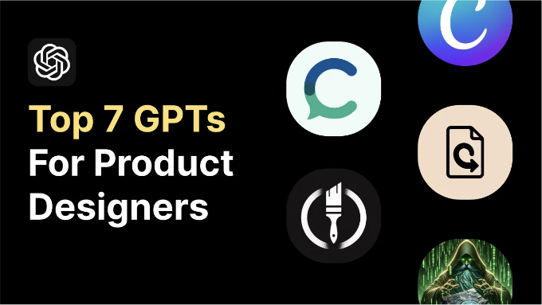

이 GPT들은 https://chat.openai.com/gpts에서 찾을 수 있으며, 사용하려면 ChatGPT Plus 구독이 필요합니다.

이 컨텐츠는 비디오로도 제공됩니다:

## 1. Canva

<!-- ui-log 수평형 -->

<ins class="adsbygoogle"
      style="display:block"
      data-ad-client="ca-pub-4877378276818686"
      data-ad-slot="9743150776"
      data-ad-format="auto"
      data-full-width-responsive="true"></ins>
<component is="script">
(adsbygoogle = window.adsbygoogle || []).push({});
</component>

첫 번째 GPT는 Canva입니다. Canva는 빠르게 배너, 소셜 미디어 게시물 및 포스터를 만들 수 있는 온라인 그래픽 디자인 도구입니다.

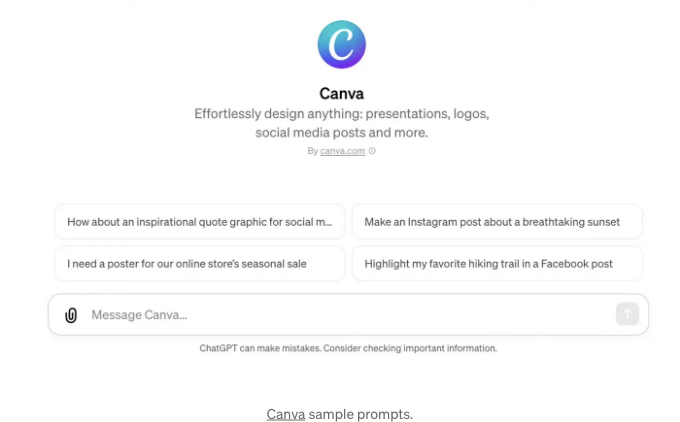

지금은 어린이용 로봇 강아지 장난감에 대한 인스타그램 게시물을 만들어 보려 합니다.

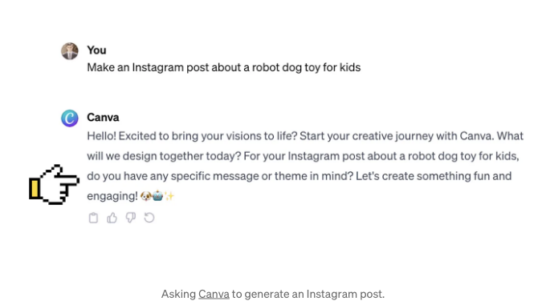

<!-- ui-log 수평형 -->

<ins class="adsbygoogle"
      style="display:block"
      data-ad-client="ca-pub-4877378276818686"
      data-ad-slot="9743150776"
      data-ad-format="auto"
      data-full-width-responsive="true"></ins>
<component is="script">
(adsbygoogle = window.adsbygoogle || []).push({});
</component>

아래는 마크다운 형식으로 "칸바(Canva)"가 우리에게 전달하길 원하는 메시지에 대한 구체적인 세부 정보를 제공해야 한다.

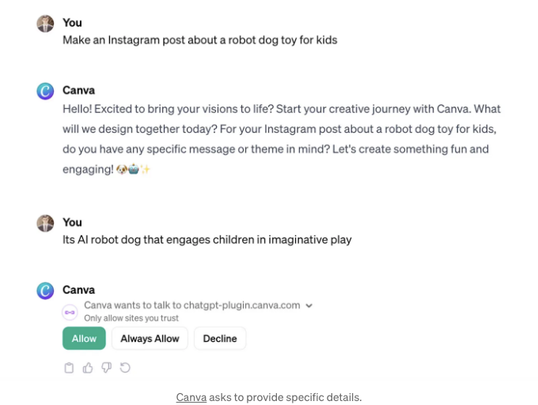

이 정보를 제공하면 GPT가 칸바 서비스에 연결되어 시각화합니다. 원본 프롬프트와 제공한 세부 정보를 기반으로, Canva는 두 가지 디자인을 생성해줍니다.

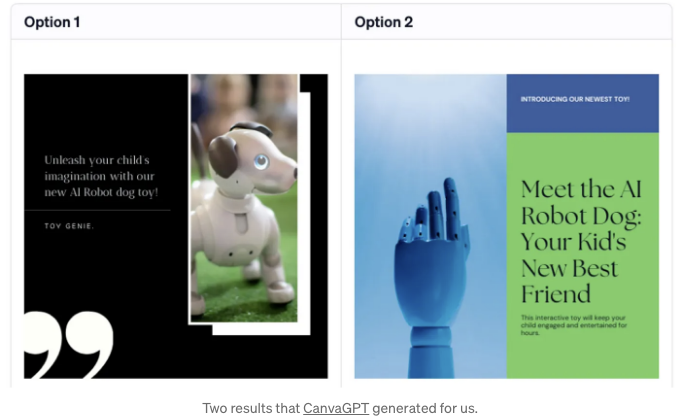

<!-- ui-log 수평형 -->

<ins class="adsbygoogle"
      style="display:block"
      data-ad-client="ca-pub-4877378276818686"
      data-ad-slot="9743150776"
      data-ad-format="auto"
      data-full-width-responsive="true"></ins>
<component is="script">
(adsbygoogle = window.adsbygoogle || []).push({});
</component>

솔직히 말해서, 두 옵션 모두 평균 수준으로 보입니다. 첫 번째 옵션은 로봇 강아지를 보여주기 때문에 우리의 목표와 더 관련이 있어 보입니다. 옵션 1을 클릭하면 이 디자인을 더 자세하게 다듬을 수 있는 Canva 도구로 이동하게 됩니다. 그래서 이 GPT는 독립된 디자인 도구보다는 Canva 서비스로의 단축키 같은 존재인 것 같아요.

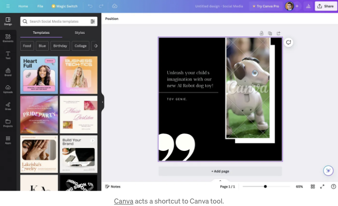

## 2. 디자이너용 GPT

이 GPT는 아름다운 웹사이트를 만들고 호스팅하는 것을 약속합니다. 제시된 프롬프트를 기반으로 이 도구가 간단한 레이아웃의 웹사이트를 생성한다고 상상해 볼 수 있어요.

<!-- ui-log 수평형 -->

<ins class="adsbygoogle"
      style="display:block"
      data-ad-client="ca-pub-4877378276818686"
      data-ad-slot="9743150776"
      data-ad-format="auto"
      data-full-width-responsive="true"></ins>
<component is="script">
(adsbygoogle = window.adsbygoogle || []).push({});
</component>

![./img/7-Custom-GPTs-for-Product-Designers_6.png]

로봇 강아지 장난감을 위한 웹페이지를 생성해 달라고 도구에 요청해 보죠. 도구는 우리의 의도를 명확히 이해하고 페이지가 환영하는 미적인 디자인과 심지어 구독 양식과 같은 기능적 요소도 갖춘다고 말해 주었어요.

![./img/7-Custom-GPTs-for-Product-Designers_7.png]

Canva GPT와 비슷하게, 이 도구도 작업을 완료하기 위해 3rd party 서비스로 요청을 보냅니다. 디자인이 완성되면 생성된 웹페이지 링크를 제공해 줍니다.

<!-- ui-log 수평형 -->

<ins class="adsbygoogle"
      style="display:block"
      data-ad-client="ca-pub-4877378276818686"
      data-ad-slot="9743150776"
      data-ad-format="auto"
      data-full-width-responsive="true"></ins>
<component is="script">
(adsbygoogle = window.adsbygoogle || []).push({});
</component>

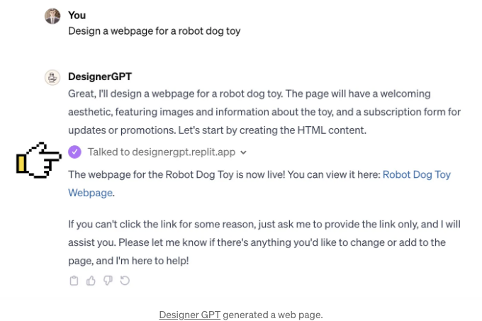

링크를 클릭하면 웹 페이지가 표시됩니다.

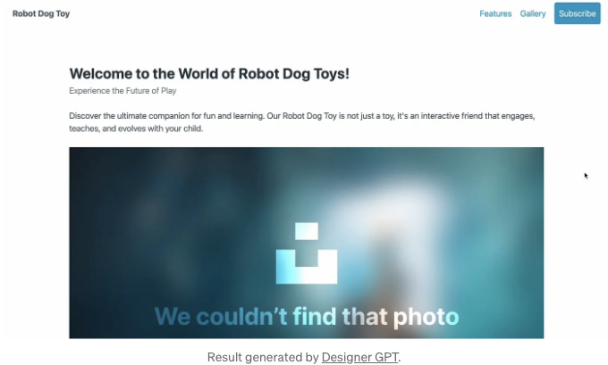

그리고 첫 눈에 띄는 것은 이 웹 디자인이 환영받는 미적 감각을 가지고 있지 않다는 것입니다. 이 페이지는 이미지가 없는 단순한 한 열 레이아웃입니다. 이 디자인의 좋은 점은 실제 텍스트 복사를 강조하고 있다는 것입니다.

<!-- ui-log 수평형 -->

<ins class="adsbygoogle"
      style="display:block"
      data-ad-client="ca-pub-4877378276818686"
      data-ad-slot="9743150776"
      data-ad-format="auto"
      data-full-width-responsive="true"></ins>
<component is="script">
(adsbygoogle = window.adsbygoogle || []).push({});
</component>

GPT의 장점은 디자인을 실시간으로 반복할 수 있다는 것입니다. 도구에게 디자인 문제를 해결하라고 요청할 수 있습니다. 예를 들어, 이 페이지의 사진을 일반 강아지의 사진으로 변경해 달라고 요청했습니다. 도구는 그 작업을 수행하고 업데이트된 버전의 링크를 제공했습니다.

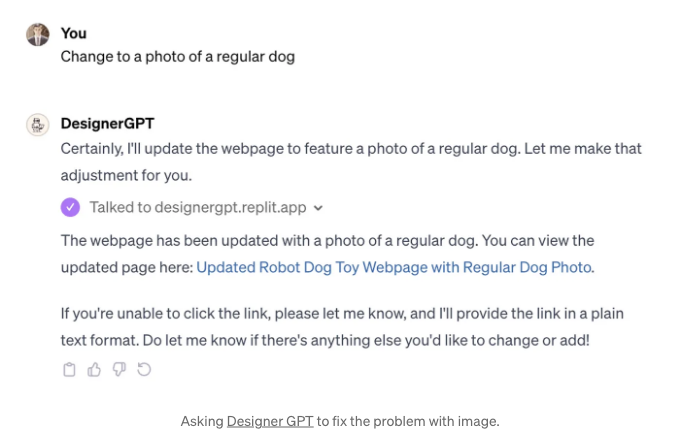

이제 적어도 이 페이지에 멋진 강아지가 있습니다.

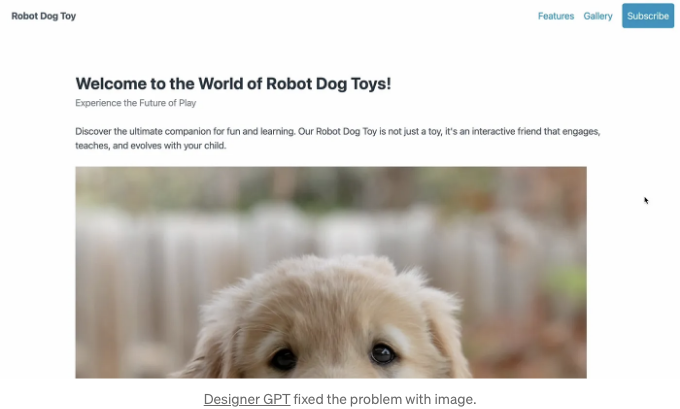

<!-- ui-log 수평형 -->

<ins class="adsbygoogle"
      style="display:block"
      data-ad-client="ca-pub-4877378276818686"
      data-ad-slot="9743150776"
      data-ad-format="auto"
      data-full-width-responsive="true"></ins>
<component is="script">
(adsbygoogle = window.adsbygoogle || []).push({});
</component>

## 3. 로고 생성기

아마도 짐작했겠지만, 이 GPT는 로고를 생성합니다.

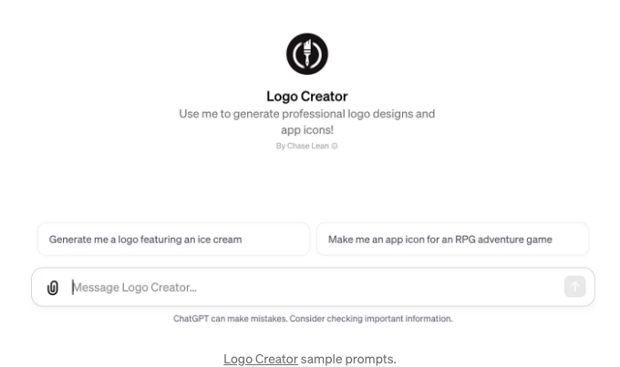

로봇 개를 특징으로 하는 로고를 만들도록 도구에 요청해보죠. 도구는 시각적 스타일, 로고 복잡도 및 색상을 명확히하기 위해 몇 가지 질문을 합니다.

<!-- ui-log 수평형 -->

<ins class="adsbygoogle"
      style="display:block"
      data-ad-client="ca-pub-4877378276818686"
      data-ad-slot="9743150776"
      data-ad-format="auto"
      data-full-width-responsive="true"></ins>
<component is="script">
(adsbygoogle = window.adsbygoogle || []).push({});
</component>

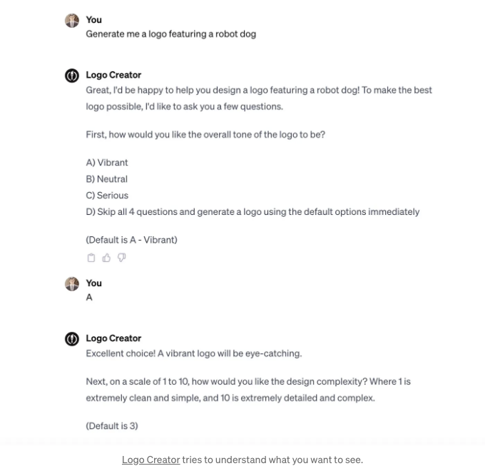

모든 정보를 제공하면 도구가 로고를 생성합니다. 이 GPT는 로고 생성을 위해 Dalle-3 텍스트-이미지 모델을 사용하는 것으로 보입니다. 그러므로 ChatGPT를 사용하여 Dalle-3와 직접 상호작용함으로써 비슷한 결과를 얻을 수 있습니다.

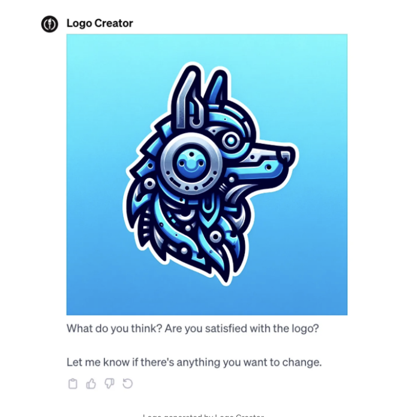

## 4. 그리모어

<!-- ui-log 수평형 -->

<ins class="adsbygoogle"
      style="display:block"
      data-ad-client="ca-pub-4877378276818686"
      data-ad-slot="9743150776"
      data-ad-format="auto"
      data-full-width-responsive="true"></ins>
<component is="script">
(adsbygoogle = window.adsbygoogle || []).push({});
</component>

이 GPT는 코딩에 도움을 줄 수 있어요. 설명에 따르면 한 문장으로 웹사이트를 만들 수 있다고 해요.

지금까지 다뤄본 다른 GPT와는 달리, Grimoire의 샘플 프롬프트는 처음에는 약간 암호적으로 보일 수 있어요. 하지만 상호 작용을 시작하면 이 도구가 이 명령어들의 논리를 설명해 줄 거예요.

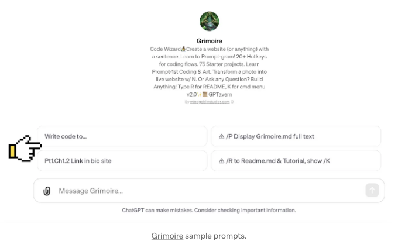

이 도구에게 3가지 특정 질문이 있는 온라인 설문 조사 코드를 작성하라고 요청해보죠. 바로 목소리 톤을 느껴보실 거에요. 마치 코딩을 할 수 있는 간달프와 상호 작용하고 있는 듯한 기분이 들죠.

<!-- ui-log 수평형 -->

<ins class="adsbygoogle"
      style="display:block"
      data-ad-client="ca-pub-4877378276818686"
      data-ad-slot="9743150776"
      data-ad-format="auto"
      data-full-width-responsive="true"></ins>
<component is="script">
(adsbygoogle = window.adsbygoogle || []).push({});
</component>

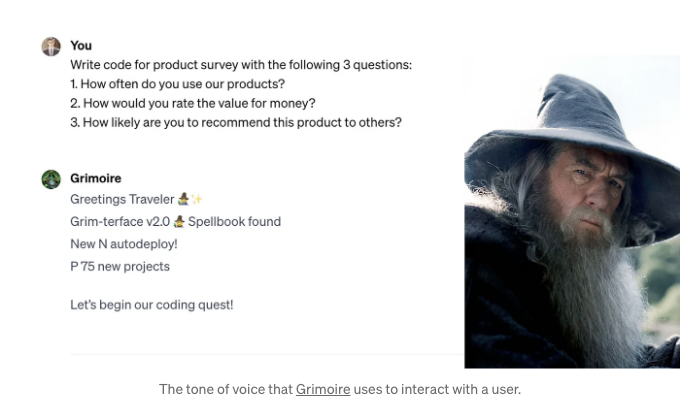

그러나 이 도구는 우리를 위해 코드할 것과 정확히 어떻게 할 것인지에 대한 중요한 정보도 제공합니다. 이 단계에서는 제공된 코드의 기능 논리를 검토할 수 있습니다.

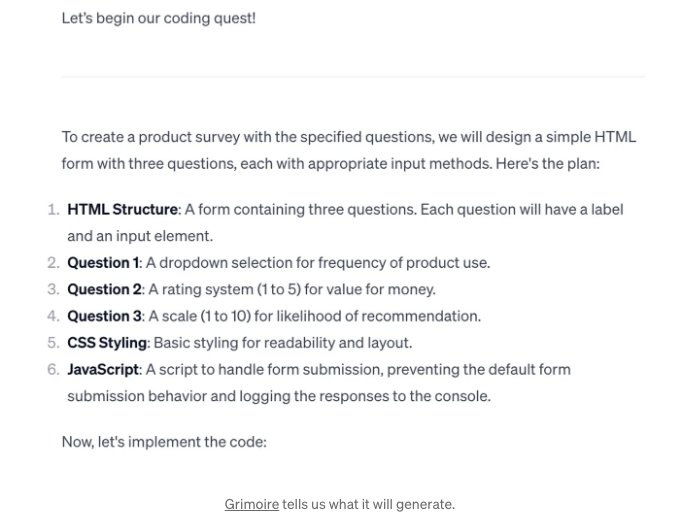

그리모어는 HTML, CSS 및 JavaScript 코드를 제공했습니다. 그리고 코드가 어떻게 작동하는지에 대한 몇 가지 구체적인 노트도 함께 제공되었습니다.

<!-- ui-log 수평형 -->

<ins class="adsbygoogle"
      style="display:block"
      data-ad-client="ca-pub-4877378276818686"
      data-ad-slot="9743150776"
      data-ad-format="auto"
      data-full-width-responsive="true"></ins>
<component is="script">
(adsbygoogle = window.adsbygoogle || []).push({});
</component>

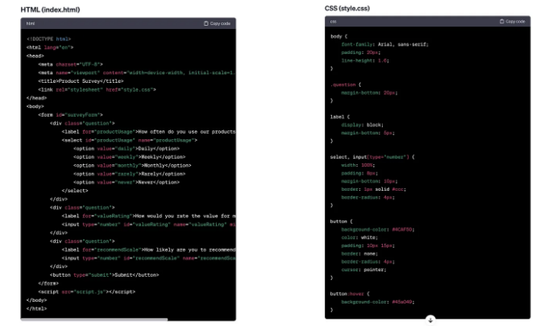

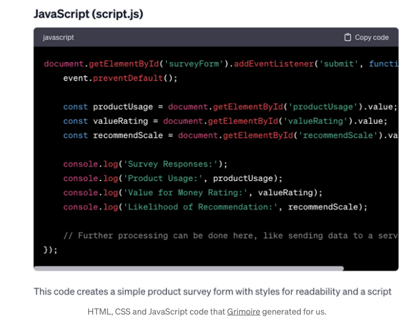

Here is what the survey form will look like.

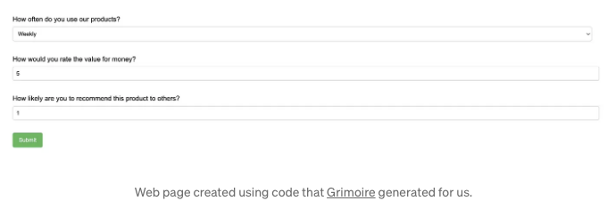

<!-- ui-log 수평형 -->

<ins class="adsbygoogle"
      style="display:block"
      data-ad-client="ca-pub-4877378276818686"
      data-ad-slot="9743150776"
      data-ad-format="auto"
      data-full-width-responsive="true"></ins>
<component is="script">
(adsbygoogle = window.adsbygoogle || []).push({});
</component>

디자인은 정말 아름답지 않지만, 코드는 제대로 작동하고 있어요. 게다가 JavaScript는 사용자 입력을 유효성 검사해줘요. 그래서 잘못된 값을 입력하면 오류 메시지가 표시될 거예요.

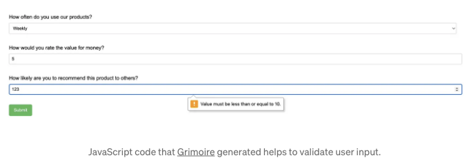

## 5. 합의

이 GPT는 사용자 연구에 도움이 될 거에요. 특정 주제에 대해 합의에 물어보면 관련 연구를 찾아줄 거예요.

<!-- ui-log 수평형 -->

<ins class="adsbygoogle"
      style="display:block"
      data-ad-client="ca-pub-4877378276818686"
      data-ad-slot="9743150776"
      data-ad-format="auto"
      data-full-width-responsive="true"></ins>
<component is="script">
(adsbygoogle = window.adsbygoogle || []).push({});
</component>

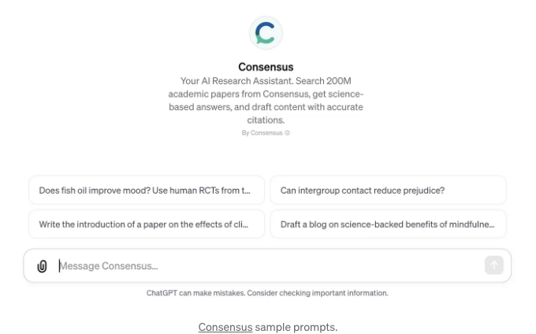

예를 들어, 인간형 로봇에 대한 사람들의 반응에 대해 도구에 요청하면, 도구는 거대한 과학 논문 데이터베이스를 검색하고 이 주제와 관련된 연구 목록을 제공합니다. 이 목록의 각 연구는 원래 논문을 참조하므로 목록을 클릭하여 볼 수 있습니다.

도구는 응답 끝에 연구자들에 대한 좋은 요약을 제공합니다.](./img/7-Custom-GPTs-for-Product-Designers_23.png)

<!-- ui-log 수평형 -->

<ins class="adsbygoogle"
      style="display:block"
      data-ad-client="ca-pub-4877378276818686"
      data-ad-slot="9743150776"
      data-ad-format="auto"
      data-full-width-responsive="true"></ins>
<component is="script">
(adsbygoogle = window.adsbygoogle || []).push({});
</component>

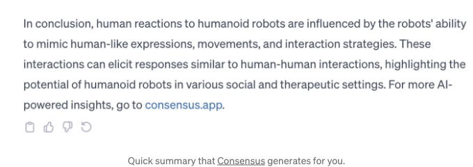

## 6. 협상가

이 GPT는 우리가 좋은 협상가가 되도록 훈련시켜줍니다. 우리가 원하는 것이 무엇이든, 더 나은 급여를 위해 협상을 하든지 조직 내에서 사용성 테스트를 위한 예산을 협상하든지 상관없이 도움을 줍니다. 이 도구를 사용하여 협상 전략을 작성하거나 실제 협상을 연습할 수 있습니다.

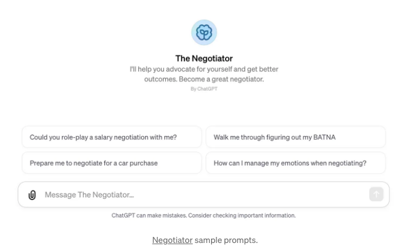

<!-- ui-log 수평형 -->

<ins class="adsbygoogle"
      style="display:block"
      data-ad-client="ca-pub-4877378276818686"
      data-ad-slot="9743150776"
      data-ad-format="auto"
      data-full-width-responsive="true"></ins>
<component is="script">
(adsbygoogle = window.adsbygoogle || []).push({});
</component>

도구를 활용하여 이해방식을 개선하고 이해관계자로부터 제품에 대한 지지를 얻을 수 있는 좋은 전략을 만들어보는 것이 어때요?

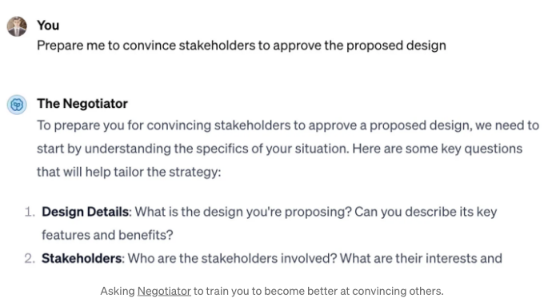

이 도구는 우리의 직관과 이해관계자와의 상호작용 문맥을 이해하려고 노력합니다. 그래서, 우리가 제안하는 디자인 솔루션, 이해관계자, 그리고 그들의 기대에 관한 몇 가지 질문에 답변해야 합니다. 이 모든 정보를 제공하면 도구가 당신을 위한 유용한 전략을 생성해줄 거예요.

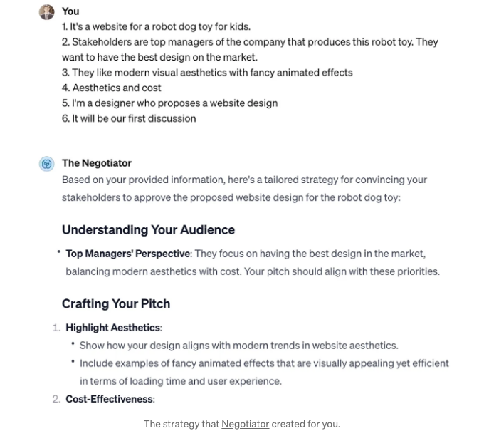

<!-- ui-log 수평형 -->

<ins class="adsbygoogle"
      style="display:block"
      data-ad-client="ca-pub-4877378276818686"
      data-ad-slot="9743150776"
      data-ad-format="auto"
      data-full-width-responsive="true"></ins>
<component is="script">
(adsbygoogle = window.adsbygoogle || []).push({});
</component>

## 7. 무엇이든 변환하기

이 GPT는 다양한 파일 변환기입니다. 여러분은 여기서 파일을 한 형식에서 다른 형식으로 변환할 수 있습니다(예: JPG에서 PNG로). 이 시나리오를 시도해 봅시다.

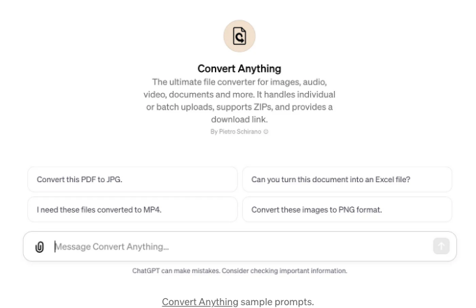

여러분은 JPG 이미지를 업로드하고 도구에게 이를 PDF로 변환해 달라고 요청할 수 있습니다. 도구는 오류 메시지를 표시하지만, 여전히 작업을 완료합니다. 변환된 파일(PDF)에 대한 다운로드 링크를 제공하며, 클릭하면 변환된 PDF 파일이 생성된 것을 볼 수 있습니다.

<!-- ui-log 수평형 -->

<ins class="adsbygoogle"
      style="display:block"
      data-ad-client="ca-pub-4877378276818686"
      data-ad-slot="9743150776"
      data-ad-format="auto"
      data-full-width-responsive="true"></ins>
<component is="script">
(adsbygoogle = window.adsbygoogle || []).push({});
</component>

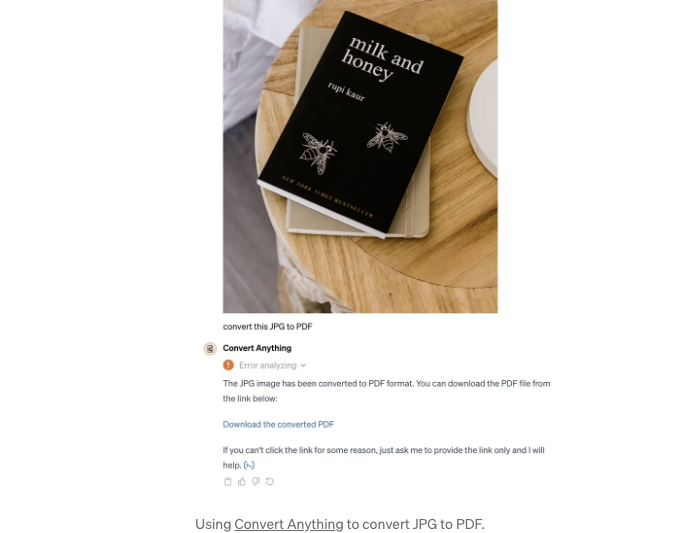

이 GPT 컬렉션을 통해 디자인 작업이 더 효율적으로 진행될 것을 기대합니다. 다른 유용한 GPTs를 댓글로 공유해주세요.

# UX 디자인을 배우고 싶으신가요?

Uxcel을 시도해보세요. Uxcel은 전문 디자이너를 위해 특별히 만들어진 대화식 UX 코스와 스킬 테스트로 디자인 스킬을 배우고 향상시킬 수 있습니다. 이 링크를 통해 가입하면 Pro 연간 구독에서 25% 할인 혜택을 받을 수 있습니다.

<!-- ui-log 수평형 -->

<ins class="adsbygoogle"
      style="display:block"
      data-ad-client="ca-pub-4877378276818686"
      data-ad-slot="9743150776"
      data-ad-format="auto"
      data-full-width-responsive="true"></ins>
<component is="script">
(adsbygoogle = window.adsbygoogle || []).push({});
</component>

이 게시물에는 제휴 링크가 포함되어 있습니다.

```

```
