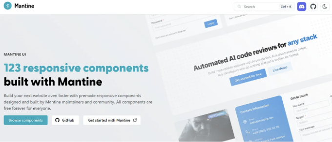

안녕하세요!!

이 빠르게 변화하는 세상에서 특정 작업을 위해 수천 개의 웹사이트가 존재하며 사용자로서는 항상 아름답고 효율적인 사용자 인터페이스를 가진 웹사이트를 선호합니다.

웹 개발자로서 우리의 임무는 최종 사용자나 클라이언트에게 훌륭한 사용자 경험을 제공하는 것입니다. 이를 위해 우리는 CSS 코드를 작성하지만 매번 동일한 유형의 구성 요소에 대해 CSS 코드를 작성하는 것은 무의미합니다. 따라서 도움이 필요한 경우, 웹 구성 요소, 유틸리티 및 클래스를 사용하여 웹사이트를 생성할 수 있는 훌륭한 라이브러리와 프레임워크를 구축해 둔 사람들이 있습니다.

<!-- ui-log 수평형 -->

<ins class="adsbygoogle"
      style="display:block"
      data-ad-client="ca-pub-4877378276818686"
      data-ad-slot="9743150776"
      data-ad-format="auto"
      data-full-width-responsive="true"></ins>
<component is="script">
(adsbygoogle = window.adsbygoogle || []).push({});
</component>

한 번 살펴볼만한 10가지 CSS 프레임워크에 대해 알아보겠습니다:

- 부트스트랩

가장 인기 있는 프레임워크 중 하나로, 제가 처음으로 학습할 때 사용했던 프레임워크입니다. 트위터에서 만들었습니다. 부트스트랩은 간격, 여백, 패딩 등과 같은 유틸리티와 함께 사용할 준비가 된 컴포넌트를 제공합니다. HTML, SCSS 및 JavaScript 파일이 번들로 제공됩니다.

<!-- ui-log 수평형 -->

<ins class="adsbygoogle"
      style="display:block"
      data-ad-client="ca-pub-4877378276818686"
      data-ad-slot="9743150776"
      data-ad-format="auto"
      data-full-width-responsive="true"></ins>
<component is="script">
(adsbygoogle = window.adsbygoogle || []).push({});
</component>

장점:

- CDN을 사용하여 쉽게 통합할 수 있습니다.
- 웹 페이지에 반응성을 제공합니다.
- 커뮤니티 지원이 훌륭합니다.
- 초보자에게 완벽한 선택입니다.

단점:

- 웹사이트들이 서로 꽤 비슷해 보입니다.
- 맞춤화할 수 있는 기능이 그리 많지 않습니다.

<!-- ui-log 수평형 -->

<ins class="adsbygoogle"
      style="display:block"
      data-ad-client="ca-pub-4877378276818686"
      data-ad-slot="9743150776"
      data-ad-format="auto"
      data-full-width-responsive="true"></ins>
<component is="script">
(adsbygoogle = window.adsbygoogle || []).push({});
</component>

2. Material-UI

구글에서 만든 오픈 소스 라이브러리입니다. 개발자들을 위한 훌륭한 미리 제작된 컴포넌트 및 그리드 시스템을 제공합니다. 또한 준비가 된 웹사이트를 위한 미리 제작된 템플릿을 판매합니다.

장점:

<!-- ui-log 수평형 -->

<ins class="adsbygoogle"
      style="display:block"
      data-ad-client="ca-pub-4877378276818686"
      data-ad-slot="9743150776"
      data-ad-format="auto"
      data-full-width-responsive="true"></ins>
<component is="script">
(adsbygoogle = window.adsbygoogle || []).push({});
</component>

- 훌륭한 문서, 구성 요소의 쉬운 통합을 제공합니다
- 특정 요구 사항에 맞게 쉽게 사용자 정의할 수 있습니다
- 구글에서 지원

단점:

- Material UI는 오버헤드를 발생시키는 애니메이션을 사용합니다
- 구성 요소의 애니메이션이 인지적으로 주의를 산란시킵니다

3. Ant-Design

<!-- ui-log 수평형 -->

<ins class="adsbygoogle"
      style="display:block"
      data-ad-client="ca-pub-4877378276818686"
      data-ad-slot="9743150776"
      data-ad-format="auto"
      data-full-width-responsive="true"></ins>
<component is="script">
(adsbygoogle = window.adsbygoogle || []).push({});
</component>

Ant Design은 다양한 컴포넌트를 갖춘 인기 있는 디자인 프레임워크로, 기업 애플리케이션을 염두에 두고 만들어졌습니다.

장점:

- 다양한 사용자 입력 컴포넌트 제공
- 포괄적
- 좋은 폼 처리
- UI가 아름답다

<!-- ui-log 수평형 -->

<ins class="adsbygoogle"
      style="display:block"
      data-ad-client="ca-pub-4877378276818686"
      data-ad-slot="9743150776"
      data-ad-format="auto"
      data-full-width-responsive="true"></ins>
<component is="script">
(adsbygoogle = window.adsbygoogle || []).push({});
</component>

단점:

- 커뮤니티 지원이 적음
- 테스팅이 약간 복잡해짐
- 번들 크기가 큼

4. Tailwind CSS

2024년에 가장 인기 있는 라이브러리 중 하나이자, 제 개인적으로 가장 좋아하는 라이브러리입니다. 다른 프레임워크와 달리, Tailwind CSS는 미리 구축된 컴포넌트를 제공하지 않고 직접 유틸리티 클래스를 사용해 디자인할 수 있습니다.

<!-- ui-log 수평형 -->

<ins class="adsbygoogle"
      style="display:block"
      data-ad-client="ca-pub-4877378276818686"
      data-ad-slot="9743150776"
      data-ad-format="auto"
      data-full-width-responsive="true"></ins>
<component is="script">
(adsbygoogle = window.adsbygoogle || []).push({});
</component>

장점:

- 빠른 개발
- 매우 사용자 정의 가능
- 브레이크 포인트를 사용하여 우수한 반응성 제공
- 코드 재사용성
- Next.js 지원

단점:

<!-- ui-log 수평형 -->

<ins class="adsbygoogle"
      style="display:block"
      data-ad-client="ca-pub-4877378276818686"
      data-ad-slot="9743150776"
      data-ad-format="auto"
      data-full-width-responsive="true"></ins>
<component is="script">
(adsbygoogle = window.adsbygoogle || []).push({});
</component>

- 대형 HTML 파일
- CSS 지식이 필요합니다
- 때로는 자체 CSS를 작성해야 합니다
- 설정 파일 다루기에 대한 지식이 필요한 설치가 필요합니다

5. Semantic UI

Semantic UI는 웹 사이트의 개념적인 구축 블록이 개별 HTML 태그가 아니라 개별 인터페이스 요소라는 신념에 기반을 두고 있습니다. 단어와 클래스를 교환 가능한 개념으로 취급합니다. 클래스는 명사/수식 관계, 단어 순서 등과 같은 천연어의 구문을 사용합니다.

<!-- ui-log 수평형 -->

<ins class="adsbygoogle"
      style="display:block"
      data-ad-client="ca-pub-4877378276818686"
      data-ad-slot="9743150776"
      data-ad-format="auto"
      data-full-width-responsive="true"></ins>
<component is="script">
(adsbygoogle = window.adsbygoogle || []).push({});
</component>

장점:

- 엄격한 코딩 규칙
- 훌륭한 문서화
- 잘 정리된 구성
- 쉬운 통합
- 다양한 UI 구성 요소 및 JavaScript 플러그인

단점:

- 높은 학습 곡선
- 오래된 브라우저와 호환되지 않음
- 클래스 이름에 과도한 의존

<!-- ui-log 수평형 -->

<ins class="adsbygoogle"
      style="display:block"
      data-ad-client="ca-pub-4877378276818686"
      data-ad-slot="9743150776"
      data-ad-format="auto"
      data-full-width-responsive="true"></ins>
<component is="script">
(adsbygoogle = window.adsbygoogle || []).push({});
</component>

6. Bulma

Flexbox를 기반으로 하는 무료 오픈 소스 CSS 프레임워크로 Sass로 제작되었습니다. 완전히 반응형이며 완전히 모듈화되어 있습니다.

장점:

<!-- ui-log 수평형 -->

<ins class="adsbygoogle"
      style="display:block"
      data-ad-client="ca-pub-4877378276818686"
      data-ad-slot="9743150776"
      data-ad-format="auto"
      data-full-width-responsive="true"></ins>
<component is="script">
(adsbygoogle = window.adsbygoogle || []).push({});
</component>

- 모바일 우선 개념
- 가벼운 무게
- 우아한 UI
- 가독성 있는 클래스

단점:

- 소규모 커뮤니티 지원
- IE와 같은 오래된 브라우저에서 CSS가 느림
- JavaScript 통합 없음
- 큰 CSS 파일이 생성됨

7. Chakra UI

<!-- ui-log 수평형 -->

<ins class="adsbygoogle"
      style="display:block"
      data-ad-client="ca-pub-4877378276818686"
      data-ad-slot="9743150776"
      data-ad-format="auto"
      data-full-width-responsive="true"></ins>
<component is="script">
(adsbygoogle = window.adsbygoogle || []).push({});
</component>

Chakra UI는 React 애플리케이션을 구축하는 데 필요한 구성 요소를 제공하는 간단하고 모듈식이며 접근성이 있는 컴포넌트 라이브러리입니다.

장점:

- 컴포넌트에 대한 웹 접근성을 준수합니다.
- 쉽게 사용자 정의할 수 있습니다.
- 다크 모드 지원
- 반응형을 쉽게 추가할 수 있습니다.

<!-- ui-log 수평형 -->

<ins class="adsbygoogle"
      style="display:block"
      data-ad-client="ca-pub-4877378276818686"
      data-ad-slot="9743150776"
      data-ad-format="auto"
      data-full-width-responsive="true"></ins>
<component is="script">
(adsbygoogle = window.adsbygoogle || []).push({});
</component>

단점:

- Chakra UI의 일부 구성 요소는 사용자 정의 테마를 허용하지 않습니다.

8. Mantine UI

React 웹 앱을 위한 100개 이상의 사용 가능한 컴포넌트와 50가지 후크를 제공하는 TypeScript 기반 프레임워크입니다.

<!-- ui-log 수평형 -->

<ins class="adsbygoogle"
      style="display:block"
      data-ad-client="ca-pub-4877378276818686"
      data-ad-slot="9743150776"
      data-ad-format="auto"
      data-full-width-responsive="true"></ins>
<component is="script">
(adsbygoogle = window.adsbygoogle || []).push({});
</component>

  
   
장점:
- TypeScript 기반
- Next.js와 같은 현대적인 프레임워크 지원
- 커스터마이즈 가능
- 접근성 용이

단점:

<!-- ui-log 수평형 -->

<ins class="adsbygoogle"
      style="display:block"
      data-ad-client="ca-pub-4877378276818686"
      data-ad-slot="9743150776"
      data-ad-format="auto"
      data-full-width-responsive="true"></ins>
<component is="script">
(adsbygoogle = window.adsbygoogle || []).push({});
</component>

- 커뮤니티 지원 부족
- 맞춤화를 위한 학습 곡선
- 의존성 관리 복잡성

개인 추천 사항 :

- 웹 디자인 초보자라면 부트스트랩 사용
- 순수 CSS를 잘 다룬다면 Tailwind 사용
- UI 인터페이스가 우수하고 복사 및 붙여넣기 가능한 컴포넌트가 필요하다면 Chakra UI 사용
- Mantine UI 사용

읽어 주셔서 감사합니다!!

<!-- ui-log 수평형 -->

<ins class="adsbygoogle"
      style="display:block"
      data-ad-client="ca-pub-4877378276818686"
      data-ad-slot="9743150776"
      data-ad-format="auto"
      data-full-width-responsive="true"></ins>
<component is="script">
(adsbygoogle = window.adsbygoogle || []).push({});
</component>

행복한 코딩하세요!!