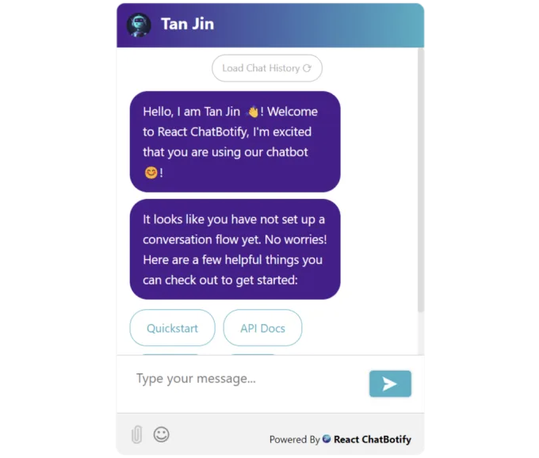

# 소개

안녕하세요! 이 미디엄에서 제가 처음으로 쓰는 글에 여러분을 초대하고 싶습니다. 짧지만 특별한 여정으로 함께 떠나볼까요? 함께 나의 첫 번째 리액트 라이브러리인 React ChatBotify의 시작부터 들어가보겠습니다. 이 라이브러리는 저의 열정적인 개발자로서 활기찬 리액트 커뮤니티를 위한 강력하고 적응 가능한 솔루션을 만들고 싶다는 열망에서 나왔습니다. 이 창조와 탐험에 매혹적인 이야기로 떠나볼까요?

# 영감

<!-- ui-log 수평형 -->

<ins class="adsbygoogle"
      style="display:block"
      data-ad-client="ca-pub-4877378276818686"
      data-ad-slot="9743150776"
      data-ad-format="auto"
      data-full-width-responsive="true"></ins>
<component is="script">
(adsbygoogle = window.adsbygoogle || []).push({});
</component>

약 1~2개월 전, 나는 개인 포트폴리오 웹사이트를 업데이트하기 위한 모험에 나섰어. 웹사이트를 더 매력적으로 만들기 위해 새로운 기능을 시도하다가, 간단하지만 상호작용이 가능한 챗봇을 웹사이트에 통합하는 아이디어가 떠올랐어. 적합한 해결책을 찾기 위해 열정을 가지고 React 생태계에서 이미 존재하는 챗봇 라이브러리들을 탐험하기 시작했지.

# 완벽한 맞춤을 찾아서

내가 탐험하는 동안, 최신 버전이었고 내 목적에 부합하는 라이브러리가 거의 없다는 것을 깨달은 거야. 이 옵션 중 일부는 필수적인 업데이트가 부족한 반면, 또 다른 것들은 내가 찾는 정확한 수준의 제어를 제공하지 못했어. 이 과정에서, 나는 반대로 비슷한 도전에 직면한 개발자들을 포함하여 나 자신을 위한 해결책을 간절히 바라게 되었어.

# 아이디어 불붙일 때

<!-- ui-log 수평형 -->

<ins class="adsbygoogle"
      style="display:block"
      data-ad-client="ca-pub-4877378276818686"
      data-ad-slot="9743150776"
      data-ad-format="auto"
      data-full-width-responsive="true"></ins>
<component is="script">
(adsbygoogle = window.adsbygoogle || []).push({});
</component>

열정적으로 가능한 옵션을 찾아보던 중 인상적인 챗봇 솔루션인 Tidio를 만났어요. 그러나 그 뛰어난 점에도 불구하고, Tidio의 일반적인 특성 때문에 제 요구 사항을 충족시키는 능력이 제한되었죠. 이 찜찜한 느낌이 더 특별한 방법을 추구할 것을 저에게 억울하게 했어요. 저는 개발자가 챗봇에 대해 꼼꼼한 제어를 할 수 있는 참신한 라이브러리를 상상했고, 동시에 단숨에 아름답게 유지할 수 있는 라이브러리도 필요했어요!

# 리액트 챗봇 만들기의 탄생

이 비전에서 영감을 받아 제가 겪은 공백을 채울 솔루션을 만들겠다고 다짐하여 제 아이디어를 현실로 구현하기 위한 미션에 착수했어요. 그리고 이런식으로 리액트 챗봇이 탄생했어요! 이 라이브러리는 강력하면서도 사용하기 쉽고, 전례없는 맞춤 설정과 유연성을 제공하는 확고한 열망에서 출발해 탄생했어요.

커뮤니티로부터 영감을 받고 신중한 고려 끝에, 챗봇에 대한 제 비전은 아래의 기능과 이점과 함께 구체화되기 시작했어요:

<!-- ui-log 수평형 -->

<ins class="adsbygoogle"
      style="display:block"
      data-ad-client="ca-pub-4877378276818686"
      data-ad-slot="9743150776"
      data-ad-format="auto"
      data-full-width-responsive="true"></ins>
<component is="script">
(adsbygoogle = window.adsbygoogle || []).push({});
</component>

- 동적 속성: 사용자 입력에 따라 메시지를 동적으로 생성하고 여러 대화 경로를 정의하여 상호작용 가능한 대화를 만듭니다.
- 컴포넌트의 사용자 지정 렌더링: 자체 사용자 정의 컴포넌트를 챗봇 인터페이스에 원활하게 통합하여 응용 프로그램의 고유한 디자인과 기능을 강조합니다.
- 시간 제한 및 자동 전환: 챗봇 경로 간의 시간 제한을 설정하고 자동 전환을 설정하여 원활한 사용자 경험을 제공합니다.
- 음성 입력 및 오디오 출력: 음성 입력을 활성화하여 사용자가 음성을 통해 챗봇과 상호 작용할 수 있도록하고, 성명 대답이나 프롬프트를 제공하기 위한 오디오 출력 기능을 활용합니다.
- 대화 알림: 실시간 채팅 알림을 통해 사용자를 계속해서 업데이트나 새 메시지를 놓치지 않도록 유지합니다.
- 확인란 및 옵션 지원: 챗봇 인터페이스 내에서 확인란과 옵션을 활용하여 사용자가 선택할 수 있는 목록에서 선택하고 쉽게 선택할 수 있도록합니다.
- 이모티콘 선택기: 이모티콘을 메시지에 통합하여 챗봇의 표현과 사용자와의 참여를 향상시켜 개성과 감정을 더합니다.
- 파일 첨부: 대화 중에 파일 첨부를 원활하게 처리하여 사용자가 대화 중에 문서, 이미지 또는 기타 관련 파일을 공유하고 받을 수 있도록합니다.
- 모바일 친화적 인터페이스: 모바일 친화적 챗봇 인터페이스로 다양한 기기에서 원활한 사용자 경험을 제공합니다.

# 보상

노력과 열정적인 노력으로 React ChatBotify는 나의 노고의 열매가 되었습니다. 개발자들에게 유용한 보상이 되기를 희망합니다.

<!-- ui-log 수평형 -->

<ins class="adsbygoogle"
      style="display:block"
      data-ad-client="ca-pub-4877378276818686"
      data-ad-slot="9743150776"
      data-ad-format="auto"
      data-full-width-responsive="true"></ins>
<component is="script">
(adsbygoogle = window.adsbygoogle || []).push({});
</component>

태아부터 실현까지의 여정은 성장, 학습 및 탐험으로 가득 찬 흥미로운 경험이었습니다. 이 라이브러리를 개발자 커뮤니티에 소개하면서, 솔직한 소망은 이 라이브러리가 매혹적이고 매력적인 챗봇 경험을 만들기 위해 노력하는 개발자들의 믿을 수 있는 동반자로 봉사하기를 원하는 것입니다.

지금까지 읽어 주셔서 감사합니다. 더 궁금하시거나 자세한 정보를 찾으시려면 프로젝트 저장소를 완전히 공개하여 제가 항상 디스코드에서 대화할 준비가 되어 있습니다! 만약 이 라이브러리를 사용하여 애플리케이션을 개발했다면 더욱 좋겠지만 — 여러분의 작품을 저와 공유해 주세요!

마지막으로, 좀 더 개인적인 측면에서, 이 여정에 더욱 깊이 들어가는 것과 추가적인 탐험에 발을 디뎌나가게 되어 정말 흥분되고 있습니다! 흥미진진한 모험을 같이 떠나 새로운 가능성과 지평을 함께 열어보자고요. 여정은 지금 막 시작됐을 뿐입니다!
