현대의 웹사이트, 특히 웹 앱은 네이티브 iOS 또는 안드로이드 앱과 유사한 정교한 레이아웃을 가지고 있습니다. 하지만 웹 앱은 모바일, 데스크탑 또는 태블릿에서 보일 수 있는 화면에 적응해야 하는 추가적인 도전 과제를 안겨받습니다. HTML과 CSS의 기본적인 선형 흐름을 넘어 반응형 레이아웃을 구현하는 것은 어려울 수 있습니다. 여기서 플렉스박스와 미디어 쿼리를 활용하면 도움이 될 것이며, 이 안내서는 이러한 레이아웃을 구축하는 방법을 설명합니다.

이 튜토리얼에서 사용하는 사례 연구는 에어비앤비입니다. 인기 있는 웹사이트로 복잡한 레이아웃이며, 모바일 및 데스크톱 뷰의 차이가 상당합니다. 처음에는 재현하기 어려울 수 있지만, 플렉스박스를 사용하면 이를 달성할 수 있습니다 (플렉스박스가 어떻게 작동하는지에 대한 빠른 간단한 상기 자료는 여기 있습니다). 따라서 첫 번째 단계는 개별 플렉스박스 컨테이너를 식별하는 것이며, 이 컨테이너는 자식 요소들로 구성됩니다:

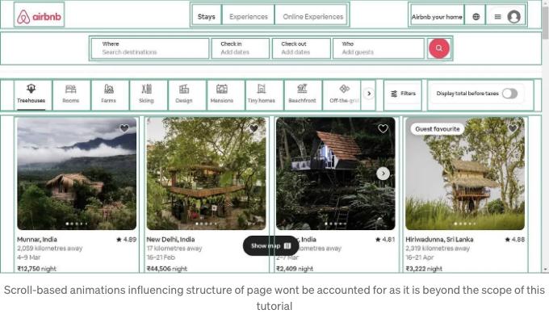

플렉스박스, 미디어 쿼리 및 기타 레이아웃 관련 CSS 스타일링은 단일 유틸리티 CSS 파일인 flexbox.css로 처리할 수 있습니다. 이 튜토리얼에서는 이러한 유틸리티 클래스의 예시를 사용할 것입니다:

<!-- ui-log 수평형 -->

<ins class="adsbygoogle"
      style="display:block"
      data-ad-client="ca-pub-4877378276818686"
      data-ad-slot="9743150776"
      data-ad-format="auto"
      data-full-width-responsive="true"></ins>
<component is="script">
(adsbygoogle = window.adsbygoogle || []).push({});
</component>

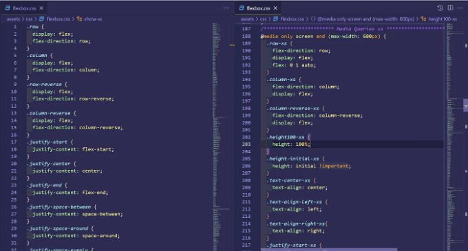

튜토리얼에서는 컨테이너를 강조하는 간단한 CSS 클래스를 사용할 것이며, 패딩 및 플렉스박스 컨테이너 사이의 일부 마진을 제외하고는 가능한한 직접적인 CSS 작성을 피할 것입니다.

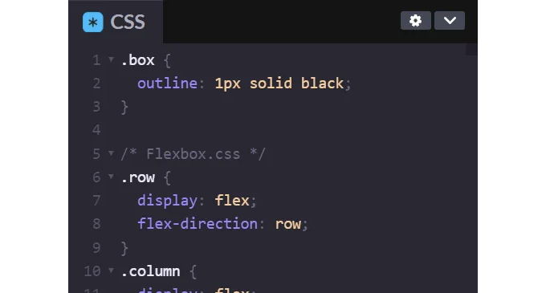

이제 페이지를 개별 플렉스박스 컨테이너로 분할하여 첫 번째 처리할 컨테이너는 헤더입니다. 헤더는 각 끝을 향하도록 간격을 두고 있는 행으로 구성되어 있으며 일부 패딩이 있습니다.

<!-- ui-log 수평형 -->

<ins class="adsbygoogle"
      style="display:block"
      data-ad-client="ca-pub-4877378276818686"
      data-ad-slot="9743150776"
      data-ad-format="auto"
      data-full-width-responsive="true"></ins>
<component is="script">
(adsbygoogle = window.adsbygoogle || []).push({});
</component>

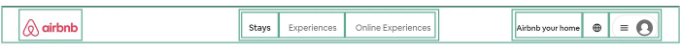

가운데와 오른쪽 자식 요소는 각각 플렉스박스 행 컨테이너이지만, 간격은 크지 않습니다. 헤더 레이아웃 구조가 명확해졌으니, 아래는 그것이 개발될 수 있는 방법입니다:

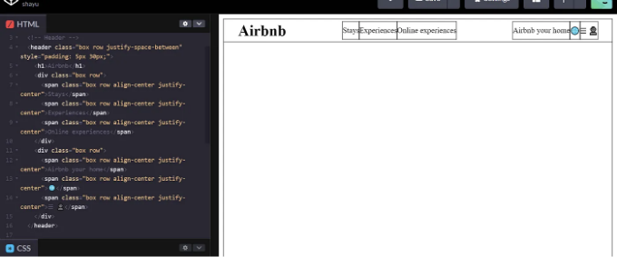

다음은 검색 패널입니다.

<!-- ui-log 수평형 -->

<ins class="adsbygoogle"
      style="display:block"
      data-ad-client="ca-pub-4877378276818686"
      data-ad-slot="9743150776"
      data-ad-format="auto"
      data-full-width-responsive="true"></ins>
<component is="script">
(adsbygoogle = window.adsbygoogle || []).push({});
</component>

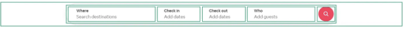

부모 요소는 중앙에 하나의 자식이 있으며, 해당 자식도 자식 요소의 너비가 가변적인 플렉스 컨테이너입니다. 여기서 flex-basis를 사용하여 각 요소가 차지하는 크기를 쉽게 결정할 수 있습니다. 이에 관련하여 flexbox.css에 유틸리티 클래스가 제공되어 있습니다.

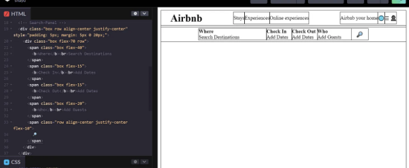

이후 옵션을 가지고 있는 중간 컨테이너가 있습니다. 여기서 집 유형을 선택할 수 있습니다.

<!-- ui-log 수평형 -->

<ins class="adsbygoogle"
      style="display:block"
      data-ad-client="ca-pub-4877378276818686"
      data-ad-slot="9743150776"
      data-ad-format="auto"
      data-full-width-responsive="true"></ins>
<component is="script">
(adsbygoogle = window.adsbygoogle || []).push({});
</component>

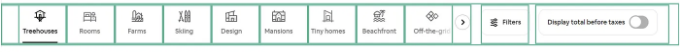

이것은 첫 번째 요소가 대부분의 공간을 차지하면서 끝에 공간을 두고 배치된 세 개의 항목이 있는 행입니다. 특히 스크롤 기능이 있는 것으로 보입니다. scrollX라는 flexbox.css 클래스를 사용하여 이 기능을 활성화할 것입니다.

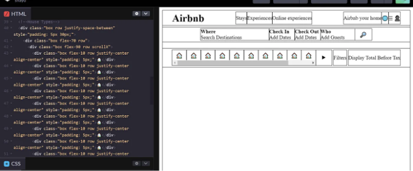

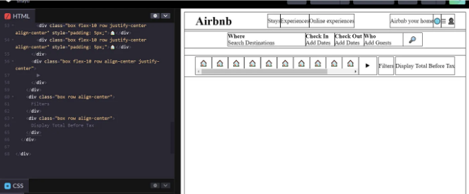

<!-- ui-log 수평형 -->

<ins class="adsbygoogle"
      style="display:block"
      data-ad-client="ca-pub-4877378276818686"
      data-ad-slot="9743150776"
      data-ad-format="auto"
      data-full-width-responsive="true"></ins>
<component is="script">
(adsbygoogle = window.adsbygoogle || []).push({});
</component>

지금 stay-examples 행이 있습니다.

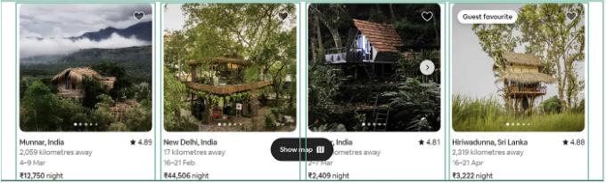

이는 여백이 있는 네 개의 항목으로 구성된 행입니다. 아마도 여러 행이 있을 것입니다. 따라서 flex-wrap을 사용하는 것이 적합합니다.

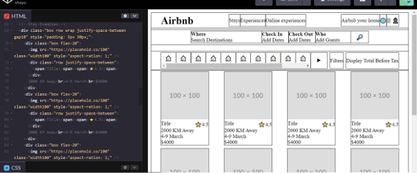

<!-- ui-log 수평형 -->

<ins class="adsbygoogle"
      style="display:block"
      data-ad-client="ca-pub-4877378276818686"
      data-ad-slot="9743150776"
      data-ad-format="auto"
      data-full-width-responsive="true"></ins>
<component is="script">
(adsbygoogle = window.adsbygoogle || []).push({});
</component>

모바일 뷰는 이 요소들의 다른 버전을 가지고 있고, 몇 가지 추가 요소와 일부 누락된 요소도 있습니다. Flexbox.css에는 사용자가 앱을 보는 디바이스(그리고 이에 적용되는 미디어 쿼리)에 따라 기능이 변경되는 몇 가지 클래스가 있어서 화면에 쉽게 적응하는 동적 레이아웃을 만드는 데 도움이 됩니다. 이러한 클래스는 일반적으로 적용되는 화면 크기에 따라 "xs"나 "sm"와 같은 접미사가 붙습니다. 따라서 "hide-xs"와 "show-xs"와 같은 클래스는 요소를 숨기거나 표시하는 데 사용되며, 다른 일부 클래스는 flex-basis를 변경합니다.

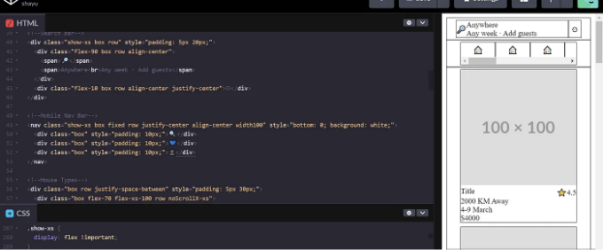

이렇게 하여 Airbnb와 유사한 반응형 레이아웃을 성공적으로 재생성했습니다. 코드펜을 통해 검토하고 실험할 수 있는 링크를 제공하겠습니다. 다음 GIF를 확인하여 레이아웃의 반응성을 살펴보세요.

<!-- ui-log 수평형 -->

<ins class="adsbygoogle"
      style="display:block"
      data-ad-client="ca-pub-4877378276818686"
      data-ad-slot="9743150776"
      data-ad-format="auto"
      data-full-width-responsive="true"></ins>
<component is="script">
(adsbygoogle = window.adsbygoogle || []).push({});
</component>

문제가 있으신가요? Hungrypixel Technologies 에 문의하세요.
