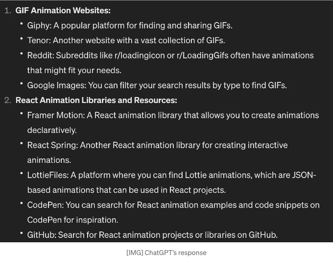
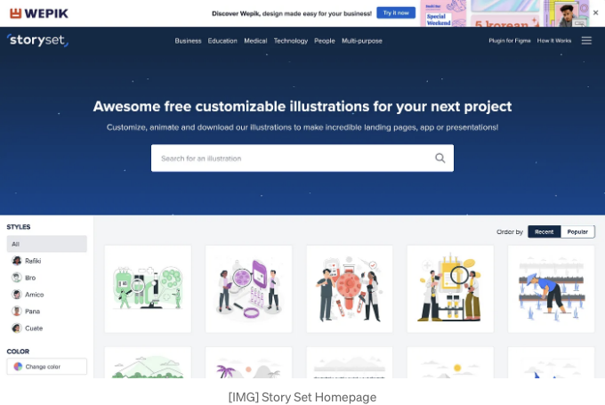
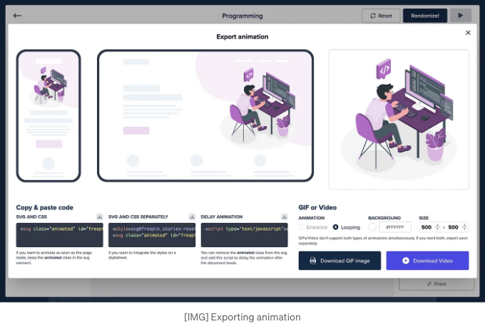

개인 웹사이트를 화려하게 꾸미는 미션을 수행 중에 애니메이션이 가장 적합한 방법임을 깨달았어요.

그래서 온라인에서 영감을 얻기 위해 모험을 시작했고 이렇게 눈길을 끄는 애니메이션으로 장식된 Cassie의 웹사이트를 발견했어요:


<!-- ui-log 수평형 -->

<ins class="adsbygoogle"
      style="display:block"
      data-ad-client="ca-pub-4877378276818686"
      data-ad-slot="9743150776"
      data-ad-format="auto"
      data-full-width-responsive="true"></ins>
<component is="script">
(adsbygoogle = window.adsbygoogle || []).push({});
</component>

애니메이션이 멋져 보이고 가장 좋은 점은 Cassie가 SVG 및 애니메이션에 대한 자습서를 제공한다는 것입니다. 애니메이션된 각 요소에 완전한 제어를 약속하며 터미널 창 커서를 포함합니다. 그러나 이에 대해 깊이 파고들면 학교 학기 중에는 헌신할 수 없는 한 주 이상을 소비해야 할 수도 있습니다.

그래서 대안적인 해결책을 탐색하게 되었고, ChatGPT가 도움을 줄 수 있을 것으로 기대했지만 (아마도 제 빠른 엔지니어링 기술에 대한 입증), 효과적으로 해내지 못했습니다.



하지만 LottieFiles를 발견했습니다.

<!-- ui-log 수평형 -->

<ins class="adsbygoogle"
      style="display:block"
      data-ad-client="ca-pub-4877378276818686"
      data-ad-slot="9743150776"
      data-ad-format="auto"
      data-full-width-responsive="true"></ins>
<component is="script">
(adsbygoogle = window.adsbygoogle || []).push({});
</component>

그들은 광고하고 있어요:

이겁니다! 정확히 원하던 것이었어요: 수백 가지 무료 애니메이션. 저는 프로젝트 페이지에 어떤 것을 추가하고 싶어서 코딩 애니메이션을 찾았어요.


모든 게 좋았어요. 그러나 이러한 애니메이션을 내 React 앱에 통합하는 것은 어려움을 가지고 있었어요. 애니메이션을 GIF로 내보내거나 프로젝트에 Lottie 패키지를 추가해야 했는데, 어느 것도 매력적으로 보이지 않았어요.

<!-- ui-log 수평형 -->

<ins class="adsbygoogle"
      style="display:block"
      data-ad-client="ca-pub-4877378276818686"
      data-ad-slot="9743150776"
      data-ad-format="auto"
      data-full-width-responsive="true"></ins>
<component is="script">
(adsbygoogle = window.adsbygoogle || []).push({});
</component>

하지만 많은 애니메이션들이 익숙하게 느껴졌다는 것을 깨달았어요. 특히, 많은 디자인들은 https://storyset.com/ 에서 온 것이었어요. 저는 이 사이트를 이전 프로젝트에서 사용했었는데, 아주 좋아했죠.



그들은 모바일 앱, 웹사이트, 인포그래픽 등에 사용할 수 있는 아름다운 일러스트레이션들을 갖고 있어요.

그리고 이 일러스트레이션에 애니메이션을 추가할 수 있다는 사실이 밝혀졌어요.

<!-- ui-log 수평형 -->

<ins class="adsbygoogle"
      style="display:block"
      data-ad-client="ca-pub-4877378276818686"
      data-ad-slot="9743150776"
      data-ad-format="auto"
      data-full-width-responsive="true"></ins>
<component is="script">
(adsbygoogle = window.adsbygoogle || []).push({});
</component>


내가 좋아하는 하나를 발견했고 간단한 부유 애니메이션을 추가했어요.

내 React 앱에서는 SVG 및 CSS 코드를 복사하여 붙여넣는 것이 가장 간단한 방법으로 보였어요.



<!-- ui-log 수평형 -->

<ins class="adsbygoogle"
      style="display:block"
      data-ad-client="ca-pub-4877378276818686"
      data-ad-slot="9743150776"
      data-ad-format="auto"
      data-full-width-responsive="true"></ins>
<component is="script">
(adsbygoogle = window.adsbygoogle || []).push({});
</component>

아! 애니메이션을 사용하기 위해 너무 기대돼서 SVG 코드를 다운로드하고 내 코드에 가져왔어:

```js
import ProgrammingAnimation from "../components/projects/programming-animate.svg";

<div className="projects-left-side">
  <ProgrammingAnimation />
</div>;
```

하지만, 간단하지 않았어. 이런 끔찍한 오류 메시지를 받았어:

```js
SyntaxError: unknown file: Namespace tags are not supported by default. React's JSX doesn't support namespace tags. You can set `throwIfNamespace: faslse` to bypass this warning.
   5 |   ...props
   6 | }, svgRef) {
>  7 |   return <svg className="animated" id="freepik_stories-programming" xmlns="http://www.w3.org/2000/svg" viewBox="0 0 500 500" xmlnsXlink="http://www.w3.org/1999/xlink" xmlns:svgjs="http://svgjs.com/svgjs" ref={svgRef}
     |                                                                                                                                                                        ^^^^^^^^^^^
```

<!-- ui-log 수평형 -->

<ins class="adsbygoogle"
      style="display:block"
      data-ad-client="ca-pub-4877378276818686"
      data-ad-slot="9743150776"
      data-ad-format="auto"
      data-full-width-responsive="true"></ins>
<component is="script">
(adsbygoogle = window.adsbygoogle || []).push({});
</component>

별 건 아니지만, SVG 파일을 불러와보니 React와 호환되지 않았어요. 어떻게든 JSX 컴포넌트로 변환해야 했죠. 좀 찾아보니 이 웹사이트를 발견했어요: https://svg2jsx.com/

SVG 코드를 그 웹사이트에 붙여넣었더니, 처음에는 내 SVG 파일을 변환하지 않겠다고 거부했어요. 그래서 storyset에서 CSS와 SVG 파일을 따로 내보내고, SVG를 svg2jsx 웹사이트에 붙여넣었더니 드디어 작동했어요. SVG 파일이 JSX 컴포넌트로 변환되었죠:

```js
import React from "react";
import "./styles/programming-styles.css";

function Programmer() {
  return (
    <svg xmlns="http://www.w3.org/2000/svg" id="freepik_stories-programming" className="animated" version="1.1" viewBox="0 0 500 500">
      ...
    </svg>
  );
}

export default Programmer;
```

하지만 또 다른 문제가 있었어요. CSS 파일은 이렇게 생겼거든:

<!-- ui-log 수평형 -->

<ins class="adsbygoogle"
      style="display:block"
      data-ad-client="ca-pub-4877378276818686"
      data-ad-slot="9743150776"
      data-ad-format="auto"
      data-full-width-responsive="true"></ins>
<component is="script">
(adsbygoogle = window.adsbygoogle || []).push({});
</component>

```js
svg#freepik_stories-programming:not(.animated) .animable {
 opacity: 0;
}
svg#freepik_stories-programming.animated #freepik--Character--inject-2 {
 animation: 1.5s Infinite linear floating;
 animation-delay: 0s;
}
svg#freepik_stories-programming.animated #freepik--speech-bubble--inject-2 {
 animation: 1.5s Infinite linear floating;
 animation-delay: 0s;
}
@keyframes floating {
 0% {
  opacity: 1;
  transform: translateY(0px);
 }
 50% {
  transform: translateY(-10px);
 }
 100% {
  opacity: 1;
  transform: translateY(0px);
 }
}
.animator-hidden {
 display: none;
}
```

그런데 CSS를 사용하는 도중 새로운 문제가 발생했어요. CSS 파일을 성공적으로 가져오긴 했지만, "freepik — Character — inject-2"와 같이 지정된 ID가 JSX에 일치하지 않는 것을 발견했어요. svg2jsx.com으로 돌아가서, 기본적으로 ID가 비활성화되어 있었기 때문에 처음에 놓친 기능인 ID를 켜고 끄는 옵션을 발견했어요.

마침내 최종 결과물:


```

<!-- ui-log 수평형 -->

<ins class="adsbygoogle"
      style="display:block"
      data-ad-client="ca-pub-4877378276818686"
      data-ad-slot="9743150776"
      data-ad-format="auto"
      data-full-width-responsive="true"></ins>
<component is="script">
(adsbygoogle = window.adsbygoogle || []).push({});
</component>

감사합니다. 앞으로 더 많은 튜토리얼 스타일의 글을 작성할 계획이에요. 보시는 내용이 마음에 드시거나 저에 대해 더 알아보고 싶으시면 제 웹사이트를 방문해주세요: [https://aldrin-ong.vercel.app/](https://aldrin-ong.vercel.app/)
