가끔은 무엇을 해서는 안 되는지에 대한 조언이 가장 현실적인 것으로 나타날 때가 있습니다. 왜냐하면 간단한 가이드와 추천은 잘못된 결정을 내릴 여지를 항상 남겨 두기 때문이죠. 그래서 우리는 당신과 함께 UX를 망칠 수 있는 좋지 않은 경험의 몇 가지 예시를 공유하기로 결정했습니다.

# 사용자 경험을 망쳐버릴 수 있는 20가지 좋지 않은 예시

그러니까 기다리게 하지 말자고요: 여기 그들이 있습니다 — 심지어 경험이 풍부한 웹마스터들도 종종 저지르는 UX 작성의 가장 어리석은 실수들을 소개합니다.

## #1 — 오디오/비디오 자동 재생

<!-- ui-log 수평형 -->

<ins class="adsbygoogle"
      style="display:block"
      data-ad-client="ca-pub-4877378276818686"
      data-ad-slot="9743150776"
      data-ad-format="auto"
      data-full-width-responsive="true"></ins>
<component is="script">
(adsbygoogle = window.adsbygoogle || []).push({});
</component>

당연히 웹 페이지를 여는 순간 바로 발생하는 오디오 재생은 웹 사이트 사용자들을 괴롭히는 가장 귀찮은 일 중 하나입니다. 간단히 말해서, 웹 사이트 방문자들에게 볼륨을 급하게 줄이라는 강요 대신 기본 음소거를 제공하고 끌 수 있는 옵션을 제공하세요.

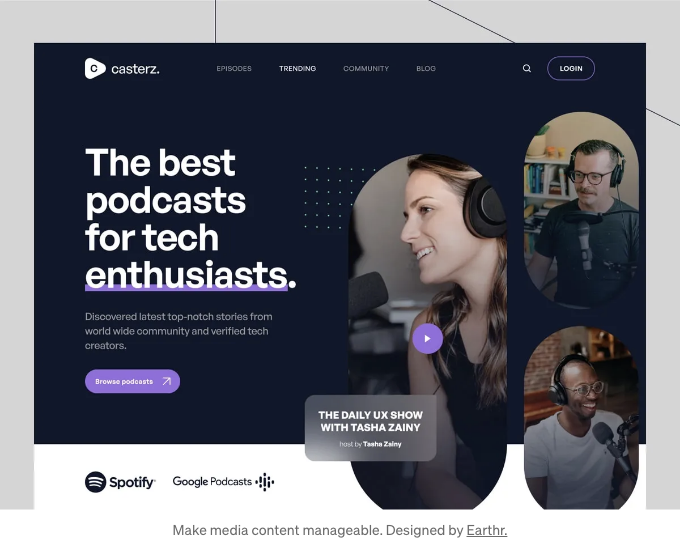

## #2 — 최신 소식 남용

COVID-19 때문에 기분이 나빠지셨나요? 우리의 가구가 해결해줄 거예요. 우리의 스시 배달이 해결해줄 거예요. 우리의 핸드폰이 그걸 해결해줄 거에요. 유사한, 아마도 덜 직접적인 표현은 거의 모든 웹 사이트에서 찾을 수 있습니다. 그들의 텍스트 컨텐츠에 약간의 관련성을 추가하기로 결정한 관리자가 있는 웹 사이트에서 찾을 수 있습니다. 이렇게 하지 마십시오. 비즈니스를 연결하지 않는 세계적인 문제를 귀사의 비즈니스 분야로 끌어들이지 마십시오.

<!-- ui-log 수평형 -->

<ins class="adsbygoogle"
      style="display:block"
      data-ad-client="ca-pub-4877378276818686"
      data-ad-slot="9743150776"
      data-ad-format="auto"
      data-full-width-responsive="true"></ins>
<component is="script">
(adsbygoogle = window.adsbygoogle || []).push({});
</component>

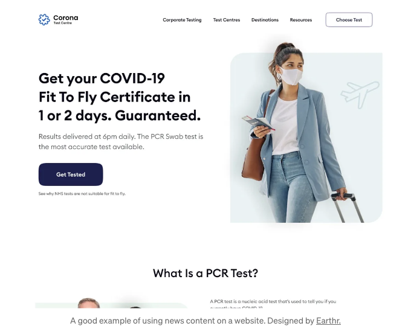

## #3 — 비구조적인 웹 폼

아래의 폼들은 매우 간단합니다. 누구에게 혼란을 줄 수도 있지만 (이 경우가 발생하기도 합니다), 그럼에도 해당 폼이 있는 웹사이트를 방문한 후의 "뒷맛"은 즐겁지 않을 것입니다. 조금 더 시간을 들여 폼을 개인화해보세요.

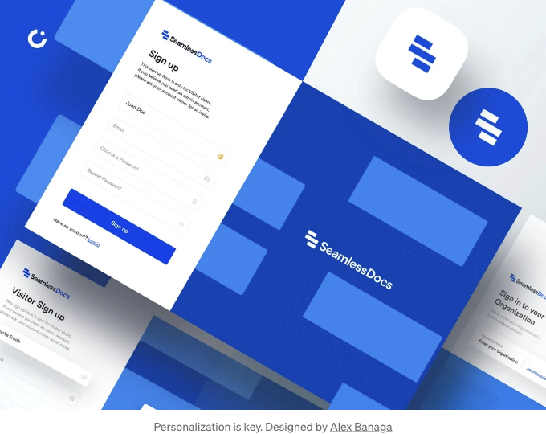

<!-- ui-log 수평형 -->

<ins class="adsbygoogle"
      style="display:block"
      data-ad-client="ca-pub-4877378276818686"
      data-ad-slot="9743150776"
      data-ad-format="auto"
      data-full-width-responsive="true"></ins>
<component is="script">
(adsbygoogle = window.adsbygoogle || []).push({});
</component>

## #4 — 긴 드롭다운 메뉴

드롭다운 메뉴에서 스크롤해야 하는 경우 필요한 항목에 도달해보신 적이 있나요? 휴대폰 이용자들에게 특히 어려운 작업입니다. 이는 쉬운 일이 아닙니다. 사용자의 삶을 복잡하게 하지 말아주세요.

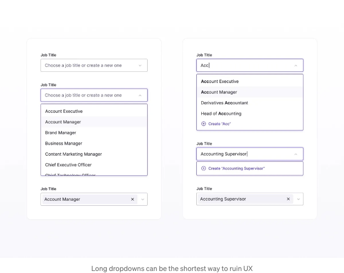

## #5 — 세 번의 클릭 규칙 위반

<!-- ui-log 수평형 -->

<ins class="adsbygoogle"
      style="display:block"
      data-ad-client="ca-pub-4877378276818686"
      data-ad-slot="9743150776"
      data-ad-format="auto"
      data-full-width-responsive="true"></ins>
<component is="script">
(adsbygoogle = window.adsbygoogle || []).push({});
</component>

사용자가 귀하의 웹사이트에서 원하는 작업을 완료하기 위해 몇 번의 클릭을 해야 하는지 확인해 보셨나요? 기본 작업에 대해서 이 숫자가 세 번을 초과한다면, 사용자 경험(UX)에 문제가 있을 수 있습니다.

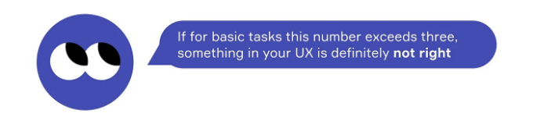

## #6 — 다양한 옵션이 많은 체크리스트

체크리스트는 사용자가 이진 형식의 예/아니오 답변을 할 수 있도록 원래 만들어졌다는 것을 알고 계셨나요? 이는 전적으로 사실이 아니며, 더 많은 옵션이 있을 수 있지만 그것을 남용해서는 안 됩니다.

<!-- ui-log 수평형 -->

<ins class="adsbygoogle"
      style="display:block"
      data-ad-client="ca-pub-4877378276818686"
      data-ad-slot="9743150776"
      data-ad-format="auto"
      data-full-width-responsive="true"></ins>
<component is="script">
(adsbygoogle = window.adsbygoogle || []).push({});
</component>

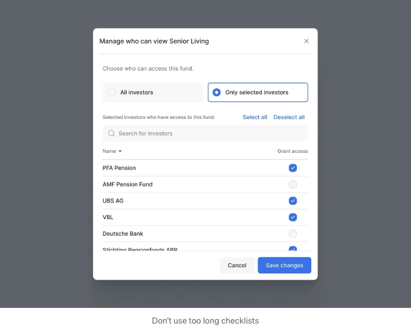

## #7 — 툴팁이 많이 있습니다

인터페이스의 중요한 부분을 툴팁이 어지럽힌 적이 있나요? 비슷한 상황에 직면한 적이 있을 것입니다. 실제로 인터페이스가 그러한 상세한 설명이 필요하다면, 아마도 그것은 좋지 않은 인터페이스이며 좀 더 직관적으로 만들어져야 할 것입니다.

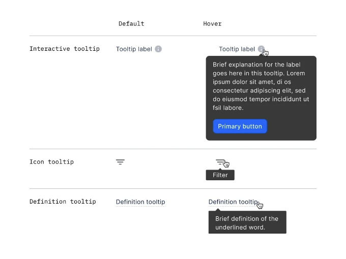

<!-- ui-log 수평형 -->

<ins class="adsbygoogle"
      style="display:block"
      data-ad-client="ca-pub-4877378276818686"
      data-ad-slot="9743150776"
      data-ad-format="auto"
      data-full-width-responsive="true"></ins>
<component is="script">
(adsbygoogle = window.adsbygoogle || []).push({});
</component>

## #8 — 발견하기 어려운 기능

사용자들이 초점을 맞춘 사항을 찾아 볼 필요가 없는지 확신하신가요? 우리가 이야기하는 것은 맨 눈에 띄어야 하는 기능들입니다. 우선 순위 기능을 결정하고 나중에 중요하지 않은 인터페이스 요소를 완성해 보세요.

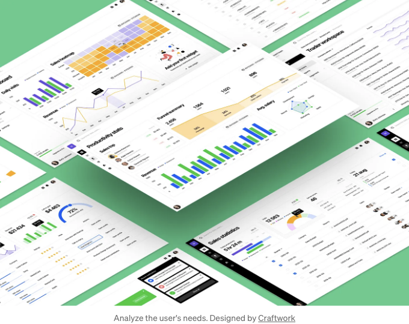

## #9 — 짜증나는 색 구성

<!-- ui-log 수평형 -->

<ins class="adsbygoogle"
      style="display:block"
      data-ad-client="ca-pub-4877378276818686"
      data-ad-slot="9743150776"
      data-ad-format="auto"
      data-full-width-responsive="true"></ins>
<component is="script">
(adsbygoogle = window.adsbygoogle || []).push({});
</component>

만약 색상이 그렇게 중요하지 않다면, 팬톤 색상 연구소가 없었을 테지요. 실제로 사람들은 색상에 많은 주의를 기울이며, 이 규칙은 웹사이트 색 구성에도 적용됩니다. 따라서 빛나는 것을 선택하기보다는 어떤 색조가 인간 인지에 가장 유익한 효과를 주는지에 관심을 가져보세요.

## #10 — 복잡한 암호 요구 사항

당신의 웹사이트에서 비밀리에 펜타곤 데이터를 공유하시나요? 아니면 음모론을 게시하시나요? 그렇지 않다면, 왜 뛰어난 기억력을 가진 사람들만이 리소스에 접근할 수 있도록 허용하시나요? 분명히, 그들만이 높은 비밀번호 요구 사항 때문에 당신의 웹사이트 계정에 액세스할 수 있을 것입니다.

<!-- ui-log 수평형 -->

<ins class="adsbygoogle"
      style="display:block"
      data-ad-client="ca-pub-4877378276818686"
      data-ad-slot="9743150776"
      data-ad-format="auto"
      data-full-width-responsive="true"></ins>
<component is="script">
(adsbygoogle = window.adsbygoogle || []).push({});
</component>

제가 사용자 경험(User Experience)에서 가장 흔한 실수 중 하나인 "#11 — CAPTCHA 남용"에 대해 이야기해볼까요?

마켓플레이스의 계정에 로그인할 때 왜 CAPTCHA가 필요한지 이해할 수 없었어요. 대개 로봇들은 그런 곳에 들어가려 하지 않는데, 그렇다고 해서 웹 페이지를 로드하려는 사용자들이 스스로에게 모래 올리지 않기를 원한다면 CAPTCHA를 너무 많이 사용하지 마세요.

이미지: 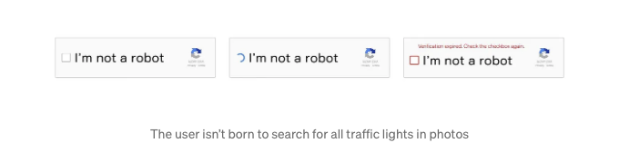

<!-- ui-log 수평형 -->

<ins class="adsbygoogle"
      style="display:block"
      data-ad-client="ca-pub-4877378276818686"
      data-ad-slot="9743150776"
      data-ad-format="auto"
      data-full-width-responsive="true"></ins>
<component is="script">
(adsbygoogle = window.adsbygoogle || []).push({});
</component>

## #12 — 데모 콘텐츠 사용 방식이 잘못됨

만약 귀하의 웹사이트가 유료 기반의 추가 콘텐츠를 홍보해야 할 경우, 모든 웹 페이지에 데모 콘텐츠를 다운로드할 수 있는 제안을 삽입할 필요는 없습니다. 이렇게 하면 방문자들이 팝업을 닫기 위해 계속 ‘X’를 클릭해야 하는 번거로움이 생깁니다.

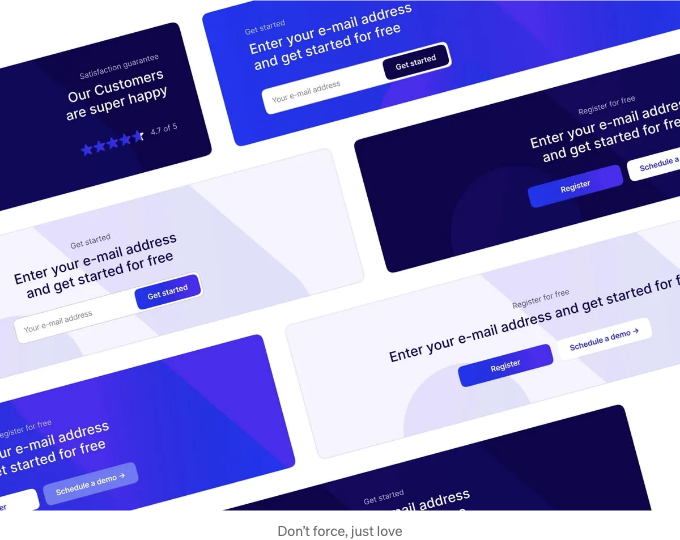

## #13 — 직관성의 부족

<!-- ui-log 수평형 -->

<ins class="adsbygoogle"
      style="display:block"
      data-ad-client="ca-pub-4877378276818686"
      data-ad-slot="9743150776"
      data-ad-format="auto"
      data-full-width-responsive="true"></ins>
<component is="script">
(adsbygoogle = window.adsbygoogle || []).push({});
</component>

웹마스터들의 창의적인 사고가 상식보다 우선될 때가 많습니다. 그 결과로 아래 예시처럼 해결책을 만들어 냅니다. 어디를 클릭해야 하는 걸까요? 어디를 클릭해야 하는 건지요? 다른 웹사이트로 넘어가 보겠습니다.

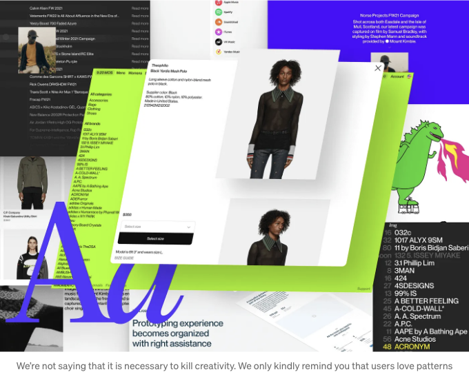

## #14 — 특정 용어

트렌디하려면 일리가 없는 핫 키워드를 사용할 필요는 없어요. 결국, 다음으로 방문할 인터넷 이용자가 누군지 아무도 모르는데요. 아마도 주 타겟 대상으로부터 먼 사람일 수도 있습니다. 그 사실을 잊지 말아 주세요. 명확하게 얘기해 주세요.

<!-- ui-log 수평형 -->

<ins class="adsbygoogle"
      style="display:block"
      data-ad-client="ca-pub-4877378276818686"
      data-ad-slot="9743150776"
      data-ad-format="auto"
      data-full-width-responsive="true"></ins>
<component is="script">
(adsbygoogle = window.adsbygoogle || []).push({});
</component>

## #15 — 빈 공간

콘텐츠가 너무 적은가요? 심지어 인터넷이 끊겨도 구글은 사용자를 매료시킬 콘텐츠를 찾아내죠 (우리 모두 픽셀 타이렉스를 노이면서 시간을 보냈죠), 당신도 충분한 상상력으로 이러한 웹 페이지의 빈 공간을 채울 수 있습니다.

<!-- ui-log 수평형 -->

<ins class="adsbygoogle"
      style="display:block"
      data-ad-client="ca-pub-4877378276818686"
      data-ad-slot="9743150776"
      data-ad-format="auto"
      data-full-width-responsive="true"></ins>
<component is="script">
(adsbygoogle = window.adsbygoogle || []).push({});
</component>

## #16 — 권한 문제

웹 사이트의 권한 설정은 전환율을 높이는 이유입니다. 그렇다면 왜 이 절차를 복잡하게 만드는 걸까요? 로그인 폼을 적어도 몇 명의 사람들로 테스트해보고 복잡하지 않은지 확인해보세요.

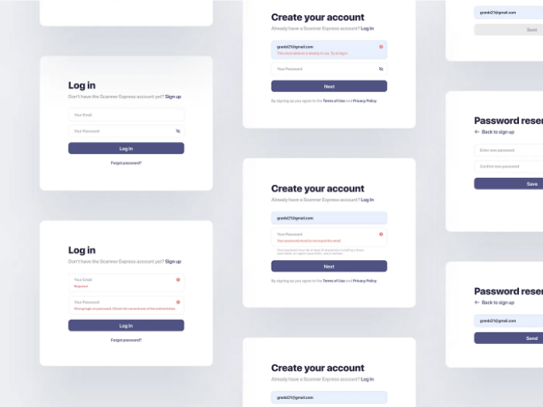

## #17 — 단어 과도 사용

<!-- ui-log 수평형 -->

<ins class="adsbygoogle"
      style="display:block"
      data-ad-client="ca-pub-4877378276818686"
      data-ad-slot="9743150776"
      data-ad-format="auto"
      data-full-width-responsive="true"></ins>
<component is="script">
(adsbygoogle = window.adsbygoogle || []).push({});
</component>

좋은 컨텐츠 작가를 찾는 것은 쉬운 일이 아닙니다. 그러나 사용자들이 원하는 만큼 자주 웹사이트를 방문하지 않는 이유를 나중에 분석하는 것이 훨씬 더 어려울 수 있습니다. 간결하고 명확하게 글을 쓸 수 있는 사람들을 찾아보세요, 그러면 문제가 없을 겁니다.

# #18 — 불필요한 메시지

상사에게 그만두고 싶다고 문자를 보내고 후회해서 메시지를 삭제하고, 그 뒤에 무엇을 쓰고 싶었는지 설명하려고 하는 상황이 있을 때 더 나쁜 일은 없습니다. 아래의 예시에 대해 이야기하고 있습니다. 많은 웹 솔루션은 이러한 접근 방식을 지키지 못합니다. 우리의 권장 사항을 따른다면 당신의 것과는 다르게 될 것입니다.

<!-- ui-log 수평형 -->

<ins class="adsbygoogle"
      style="display:block"
      data-ad-client="ca-pub-4877378276818686"
      data-ad-slot="9743150776"
      data-ad-format="auto"
      data-full-width-responsive="true"></ins>
<component is="script">
(adsbygoogle = window.adsbygoogle || []).push({});
</component>

## #19 — 뭘 해야 하는지 추천이 불충분한 점

사용자들이 뭘 해야 할지와 어떻게 해야 하는지에 대한 명확한 지침이 필요한 아이들처럼 생각해보세요.

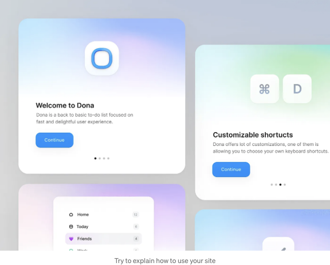

<!-- ui-log 수평형 -->

<ins class="adsbygoogle"
      style="display:block"
      data-ad-client="ca-pub-4877378276818686"
      data-ad-slot="9743150776"
      data-ad-format="auto"
      data-full-width-responsive="true"></ins>
<component is="script">
(adsbygoogle = window.adsbygoogle || []).push({});
</component>

## #20 — 로딩 지연

사용자를 기다리게 하지 마세요. 몇 년 전까지는 수용 가능한 다운로드 속도가 3초였습니다. 그러나 오늘날에는 이 숫자가 훨씬 더 짧습니다.

# 마지막으로

<!-- ui-log 수평형 -->

<ins class="adsbygoogle"
      style="display:block"
      data-ad-client="ca-pub-4877378276818686"
      data-ad-slot="9743150776"
      data-ad-format="auto"
      data-full-width-responsive="true"></ins>
<component is="script">
(adsbygoogle = window.adsbygoogle || []).push({});
</component>

당신의 웹사이트 방문자들이 인터페이스와 상호작용하는 데 어려움을 겪는 실수로부터 당신을 구해줬으면 좋겠습니다. 그러므로 이제 완벽한 사용자 경험을 만들기 위한 한 걸음 더 나아갈 수 있게 된 것입니다.

# 멋진 웹 디자인은 계획부터 시작됩니다. 훌륭한 계획은 FlowMapp로 시작됩니다.

FlowMapp 2.0을 만나보세요. 계획 프로세스 모든 단계를 위한 복합 솔루션입니다. 아이디어부터 클릭 가능한 프로토타입까지. FlowMapp을 당신의 툴킷에 추가하세요.

원문: https://www.flowmapp.com.
