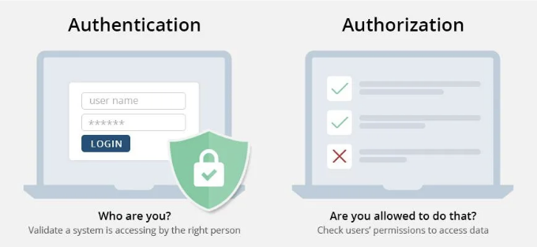
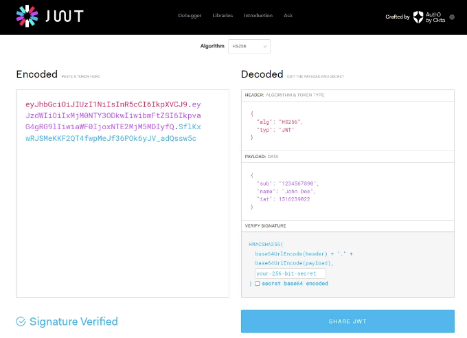
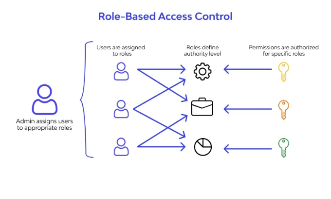
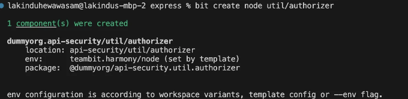
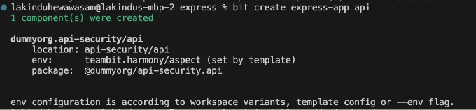
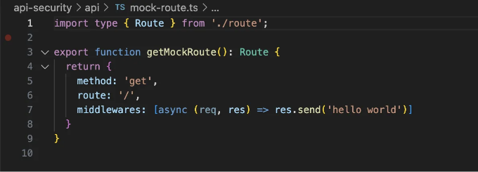
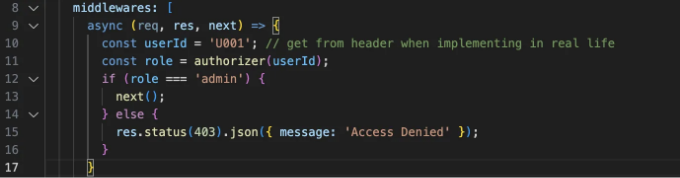
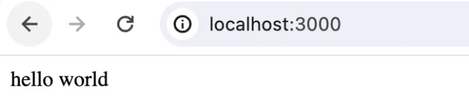
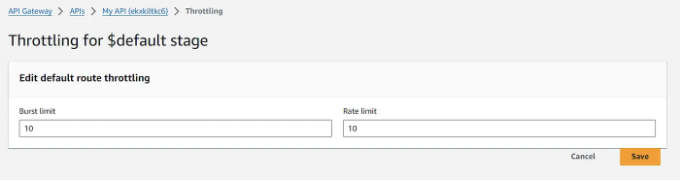

## API 권한 부여를 위한 4가지 모범 사례

API(Application Programming Interfaces)는 서로 다른 소프트웨어 프로그램끼리 대화할 수 있는 비밀 문들과 같습니다. 하지만 모든 사람이 모든 문의 열쇠를 가지고 있을 필요는 없죠, 마찬가지로 모든 소프트웨어가 모든 API에 제한 없이 액세스할 필요는 없습니다.

이러한 API는 은행의 모바일 앱에서부터 즐겨 사용하는 소셜 미디어 플랫폼에 이르기까지 모든 것을 연결하며, 민감한 데이터를 처리하고 중요한 기능을 수행합니다.

그래서 여기서 API 권한 부여가 필요한 것입니다.

<!-- ui-log 수평형 -->

<ins class="adsbygoogle"
      style="display:block"
      data-ad-client="ca-pub-4877378276818686"
      data-ad-slot="9743150776"
      data-ad-format="auto"
      data-full-width-responsive="true"></ins>
<component is="script">
(adsbygoogle = window.adsbygoogle || []).push({});
</component>

API 권한 부여는 문을 열고 내부 자원을 활용할 수 있는 올바른 소프트웨어만이 그 문을 열 수 있도록 보증하는 '경비원' 역할을 합니다. 효과적인 API 권한 부여는 보안 이상의 역할을 합니다. 사용자 경험을 원활하게 유지하고 안전하게 보호합니다. 권한이 있는 응용프로그램만 개인 정보에 액세스하고 이러한 응용프로그램은 허용된 범위 내에서만 작업을 수행할 수 있도록 보장합니다.

# API 권한 부여 이해



API 권한 부여의 최선의 실천 방안을 논의하기 전에, '인증'과 '인가'라는 종종 혼동되는 두 개념 사이의 차이를 이해해야 합니다.

<!-- ui-log 수평형 -->

<ins class="adsbygoogle"
      style="display:block"
      data-ad-client="ca-pub-4877378276818686"
      data-ad-slot="9743150776"
      data-ad-format="auto"
      data-full-width-responsive="true"></ins>
<component is="script">
(adsbygoogle = window.adsbygoogle || []).push({});
</component>

- 인증(Authentication)은 신원을 확인하는 것을 의미해요. 사용자의 신원을 아이디, 비밀번호 또는 생체 인식을 통해 확인하는 것과 같아요.
- 인가(Authorization)는 신원이 확인된 후에 자원 또는 기능에 대한 접근을 허용하는 것을 의미해요. 예를 들어, 인증이 건물의 앞문을 통과하는 것이라면, 인가는 그 사람이 건물 안에서 어떤 방과 서비스에 접근할 수 있는지를 결정하는 거예요.

# API 인가(Authorization)의 최상의 실천법

이제 API 인가의 중요성을 이해했으니, 이를 최대한 활용하기 위한 몇 가지 최상의 실천법에 대해 알아볼게요.

## 1. 토큰 기반 인가(Token-Based Authorization) 사용 (JWT, OAuth 토큰)

<!-- ui-log 수평형 -->

<ins class="adsbygoogle"
      style="display:block"
      data-ad-client="ca-pub-4877378276818686"
      data-ad-slot="9743150776"
      data-ad-format="auto"
      data-full-width-responsive="true"></ins>
<component is="script">
(adsbygoogle = window.adsbygoogle || []).push({});
</component>



토큰 기반 인증, 특히 JWT (JSON Web Tokens) 및 OAuth 토큰을 사용하면 API 상호작용을 안전하고 효율적으로 관리할 수 있습니다. 예를 들어:

- 토큰을 사용하면 무상태(stateless) 인증이 가능해져 서버가 각 사용자에 대한 세션 상태를 유지할 필요가 없어져 확장성이 향상됩니다.
- 토큰은 다양한 수단을 통해 안전하게 전송할 수 있으며, 기존 세션 기반 인증보다 CSRF 공격에 덜 취약합니다.
- 토큰은 도메인 간에 사용할 수 있어서, 마이크로서비스 아키텍처 및 단일 사인온(SSO) 애플리케이션에 이상적입니다.
- 특히 OAuth 토큰을 사용하면 스코프 및 권한을 포함하여 인증된 사용자의 동작을 정확하게 제어할 수 있습니다.

## JWT를 사용한 토큰 기반 인가 구현 방법

<!-- ui-log 수평형 -->

<ins class="adsbygoogle"
      style="display:block"
      data-ad-client="ca-pub-4877378276818686"
      data-ad-slot="9743150776"
      data-ad-format="auto"
      data-full-width-responsive="true"></ins>
<component is="script">
(adsbygoogle = window.adsbygoogle || []).push({});
</component>

JWT는 사용자가 성공적으로 인증된 후에 일반적으로 생성됩니다. 이들은 사용자 정보와 필요에 따라 권한을 포함하는 페이로드를 포함합니다. JWT 인가를 구현하려면 Node.js에서는 jsonwebtoken 또는 Python에서 PyJWT와 같은 라이브러리를 사용할 수 있습니다.

먼저 JWT 토큰을 생성해야 합니다. 다음은 PyJWT를 사용하여 어떻게 할 수 있는지 보여줍니다:

```js
import jwt
from datetime import datetime, timedelta

secret_key = 'YOUR_SECRET_KEY'
payload = {
    'sub': user_id,
    'iat': datetime.utcnow(),
    'exp': datetime.utcnow() + timedelta(days=1)
}

token = jwt.encode(payload, secret_key, algorithm='HS256')
```

그런 다음, 각 요청을 유효화하여 사용자가 요청을 수행할 수 있는지를 결정해야 합니다. 토큰은 일반적으로 각 요청의 Authorization 헤더에 전송됩니다. 서버는 비밀 키를 사용하여 JWT를 디코드하고 유효성을 확인할 수 있습니다. 유효하면 서버가 요청을 처리하고, 그렇지 않으면 오류를 반환합니다.

<!-- ui-log 수평형 -->

<ins class="adsbygoogle"
      style="display:block"
      data-ad-client="ca-pub-4877378276818686"
      data-ad-slot="9743150776"
      data-ad-format="auto"
      data-full-width-responsive="true"></ins>
<component is="script">
(adsbygoogle = window.adsbygoogle || []).push({});
</component>

```python
from flask import Flask, request, jsonify
import jwt
import datetime

app = Flask(__name__)
SECRET_KEY = "your_secret_key"  # Replace with your secret key

# 샘플 루트: 토큰 기반 권한이 필요한 루트
@app.route('/protected', methods=['GET'])
def protected():
    token = request.headers.get('Authorization')
    if not token:
        return jsonify({'message': '토큰이 누락되었습니다!'}), 403

    try:
        # 토큰 해독
        data = jwt.decode(token, SECRET_KEY, algorithms=["HS256"])
        # 토큰 내의 데이터 사용 가능, 예를 들어:
        # user_id = data['user_id']

    except jwt.ExpiredSignatureError:
        return jsonify({'message': '토큰이 만료되었습니다!'}), 403
    except jwt.InvalidTokenError:
        return jsonify({'message': '잘못된 토큰입니다!'}), 403

    # 토큰이 유효하므로 요청 처리
    return jsonify({'message': '토큰이 유효합니다! 보호된 루트에 액세스할 수 있습니다.'})
```

## 2. 세밀한 접근 제어 구현



세밀한 접근 제어는 응용 프로그램 권한과 액세스 권한에 대한 자세한 제어를 제공하는 보안 관리 접근 방식입니다. 해당 사용자나 서비스가 필요한 권한만 갖도록하여 최소한의 권한 원칙을 준수합니다.```

<!-- ui-log 수평형 -->

<ins class="adsbygoogle"
      style="display:block"
      data-ad-client="ca-pub-4877378276818686"
      data-ad-slot="9743150776"
      data-ad-format="auto"
      data-full-width-responsive="true"></ins>
<component is="script">
(adsbygoogle = window.adsbygoogle || []).push({});
</component>

## 세밀한 접근 제어 구현 방법:

세밀한 접근 제어를 구현하는 데는 몇 가지 단계가 필요합니다:

- 역할 및 권한 정의: 시스템 내에서 다른 사용자 역할을 식별하고 각 역할의 특정 작업을 정의합니다.
- 역할 기반 접근 제어 (RBAC) 사용: 리소스 액세스 권한이 역할에 따라 부여되는 RBAC를 구현합니다. 각 역할에 특정 권한이 할당됩니다.
- 속성 기반 접근 제어 (ABAC) 고려: 더 복잡한 시나리오의 경우, 사용자, 리소스, 환경의 조합에 따라 액세스 결정을 내리는 ABAC를 사용할 수 있습니다.

예를 들어, 관리자와 사용자 간에 액세스가 다른 API가 있다면, 애플리케이션 전반에 재사용할 수 있는 독립적 구성 요소를 사용하여 액세스 제어 메커니즘을 구현할 수 있습니다.

<!-- ui-log 수평형 -->

<ins class="adsbygoogle"
      style="display:block"
      data-ad-client="ca-pub-4877378276818686"
      data-ad-slot="9743150776"
      data-ad-format="auto"
      data-full-width-responsive="true"></ins>
<component is="script">
(adsbygoogle = window.adsbygoogle || []).push({});
</component>

예를 들어, Bit와 같은 도구를 활용하여 API 요청을 인가하는 역할을 맡을 독립적인 authorizer 컴포넌트를 만들 수 있어요.

할 일은 다음과 같아요:

1. 다음 명령어를 사용하여 Node.js 컴포넌트인 "authorizer"를 생성하고 권한 로직을 구현할 수 있어요:

```js
bit create node util/authorizer
```

<!-- ui-log 수평형 -->

<ins class="adsbygoogle"
      style="display:block"
      data-ad-client="ca-pub-4877378276818686"
      data-ad-slot="9743150776"
      data-ad-format="auto"
      data-full-width-responsive="true"></ins>
<component is="script">
(adsbygoogle = window.adsbygoogle || []).push({});
</component>

만약 제대로 진행한다면 아래 결과를 확인할 수 있을 것입니다:



이제 권한 부여 로직을 구현하세요:

```js
export function authorizer(userId: string) {
  // 사용자의 역할을 가져오는 로직을 구현하세요
  if (userId === "U001") {
    return "admin";
  }
  return "customer";
}
```

<!-- ui-log 수평형 -->

<ins class="adsbygoogle"
      style="display:block"
      data-ad-client="ca-pub-4877378276818686"
      data-ad-slot="9743150776"
      data-ad-format="auto"
      data-full-width-responsive="true"></ins>
<component is="script">
(adsbygoogle = window.adsbygoogle || []).push({});
</component>

다음으로, 다음 명령을 사용하여 Express 앱을 만듭니다:

```js
bit create express-app api
```

출력 결과는 다음과 같이 나타날 것입니다:



<!-- ui-log 수평형 -->

<ins class="adsbygoogle"
      style="display:block"
      data-ad-client="ca-pub-4877378276818686"
      data-ad-slot="9743150776"
      data-ad-format="auto"
      data-full-width-responsive="true"></ins>
<component is="script">
(adsbygoogle = window.adsbygoogle || []).push({});
</component>

그 다음으로, 앱에 권한 부여자를 연결하기 위해 mock-route.ts를 업데이트해 봅시다. 최초에는 다음과 같은 코드가 나타날 것입니다:



새로운 미들웨어를 추가해 봅시다:



<!-- ui-log 수평형 -->

<ins class="adsbygoogle"
      style="display:block"
      data-ad-client="ca-pub-4877378276818686"
      data-ad-slot="9743150776"
      data-ad-format="auto"
      data-full-width-responsive="true"></ins>
<component is="script">
(adsbygoogle = window.adsbygoogle || []).push({});
</component>

이렇게 하면 실제 비즈니스 로직을 호출하기 전에 권한 부여 구성요소가 실행됩니다. API를 실행한 후 다음 출력을 확인해야 합니다:



함수를 연결함으로써 역할 기반 액세스 제어를 강화했습니다. 데코레이터는 사용자 역할이 엔드포인트에 필요한 역할과 일치하는지 확인합니다. 그렇지 않으면 액세스 거부 메시지가 반환됩니다.

그리고 권한 부여 로직을 계속 업데이트하고 앱을 업데이트하는 동안, Bit의 CI 서버인 리플 CI가 자동으로 변경 사항을 트리 전체에 업데이트합니다.

<!-- ui-log 수평형 -->

<ins class="adsbygoogle"
      style="display:block"
      data-ad-client="ca-pub-4877378276818686"
      data-ad-slot="9743150776"
      data-ad-format="auto"
      data-full-width-responsive="true"></ins>
<component is="script">
(adsbygoogle = window.adsbygoogle || []).push({});
</component>

## 3. 안전한 API 게이트웨이 구성

API 게이트웨이는 모든 API 요청의 출입구 역할을 하며 보안 및 운영 정책을 강제하는 중앙 집중화된 장소 역할을 합니다. 예를 들어, API 게이트웨이는 다음과 같은 기능을 제공하여 도움을 줍니다:

- 강화된 보안: DDoS 공격, 무단 액세스, API 남용과 같은 위협으로부터 보호하는 추가 보안층을 제공합니다.
- 요청 속도 제한 및 제어: API 과도한 사용을 방지하고 사용자 간 공정한 사용을 보장합니다.
- 데이터 변환 및 유효성 검사: 들어오는 데이터가 예상 형식과 표준을 준수하는지 확인합니다.

## 안전한 API 게이트웨이 구성 방법:

<!-- ui-log 수평형 -->

<ins class="adsbygoogle"
      style="display:block"
      data-ad-client="ca-pub-4877378276818686"
      data-ad-slot="9743150776"
      data-ad-format="auto"
      data-full-width-responsive="true"></ins>
<component is="script">
(adsbygoogle = window.adsbygoogle || []).push({});
</component>

당신의 애플리케이션에 대한 여러 API 게이트웨이 제공업체가 있습니다. 예를 들어 Amazon API Gateway, Kong, 그리고 Google의 Apigee는 가장 인기 있는 API 게이트웨이 플랫폼 중 일부입니다.

AWS를 사용하려고 하는 경우, AWS 문서에 안내된 단계를 따라 API 게이트웨이를 쉽게 생성할 수 있습니다. 그러나 API 게이트웨이가 안전하고 효율적으로 작동하도록 하려면 몇 가지 추가 설정이 필요합니다.

- 요율 제한 설정 — AWS 관리 콘솔에서 Amazon API Gateway로 이동한 다음 API를 선택하고 "보호" 탭 내의 Throttling 섹션으로 이동합니다. 거기에서 요율 및 폭주 제한을 설정할 수 있습니다.



<!-- ui-log 수평형 -->

<ins class="adsbygoogle"
      style="display:block"
      data-ad-client="ca-pub-4877378276818686"
      data-ad-slot="9743150776"
      data-ad-format="auto"
      data-full-width-responsive="true"></ins>
<component is="script">
(adsbygoogle = window.adsbygoogle || []).push({});
</component>

- SSL/TLS 활성화하기 - API 게이트웨이의 사용자 정의 도메인 이름이 AWS Certificate Manager에 등록된 SSL/TLS 인증서와 연결되어 있는지 확인하세요.
- IP 제한 구현하기 - AWS Lambda 인가자를 사용하여 수신 요청의 IP 주소를 확인하세요. 함수를 배포한 후에는 API 게이트웨이의 권한 탭에서 새로운 인가자를 생성하여 함수를 선택할 수 있습니다. 다음은 IP를 제한하는 Python 샘플 Lambda 함수입니다:

```js
import json

def lambda_handler(event, context):
    ip_address = event['requestContext']['identity']['sourceIp']
    allowed_ips = ['192.168.1.1']  # 허용된 IP 목록
    # 여기에 ip_address가 allowed_ips에 있는지 여부를 확인하는 논리를 추가하세요

    if ip_address not in allowed_ips:
        raise Exception('Unauthorized')

    return {
        'principalId': 'user',
        'policyDocument': {
            'Version': '2012-10-17',
            'Statement': [{
                'Action': 'execute-api:Invoke',
                'Effect': 'Allow',
                'Resource': event['methodArn']
            }]
        }
    }
```

- CloudWatch 로그 활성화하기 - AWS Management Console에서 API Gateway의 설정으로 이동하세요. CloudWatch 설정 섹션에서 CloudWatch 로그 활성화 옵션을 확인하세요. 모든 요청 및 응답을 로깅하려면 로깅 레벨을 INFO로 설정하거나 오류 응답만 로깅하려면 ERROR로 설정하세요.

## 4. 이동하는 중요 데이터와 안정상태에서 보호하기

<!-- ui-log 수평형 -->

<ins class="adsbygoogle"
      style="display:block"
      data-ad-client="ca-pub-4877378276818686"
      data-ad-slot="9743150776"
      data-ad-format="auto"
      data-full-width-responsive="true"></ins>
<component is="script">
(adsbygoogle = window.adsbygoogle || []).push({});
</component>

데이터를 트랜짓(전송 중) 및 데이터가 안정 상태에서 암호화 하는 것은 무단 접근과 침입으로부터 데이터를 보호하기 위한 기본적인 보안 관행입니다. 트랜짓에서의 암호화는 클라이언트와 서버 간 데이터 이동 시, 데이터를 안전하게 지킵니다. 반면 안정 상태에서의 암호화는 디스크나 데이터베이스에 저장된 데이터를 지킵니다.

## 데이터 트랜짓(전송 중) 암호화 구현 방법

자체 웹서버를 사용하는 경우 SSL/TLS 인증서를 수동으로 설정하고 관리해야 합니다. 먼저 신뢰할 수 있는 인증 기관(CA)인 Let’s Encrypt, DigiCert, GoDaddy 등에서 인증서를 획득해야 합니다. 그런 다음 서버에서 CA를 사용하도록 구성해야 합니다. 예를 들어, Nginx에서 SSL을 구성하는 방법은 다음과 같습니다:

- Nginx 구성 파일 수정(일반적으로 /etc/nginx/nginx.conf 또는 /etc/nginx/sites-available/your_site에 위치).
- 서버 블록에 SSL 설정 추가:

<!-- ui-log 수평형 -->

<ins class="adsbygoogle"
      style="display:block"
      data-ad-client="ca-pub-4877378276818686"
      data-ad-slot="9743150776"
      data-ad-format="auto"
      data-full-width-responsive="true"></ins>
<component is="script">
(adsbygoogle = window.adsbygoogle || []).push({});
</component>

```nginx
server {
    listen 443 ssl;
    server_name yourdomain.com;

    ssl_certificate /path/to/your/fullchain.pem; # CA로부터 fullchain.pem의 경로
    ssl_certificate_key /path/to/your/privkey.pem; # CA로부터 개인 키의 경로

    # 강력한 암호화 설정 (Mozilla의 SSL 구성 생성기의 권장 사항 사용을 고려해보세요)
    ssl_protocols TLSv1.2 TLSv1.3;
    ssl_ciphers 'ECDHE-ECDSA-AES128-GCM-SHA256:ECDHE-RSA-AES128-GCM-SHA256...';

    # 다른 서버 구성...
}
```

클라우드 서비스를 사용하면 SSL/TLS를 처리하는 완전 관리형 서비스를 제공합니다. 예를 들어, AWS에서 호스팅되는 서비스에 AWS Certificate Manager를 사용할 수 있습니다.

## Data Enrcyption의 구현 방법

데이터 암호화를 데이터베이스 수준, 응용프로그램 수준 또는 클라우드 기반 도구를 사용하여 구현할 수 있습니다.

<!-- ui-log 수평형 -->

<ins class="adsbygoogle"
      style="display:block"
      data-ad-client="ca-pub-4877378276818686"
      data-ad-slot="9743150776"
      data-ad-format="auto"
      data-full-width-responsive="true"></ins>
<component is="script">
(adsbygoogle = window.adsbygoogle || []).push({});
</component>

- 데이터베이스 수준 암호화: 많은 최신 데이터베이스들이 내장 암호화 기능을 제공합니다. 예를 들어:
- SQL Server: Transparent Data Encryption.
- MySQL: InnoDB tablespace encryption.
- MongoDB: Encrypted Storage Engine.
- 응용 프로그램 수준 암호화: 민감한 데이터에 대해 데이터베이스에 저장하기 전에도 암호화해야 합니다. 이를 위해 cryptography와 같은 라이브러리를 사용할 수 있습니다:

```js
from cryptography.fernet import Fernet

# 키 생성
key = Fernet.generate_key()
cipher_suite = Fernet(key)

# 데이터 암호화
encrypted_data = cipher_suite.encrypt(b"민감한 데이터")
# 데이터 복호화
decrypted_data = cipher_suite.decrypt(encrypted_data)
```

# 마지막으로

견고한 API 권한 부여는 디지털 자산을 안전하게 보호하고 사용자 신뢰를 유지하는 데 중요합니다.

<!-- ui-log 수평형 -->

<ins class="adsbygoogle"
      style="display:block"
      data-ad-client="ca-pub-4877378276818686"
      data-ad-slot="9743150776"
      data-ad-format="auto"
      data-full-width-responsive="true"></ins>
<component is="script">
(adsbygoogle = window.adsbygoogle || []).push({});
</component>

여기서 논의된 최적의 방법을 도입함으로써 개발자들은 다양한 사이버 위협에 대한 컴플라이언스와 보호를 보장하면서 응용 프로그램의 API 보안을 크게 향상시킬 수 있습니다.

# 더 알아보기
