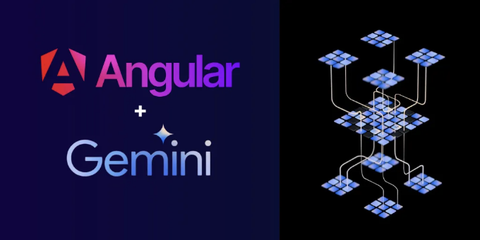
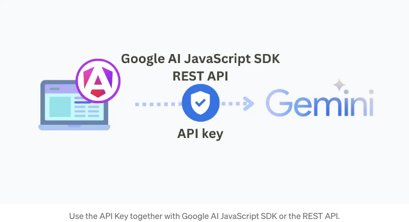
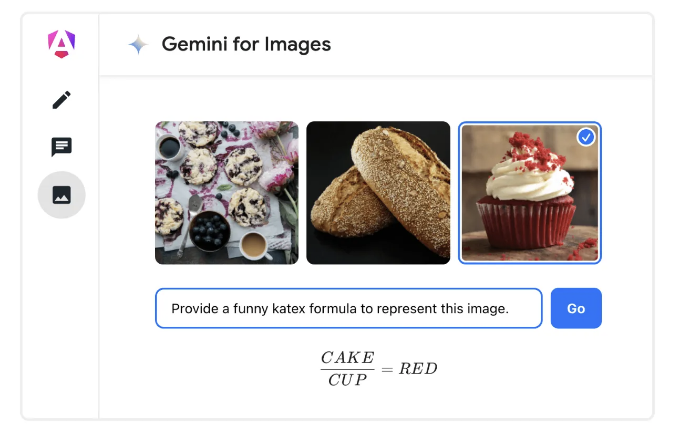

구글 젬니니를 Angular 애플리케이션에 통합하는 단계별 가이드입니다.



이 게시물에서는 Angular를 사용하여 AI가 가능한 어플리케이션의 차세대를 만들기 위해 젬니 API에 액세스하는 방법을 배울 것입니다.

우리는 공식 클라이언트를 통해 젬니 Pro 및 젬니 Pro Visual을 테스트하기 위한 간단한 어플리케이션을 만들 것입니다. 추가로 Vertex AI를 REST API를 통해 사용하는 방법도 보여드릴 예정입니다.

<!-- ui-log 수평형 -->

<ins class="adsbygoogle"
      style="display:block"
      data-ad-client="ca-pub-4877378276818686"
      data-ad-slot="9743150776"
      data-ad-format="auto"
      data-full-width-responsive="true"></ins>
<component is="script">
(adsbygoogle = window.adsbygoogle || []).push({});
</component>

다음 내용을 다룰 것입니다:

- Google Gemini 소개
- Google AI Studio에서 API 키 가져오기
- Angular 애플리케이션 생성하기
- 텍스트만 있는 입력(텍스트)을 이용해 텍스트 생성하기
- 텍스트와 이미지가 있는 입력(멀티모달)을 이용해 텍스트 생성하기
- 다중 대화를 구축하기(채팅)
- 스트리밍을 이용해 콘텐츠 생성하기(스트림)
- 보너스: REST API를 통해 Vertex AI를 이용해 AI 콘텐츠 생성하기
- 코드 실행하고 응답 확인하기
- 결론

# Google Gemini 소개

Google Gemini은 Google AI가 만든 최신 AI 기능을 제공하는 대형 언어 모델(문장 집합) 가족입니다. Gemini 모델은 다음을 포함합니다:

<!-- ui-log 수평형 -->

<ins class="adsbygoogle"
      style="display:block"
      data-ad-client="ca-pub-4877378276818686"
      data-ad-slot="9743150776"
      data-ad-format="auto"
      data-full-width-responsive="true"></ins>
<component is="script">
(adsbygoogle = window.adsbygoogle || []).push({});
</component>

- Gemini Ultra. 가장 큰 크기에 가장 강력한 모델로, 코딩, 논리적 추론 및 창의적 협업과 같은 복잡한 작업에 능숙합니다. Gemini Advanced(이전 Bard)를 통해 이용 가능합니다.
- Gemini Pro. 다양한 작업에 최적화된 중간 크기 모델로, Ultra와 유사한 성능을 제공합니다. Gemini Chatbot 및 Google Workspace와 Google Cloud에서 이용 가능합니다. Gemini Pro 1.5는 긴 문맥 이해에 대한 혁신을 포함하여, 텍스트, 코드, 이미지, 오디오 및 비디오를 포함한 백만 개의 토큰까지의 개선된 성능을 제공합니다.
- Gemini Nano. 개별 사용을 위해 설계된 가벼운 모델로, AI 기능을 모바일 폰 및 소형 기기에 제공합니다. Pixel 8 및 Samsung S24 시리즈에서 이용 가능합니다.
- Gemma. Gemini에서 영감을 받은 오픈 소스 모델로, 작은 크기에서 최첨단 성능을 제공하며 책임 있는 AI 원칙에 따라 디자인되었습니다.

# Google AI Studio에서 API 키 받는 방법

aistudio.google.com에 가서 API 키를 생성하세요. 미국을 기반으로 하지 않는 경우, 전 세계적으로 이용 가능한 Vertex AI를 사용하거나 VPN 서비스를 사용할 수 있습니다.



<!-- ui-log 수평형 -->

<ins class="adsbygoogle"
      style="display:block"
      data-ad-client="ca-pub-4877378276818686"
      data-ad-slot="9743150776"
      data-ad-format="auto"
      data-full-width-responsive="true"></ins>
<component is="script">
(adsbygoogle = window.adsbygoogle || []).push({});
</component>

# Angular 애플리케이션 생성하기

Angular CLI를 사용하여 새 애플리케이션을 생성하세요:

```js
ng new google-ai-gemini-angular
```

이 명령은 최신 Angular 버전으로 새 프로젝트의 틀을 만들어줍니다.

<!-- ui-log 수평형 -->

<ins class="adsbygoogle"
      style="display:block"
      data-ad-client="ca-pub-4877378276818686"
      data-ad-slot="9743150776"
      data-ad-format="auto"
      data-full-width-responsive="true"></ins>
<component is="script">
(adsbygoogle = window.adsbygoogle || []).push({});
</component>

## 프로젝트 설정하기

새로운 환경을 추가하려면 다음 명령을 실행하세요:

```js
ng g environments
```

이렇게 하면 개발과 프로덕션용으로 다음과 같은 파일이 생성됩니다:

<!-- ui-log 수평형 -->

<ins class="adsbygoogle"
      style="display:block"
      data-ad-client="ca-pub-4877378276818686"
      data-ad-slot="9743150776"
      data-ad-format="auto"
      data-full-width-responsive="true"></ins>
<component is="script">
(adsbygoogle = window.adsbygoogle || []).push({});
</component>

```js
src / environments / environment.development.ts;
src / environments / environment.ts;
```

개발 파일을 편집하여 API 키를 포함시킵니다:

```js
// src/environments/environment.development.ts
export const environment = {
  API_KEY: "<당신의-API-키>",
};
```

# Google AI JavaScript SDK

<!-- ui-log 수평형 -->

<ins class="adsbygoogle"
      style="display:block"
      data-ad-client="ca-pub-4877378276818686"
      data-ad-slot="9743150776"
      data-ad-format="auto"
      data-full-width-responsive="true"></ins>
<component is="script">
(adsbygoogle = window.adsbygoogle || []).push({});
</component>

이것은 Gemini 모델에 액세스하기 위한 공식 클라이언트입니다. 우리는 이를 사용하여 다음을 할 것입니다:

- 텍스트만 있는 입력으로부터 텍스트 생성 (텍스트)
- 텍스트 및 이미지 입력으로부터 텍스트 생성 (멀티모달)
- 다중 턴 대화 구축 (채팅)
- 스트리밍을 사용하여 생성된 콘텐츠 생성 (스트림)

프로젝트에 이 패키지를 추가해보세요:

```js
npm install @google/generative-ai
```

<!-- ui-log 수평형 -->

<ins class="adsbygoogle"
      style="display:block"
      data-ad-client="ca-pub-4877378276818686"
      data-ad-slot="9743150776"
      data-ad-format="auto"
      data-full-width-responsive="true"></ins>
<component is="script">
(adsbygoogle = window.adsbygoogle || []).push({});
</component>

# 모델 초기화하기

저희 Gemini을 호출하기 전에 모델 초기화 과정을 거쳐야 합니다. 이 단계에는 다음과 같은 작업이 포함됩니다:

- API 키로 GoogleGenerativeAI 클라이언트 초기화
- Gemini 모델 선택: gemini-pro 또는 gemini-pro-vision
- safetySettings, temperature, top_p, top_k 및 maxOutputTokens와 같은 모델 매개변수 설정

```js
import {
  GoogleGenerativeAI, HarmBlockThreshold, HarmCategory
} from '@google/generative-ai';

...
const genAI = new GoogleGenerativeAI(environment.API_KEY);
const generationConfig = {
  safetySettings: [
    {
      category: HarmCategory.HARM_CATEGORY_HARASSMENT,
      threshold: HarmBlockThreshold.BLOCK_LOW_AND_ABOVE,
    },
  ],
  temperature: 0.9,
  top_p: 1,
  top_k: 32,
  maxOutputTokens: 100, // 출력 제한
};
const model = genAI.getGenerativeModel({
  model: 'gemini-pro', // 또는 'gemini-pro-vision'
  ...generationConfig,
});
...
```

<!-- ui-log 수평형 -->

<ins class="adsbygoogle"
      style="display:block"
      data-ad-client="ca-pub-4877378276818686"
      data-ad-slot="9743150776"
      data-ad-format="auto"
      data-full-width-responsive="true"></ins>
<component is="script">
(adsbygoogle = window.adsbygoogle || []).push({});
</component>

안전 설정에서는 기본 설정(중간 또는 높음 차단)을 사용하거나 필요에 따라 조정할 수 있습니다. 예를 들어, 우리는 괴롭힘에 대한 임계값을 높여 낮은 확률 이상의 결과를 차단해 안전성을 높였습니다. 더 자세한 설명은 여기에서 확인할 수 있습니다.

이것들은 모든 모델과 기본 설정입니다. 분당 요청 제한이 있습니다. 모델 매개변수에 대해 더 자세히 알아보세요.

# 텍스트 입력만을 사용하여 텍스트 생성(text)

아래에서 Gemini Pro를 텍스트 입력만으로 보여주는 코드 조각을 확인할 수 있습니다.

<!-- ui-log 수평형 -->

<ins class="adsbygoogle"
      style="display:block"
      data-ad-client="ca-pub-4877378276818686"
      data-ad-slot="9743150776"
      data-ad-format="auto"
      data-full-width-responsive="true"></ins>
<component is="script">
(adsbygoogle = window.adsbygoogle || []).push({});
</component>

```js
async TestGeminiPro() {
  // 모델 초기화를 간결히하기 위해 생략합니다.

  const prompt = '이름이 있는 가장 큰 숫자는 무엇인가요?';
  const result = await model.generateContent(prompt);
  const response = await result.response;
  console.log(response.text());
}
```

# 텍스트 및 이미지 입력에서 텍스트 생성 (멀티모달)

이 예시는 Gemini Pro Vision을 텍스트 및 이미지를 입력으로 사용하는 방법을 보여줍니다. 편리성을 위해 src/assets에 이미지를 사용하고 있습니다.

```js
async TestGeminiProVisionImages() {
  try {
    let imageBase64 = await this.fileConversionService.convertToBase64(
      'assets/baked_goods_2.jpeg'
    );

    // Base64로 변환 성공 여부 확인
    if (typeof imageBase64 !== 'string') {
      console.error('이미지를 Base64로 변환하는 데 실패했습니다.');
      return;
    }
    // 모델 초기화를 간결히하기 위해 생략합니다.
    let prompt = [
      {
        inlineData: {
          mimeType: 'image/jpeg',
          data: imageBase64,
        },
      },
      {
        text: '요리 레시피를 제공해주세요.',
      },
    ];
    const result = await model.generateContent(prompt);
    const response = await result.response;
    console.log(response.text());
  } catch (error) {
    console.error('파일을 Base64로 변환하는 중 오류 발생', error);
  }
}
```

<!-- ui-log 수평형 -->

<ins class="adsbygoogle"
      style="display:block"
      data-ad-client="ca-pub-4877378276818686"
      data-ad-slot="9743150776"
      data-ad-format="auto"
      data-full-width-responsive="true"></ins>
<component is="script">
(adsbygoogle = window.adsbygoogle || []).push({});
</component>

입력 이미지를 Base64로 변환하려면 아래의 FileConversionService 또는 외부 라이브러리를 사용할 수 있습니다.

```js
// file-conversion.service.ts
import { Injectable } from '@angular/core';
import { HttpClient } from '@angular/common/http';
import { firstValueFrom } from 'rxjs';

@Injectable({
  providedIn: 'root',
})
export class FileConversionService {
  constructor(private http: HttpClient) {}
  async convertToBase64(filePath: string): Promise<string | ArrayBuffer | null> {
    const blob = await firstValueFrom(this.http.get(filePath, { responseType: 'blob' }));
    return new Promise((resolve, reject) => {
      const reader = new FileReader();
      reader.onloadend = () => {
        const base64data = reader.result as string;
        resolve(base64data.substring(base64data.indexOf(',') + 1)); // Base64 데이터만 추출
      };
      reader.onerror = error => {
        reject(error);
      };
      reader.readAsDataURL(blob);
    });
  }
}
```

Gemini을 위한 이미지 요구 사항:

- 지원하는 MIME 유형: image/png, image/jpeg, image/webp, image/heic 및 image/heif.
- 최대 16개의 이미지.
- 텍스트와 이미지를 포함하여 최대 4MB.
- 큰 이미지는 원본 비율을 유지하면서 3072 x 3072 픽셀에 맞게 축소됩니다.

<!-- ui-log 수평형 -->

<ins class="adsbygoogle"
      style="display:block"
      data-ad-client="ca-pub-4877378276818686"
      data-ad-slot="9743150776"
      data-ad-format="auto"
      data-full-width-responsive="true"></ins>
<component is="script">
(adsbygoogle = window.adsbygoogle || []).push({});
</component>

# 다중 턴 대화 구축하기 (채팅)

이 예제는 Gemini Pro를 사용하여 다중 턴 대화를 구축하는 방법을 보여줍니다.

```js
async TestGeminiProChat() {
  // 명료성을 위해 모델 초기화 부분 생략

  const chat = model.startChat({
    history: [
      {
        role: "user",
        parts: "안녕하세요!",
      },
      {
        role: "model",
        parts: "만나서 반가워요. 무엇을 알고 싶으세요?",
      },
    ],
    generationConfig: {
      maxOutputTokens: 100,
    },
  });
  const prompt = '이름이 있는 가장 큰 숫자는 무엇인가요? 간단히 대답해주세요.';
  const result = await chat.sendMessage(prompt);
  const response = await result.response;
  console.log(response.text());
}
```

# 스트리밍을 사용하여 생성된 내용을 생성하기

<!-- ui-log 수평형 -->

<ins class="adsbygoogle"
      style="display:block"
      data-ad-client="ca-pub-4877378276818686"
      data-ad-slot="9743150776"
      data-ad-format="auto"
      data-full-width-responsive="true"></ins>
<component is="script">
(adsbygoogle = window.adsbygoogle || []).push({});
</component>

이 예시는 Gemini Pro를 사용하여 스트리밍을 통해 컨텐츠를 생성하는 방법을 보여줍니다.

```js
async TestGeminiProStreaming() {
  // 간략히 표시하기 위해 모델 초기화 누락

  const prompt = {
    contents: [
      {
        role: 'user',
        parts: [
          {
            text: '시를 생성하세요.',
          },
        ],
      },
    ],
  };
  const streamingResp = await model.generateContentStream(prompt);
  for await (const item of streamingResp.stream) {
    console.log('스트림 청크: ' + item.text());
  }
  console.log('종합 응답: ' + (await streamingResp.response).text());
}
```

generateContentStream의 결과로 각 청크 스트림이 생성될 때마다 해당 스트림 청크를 읽을 수 있는 객체를 받게 됩니다.

# 보너스: REST API를 통해 Vertex AI를 사용하여 AI 컨텐츠를 생성하세요.

<!-- ui-log 수평형 -->

<ins class="adsbygoogle"
      style="display:block"
      data-ad-client="ca-pub-4877378276818686"
      data-ad-slot="9743150776"
      data-ad-format="auto"
      data-full-width-responsive="true"></ins>
<component is="script">
(adsbygoogle = window.adsbygoogle || []).push({});
</component>

공식 JavaScript 클라이언트 대신 Vertex AI에서 제공하는 Gemini REST API를 사용할 수도 있습니다. Vertex AI는 Google Cloud에서 제공되는 관리형 서비스로, Gemini를 포함한 AI 모델을 훈련하고 배포할 수 있는 완전한 AI 플랫폼입니다.

REST API에 대한 접속 보안을 강화하려면 계정을 만들고 응용 프로그램용 자격 증명을 받아 액세스 권한을 부여해야 합니다. 아래는 그 방법입니다.

- Google Cloud 계정을 만들고 과금을 활성화합니다. 이렇게 하면 Vertex AI에 액세스할 수 있습니다.
- Cloud 콘솔에서 새 프로젝트를 만듭니다. 프로젝트 ID를 메모해 둡니다.
- 프로젝트에 Vertex AI API를 활성화합니다.
- gcloud CLI를 설치하고 gcloud auth print-access-token을 실행합니다. 출력된 액세스 토큰을 저장합니다. 이를 인증에 사용하게 됩니다.

프로젝트 ID와 액세스 토큰을 얻으면, Angular 앱으로 계속 진행할 준비가 되었습니다. 모든 설정이 올바르게 완료되었는지 확인하려면 다음 curl 명령어를 시도해 볼 수 있습니다.

<!-- ui-log 수평형 -->

<ins class="adsbygoogle"
      style="display:block"
      data-ad-client="ca-pub-4877378276818686"
      data-ad-slot="9743150776"
      data-ad-format="auto"
      data-full-width-responsive="true"></ins>
<component is="script">
(adsbygoogle = window.adsbygoogle || []).push({});
</component>

개발 파일을 편집하여 프로젝트 ID와 액세스 토큰을 포함해 주세요:

```js
// src/environments/environment.development.ts
export const environment = {
  API_KEY: "<YOUR-API-KEY>", // Google AI JavaScript SDK 액세스
  PROJECT_ID: "<YOUR-PROJECT-ID>", // Vertex AI 액세스
  GCLOUD_AUTH_PRINT_ACCESS_TOKEN: "<YOUR-GCLOUD-AUTH-PRINT-ACCESS-TOKEN>", // Vertex AI 액세스
};
```

REST API를 통해 요청을 보내려면 HttpClient 프로바이더를 포함해야 합니다:

```js
// app.config.ts
import { provideHttpClient } from "@angular/common/http";

export const appConfig: ApplicationConfig = {
  providers: [provideRouter(routes), provideHttpClient()],
};
```

<!-- ui-log 수평형 -->

<ins class="adsbygoogle"
      style="display:block"
      data-ad-client="ca-pub-4877378276818686"
      data-ad-slot="9743150776"
      data-ad-format="auto"
      data-full-width-responsive="true"></ins>
<component is="script">
(adsbygoogle = window.adsbygoogle || []).push({});
</component>

이 가져오기를 통해 HttpClient를 모든 구성 요소 또는 서비스에 주입하여 웹 요청을 만들 수 있습니다.

```js
// app.component.ts
import { HttpClient } from '@angular/common/http';

@Component({
  selector: 'app-root',
  standalone: true,
  ...
})
export class AppComponent implements OnInit {
  constructor(public http: HttpClient) {}
}
```

REST API를 통해 Vertex AI에 액세스하려면 클라이언트가 없기 때문에 더 많은 작업을 해야합니다. 도움 없이는 요청을 구축하고 응답을 읽는 것이 조금 힘들 수 있습니다.

```js
async TestGeminiProWithVertexAIViaREST() {
  // 문서: https://cloud.google.com/vertex-ai/docs/generative-ai/model-reference/gemini#request_body
  const prompt = this.buildPrompt('이름이 있는 가장 큰 숫자는 무엇입니까?');
  const endpoint = this.buildEndpointUrl(environment.PROJECT_ID);
  let headers = this.getAuthHeaders(
    environment.GCLOUD_AUTH_PRINT_ACCESS_TOKEN
  );

  this.http.post(endpoint, prompt, { headers }).subscribe((response: any) => {
    console.log(response.candidates?.[0].content.parts[0].text);
  });
}

buildPrompt(text: string) {
  return {
    contents: [
      {
        role: 'user',
        parts: [
          {
            text: text,
          },
        ],
      },
    ],
    safety_settings: {
      category: 'HARM_CATEGORY_SEXUALLY_EXPLICIT',
      threshold: 'BLOCK_LOW_AND_ABOVE',
    },
    generation_config: {
      temperature: 0.9,
      top_p: 1,
      top_k: 32,
      max_output_tokens: 100,
    },
  };
}

buildEndpointUrl(projectId: string) {
  const BASE_URL = 'https://us-central1-aiplatform.googleapis.com/';
  const API_VERSION = 'v1'; // 현재 시기에 따라 다를 수 있습니다
  const MODEL = 'gemini-pro';
  let url = BASE_URL; // 기본 URL
  url += API_VERSION; // API 버전
  url += '/projects/' + projectId; // 프로젝트 ID
  url += '/locations/us-central1'; // Google 클라우드 리전
  url += '/publishers/google'; // 출판사
  url += '/models/' + MODEL; // 모델
  url += ':generateContent'; // 액션
  return url;
}

getAuthHeaders(accessToken: string) {
  const headers = new HttpHeaders().set(
    'Authorization',
    `Bearer ${accessToken}`
  );
  return headers;
}
```

<!-- ui-log 수평형 -->

<ins class="adsbygoogle"
      style="display:block"
      data-ad-client="ca-pub-4877378276818686"
      data-ad-slot="9743150776"
      data-ad-format="auto"
      data-full-width-responsive="true"></ins>
<component is="script">
(adsbygoogle = window.adsbygoogle || []).push({});
</component>

# 코드 실행하기

GitHub 프로젝트에서 ngOnInit 내부에서 테스트하려는 코드 주석 처리를 해제하세요.

```js
ngOnInit(): void {
  // Google AI
  this.TestGeminiPro();
  //this.TestGeminiProChat();
  //this.TestGeminiProVisionImages();
  //this.TestGeminiProStreaming();

  // Vertex AI
  //this.TestGeminiProWithVertexAIViaREST();
}
```

터미널에서 다음 명령을 실행하고 localhost:4200으로 이동하세요.

<!-- ui-log 수평형 -->

<ins class="adsbygoogle"
      style="display:block"
      data-ad-client="ca-pub-4877378276818686"
      data-ad-slot="9743150776"
      data-ad-format="auto"
      data-full-width-responsive="true"></ins>
<component is="script">
(adsbygoogle = window.adsbygoogle || []).push({});
</component>

```js
ng serve
```

# 응답 확인

응답을 확인하려면 브라우저의 콘솔 출력을 빠르게 확인할 수 있어요.

```js
console.log(response.text());
```

<!-- ui-log 수평형 -->

<ins class="adsbygoogle"
      style="display:block"
      data-ad-client="ca-pub-4877378276818686"
      data-ad-slot="9743150776"
      data-ad-format="auto"
      data-full-width-responsive="true"></ins>
<component is="script">
(adsbygoogle = window.adsbygoogle || []).push({});
</component>

```js
가장 큰 이름이 붙은 숫자는 구구올플렉스입니다. 구구올플렉스는 1 뒤에 100개의 0이 따릅니다.
```

축하합니다! 이제 Gemini 기능에 액세스할 수 있습니다.

# 결론

이 튜토리얼을 완료함으로써 다음을 배웠습니다:

<!-- ui-log 수평형 -->

<ins class="adsbygoogle"
      style="display:block"
      data-ad-client="ca-pub-4877378276818686"
      data-ad-slot="9743150776"
      data-ad-format="auto"
      data-full-width-responsive="true"></ins>
<component is="script">
(adsbygoogle = window.adsbygoogle || []).push({});
</component>

- API 키를 얻고 Gemini API에 액세스하는 방법
- 텍스트 및 채팅을 사용하여 Gemini Pro를 호출하는 방법
- Gemini Pro Vision을 위한 입력 이미지 처리 방법
- 보너스: REST API를 통해 Vertex AI를 사용하여 Gemini를 설정하고 호출하는 방법
- 응답 및 출력 처리하는 방법

이제 Angular 앱에서 Gemini를 사용하여 고급 텍스트 생성과 같은 AI 기능을 구축하는 기본기가 마련되었습니다. 전체 코드는 GitHub에서 확인할 수 있습니다.

# 더 복잡한 프로젝트를 보고 싶나요?

Angular Material, ngx-quill 및 ngx-markdown을 사용하여 풀 스케일 Gemini 챗봇을 구축했습니다. 텍스트, 채팅 및 멀티모달 기능을 보여줍니다.

<!-- ui-log 수평형 -->

<ins class="adsbygoogle"
      style="display:block"
      data-ad-client="ca-pub-4877378276818686"
      data-ad-slot="9743150776"
      data-ad-format="auto"
      data-full-width-responsive="true"></ins>
<component is="script">
(adsbygoogle = window.adsbygoogle || []).push({});
</component>



프로젝트를 fork하여 자유롭게 사용해보세요. 이 프로젝트를 좋아하신다면 별표를 눌러서 제 작업과 Angular 커뮤니티의 다른 기여자들에게 지원을 표시해주세요.

# 읽어주셔서 감사합니다!

질문이 있으신가요? 아래 댓글을 남기거나 Twitter에서 @gerardsans로 연락해주세요.

<!-- ui-log 수평형 -->

<ins class="adsbygoogle"
      style="display:block"
      data-ad-client="ca-pub-4877378276818686"
      data-ad-slot="9743150776"
      data-ad-format="auto"
      data-full-width-responsive="true"></ins>
<component is="script">
(adsbygoogle = window.adsbygoogle || []).push({});
</component>

# 자원

- Google AI JavaScript SDK
- Gemini on the Web
- Vertex AI: Gemini REST API
