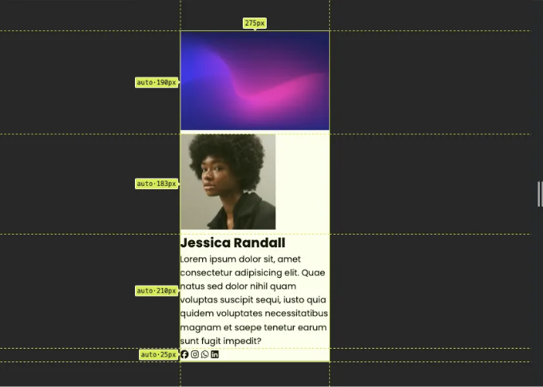

# 소개

이 글에서는 위에 표시된 프로필 카드의 코딩을 안내해 드릴 예정입니다. 다양한 방법이 있겠지만, 저는 강력한 레이아웃 기능을 갖춘 CSS Grid를 활용하기로 결정했습니다. 이 과정에서 배치와 스타일링에 대한 제 생각을 공유하고, 시각 자료를 통해 이해를 돕겠습니다. 시작해 봅시다.

# 시멘틱한 HTML 구조 디자인

<!-- ui-log 수평형 -->

<ins class="adsbygoogle"
      style="display:block"
      data-ad-client="ca-pub-4877378276818686"
      data-ad-slot="9743150776"
      data-ad-format="auto"
      data-full-width-responsive="true"></ins>
<component is="script">
(adsbygoogle = window.adsbygoogle || []).push({});
</component>

일부 사람들은 코딩에 바로 뛰어들기를 선호할 수 있지만, HTML/CSS로 복제하는 이미지의 구성 요소 주변에 상자를 그리는 것이 도움이 된다고 생각합니다. 이 접근 방식은 서로 다른 요소들이 어떻게 상호 작용하는지 더 명확하게 이해하고 스타일링 측면을 미리 고려할 수 있게 도와줍니다. 위 이미지에 대해 다음 구조를 개요로 설명해드리겠습니다:


처음부터, 내가 컨테이너가 모든 요소를 포함하며 부모 클래스 역할을 할 것으로 인식함으로써, 해당 위치/표시와 상위 컨테이너(html, body)와의 관계를 고려하고, 해당 자식 요소들이 어떻게 배열될지 고민하게 됩니다. 그러나 이러한 세부사항에 대해 파헤치기 전에 HTML 구조를 정리해봅시다. 컨테이너부터 시작하여 "card-container"라는 이름으로 지칭할 것이며, body 내에 위치하여 body를 그의 부모로 만듭니다:

```js
<body>
    <!-- 카드는 여기서 시작 -->
    <article class="card-container">

    </article>
    <!-- 카드는 여기서 끝 -->
</body>
```

<!-- ui-log 수평형 -->

<ins class="adsbygoogle"
      style="display:block"
      data-ad-client="ca-pub-4877378276818686"
      data-ad-slot="9743150776"
      data-ad-format="auto"
      data-full-width-responsive="true"></ins>
<component is="script">
(adsbygoogle = window.adsbygoogle || []).push({});
</component>

이제 이 컨테이너 상단에 잘 보이는 이미지들에 주의를 기울이고 있어요. 그 이미지들을 통합하기 위해, 배경 이미지와 프로필 이미지를 설정할 계획이에요. 각 이미지는 아래에 보여지는 대로 고유한 컨테이너 안에 담겨질 거에요:

```js
    <!-- 카드 시작 -->
    <article class="card-container">
        <figure class="bg-img">
           
        </figure>
        <figure class="profile-img">
            
        </figure>
    </article>
    <!-- 카드 끝 -->
```


이미지 다음에 프로필 카드의 내용에 대한 섹션이 있는 것을 알아봤어요. 이 내용을 위한 컨테이너를 만들고, 설명을 담당하는 `p` 태그와 이름을 담당하는 헤더 태그를 포함할 거에요.

<!-- ui-log 수평형 -->

<ins class="adsbygoogle"
      style="display:block"
      data-ad-client="ca-pub-4877378276818686"
      data-ad-slot="9743150776"
      data-ad-format="auto"
      data-full-width-responsive="true"></ins>
<component is="script">
(adsbygoogle = window.adsbygoogle || []).push({});
</component>

```json
    "card": {
        "article": "card-container",
        "bg-img": "bg-img",
        "bg-image": "bg-image",
        "profile-img": "profile-img",
        "profile-pic": "profile-pic",
        "profile-info": "profile-info",
        "profile-name": "profile-name",
        "profile-bio": "profile-bio"
    }
```

라이브 서버에서는 다음을 볼 수 있어요:


마지막으로 소셜 링크 섹션을 추가할 거예요. 만약 이미지에 표시된 아이콘을 사용하고 싶다면 FontAwesome를 방문해보세요. 아래와 같이 설명된 서치 박스를 찾을 수 있을 거예요:

<!-- ui-log 수평형 -->

<ins class="adsbygoogle"
      style="display:block"
      data-ad-client="ca-pub-4877378276818686"
      data-ad-slot="9743150776"
      data-ad-format="auto"
      data-full-width-responsive="true"></ins>
<component is="script">
(adsbygoogle = window.adsbygoogle || []).push({});
</component>

```js
<!DOCTYPE html>
<html lang="en">
<head>
    <meta charset="UTF-8">
    <meta name="viewport" content="width=device-width, initial-scale=1.0">
    <title>Profile Card</title>
    <link rel="stylesheet" href="/styles/styles.css">
    <script src="https://kit.fontawesome.com/8695b27503.js" crossorigin="anonymous"></script>
</head>
```

그 링크를 복사한 다음 아래와 같이 html 파일의 head 부분에 추가하십시오

그 이후에는 무료 아이콘에 액세스할 수 있게 될 것입니다. 그 다음으로, 이들을 소셜 미디어 계정에 링크로 사용할 것이기 때문에 아이콘들을 a 태그 안에 삽입해야 합니다. 대략 4에서 5개의 계정이 있기 때문에 이들은 각자의 컨테이너에 그룹화하는 것이 좋습니다. 의미론적으로 명확하게 하기 위해, 개별적인 소셜 미디어 계정을 위한 링크가 있는 nav 요소 안에 위치시키는 것이 최선의 방법입니다.

<!-- ui-log 수평형 -->

<ins class="adsbygoogle"
      style="display:block"
      data-ad-client="ca-pub-4877378276818686"
      data-ad-slot="9743150776"
      data-ad-format="auto"
      data-full-width-responsive="true"></ins>
<component is="script">
(adsbygoogle = window.adsbygoogle || []).push({});
</component>

```js
<nav class="social-links">
  <a class="fa-brands fa-facebook"> </a>
  <a class="fa-brands fa-instagram"> </a>
  <a class="fa-brands fa-whatsapp"> </a>
  <a class="fa-brands fa-linkedin"> </a>
</nav>
```

위 코드는 우리 작업의 HTML 섹션을 완료했습니다. 라이브 서버에서 다음을 렌더링해야 합니다:


# 프로필 카드 위치 지정 및 스타일링하기

<!-- ui-log 수평형 -->

<ins class="adsbygoogle"
      style="display:block"
      data-ad-client="ca-pub-4877378276818686"
      data-ad-slot="9743150776"
      data-ad-format="auto"
      data-full-width-responsive="true"></ins>
<component is="script">
(adsbygoogle = window.adsbygoogle || []).push({});
</component>

위치 및 스타일링을 강조하는데요, 요소들의 외관 뿐만 아니라 위치 및 다른 요소들과의 관계를 고려하는 것이 중요합니다. 저의 방식은 HTML의 현재 상태를 평가하고 원하는 결과물을 상상하는 것으로 시작합니다. 각 요소를 체계적으로 매핑하고 최종 결과물을 얻기 위한 필요한 단계를 결정하는 것을 포함합니다. 아래 매핑을 확인할 수 있어요:


Universal Base 설정: 모든 요소를 원점에 맞추기

나는 여기에 모든 요소에 대한 여백(margins)과 간격(padding)을 0으로 설정하고, 모든 요소에 border-box 모델을 적용하여 깔끔한 시작을 선호합니다. 또한 모든 텍스트가 있는 요소에 글ꔾ르가 적용되도록하고 싶어요. 이 방식을 통해 요소가 예상대로 동작하며 크기를 조절하거나 다른 수정을 했을 때 예상대로 작동합니다. border-box 모델 및 이점에 대해 궁금하다면, 이 기사를 읽는 것을 추천해요.

<!-- ui-log 수평형 -->

<ins class="adsbygoogle"
      style="display:block"
      data-ad-client="ca-pub-4877378276818686"
      data-ad-slot="9743150776"
      data-ad-format="auto"
      data-full-width-responsive="true"></ins>
<component is="script">
(adsbygoogle = window.adsbygoogle || []).push({});
</component>

```js
* {
    margin: 0;
    padding: 0;
    box-sizing: border-box;
    font-family: 'Poppins', 'sans-serif';
}
```

위의 조정을 설정하면 해당 요소가 상위 클래스에 속하기 때문에 요소가 좌측 상단에 위치합니다. 모든 요소에 대해 마진 및 패딩을 0으로 설정하고, 마진이나 패딩이 없는 부모 요소인 html/body에 대해도 동일하게 설정하면 초기 위치가 0,0 좌표로 기본 설정되어 상단 좌측에 정렬됩니다. 렌더링 결과는 아래와 같아야 합니다:


HTML/Body 요소 중앙 정렬하기

<!-- ui-log 수평형 -->

<ins class="adsbygoogle"
      style="display:block"
      data-ad-client="ca-pub-4877378276818686"
      data-ad-slot="9743150776"
      data-ad-format="auto"
      data-full-width-responsive="true"></ins>
<component is="script">
(adsbygoogle = window.adsbygoogle || []).push({});
</component>

HTML과 Body 요소는 내 카드의 핵심 컨테이너로 작용하여 카드를 중앙 정렬하고 컨테이너 클래스를 통해 자식 구성 요소를 효과적으로 관리할 수 있게 해줍니다. 이 접근 방식을 통해 웹 페이지 전반에 걸쳐 카드의 위치 및 정렬을 제어할 수 있습니다. 명확한 구분을 위해 body에 배경 색상을 적용하고 카드 컨테이너에는 흰색 배경 색상을 적용할 것입니다:

```js
html, body {
    background-color: #282828;
}
.card-container {
  background-color: white;
}
```

이 시각적 도움은 body를 포괄하는 컨테이너와 배경 사진, 프로필 사진, 정보, 소셜 링크 등 카드의 모든 요소를 포함하는 카드 컨테이너를 구분하는 데 도움이 됩니다. 카드 컨테이너는 화면 너비를 늘리고 내용 높이에 걸쳐 커버하며 이것은 블록 요소의 기본 동작입니다. 제 역할은 곧 이것을 exemplar와 유사하게 보이도록 작게 만드는 것입니다.

HTML/Body를 viewport(보는 브라우저 화면)로 설정하세요.

<!-- ui-log 수평형 -->

<ins class="adsbygoogle"
      style="display:block"
      data-ad-client="ca-pub-4877378276818686"
      data-ad-slot="9743150776"
      data-ad-format="auto"
      data-full-width-responsive="true"></ins>
<component is="script">
(adsbygoogle = window.adsbygoogle || []).push({});
</component>

다음으로 일반적으로 html/body 컨테이너의 너비와 높이를 정의하여 전체 브라우저 창을 채울 수 있도록 합니다. 너비: 100vw 및 높이: 100vh를 사용하여 html 및 body 요소에 적용하면 화면 전체를 채우는 뷰포트 레이아웃을 구현할 수 있습니다. 이 방법은 너비와 높이를 100%로 설정하는 것과 같아서 웹페이지가 화면의 모든 공간을 활용하도록 보장합니다. 결과적으로, 내부 요소들은 전체 뷰포트 공간의 100%를 할당받은 부모 컨테이너 내에서 동작하여 반응형 레이아웃을 디자인하기 위한 확장 가능한 기초를 만듭니다. 이것은 어떠한 하위 요소도 전체 뷰포트 캔버스에 대한 상대적인 크기 및 위치를 지정하여 페이지 레이아웃을 정밀하게 제어할 수 있도록 해줍니다. 이는 그 결과로 페이지 레이아웃을 정확하게 제어하고 콘텐츠가 다양한 화면 크기에서 일관되게 표시되도록 보장합니다.

html/body가 부모 컨테이너로 작용하기 때문에, 자식 요소인 카드에 그리드 레이아웃을 사용할 계획입니다. 그리드를 사용하면 컴포넌트의 쉬운 가운데 정렬과 계획적인 배치가 가능합니다. 그리드에 대해 더 자세히 알고 싶다면 여기를 클릭하세요.

<!-- ui-log 수평형 -->

<ins class="adsbygoogle"
      style="display:block"
      data-ad-client="ca-pub-4877378276818686"
      data-ad-slot="9743150776"
      data-ad-format="auto"
      data-full-width-responsive="true"></ins>
<component is="script">
(adsbygoogle = window.adsbygoogle || []).push({});
</component>

```js
html, body {
    width: 100vw;
    height: 100vh;
    display: grid;
    background-color: #282828;
}
```

html/body 컨테이너의 직계 자식요소가 하나뿐이기 때문에 레이아웃 템플릿에서는 특히 해당 요소의 열 구성에 집중해야 합니다.

```js
html, body {
    width: 100vw;
    height: 100vh;
    display: grid;
    grid-template-columns: 1fr;
    background-color: #282828;
}
```

위에서 볼 수 있듯이, 컨테이너가 전체 화면을 채우는 것을 확인할 수 있습니다. 이는 1fr 설정이 단일 요소에 전체 열 그리드 공간을 할당하고 있음을 효과적으로 나타내고 있습니다. 아래는 이 개념을 설명하는 그림입니다:```

<!-- ui-log 수평형 -->

<ins class="adsbygoogle"
      style="display:block"
      data-ad-client="ca-pub-4877378276818686"
      data-ad-slot="9743150776"
      data-ad-format="auto"
      data-full-width-responsive="true"></ins>
<component is="script">
(adsbygoogle = window.adsbygoogle || []).push({});
</component>


다음으로 align-content를 조정합니다:

```js
html, body {
    width: 100vw;
    height: 100vh;
    display: grid;
    grid-template-columns: 1fr;
    align-content: center;
    background-color: #282828;
}
```

align-content: center;는 이 콘텐츠가 수직으로 가운데 정렬되도록 하며, 이는 콘텐츠가 수직 공간을 적게 차지하기 때문에 "적합하다"는 느낌을 줄 수 있습니다. 이것은 더 큰 컨테이너 내에서 가운데 정렬됩니다.

<!-- ui-log 수평형 -->

<ins class="adsbygoogle"
      style="display:block"
      data-ad-client="ca-pub-4877378276818686"
      data-ad-slot="9743150776"
      data-ad-format="auto"
      data-full-width-responsive="true"></ins>
<component is="script">
(adsbygoogle = window.adsbygoogle || []).push({});
</component>


프로필 컨테이너

이제 프로필 컨테이너로 넘어가겠습니다. 현재는 HTML/Body 컨테이너의 너비의 100%를 차지합니다. 이것보다 훨씬 줄여야 하기 때문에, 그럼 절반 정도만 주겠습니다:


<!-- ui-log 수평형 -->

<ins class="adsbygoogle"
      style="display:block"
      data-ad-client="ca-pub-4877378276818686"
      data-ad-slot="9743150776"
      data-ad-format="auto"
      data-full-width-responsive="true"></ins>
<component is="script">
(adsbygoogle = window.adsbygoogle || []).push({});
</component>


그림을 가운데 정렬하기 위해 HTML/Body 요소로 돌아가서 항목을 가운데로 정렬해야 합니다:

```css
html,
body {
  width: 100%;
  height: 100%;
  display: grid;
  grid-template-columns: 1fr;
  align-content: center;
  justify-items: center;
  background-color: #282828;
}
```


<!-- ui-log 수평형 -->

<ins class="adsbygoogle"
      style="display:block"
      data-ad-client="ca-pub-4877378276818686"
      data-ad-slot="9743150776"
      data-ad-format="auto"
      data-full-width-responsive="true"></ins>
<component is="script">
(adsbygoogle = window.adsbygoogle || []).push({});
</component>

자, 지금 우리는 모든 가시적 콘텐츠를 자식 요소로 포함하는 프로필 컨테이너 내에서 작업 중이라는 것을 상기해봅시다. 이 설정을 통해 우리는 구조화된 그리드로 요소들을 다음과 같이 구성할 수 있게 됩니다:

```js
.card-container {
  background-color: white;
  width: 25%;
  display: grid;
  grid-template-rows: repeat(4, auto);
}
```



display: grid 및 grid-template-rows: repeat(4, auto)를 설정함으로써 각 요소에 대한 구분된 셀을 생성했습니다. 각 요소는 자체 행을 차지합니다. 행의 크기가 'auto'로 설정되어 있기 때문에 해당 행은 자동으로 컨텐츠의 크기에 맞게 조정됩니다. 예를 들어, 여성의 사진은 자체 행을 차지하며 그림의 치수에 맞게 크기가 조정됩니다.

<!-- ui-log 수평형 -->

<ins class="adsbygoogle"
      style="display:block"
      data-ad-client="ca-pub-4877378276818686"
      data-ad-slot="9743150776"
      data-ad-format="auto"
      data-full-width-responsive="true"></ins>
<component is="script">
(adsbygoogle = window.adsbygoogle || []).push({});
</component>

컨테이너에 적용해야 할 몇 가지 다른 사항들은 보다 부드러운 테두리를 주고, 흰색 대신 더 정확한 배경색을 지정하며, 배경 그림자를 추가하는 것입니다. 이 스타일링 포인트들을 조절해야 할 것이지만, 아래에 제시한 내용이 우리를 꽤 가깝게 이끌어 줍니다:

```js
.container {
  width: 25%;
  display: grid;
  grid-template-rows: repeat(4, auto);
  border-radius: 1.5%;
  box-shadow: 0 4px 8px rgba(255, 255, 255, 0.1);
  background-color: rgb(238, 238, 238);
}
```

배경 이미지


<!-- ui-log 수평형 -->

<ins class="adsbygoogle"
      style="display:block"
      data-ad-client="ca-pub-4877378276818686"
      data-ad-slot="9743150776"
      data-ad-format="auto"
      data-full-width-responsive="true"></ins>
<component is="script">
(adsbygoogle = window.adsbygoogle || []).push({});
</component>

```js
.card-image img {
  width: 100%;
  height: 100%;
  border-top-left-radius: 5px;
  border-top-right-radius: 5px;
  object-fit: cover;
}
```

- width: 100%;은 이미지가 포함하는 컨테이너의 전체 너비에 걸쳐 늘어날 수 있도록 보장합니다. 그리드 셀 전체를 가로로 늘리도록 합니다.
- height: 100%;은 비슷하게, 이미지가 컨테이너의 전체 높이를 채우도록 합니다. 그리드 컨텍스트에서 이 이미지가 한 줄을 차지하는 경우, 높이를 100%로 설정하면 이미지가 그 행의 전체 세로 공간을 채우도록 합니다.
- object-fit: cover;는 배경 이미지에 매우 중요합니다. 이미지가 늘어지거나 뭉개지지 않고 공간을 채우도록 합니다. 이미지 모양이 정확히 들어맞지 않는 경우, 이 설정은 이미지의 일부 가장자리를 자르므로 빈 공간 없이 전체 영역을 채웁니다.


프로필 이미지

<!-- ui-log 수평형 -->

<ins class="adsbygoogle"
      style="display:block"
      data-ad-client="ca-pub-4877378276818686"
      data-ad-slot="9743150776"
      data-ad-format="auto"
      data-full-width-responsive="true"></ins>
<component is="script">
(adsbygoogle = window.adsbygoogle || []).push({});
</component>

저희 모델 디자인에서는 프로필 이미지가 배경 위에 나타납니다. 이 레이어 구조를 유지하기 위해 이미지를 항상 최상위에 위치시키고 배경은 그 아래에 두도록 조정합니다. 이렇게 함으로써 프로필 사진이 배경에 대조적으로 돋보이는 시각적인 분리가 만들어집니다:


이를 CSS에서 다음과 같이 설정하여 구현합니다:

```css
.profile-img img {
  position: relative;
  z-index: 1;
}
```

<!-- ui-log 수평형 -->

<ins class="adsbygoogle"
      style="display:block"
      data-ad-client="ca-pub-4877378276818686"
      data-ad-slot="9743150776"
      data-ad-format="auto"
      data-full-width-responsive="true"></ins>
<component is="script">
(adsbygoogle = window.adsbygoogle || []).push({});
</component>

이 설정에서 position: relative;은 프로필 이미지의 위치를 일반적으로 있는 곳에서 조절할 수 있게 해줍니다 (여전히 top, left, bottom, right로 이동해야 합니다), 그리고 z-index: 1;은 이 이미지가 배경과 같은 다른 요소 위에 나타나도록 해줍니다.

bottom: 100%;와 margin-bottom: -20%를 사용하여 이미지를 배경의 중심 아래에 약간 위치시키고 이미지와 bio 사이에 깊은 간격을 제거했습니다.


```css
.profile-img img {
  position: relative;
  z-index: 1;
  bottom: 100%;
  margin-bottom: -20%;
}
```

<!-- ui-log 수평형 -->

<ins class="adsbygoogle"
      style="display:block"
      data-ad-client="ca-pub-4877378276818686"
      data-ad-slot="9743150776"
      data-ad-format="auto"
      data-full-width-responsive="true"></ins>
<component is="script">
(adsbygoogle = window.adsbygoogle || []).push({});
</component>

다음으로 프로필 이미지를 가운데 정렬했습니다:

```js
.profile-img img {
  position: relative;
  z-index: 1;
  bottom: 110%;
  margin-bottom: -20%;
  display: block;
  margin-left: auto;
  margin-right: auto;
}
```

- display: block; 속성은 요소를 블록 수준 요소로 만들어 부모 컨테이너의 전체 너비를 차지할 수 있게 합니다. 이는 필요한 만큼 너비를 차지하는 인라인 요소와 달리 블록 레벨 요소로 설정하는 것이 중요합니다. 이는 가로 중앙 정렬을 위해 margin-left: auto; 및 margin-right: auto;가 블록 수준 요소에만 작동하기 때문입니다.
- margin-left: auto; 및 margin-right: auto; 속성은 요소의 왼쪽과 오른쪽에 같은 여백을 자동으로 계산하여 부모 컨테이너 내에서 요소를 가운데 정렬합니다. 이미지, div 또는 섹션과 같은 요소를 페이지나 컨테이너의 중앙에 수평으로 정렬하는 데 널리 사용되는 기술입니다.

당연히 다음 단계는 border-radius와 흰색 테두리를 적용하는 것일 것입니다.

<!-- ui-log 수평형 -->

<ins class="adsbygoogle"
      style="display:block"
      data-ad-client="ca-pub-4877378276818686"
      data-ad-slot="9743150776"
      data-ad-format="auto"
      data-full-width-responsive="true"></ins>
<component is="script">
(adsbygoogle = window.adsbygoogle || []).push({});
</component>

```js
.profile-img img {
  position: relative;
  z-index: 1;
  bottom: 110%;
  margin-bottom: -20%;
  display: block;
  margin-left: auto;
  margin-right: auto;
  border-radius: 50%;
  border: #fff 10px solid;
}
```


카드 콘텐츠의 헤더


```

<!-- ui-log 수평형 -->

<ins class="adsbygoogle"
      style="display:block"
      data-ad-client="ca-pub-4877378276818686"
      data-ad-slot="9743150776"
      data-ad-format="auto"
      data-full-width-responsive="true"></ins>
<component is="script">
(adsbygoogle = window.adsbygoogle || []).push({});
</component>

저희 그리드 레이아웃의 세 번째 행 안에는 독립적인 컨테이너 역할을 하는데, 여기서는 더 자세한 레이아웃을 위해 Flexbox나 Grid를 사용할 수 있어요. 그러나 우리의 목적에 맞게 간단하게 유지할 거에요. 텍스트 요소의 위치를 상대적으로 설정하여 세로 위치를 조절하면, 프로필 사진 위에 가깝게 텍스트를 배치할 수 있어요. margin-top: -15%;를 적용하여 프로필 이미지와 텍스트 사이의 간격을 줄이고, text-align: center;로 텍스트를 가운데 정렬하여 프로필 정보 영역을 균형있고 집중적으로 만들 수 있어요.

```js
.profile-info h2 {
  position: relative;
  font-size: 20px;
  text-align: center;
  margin-top: -15%;
}
```


바이오그래피 콘텐츠가 자신을 감싸는 공간 안에서 깔끔하게 중앙에 정렬되고 텍스트와 경계 사이에 편안한 여백을 만들기 위해 중앙 정렬과 패딩을 적용할 거에요.

<!-- ui-log 수평형 -->

<ins class="adsbygoogle"
      style="display:block"
      data-ad-client="ca-pub-4877378276818686"
      data-ad-slot="9743150776"
      data-ad-format="auto"
      data-full-width-responsive="true"></ins>
<component is="script">
(adsbygoogle = window.adsbygoogle || []).push({});
</component>

```js
.profile-info p {
  text-align: center;
  padding: 2%;
}
```


소셜 링크

동일한 방식으로, 먼저 가운데 정렬 및 크기 조정:

<!-- ui-log 수평형 -->

<ins class="adsbygoogle"
      style="display:block"
      data-ad-client="ca-pub-4877378276818686"
      data-ad-slot="9743150776"
      data-ad-format="auto"
      data-full-width-responsive="true"></ins>
<component is="script">
(adsbygoogle = window.adsbygoogle || []).push({});
</component>

```css
.social-links {
  padding: 20px;
  text-align: center;
}
```


"border-box" 모델을 상기하면 내용 영역은 파란색으로 강조되고, 패딩은 초록색으로 표시됩니다. 여기서 20px의 패딩을 적용했습니다. 이 조정으로 링크가 화면 가장자리에서 멀리 위치하도록 했습니다.


<!-- ui-log 수평형 -->

<ins class="adsbygoogle"
      style="display:block"
      data-ad-client="ca-pub-4877378276818686"
      data-ad-slot="9743150776"
      data-ad-format="auto"
      data-full-width-responsive="true"></ins>
<component is="script">
(adsbygoogle = window.adsbygoogle || []).push({});
</component>

```js
.social-links a {
  padding: 0% 5%;
  font-size: 2rem;
  color: #ED1ABE;
}
```

우리는 소셜 링크 컨테이너의 각 앵커 태그에 패딩을 설정하여 적절한 간격을 확보합니다. 특히 오른쪽에 패딩을 적용하는 데 중점을 둡니다. 의도적으로 왼쪽, 위, 아래에 의도치 않은 간격이 발생하는 것을 피해 일관된 깔끔한 레이아웃을 구현합니다. 최종 렌더링은 다음과 같이 나타날 것입니다:


# 보너스: 링크에 호버 효과 추가하기

<!-- ui-log 수평형 -->

<ins class="adsbygoogle"
      style="display:block"
      data-ad-client="ca-pub-4877378276818686"
      data-ad-slot="9743150776"
      data-ad-format="auto"
      data-full-width-responsive="true"></ins>
<component is="script">
(adsbygoogle = window.adsbygoogle || []).push({});
</component>


호버 효과를 구현하려면, 각 앵커 태그에 :hover 가상 클래스를 적용하기만 하면 됩니다. 이 상태에서 정의된 스타일은 요소의 기본 모양을 변경합니다. 우리의 목적을 위해, 이는 글꼴 색상을 변경하고 호버 시 요소를 약간 확대하는 변형을 적용하는 것을 의미합니다.

```js
.social-links a:hover {
  color: #31006B;
  transform: scale(1.5);
}
```
