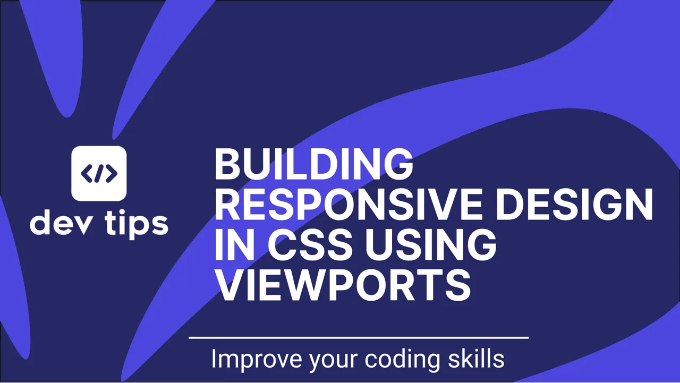
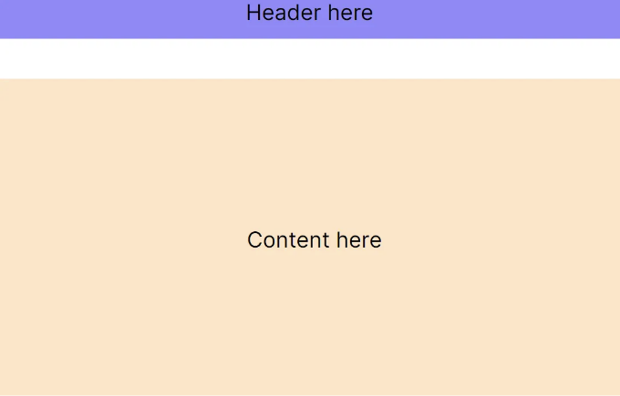
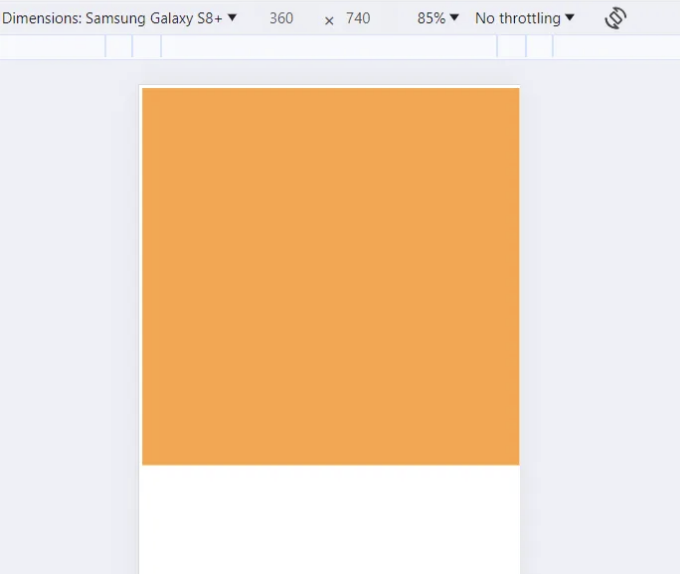
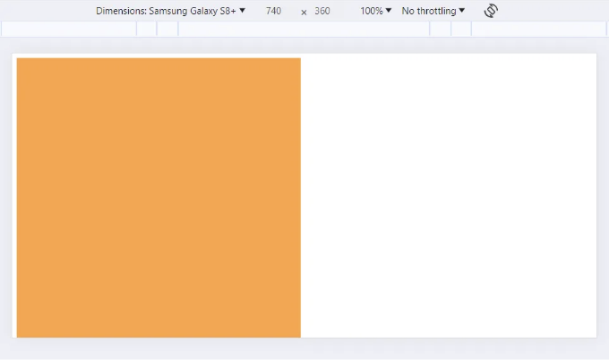
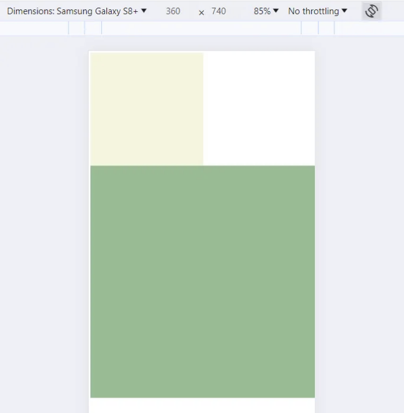
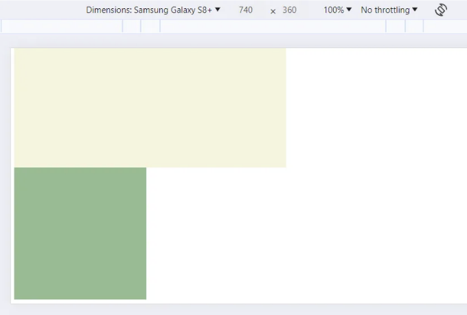

# 소개

레스폰시브 디자인은 화면 크기에 관계없이 웹 콘텐츠가 잘 보이고 작동하는 것을 보장합니다. 이러한 디자인은 현대 웹 애플리케이션에서 반드시 필요한 요소입니다. 레스폰시브 디자인을 구현하는 다양한 도구 중 하나는 뷰포트 단위인 vw, vh, vmin, vmax, vi, vb, s, l, d 및 그들의 조합 등을 사용하는 것입니다. 총 24개의 뷰포트 단위가 있습니다. 이 블로그 포스트에서는 이러한 단위를 어떻게 사용하고 언제 사용해서 적응형 디자인을 만들 수 있는지 설명합니다.

# CSS에서 뷰포트 단위란 무엇인가?

<!-- ui-log 수평형 -->

<ins class="adsbygoogle"
      style="display:block"
      data-ad-client="ca-pub-4877378276818686"
      data-ad-slot="9743150776"
      data-ad-format="auto"
      data-full-width-responsive="true"></ins>
<component is="script">
(adsbygoogle = window.adsbygoogle || []).push({});
</component>

CSS에서 뷰포트 단위는 콘텐츠를 렌더링하기 위해 웹 브라우저에서 사용 가능한 화면 크기의 백분율입니다. 뷰포트는 화면 크기에 관계없이 요소, 글꼴 및 간격의 크기를 유동적으로 조정할 수 있는 방식을 제공합니다.

가장 일반적인 뷰포트 단위는 다음과 같습니다: vw와 vh:

- vw(뷰포트 너비)는 뷰포트 너비의 1%와 같습니다.
- vh(뷰포트 높이)는 뷰포트 높이의 1%와 같습니다.

픽셀을 사용하여 헤더 요소를 생성할 때, 다양한 화면 크기에서 일정한 높이를 갖습니다:

<!-- ui-log 수평형 -->

<ins class="adsbygoogle"
      style="display:block"
      data-ad-client="ca-pub-4877378276818686"
      data-ad-slot="9743150776"
      data-ad-format="auto"
      data-full-width-responsive="true"></ins>
<component is="script">
(adsbygoogle = window.adsbygoogle || []).push({});
</component>

```css
header {
  width: 100%;
  height: 100px;
}
```

헤더를 더 반응형으로 만들어 보겠습니다. 동적 높이를 10vh로 지정하여 화면 크기에 따라 헤더가 화면 크기의 10%를 차지하게 됩니다:

```html
<style>
  header {
    width: 100%;
    height: 10vh;
    text-align: center;
    background-color: #9089fc;
  }

  main {
    width: 100vw;
    height: 80vh;
    margin-top: 10vh;
    background-color: bisque;
    display: flex;
    flex-direction: column;
    align-items: center;
    justify-content: center;
  }
</style>

<body>
  <header>헤더 여기에</header>
  <main>콘텐츠 여기에</main>
</body>
```


```

<!-- ui-log 수평형 -->

<ins class="adsbygoogle"
      style="display:block"
      data-ad-client="ca-pub-4877378276818686"
      data-ad-slot="9743150776"
      data-ad-format="auto"
      data-full-width-responsive="true"></ins>
<component is="script">
(adsbygoogle = window.adsbygoogle || []).push({});
</component>

잠깐만요! CSS에는 퍼센트(%) 단위가 있습니다. 다음 예제에서는 헤더가 화면의 가로 길이를 채우도록 만듭니다. 이것이 vw와 vh와 어떻게 다른가요? 퍼센트 단위는 부모 요소의 크기를 기준으로 하지만 뷰포트 단위는 항상 기기의 화면 크기를 기준으로 합니다.

# vw, vh 뷰포트 단위 사용하기

vw와 vh를 사용하여 반응형 디자인을 만드는 몇 가지 예제를 살펴보겠습니다:

배경 이미지가 있는 전체 화면 섹션을 만들어, 뷰포트의 높이와 너비에 맞게 조정합니다:

<!-- ui-log 수평형 -->

<ins class="adsbygoogle"
      style="display:block"
      data-ad-client="ca-pub-4877378276818686"
      data-ad-slot="9743150776"
      data-ad-format="auto"
      data-full-width-responsive="true"></ins>
<component is="script">
(adsbygoogle = window.adsbygoogle || []).push({});
</component>

```css
main {
  width: 100vw;
  height: 100vh;
  background: url("배경이미지.png") no-repeat center center;
  background-size: cover;
}
```

뷰포트 크기에 상대적인 요소 간의 공간을 조정하여 보다 적응적인 레이아웃을 만드세요:

```css
.container {
  padding: 5vh 5vw;
}
.section {
  margin-bottom: 2vh;
}
```

장치별로 텍스트가 비율을 유지하기 위해 뷰포트 단위를 사용하여 글꼴 크기를 조정하는 것이 유혹스러울 수 있습니다.```

<!-- ui-log 수평형 -->

<ins class="adsbygoogle"
      style="display:block"
      data-ad-client="ca-pub-4877378276818686"
      data-ad-slot="9743150776"
      data-ad-format="auto"
      data-full-width-responsive="true"></ins>
<component is="script">
(adsbygoogle = window.adsbygoogle || []).push({});
</component>

```css
body {
  font-size: 2vw;
}
```

하지만 글꼴 크기에 대해 vw만 사용하는 것은 매우 작은 화면이나 매우 큰 화면에서 글꼴 크기가 지나치게 작거나 크게 보일 수 있습니다. 일반적인 관행은 뷰포트 단위와 clamp() 함수를 결합하여 최소 및 최대 글꼴 크기를 설정하는 것입니다:

```css
body {
  font-size: clamp(16px, 2vw, 24px);
}
```

clamp() 함수는 body 요소의 글꼴 크기를 동적으로 조정하는 데 사용되며 세 매개변수가 전달됩니다:```

<!-- ui-log 수평형 -->

<ins class="adsbygoogle"
      style="display:block"
      data-ad-client="ca-pub-4877378276818686"
      data-ad-slot="9743150776"
      data-ad-format="auto"
      data-full-width-responsive="true"></ins>
<component is="script">
(adsbygoogle = window.adsbygoogle || []).push({});
</component>

- 최소값: 16px — 이것은 폰트의 가장 작은 크기입니다. 뷰포트가 얼마나 작아지든, 폰트 크기는 16픽셀 아래로 내려가지 않습니다.
- 기본값: 2vw — 이 값은 뷰포트 너비에 따라 동적으로 성장하고 축소되도록 합니다. 2vw는 뷰포트 너비의 2%를 의미하며, 화면 너비에 반응하여 폰트 크기를 조정합니다.
- 최대값: 24px — 이것은 폰트의 가장 큰 크기입니다. 뷰포트 너비가 매우 넓어지더라도, 폰트 크기가 24픽셀을 초과하지 않습니다.

# vmin, vmax 뷰포트 단위 사용

vmin과 vmax는 각각 뷰포트의 가장 작은 차원과 가장 큰 차원을 나타내는 뷰포트 단위입니다.

- vmin: 1vmin은 뷰포트의 작은 차원, 즉 너비 또는 높이의 1%에 해당합니다. 사용 가능한 공간 중에서 가장 작은 공간에 기반한 반응형 요소를 만드는 데 매우 유용합니다.
- vmax: 1vmax는 뷰포트의 큰 차원의 1%에 해당합니다. 큰 뷰포트에서 적극적으로 조절되어야 하지만 작은 뷰포트에서는 제한되어야 하는 디자인에 유용합니다.

<!-- ui-log 수평형 -->

<ins class="adsbygoogle"
      style="display:block"
      data-ad-client="ca-pub-4877378276818686"
      data-ad-slot="9743150776"
      data-ad-format="auto"
      data-full-width-responsive="true"></ins>
<component is="script">
(adsbygoogle = window.adsbygoogle || []).push({});
</component>

vmin과 vmax는 화면의 작은 값에 따라 전체 너비 또는 높이를 채우는 콘텐츠를 만드는 데 사용될 수 있어요.

다음 CSS는 가장 작은 뷰포트 차원과 동일한 크기의 정사각형 패널을 만들어냅니다:

```css
<style>
    main {
        width: 100vmin;
        height: 100vmin;
        background-color: #ffa33d;
    }
</style>

<body>
    <main></main>
</body>
```

스크린 크기가 360x740인 모바일 디바이스에서 이 패널은 전체 너비를 가지고 높이=360px가 될 거예요.

<!-- ui-log 수평형 -->

<ins class="adsbygoogle"
      style="display:block"
      data-ad-client="ca-pub-4877378276818686"
      data-ad-slot="9743150776"
      data-ad-format="auto"
      data-full-width-responsive="true"></ins>
<component is="script">
(adsbygoogle = window.adsbygoogle || []).push({});
</component>



가로 모드에서 패널은 전체 높이를 차지하고 너비는 360px가 됩니다.



# vi, vb Viewport 단위 사용하기

<!-- ui-log 수평형 -->

<ins class="adsbygoogle"
      style="display:block"
      data-ad-client="ca-pub-4877378276818686"
      data-ad-slot="9743150776"
      data-ad-format="auto"
      data-full-width-responsive="true"></ins>
<component is="script">
(adsbygoogle = window.adsbygoogle || []).push({});
</component>

모바일 폰을 수직 모드로 쥔다고 상상해봐요. 그리고 화면을 수평 모드로 전환하면, 화면 이미지가 회전되면서 폰이 수평 모드로 변해요.

- vi: Viewport inline 의 줄임말이에요. 1vi는 수평 쓰기 모드에서 뷰포트 너비의 1%를 의미하고, 수직 쓰기 모드에서는 뷰포트 높이의 1%를 의미해요.
- vb: Viewport block 의 줄임말이에요. 1vb는 수평 쓰기 모드에서 뷰포트 높이의 1%를, 수직 쓰기 모드에서는 뷰포트 너비의 1%를 의미해요.

수평 및 수직 모드에서 적응형 디자인을 정의하는 두 가지 CSS 클래스를 만들 수 있어요. 수평(가로) 모드에서는 수평으로 확대되며, 화면이 더 넓어지면 블록도 넓어져요. 수직 모드에서는 수직으로 확대되며, 화면이 더 높아지면 블록도 더 높아져요.

```js
<style>
.container-horizontal {
    width: 50vi; /* 50vw 와 같아요 */
    height: 50vi;
    background-color: beige;
}

.container-vertical {
    width: 50vb;
    height: 50vb; /* 50vh 와 같아요 */
    background-color: darkseagreen;
}
</style>

<body>
    <div class="container-horizontal"></div>
    <div class="container-vertical"></div>
</body>
```

<!-- ui-log 수평형 -->

<ins class="adsbygoogle"
      style="display:block"
      data-ad-client="ca-pub-4877378276818686"
      data-ad-slot="9743150776"
      data-ad-format="auto"
      data-full-width-responsive="true"></ins>
<component is="script">
(adsbygoogle = window.adsbygoogle || []).push({});
</component>

여기서 수평 컨테이너는 화면 너비의 50% 크기로 항상 정사각형이고, 화면이 수평 또는 수직 모드인지에 따라 높이가 달라집니다.



수직 컨테이너는 화면 높이의 50% 크기로 항상 정사각형이고, 화면이 수평 또는 수직 모드인지에 따라 너비가 달라집니다.



<!-- ui-log 수평형 -->

<ins class="adsbygoogle"
      style="display:block"
      data-ad-client="ca-pub-4877378276818686"
      data-ad-slot="9743150776"
      data-ad-format="auto"
      data-full-width-responsive="true"></ins>
<component is="script">
(adsbygoogle = window.adsbygoogle || []).push({});
</component>

# s, l, d Viewport Modifiers 사용하기

지금까지 6개의 viewport CSS 단위를 배웠습니다. 뷰포트 단위는 정적인 뷰포트 크기에만 작동하며, 뷰포트 크기가 변하는 경우에 대응할 수 없습니다. 이와 같은 사용 사례의 완벽한 예는 다시 한 번 휴대전화입니다. 모바일 브라우저에서 페이지를 스크롤할 때 URL 바가 사라지는 것을 주목한 적이 있나요? 페이지를 아래로 스크롤할 때 URL 바가 사라지고, 다시 위로 스크롤하면 나타납니다. URL 바의 유무에 따라 뷰포트 크기가 변경되며, 때로는 요소의 크기를 약간 조정해야 할 필요가 있습니다.

여기서 s, l 및 d 뷰포트 수정자가 구출합니다.

- s: 이것은 작은 뷰포트 수정자입니다. URL 바가 표시될 때 뷰포트의 크기입니다.
- l: 이것은 큰 뷰포트 수정자입니다. URL 바가 숨겨진 상태의 뷰포트 크기입니다.
- d: 이것은 동적 뷰포트 수정자입니다. URL 바의 표시 여부에 따라 변하는 현재 뷰포트의 크기입니다.

<!-- ui-log 수평형 -->

<ins class="adsbygoogle"
      style="display:block"
      data-ad-client="ca-pub-4877378276818686"
      data-ad-slot="9743150776"
      data-ad-format="auto"
      data-full-width-responsive="true"></ins>
<component is="script">
(adsbygoogle = window.adsbygoogle || []).push({});
</component>

기존 viewport CSS 단위에 이 수정 사항을 추가할 수 있어요:

s, l 및 d 수정자를 조합하여 총 24개의 viewport CSS 단위를 얻을 수 있어요:

```js
.container-small {
    /* URL 바가 표시될 때 화면 높이의 100vh와 동일함 */
    height: 100svh;
}

.container-large {
    /* URL 바가 숨겨진 상태에서 화면 높이의 100vh와 동일함 */
    height: 100lvh;
}

.container-dynamic {
    /* URL 바 표시 여부와 상관없이 화면 높이의 100vh와 동일함 */
    height: 100dvh;
}
```

# 요약

<!-- ui-log 수평형 -->

<ins class="adsbygoogle"
      style="display:block"
      data-ad-client="ca-pub-4877378276818686"
      data-ad-slot="9743150776"
      data-ad-format="auto"
      data-full-width-responsive="true"></ins>
<component is="script">
(adsbygoogle = window.adsbygoogle || []).push({});
</component>

뷰포트 CSS 단위는 반응형 디자인을 개발하는 데 탁월한 도구입니다. 레이아웃, 타이포그래피 및 간격의 유동적인 확대/축소를 허용하여 웹 콘텐츠가 어느 화면 크기에서든 잘 보이고 잘 작동하도록 보장합니다.

vw, vh, vmin 및 vmax와 같은 뷰포트 단위가 가장 일반적으로 사용됩니다. 매우 작고 매우 큰 화면 크기에서 요소의 최소 및 최대 크기를 제한하는 clamp() 함수 사용을 고려해보세요.

vi, vb와 뷰포트 수정자 s, l, d와 같은 뷰포트 단위는 특정한 사용 사례에 사용되지만 웹 개발자의 도구상자에 훌륭한 추가 요소입니다.

이 블로그 글이 유익하게 사용되기를 바라며. 즐거운 코딩하세요!

<!-- ui-log 수평형 -->

<ins class="adsbygoogle"
      style="display:block"
      data-ad-client="ca-pub-4877378276818686"
      data-ad-slot="9743150776"
      data-ad-format="auto"
      data-full-width-responsive="true"></ins>
<component is="script">
(adsbygoogle = window.adsbygoogle || []).push({});
</component>
