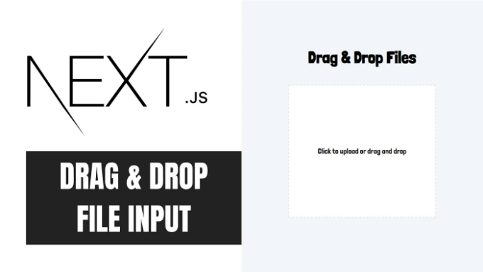

안녕하세요 여러분! 이번 포스트에서는 Next.js에서 드래그 앤 드롭 파일 업로드 컴포넌트를 만드는 방법을 안내해 드릴 거예요. 이 컴포넌트를 사용하면 사용자가 파일을 드래그하여 지정된 영역에 업로드하거나 전통적인 파일 선택 대화 상자를 사용하여 파일을 미리 볼 수 있습니다. 여기서는 이미지에 초점을 맞추지만 다른 파일 유형으로 확장할 수도 있어요.

# 단계 1: 프로젝트 설정하기

먼저 Next.js 프로젝트를 설정해보세요.

<!-- ui-log 수평형 -->

<ins class="adsbygoogle"
      style="display:block"
      data-ad-client="ca-pub-4877378276818686"
      data-ad-slot="9743150776"
      data-ad-format="auto"
      data-full-width-responsive="true"></ins>
<component is="script">
(adsbygoogle = window.adsbygoogle || []).push({});
</component>

```js
npx create-next-app@latest
```

# 단계 2: 드래그&드롭 파일 업로드 컴포넌트 생성하기

src/components 폴더 안에 file_upload.tsx 파일을 생성합시다.

Imports and Setup:

<!-- ui-log 수평형 -->

<ins class="adsbygoogle"
      style="display:block"
      data-ad-client="ca-pub-4877378276818686"
      data-ad-slot="9743150776"
      data-ad-format="auto"
      data-full-width-responsive="true"></ins>
<component is="script">
(adsbygoogle = window.adsbygoogle || []).push({});
</component>

- React에서 useState를 가져와서 시작합니다. 이 후크를 사용하면 컴포넌트의 상태를 관리할 수 있습니다.
- file: 이 상태 변수는 업로드된 파일의 URL을 저장합니다 (처음에는 비어 있음).
- fileEnter: 이 불리언 상태는 현재 파일이 드롭존 위로 끌려오고 있는지를 추적합니다 (처음에는 false). 이를 사용하여 드래그/드롭 컨테이너의 테두리 스타일을 업데이트하여 시각적으로 표시합니다.

```js
import { useState } from "react";

export const FileUpload = () => {
  const [file, setFile] = useState<string>();
  const [fileEnter, setFileEnter] = useState(false);

  // 컴포넌트 논리 구현은 여기에 작성합니다.
}
```

물론, 코드를 단계별로 분해해 보겠습니다:

## 드래그/드롭 컨테이너 및 입력:

<!-- ui-log 수평형 -->

<ins class="adsbygoogle"
      style="display:block"
      data-ad-client="ca-pub-4877378276818686"
      data-ad-slot="9743150776"
      data-ad-format="auto"
      data-full-width-responsive="true"></ins>
<component is="script">
(adsbygoogle = window.adsbygoogle || []).push({});
</component>

컨테이너에는 파일의 드래그 앤 드롭 이벤트를 처리하기 위한 다음과 같은 이벤트가 있습니다.

- onDragOver:

- 이 이벤트는 아이템이 드래그되면 드롭 영역 위로 이동할 때 트리거됩니다.
- e.preventDefault()는 브라우저의 기본 동작(더블 클릭 시 파일을 브라우저 창에서 열기)을 방지합니다.
- setFileEnter(true)는 파일이 드래그되어 드롭 영역 위로 올라와 있음을 나타내는 상태 변수 fileEnter를 true로 업데이트합니다.

2. onDragLeave 및 onDragEnd:

<!-- ui-log 수평형 -->

<ins class="adsbygoogle"
      style="display:block"
      data-ad-client="ca-pub-4877378276818686"
      data-ad-slot="9743150776"
      data-ad-format="auto"
      data-full-width-responsive="true"></ins>
<component is="script">
(adsbygoogle = window.adsbygoogle || []).push({});
</component>

- onDragLeave은 드래그된 항목이 드롭 영역을 떠날 때 트리거되며, onDragEnd는 드래그 작업이 취소될 때 트리거됩니다 (예: Escape 키를 눌러 작업을 취소할 때).
- 두 이벤트 모두 fileEnter를 false로 설정하여 더 이상 파일이 드롭 영역 위에 끌려가고 있지 않음을 나타냅니다.

3. onDrop:

- 이 이벤트는 드래그된 항목이 드롭 영역 위에 드롭될 때 트리거됩니다.
- e.preventDefault()는 브라우저의 기본 동작인 브라우저 창에서 드롭된 파일을 열지 않도록 합니다.
- setFileEnter(false)는 파일이 더 이상 드롭 영역 위에 끌려가고 있지 않음을 나타내기 위해 fileEnter를 false로 설정합니다.
- 조건문은 e.dataTransfer.items를 사용할 수 있는지 확인합니다. 사용할 수 있다면 드래그 작업에 파일이 포함되어 있는 것을 나타냅니다.
- e.dataTransfer.items가 존재한다면 forEach를 사용하여 각 항목을 반복합니다. 항목의 종류가 "file"인 경우 getFile()을 사용하여 파일 객체를 검색합니다. 또한, 파일 확장자를 캡처하고 특정 파일 유형만 수락하는 경우 오류를 throw하는 등 필요에 따라 파일에 대한 기타 처리를 수행할 수 있습니다.
- 그 다음, URL.createObjectURL()을 사용하여 파일에 대한 블롭 URL을 생성합니다. 이는 브라우저 메모리에 저장된 데이터를 가리키는 임시적이고 고유한 URL(블롭 URL이라고도 함)을 생성하는 데 사용됩니다. 이 데이터는 사용자 장치나 서버에 저장되지 않고 현재 브라우저 세션 내에서만 액세스할 수 있습니다. 그리고 setFile(blobUrl)을 사용하여 파일 상태 변수를 이 URL로 업데이트합니다.
- e.dataTransfer.items를 사용할 수 없는 경우, 드래그 작업이 직접 파일을 포함하고 있는 것입니다(아이템으로 이동하지 않은 것입니다).

4. JSX:

<!-- ui-log 수평형 -->

<ins class="adsbygoogle"
      style="display:block"
      data-ad-client="ca-pub-4877378276818686"
      data-ad-slot="9743150776"
      data-ad-format="auto"
      data-full-width-responsive="true"></ins>
<component is="script">
(adsbygoogle = window.adsbygoogle || []).push({});
</component>

- fileEnter 값에 따라 드래그/드롭 컨테이너 div의 테두리를 동적으로 조정합니다.
- label과 input 요소는 사용자가 클릭하여 수동으로 파일을 업로드할 수 있는 대체 방법을 제공합니다. label은 사용자가 클릭하여 파일을 업로드하도록 시각적으로 표시하고 지시하는 역할을 합니다.
- type="file"을 가진 input 요소는 숨겨져 있지만 여전히 작동하며, 사용자가 디바이스에서 파일을 클릭하고 선택할 수 있도록 합니다. 또한 드롭 기능에 대해 블롭 URL을 생성할 것입니다.

```js
<div className="container px-4 max-w-5xl mx-auto">
      {!file ? (
        <div
          onDragOver={(e) => {
            e.preventDefault();
            setFileEnter(true);
          }}
          onDragLeave={(e) => {
            setFileEnter(false);
          }}
          onDragEnd={(e) => {
            e.preventDefault();
            setFileEnter(false);
          }}
          onDrop={(e) => {
            e.preventDefault();
            setFileEnter(false);
            if (e.dataTransfer.items) {
              [...e.dataTransfer.items].forEach((item, i) => {
                if (item.kind === "file") {
                  const file = item.getAsFile();
                  if (file) {
                    let blobUrl = URL.createObjectURL(file);
                    setFile(blobUrl);
                  }
                  console.log(`items file[${i}].name = ${file?.name}`);
                }
              });
            } else {
              [...e.dataTransfer.files].forEach((file, i) => {
                console.log(`… file[${i}].name = ${file.name}`);
              });
            }
          }}
          className={`${
            fileEnter ? "border-4" : "border-2"
          } mx-auto bg-white flex flex-col w-full max-w-xs h-72 border-dashed items-center justify-center`}
        >
          <label
            htmlFor="file"
            className="h-full flex flex-col justify-center text-center"
          >
            Click to upload or drag and drop
          </label>
          <input
            id="file"
            type="file"
            className="hidden"
            onChange={(e) => {
              console.log(e.target.files);
              let files = e.target.files;
              if (files && files[0]) {
                let blobUrl = URL.createObjectURL(files[0]);
                setFile(blobUrl);
              }
            }}
          />
        </div>
```

다음으로, 업로드된 파일의 미리보기를 표시해야 합니다. 파일이 업로드되면 (파일이 비어있지 않은 경우) 컨테이너는 이미지 요소를 사용하여 업로드된 파일을 표시하며 src 속성은 파일 상태 (블롭 URL)를 가리킵니다. "Reset" 버튼을 통해 파일을 지우고 파일을 비어있는 문자열로 설정할 수 있습니다. 마지막으로, 파일이 존재하지 않는지 확인하고 파일이 존재하지 않으면 드래그/드롭 컨테이너 입력을 표시하고 그렇지 않으면 미리보기 컴포넌트를 표시합니다.

최종 코드

<!-- ui-log 수평형 -->

<ins class="adsbygoogle"
      style="display:block"
      data-ad-client="ca-pub-4877378276818686"
      data-ad-slot="9743150776"
      data-ad-format="auto"
      data-full-width-responsive="true"></ins>
<component is="script">
(adsbygoogle = window.adsbygoogle || []).push({});
</component>

```js
"use client";
import { useState } from "react";

export const FileUpload = () => {
  const [file, setFile] = useState<string>();
  const [fileEnter, setFileEnter] = useState(false);
  return (
    <div className="container px-4 max-w-5xl mx-auto">
      {!file ? (
        <div
          onDragOver={(e) => {
            e.preventDefault();
            setFileEnter(true);
          }
          onDragLeave={(e) => {
            setFileEnter(false);
          }
          onDragEnd={(e) => {
            e.preventDefault();
            setFileEnter(false);
          }
          onDrop={(e) => {
            e.preventDefault();
            setFileEnter(false);
            if (e.dataTransfer.items) {
              [...e.dataTransfer.items].forEach((item, i) => {
                if (item.kind === "file") {
                  const file = item.getAsFile();
                  if (file) {
                    let blobUrl = URL.createObjectURL(file);
                    setFile(blobUrl);
                  }
                  console.log(`items file[${i}].name = ${file?.name}`);
                }
              });
            } else {
              [...e.dataTransfer.files].forEach((file, i) => {
                console.log(`… file[${i}].name = ${file.name}`);
              });
            }
          }
          className={`${
            fileEnter ? "border-4" : "border-2"
          } mx-auto  bg-white flex flex-col w-full max-w-xs h-72 border-dashed items-center justify-center`}
        >
          <label
            htmlFor="file"
            className="h-full flex flex-col justify-center text-center"
          >
            Click to upload or drag and drop
          </label>
          <input
            id="file"
            type="file"
            className="hidden"
            onChange={(e) => {
              console.log(e.target.files);
              let files = e.target.files;
              if (files && files[0]) {
                let blobUrl = URL.createObjectURL(files[0]);
                setFile(blobUrl);
              }
            }
          />
        </div>
      ) : (
        <div className="flex flex-col items-center">
          <object
            className="rounded-md w-full max-w-xs h-72"
            data={file}
            type="image/png" //파일 유형에 따라 업데이트해야 함
          />
          <button
            onClick={() => setFile("")}
            className="px-4 mt-10 uppercase py-2 tracking-widest outline-none bg-red-600 text-white rounded"
          >
            Reset
          </button>
        </div>
      )}
    </div>
  );
};
```

마침내 이 컴포넌트를 원하는 페이지에 추가하고 npm run dev를 사용하여 Next JS 앱을 실행할 수 있습니다. 브라우저에서 http://localhost:3000을 방문하여 작동 방식을 확인하세요.

축하합니다! 당신은 Next.js 애플리케이션에서 미리보기 기능이 있는 드래그 앤 드롭 파일 업로드 컴포넌트를 성공적으로 구축했습니다. 복수의 파일 유형을 지원하고 이러한 기술을 프로젝트에 통합하는 데 자유롭게 확장할 수 있습니다. 아래 댓글 섹션에 당신의 생각을 공유해 주시면 감사하겠습니다. 이 게시물에서 어떠한 새로운 정보나 통찰력을 얻었는지 알려주세요. 버그/오류가 발견된 경우 해당 내용을 게시하고 의견을 달아주시면 감사하겠습니다. 읽어 주셔서 감사합니다!
