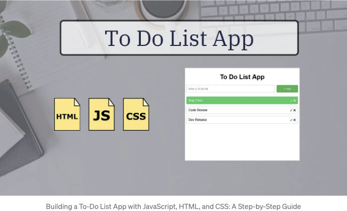

이 강좌에서는 JavaScript, HTML 및 CSS를 사용하여 간단하면서 기능적인 할 일 목록 앱을 만드는 과정을 안내합니다. 코드를 단계별로 나누어 자세히 설명할 것입니다.

# 소개

할 일 목록 앱은 작업을 조직화하고 시간을 효율적으로 관리하는 인기있는 도구입니다. 기본적인 웹 기술을 사용하여 처음부터 만들어보는 것은 JavaScript가 HTML 및 CSS와 상호 작용하여 동적 웹 애플리케이션을 만드는 방법을 이해하는 좋은 방법입니다.

<!-- ui-log 수평형 -->

<ins class="adsbygoogle"
      style="display:block"
      data-ad-client="ca-pub-4877378276818686"
      data-ad-slot="9743150776"
      data-ad-format="auto"
      data-full-width-responsive="true"></ins>
<component is="script">
(adsbygoogle = window.adsbygoogle || []).push({});
</component>

# HTML 구조

저희 앱의 HTML 구조부터 시작해봅시다. 이에는 새 할 일 항목을 입력하는 요소, 항목 목록을 표시하는 요소, 그리고 JavaScript 및 CSS 파일을 연결하는 요소가 포함됩니다.

index.html

```js
<!DOCTYPE html>
<html>
  <head>
    <title>To-Do List App</title>
    <meta charset="UTF-8" />
    <link rel="stylesheet" href="styles.css" />
  </head>
  <body>
    <div class="container">
      <h1>To-Do List App</h1>
      <div class="to_do_input">
        <input
          placeholder="할 일을 입력하세요"
          id="to_do_name"
          class="to_do_name"
        />
        <button id="to_do_add_btn" class="to_do_add_btn">&#43; 추가</button>
      </div>
      <div class="to_do_list_container">
        <ul id="to_do_list" class="to_do_list"></ul>
      </div>
    </div>
    <script src="index.js"></script>
  </body>
</html>
```

<!-- ui-log 수평형 -->

<ins class="adsbygoogle"
      style="display:block"
      data-ad-client="ca-pub-4877378276818686"
      data-ad-slot="9743150776"
      data-ad-format="auto"
      data-full-width-responsive="true"></ins>
<component is="script">
(adsbygoogle = window.adsbygoogle || []).push({});
</component>

# CSS 스타일링

이제 CSS를 추가하여 앱을 스타일링하고 시각적으로 매력적으로 만들어 봅시다. CSS 규칙을 사용하여 다양한 요소의 레이아웃과 모양을 정의할 것입니다.

style.css

```js
body {
  font-family: sans-serif;
}

.container {
  display: flex;
  flex-direction: column;
  align-items: center;
  width: 50%;
  margin: auto;
}

.to_do_input {
  display: flex;
  justify-content: center;
  width: 100%;
}

.to_do_name {
  padding: 10px;
  border: 1px solid #ccc;
  border-radius: 5px;
  margin-right: 10px;
  width: 80%;
}

.to_do_add_btn {
  background-color: #4caf50;
  color: #fff;
  padding: 10px 20px;
  border: none;
  border-radius: 5px;
  width: 20%;
  cursor: pointer;
}

.to_do_list_container {
  margin-top: 20px;
  width: 100%;
}

.to_do_list {
  list-style-type: none;
  margin: 0;
  padding: 0;
  width: 100%;
}

.to_do_list li {
  padding: 8px 10px;
  margin-bottom: 10px;
  border: 1px solid #ccc;
  border-radius: 5px;
  display: flex;
  justify-content: space-between;
  align-items: center;
}

.actions span {
  cursor: pointer;
}

.to_do_done {
  background-color: #45ca62;
  color: #fff;
}
```

<!-- ui-log 수평형 -->

<ins class="adsbygoogle"
      style="display:block"
      data-ad-client="ca-pub-4877378276818686"
      data-ad-slot="9743150776"
      data-ad-format="auto"
      data-full-width-responsive="true"></ins>
<component is="script">
(adsbygoogle = window.adsbygoogle || []).push({});
</component>

# JavaScript 기능

이제 JavaScript를 추가하여 우리의 to-do 목록 앱을 상호작용 가능하게 만들어봅시다. 사용자 입력을 처리하고, 목록에 새로운 to-do 아이템을 추가하며, 항목을 완료된 상태로 표시하고, 항목을 삭제할 것입니다.

index.js

```js
document.querySelector("#to_do_add_btn").addEventListener("click", () => {
  let to_do_name = document.querySelector("#to_do_name");
  if (to_do_name.value == "") {
    alert("할 일 목록 이름을 입력해주세요");
    return false;
  }
  const li = document.createElement("li");
  let liContainer = `
    <div class="to-do-item">
      <div class="to-do">${to_do_name.value}</div>
      <div class="actions">
        <span class="done">&#10003;</span>
        <span class="delete">&#10006;</span>
      </div>
    </div>`;
  li.innerHTML = liContainer;

  li.querySelector(".delete").addEventListener("click", (e) => {
    e.currentTarget.closest("li").remove();
  });

  li.querySelector(".done").addEventListener("click", (e) => {
    e.currentTarget.closest("li").classList.add("to_do_done");
  });

  document.querySelector("#to_do_list").appendChild(li);
  to_do_name.value = "";
});
```

<!-- ui-log 수평형 -->

<ins class="adsbygoogle"
      style="display:block"
      data-ad-client="ca-pub-4877378276818686"
      data-ad-slot="9743150776"
      data-ad-format="auto"
      data-full-width-responsive="true"></ins>
<component is="script">
(adsbygoogle = window.adsbygoogle || []).push({});
</component>

# 자바스크립트 코드 설명

- 먼저 document.querySelector("#to_do_add_btn")를 사용하여 "Add" 버튼을 선택하고 클릭 이벤트 리스너를 추가합니다.

```js
document.querySelector("#to_do_add_btn").addEventListener("click", () => {});
```

- 버튼을 클릭하면 입력 필드 (#to_do_name)의 값을 가져옵니다. 입력 필드가 비어있으면 사용자에게 할 일 목록 이름을 입력하라는 경고 메시지가 표시됩니다.
- 입력 필드가 비어 있지 않으면 새로운 목록 항목 (`li`) 요소를 생성하고 입력한 할 일 항목으로 채웁니다. 또한 "완료" 및 "삭제" 용으로 목록 항목 내에 두 개의 span을 추가합니다.
- "완료" 및 "삭제" span에 이벤트 리스너를 추가하여 각각 항목을 완료 표시하고 삭제하는 작업을 처리합니다.
- 마지막으로 새로운 목록 항목을 할 일 목록 (#to_do_list)에 추가하고 입력 필드를 재설정합니다.

<!-- ui-log 수평형 -->

<ins class="adsbygoogle"
      style="display:block"
      data-ad-client="ca-pub-4877378276818686"
      data-ad-slot="9743150776"
      data-ad-format="auto"
      data-full-width-responsive="true"></ins>
<component is="script">
(adsbygoogle = window.adsbygoogle || []).push({});
</component>

# 소스 코드

# 결론

축하해요! 우리는 JavaScript, HTML 및 CSS를 사용하여 할 일 목록 앱을 성공적으로 만들었습니다. 이 간단한 프로젝트는 이러한 기술들이 결합될 때의 힘과 다양성을 보여줍니다. 데이터 지속성이나 추가적인 사용자 정의 옵션과 같은 기능을 추가하여 앱을 더 발전시키는 것도 괜찮아요. 즐거운 코딩 되세요!

# 최종 생각

<!-- ui-log 수평형 -->

<ins class="adsbygoogle"
      style="display:block"
      data-ad-client="ca-pub-4877378276818686"
      data-ad-slot="9743150776"
      data-ad-format="auto"
      data-full-width-responsive="true"></ins>
<component is="script">
(adsbygoogle = window.adsbygoogle || []).push({});
</component>

할 일 목록 앱을 만드는 것은 JavaScript, HTML, CSS 기술을 연습하기에 좋은 연습입니다. 이 자습서를 따라가면서 사용자 입력 처리, DOM을 동적으로 업데이트하는 방법, 인터페이스 스타일링 등 기본적인 할 일 목록 앱을 만드는 방법을 배웠습니다. 계속해서 새로운 기능을 추가하고 실험하여 웹 개발 기술을 더욱 향상시키세요.
