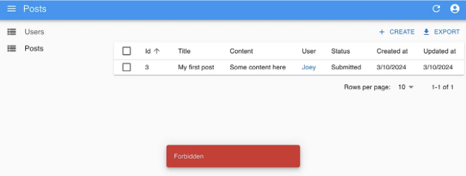

## 쉽고 안전한 방법으로 CRUD 앱 만들기


고객을 대상으로 하는 애플리케이션을 만드는 것은 흥미롭습니다. 그러나 어드민 콘솔 부분을 다룰 때 재미있지 않을 수도 있습니다. 그러나 실제로는 대부분의 앱이 운영에 필요한 어떤 종류의 어드민 콘솔을 요구합니다. 디자인이 멋지거나 성능이 빠르지 않아도 괜찮습니다. 주요 초점은 신뢰성, 비용 효율성, 확장성에 있어야 합니다.

다양한 유형의 어드민 콘솔이 있습니다. 이 게시물에서는 가장 일반적인 유형의 콘솔에 대해 이야기하겠습니다: 비기술자도 데이터베이스를 변경하고 동시에 적절한 권한 관리를 보장할 수 있는 콘솔입니다.

<!-- ui-log 수평형 -->

<ins class="adsbygoogle"
      style="display:block"
      data-ad-client="ca-pub-4877378276818686"
      data-ad-slot="9743150776"
      data-ad-format="auto"
      data-full-width-responsive="true"></ins>
<component is="script">
(adsbygoogle = window.adsbygoogle || []).push({});
</component>

이러한 관리자 콘솔을 구축하려면 세 가지 선택지가 있습니다:

- 구축하지 않습니다. 그냥 데이터베이스 편집기(phpMyAdmin, Prisma Studio 등)를 사용하세요.
- 고수준 라이브러리와 도구를 결합하여 처음부터 빠르게 구축합니다.
- 고객을 대상으로 하는 앱을 구축할 때와 동일한 방식으로 구축합니다.

각 선택지마다 장단점이 있습니다. 이 글은 대부분의 실제 애플리케이션에 가장 적합한 비용과 품질 사이의 균형을 제공하는 두 번째 선택지에 초점을 맞출 것입니다.

# 사용할 라이브러리들 간단히 살펴보기

<!-- ui-log 수평형 -->

<ins class="adsbygoogle"
      style="display:block"
      data-ad-client="ca-pub-4877378276818686"
      data-ad-slot="9743150776"
      data-ad-format="auto"
      data-full-width-responsive="true"></ins>
<component is="script">
(adsbygoogle = window.adsbygoogle || []).push({});
</component>

## React-Admin

React-Admin은 백엔드 데이터 API와 통신하는 관리자 애플리케이션을 빌드하기 위한 React 기반 프론트엔드 프레임워크입니다. 백엔드의 특정 API 스타일에 쉽게 적응할 수 있는 플러그인 메커니즘을 제공합니다.

## Prisma

Prisma는 최신 TypeScript-중심 ORM으로, 데이터베이스 스키마를 쉽게 관리하고 쿼리와 뮤테이션을 높은 유연성으로 수행하며 우수한 유형 안전성을 보장할 수 있습니다.

<!-- ui-log 수평형 -->

<ins class="adsbygoogle"
      style="display:block"
      data-ad-client="ca-pub-4877378276818686"
      data-ad-slot="9743150776"
      data-ad-format="auto"
      data-full-width-responsive="true"></ins>
<component is="script">
(adsbygoogle = window.adsbygoogle || []).push({});
</component>

## ZenStack

ZenStack은 Prisma 위에 구축된 도구 상자로, 접근 제어, 자동 CRUD 웹 API 등이 추가되어 있습니다. 이를 통해 ORM의 전체 기능을 발휘하여 풀 스택 개발이 가능해집니다.

# 대상 앱

토론을 용이하게 하기 위해 예시로 판타지 컨텐츠 발행 앱을 사용하겠습니다. 이 앱은 블로그 게시물을 만들고 편집하여 발행하는 내용을 다룹니다. 사용자 역할로는 세 가지가 포함되어 있습니다.

<!-- ui-log 수평형 -->

<ins class="adsbygoogle"
      style="display:block"
      data-ad-client="ca-pub-4877378276818686"
      data-ad-slot="9743150776"
      data-ad-format="auto"
      data-full-width-responsive="true"></ins>
<component is="script">
(adsbygoogle = window.adsbygoogle || []).push({});
</component>

- 작성자: 게시물을 작성하고 편집 검토를 요청할 수 있습니다.
- 편집자: 기사를 편집하고 게시물을 발행할 수 있습니다.
- 관리자: 모든 작업을 수행할 수 있습니다.

블로그 게시물은 다음 중 하나의 상태에 있을 수 있습니다:

- 초안
  작성자가 비공개로 작업 중입니다. 작성자와 관리자만 액세스할 수 있습니다.
- 제출됨
  작성자가 검토를 요청했습니다. 편집자는 읽을 수 있고 업데이트할 수 있습니다.
- 게시됨
  게시물이 게시되어 모두가 읽을 수 있습니다. 편집자는 게시를 취소할 수 있습니다.

물론, 관리자 사용자는 모든 상태의 게시물에 대해 어떤 작업이라도 수행할 수 있습니다.

<!-- ui-log 수평형 -->

<ins class="adsbygoogle"
      style="display:block"
      data-ad-client="ca-pub-4877378276818686"
      data-ad-slot="9743150776"
      data-ad-format="auto"
      data-full-width-responsive="true"></ins>
<component is="script">
(adsbygoogle = window.adsbygoogle || []).push({});
</component>

# 작업들을 연결하기

관리자 콘솔은 풀 스택 웹 앱이기 때문에 프론트엔드와 백엔드를 하나의 프로젝트로 결합하는 풀 스택 프레임워크를 사용하는 것이 가장 쉬운 방법입니다. 이 포스트에서는 Next.js를 사용할 것이지만, 분리된 프론트엔드와 백엔드(Vite React SPA와 ExpressJS 백엔드)로 진행할 수도 있습니다. 기본 사항은 변경되지 않습니다.

포스트 끝에 완성된 프로젝트의 GitHub 저장소 링크를 찾을 수 있습니다.

## 앱 뼈대 구성하기

<!-- ui-log 수평형 -->

<ins class="adsbygoogle"
      style="display:block"
      data-ad-client="ca-pub-4877378276818686"
      data-ad-slot="9743150776"
      data-ad-format="auto"
      data-full-width-responsive="true"></ins>
<component is="script">
(adsbygoogle = window.adsbygoogle || []).push({});
</component>

제가 사용한 create-t3-app은 Next.js 앱을 TypeScript, Prisma 및 "app router"를 옵션으로 활성화한 상태로 생성하였어요. 작업을 위해 create-next-app을 사용하고 Prisma를 수동으로 설치할 수도 있어요.

그리고 react-admin, ZenStack 및 몇 가지 다른 종속성을 설치해주세요:

```js
npm install react-admin jsonwebtoken
npm install -D tsx
npx zenstack@latest init
npm install @zenstackhq/server
```

중요한 한 가지는 zenstack init 명령이 prisma/schema.prisma 파일을 /schema.zmodel로 복사한다는 것이에요. ZModel 언어는 ZenStack이 데이터베이스 스키마 및 액세스 제어 정책과 같은 다른 것들을 모델링하는 데 사용하는 DSL입니다. ZModel은 Prisma Schema의 슈퍼셋이에요. 우선은 Prisma 스키마를 작성하는 것처럼 이를 작성할 거예요.

<!-- ui-log 수평형 -->

<ins class="adsbygoogle"
      style="display:block"
      data-ad-client="ca-pub-4877378276818686"
      data-ad-slot="9743150776"
      data-ad-format="auto"
      data-full-width-responsive="true"></ins>
<component is="script">
(adsbygoogle = window.adsbygoogle || []).push({});
</component>

데이터베이스 스키마 변경이 필요할 때 기억해 주세요:

- 항상 schema.zmodel을 편집해주세요.
- npx prisma generate 대신 npx zenstack generate를 실행해주세요

# 데이터베이스 스키마

우리 앱의 스키마는 여기 있습니다:

<!-- ui-log 수평형 -->

<ins class="adsbygoogle"
      style="display:block"
      data-ad-client="ca-pub-4877378276818686"
      data-ad-slot="9743150776"
      data-ad-format="auto"
      data-full-width-responsive="true"></ins>
<component is="script">
(adsbygoogle = window.adsbygoogle || []).push({});
</component>

```js
generator client {
    provider = "prisma-client-js"
}

datasource db {
    provider = "sqlite"
    url      = "file:./db.sqlite"
}

model User {
    id Int @id @default(autoincrement())
    createdAt DateTime @default(now())
    updatedAt DateTime @updatedAt
    email String @unique
    password String @password @omit
    name String?
    role String @default('Author') // Author, Editor, Admin
    posts Post[]
    @@allow('all', true)
}

model Post {
    id Int @id @default(autoincrement())
    createdAt DateTime @default(now())
    updatedAt DateTime @updatedAt
    title String
    content String
    status String @default('Draft') // Draft, Submitted, Published
    user User @relation(fields: [userId], references: [id], onDelete: Cascade)
    userId Int

    @@allow('all', true)
}
```

간단한 주의 사항:

- @password 속성은 bcryptjs를 사용하여 데이터베이스에 저장하기 전에 비밀번호 필드를 자동으로 해싱하도록 표시합니다. @omit 속성은 쿼리를 위해 엔티티가 반환되기 전에 해당 필드가 삭제되도록 표시합니다. 이것들은 ZenStack이 Prisma에 추가한 확장 기능입니다.
- @@allow 속성은 조작 허용 정책을 정의하여 허용된 작업을 결정합니다. 우리는 일단 아무도 모든 것을 하도록 허용할 것입니다. 접근 제어는 ZenStack이 Prisma에 추가한 가장 중요한 확장 기능입니다. 곧 다시 살펴볼 것입니다.

## 인증 시스템 구축하기

<!-- ui-log 수평형 -->

<ins class="adsbygoogle"
      style="display:block"
      data-ad-client="ca-pub-4877378276818686"
      data-ad-slot="9743150776"
      data-ad-format="auto"
      data-full-width-responsive="true"></ins>
<component is="script">
(adsbygoogle = window.adsbygoogle || []).push({});
</component>

React-Admin은 내장된 인증(AuthN) 플로우와 UI를 제공합니다. 백엔드의 인증 메커니즘에 맞게 적응하기 위해 "auth provider"를 구현하는 것만 필요합니다. 간단히 말해서, 우리는 이메일과 비밀번호를 자격 증명으로 사용하는 간단한 JWT 기반의 인증 디자인을 사용할 것입니다. 이를 위해 먼저 /src/app/api/auth/login/route.ts에 API 핸들러를 생성하세요:

```js
import { compare } from "bcryptjs";
import { sign } from "jsonwebtoken";
import { db } from "~/server/db";

export async function POST(request: Request) {
  const { email, password }: { email: string; password: string } =
    await request.json();

  const user = await db.user.findUnique({ where: { email } });
  if (!user) {
    return new Response("잘못된 이메일 및 비밀번호 조합", {
      status: 401,
    });
  }
  if (!(await compare(password, user.password))) {
    return new Response("잘못된 이메일 및 비밀번호 조합", {
      status: 401,
    });
  }
  return Response.json({
    id: user.id,
    email: user.email,
    token: sign(
      { sub: user.id.toString(), email: user.email, role: user.role },
      process.env.JWT_SECRET!,
    ),
  });
}
```

그 다음, 프론트엔드가 백엔드와 상호작용하는 방법을 정의하는 React-Admin auth provider를 구현하세요:

```js
import type { AuthProvider } from "react-admin";

const authProvider: AuthProvider = {
  login: ({ username, password }) => {
    return fetch("/api/auth/login", {
      method: "POST",
      // eslint-disable-next-line @typescript-eslint/no-unsafe-assignment
      body: JSON.stringify({ email: username, password }),
    })
      .then((resp) => {
        if (resp.status < 200 || resp.status >= 300) {
          throw new Error(resp.statusText);
        }
        return resp.json();
      })
      .then((auth) => {
        localStorage.setItem("auth", JSON.stringify(auth));
      });
  },

  logout: () => {
    localStorage.removeItem("auth");
    return Promise.resolve();
  },

  checkAuth: () => (localStorage.getItem("auth") ? Promise.resolve() : Promise.reject()),

  checkError: (error) => {
    // eslint-disable-next-line @typescript-eslint/no-unsafe-assignment, @typescript-eslint/no-unsafe-member-access
    const status = error.status;
    if (status === 401) {
      localStorage.removeItem("auth");
      return Promise.reject();
    }
    // other error code (404, 500, etc): no need to log out
    return Promise.resolve();
  },

  getIdentity: () => {
    const auth = localStorage.getItem("auth");
    if (!auth) {
      return Promise.reject("인증되지 않았습니다");
    }
    try {
      // eslint-disable-next-line @typescript-eslint/no-unsafe-assignment
      const { id, email }: { id: number, email: string } = JSON.parse(auth);
      return Promise.resolve({ id, email });
    } catch (error) {
      return Promise.reject(error);
    }
  },
  getPermissions: () => Promise.resolve(""),
};

export default authProvider;
```

<!-- ui-log 수평형 -->

<ins class="adsbygoogle"
      style="display:block"
      data-ad-client="ca-pub-4877378276818686"
      data-ad-slot="9743150776"
      data-ad-format="auto"
      data-full-width-responsive="true"></ins>
<component is="script">
(adsbygoogle = window.adsbygoogle || []).push({});
</component>

Auth provider는 React-Admin을 사용하여 CRUD UI를 구축할 때 사용됩니다.

## 데이터 제공자 만들기

우리의 관리자 콘솔은 본질적으로 기본 데이터벘에 쿼리 및 뮤테이션을 수행하는 것입니다. 그를 달성하기 위해 두 가지 작업을 완료해야 합니다:

- 백엔드: CRUD API
- 프론트엔드: 백엔드 API를 사용하는 데이터 제공자

<!-- ui-log 수평형 -->

<ins class="adsbygoogle"
      style="display:block"
      data-ad-client="ca-pub-4877378276818686"
      data-ad-slot="9743150776"
      data-ad-format="auto"
      data-full-width-responsive="true"></ins>
<component is="script">
(adsbygoogle = window.adsbygoogle || []).push({});
</component>

ZenStack은 데이터베이스 스키마를 기반으로 자동 RESTful API를 제공하여 백엔드 부분을 거의 손쉽게 처리할 수 있습니다. 다음은 Next.js API 핸들러로 설치하는 방법입니다 ("src/app/api/model/[…path]/router.ts"):

```js
import { type AuthUser, enhance } from "@zenstackhq/runtime";
import RestApiHandler from "@zenstackhq/server/api/rest";
import { NextRequestHandler } from "@zenstackhq/server/next";
import { type JwtPayload, verify } from "jsonwebtoken";
import type { NextRequest } from "next/server";
import { db } from "~/server/db";

// 'getPrisma' 콜백은 데이터베이스에 액세스하는 데 사용되는 'PrismaClient' 인스턴스를 반환합니다
// 요청에 대해 여기에서는 액세스 제어를 강화하기 위해 ZenStack 향상된 `PrismaClient`를 반환합니다
async function getPrisma(req: NextRequest) {
  let user: AuthUser | undefined;
  const auth = req.headers.get("authorization");
  if (auth) {
    const token = auth.split("Bearer ")[1];
    if (token) {
      const decoded = verify(token, process.env.JWT_SECRET!) as JwtPayload;
      user = {
        id: parseInt(decoded.sub!),
        role: decoded.role as string,
      };
    }
  }
  // JWT 토큰에서 추출된 사용자 식별 정보를 사용하여 데이터베이스에 액세스합니다
  return enhance(db, { user });
}

const handler = NextRequestHandler({
  getPrisma,
  handler: RestApiHandler({ endpoint: "http://localhost:3000" }),
  useAppDir: true,
});

export {
  handler as DELETE,
  handler as GET,
  handler as PATCH,
  handler as POST,
  handler as PUT,
};
```

위의 코드를 사용하면 "/api/model"에서 완전한 CRUD API 세트를 얻을 수 있습니다. 예를 들어, GET /api/model/user로 모든 사용자를 나열할 수 있습니다. CRUD API의 전체 사양은 여기에서 확인할 수 있습니다. 코드는 Authorization 헤더에 JWT 토큰을 예상하며, React-Admin을 사용하여 CRUD UI 구축 부분에 도달하면 프론트엔드가 토큰을 보내는 방법을 볼 수 있습니다.

이제 React-Admin 데이터 제공자 부분을 다루어 보겠습니다. 이 부분은 매우 직관적입니다. 간략하게 설명하기 위해 여기에서는 일부 코드만 보여주지만, 전체 구현은 이 글의 끝에서 찾으실 수 있습니다.```

<!-- ui-log 수평형 -->

<ins class="adsbygoogle"
      style="display:block"
      data-ad-client="ca-pub-4877378276818686"
      data-ad-slot="9743150776"
      data-ad-format="auto"
      data-full-width-responsive="true"></ins>
<component is="script">
(adsbygoogle = window.adsbygoogle || []).push({});
</component>

```typescript
type FetchFn = (url: string, init: RequestInit) => Promise<Response>;

export function createDataProvider(
  url: string,
  customFetch?: FetchFn,
): DataProvider {
  const fetcher = customFetch ?? fetch;

  // make the API fetch
  const doFetch = async (url: string, init: RequestInit) => {
    const resp = await fetcher(url, init);
    if (resp.status < 200 || resp.status >= 300) {
      throw new HttpError(resp.statusText, resp.status);
    }
    return await resp.json();
  };

  // convert React-Admin query params to URL search params
  const getListQuerySearchParams = (
    params: GetListParams | GetManyReferenceParams,
  ) => {
    const searchParams = new URLSearchParams();
    if (params.filter) {
      Object.entries<any>(params.filter).forEach(([key, value]) => {
        searchParams.set(`filter[${key}]`, value.toString());
      });
    }
    searchParams.set(
      "sort",
      params.sort.order === "ASC" ? params.sort.field : `-${params.sort.field}`,
    );
    searchParams.set(
      "page[offset]",
      ((params.pagination.page - 1) * params.pagination.perPage).toString(),
    );
    searchParams.set("page[limit]", params.pagination.perPage.toString());
    return searchParams.toString();
  };

  // convert the API response to React-Admin query result
  const makeListQueryResult = (
    data: any[],
    meta: { total: number },
    params: GetListParams | GetManyReferenceParams,
  ) => {
    return {
      data: data.map((item: any) => ({ id: item.id, ...item.attributes })),
      total: meta.total,
      pageInfo: {
        hasNextPage:
          meta.total > params.pagination.page * params.pagination.perPage,
        hasPreviousPage: params.pagination.page > 1,
      },
    };
  };

  return {
    getList: async (resource, params) => {
      const reqUrl = `${url}/${resource}?${getListQuerySearchParams(params)}`;
      const { data, meta } = await doFetch(reqUrl, {
        method: "GET",
      });
      return makeListQueryResult(data, meta, params);
    },

    getOne: async (resource, params) => {
      const reqUrl = `${url}/${resource}/${params.id}`;
      const { data } = await doFetch(reqUrl, {
        method: "GET",
      });
      return {
        data: { id: data.id, ...data.attributes },
      };
    },

    ...
  } satisfies DataProvider;
}
```

이제 필요한 모든 인프라를 갖췄습니다. 이제 UI를 만드는 작업으로 넘어갑시다!

## CRUD UI 구축

여기서 React-Admin이 빛을 발합니다 - CRUD UI를 만드는 것이 정말 쉽습니다. 이런 방식으로 진행됩니다:```

<!-- ui-log 수평형 -->

<ins class="adsbygoogle"
      style="display:block"
      data-ad-client="ca-pub-4877378276818686"
      data-ad-slot="9743150776"
      data-ad-format="auto"
      data-full-width-responsive="true"></ins>
<component is="script">
(adsbygoogle = window.adsbygoogle || []).push({});
</component>

```js
const AdminApp = () => (
  <Admin dataProvider={dataProvider} authProvider={authProvider}>
    <Resource name="user" list={ListGuesser} edit={EditGuesser} create={UserCreate} hasCreate={true} recordRepresentation="name" />
    <Resource name="post" list={PostList} edit={EditGuesser} create={PostCreate} hasCreate={true} recordRepresentation="title" />
  </Admin>
);

export const UserCreate = () => (
  <Create>
    <SimpleForm>
      <TextInput source="email" type="email" validate={required()} />
      <PasswordInput source="password" validate={required()} />
      <TextInput source="name" validate={required()} />
      <SelectInput
        source="role"
        choices={[
          { id: "Author", name: "Author" },
          { id: "Editor", name: "Editor" },
          { id: "Admin", name: "Admin" },
        ]}
        defaultValue={"Author"}
      />
    </SimpleForm>
  </Create>
);

const PostList = () => (
  <List>
    <Datagrid rowClick="edit">
      <TextField source="id" />
      <TextField source="title" />
      <TextField source="content" />
      <DateField source="createdAt" />
      <DateField source="updatedAt" />
      <ReferenceField source="userId" reference="user" />
    </Datagrid>
  </List>
);

export const PostCreate = () => (
  <Create>
    <SimpleForm>
      <ReferenceInput source="userId" reference="user">
        <SelectInput />
      </ReferenceInput>
      <TextInput source="title" validate={required()} />
      <TextInput source="content" multiline rows={5} validate={required()} />
      <SelectInput
        source="status"
        choices={[
          { id: "Draft", name: "Draft" },
          { id: "Submitted", name: "Submitted" },
          { id: "Published", name: "Published" },
        ]}
        defaultValue={"Draft"}
      />
    </SimpleForm>
  </Create>
);

export default AdminApp;
```

그리고 dataProvider 초기화는 다음과 같이 보입니다:

```js
const dataProvider = createDataProvider("/api/model", (url, init) => {
  // localStorage에서 JWT 토큰 가져와 `Authorization` 헤더에 담아 보내기
  const auth = localStorage.getItem("auth");
  if (auth) {
    const { token } = JSON.parse(auth);
    if (init.headers instanceof Headers) {
      init.headers.set("Authorization", `Bearer ${token}`);
    } else {
      init.headers = new Headers({ Authorization: `Bearer ${token}` });
    }
  }

  return fetch(url, init);
});
```

React-Admin은 고수준 컴포넌트를 통해 백엔드 API와 자동으로 통신하여 CRUD UI를 구축하는 과정을 단순화합니다. 대부분의 경우 Guesser 컴포넌트들이 잘 작동하지만, 필요한 경우에는 Grid, List, Input 등을 조합하여 사용자 정의 컴포넌트를 쉽게 만들 수 있습니다.

<!-- ui-log 수평형 -->

<ins class="adsbygoogle"
      style="display:block"
      data-ad-client="ca-pub-4877378276818686"
      data-ad-slot="9743150776"
      data-ad-format="auto"
      data-full-width-responsive="true"></ins>
<component is="script">
(adsbygoogle = window.adsbygoogle || []).push({});
</component>

이제 로그인하고 사용자 및 게시물을 만들고 조회하고 수정 및 삭제할 수 있어야 합니다.


# 권한에 대해 어떻게 생각하세요?

CRUD가 작동하는 것은 좋은 일입니다. 그러나 우리는 퍼즐에서 아직 하나의 중요한 조각이 빠진 상태입니다: 권한 설정. ZenStack은 스키마에서 규칙을 선언적으로 정의하여 AuthZ를 구현하는 것을 굉장히 쉽게 만들어 줍니다.

<!-- ui-log 수평형 -->

<ins class="adsbygoogle"
      style="display:block"
      data-ad-client="ca-pub-4877378276818686"
      data-ad-slot="9743150776"
      data-ad-format="auto"
      data-full-width-responsive="true"></ins>
<component is="script">
(adsbygoogle = window.adsbygoogle || []).push({});
</component>

CRUD API 핸들러를 구축할 때 우리가 "향상된" PrismaClient를 만들어서 현재 요청을 위해 데이터베이스에 액세스하는 것 기억하시나요? 이 향상된 클라이언트는 자동으로 액세스 제어를 강제합니다. 그러나 정책은 우리가 정의하는 것이 책임입니다. 사용자 모델을 보호하기 시작해봅시다.

```js
model User {
  ...

  // 모든 로그인한 사용자는 모든 사용자를 읽을 수 있습니다
  @@allow('read', auth() != null)

  // 사용자는 자신을 업데이트할 수 있고, 관리자는 모든 사용자를 업데이트할 수 있습니다
  @@allow('all', auth() == this || auth().role == 'Admin')
}
```

쉽죠? 정책 규칙에서 특수한 auth() 함수는 현재 요청한 사용자를 나타내며, 이는 우리가 이전에 JWT 토큰에서 추출하여 향상된 호출로 전달한 사용자입니다.

그럼, 이제 포스트 부분으로 넘어가 봅시다. 여러 요구사항을 다루어야 해요:

<!-- ui-log 수평형 -->

<ins class="adsbygoogle"
      style="display:block"
      data-ad-client="ca-pub-4877378276818686"
      data-ad-slot="9743150776"
      data-ad-format="auto"
      data-full-width-responsive="true"></ins>
<component is="script">
(adsbygoogle = window.adsbygoogle || []).push({});
</component>

```js
model Post {
  ...

  // 관리자는 모든 게시물에 완전한 액세스 권한이 있습니다.
  @@allow('all', auth().role == 'Admin')
  // 작성자는 "Draft" 상태로 새 게시물을 생성할 수 있습니다.
  @@allow('create', auth() == user && status == 'Draft')
  // 게시물 소유자는 자신의 게시물을 읽을 수 있습니다.
  @@allow('read', auth() == user)
  // 초안이 아닌 게시물은 모든 로그인한 사용자가 읽을 수 있습니다.
  @@allow('read', auth() != null && status != 'Draft')
  // "Author"를 위한 업데이트 규칙
  @@allow('update',
      auth().role == 'Author' // 사용자가 작성자인 경우
      && auth() == user // 사용자가 게시물 소유자인 경우
      && status != 'Published' // 게시된 게시물은 업데이트할 수 없음
      && future().status != 'Published' // 상태를 "Published"로 변경할 수 없음
  )
  // "Editor"를 위한 업데이트 규칙
  @@allow('update', auth().role == 'Editor' && status != 'Draft')
  // 소유자 또는 관리자는 발행되지 않은 게시물을 삭제할 수 있습니다.
  @@allow('delete', auth() == user && status != 'Published')
}
```

여기서 새로운 기능은 future() 함수입니다. "update" 작업은 이전 상태와 후속 상태를 수반합니다. 기본적으로 정책 규칙의 필드는 이전 상태를 참조하지만, future() 함수를 사용하면 후속 상태를 참조할 수 있습니다.

npx zenstack generate를 다시 실행하고 개발 서버를 다시 시작하면 액세스 규정이 적용됩니다. 예를 들어, 작성자로서 게시물 상태를 "Published"로 설정하려고 하면 일부 작업이 거부될 것을 알 수 있습니다.



<!-- ui-log 수평형 -->

<ins class="adsbygoogle"
      style="display:block"
      data-ad-client="ca-pub-4877378276818686"
      data-ad-slot="9743150776"
      data-ad-format="auto"
      data-full-width-responsive="true"></ins>
<component is="script">
(adsbygoogle = window.adsbygoogle || []).push({});
</component>

# 결론

이 글을 즐겁게 읽으시고 접근 방식을 흥미롭게 느꼈으면 좋겠어요. 관리자 콘솔을 구축하는 것은 종종 고객 가치를 직접적으로 더하지 않아서 보상적이지 않은 작업일 수 있습니다. 그러나 적절한 도구를 결합함으로써 즐겁고 생산적으로 만들 수 있어요. 이 글에서는 React-Admin과 ZenStack이 할 수 있는 것의 일부만 다뤘습니다. 두 툴 모두 더 많은 것을 제공하고 있으며, 더 깊이 탐색해보시기를 권장합니다.

완성된 샘플 프로젝트는 여기에서 확인할 수 있어요: [https://github.com/ymc9/react-admin-blog](https://github.com/ymc9/react-admin-blog).
