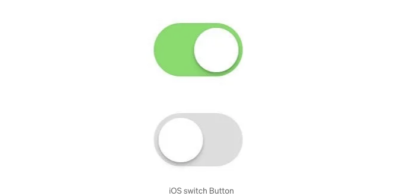
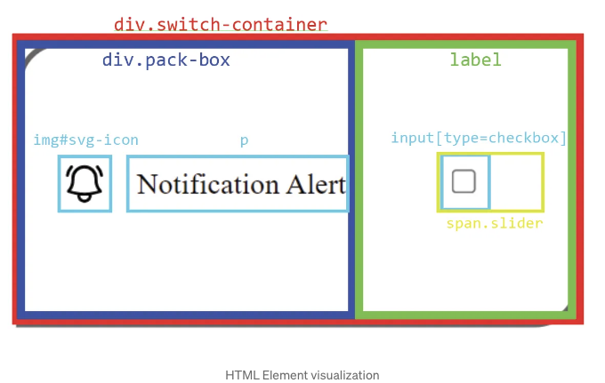

# 소개

웹 앱을 위한 iOS 스타일의 스위치 버튼을 만들어보고 싶었던 적이 있나요? 전문가일 필요 없어요! 함께 HTML, CSS 및 JavaScript를 사용하여 하나 만들어봅시다.



<!-- ui-log 수평형 -->

<ins class="adsbygoogle"
      style="display:block"
      data-ad-client="ca-pub-4877378276818686"
      data-ad-slot="9743150776"
      data-ad-format="auto"
      data-full-width-responsive="true"></ins>
<component is="script">
(adsbygoogle = window.adsbygoogle || []).push({});
</component>

# 전제 조건

- HTML, CSS 및 JavaScript에 대한 기본 지식이 필요합니다.
- 자신이 선호하는 텍스트 편집기가 필요합니다.

# 코드 심층 탐구해 보기

폴더를 생성하고 코드 편집기에서 엽니다. 이 튜토리얼에서는 VS Code를 사용하고 있습니다.

<!-- ui-log 수평형 -->

<ins class="adsbygoogle"
      style="display:block"
      data-ad-client="ca-pub-4877378276818686"
      data-ad-slot="9743150776"
      data-ad-format="auto"
      data-full-width-responsive="true"></ins>
<component is="script">
(adsbygoogle = window.adsbygoogle || []).push({});
</component>

## HTML 구조 설정하기

프로젝트 폴더 내에 index.html이라는 새 파일을 만들고 다음과 같은 HTML 코드를 추가해주세요:

index.html

```js
<!DOCTYPE html>
<html lang="en">
  <head>
    <meta charset="UTF-8" />
    <meta name="viewport" content="width=device-width, initial-scale=1.0" />
    <title>IOS Button</title>

    <!-- 스타일링을 위한 외부 CSS 파일 링크 -->
    <link rel="stylesheet" href="./styles.css" />

    <!-- 기능을 위한 외부 JavaScript 파일 링크 -->
    <script defer src="./main.js"></script>
  </head>
  <body>
    <!-- 스위치 버튼을 담는 컨테이너 -->
    <div class="switch-container">

      <!-- 이미지와 텍스트를 담고 있는 상자 -->
      <div class="pack-box">
        <!-- 스위치 버튼을 위한 이미지 -->
        
        <!-- 스위치 버튼을 위한 텍스트 -->
        <p>알림 통지</p>
      </div>

      <!-- 스위치 기능과 연결된 레이블 -->
      <label for="switch-1" class="switch">
        <!-- 스위치 버튼 역할을 하는 체크박스 입력 -->
        <input type="checkbox" id="switch-1" onClick="handleChange()" />
        <!-- 슬라이더 버튼 모양을 만드는 span 요소 -->
        <span class="slider"></span>
      </label>

    </div>
  </body>
</html>
```

<!-- ui-log 수평형 -->

<ins class="adsbygoogle"
      style="display:block"
      data-ad-client="ca-pub-4877378276818686"
      data-ad-slot="9743150776"
      data-ad-format="auto"
      data-full-width-responsive="true"></ins>
<component is="script">
(adsbygoogle = window.adsbygoogle || []).push({});
</component>

저는 스위치 컨테이너를 포함하는 .switch-container 박스를 포함하는 .pack-box에 이미지 .svg-icon과 "Notification Alert" 텍스트가 들어가도록 콘텐츠를 구조화했습니다. 레이블 .switch는 체크박스 입력 .switch-1과 슬라이더 버튼 모양을 만들기 위한 span .slider와 연결됩니다.



## CSS로 스위치 버튼 스타일링하기

스위치 버튼을 스타일링하려면 styles.css라는 파일을 생성하여 HTML 파일에 연결하십시오. 요소들을 적절히 정렬하고 가운데 정렬하는 것으로 시작하세요:

<!-- ui-log 수평형 -->

<ins class="adsbygoogle"
      style="display:block"
      data-ad-client="ca-pub-4877378276818686"
      data-ad-slot="9743150776"
      data-ad-format="auto"
      data-full-width-responsive="true"></ins>
<component is="script">
(adsbygoogle = window.adsbygoogle || []).push({});
</component>

```js
/* 본문 콘텐츠 가운데 정렬 */
body {
  height: 100dvh;
  width: 100dvw;
  display: flex;
  justify-content: center;
  align-items: center;
}

/* 컨테이너 스타일링 */
.switch-container {
  width: 300px;
  height: 150px;
  border: 3px solid #636363;
  border-radius: 25px 0;
  display: flex;
  align-items: center;
  justify-content: space-around;
}

.switch-container img {
  width: 25px;
}

/* 이미지와 텍스트가 함께 있는 상자 스타일링 */
.pack-box {
  display: flex;
  gap: 1rem;
}
```

스위치 버튼 스타일링에 대한 주요 로직으로 이동하여, 해당 요소의 크기와 동작을 정의합니다. .switch 클래스는 레이블의 너비와 높이를 설정하고 상대적으로 위치를 조정합니다:

```js
/* 스위치 버튼 스타일링 */
.switch {
  width: 60px;
  height: 35px;
  display: inline-block;
  cursor: pointer;
  position: relative;
}
```

.slider 클래스는 슬라이더 요소를 컨테이너 내부에서 절대적으로 위치시키고, 완전한 위치 지정으로 전체 영역을 채우도록 합니다:```

<!-- ui-log 수평형 -->

<ins class="adsbygoogle"
      style="display:block"
      data-ad-client="ca-pub-4877378276818686"
      data-ad-slot="9743150776"
      data-ad-format="auto"
      data-full-width-responsive="true"></ins>
<component is="script">
(adsbygoogle = window.adsbygoogle || []).push({});
</component>

```js
/* 슬라이더 버튼 스타일링 */
.switch .slider {
  position: absolute;
  inset: 0;
  background: rgb(145, 145, 145);
  border-radius: 25px;
}
```

체크박스를 숨기려면 display 속성을 none으로 설정하세요:

```js
/* 체크박스 입력 숨기기 */
.switch input {
  display: none;
}
```

::before 가상 클래스를 사용하여 슬라이더 앞에 빈 콘텐츠를 추가하여 토글 버튼을 가운데 정렬하고 외형을 원형으로 변경하세요:

<!-- ui-log 수평형 -->

<ins class="adsbygoogle"
      style="display:block"
      data-ad-client="ca-pub-4877378276818686"
      data-ad-slot="9743150776"
      data-ad-format="auto"
      data-full-width-responsive="true"></ins>
<component is="script">
(adsbygoogle = window.adsbygoogle || []).push({});
</component>

```js
 /* 슬라이더 모양 스타일 지정 */
.switch .slider::before {
  content: "";
  position: absolute;
  height: 27px;
  width: 27px;
  left: 5px;
  top: 4px;
  background: white;
  transition: 0.5s all;
  border-radius: 50%;
}
```


체크된 가상 클래스를 활용하여 스위치가 토글될 때 슬라이더의 배경색을 녹색으로 변경합니다:

```js
/* 체크된 상태 스타일 지정 */
.switch input:checked + .slider {
  background: rgb(12, 235, 12);
}
```

<!-- ui-log 수평형 -->

<ins class="adsbygoogle"
      style="display:block"
      data-ad-client="ca-pub-4877378276818686"
      data-ad-slot="9743150776"
      data-ad-format="auto"
      data-full-width-responsive="true"></ins>
<component is="script">
(adsbygoogle = window.adsbygoogle || []).push({});
</component>

마지막으로, 슬라이더 버튼을 토글할 때 움직이도록 하려면, 변환 속성을 사용하여 수평으로 이동하도록 설정하세요:

```js
 /* 슬라이더 이동 스타일링 */
.switch input:checked + .slider::before {
  transform: translateX(23px);
}
```

이 CSS 규칙들은 스위치 버튼이 원활하게 작동하도록 합니다. 이를 통해 토글할 때 예상대로 모양이 변경되고 움직입니다.


<!-- ui-log 수평형 -->

<ins class="adsbygoogle"
      style="display:block"
      data-ad-client="ca-pub-4877378276818686"
      data-ad-slot="9743150776"
      data-ad-format="auto"
      data-full-width-responsive="true"></ins>
<component is="script">
(adsbygoogle = window.adsbygoogle || []).push({});
</component>

## 상호 작용을 위한 JavaScript 추가하기

main.js라는 파일을 만들고 HTML 파일에 연결하세요. 다음 JavaScript 코드를 사용하여 아이콘을 토글할 때 변경하세요:

Main.js

```js
const svgIcon = document.querySelector("#svg-icon");

const handleChange = () => {
  // 스위치 상태에 따라 아이콘 토글
  if (document.getElementById("switch-1").checked) {
    svgIcon.src = "./active.svg";
  } else {
    svgIcon.src = "./nonActive.svg";
  }
};
```

<!-- ui-log 수평형 -->

<ins class="adsbygoogle"
      style="display:block"
      data-ad-client="ca-pub-4877378276818686"
      data-ad-slot="9743150776"
      data-ad-format="auto"
      data-full-width-responsive="true"></ins>
<component is="script">
(adsbygoogle = window.adsbygoogle || []).push({});
</component>

# 결론

당신의 웹 애플리케이션에 iOS 스타일 스위치 버튼을 만드는 것은 HTML, CSS 및 JavaScript의 기본 지식으로 달성할 수 있습니다. 이 안내서에 설명된 간단한 단계를 따라보세요. 특정 요구 사항과 기호에 맞게 스타일 및 기능을 자유롭게 사용자 정의할 수 있습니다.

이 튜토리얼에서 사용된 전체 코드 및 리소스는 제 GitHub 저장소에서 찾을 수 있습니다: https://github.com/Bishal-Pahari/iOS-Button
