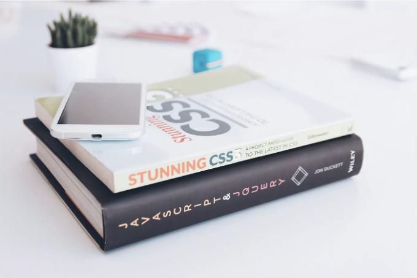

CSS 인터뷰 질문을 통해 심도 있는 지식을 테스트할 수 있는 몇 가지 고급 CSS 인터뷰 질문과 설명이 있습니다:

1. Flexbox 및 Grid 레이아웃 모델과 사용 사례를 설명해보세요.

- Flexbox: 수평 또는 수직 축을 따라 요소를 배열하는 단일 차원 레이아웃 모델입니다. 반응형 레이아웃, 요소 정렬 및 항목 간 공간 생성에 적합합니다.

<!-- ui-log 수평형 -->

<ins class="adsbygoogle"
      style="display:block"
      data-ad-client="ca-pub-4877378276818686"
      data-ad-slot="9743150776"
      data-ad-format="auto"
      data-full-width-responsive="true"></ins>
<component is="script">
(adsbygoogle = window.adsbygoogle || []).push({});
</component>

예시: 컨테이너 내에서 버튼을 수평으로 가운데 정렬하는 데 Flexbox를 사용합니다.

- 그리드 레이아웃: 행과 열을 사용하여 복잡한 레이아웃을 만들기 위한 2차원 레이아웃 모델입니다. 복잡한 구조, 반응형 디자인 및 여러 축을 따라 요소를 정렬하는 데 이상적입니다.

예시: 그리드 레이아웃을 사용하여 같은 크기의 항목과 반응형 동작이 있는 제품 그리드를 만듭니다.

설명: Flexbox와 그리드는 모두 반응형 레이아웃을 위한 해결책을 제공하지만, 각각의 장점을 이해하는 것이 중요합니다. Flexbox는 단일 차원 정렬에서 뛰어나지만, 그리드는 복잡하고 다차원 레이아웃에서 빛을 발합니다.

<!-- ui-log 수평형 -->

<ins class="adsbygoogle"
      style="display:block"
      data-ad-client="ca-pub-4877378276818686"
      data-ad-slot="9743150776"
      data-ad-format="auto"
      data-full-width-responsive="true"></ins>
<component is="script">
(adsbygoogle = window.adsbygoogle || []).push({});
</component>

2. CSS 미디어 쿼리를 사용하여 반응형 레이아웃을 어떻게 구현하나요? 미디어 쿼리 유형의 예시를 알려주세요.

- 미디어 쿼리: 화면 크기, 장치 방향 등 여러 요소에 따라 스타일을 적용하는 데 사용됩니다.
- 미디어 쿼리 유형의 예시:

(max-width: 768px): 최대 너비가 768px인 화면에 적용되는 스타일(일반적인 태블릿 지점).

(orientation: portrait): 세로 모드에서만 적용되는 스타일.

<!-- ui-log 수평형 -->

<ins class="adsbygoogle"
      style="display:block"
      data-ad-client="ca-pub-4877378276818686"
      data-ad-slot="9743150776"
      data-ad-format="auto"
      data-full-width-responsive="true"></ins>
<component is="script">
(adsbygoogle = window.adsbygoogle || []).push({});
</component>

(prefers-color-scheme: dark): 어두운 모드를 선호하는 사용자에게 적용되는 스타일입니다.

설명: 미디어 쿼리를 사용하면 장치 특성에 따라 대상 스타일을 적용하여 다양한 플랫폼에서 최적의 뷰잉 경험을 보장할 수 있습니다.

3. display: none;와 visibility: hidden; 속성의 차이를 설명하십시오. 각각 언제 사용하시겠습니까?

- display: none; 요소를 문서 흐름에서 제거하므로 보이지 않고 공간을 차지하지 않습니다.
- visibility: hidden; 요소를 숨기지만 레이아웃에서 여전히 공간을 차지합니다.

<!-- ui-log 수평형 -->

<ins class="adsbygoogle"
      style="display:block"
      data-ad-client="ca-pub-4877378276818686"
      data-ad-slot="9743150776"
      data-ad-format="auto"
      data-full-width-responsive="true"></ins>
<component is="script">
(adsbygoogle = window.adsbygoogle || []).push({});
</component>

설명: 요소를 완전히 숨기고 공간을 다른 요소로 대체하려면 display: none; 을 사용하십시오. 요소를 시각적으로 숨기지만 레이아웃에서 요소의 위치를 유지하려는 경우에는 visibility: hidden;을 선택하십시오 (예: 애니메이션 또는 접근성 목적).

4. CSS 특이성의 개념을 설명하고 적용되는 스타일을 결정하는 방식에 대해 설명하십시오.

- 특이성: 여러 규칙이 같은 요소를 대상으로 할 때 어떤 CSS 규칙이 우선적으로 적용되는지 결정하는 순위 체계입니다.

설명: 특이성은 규칙에 사용된 셀렉터의 수와 유형에 기반하여 계산됩니다 (인라인 스타일의 우선 순위가 가장 높음). 특이성을 이해하는 것은 스타일 충돌을 해결하고 원하는 스타일이 적용되도록 보장하기 위해 중요합니다.

<!-- ui-log 수평형 -->

<ins class="adsbygoogle"
      style="display:block"
      data-ad-client="ca-pub-4877378276818686"
      data-ad-slot="9743150776"
      data-ad-format="auto"
      data-full-width-responsive="true"></ins>
<component is="script">
(adsbygoogle = window.adsbygoogle || []).push({});
</component>

5. Sass나 Less와 같은 CSS 전처리기를 사용하는 장단점에 대해 이야기해보세요.

- 장점:

- 단점:

설명: CSS 전처리기는 더 깔끔하고 유지보수가 쉬운 CSS를 작성할 수 있는 강력한 기능을 제공합니다. 하지만, 그들은 추가 복잡성과 설정 오버헤드를 도입합니다.

<!-- ui-log 수평형 -->

<ins class="adsbygoogle"
      style="display:block"
      data-ad-client="ca-pub-4877378276818686"
      data-ad-slot="9743150776"
      data-ad-format="auto"
      data-full-width-responsive="true"></ins>
<component is="script">
(adsbygoogle = window.adsbygoogle || []).push({});
</component>

보너스: 대규모 웹 사이트의 CSS 성능을 최적화하는 방법은 무엇인가요?

- 선택자 최소화: 의도하지 않은 스타일 적용을 피하려면 더 구체적인 선택자를 사용하세요.
- HTTP 요청 줄이기: CSS 파일을 결합하고 최소화하여 다운로드 횟수를 줄입니다.
- 중요한 스타일 우선순위 부여: 빠른 초기 렌더링을 위해 필수적인 스타일이 먼저 로드되도록 합니다.
- CSS 캐싱 활용: 동일한 스타일을 반복로드하는 것을 피하기 위해 브라우저 캐싱 기능을 활용하세요.

설명: CSS 성능 최적화는 웹 사이트의 로딩 속도와 사용자 경험을 향상시킵니다. 최상의 방법을 따라 스타일을 효율적으로 전달할 수 있습니다.

이것들은 심층적인 CSS 인터뷰 질문의 몇 가지 예시에 불과합니다. 이러한 개념과 실제적인 적용을 이해함으로써 CSS에 대한 전문 지식을 과시하고 잠재적인 고용주들을 감명시킬 수 있습니다.
