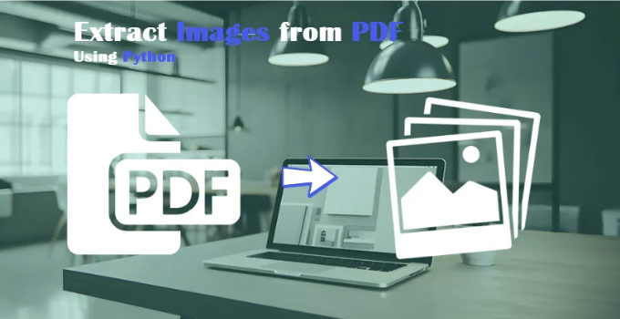
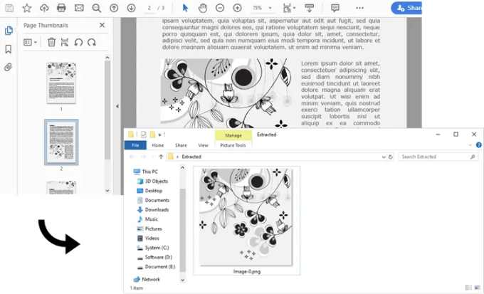
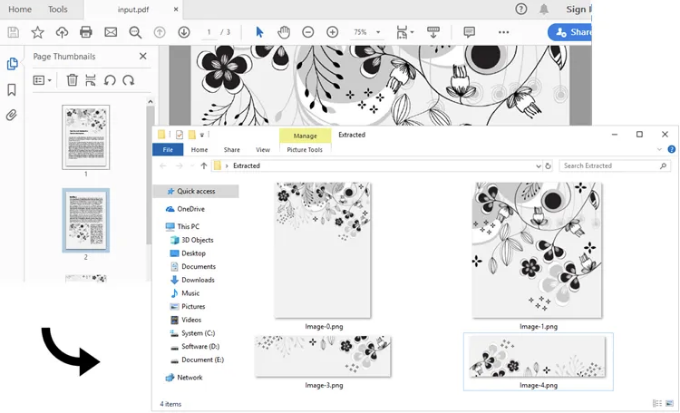

PDF 파일에서 이미지를 추출하는 것은 다양한 상황에서 유용하고 실용적 일 수 있습니다. 이미지를 프레젠테이션용으로 재활용하거나 디지털 사진 앨범을 만들거나, 단순히 나중에 참고할 이미지를 저장해야 하는 경우, PDF에서 이미지를 추출할 수 있는 능력은 시간과 노력을 절약할 수 있습니다. 이 기사에서는 Spire.PDF for Python을 사용하여 Python에서 PDF 문서에서 이미지를 추출하는 방법을 배우게 될 것입니다.

- Python에서 특정 페이지에서 이미지 추출하기
- Python에서 PDF 문서에서 모든 이미지 추출하기

## 종속성 설치

<!-- ui-log 수평형 -->

<ins class="adsbygoogle"
      style="display:block"
      data-ad-client="ca-pub-4877378276818686"
      data-ad-slot="9743150776"
      data-ad-format="auto"
      data-full-width-responsive="true"></ins>
<component is="script">
(adsbygoogle = window.adsbygoogle || []).push({});
</component>

이 솔루션을 사용하려면 Python에서 PDF 문서를 읽고 생성 및 조작하는 Python 라이브러리인 Spire.PDF for Python이 설치되어 있어야 합니다. 다음 pip 명령을 실행하여 설치할 수 있습니다.

```js
pip install Spire.PDF
```

## 파이썬에서 특정 페이지에서 이미지 추출

Spire.PDF for Python은 지정된 페이지에서 이미지를 추출하기 위한 PdfPageBase.ExtractImages() 메서드를 제공합니다. 아래는 상세한 단계입니다.

<!-- ui-log 수평형 -->

<ins class="adsbygoogle"
      style="display:block"
      data-ad-client="ca-pub-4877378276818686"
      data-ad-slot="9743150776"
      data-ad-format="auto"
      data-full-width-responsive="true"></ins>
<component is="script">
(adsbygoogle = window.adsbygoogle || []).push({});
</component>

- PdfDocument 객체를 생성합니다.
- PdfDocument.LoadFromFile() 메서드를 사용하여 PDF 문서를 로드합니다.
- PdfDocument.Pages[index] 속성을 사용하여 특정 페이지를 가져옵니다.
- PdfPageBase.ExtractImages() 메서드를 사용하여 페이지에서 이미지를 추출하고 이미지 목록을 반환합니다.
- 목록에 있는 각 이미지를 PNG 파일로 저장합니다.

```js
from spire.pdf.common import *
from spire.pdf import *

# PdfDocument 객체 생성
doc = PdfDocument()

# PDF 문서 로드
doc.LoadFromFile('C:/Users/Administrator/Desktop/input.pdf')

# 특정 페이지 가져오기
page = doc.Pages[1]

# 페이지에서 이미지 추출
images = []
for image in page.ExtractImages():
    images.append(image)

# 이미지를 지정된 위치에 지정된 형식 확장자로 저장
index = 0
for image in images:
    imageFileName = 'C:/Users/Administrator/Desktop/Extracted/Image-{0:d}.png'.format(index)
    index += 1
    image.Save(imageFileName, ImageFormat.get_Png())
doc.Close()
```



## Python에서 PDF 문서에서 모든 이미지 추출

<!-- ui-log 수평형 -->

<ins class="adsbygoogle"
      style="display:block"
      data-ad-client="ca-pub-4877378276818686"
      data-ad-slot="9743150776"
      data-ad-format="auto"
      data-full-width-responsive="true"></ins>
<component is="script">
(adsbygoogle = window.adsbygoogle || []).push({});
</component>

PDF 문서 전체에서 모든 이미지를 추출하려면 문서의 각 페이지를 순회한 다음 각 페이지에서 이미지를 별도로 가져와야 합니다. 아래는 상세한 단계입니다.

- PdfDocument 객체를 생성합니다.
- PdfDocument.LoadFromFile() 메서드를 사용하여 PDF 문서를 로드합니다.
- 문서의 페이지를 반복하고 PdfPageBase.ExtractImages() 메서드를 사용하여 각 페이지에서 이미지를 가져옵니다.
- 추출된 모든 이미지를 개별 PNG 파일로 작성합니다.

```python
from spire.pdf.common import *
from spire.pdf import *

# PdfDocument 객체 생성
doc = PdfDocument()

# PDF 문서 로드
doc.LoadFromFile('C:/Users/Administrator/Desktop/input.pdf')

images = []

# 문서의 페이지를 순회
for i in range(doc.Pages.Count):
    page = doc.Pages.get_Item(i)

    # 특정 페이지에서 이미지 추출
    for image in page.ExtractImages():
        images.append(image)

# 추출된 이미지를 지정된 위치에 지정된 형식의 확장자로 저장
index = 0
for image in images:
    imageFileName = 'C:/Users/Administrator/Desktop/Extracted/Image-{0:d}.png'.format(index)
    index += 1
    image.Save(imageFileName, ImageFormat.get_Png())
doc.Close()
```



<!-- ui-log 수평형 -->

<ins class="adsbygoogle"
      style="display:block"
      data-ad-client="ca-pub-4877378276818686"
      data-ad-slot="9743150776"
      data-ad-format="auto"
      data-full-width-responsive="true"></ins>
<component is="script">
(adsbygoogle = window.adsbygoogle || []).push({});
</component>

## 결론

이 블로그 포스트는 Python을 사용하여 PDF 문서에서 이미지를 추출하는 데 유용한 통찰을 제공합니다. 특정 페이지에서 이미지를 추출하는 방법과 PDF 문서에서 모든 이미지를 추출하는 방법 두 가지 기술을 다룹니다. 이러한 기술은 PDF 파일에서 이미지를 프로그래밍 방식으로 조작하고 추출하려는 개발자와 열련자들에게 실용적인 해결책을 제공합니다.

## 관련 주제

Python에서 PDF 문서에서 텍스트 추출하기

<!-- ui-log 수평형 -->

<ins class="adsbygoogle"
      style="display:block"
      data-ad-client="ca-pub-4877378276818686"
      data-ad-slot="9743150776"
      data-ad-format="auto"
      data-full-width-responsive="true"></ins>
<component is="script">
(adsbygoogle = window.adsbygoogle || []).push({});
</component>

파이썬으로 PDF 메타데이터 추가, 읽기 또는 제거하기

파이썬에서 PDF를 이미지로 변환하거나 이미지를 PDF로 변환하기
