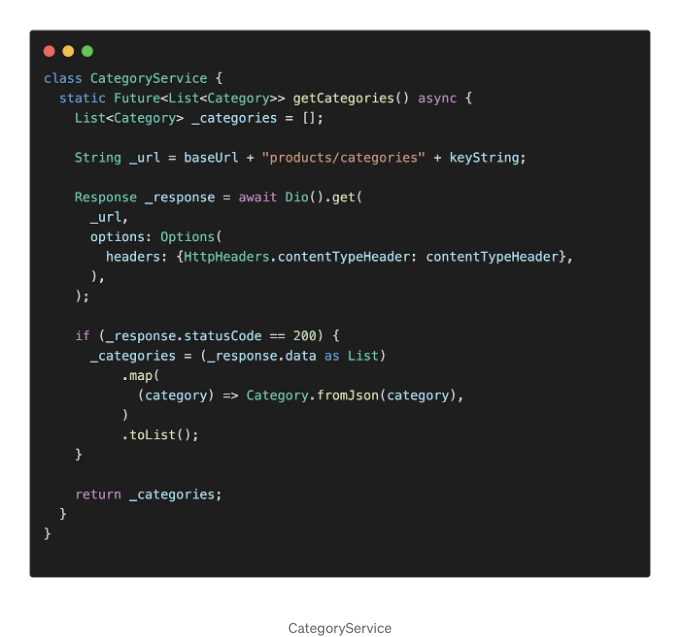
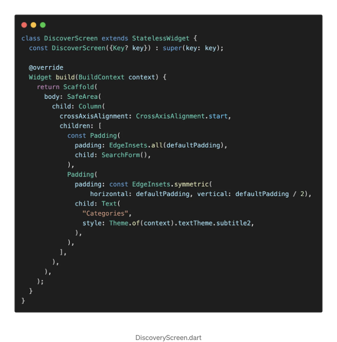
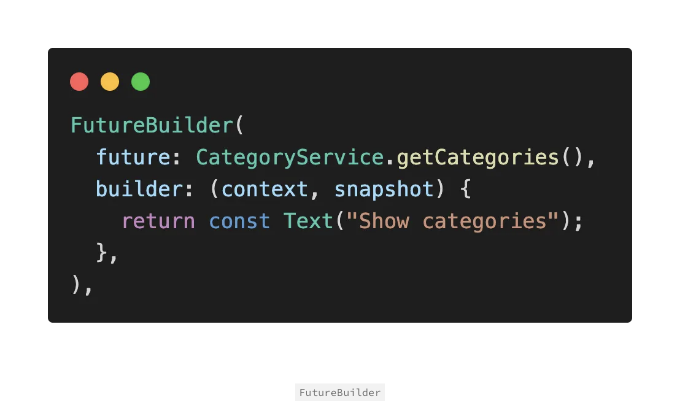
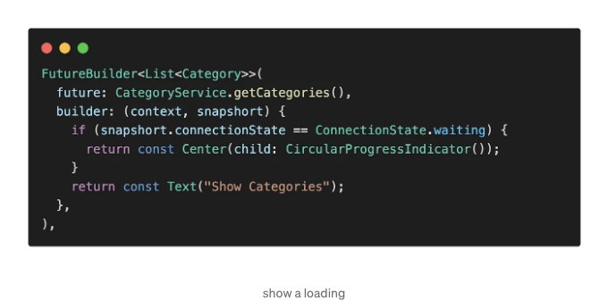
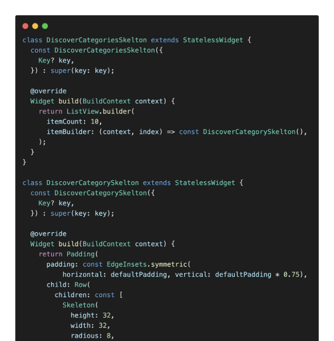
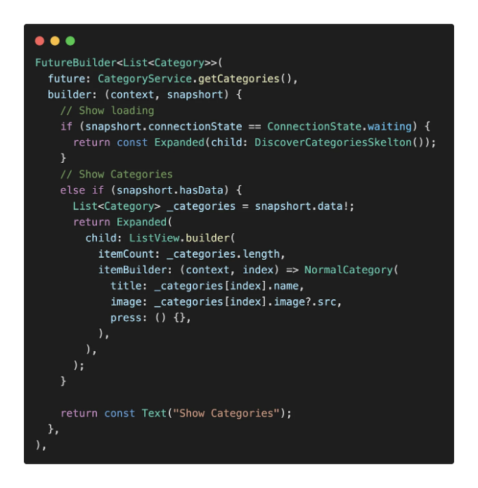
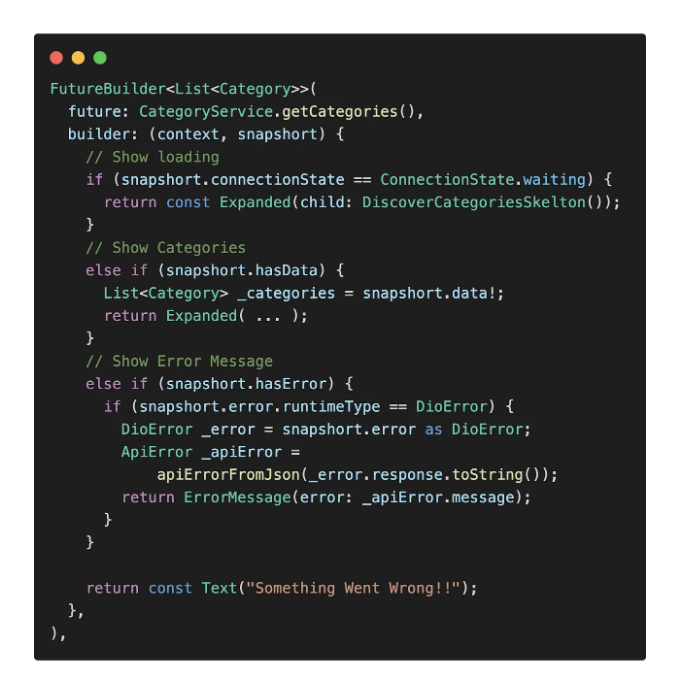
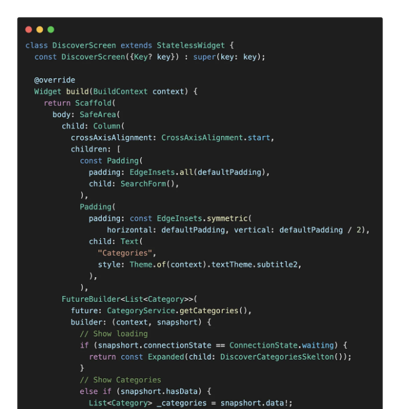
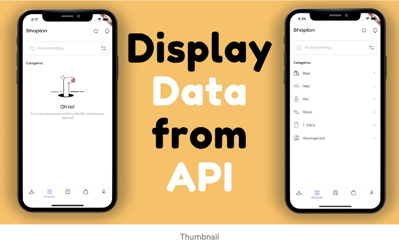

안녕하세요. 오늘은 데이터를 가져오는 동안 스켈턴 로딩 효과를 보여주는 방법과 오류가 발생할 경우 사용자 정의 오류 메시지를 표시하는 방법을 배울 것입니다.

시작해봅시다. 우리가 하려고 하는 것은 API에서 카테고리를 가져오는 것입니다. 이를 위해 CategoryService를 만들고 getCategories라는 메서드를 만듭니다. 이 메서드는 카테고리 목록을 반환하는 Future를 반환합니다. 우리는 API에 GET 요청을 보내고, 응답의 상태 코드가 200이면 응답을 카테고리 목록으로 변환합니다.

<!-- ui-log 수평형 -->

<ins class="adsbygoogle"
      style="display:block"
      data-ad-client="ca-pub-4877378276818686"
      data-ad-slot="9743150776"
      data-ad-format="auto"
      data-full-width-responsive="true"></ins>
<component is="script">
(adsbygoogle = window.adsbygoogle || []).push({});
</component>

DiscoverScreen에 카테고리를 표시할 시간이에요.

getCategories가 Future를 반환하는 것을 알고 계시죠. Flutter에서는 이미 Future의 결과를 활용하여 스스로를 구축하는 위젯인 FutureBuilder가 있어요. FutureBuilder 내부에는 future와 builder라는 2개의 매개변수를 전달해야 해요. future에는 Future를 반환하는 함수인 getCategories를 전달해야 하고, 다른 하나는 builder에요. 지금은 Text를 반환하도록 하죠.

<!-- ui-log 수평형 -->

<ins class="adsbygoogle"
      style="display:block"
      data-ad-client="ca-pub-4877378276818686"
      data-ad-slot="9743150776"
      data-ad-format="auto"
      data-full-width-responsive="true"></ins>
<component is="script">
(adsbygoogle = window.adsbygoogle || []).push({});
</component>

먼저 사용자가 어떤 작업이 진행 중인지 이해할 수 있도록 로딩을 보여주고 싶어요. 만약 connectionState가 대기 중이라면 지금은 CircularProgressIndicator로 표시된 로딩 표시자를 보여줍니다.

더 나은 사용자 경험을 위해 CircularProgressIndicator 대신 shimmer 로딩 효과를 사용할 수 있어요. Center 위젯을 Expanded로 대체하고 CircularProgressIndicator를 DiscoverCategoriesSkelton으로 대체하세요.

<!-- ui-log 수평형 -->

<ins class="adsbygoogle"
      style="display:block"
      data-ad-client="ca-pub-4877378276818686"
      data-ad-slot="9743150776"
      data-ad-format="auto"
      data-full-width-responsive="true"></ins>
<component is="script">
(adsbygoogle = window.adsbygoogle || []).push({});
</component>

만약 shimmer 효과를 만드는 방법을 배우고 싶다면 여기를 확인해보세요👇

<!-- ui-log 수평형 -->

<ins class="adsbygoogle"
      style="display:block"
      data-ad-client="ca-pub-4877378276818686"
      data-ad-slot="9743150776"
      data-ad-format="auto"
      data-full-width-responsive="true"></ins>
<component is="script">
(adsbygoogle = window.adsbygoogle || []).push({});
</component>

이제 로딩이 끝났습니다! 이제 카테고리를 보여주는 시간이에요. snapshort에 데이터가 있으면 데이터는 카테고리 목록이 됩니다. \_categories라는 변수를 만들고 값을 snapshort.data로 설정하세요. 카테고리를 확장 위젯 내부에 표시하려면 ListView.builder을 정의하고 itemCount를 \_categories.length로 설정하고 itemBuilder는 NormalCategory가 될 거에요. (이 NormalCategory 위젯은 제가 만들었습니다.)

거의 다 끝났어요! 하지만 오류가 발생했을 때 어떻게 처리해야 할까요? 사용자에게 오류가 발생했음을 알리는 것이 좋습니다.

<!-- ui-log 수평형 -->

<ins class="adsbygoogle"
      style="display:block"
      data-ad-client="ca-pub-4877378276818686"
      data-ad-slot="9743150776"
      data-ad-format="auto"
      data-full-width-responsive="true"></ins>
<component is="script">
(adsbygoogle = window.adsbygoogle || []).push({});
</component>

아래 내용이 좋을 수 있어요 👇

<!-- ui-log 수평형 -->

<ins class="adsbygoogle"
      style="display:block"
      data-ad-client="ca-pub-4877378276818686"
      data-ad-slot="9743150776"
      data-ad-format="auto"
      data-full-width-responsive="true"></ins>
<component is="script">
(adsbygoogle = window.adsbygoogle || []).push({});
</component>

