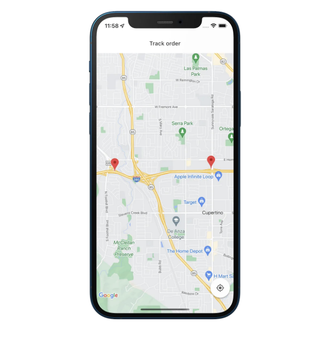
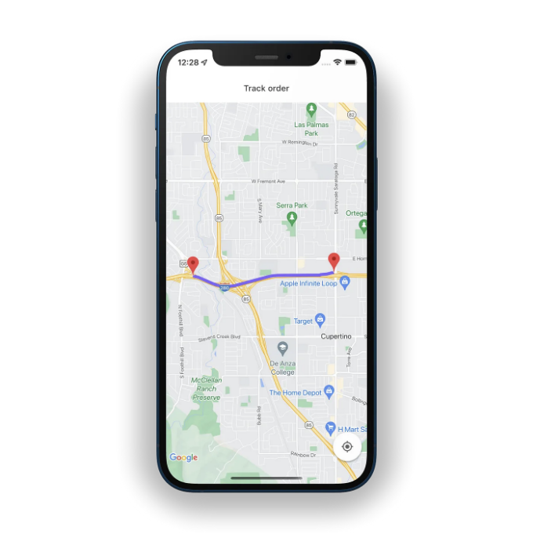

이 레슨을 통해 플러터에서 Google 지도를 사용하는 방법과 사용자 정의 이미지 마커 설정 및 경로 방향 폴리선을 그리는 방법을 배우게 될 거에요. 지도에 실시간 위치 업데이트를 추가하세요.


## 초기 설정 ⚙️

안드로이드 및 iOS 모두에서 위치 추적을 가능하게 하려면, 패키지의 README에서 안드로이드 매니페스트 파일과 iOS Info.plist에 대한 단계를 따라 환경을 적절히 준비하세요.

<!-- ui-log 수평형 -->

<ins class="adsbygoogle"
      style="display:block"
      data-ad-client="ca-pub-4877378276818686"
      data-ad-slot="9743150776"
      data-ad-format="auto"
      data-full-width-responsive="true"></ins>
<component is="script">
(adsbygoogle = window.adsbygoogle || []).push({});
</component>

설정이 완료되면 의존성은 아래와 같이 보입니다 👇

```js
dependencies:
  flutter:
    sdk: flutter
  cupertino_icons: ^1.0.2
  flutter_polyline_points: ^1.0.0
  google_maps_flutter: ^2.1.7
  location: ^4.4.0
```

## 구글 지도 🗺

OrderTrackingPage라는 StatefulWidget을 만들어 해당 State 클래스를 생성하세요. 필요한 패키지를 가져오고 이 튜토리얼을 위해 하드코딩된 출발지 및 목적지 위치 정보도 추가해주세요.

<!-- ui-log 수평형 -->

<ins class="adsbygoogle"
      style="display:block"
      data-ad-client="ca-pub-4877378276818686"
      data-ad-slot="9743150776"
      data-ad-format="auto"
      data-full-width-responsive="true"></ins>
<component is="script">
(adsbygoogle = window.adsbygoogle || []).push({});
</component>

```dart
import 'dart:async';
import 'package:flutter/material.dart';
import 'package:google_maps_flutter/google_maps_flutter.dart';

class OrderTrackingPage extends StatefulWidget {
  const OrderTrackingPage({Key? key}) : super(key: key);

  @override
  State<OrderTrackingPage> createState() => OrderTrackingPageState();
}

class OrderTrackingPageState extends State<OrderTrackingPage> {
  final Completer<GoogleMapController> _controller = Completer();

  static const LatLng sourceLocation = LatLng(37.33500926, -122.03272188);
  static const LatLng destination = LatLng(37.33429383, -122.06600055);

  @override
  Widget build(BuildContext context) {
    return Scaffold(
      body: Container(
        child: GoogleMap(
          initialCameraPosition: const CameraPosition(
            target: sourceLocation,
            zoom: 13.5,
          ),
          markers: {
            Marker(
              markerId: MarkerId("source"),
              position: sourceLocation,
            ),
            Marker(
              markerId: MarkerId("destination"),
              position: destination,
            ),
          },
          onMapCreated: (mapController) {
            _controller.complete(mapController);
          },
        ),
      ),
    );
  }
}
```

<!-- ui-log 수평형 -->

<ins class="adsbygoogle"
      style="display:block"
      data-ad-client="ca-pub-4877378276818686"
      data-ad-slot="9743150776"
      data-ad-format="auto"
      data-full-width-responsive="true"></ins>
<component is="script">
(adsbygoogle = window.adsbygoogle || []).push({});
</component>



## 경로 방향 그리기 〰

다음으로 할 일은 목적지에서 출발지로 선을 그리는 것이에요. polylineCoordinates라는 빈 목록을 만들고 PolylinePoints의 인스턴스를 만들어 getPolyPoints라고 불리는 비동기 함수를 생성해보세요. getRouteBetweenCoordinates 메소드는 폴리라인 포인트 목록을 반환해요. Google API 키, 출발지 및 목적지 위치가 필요해요. 포인트가 비어 있지 않다면, 그것들을 polylineCoordinates에 저장해볼게요.

```js
List<LatLng> polylineCoordinates = [];
void getPolyPoints() async {
  PolylinePoints polylinePoints = PolylinePoints();
  PolylineResult result = await polylinePoints.getRouteBetweenCoordinates(
    google_api_key, // 여러분의 구글 지도 키
    PointLatLng(sourceLocation.latitude, sourceLocation.longitude),
    PointLatLng(destination.latitude, destination.longitude),
  );
  if (result.points.isNotEmpty) {
    result.points.forEach(
      (PointLatLng point) => polylineCoordinates.add(
        LatLng(point.latitude, point.longitude),
      ),
    );
    setState(() {});
  }
}
```

<!-- ui-log 수평형 -->

<ins class="adsbygoogle"
      style="display:block"
      data-ad-client="ca-pub-4877378276818686"
      data-ad-slot="9743150776"
      data-ad-format="auto"
      data-full-width-responsive="true"></ins>
<component is="script">
(adsbygoogle = window.adsbygoogle || []).push({});
</component>

```js
@override
void initState() {
  getPolyPoints();
  super.initState();
}
```

GoogleMap 위젯으로 돌아가서 폴리라인을 정의하세요.

```js
GoogleMap(
...
  polylines: {
    Polyline(
      polylineId: const PolylineId("route"),
      points: polylineCoordinates,
      color: const Color(0xFF7B61FF),
      width: 6,
    ),
  },
)
```



<!-- ui-log 수평형 -->

<ins class="adsbygoogle"
      style="display:block"
      data-ad-client="ca-pub-4877378276818686"
      data-ad-slot="9743150776"
      data-ad-format="auto"
      data-full-width-responsive="true"></ins>
<component is="script">
(adsbygoogle = window.adsbygoogle || []).push({});
</component>

## 지도에서 실시간 위치 업데이트 🔴

이제 가장 흥미로운 부분에 왔어요. 기기의 위치가 필요해요. currentLocation이라는 널 가능한 변수를 만들고 getCurrentLocation이라는 함수를 작성해주세요. 함수 안에서 Location의 인스턴스를 생성하세요. 위치를 받으면 현재 위치를 해당 위치로 설정하세요. 위치 변경 시에는 현재 위치를 업데이트하세요. 지도에 보이게 하려면 setState를 호출하세요.

```js
LocationData? currentLocation;
void getCurrentLocation() async {
    Location location = Location();
    location.getLocation().then(
        (location) {
            currentLocation = location;
        },
    );
    GoogleMapController googleMapController = await _controller.future;
    location.onLocationChanged.listen(
        (newLoc) {
            currentLocation = newLoc;
            googleMapController.animateCamera(
                CameraUpdate.newCameraPosition(
                    CameraPosition(
                        zoom: 13.5,
                        target: LatLng(
                            newLoc.latitude!,
                            newLoc.longitude!,
                        ),
                    ),
                ),
            );
            setState(() {});
        },
    );
}
```

반드시 initState에서 getCurrentLocation을 호출해주세요.

<!-- ui-log 수평형 -->

<ins class="adsbygoogle"
      style="display:block"
      data-ad-client="ca-pub-4877378276818686"
      data-ad-slot="9743150776"
      data-ad-format="auto"
      data-full-width-responsive="true"></ins>
<component is="script">
(adsbygoogle = window.adsbygoogle || []).push({});
</component>

```js
void initState() {
  getPolyPoints();
  getCurrentLocation();
  super.initState();
}
```

만약 currentLocation이 null이면 로딩 텍스트가 표시됩니다. 또한, currentLocation을 위한 다른 마커/핀을 추가하고 초기 카메라 위치를 현재 위치로 변경합니다.

```js
body: currentLocation == null
  ? const Center(child: Text("로딩 중"))
  : GoogleMap(
      initialCameraPosition: CameraPosition(
        target: LatLng(
            currentLocation!.latitude!, currentLocation!.longitude!),
        zoom: 13.5,
      ),
      markers: {
        Marker(
          markerId: const MarkerId("currentLocation"),
          position: LatLng(
              currentLocation!.latitude!, currentLocation!.longitude!),
        ),
        const Marker(
          markerId: MarkerId("source"),
          position: sourceLocation,
        ),
        const Marker(
          markerId: MarkerId("destination"),
          position: destination,
        ),
      },
      onMapCreated: (mapController) {
        _controller.complete(mapController);
      },
      polylines: {
        Polyline(
          polylineId: const PolylineId("route"),
          points: polylineCoordinates,
          color: const Color(0xFF7B61FF),
          width: 6,
        ),
      },
    ),
```


```

<!-- ui-log 수평형 -->

<ins class="adsbygoogle"
      style="display:block"
      data-ad-client="ca-pub-4877378276818686"
      data-ad-slot="9743150776"
      data-ad-format="auto"
      data-full-width-responsive="true"></ins>
<component is="script">
(adsbygoogle = window.adsbygoogle || []).push({});
</component>

기능으로 이동한 다음 위치를 가리킬 때 "고속도로 주행"을 선택하세요. 나는 이 고속도로 주행에 따라 출발지 및 도착지 위치를 사용하고 있어.


만약 윈도우를 사용하거나 안드로이드 시뮬레이터를 사용 중이라면, 아래 세 점을 클릭하고 위치에 있다는 것을 확인하세요. 출발지가 Google Plex인 것으로 가정해보죠. sourceLocation을 이 좌표로 변경하고 도착지가 Microsoft 실리콘 밸리 캠퍼스인 경우 이 위치로 변경하세요. 이제 "routes" 탭을 클릭하고 시작점으로 Microsoft 실리콘 밸리와 Google Plex를 검색하세요. 경로를 저장하고, 재생 속도를 설정하고 경로 재생을 클릭하세요. 현재 위치가 이동 중이군요, 이것이 우리가 원하는 것입니다.

```js
static const LatLng sourceLocation = 여러분이 선택한 위치
static const LatLng destination = 여러분이 선택한 위치
```

<!-- ui-log 수평형 -->

<ins class="adsbygoogle"
      style="display:block"
      data-ad-client="ca-pub-4877378276818686"
      data-ad-slot="9743150776"
      data-ad-format="auto"
      data-full-width-responsive="true"></ins>
<component is="script">
(adsbygoogle = window.adsbygoogle || []).push({});
</component>

## 커스텀 마커/핀 추가하기 📍

출발지, 목적지, 현재 위치 아이콘이 동일합니다. 이제 커스텤 마커/핀을 사용해봅시다.

```js
BitmapDescriptor sourceIcon = BitmapDescriptor.defaultMarker;
BitmapDescriptor destinationIcon = BitmapDescriptor.defaultMarker;
BitmapDescriptor currentLocationIcon = BitmapDescriptor.defaultMarker;
void setCustomMarkerIcon() {
  BitmapDescriptor.fromAssetImage(
          ImageConfiguration.empty, "assets/Pin_source.png")
      .then(
    (icon) {
      sourceIcon = icon;
    },
  );
  BitmapDescriptor.fromAssetImage(
          ImageConfiguration.empty, "assets/Pin_destination.png")
      .then(
    (icon) {
      destinationIcon = icon;
    },
  );
  BitmapDescriptor.fromAssetImage(
          ImageConfiguration.empty, "assets/Badge.png")
      .then(
    (icon) {
      currentLocationIcon = icon;
    },
  );
}
```

initState에서 setCustomMarkerIcon을 호출하세요.

<!-- ui-log 수평형 -->

<ins class="adsbygoogle"
      style="display:block"
      data-ad-client="ca-pub-4877378276818686"
      data-ad-slot="9743150776"
      data-ad-format="auto"
      data-full-width-responsive="true"></ins>
<component is="script">
(adsbygoogle = window.adsbygoogle || []).push({});
</component>

```js
void initState() {
getPolyPoints();
getCurrentLocation();
setCustomMarkerIcon();
super.initState();
}
```

마지막으로, 마커 아이콘을 설정합니다.

```js
GoogleMap(
....
markers: {
Marker(
markerId: const MarkerId("currentLocation"),
icon: currentLocationIcon,
position: LatLng(
currentLocation!.latitude!, currentLocation!.longitude!),
),
Marker(
markerId: const MarkerId("source"),
icon: sourceIcon,
position: sourceLocation,
),
Marker(
markerId: MarkerId("destination"),
icon: destinationIcon,
position: destination,
),
},
),
```


```

<!-- ui-log 수평형 -->

<ins class="adsbygoogle"
      style="display:block"
      data-ad-client="ca-pub-4877378276818686"
      data-ad-slot="9743150776"
      data-ad-format="auto"
      data-full-width-responsive="true"></ins>
<component is="script">
(adsbygoogle = window.adsbygoogle || []).push({});
</component>
