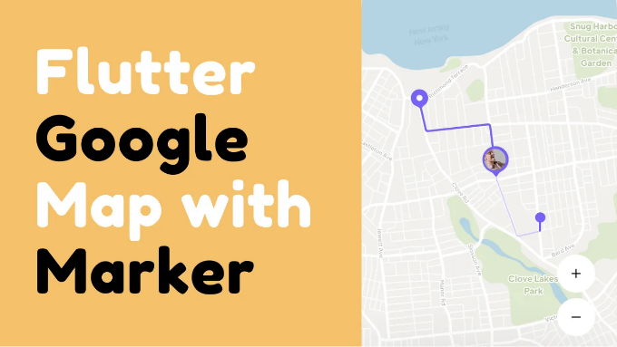
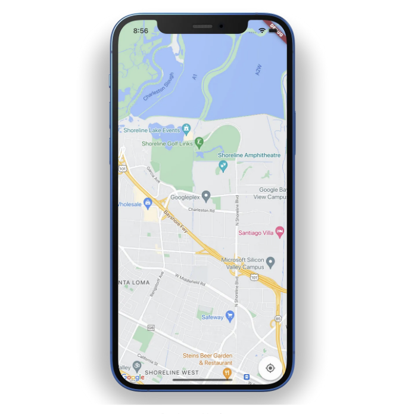
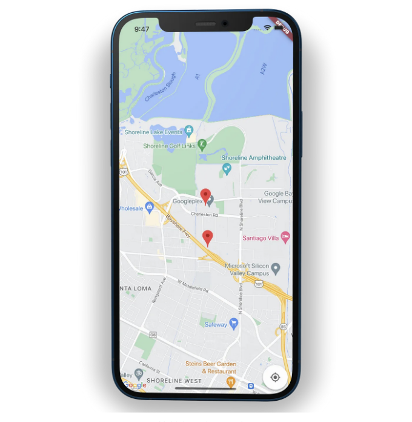
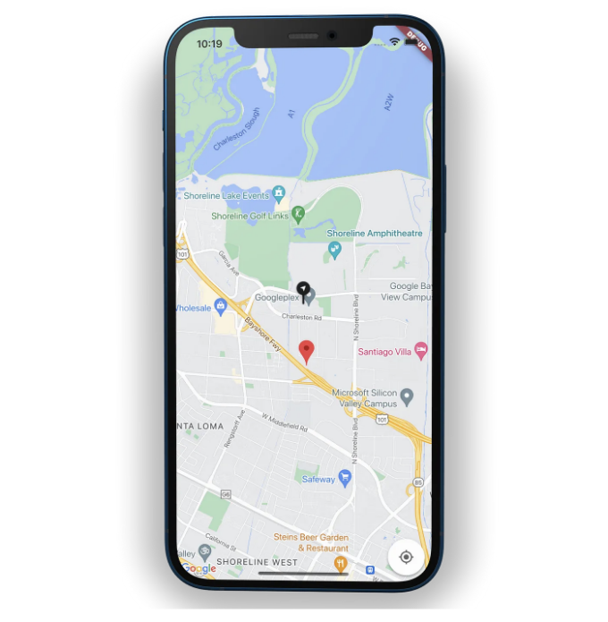

플러터 앱에 구글 지도를 추가하고 지루한 마커를 멋진 것으로 바꿔 봅시다.



## API 키 가져오기

플러터 애플리케이션에서 구글 지도를 사용하려면 Google Maps 플랫폼과 API 프로젝트를 구성해야 합니다.

<!-- ui-log 수평형 -->

<ins class="adsbygoogle"
      style="display:block"
      data-ad-client="ca-pub-4877378276818686"
      data-ad-slot="9743150776"
      data-ad-format="auto"
      data-full-width-responsive="true"></ins>
<component is="script">
(adsbygoogle = window.adsbygoogle || []).push({});
</component>

- 구글 맵스 플랫폼에 접속해 ` 새 프로젝트를 생성하거나 기존 프로젝트를 사용하세요.
- 라이브러리 페이지에서 ` "Maps SDK"를 검색하세요.
- Maps SDK for iOS를 클릭하고 활성화를 선택하세요.
- Maps SDK for Android를 클릭하고 활성화를 선택하세요.
- 자격 증명 페이지에서 자격 증명 생성을 선택하고 API 키를 생성하세요. (새로 생성된 API 키가 표시됩니다.)
- API 키가 자격 증명 페이지의 API 키 아래에 나열됩니다. 이름을 바꾸려면 편집 아이콘을 클릭하세요. (팁: 제품에서 사용하기 전에 API 키를 제한하는 것이 좋습니다.)

API 키를 가져오는 데 문제가 있다면, 여기 비디오를 확인해보세요👇

## Google Maps Flutter 패키지를 종속성으로 추가하기

Flutter에서 패키지를 사용하면 추가 기능을 추가할 수 있습니다. 다음 명령을 실행하세요.

<!-- ui-log 수평형 -->

<ins class="adsbygoogle"
      style="display:block"
      data-ad-client="ca-pub-4877378276818686"
      data-ad-slot="9743150776"
      data-ad-format="auto"
      data-full-width-responsive="true"></ins>
<component is="script">
(adsbygoogle = window.adsbygoogle || []).push({});
</component>

```js
flutter pub add google_maps_flutter
```

또는 의존성 아래 패키지를 추가하기

```js
dependencies:
  google_maps_flutter: ^2.2.1
```

## 안드로이드 앱에 API 키 추가하기

<!-- ui-log 수평형 -->

<ins class="adsbygoogle"
      style="display:block"
      data-ad-client="ca-pub-4877378276818686"
      data-ad-slot="9743150776"
      data-ad-format="auto"
      data-full-width-responsive="true"></ins>
<component is="script">
(adsbygoogle = window.adsbygoogle || []).push({});
</component>

안드로이드 앱에 API 키를 추가하려면 android/app/src/main 내에서 AndroidManifest.xml 파일을 편집하세요. 이전 단계에서 생성된 API 키를 포함하는 단일 meta-data 항목을 application 노드 내에 추가하십시오.

```js
<manifest ...
  <application ...
    <meta-data android:name="com.google.android.geo.API_KEY"
               android:value="여기에 키 입력"/>
```

또한 android/app/build.gradle에서 minSdkVersion을 20으로 설정하세요.

```js
android {
    defaultConfig {
        minSdkVersion 20
    }
}
```

<!-- ui-log 수평형 -->

<ins class="adsbygoogle"
      style="display:block"
      data-ad-client="ca-pub-4877378276818686"
      data-ad-slot="9743150776"
      data-ad-format="auto"
      data-full-width-responsive="true"></ins>
<component is="script">
(adsbygoogle = window.adsbygoogle || []).push({});
</component>

## iOS 앱에 API 키 추가하기

iOS 앱에 API 키를 추가하려면 ios/Runner 폴더의 AppDelegate.swift 파일을 편집하세요. 아래 코드로 전체 코드를 교체해주세요 👇

```js
import UIKit
import Flutter
import GoogleMaps  // 이 import 추가

@UIApplicationMain
@objc class AppDelegate: FlutterAppDelegate {
  override func application(
    _ application: UIApplication,
    didFinishLaunchingWithOptions launchOptions: [UIApplication.LaunchOptionsKey: Any]?
  ) -> Bool {
    GeneratedPluginRegistrant.register(with: self)

    // TODO: 여기에 Google Maps API 키를 추가하세요
    GMSServices.provideAPIKey("YOUR-API-KEY")

    return super.application(application, didFinishLaunchingWithOptions: launchOptions)
  }
}
```

## Google 지도 화면 생성

<!-- ui-log 수평형 -->

<ins class="adsbygoogle"
      style="display:block"
      data-ad-client="ca-pub-4877378276818686"
      data-ad-slot="9743150776"
      data-ad-format="auto"
      data-full-width-responsive="true"></ins>
<component is="script">
(adsbygoogle = window.adsbygoogle || []).push({});
</component>

지금은 화면에 지도를 표시하는 시간입니다. 지도를 표시하기 위해 initialCameraPosition이 필요합니다. 사용자의 현재 위치가 될 수도 있지만, 단순화를 위해 강력한 값을 사용했습니다.

```js
import 'package:flutter/material.dart';
import 'package:google_maps_flutter/google_maps_flutter.dart';

class MapScreen extends StatefulWidget {
  const MapScreen({super.key});

  @override
  State<MapScreen> createState() => _MapScreenState();
}

class _MapScreenState extends State<MapScreen> {
  LatLng initialLocation = const LatLng(37.422131, -122.084801);

  // 할 일: 사용자 정의 마커 추가

  @override
  Widget build(BuildContext context) {
    return Scaffold(
      body: GoogleMap(
        initialCameraPosition: CameraPosition(
          target: initialLocation,
          zoom: 14,
        ),
        // 할 일: 마커 추가
      ),
    );
  }
}
```



## 지도에 마커 추가

<!-- ui-log 수평형 -->

<ins class="adsbygoogle"
      style="display:block"
      data-ad-client="ca-pub-4877378276818686"
      data-ad-slot="9743150776"
      data-ad-format="auto"
      data-full-width-responsive="true"></ins>
<component is="script">
(adsbygoogle = window.adsbygoogle || []).push({});
</component>

마커는 특정 위치를 식별하는 데 유용합니다. 지도에 여러 마커를 추가할 수 있어요. 'To DO: add markers'를 아래와 같이 바꿔주세요 👇

```js
markers: {
  Marker(
    markerId: const MarkerId("marker1"),
    position: const LatLng(37.422131, -122.084801),
    draggable: true,
    onDragEnd: (value) {
      // 새 위치는 value에 저장돼요
    },
    // 할 일: 커스텀 마커 아이콘
  ),

  Marker(
    markerId: const MarkerId("marker2"),
    position: const LatLng(37.415768808487435, -122.08440050482749),
  ),
},
```

사용자가 마커 위치를 변경할 수 있게 하려면 draggable를 true로 설정하세요. 기본값은 false입니다. onDragEnd는 새 위치 LatLng를 제공합니다.



<!-- ui-log 수평형 -->

<ins class="adsbygoogle"
      style="display:block"
      data-ad-client="ca-pub-4877378276818686"
      data-ad-slot="9743150776"
      data-ad-format="auto"
      data-full-width-responsive="true"></ins>
<component is="script">
(adsbygoogle = window.adsbygoogle || []).push({});
</component>

## 맵에 사용자 정의 이미지 마커 설정하기

에셋에 마커 이미지를 추가하고, 마커 아이콘을 설정하는 메소드를 생성했어요. 아래 코드로 ToDo: 사용자 정의 마커 추가하세요 👇

```js
BitmapDescriptor markerIcon = BitmapDescriptor.defaultMarker;
@override
void initState() {
  addCustomIcon();
  super.initState();
}
void addCustomIcon() {
  BitmapDescriptor.fromAssetImage(
          const ImageConfiguration(), "assets/Location_marker.png")
      .then(
    (icon) {
      setState(() {
        markerIcon = icon;
      });
    },
  );
}
```

마커 아이디가 marker1인 첫 번째 마커로 돌아갑니다. 아이콘을 markerIcon으로 설정해주세요.

<!-- ui-log 수평형 -->

<ins class="adsbygoogle"
      style="display:block"
      data-ad-client="ca-pub-4877378276818686"
      data-ad-slot="9743150776"
      data-ad-format="auto"
      data-full-width-responsive="true"></ins>
<component is="script">
(adsbygoogle = window.adsbygoogle || []).push({});
</component>

```js
Marker(
  markerId: const MarkerId("marker1"),
  position: const LatLng(37.422131, -122.084801),
  draggable: true,
  onDragEnd: (value) {
    // value is the new position
  },
  icon: markerIcon,
),
```


