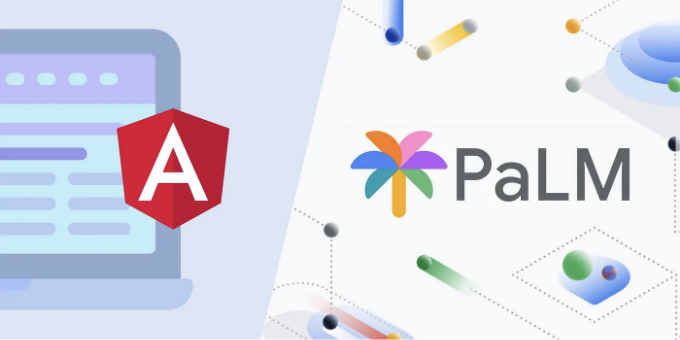
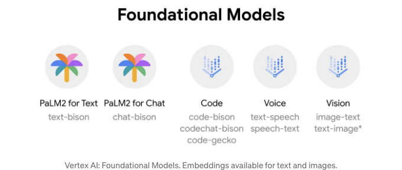
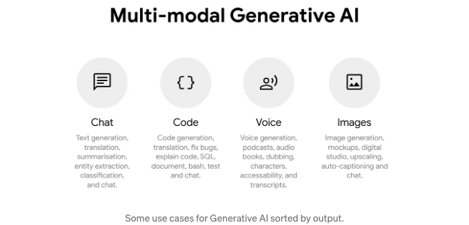
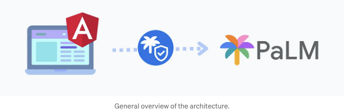
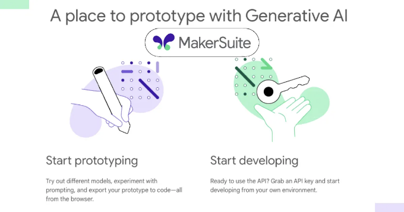

# Vertex AI는 PaLM 2를 포함한 최첨단 생성 AI를 위한 Google Cloud 플랫폼입니다.



이 게시물에서는 방금 출시된 PaLM API에 액세스하여 Angular를 사용하여 AI가 가능한 애플리케이션의 차세대를 만드는 방법을 배우게 됩니다.

Angular를 사용하여 PaLM에 텍스트 모델을 요청하는 간단한 애플리케이션을 만들 것입니다. 이를 완료하면 다른 모델 중 하나를 사용할 수 있습니다. 다룰 내용은 다음과 같습니다:

<!-- ui-log 수평형 -->

<ins class="adsbygoogle"
      style="display:block"
      data-ad-client="ca-pub-4877378276818686"
      data-ad-slot="9743150776"
      data-ad-format="auto"
      data-full-width-responsive="true"></ins>
<component is="script">
(adsbygoogle = window.adsbygoogle || []).push({});
</component>

- Generative AI 소개
- 책임 있는 AI
- Vertex AI의 API 자격 증명 획득
- Google Cloud를 통한 API 액세스 설정
- Angular 애플리케이션 생성
- 예측 요청 만들기
- 예측 응답 처리
- 결론
- 부록 1: MakerSuite의 API 키 사용? 그렇지 않으면 대기 목록에 등록
- 부록 2: 프롬프트 기본 사항: 온도, 상위 K 및 상위 P
- 부록 3: 응답 메타데이터: 인용, 안전 속성 및 청구

이 자습서는 PaLM 같은 모델을 사용하여 응용 프로그램에 AI 기능을 추가할 수 있도록 Vertex AI를 설정하는 데 도움이 될 것입니다. 시작해 봅시다!

# Generative AI 소개

Vertex AI는 텍스트 생성, 채팅, 이미지 편집, 코드, 음성 등과 같은 작업용 미리 훈련된 모델을 제공합니다. 이들은 API 요청을 통해 액세스할 수 있습니다. 또한, 처음부터 모델을 만들고 세밀 조정하기 위한 관리 서비스가 필요하다면 이를 사용하여 모델을 생성, 호스팅 및 관리할 수도 있습니다.

<!-- ui-log 수평형 -->

<ins class="adsbygoogle"
      style="display:block"
      data-ad-client="ca-pub-4877378276818686"
      data-ad-slot="9743150776"
      data-ad-format="auto"
      data-full-width-responsive="true"></ins>
<component is="script">
(adsbygoogle = window.adsbygoogle || []).push({});
</component>



## Generative AI란?

Generative AI는 AI 안에서 새롭게 떠오르고 있는 매우 흥미로운 분야로, 인공 지능(AI), 기계 학습(ML), 신경망으로 구성됩니다. 2017년 구글이 발표한 트랜스포머와 어텐션 메커니즘이 함께 작동하여 새로운 파생적 AI와 기본 모델을 구동합니다.

대형 언어 모델은 방대한 텍스트로 사전 훈련되어 시퀀스에서 다음 단어를 예측하는 것을 목표로 합니다. 훈련을 마치면 주어진 프롬프트에 관련된 새로운 텍스트를 생성할 수 있으며, 소설의 무한 문단, 레시피의 재료 목록 또는 일반 지식 질문에 대한 답변을 제공할 수 있습니다.

<!-- ui-log 수평형 -->

<ins class="adsbygoogle"
      style="display:block"
      data-ad-client="ca-pub-4877378276818686"
      data-ad-slot="9743150776"
      data-ad-format="auto"
      data-full-width-responsive="true"></ins>
<component is="script">
(adsbygoogle = window.adsbygoogle || []).push({});
</component>

훈련 데이터는 인터넷, 책, 그리고 GitHub과 유사한 코드 저장소 등에서 제공되는 공개 데이터를 포함하고 있습니다.

## 현재 사람들이 어떻게 생성 모델 인공지능을 사용하고 있을까요?

Transformer를 기반으로 한 모델들이 많은 전통적인 머신 러닝 방법들을 능가하고 있습니다. 최근에는 텍스트만이 아닌 이미지, 비디오, 오디오와 같은 입력 및 출력을 결합하여 훈련할 수 있는 Multi-Modal 아키텍처에 초점이 맞춰진 연구가 이뤄지고 있습니다. 이러한 접근 방식은 AlphaGo를 만든 DeepMind에서 개발 중인 Gemini와 같은 모델에도 적용되고 있습니다.



<!-- ui-log 수평형 -->

<ins class="adsbygoogle"
      style="display:block"
      data-ad-client="ca-pub-4877378276818686"
      data-ad-slot="9743150776"
      data-ad-format="auto"
      data-full-width-responsive="true"></ins>
<component is="script">
(adsbygoogle = window.adsbygoogle || []).push({});
</component>

오늘날 사람들이 생성적 AI를 사용하는 몇 가지 예시:

- 창의적인 텍스트 생성
- 챗봇과 가상 비서
- 텍스트 요약
- 이미지 생성 및 편집

# 책임 있는 AI

생성적 AI는 흥미로운 새로운 응용 프로그램을 가능하게 하지만, 이러한 강력한 모델은 동시에 개발자로서 고려해야 할 중요한 윤리적 문제를 도입합니다. 잠재적인 피해를 고려하고 적절한 제약을 설정하며 남용을 모니터링하여 AI를 신중하게 구축하는 책임이 있습니다.

<!-- ui-log 수평형 -->

<ins class="adsbygoogle"
      style="display:block"
      data-ad-client="ca-pub-4877378276818686"
      data-ad-slot="9743150776"
      data-ad-format="auto"
      data-full-width-responsive="true"></ins>
<component is="script">
(adsbygoogle = window.adsbygoogle || []).push({});
</component>

이러한 모델을 애플리케이션에 통합할 때는 인간 리뷰 프로세스 및 민감도 분석과 같은 전략을 실행하여 기술의 남용이나 위험한 사용을 방지해야 합니다.

새로운 AI 기능을 출시하기 전에 고려해야 할 몇 가지 질문:

- 감사 및 추적성 - 악용 또는 의문의 AI 사용의 원천을 파악할 수 있도록 어떻게 지원할 것인가? 어떤 로깅 및 감사 능력을 구현해야 하는가?
- 즉각적인 프레임 및 기초 - 우리의 애플리케이션이 AI 생성 콘텐츠에 대한 적절한 맥락을 제공하는 방법은 무엇인가? 맥락이 없으면 오해가 쉽게 발생할 수 있습니다.
- 결과 모니터링 - 부정확한 출력이 발생하면 어떻게 수정할 것인가? 사용자를 위한 어떤 피드백 메커니즘이 존재해야 하는가?
- 편견 완화 - AI 출력이 어떻게 소수 그룹에 부정적인 영향을 미치거나 부당하게 묘사할 수 있는가? 편향을 사전에 테스트하는 방법은 무엇인가?

자세한 내용은 Google의 책임 있는 AI 접근 방식을 참조하십시오.

<!-- ui-log 수평형 -->

<ins class="adsbygoogle"
      style="display:block"
      data-ad-client="ca-pub-4877378276818686"
      data-ad-slot="9743150776"
      data-ad-format="auto"
      data-full-width-responsive="true"></ins>
<component is="script">
(adsbygoogle = window.adsbygoogle || []).push({});
</component>

주요 개념을 다룬 지금, Vertex AI에 액세스하고 Angular 애플리케이션에서 요청을 하는 방법을 살펴봅시다.

# Vertex AI용 API 자격 증명 가져오기

이전 섹션에서 Vertex AI를 소개하고 제공하는 모델 및 기능에 대해 논의했습니다. 이제 Vertex AI에 액세스하기 위한 자격 증명을 얻는 단계입니다.



<!-- ui-log 수평형 -->

<ins class="adsbygoogle"
      style="display:block"
      data-ad-client="ca-pub-4877378276818686"
      data-ad-slot="9743150776"
      data-ad-format="auto"
      data-full-width-responsive="true"></ins>
<component is="script">
(adsbygoogle = window.adsbygoogle || []).push({});
</component>

# Google Cloud API 액세스 설정

API 액세스를 보호하기 위해 계정을 만들고 응용 프로그램용 자격 증명을 획들해야 합니다. 이렇게 하면 다른 사람이 액세스할 수 없도록 할 수 있어요. 아래는 해야 할 단계들입니다:

- Google Cloud 계정을 등록하고 요금을 활성화합니다. 이렇게 하면 Vertex AI에 액세스할 수 있어요.
- Cloud Console에서 새 프로젝트를 만듭니다. 프로젝트 ID를 기록해 두세요.
- 프로젝트에 Vertex AI API를 활성화합니다.
- gcloud CLI를 설치하고 gcloud auth print-access-token을 실행합니다. 출력된 액세스 토큰을 저장하세요. 이것은 인증에 사용됩니다.

프로젝트 ID와 액세스 토큰이 있으면 Angular 앱으로 계속 진행할 준비가 되었어요. 모든 것이 올바르게 설정되어 있는지 확인하려면 이 curl 명령을 시도해 볼 수 있어요.

<!-- ui-log 수평형 -->

<ins class="adsbygoogle"
      style="display:block"
      data-ad-client="ca-pub-4877378276818686"
      data-ad-slot="9743150776"
      data-ad-format="auto"
      data-full-width-responsive="true"></ins>
<component is="script">
(adsbygoogle = window.adsbygoogle || []).push({});
</component>

# Angular 애플리케이션 만들기

Angular CLI를 사용하여 새 애플리케이션을 생성할 거에요:

```js
ng new vertex-ai-palm2-angular
```

이 명령어로 최신 Angular 버전을 사용하는 새 프로젝트가 만들어집니다.

<!-- ui-log 수평형 -->

<ins class="adsbygoogle"
      style="display:block"
      data-ad-client="ca-pub-4877378276818686"
      data-ad-slot="9743150776"
      data-ad-format="auto"
      data-full-width-responsive="true"></ins>
<component is="script">
(adsbygoogle = window.adsbygoogle || []).push({});
</component>

API 요청을 하려면 HttpClient 모듈이 필요합니다:

```js
// app.module.ts
import {HttpClientModule} from '@angular/common/http';

@NgModule({
  imports: [
    HttpClientModule
  ]
})
```

이러한 import로 HttpClient를 모든 컴포넌트 또는 서비스에 주입하여 웹 요청을 수행할 수 있습니다.

# 예측 요청하기

<!-- ui-log 수평형 -->

<ins class="adsbygoogle"
      style="display:block"
      data-ad-client="ca-pub-4877378276818686"
      data-ad-slot="9743150776"
      data-ad-format="auto"
      data-full-width-responsive="true"></ins>
<component is="script">
(adsbygoogle = window.adsbygoogle || []).push({});
</component>

아래와 같이 prompt를 실행할 컴포넌트를 생성해봅시다:

```js
ng generate component predict
```

predict.component.ts 파일에서 HttpClient를 설정하고 API 요청을 위한 준비를 할 코드를 사용할 것입니다:

```js
import { Component, OnInit } from '@angular/core';
import { HttpClient, HttpHeaders } from '@angular/common/http';
import { createPrompt, TextRequest, TextResponse } from '../models/vertex-ai';

@Component(...)
export class PredictComponent implements OnInit {
  endpoint: string = "";
  headers: HttpHeaders | undefined;
  prompt: TextRequest = createPrompt("What is the largest number with a name?");

  constructor(public http: HttpClient) {
  }

  ngOnInit(): void {
    this.TestVertexAIWithoutApiKey();
  }
}
```

<!-- ui-log 수평형 -->

<ins class="adsbygoogle"
      style="display:block"
      data-ad-client="ca-pub-4877378276818686"
      data-ad-slot="9743150776"
      data-ad-format="auto"
      data-full-width-responsive="true"></ins>
<component is="script">
(adsbygoogle = window.adsbygoogle || []).push({});
</component>

통화하기 위해 몇 가지 단계로 나누어 보겠습니다.

## 프롬프트 생성

프롬프트를 생성하기 위해 우리는 도우미 함수를 사용하고 있습니다. 이 함수는 우리의 예측을 보내기 위해 사용할 요청 JSON 객체를 반환합니다.

```js
/// src/app/models/vertex-ai.ts

export function createPrompt(prompt: string = "이름이 있는 가장 큰 숫자는 무엇일까요?", temperature: number = 0.7, maxOutputTokens: number = 100, topP: number = 0.95, topK: number = 40): TextRequest {
  const request: TextRequest = {
    instances: [
      {
        prompt: `${prompt}`,
      },
    ],
    parameters: {
      temperature: temperature,
      maxOutputTokens: maxOutputTokens,
      topP: topP,
      topK: topK,
    },
  };
  return request;
}
```

<!-- ui-log 수평형 -->

<ins class="adsbygoogle"
      style="display:block"
      data-ad-client="ca-pub-4877378276818686"
      data-ad-slot="9743150776"
      data-ad-format="auto"
      data-full-width-responsive="true"></ins>
<component is="script">
(adsbygoogle = window.adsbygoogle || []).push({});
</component>

## 엔드포인트 URL 만들기

이 엔드포인트는 기본 URL, API 버전, 프로젝트 ID, Google Cloud 지역, 퍼블리셔, 모델 이름 및 특정 액션을 통합하여 전체 예측 엔드포인트 URL을 형성해야 합니다. 이러한 요소들을 연결하여 전체 예측 엔드포인트 URL을 만듭니다.

```js
buildEndpointUrl(projectId: string) {
  const BASE_URL = "https://us-central1-aiplatform.googleapis.com/";
  const API_VERSION = 'v1';        // 현재 시점에 따라 다를 수 있음
  const MODEL = 'text-bison';

  let url = BASE_URL;              // 기본 URL
  url += API_VERSION;              // API 버전
  url += "/projects/" + projectId; // 프로젝트 ID
  url += "/locations/us-central1"; // Google Cloud 지역
  url += "/publishers/google";     // 퍼블리셔
  url += "/models/" + MODEL;       // 모델
  url += ":predict";               // 액션

  this.endpoint = url;
}
```

이 특정 엔드포인트는 text-bison에 있는 predict API를 호출합니다. 다른 사용 가능한 API(chat, code, images, speech)를 시도하려면 여기에서 자세한 내용을 찾을 수 있습니다. 단, 각 API는 서로 다른 엔드포인트, 요청 및 응답을 갖고 있음을 유의해야 합니다.

<!-- ui-log 수평형 -->

<ins class="adsbygoogle"
      style="display:block"
      data-ad-client="ca-pub-4877378276818686"
      data-ad-slot="9743150776"
      data-ad-format="auto"
      data-full-width-responsive="true"></ins>
<component is="script">
(adsbygoogle = window.adsbygoogle || []).push({});
</component>

## Authentication

다음으로, 이전에 검색한 액세스 토큰을 HTTP 헤더에 추가하여 요청을 인증했습니다:

```js
getAuthHeaders(accessToken: string) {
  this.headers = new HttpHeaders()
    .set('Authorization', `Bearer ${accessToken}`);
}
```

보안 자격 증명을 준수하기 위해 인증 헤더를 추가했습니다.

<!-- ui-log 수평형 -->

<ins class="adsbygoogle"
      style="display:block"
      data-ad-client="ca-pub-4877378276818686"
      data-ad-slot="9743150776"
      data-ad-format="auto"
      data-full-width-responsive="true"></ins>
<component is="script">
(adsbygoogle = window.adsbygoogle || []).push({});
</component>

## 요청 보내기

마침내, 모든 이전 단계를 사용하여 예측 엔드포인트에 POST 요청을 보냅니다. 응답을 처리하기 위해, 우리는 구독 콜백을 정의하여 콘솔에 예측 내용을 출력합니다. 아래 코드에서 응답 객체의 일부로 확인할 수 있습니다.

```js
TestVertexAIWithoutApiKey() {
  const PROJECT_ID = '<YOUR_PROJECT_ID>';
  const GCLOUD_AUTH_PRINT_ACCESS_TOKEN = '<YOUR_GCLOUD_AUTH_PRINT_ACCESS_TOKEN>';

  this.buildEndpointUrl(PROJECT_ID);
  this.getAuthHeaders(GCLOUD_AUTH_PRINT_ACCESS_TOKEN);

  this.http.post<TextResponse>(this.endpoint, this.prompt, { headers: this.headers })
    .subscribe(response => {
      console.log(response.predictions[0].content);
    });
}
```

# 예측 응답 처리

<!-- ui-log 수평형 -->

<ins class="adsbygoogle"
      style="display:block"
      data-ad-client="ca-pub-4877378276818686"
      data-ad-slot="9743150776"
      data-ad-format="auto"
      data-full-width-responsive="true"></ins>
<component is="script">
(adsbygoogle = window.adsbygoogle || []).push({});
</component>

터미널에서 다음 명령을 실행하고 localhost:4200으로 이동하세요.

```js
ng serve
```

## 응답 확인하기

예측 호출의 응답을 확인하려면 브라우저의 콘솔 출력을 신속하게 확인할 수 있습니다.

<!-- ui-log 수평형 -->

<ins class="adsbygoogle"
      style="display:block"
      data-ad-client="ca-pub-4877378276818686"
      data-ad-slot="9743150776"
      data-ad-format="auto"
      data-full-width-responsive="true"></ins>
<component is="script">
(adsbygoogle = window.adsbygoogle || []).push({});
</component>

```js
console.log(response.predictions[0].content);
```

```js
{
  "predictions": [
    {
      "content": "이름이 있는 가장 큰 숫자는 구글 플렉스입니다. 구글 플렉스는 1 다음에 100 개의 영 숫자가 따릅니다."
    }
  ],
}
```

축하합니다! 이제 Vertex AI API에 액세스할 수 있습니다. 그리고 그건 정말로 Angular 애플리케이션에 텍스트 예측을 위한 PaLM을 통합하는 데 필요한 모든 것입니다. 전체 코드는 GitHub에서 사용할 수 있습니다.

# 결론

<!-- ui-log 수평형 -->

<ins class="adsbygoogle"
      style="display:block"
      data-ad-client="ca-pub-4877378276818686"
      data-ad-slot="9743150776"
      data-ad-format="auto"
      data-full-width-responsive="true"></ins>
<component is="script">
(adsbygoogle = window.adsbygoogle || []).push({});
</component>

이 튜토리얼을 완료하면 다음을 배웠습니다:

- 자격 증명을 얻고 Vertex AI API에 액세스하는 방법
- CLI를 사용하여 Angular 애플리케이션을 만드는 방법
- 생성 모델에 예측 요청하는 방법
- 응답을 처리하고 생성된 텍스트를 출력하는 방법

이제 당신은 Vertex AI를 사용하여 고급 텍스트 생성과 같은 AI 기능을 자신의 Angular 앱에 추가하는 기초가 되었습니다.

<!-- ui-log 수평형 -->

<ins class="adsbygoogle"
      style="display:block"
      data-ad-client="ca-pub-4877378276818686"
      data-ad-slot="9743150776"
      data-ad-format="auto"
      data-full-width-responsive="true"></ins>
<component is="script">
(adsbygoogle = window.adsbygoogle || []).push({});
</component>

## 크레딧: AI 어시스턴트

이 게시물은 몇 명의 AI 어시스턴트와 함께 공동으로 작성되었습니다. Claude는 아이디어를 구조화하고 콘텐츠를 작성하는 과정 전반에 걸쳐 제게 협업했습니다. 가상 글쓰기 친구로서의 피곤하지 않는 노력은 이 튜토리얼을 만드는 데 중요한 역할을 했습니다. 이후 Bard와 ChatGPT는 제게 최종 버전에 도달하는 데 도움을 주는 데 정기적으로 협조해주었습니다.

무료로 Claude를 이용해보세요: [여기에서 무료로 시도해보세요](https://claude.ai)

<!-- ui-log 수평형 -->

<ins class="adsbygoogle"
      style="display:block"
      data-ad-client="ca-pub-4877378276818686"
      data-ad-slot="9743150776"
      data-ad-format="auto"
      data-full-width-responsive="true"></ins>
<component is="script">
(adsbygoogle = window.adsbygoogle || []).push({});
</component>



# 부록 1: MakerSuite의 API 키를 사용하고 싶나요? 대기 목록에 가입하세요

이 부록에서는 API 키를 사용하여 Vertex AI에 액세스하는 방법을 배우게 됩니다. 먼저, MakerSuite에서 유효한 API 키를 가지고 있는지 확인하거나, 미국 이외에 거주하는 경우 여기에서 대기 목록에 가입을 요청해야 합니다. API 키를 빨리 확인하려면 curl 요청을 사용할 수 있습니다.

API 키를 받은 후 다음 단계를 따르세요:

<!-- ui-log 수평형 -->

<ins class="adsbygoogle"
      style="display:block"
      data-ad-client="ca-pub-4877378276818686"
      data-ad-slot="9743150776"
      data-ad-format="auto"
      data-full-width-responsive="true"></ins>
<component is="script">
(adsbygoogle = window.adsbygoogle || []).push({});
</component>

## Prediction 구성 요소 변경

이제 예측을 호출하는 코드는 다음과 같이 변합니다:

```js
TestVertexAIWithApiKey() {
  const API_KEY = '<YOUR_API_KEY>';

  this.buildEndpointUrlApiKey(API_KEY);

  this.http.post<TextResponse>(this.endpoint, this.prompt)
    .subscribe(response => {
      console.log(response.predictions[0].content);
    });
}
```

API_KEY를 사용자 고유의 값으로 바꾸고, 요청 본문에 프롬프트 텍스트를 전달한 후, 예측 엔드포인트로 POST 요청을 수행합니다. 나머지 코드를 빠르게 살펴봅시다. buildEndpointUrl 함수를 구분하여 각 부분이 어떻게 연결되는지 보여드렸습니다.

<!-- ui-log 수평형 -->

<ins class="adsbygoogle"
      style="display:block"
      data-ad-client="ca-pub-4877378276818686"
      data-ad-slot="9743150776"
      data-ad-format="auto"
      data-full-width-responsive="true"></ins>
<component is="script">
(adsbygoogle = window.adsbygoogle || []).push({});
</component>

```js
buildEndpointUrlApiKey(apikey: string) {
  const BASE_URL = "https://generativelanguage.googleapis.com/";
  const API_VERSION = 'v1beta2';   // 현재와 다를 수 있음 예: v1, v2 등
  const MODEL = 'text-bison-001';  // 현재와 다를 수 있음

  let url = BASE_URL;              // 기본 URL
  url += API_VERSION;              // API 버전
  url += "/models/" + MODEL        // 모델
  url += ":generateText";          // 액션
  url += "?key=" + apikey;         // API 키

  this.endpoint = url;
}
```

이 엔드포인트는 특히 text-bison-001에서 generateText API를 호출합니다. 다른 사용 가능한 API(채팅, 코드, 이미지, 음성) 중 하나를 시도하려면 여기에서 세부 정보를 찾으세요. 그러나 각 API마다 다른 엔드포인트, 요청 및 응답이 있다는 점을 인지하세요.

코드 전체는 GitHub에서 확인할 수 있습니다.

<!-- ui-log 수평형 -->

<ins class="adsbygoogle"
      style="display:block"
      data-ad-client="ca-pub-4877378276818686"
      data-ad-slot="9743150776"
      data-ad-format="auto"
      data-full-width-responsive="true"></ins>
<component is="script">
(adsbygoogle = window.adsbygoogle || []).push({});
</component>

# 부록 2: 프롬프트 기본사항 이해하기: 온도, 상위K 및 상위P

프롬프트 매개변수는 주어진 프롬프트에 대한 출력을 영향을 줄 수 있는 몇 가지 기본 인자들입니다. 예를 들어, 이러한 매개변수는 보다 일반적이지 않고 더 창의적인 출력을 얻기 위해 조절할 수 있습니다.

## 토큰 vs 단어

PaLM API에 프롬프트를 텍스트 형식으로 제출하지만, API는 이러한 문자열을 토큰이라 불리는 청크(조각)으로 변환합니다. 토큰은 대략 4개의 문자와 동일합니다. 100개의 토큰은 대략 60~80개의 단어에 해당합니다.

<!-- ui-log 수평형 -->

<ins class="adsbygoogle"
      style="display:block"
      data-ad-client="ca-pub-4877378276818686"
      data-ad-slot="9743150776"
      data-ad-format="auto"
      data-full-width-responsive="true"></ins>
<component is="script">
(adsbygoogle = window.adsbygoogle || []).push({});
</component>

```json
{
  "predictions": [
    {
      "content": "이름이 붙은 가장 큰 숫자는 구골플렉스입니다. 구골플렉스는 1 뒤에 100개의 영이 따라오는 숫자입니다."
    }
  ],
  "metadata": {
    "tokenMetadata": {
      "inputTokenCount": {
        "totalTokens":
      },
      "outputTokenCount": {
        "totalTokens":
      }
    }
  }
}
```

일부 작업에는 이러한 매개변수의 기본 설정을 검토하여 더 나은 결과를 얻을 필요가 있습니다.

더 자세히 살펴보겠습니다:

- prompt. 이 매개변수는 텍스트 입력이 됩니다. 예: 이름이 붙은 가장 큰 숫자는 무엇인가요? 이 프롬프트를 테스트만 하기 위해 자유롭게 변경해 보세요. 필수.
- temperature. 이 매개변수는 디코딩 전략 중 덜 일반적인 옵션을 도입할 수 있게 해줍니다. 이로 인해 더 창의적이거나 반복적이지 않은 응답이 가능성이 높아집니다. 0으로 설정하면 탐욕스러운 전략을 사용하고 첫 번째 옵션이 선택됩니다. 권장됩니다.
- maxOutputTokens. 이 매개변수는 이 프롬프트에 의해 생성된 토큰의 총 수를 제한합니다. 출력이 일부 잘려 응답 일부가 누락될 수 있습니다. 테스트 중에 비용에 유의하십시오. 최대 값은 1024입니다. 권장됩니다.```

<!-- ui-log 수평형 -->

<ins class="adsbygoogle"
      style="display:block"
      data-ad-client="ca-pub-4877378276818686"
      data-ad-slot="9743150776"
      data-ad-format="auto"
      data-full-width-responsive="true"></ins>
<component is="script">
(adsbygoogle = window.adsbygoogle || []).push({});
</component>

대부분의 경우, 기본값만으로도 충분할 것입니다.

## 답변 범위 확장: TopK 및 TopP

가끔은 특정 프롬프트를 테스트하고, 기대에 더 부합하거나 해당 작업에 더 적합한 다른 응답을 찾고 싶을 수 있습니다. 이러한 경우에는 TopK 및 TopP를 사용하여 더 많고 다양한 응답의 범위를 확장할 수 있습니다.

아래 다이어그램에 나와 있는 것처럼, 특정 온도를 고정하고 각각 TopP 및 TopK를 증가시킴으로써 더 많은 변동성을 도입할 수 있습니다. 최종 결과는 해당 특정 프롬프트에 대한 확률 분포에 따라 달라질 것입니다.

<!-- ui-log 수평형 -->

<ins class="adsbygoogle"
      style="display:block"
      data-ad-client="ca-pub-4877378276818686"
      data-ad-slot="9743150776"
      data-ad-format="auto"
      data-full-width-responsive="true"></ins>
<component is="script">
(adsbygoogle = window.adsbygoogle || []).push({});
</component>

앞서 언급한 내용을 다시 한 번 리뷰해보겠습니다:

- topK. 이 매개변수는 샘플된 옵션을 k로 제한합니다. 기본값은 40으로 설정되어 있습니다. 선택 사항입니다.
- topP. 이 매개변수는 누적 확률을 최대 p로 제한합니다. 기본값은 0.95입니다. 0부터 1까지의 값이 가능합니다. 선택 사항입니다.

topK와 topP가 모두 제공되면 topP 적용 전에 topK가 우선합니다. 마지막으로 샘플링된 토큰 내에서 임의의 선택이 이루어집니다. 각 토큰의 확률은 해당 모델의 트레이닝이 끝난 후의 결과입니다.

프롬프트를 테스트할 때 일반적으로 사용하는 전략:

<!-- ui-log 수평형 -->

<ins class="adsbygoogle"
      style="display:block"
      data-ad-client="ca-pub-4877378276818686"
      data-ad-slot="9743150776"
      data-ad-format="auto"
      data-full-width-responsive="true"></ins>
<component is="script">
(adsbygoogle = window.adsbygoogle || []).push({});
</component>

- 훈련 중 발견된 가장 일반적인 토큰으로 응답을 제한합니다. 온도를 0으로 설정하고 topP를 0.2로 설정하세요. 이렇게 하면 모델의 확률을 준수하고 훈련 중 모델이 본 사례의 20% 내에 있는 토큰을 선택합니다. 이렇게 함으로써 프롬프트의 긴 꼬리 분포를 제한할 수도 있습니다.

- 덜 일반적인 토큰 및 더 창의적인 응답 허용: 온도를 0.7로 설정하고 topK를 40으로 설정하세요. 이렇게 하면 덜 일반적인 사례의 확률이 높아져 출력에 표시될 수 있습니다. 이 전략은 각 프롬프트 및 훈련 중 해당 프롬프트와 관련된 교육 데이터의 양에 따라 다릅니다.

## 부록 3: 응답 메타데이터: 인용, 안전 속성 및 청구

응답의 일환으로, 인용, 안전 및 청구에 관한 흥미로운 메타데이터에 액세스할 수 있습니다. 참조를 위해 전체 구조를 아래에서 확인하십시오. 자세한 내용은 책임 있는 AI를 참조하십시오.

```js
{
  "predictions": [
    {
      "content": "가장 큰 이름이 지정된 수는 구구펠렉스입니다. 구구펠렉스는 1 뒤에 100개의 영을 더한 수입니다.",
      "citationMetadata": {
        "citations": []
      },
      "safetyAttributes": {
        "scores": [],
        "blocked": false,
        "categories": []
      }
    }
  ],
  "metadata": {
    "tokenMetadata": {
      "inputTokenCount": {
        "totalBillableCharacters": ,
        "totalTokens":
      },
      "outputTokenCount": {
        "totalBillableCharacters": ,
        "totalTokens":
      }
    }
  }
}
```

<!-- ui-log 수평형 -->

<ins class="adsbygoogle"
      style="display:block"
      data-ad-client="ca-pub-4877378276818686"
      data-ad-slot="9743150776"
      data-ad-format="auto"
      data-full-width-responsive="true"></ins>
<component is="script">
(adsbygoogle = window.adsbygoogle || []).push({});
</component>

## 안전

생성적 AI는 아직 매우 새로운 기술입니다. 앱에 AI 기능을 추가할 때는 현재 PaLM API의 제한 사항을 주의해야 합니다. 이 제한 사항은 다음과 같습니다:

- 모델 환영, 제한, 사실성
- 편견 및 제한된 도메인 전문지식

책임 있는 AI에서 제시된 권장 사항을 따라 이러한 문제를 완화하는 방법을 배워보세요.

<!-- ui-log 수평형 -->

<ins class="adsbygoogle"
      style="display:block"
      data-ad-client="ca-pub-4877378276818686"
      data-ad-slot="9743150776"
      data-ad-format="auto"
      data-full-width-responsive="true"></ins>
<component is="script">
(adsbygoogle = window.adsbygoogle || []).push({});
</component>

## Vertex AI 요금 청구

이 글에서 사용된 500개의 요청과 해당하는 500개의 응답은 1,000 문자당 다음과 같은 비용이 듭니다:

- 텍스트에 대한 PaLM: $1
- 채팅이나 코드에 대한 PaLM: $0.5
- 텍스트나 이미지에 대한 임베딩: $0.1

가격은 시간에 따라 변동할 수 있습니다. 입력과 출력은 별도로 과금됩니다. 최신 요금을 확인하세요.

<!-- ui-log 수평형 -->

<ins class="adsbygoogle"
      style="display:block"
      data-ad-client="ca-pub-4877378276818686"
      data-ad-slot="9743150776"
      data-ad-format="auto"
      data-full-width-responsive="true"></ins>
<component is="script">
(adsbygoogle = window.adsbygoogle || []).push({});
</component>


