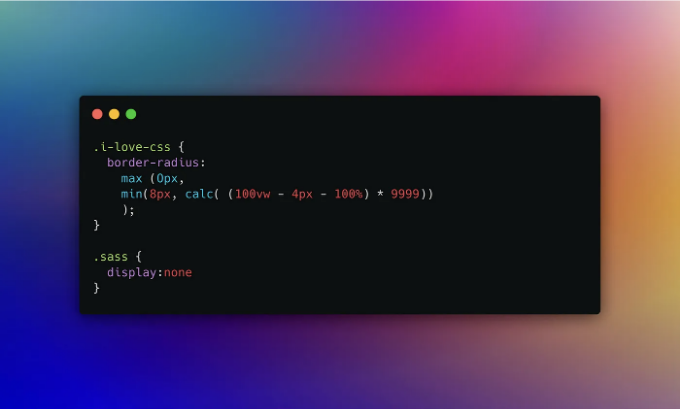

Sass는 강력한 전처리기로 자리를 잡아 왔습니다. 10년 넘게 프로젝트의 중심 역할을 해 왔는데, 확장 가능하고 안정적인 CSS 패키지를 효과적으로 구성할 수 있도록 도와주었습니다. 오늘날에도 여전히 Sass를 엄청난 강력한 도구로 여기고 있습니다. 그러나 우리가 2024년으로 나아가는 시점에서 CSS가 빠르게 발전했다는 점은 부인할 수 없습니다. Sass만의 독특한 기능들이 현재 CSS에 기본적으로 통합되었습니다. 그 중에서 변수와 가장 최신 기능인 CSS 중첩도 포함됩니다.

# 변수

```js
:root {
  --button-padding: 10px 20px;
  --button-bg-color: #007bff;
  --button-text-color: #ffffff;
  --button-border-radius: 8px;
}

.button {
  padding: var(--button-padding);
  background-color: var(--button-bg-color);
  color: var(--button-text-color);
  border-radius: var(--button-border-radius);
  border: none;
  cursor: pointer;
  transition: background-color 0.3s;
}
```

<!-- ui-log 수평형 -->

<ins class="adsbygoogle"
      style="display:block"
      data-ad-client="ca-pub-4877378276818686"
      data-ad-slot="9743150776"
      data-ad-format="auto"
      data-full-width-responsive="true"></ins>
<component is="script">
(adsbygoogle = window.adsbygoogle || []).push({});
</component>

변수를 정의하는 것은 오랫동안 SCSS의 독특한 강점으로 간주되어 왔습니다. 이는 많은 속성을 중앙에서 관리할 수 있게 해주어 CSS에서 오랫동안 그리워했던 기능이었습니다. 그러나 오늘날에는 CSS에서도 Sass와 유사한 방식으로 변수를 정의할 수 있습니다. 그러나 중요한 차이점은 Sass 변수가 전처리기 컨텍스트 내에서만 존재하는 반면 CSS 변수는 브라우저에서 사용할 수 있고 JavaScript를 통해 동적으로 덮어쓸 수 있다는 것입니다.

# CSS 중첩

```js
.blog {
  position: relative;
  padding: 1rem;
  background: var(--neutral-100);

    .blog-item {
      border: 1px solid var(--neutral-200);

      & span {
        font-size: 1rem;
      }
  }
}
```

다른 요소의 스타일 규칙을 정의할 수 있는 능력은 CSS 작성을 획기적으로 단순화합니다. 부모 선택기 내에서 하위 요소나 가상 선택기에 동일한 선택기를 반복 사용하는 대신 중첩을 사용하면 이들을 부모 선택기 내에 그룹화할 수 있습니다. 이 기술은 명확하고 계층적으로 구조화된 효율적인 코드베이스로 이어지게 됩니다.

<!-- ui-log 수평형 -->

<ins class="adsbygoogle"
      style="display:block"
      data-ad-client="ca-pub-4877378276818686"
      data-ad-slot="9743150776"
      data-ad-format="auto"
      data-full-width-responsive="true"></ins>
<component is="script">
(adsbygoogle = window.adsbygoogle || []).push({});
</component>

CSS 중첩의 브라우저 지원률이 84% 이상이고 중첩 선택자의 경우 86% 이상이므로 이 기술은 점점 더 접근성이 좋아지고 있습니다.

# :is 가상 클래스

```js
:is(selector1, selector2, selector3) {
  /* 스타일 */
}
```

:is 가상 클래스는 선택자 개념을 혁신적으로 변화시켜 여러 선택자 목록을 허용하고 이러한 선택자 중 어느 것이든 일치하는 모든 요소에 스타일을 적용합니다. 이로써 DOM에서 요소를 선택하고 스타일링하는 것이 용이해집니다.

<!-- ui-log 수평형 -->

<ins class="adsbygoogle"
      style="display:block"
      data-ad-client="ca-pub-4877378276818686"
      data-ad-slot="9743150776"
      data-ad-format="auto"
      data-full-width-responsive="true"></ins>
<component is="script">
(adsbygoogle = window.adsbygoogle || []).push({});
</component>

긴 선택기 목록 대신 :is()를 사용하여 가독성을 향상시키고 긴 선택기를 피할 수 있습니다.

# :has() 가상 클래스

```js
.hero:has(.hero-button) {
  background-color: var(--accent-50);
}
```

CSS 가상 클래스 :has()는 후손에 기반하여 요소를 선택하는 강력한 방법을 제공하여 조건부 스타일을 적용하는 것과 유사합니다.

<!-- ui-log 수평형 -->

<ins class="adsbygoogle"
      style="display:block"
      data-ad-client="ca-pub-4877378276818686"
      data-ad-slot="9743150776"
      data-ad-format="auto"
      data-full-width-responsive="true"></ins>
<component is="script">
(adsbygoogle = window.adsbygoogle || []).push({});
</component>

# 컨테이너 쿼리

```js
.component {
  --테마: dark;
  container-name: fancy;
}

@container fancy style(--테마: dark) {
  .fancy {
    /* 어두운 스타일. */
  }
}
```

```js
@container (min-width: 720px) {
  .headline {
    font-size: 2em;
  }
}
```

컨테이너 쿼리는 CSS3 이후 웹 디자인에서 가장 혁신적인 기술로 평가됩니다. 반응형 디자인의 개념을 확장하여 요소가 컨테이너의 크기에 따라 조정되도록 합니다. 이 기술을 통해 요소의 디자인이 동적으로 변경되어 다양한 상황에 따라 유연하고 적응적인 디자인을 할 수 있습니다.

<!-- ui-log 수평형 -->

<ins class="adsbygoogle"
      style="display:block"
      data-ad-client="ca-pub-4877378276818686"
      data-ad-slot="9743150776"
      data-ad-format="auto"
      data-full-width-responsive="true"></ins>
<component is="script">
(adsbygoogle = window.adsbygoogle || []).push({});
</component>

만약 fancy 컨테이너가 변수 — theme: dark를 가지고 있다면 아래 CSS를 추가해주세요.

# 캐스케이드 레이어스

```js
@layer utilities {
  .button {
    padding: 0.5rem;
  }

  .button--lg {
    padding: 0.8rem;
  }
}
```

캐스케이드 레이어스를 사용하면 클래스, 아이디 등을 중첩하지 않고도 높은 특이성을 위해 자체 레이어(레이어)를 할당하여 사용할 수 있습니다. @layer 규칙을 사용하고 레이어드 @imports를 통해 캐스케이드의 자체 레이어를 구축할 수 있습니다. 낮은 우선순위 스타일부터 리셋 및 기본값, 테마, 프레임워크, 디자인 시스템, 컴포넌트, 유틸리티, 오버라이드 스타일까지 커스텀 레이어를 구축할 수 있습니다. 캐스케이드 레이어는 더 많은 제어를 제공합니다.

<!-- ui-log 수평형 -->

<ins class="adsbygoogle"
      style="display:block"
      data-ad-client="ca-pub-4877378276818686"
      data-ad-slot="9743150776"
      data-ad-format="auto"
      data-full-width-responsive="true"></ins>
<component is="script">
(adsbygoogle = window.adsbygoogle || []).push({});
</component>

# Sass의 미래

그 말은 Sass가 더 이상 쓸모가 없어졌다는 걸 의미합니까? 전혀 아닙니다. 픽셀을 rem으로 변환하는 믹스인과 함수 등은 여전히 Sass의 대체할 수 없는 장점입니다. 그럼에도 불구하고, 저는 대부분의 프로젝트에서 Sass를 포기하기로 결정했습니다. 대신 Sublime Editor에서 미리 정의된 코드 블록과 패키지를 사용하여 작업 흐름을 크게 개선했습니다.

# 안녕 SASS?

2024년에는 Sass의 혜택인 설치, 사용 및 컴파일 문제가 더 이상 사용하기에 정당화되지 않을 것이라고 확신합니다. 현대 CSS의 확장성과 사용자 친화성 덕분에 추가 도구 없이도 충분히 할 수 있게 되었습니다.

<!-- ui-log 수평형 -->

<ins class="adsbygoogle"
      style="display:block"
      data-ad-client="ca-pub-4877378276818686"
      data-ad-slot="9743150776"
      data-ad-format="auto"
      data-full-width-responsive="true"></ins>
<component is="script">
(adsbygoogle = window.adsbygoogle || []).push({});
</component>

저의 Themex 프로젝트는 새로운 CSS 기능을 결합할 때 얼마나 강력한지 보여줍니다: [https://app.themexproject.com](https://app.themexproject.com)

CSS의 발전으로 인해 작고 큰 프로젝트를 직접적이고 쉽게 구현하는 것을 기대합니다.

안녕 Sass, 고맙습니다!


<!-- ui-log 수평형 -->

<ins class="adsbygoogle"
      style="display:block"
      data-ad-client="ca-pub-4877378276818686"
      data-ad-slot="9743150776"
      data-ad-format="auto"
      data-full-width-responsive="true"></ins>
<component is="script">
(adsbygoogle = window.adsbygoogle || []).push({});
</component>

원래 2024년 3월 20일에 https://dev.to에서 게시되었습니다.
