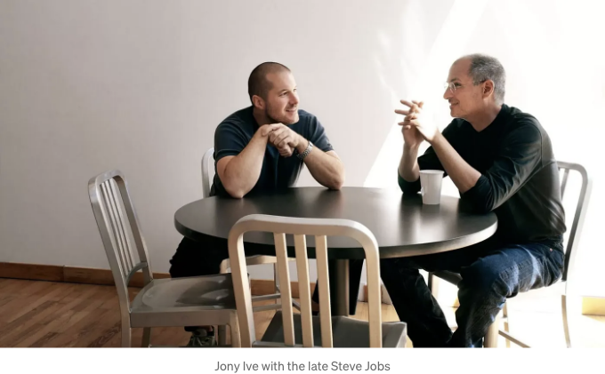

작은 숙박 및 조식이 제공되었던 창업자의 전세 집에서 시작해 수십억 달러 규모의 다국적 숙박 회사가 된 에어비앤비 - 그들의 성공에 핵심적인 역할을 한 것 중 하나는 디자인입니다.

이 모든 것은 디자인 씽킹 배경을 가진 공동 창업자 중 한 명인 조 게비아 덕분에 시작되었습니다. 그들의 첫 번째 모바일 앱이 회사 출범 후 3년 뒤에 출시되었음에도 불구하고, 사용자 중심 접근 방식이 그들에게 첫 번째 고객을 확보하는 데 도움이 되었습니다. 단순히 매출에만 초점을 맞추는 대신 사용자 문제와 고통 포인트, 시장 조사 및 관찰에 주안점을 두었습니다. 이것이 UX 디자이너가 경력에서 추구해야 하는 바이지만, 이 회사는 개업 첫 날부터 그것을 이해했습니다.

이번에 에어비앤비가 디자인 배경을 가진 리더 덕분에 성공한 것은 처음이 아닙니다. 그들은 브랜드 디자인을 위해 인기 있는 디자인 스튜디오인 런던 디자인스튜디오를 고용하고, 자체 내부 혁신과 디자인 스튜디오인 "사마라"를 론칭한 것으로 알려져 있습니다.

<!-- ui-log 수평형 -->

<ins class="adsbygoogle"
      style="display:block"
      data-ad-client="ca-pub-4877378276818686"
      data-ad-slot="9743150776"
      data-ad-format="auto"
      data-full-width-responsive="true"></ins>
<component is="script">
(adsbygoogle = window.adsbygoogle || []).push({});
</component>

사마라는 종종 전 애플 디자이너와 리더를 고용해 프로젝트를 이끌었어요. 애플의 DNA가 에어비앤비의 디자인에 스며들기 시작했고, 이 경우에는 정말 대단한 움직임이었죠.

이 글을 통해 어떻게 그리고 왜 이 모든 일이 일어났는지 살펴보겠습니다.

# 처음 단계 - 그들의 첫 웹사이트

<!-- ui-log 수평형 -->

<ins class="adsbygoogle"
      style="display:block"
      data-ad-client="ca-pub-4877378276818686"
      data-ad-slot="9743150776"
      data-ad-format="auto"
      data-full-width-responsive="true"></ins>
<component is="script">
(adsbygoogle = window.adsbygoogle || []).push({});
</component>

에어비앤비의 초기 경영 연도에서의 방향 전환을 빠르게 보여주는 첫 번째 디자인은 매우 뚜렷합니다. 첫 번째 웹사이트는 제공하는 서비스를 자연스럽게 전달하는 데 어려움을 겪지만, 독특한 그래픽은 웹사이트에 약간의 개성을 더해줍니다. 최신 웹사이트는 분명히 더 상업적이며 일부 산업 표준 디자인을 따르고 있습니다.

## — 로고의 큰 변화

초기 로고는 공동 창업자 중 한 명 인 브라이언 체스키가 디자인했으며 정말 멋진 시도입니다! 이 워드 마크는 나중에 간단화되어 우리가 익숙한 이름으로 줄여졌습니다. 이로써 사용자들은 로고보다는 목적지를 찾기에 집중할 수 있습니다. 불행히도, 과거의 엄청난 핑크와 파란색에서 점차 우리가 사랑하는 연한 연어색으로 색상을 개선하는 데 조금 더 오랜 시간이 걸렸습니다.

## — 사용자를 중요한 부분으로 이끄는 것

<!-- ui-log 수평형 -->

<ins class="adsbygoogle"
      style="display:block"
      data-ad-client="ca-pub-4877378276818686"
      data-ad-slot="9743150776"
      data-ad-format="auto"
      data-full-width-responsive="true"></ins>
<component is="script">
(adsbygoogle = window.adsbygoogle || []).push({});
</component>

디자인 패턴을 이해하는 것은 특히 사용자 중심 디자인에 관련해서 매우 중요합니다. 이 시각적 히트 맵은 제목이 얼마나 많은 주목을 받는지 명확히 보여주며, 사용자가 서치 바로 이동하고 행동을 취하는 것을 따릅니다.

다른 매우 뚜렷한 차이점은 페이지 하단에 로고들이 모아져 있는 것입니다. 이로써 그들의 브랜드에 어떤 신뢰도를 만들어 내고 있음을 확인할 수 있습니다. 이것은 처음 몇 번의 시도에서는 없던 것이었습니다.

또한 레이아웃의 일관된 그리드 형식을 알아차릴 수 있습니다. 이는 웹 사이트가 반응형으로 유지되는데 도움을 주면서 더 나은 계층구조를 가지게 해줍니다. 그들은 또한 타이포그래피를 수정하여 웹 사이트 전체적으로 1–2 산세리프 폰트에 집중하도록 했습니다. 이제 이 웹 사이트는 대학 프로젝트가 아닌 실제 회사 웹 사이트 같은 느낌이 듭니다.

<!-- ui-log 수평형 -->

<ins class="adsbygoogle"
      style="display:block"
      data-ad-client="ca-pub-4877378276818686"
      data-ad-slot="9743150776"
      data-ad-format="auto"
      data-full-width-responsive="true"></ins>
<component is="script">
(adsbygoogle = window.adsbygoogle || []).push({});
</component>

# 세상이 모바일 우선으로 변하다 — 그들의 모바일 앱이 등장합니다

미국에서 스마트폰이 일반화되면서, 안드루 빌차크는 개발 팀을 이끌고 사용자 중심의 모바일 앱을 만들었습니다. 이 앱은 놀랄만한 기능을 갖추고 있었습니다. 사용자들은 에어비앤비를 빠르게 검색하고 호스트와 연락을 취하며 여행 일정을 예약할 수 있었습니다. 이 앱은 모바일 웹사이트 업데이트와 함께 출시되었으며, 처음에는 안드로이드에서만 이용할 수 있었습니다.

사실, 안드루의 첫 번째 에어비앤비 앱을 자랑하는 TechCrunch 인터뷰 비디오를 찾아보았습니다.

<!-- ui-log 수평형 -->

<ins class="adsbygoogle"
      style="display:block"
      data-ad-client="ca-pub-4877378276818686"
      data-ad-slot="9743150776"
      data-ad-format="auto"
      data-full-width-responsive="true"></ins>
<component is="script">
(adsbygoogle = window.adsbygoogle || []).push({});
</component>

인터뷰만으로도 회사의 방향과 디지털 플랫폼이 어떤 방향으로 나아가는지를 알 수 있어요. Andrew는 명확한 디자인에 집중하고, 고객들이 원하는 것을 아는 능력과 호스트-게스트 관계를 디지털적으로 균형있게 유지하는 것에 초점을 맞추고 계셨어요.

## – 본질에 담긴 스키오모피즘

안드로이드 앱은 기능적으로 작동했지만, 무엇보다 그 시기에 맞게 아주 잘 디자인된 앱이었어요. 그때 당시에는 일반적이었던 지속적인 3D 및 스키오모피즘 디자인을 알아차렸어요. 그러나 디자인 트렌드를 따르는 것은 구현이 중요한 요소에요.

<!-- ui-log 수평형 -->

<ins class="adsbygoogle"
      style="display:block"
      data-ad-client="ca-pub-4877378276818686"
      data-ad-slot="9743150776"
      data-ad-format="auto"
      data-full-width-responsive="true"></ins>
<component is="script">
(adsbygoogle = window.adsbygoogle || []).push({});
</component>

나는 현실적인 버튼 디자인을 정말 좋아해서 가격표가 멋진 포인트라고 생각해.

호텔 예약 회사에서 일해본 경험이 있어서 이 앱은 정말 잘 구조화되어 있고, 가격은 명확하게 표시되어 있고, 명확한 계층 구조와 강렬한 CTA, 그리고 쉬운 탐색 기능을 가지고 있어. 이 디자인은 우리가 몇 년 동안 배운 UX 디자인 법칙과 원칙 대부분을 갖추고 있어.

이 앱은 관련 데이터와 독특한 레이아웃 부족으로 고생하지만, 2012년에 만들어진 앱으로 수고한 점이 크다. 그들은 분명히 모든 것을 한 번에 정리하려는 것이 아니라 중요한 부분에 더 많은 시간과 노력을 기울였다. 지금까지 보았던 것으로 보아, 그들은 항상 반복적인 디자인에 초점을 맞춰왔어.

# 그들의 처음으로 나아가는 큰 걸음 — “Belo”

<!-- ui-log 수평형 -->

<ins class="adsbygoogle"
      style="display:block"
      data-ad-client="ca-pub-4877378276818686"
      data-ad-slot="9743150776"
      data-ad-format="auto"
      data-full-width-responsive="true"></ins>
<component is="script">
(adsbygoogle = window.adsbygoogle || []).push({});
</component>

모든 회사에는 수년간 사업을 진행하면서 기본이 되는 중요한 순간이 있습니다. 에어비앤비의 경우, 진정한 도미노 효과를 가져온 거대한 재설계였습니다.

“벨로(Bélo)” 심볼은 에어비앤비가 그들의 분야에서 선두 주자가 되면서 대중 문화 아이콘이 되었습니다. 2014년에 디자인 된 이 새로운 로고는 여행뿐만 아니라 관광 분야의 다른 영역으로 확장하는 데 도움이 되었습니다. 사람들은 로고를 자유롭게 해석할 수 있었습니다(위 이미지에서 볼 수 있습니다). 이 로고는 원래의 워드마크를 완전히 대체하게 되었습니다.

많은 경우 “회사 리브랜딩”이 따르는 디자인 변경이 그들의 디지털 존재 전반에 걸쳐 많이 이루어집니다. 그들의 앱과 웹사이트는 화면에 있는 정보 양을 수용하기 위해 거대하게 발전했으며, 더욱 깔끔하고 미니멀한 성격을 띄었는데, 이는 점점 커지는 미니멀 디자인 트렌드를 따르기 위한 것이기도 합니다.

<!-- ui-log 수평형 -->

<ins class="adsbygoogle"
      style="display:block"
      data-ad-client="ca-pub-4877378276818686"
      data-ad-slot="9743150776"
      data-ad-format="auto"
      data-full-width-responsive="true"></ins>
<component is="script">
(adsbygoogle = window.adsbygoogle || []).push({});
</component>

## 대규모 재설계에서 무엇이 변했나요?

- 텍스트와 그리드를 포함한 중앙 정렬된 레이아웃입니다.
- 모든 것이 여백이 넓게 확보돼 요소 주변에 풍부한 공백이 있습니다.
- 샘몬 색상이 주 버튼에서 나타납니다.
- 다양한 제품 제안을 내세우고 사람들을 호스트로 초대합니다.
- 랜딩 페이지에 내용 부족이 약간 실망스럽습니다. 화면 공간을 효과적으로 활용할 수 있었을 텐데요.
- 새로운 로고가 모든 곳에서 사용되어 알기 쉽습니다.

# 프로젝트 사마라 소개

<!-- ui-log 수평형 -->

<ins class="adsbygoogle"
      style="display:block"
      data-ad-client="ca-pub-4877378276818686"
      data-ad-slot="9743150776"
      data-ad-format="auto"
      data-full-width-responsive="true"></ins>
<component is="script">
(adsbygoogle = window.adsbygoogle || []).push({});
</component>

회사가 디자인 중심의 미래로 나아가는 가장 중요한 한 걸음은 자체 디자인 스튜디오인 Samara를 열어서 내놓는 것입니다. Samara는 회사의 혁신 지점 중 하나로, 유명 디자이너들을 고용하여 사용자 중심 제품을 만들었습니다.

Joe Gebbia에 관해 썼던 걸 기억하시나요? 디자인 사고를 이사회에 가져온 공동 창업자 중 한 명인 그는 바로 Samara를 이끈 사람입니다.

그들은 연구소같은 접근 방식을 취했으며, 자신들의 실험이 결국 공개되지 않는다 해도 지속적으로 실험을 했습니다. 이들의 첫 실험인 "요시나 스다 하우스"가 이를 뛰어난 예시입니다. 이것은 전시되었지만 출시되지는 않았습니다.

<!-- ui-log 수평형 -->

<ins class="adsbygoogle"
      style="display:block"
      data-ad-client="ca-pub-4877378276818686"
      data-ad-slot="9743150776"
      data-ad-format="auto"
      data-full-width-responsive="true"></ins>
<component is="script">
(adsbygoogle = window.adsbygoogle || []).push({});
</component>

# 에어비앤비의 가장 큰 디자인 소식

에어비앤비가 디자인에 더 많이 투자할 수 없을 것 같다고 생각했다면, 2020년에 그들은 전설적인 애플 디자이너 존이브에 의해 설립된 디자인 스튜디오 Lovefrom을 고용했습니다. (Jony Ive에 의한 lovefrom)

<!-- ui-log 수평형 -->

<ins class="adsbygoogle"
      style="display:block"
      data-ad-client="ca-pub-4877378276818686"
      data-ad-slot="9743150776"
      data-ad-format="auto"
      data-full-width-responsive="true"></ins>
<component is="script">
(adsbygoogle = window.adsbygoogle || []).push({});
</component>

Jony Ive는 iPhone, iPod, iPad, iMac 등을 설계하기 위해 Steve Jobs와 밀접하게 협력한 사람입니다.

Jony는 Airbnb에서 디자인 팀을 성장시키는 책임을 맡았고, 여러 해 동안 그들과 깊은 관계를 가지기로 했습니다. 따라서 여기에서 나오는 어떤 큰 디자인 변화도 당연히 Jony Ive와 그의 팀의 공헌일 것입니다. 먼저 Apple, 이제 Airbnb!

# 에어비앤비, 3D 채택중

<!-- ui-log 수평형 -->

<ins class="adsbygoogle"
      style="display:block"
      data-ad-client="ca-pub-4877378276818686"
      data-ad-slot="9743150776"
      data-ad-format="auto"
      data-full-width-responsive="true"></ins>
<component is="script">
(adsbygoogle = window.adsbygoogle || []).push({});
</component>

브라이언 체스키라는 회사의 공동 창업자가 트위터(X)에 짧은 비디오를 게시했고, 여기에서 앱에 추가될 새로운 기능 몇 가지를 소개했습니다. 그러나 디자이너들이 주목한 점은 3D 일러스트와 모션에 대한 새로운 접근 방식입니다.

새로운 3D 스타일을 이야기하는 것 뿐만 아니라, 실제로 이를 그들의 실시간 앱에 통합하고 있습니다. 아래 스크린샷 중 일부를 보세요.

# 에어비앤비가 인공지능을 사용하고 있나요?

<!-- ui-log 수평형 -->

<ins class="adsbygoogle"
      style="display:block"
      data-ad-client="ca-pub-4877378276818686"
      data-ad-slot="9743150776"
      data-ad-format="auto"
      data-full-width-responsive="true"></ins>
<component is="script">
(adsbygoogle = window.adsbygoogle || []).push({});
</component>

간단한 대답은, 네.

AI 기술을 활용한 최초의 공개 기능 중 하나가 최근에 호스트를 위해 업데이트되었습니다. 이제 호스트는 사진을 찍을 수 있고, AI가 모든 사진을 구성하고 자동으로 레이블 지어줍니다. 솔직히 말하자면, 이것은 큰 일은 아니지만 분명히 AI로의 첫 걸음입니다.

위 애니메이션은 그들이 3D 디자인에 진입한 것을 강조합니다. 축하 애니메이션은 3D "공"과 종이접개가 돌아다니는 것입니다.

<!-- ui-log 수평형 -->

<ins class="adsbygoogle"
      style="display:block"
      data-ad-client="ca-pub-4877378276818686"
      data-ad-slot="9743150776"
      data-ad-format="auto"
      data-full-width-responsive="true"></ins>
<component is="script">
(adsbygoogle = window.adsbygoogle || []).push({});
</component>

# 창의성을 펼치는 법

내 디자인 여정 중 배운 중요한 한 가지는 디자이너로서 창의력을 펼쳐야 한다는 것입니다. 직무 역할과 과제에 국한되지 말고 창의적인 일을 하는 것은 디자인 작업을 지루하게 만들 수 있습니다. 이를 피하기 위해 에어비앤비는 실제로 디자이너들에게 기대되는 직무 범위를 넘어서는 멋진 창의적 프로젝트를 수행하도록 유도했습니다.

그 중 하나인 Airbnb.design은 이러한 창의적 프로젝트 중 일부를 전시하며, 그 뒤를 이어가는 블로깅 스타일의 게시물을 제공합니다. 또한 UX 연구나 포괄적 디자인이 됐든 자신들의 몇 가지 사례 연구를 공개했습니다.

<!-- ui-log 수평형 -->

<ins class="adsbygoogle"
      style="display:block"
      data-ad-client="ca-pub-4877378276818686"
      data-ad-slot="9743150776"
      data-ad-format="auto"
      data-full-width-responsive="true"></ins>
<component is="script">
(adsbygoogle = window.adsbygoogle || []).push({});
</component>

에어비앤비는 기사와 케이스 스터디뿐만 아니라 비디오, 특별 프로젝트, 심지어 다가올 에어비앤비 이벤트를 발표하는 곳입니다. 그들은 뉴스레터도 있어요!

# 에어비앤비에서 무엇을 배울 수 있을까요?

- 디자인 배경을 가진 기업 리더는 참으로 큰 변화를 만들 수 있습니다.
- 프로젝트에 명확한 방향이 있다면, 수백만을 투자하는 것이 억만장자가 될 수 있습니다.
- 디자이너들이 실험하고 창의적으로 표현할 수 있도록 하는 것은 회사에 보상을 줄 수 있습니다.
- 제품을 공개적으로 만들고 발전시킴으로써 성장하는 동안 배울 수 있습니다.
- 혁신은 다양한 형태로 다가오며, 디자인은 그 중 하나가 될 수 있습니다.
