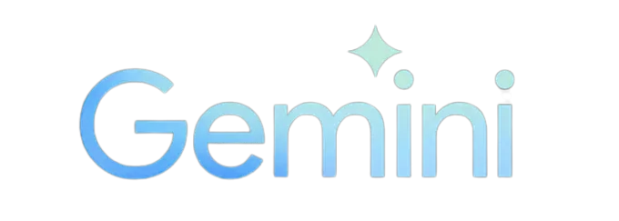

# 소개

React ChatBotify 시리즈의 네 번째 이야기로 다시 여러분을 환영합니다! 기술의 빠르게 변화하는 세계에서 Large Language Models (LLMs)가 오늘날 인기 있는 주제가 되었으며, 이러한 모델들이 일상적인 서비스에서 증가하는 채택을 목격하고 있다는 것은 놀라우지 않은 일입니다. 이번 튜토리얼에서는 Gemini와 통합을 탐구하고 LLMs으로 강화된 챗봇을 어떻게 구축할 수 있는지 알아보겠습니다!

# 빠른 생각

<!-- ui-log 수평형 -->

<ins class="adsbygoogle"
      style="display:block"
      data-ad-client="ca-pub-4877378276818686"
      data-ad-slot="9743150776"
      data-ad-format="auto"
      data-full-width-responsive="true"></ins>
<component is="script">
(adsbygoogle = window.adsbygoogle || []).push({});
</component>

이전 튜토리얼에서는 자주 묻는 질문에 대답하기 위해 효과적인 FAQ 봇을 구축하는 방법을 간단히 살펴보았어요. 그러나 하드 코딩된 응답과 예기치 못한 질문에 대답할 수 없는 문제들도 마주쳤죠.

우리의 튜토리얼 시리즈의 네 번째 파트에 돌입하면서, 이제 저희는 우리의 챗봇을 LLMs와 통합하여 더 동적인 응답을 제공하는 방법에 초점을 맞출 거에요. 다가오는 다섯 번째이자 마지막 부분에서는 검색 부가 생성(RAG)의 적용에 더욱 집중할 거예요. 이 과정을 통해 우리의 FAQ 봇이 LLM으로 강화된 솔루션으로 완전히 전환되며, 맥락 정보를 풍부하게 결합하고 개성 있는 답변이 가능해질 거에요!

이 부분은 이미 React ChatBotify 챗봇이 설정되어 있다는 전제하에 작성되었다는 점을 중요하게 염두해 두세요. 설정되어 있지 않다면 먼저 해당 안내서를 방문해 주세요.

# Gemini AI

<!-- ui-log 수평형 -->

<ins class="adsbygoogle"
      style="display:block"
      data-ad-client="ca-pub-4877378276818686"
      data-ad-slot="9743150776"
      data-ad-format="auto"
      data-full-width-responsive="true"></ins>
<component is="script">
(adsbygoogle = window.adsbygoogle || []).push({});
</component>



수많은 신생 LLM 모델 중에서 ChatGPT와 Gemini이 주목받고 있어요. 이 튜토리얼에서는 Gemini을 예제로 사용할 거에요. 왜냐하면 Gemini이 무료 API 사용을 관대하게 제공하기 때문이에요. OpenAI의 경우에도 ChatGPT는 저렴한 API를 대단히 관대하게 제공해요 (제가 직접 사용 중이죠!). 그러니 여유 있을 때 꼭 사용해보세요.

그런데, 이 튜토리얼의 나머지 부분을 진행하기 전에 Gemini 웹사이트의 지침을 따라 Gemini API 키를 얻어주세요. 만약 도움이 필요하거나 막히는 부분이 있다면 언제든지 문의해주세요!

# 기본 챗봇

<!-- ui-log 수평형 -->

<ins class="adsbygoogle"
      style="display:block"
      data-ad-client="ca-pub-4877378276818686"
      data-ad-slot="9743150776"
      data-ad-format="auto"
      data-full-width-responsive="true"></ins>
<component is="script">
(adsbygoogle = window.adsbygoogle || []).push({});
</component>

API 키를 손에 넣었으니 기본적인 챗봇을 빠르게 구축해 봅시다. 사실, 이미 이 시리즈의 두 번째 부분에서 챗봇을 설정해 두었다면 그것을 기반으로 쉽게 확장할 수 있어요! 그러나 이 튜토리얼을 완전하게 만들기 위해서는 사용자를 인사하는 챗봇이 있는 깔끔한 설정을 갖춘 것으로 상정합시다! 다음 코드 스니펫으로 이것을 달성할 수 있어요:

```js
// MyChatBot.js
import React from "react";
import ChatBot from "react-chatbotify";
import "react-chatbotify/dist/react-chatbotify.css";

const MyChatBot = () => {
  const flow = {
    start: {
      message: "안녕, 나는 곧 감각을 갖겠어!",
    },
  };
  return <ChatBot />;
};
export default MyChatBot;
```

이제 매우 흥분한 챗봇이 우리에게 감각을 갖기를 원하지만 더 이상 아무것도 하지 못하는 상태입니다. 그의 소망을 이루어 주기 위해 함께 만들어 봅시다!

<!-- ui-log 수평형 -->

<ins class="adsbygoogle"
      style="display:block"
      data-ad-client="ca-pub-4877378276818686"
      data-ad-slot="9743150776"
      data-ad-format="auto"
      data-full-width-responsive="true"></ins>
<component is="script">
(adsbygoogle = window.adsbygoogle || []).push({});
</component>

# 모델 초기화

본 문서 작성 시점에서 Gemini 퀵스타트 가이드의 코드 스니펫은 아래와 같습니다:

```js
import { GoogleGenerativeAI } from "@google/generative-ai";

// API 키에 액세스(위의 "API 키 설정" 참조)
const genAI = new GoogleGenerativeAI(API_KEY);

async function run() {
  // 텍스트 입력만을 위한 경우, gemini-pro 모델 사용
  const model = genAI.getGenerativeModel({ model: "gemini-pro" });

  const prompt = "마법 가방에 관한 이야기를 써보세요.";

  const result = await model.generateContent(prompt);
  const response = await result.response;
  const text = response.text();
  console.log(text);
}

run();
```

위에서 얻은 API_KEY로 코드 스니펫을 복사하여 챗봇에 붙여넣기하고 실행하세요. 결과는 아래와 같을 것입니다:

<!-- ui-log 수평형 -->

<ins class="adsbygoogle"
      style="display:block"
      data-ad-client="ca-pub-4877378276818686"
      data-ad-slot="9743150776"
      data-ad-format="auto"
      data-full-width-responsive="true"></ins>
<component is="script">
(adsbygoogle = window.adsbygoogle || []).push({});
</component>

```js
// MyChatBot.js
import React from "react";
import ChatBot from "react-chatbotify";
import "react-chatbotify/dist/react-chatbotify.css";

const MyChatBot = () => {
  const genAI = new GoogleGenerativeAI("YOUR_API_KEY");
  async function run(prompt) {
    // For text-only input, use the gemini-pro model
    const model = genAI.getGenerativeModel({ model: "gemini-pro" });

    const result = await model.generateContent(prompt);
    const response = await result.response;
    const text = response.text();
    return text;
  }

  const flow = {
    start: {
      message: "Hello, I am sentient now, talk to me!",
      path: "model_loop",
    },
    model_loop: {
      message: async (params) => {
        return await run(params.userInput);
      },
      path: "model_loop",
    },
  };
  return <ChatBot flow={flow} />;
};
export default MyChatBot;
```

여기까지 왔어요! 하지만 모델이 챗봇과 통합되지 않았네요! 그 목적을 이루기 위해 다음과 같은 변경 사항을 가해야 합니다:

- 대화 흐름에 루프 블록을 추가하고 run 함수를 호출하여 모델과 상호작용을 처리하도록 함
- run 함수를 수정하여 사용자가 제공하는 프롬프트 매개변수를 전달하고 하드 코딩된 프롬프트를 제거하고 생성된 텍스트를 반환하세요

<!-- ui-log 수평형 -->

<ins class="adsbygoogle"
      style="display:block"
      data-ad-client="ca-pub-4877378276818686"
      data-ad-slot="9743150776"
      data-ad-format="auto"
      data-full-width-responsive="true"></ins>
<component is="script">
(adsbygoogle = window.adsbygoogle || []).push({});
</component>

지금까지 초기 작업 통합이 잘 되었습니다! 위의 코드를 실제로 보고 싶다면 위의 코드 스니펫을 플레이그라운드에 복사하여 붙여넣을 수 있습니다 (API 키를 제공하는 것을 잊지 마세요).

현재 Gemini과의 통합은 멋지지만, 챗봇이 리턴 결과를 메시지 내에서 전체 블록으로 표시하는 것을 알아챌 수 있을 겁니다. 짧은 메시지에는 괜찮을 수 있지만 긴 단락에 대해 다소 문제가 될 수 있습니다. 결국 사용자들을 영원히 기다리게 하는 것은 좋지 않습니다! 사용자에게 응답의 부분을 먼저 보여줄 수 있다면 좋지 않을까요?

# 응답 스트리밍

React ChatBotify 버전 1.3.0에서 새로 소개된 메시지 스트리밍 기능은 LLMs와의 통합에 특히 유용합니다. 응답을 부분적으로 스트리밍할 수 있는 이 기능을 지원하도록 현재 방식을 어떻게 수정할 수 있는지 살펴봅시다.

<!-- ui-log 수평형 -->

<ins class="adsbygoogle"
      style="display:block"
      data-ad-client="ca-pub-4877378276818686"
      data-ad-slot="9743150776"
      data-ad-format="auto"
      data-full-width-responsive="true"></ins>
<component is="script">
(adsbygoogle = window.adsbygoogle || []).push({});
</component>

저희는 Gemini의 빠른 시작 가이드를 다시 한 번 참조하면, 더 빠른 상호 작용을 지원하기 위해 다음 스니펫이 제시된다고 합니다:

```js
const result = await model.generateContentStream([prompt, ...imageParts]);

let text = "";
for await (const chunk of result.stream) {
  const chunkText = chunk.text();
  console.log(chunkText);
  text += chunkText;
}
```

따라서 우리는 코드를 다음과 같이 수정하여 이 새로운 접근법을 활용할 것입니다:

- run 함수에 두 번째 streamMessage 매개변수를 추가합니다 (params를 통해 제공됨)
- model.generateContent를 model.generateContentStream으로 대체합니다
- 스트림 응답 청크를 반복하는 for 루프를 추가하고, 현재 완료된 텍스트로 params.streamMessage를 호출하여 채팅 봇으로 메시지를 스트리밍합니다
- model-loop 블록을 수정하여 run 함수에 두 번째 매개변수로 params.streamMessage를 포함합니다

<!-- ui-log 수평형 -->

<ins class="adsbygoogle"
      style="display:block"
      data-ad-client="ca-pub-4877378276818686"
      data-ad-slot="9743150776"
      data-ad-format="auto"
      data-full-width-responsive="true"></ins>
<component is="script">
(adsbygoogle = window.adsbygoogle || []).push({});
</component>

```js
// MyChatBot.js
import React from "react";
import ChatBot from "react-chatbotify";
import "react-chatbotify/dist/react-chatbotify.css";

const MyChatBot = () => {
  const genAI = new GoogleGenerativeAI("YOUR_API_KEY");
  async function run(prompt, streamMessage) {
    // For text-only input, use the gemini-pro model
    const model = genAI.getGenerativeModel({ model: "gemini-pro" });

    const result = await model.generateContentStream(prompt);
    let text = "";
    for await (const chunk of result.stream) {
      const chunkText = chunk.text();
      text += chunkText;
      streamMessage(text);
    }
    return text;
  }

  const flow = {
    start: {
      message: "Hello, I am sentient now, talk to me!",
      path: "model_loop",
    },
    model_loop: {
      message: async (params) => {
        return await run(params.userInput, params.streamMessage);
      },
      path: "model_loop",
    },
  };
  return <ChatBot />;
};
export default MyChatBot;
```

제공된 수정된 코드 스니펫을 플레이그라운드에서 실행해보세요. 모든 것을 올바르게 했지만 아직도 약간 이상하게 나타나는 것 같네요, 그렇죠? 메시지가 더 이상 단일 블록으로 전송되지 않고 여전히 조각 나눠져 나오는 것을 알 수 있습니다.

위와 같은 동작을 보이는 이유는 스트림 응답이 텍스트를 청크로 제공하기 때문입니다. 텍스트가 문자 단위로 표시되기를 원한다면, 스트림 논리를 수동으로 처리해야 합니다. 이것은 약간 복잡하며 이 가이드에서 다루지 않겠지만 제가 여기 제공한 실시간 예제를 참고할 수 있습니다.

# 시뮬레이션된 스트림 응답

<!-- ui-log 수평형 -->

<ins class="adsbygoogle"
      style="display:block"
      data-ad-client="ca-pub-4877378276818686"
      data-ad-slot="9743150776"
      data-ad-format="auto"
      data-full-width-responsive="true"></ins>
<component is="script">
(adsbygoogle = window.adsbygoogle || []).push({});
</component>

스트리밍 응답의 심미성과 인기를 인정하는 React ChatBotify는 사용자에게 텍스트 응답을 스트리밍하는 시뮬레이션을 원하는 개발자들을 위해 simStream 및 streamSpeed 옵션을 제공합니다. 이 옵션에 관심이 있다면 여기에서 찾을 수 있는 예제를 참조할 수 있습니다.

# 결론

이 튜토리얼에서는 LLM을 React ChatBotify와 통합하는 흥미로운 영역을 탐험했습니다. Gemini를 예로 들어, 우리는 우리의 챗봇이 동적 응답을 제공할 수 있는 능력을 얼마나 쉽게 갖출 수 있는지 보았습니다.

네 번째 설치를 마치며, 앞으로의 길은 더 많은 혁신을 약속합니다. 다가오는 마지막 세그먼트에서는 저희의 챗봇에 개성과 문맥 인식을 부여하기 위해 Recovery Augmented Generation (RAG)를 탐색하여 진정으로 매력적인 대화 상대로 높여보겠습니다. 읽어주셔서 감사합니다. 그리고 더 많은 콘텐츠로 기대해 주세요!
