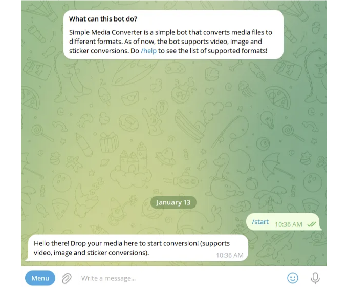

# 소개

안녕하세요! 여러분은 자신만의 텔레그램 봇을 만들어 보고 싶은 적이 있으신가요? 그럼 이 글은 굉장히 흥미로울 거예요. 이 간단한 단계별 안내서를 통해 우분투(Ubuntu)에서 여러분의 텔레그램 봇을 호스팅하는 방법을 살펴볼 거에요. 이미 경험 많은 개발자이든 기술의 세계에 발을 담그는 초보자이든, 인기있는 메시징 플랫폼에서 흥미로운 아이디어를 구현할 기회가 왔습니다! 그러니 편안하게 앉으세요. 여러분의 디지털 창작물의 최대 잠재력을 펼쳐보기 위한 여정을 떠나 봅시다.

# 필수 준비물

<!-- ui-log 수평형 -->

<ins class="adsbygoogle"
      style="display:block"
      data-ad-client="ca-pub-4877378276818686"
      data-ad-slot="9743150776"
      data-ad-format="auto"
      data-full-width-responsive="true"></ins>
<component is="script">
(adsbygoogle = window.adsbygoogle || []).push({});
</component>

우리의 학습 여정을 시작하기 전에, 다음 항목에 대해 알고 있다는 가정하에 이 가이드를 따라오시기 바랍니다:

- VPS 프로비저닝
- SSH에 익숙함
- Linux 명령줄에 익숙함
- 준비된 텔레그램 봇 프로젝트 (준비된 것이 없다면, 제 예제를 사용하거나 이 가이드를 참고해 주세요!)

위 항목을 다루지는 않을 것이기 때문에 이 가이드의 주요 내용은 아닙니다. 이에 대한 가이드는 많이 있으니 참고해 주세요! 이 모든 것을 말씀드리고, 위 항목 중 어느 것이든 도움이 필요하시면 언제든지 도움을 요청해 주세요.

# 서버 설정

<!-- ui-log 수평형 -->

<ins class="adsbygoogle"
      style="display:block"
      data-ad-client="ca-pub-4877378276818686"
      data-ad-slot="9743150776"
      data-ad-format="auto"
      data-full-width-responsive="true"></ins>
<component is="script">
(adsbygoogle = window.adsbygoogle || []).push({});
</component>

학습 여정을 시작하려면 DigitalOcean이나 OVH와 같은 클라우드 제공업체에서 VPS (가상 사설 서버)를 프로비저닝해야 합니다. 우리가 텔레그램 봇을 호스팅하고 있기 때문에 호스팅할 프로젝트가 준비되어 있어야 합니다. 그렇지 않다면 걱정하지 마세요! 이 가이드의 나머지 부분을 진행하기 위해 본인이 게시한 프로젝트를 클론하고 활용할 수 있습니다.

서버가 프로비저닝되었다면 실제 설정 작업에 착수할 시간입니다! 먼저 다음 명령을 사용하여 서버에 SSH로 연결합니다 (172.1.1.1을 실제 IP 주소로 대체하세요):

```js
ssh root@172.1.1.1
```

서버에 로그인하려면 클라우드 제공업체가 제공한 root 암호를 입력해야합니다. 로그인 후에는 다음 명령을 실행하여 패키지를 업데이트하십시오:

<!-- ui-log 수평형 -->

<ins class="adsbygoogle"
      style="display:block"
      data-ad-client="ca-pub-4877378276818686"
      data-ad-slot="9743150776"
      data-ad-format="auto"
      data-full-width-responsive="true"></ins>
<component is="script">
(adsbygoogle = window.adsbygoogle || []).push({});
</component>

```js
apt-get update && apt-get upgrade
```

그 다음으로, 나중에 텔레그램 봇을 24/7 구동할 수 있도록 화면(screen)을 사용할 것입니다. 아래 명령어를 사용하여 화면을 설치할 수 있습니다:

```js
apt-get install screen
```

# 사용자 설정

<!-- ui-log 수평형 -->

<ins class="adsbygoogle"
      style="display:block"
      data-ad-client="ca-pub-4877378276818686"
      data-ad-slot="9743150776"
      data-ad-format="auto"
      data-full-width-responsive="true"></ins>
<component is="script">
(adsbygoogle = window.adsbygoogle || []).push({});
</component>

서버 설정이 완료되었지만 우리의 파이썬 프로그램을 루트 계정을 사용하여 실행하는 것은 좋은 생각이 아닙니다. 텔레그램 봇 호스팅을 관리할 새로운 telegrambot 사용자를 만들어 봅시다. 다음 명령을 실행하여 이 새로운 사용자를 만듭니다:

```js
adduser telegrambot
```

가이드의 나머지 부분에 대해 루트 SSH 세션을 종료하고 대신 telegrambot으로 로그인하세요 (IP 주소는 귀하의 VPS의 IP 주소로 바꿔주세요):

```js
ssh telegrambot@172.1.1.1
```

<!-- ui-log 수평형 -->

<ins class="adsbygoogle"
      style="display:block"
      data-ad-client="ca-pub-4877378276818686"
      data-ad-slot="9743150776"
      data-ad-format="auto"
      data-full-width-responsive="true"></ins>
<component is="script">
(adsbygoogle = window.adsbygoogle || []).push({});
</component>

# 프로젝트 설정 및 실행

프로젝트 선택에 따라 프로젝트를 설정하고 실행 준비를 해야 합니다. 예시로 공유한 프로젝트를 사용하는 경우, 그 설정은 README에 명확하게 기술되어 있습니다.

프로젝트 설정이 완료되면, 다음 명령어로 새 screen 세션을 초기화합니다 (봇을 24시간 내내 실행하려면 중요합니다):

```js
screen;
```

<!-- ui-log 수평형 -->

<ins class="adsbygoogle"
      style="display:block"
      data-ad-client="ca-pub-4877378276818686"
      data-ad-slot="9743150776"
      data-ad-format="auto"
      data-full-width-responsive="true"></ins>
<component is="script">
(adsbygoogle = window.adsbygoogle || []).push({});
</component>

화면을 분리하여 키보드에서 CTRL + A + D를 동시에 누르세요. 그렇게 해야 화면이 종료되는 대신 화면에서 분리됩니다. 화면 목록을 확인하려면 다음 몤령어를 사용할 수 있습니다:

```shell
screen -ls
```

<!-- ui-log 수평형 -->

<ins class="adsbygoogle"
      style="display:block"
      data-ad-client="ca-pub-4877378276818686"
      data-ad-slot="9743150776"
      data-ad-format="auto"
      data-full-width-responsive="true"></ins>
<component is="script">
(adsbygoogle = window.adsbygoogle || []).push({});
</component>

화면에 다시 연결하려면 다음 명령을 사용하면 됩니다:

```js
screen - r;
```

추신으로, screen (또는 tmux, 선호하는대로)은 이 안내서에 표시된 것 이외에도 다양한 용도로 사용할 수 있습니다. 머신 러닝 모델 학습과 같은 시간 소요가 많은 프로세스를 실행하거나 Minecraft 서버를 호스팅하는 데 사용할 수도 있습니다!

# 결론

<!-- ui-log 수평형 -->

<ins class="adsbygoogle"
      style="display:block"
      data-ad-client="ca-pub-4877378276818686"
      data-ad-slot="9743150776"
      data-ad-format="auto"
      data-full-width-responsive="true"></ins>
<component is="script">
(adsbygoogle = window.adsbygoogle || []).push({});
</component>

이제 당신의 텔레그램 봇은 24시간 365일 동안 실행 중이어야 합니다! 가이드는 여러분의 프로젝트 선택에 대해 몇 가지 추정을 했기 때문에 (예: JavaScript 대신 사용), 몇몇 명령어가 약간 다를 수 있습니다.

추가적인 도전으로, 텔레그램 봇에 대한 라이브니스 모니터링을 구현하는 것도 고려해볼만 합니다! 이는 기본을 넘어서는 단계이지만 크게 복잡하지는 않습니다. 그리고 아이디어를 나눌 사람이 필요하다면, 여기나 댓글에서 기꺼이 대화해 드릴게요. 이 짧은 안내서를 읽어주셔서 감사합니다. 즐겁게 즐겼기를 바랍니다!
