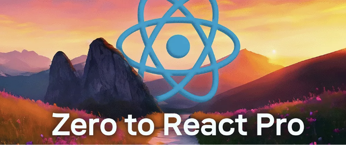

이 포괄적인 가이드에서는 React에 대해 전혀 모르는 상태에서 3~6개월 사이에 취업 준비 및 주니어 React 개발자가 되는 방법을 안내해 드릴게요.

책임지고 능숙한 개발자가 되는 것은 단지 경주가 아니에요. 이 길은 React를 가능한 빠르고 효율적으로 앞뒤로 배울 수 있는 선택한 방법일 뿐이에요.

# 📖 1~2주: React 문서 탐색

<!-- ui-log 수평형 -->

<ins class="adsbygoogle"
      style="display:block"
      data-ad-client="ca-pub-4877378276818686"
      data-ad-slot="9743150776"
      data-ad-format="auto"
      data-full-width-responsive="true"></ins>
<component is="script">
(adsbygoogle = window.adsbygoogle || []).push({});
</component>

만약 React를 처음 시작한다면, 당신의 여정 동안 이상적인 리소스는 강의나 책이 아니라 완전히 무료인 react.dev의 React 문서입니다.

React 문서는 2023년에 처음부터 다시 작성되었습니다. 이 문서는 React와 관련된 모든 것에 대한 공식 소스입니다. 간단하거나 복잡한 주제든지 상관없이 모든 내용이 담겨 있습니다.

React 문서는 React에 익숙해지는 좋은 방법뿐만 아니라, 앞에서부터 뒤까지 React를 배우기 위한 온라인에서 가장 전체적인 자료입니다.

<!-- ui-log 수평형 -->

<ins class="adsbygoogle"
      style="display:block"
      data-ad-client="ca-pub-4877378276818686"
      data-ad-slot="9743150776"
      data-ad-format="auto"
      data-full-width-responsive="true"></ins>
<component is="script">
(adsbygoogle = window.adsbygoogle || []).push({});
</component>

할 일:

- 리액트 문서의 처음 10개 글을 읽어보세요(이해하려고 노력하세요).
- 리액트의 핵심 개념에 익숙해지세요: 엘리먼트, 컴포넌트, JSX, props로 데이터 전달, 렌더링, 리스트.

특히 어려운 부분을 만나면 ChatGPT에게 더 간단한 설명을 요청해보세요.

새로운 리액트 문서에는 인터랙티브 코드 샌드박스가 포함되어 있어요. 이는 브라우저에서 리액트 코드를 실습해 볼 수 있다는 뜻입니다.

<!-- ui-log 수평형 -->

<ins class="adsbygoogle"
      style="display:block"
      data-ad-client="ca-pub-4877378276818686"
      data-ad-slot="9743150776"
      data-ad-format="auto"
      data-full-width-responsive="true"></ins>
<component is="script">
(adsbygoogle = window.adsbygoogle || []).push({});
</component>

# 🤔 JavaScript를 먼저 배워야 할까요?

리액트를 시작하기 전에 JavaScript를 배워야 하는지 궁금할 수 있습니다.

2024년에는 개인적으로는 그렇게 생각하지 않아요.

어떤 리액트 앱에서든 활용해야 할 몇 가지 JavaScript 기본 사항만 알면 돼요.

<!-- ui-log 수평형 -->

<ins class="adsbygoogle"
      style="display:block"
      data-ad-client="ca-pub-4877378276818686"
      data-ad-slot="9743150776"
      data-ad-format="auto"
      data-full-width-responsive="true"></ins>
<component is="script">
(adsbygoogle = window.adsbygoogle || []).push({});
</component>

이들은 문자열, 숫자, 부울과 같은 간단한 데이터 유형부터 객체와 배열과 같은 복잡한 데이터 유형, 또한 프라미스를 사용한 함수 및 비동기 작업과 같은 것들을 포함합니다. 그게 전부에요.

나머지는 직면할 때 배울 수 있어요. 그러니까, 리액트에 뛰어들기 전에 몇 달 동안 자바스크립트를 배워야 한다는 건 아니에요.

# 💻 3주차: 컴퓨터에서 리액트 프로젝트 실행하기

이 시점에서, 리액트 앱을 만들기 전에 반드시 해야 할 중요한 일이 있어요.

<!-- ui-log 수평형 -->

<ins class="adsbygoogle"
      style="display:block"
      data-ad-client="ca-pub-4877378276818686"
      data-ad-slot="9743150776"
      data-ad-format="auto"
      data-full-width-responsive="true"></ins>
<component is="script">
(adsbygoogle = window.adsbygoogle || []).push({});
</component>

React 프로젝트를 처음부터 생성하고 컴퓨터에서 개발 모드로 실행하는 방법을 간단히 배우면 됩니다.

해야 할 일:

- 로컬 컴퓨터에서 React 프로젝트를 생성, 설치하고 실행하는 전체 프로세스를 배우기 위해 일주일을 할애하세요.
- React 문서에 이에 대한 완벽한 안내서가 있으니 참고하시면 됩니다.

이 프로세스에 익숙해지는 데 시간이 걸리겠지만, 이 작업은 중요합니다. 왜냐하면 주로 컴퓨터의 React 프로젝트 폴더에서 작업하게 될 것이기 때문입니다.

<!-- ui-log 수평형 -->

<ins class="adsbygoogle"
      style="display:block"
      data-ad-client="ca-pub-4877378276818686"
      data-ad-slot="9743150776"
      data-ad-format="auto"
      data-full-width-responsive="true"></ins>
<component is="script">
(adsbygoogle = window.adsbygoogle || []).push({});
</component>

코드 편집기를 설정하고 편한 환경을 만드는 데 시간을 투자해보세요. 아마도 Visual Studio Code를 사용하게 될 것입니다. 그런 다음 Vite를 사용하여 React 프로젝트를 만드는 방법을 살펴보세요.

React 프로젝트를 만드는 여러 가지 방법이 있습니다. 그러나 2024년에는 Create React App 대신 Vite를 사용하는 것을 강력히 권장합니다. Create React App은 이미 구식이며 이 시점에서는 Next.js로 프로젝트를 만드는 것이 좋지 않습니다.

마지막으로 터미널에서 기본 명령어를 열고 실행하는 데 편안해지는 것이 중요합니다. Visual Studio Code의 통합 터미널이나 컴퓨터의 터미널 또는 명령줄 중 어디든 원하는 대로 명령어를 실행해 보세요.

<!-- ui-log 수평형 -->

<ins class="adsbygoogle"
      style="display:block"
      data-ad-client="ca-pub-4877378276818686"
      data-ad-slot="9743150776"
      data-ad-format="auto"
      data-full-width-responsive="true"></ins>
<component is="script">
(adsbygoogle = window.adsbygoogle || []).push({});
</component>

여유시간이 있다면, 코드를 만든 변경 사항을 푸시하는 방법을 확인하는 것도 좋아요. 팀으로 작업할 때 Git과 같은 버전 관리 시스템을 사용하여 이러한 변경 사항을 추적하는 것이 중요하니까요.

만약 이 단계에서 어려움을 겪는다면, CodeSandbox나 StackBlitz와 같은 도구를 사용하여 브라우저에서 React 앱을 만들고 코딩할 수도 있답니다. 모든 프로젝트를 컴퓨터의 폴더로 생성해야 하는 것은 아니에요.

# 🧱 4–6주차: 정적 React 프로젝트 만들기

이제 React가 무엇이며 사용자 인터페이스를 구축하는 데 어떻게 사용될 수 있는지 기본 개념을 이해했으니, 간단한 사용자 인터페이스를 만들어보세요.

<!-- ui-log 수평형 -->

<ins class="adsbygoogle"
      style="display:block"
      data-ad-client="ca-pub-4877378276818686"
      data-ad-slot="9743150776"
      data-ad-format="auto"
      data-full-width-responsive="true"></ins>
<component is="script">
(adsbygoogle = window.adsbygoogle || []).push({});
</component>

Fully functional한 애플리케이션을 만들기 전에, React elements, components, 그리고 CSS를 사용하여 앱의 구조를 구축하는 데 집중해야 해요.

할 일:

- 매일 사용하는 웹사이트를 살펴보고 해당 부분(버튼, 네비게이션 바, 히어로 섹션 등)을 만들어볼 수 있는지 확인해 보세요.
- 완전한 페이지일 필요는 없어요; 간단한 부분부터 시작하세요. 이를 별도의 컴포넌트로 작성하세요.
- CSS의 도움을 받아 원본과 비슷한 외관을 가진 컴포넌트를 재생성해 보세요.
- 점점 자신감이 생기면, 이러한 컴포넌트들을 더 완전한 사용자 인터페이스로 결합해 보세요.

단순한 React element를 사용하여 이 과정을 따라갈 수 있어요. 이러한 요소들을 컴포넌트로 나누어 재사용할 수 있도록 하는 방법을 배우게 될 거예요. 그 후에는 props로 전달된 데이터를 사용하여 동적으로 만들어 보세요.

<!-- ui-log 수평형 -->

<ins class="adsbygoogle"
      style="display:block"
      data-ad-client="ca-pub-4877378276818686"
      data-ad-slot="9743150776"
      data-ad-format="auto"
      data-full-width-responsive="true"></ins>
<component is="script">
(adsbygoogle = window.adsbygoogle || []).push({});
</component>

지금 이 시점에서는 React에서 CSS를 사용하는 법에 익숙해지는 것을 강력히 추천합니다. 간단한 스타일 시트를 사용하거나 매우 인기 있는 Tailwind CSS와 같은 도구를 사용할 수 있어요.

CSS는 프론트엔드 개발자에서 피할 수 없는 요소이기 때문에 컴포넌트 라이브러리는 사용하지 않는 것이 좋아요. 매력적인 인터페이스를 만들기 위해 CSS가 필요합니다.

React를 사용하여 정적 페이지를 만드는 이 단계는 시맨틱 HTML의 기본을 배울 수 있는 좋은 기회입니다. 이게 무엇인지 모른다면 HTML 태그를 올바르게 구조화하는 방법을 보여주는 많은 문서들이 있어요. 그래야 혼란스럽지 않은 div 피라미드가 만들어지지 않아요.

# 🛠️ 7주차-10주차: 동적 React 프로젝트 만들기

<!-- ui-log 수평형 -->

<ins class="adsbygoogle"
      style="display:block"
      data-ad-client="ca-pub-4877378276818686"
      data-ad-slot="9743150776"
      data-ad-format="auto"
      data-full-width-responsive="true"></ins>
<component is="script">
(adsbygoogle = window.adsbygoogle || []).push({});
</component>

리액트 정적 프로젝트를 만든 후에는 간단하지만 기능적인 리액트 프로젝트를 만드는 게 목표입니다.

할 일:

- 상태와 이벤트를 사용하여 간단한 작업을 수행하는 10개 이상의 미니 동적 앱을 만들어보세요.
- 계산기, 비디오 플레이어, 할 일 목록, 이미지 캐러셀, 명언 생성기 등과 같이 작고 하루 이상 걸리지 않는 앱을 만들어보세요.

<!-- ui-log 수평형 -->

<ins class="adsbygoogle"
      style="display:block"
      data-ad-client="ca-pub-4877378276818686"
      data-ad-slot="9743150776"
      data-ad-format="auto"
      data-full-width-responsive="true"></ins>
<component is="script">
(adsbygoogle = window.adsbygoogle || []).push({});
</component>

이 프로젝트들을 중급 프로젝트로 만드는 것은 정확히 무엇인가요? 간단히 말하자면, 이러한 프로젝트들은 기본적이고 정적인 것들과 비교할 때 실제 세계 응용 프로그램처럼 더 많이 기능해야 합니다. 사용자 입력을 사용해야 하며, React 상태를 사용하여 이벤트를 처리하고 데이터를 관리해야 합니다.

사이드 이펙트를 사용하는 프로젝트를 만들어야 합니다. 이는 일반적으로 fetch API를 사용하여 외부 데이터 소스에서 데이터를 요청하는 것을 의미합니다. 이 단계에서는 기본적인 React 훅인 useState, useEffect 및 때로는 useRef, useContext 및 useReducer를 사용하는 데 익숙해져야 합니다.

할 수 있는 만큼 많은 미니 앱을 만들어보세요 (적어도 10개 이상을 추천합니다), 그러나 특정 프로젝트를 구축하는 데 하루 이상 걸리지 않도록 하세요. 하나를 만들거나, 그렇게 할 수 없다면 다음으로 넘어가세요.

어떤 아이디어가 필요하다면, 하루 안에 할 수 있는 React 초보자 프로젝트를 다수 소개한 전문 기사가 있습니다.

<!-- ui-log 수평형 -->

<ins class="adsbygoogle"
      style="display:block"
      data-ad-client="ca-pub-4877378276818686"
      data-ad-slot="9743150776"
      data-ad-format="auto"
      data-full-width-responsive="true"></ins>
<component is="script">
(adsbygoogle = window.adsbygoogle || []).push({});
</component>

이 시기는 일반 HTML(기술적으로 JSX)과 CSS 대신 React를 사용하고 React-특화 코드를 작성하는 데 편안해지는 중요한 시기입니다.

# 🧑‍💻 11주차–14주차: 개발자 포트폴리오 작성하기

프로젝트 빌딩의 마지막 단계는 대부분 중간 단계 프로젝트들이 너무 단순해 보인다고 느낀 후에 옵니다.

미니 React 프로젝트를 구축하는 데 자신감을 느끼기 시작하면, 더 고급 프로젝트로 도전하는 좋은 시기라는 신호입니다.

<!-- ui-log 수평형 -->

<ins class="adsbygoogle"
      style="display:block"
      data-ad-client="ca-pub-4877378276818686"
      data-ad-slot="9743150776"
      data-ad-format="auto"
      data-full-width-responsive="true"></ins>
<component is="script">
(adsbygoogle = window.adsbygoogle || []).push({});
</component>

할 일:

- 한 달 동안이라도 더 많은 시간을 들여 큰 규모의, 더 야심 찬 리액트 프로젝트를 선택하세요.
- 이 프로젝트를 개발자 포트폴리오에서 강조하고 무엇을 사용하여 구축했는지 설명해주세요.

고급 프로젝트가 더 큰 애플리케이션의 미니 클론인 유튜브 클론일 수 있습니다. 여기서 사용자는 로그인하고 비디오를 업로드하며 친구들과 공유할 수 있습니다.

<!-- ui-log 수평형 -->

<ins class="adsbygoogle"
      style="display:block"
      data-ad-client="ca-pub-4877378276818686"
      data-ad-slot="9743150776"
      data-ad-format="auto"
      data-full-width-responsive="true"></ins>
<component is="script">
(adsbygoogle = window.adsbygoogle || []).push({});
</component>

React은 TikTok, Twitch, Hulu, Notion 등 매일 사용하는 큰 애플리케이션을 만드는 데 사용됩니다. 그러니 포트폴리오 프로젝트를 선택할 때 크게 생각해보세요.

이러한 고급 프로젝트는 훨씬 긴 시간이 걸리고, 이것은 좋은 일입니다. 그것들은 열정 프로젝트여야 합니다. React로 빌드하는 데 흥미를 느끼고 만들어보고 싶은 것이어야 합니다.

그 과정에서 이전에 몰랐던 많은 것들을 배우게 될 겁니다. 예를 들어 YouTube의 경우 다음과 같은 것들을 조사해야 할 겁니다:

- React를 사용하여 미디어를 업로드하는 방법
- 무료 또는 유료로 사용할 수 있는 인증 서비스를 사용하여 사용자를 인증하는 방법
- React 프로젝트에서 비디오를 재생하는 데 가장 적합한 라이브러리는 무엇인지

<!-- ui-log 수평형 -->

<ins class="adsbygoogle"
      style="display:block"
      data-ad-client="ca-pub-4877378276818686"
      data-ad-slot="9743150776"
      data-ad-format="auto"
      data-full-width-responsive="true"></ins>
<component is="script">
(adsbygoogle = window.adsbygoogle || []).push({});
</component>

많은 작은 결정들 위에, 당신이 길을 따라 결정할 많은 것들이 있습니다.

마지막 단계는 개발자로서 여러분을 정말로 도전할 것입니다. 그리고 한 달 이상에 걸쳐 최종적으로 만드는 것은 당신의 개발자 포트폴리오에 완벽한 추가물이 될 것입니다.

여러분의 개발자 포트폴리오는 React를 통해 여러분의 능숙함을 나타내는 하나 이상의 프로젝트여야 합니다. 이것은 잠재적인 고용주에게 여러분이 일자리에 가져다줄 수 있는 것을 보여줄 것입니다.

당신이 자랑스러운 기능 프로젝트를 가지고 있고, React의 핵심 개념을 잘 이해하고 있으며 코딩하는 동안 어떻게 문제를 해결할지 알고 있다고 느낄 때, React 주니어 개발자로 지원할 준비가 된 것입니다.

<!-- ui-log 수평형 -->

<ins class="adsbygoogle"
      style="display:block"
      data-ad-client="ca-pub-4877378276818686"
      data-ad-slot="9743150776"
      data-ad-format="auto"
      data-full-width-responsive="true"></ins>
<component is="script">
(adsbygoogle = window.adsbygoogle || []).push({});
</component>

축하합니다!

# 🏆 프로 React 개발자가 되세요

React를 처음부터 끝까지 배울 수 있는 궁극의 자료를 찾고 계신가요?

✨ 소개합니다: 더 React 부트캠프

<!-- ui-log 수평형 -->

<ins class="adsbygoogle"
      style="display:block"
      data-ad-client="ca-pub-4877378276818686"
      data-ad-slot="9743150776"
      data-ad-format="auto"
      data-full-width-responsive="true"></ins>
<component is="script">
(adsbygoogle = window.adsbygoogle || []).push({});
</component>

부트캠프는 React에서 성공하기 위한 모든 리소스를 제공합니다:

- 🎬 200개 이상의 심층 영상
- 🕹️ 100개 이상의 실습형 React 도전 과제
- 🛠️ 5개 이상의 인상적인 포트폴리오 프로젝트
- 📄 10개 이상의 필수 React 치트 시트
- 🥾 완전한 Next.js 부트캠프
- 🖼️ 애니메이션 영상의 완전한 시리즈

아래를 클릭하여 React 부트캠프를 직접 체험해 보세요!

<!-- ui-log 수평형 -->

<ins class="adsbygoogle"
      style="display:block"
      data-ad-client="ca-pub-4877378276818686"
      data-ad-slot="9743150776"
      data-ad-format="auto"
      data-full-width-responsive="true"></ins>
<component is="script">
(adsbygoogle = window.adsbygoogle || []).push({});
</component>

시작하려면 클릭하세요.
