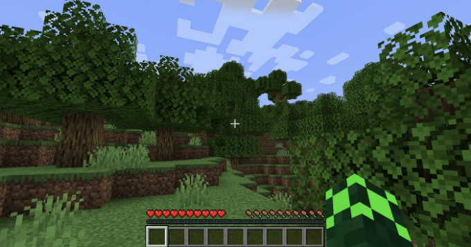

# 소개

마인크래프트 서버를 직접 설치해 보고 싶은 적이 있으신가요? 아니면 친구들과 함께 하는 프라이빗 서버를 원하시나요? 그럼 여러분에게 포괄적인 안내를 제공하는 이곳으로 오신 것을 환영합니다! 이 모험이 여러 문단에 걸쳐 있을 수 있지만 안심하세요, 본 서사의 끝에는 당신만의 독점적인 마인크래프트 서버를 운영할 수 있는 전문 지식으로 무장하게 될 것입니다!

# 준비 사항

마인크래프트의 마법 같은 것에 대해 심층적으로 파헤치기 전에 반드시 아래 항목에 대한 지식이 있다고 가정합니다:

<!-- ui-log 수평형 -->

<ins class="adsbygoogle"
      style="display:block"
      data-ad-client="ca-pub-4877378276818686"
      data-ad-slot="9743150776"
      data-ad-format="auto"
      data-full-width-responsive="true"></ins>
<component is="script">
(adsbygoogle = window.adsbygoogle || []).push({});
</component>

- VPS 프로비저닝
- SSH에 대한 익숙함
- 리눅스 명령 줄에 대한 익숙함

위 사항은 이 안내서의 중점이 아니기 때문에 다루지 않겠습니다. 이와 관련된 가이드는 많이 있으니 걱정하지 마세요! 그럼에도 불구하고 위 내용 중에서 도움이 필요하다면 언제든지 문의해 주세요.

# 서버 설정

마인크래프트 서버 여행을 시작하려면 DigitalOcean이나 OVH와 같은 클라우드 제공업체에서 프로비저닝된 VPS(가상 사설 서버)가 필요합니다. 우리는 기본 마인크래프트 서버 설정으로 가기로 결정했기 때문에 1GB의 RAM이면 충분합니다. 그러나 좀 더 경험이 있는 경우 보다 강력한 기계를 선택해서 유연성과 나중에 맞춤 설정을 추가할 수도 있습니다.

<!-- ui-log 수평형 -->

<ins class="adsbygoogle"
      style="display:block"
      data-ad-client="ca-pub-4877378276818686"
      data-ad-slot="9743150776"
      data-ad-format="auto"
      data-full-width-responsive="true"></ins>
<component is="script">
(adsbygoogle = window.adsbygoogle || []).push({});
</component>

서버를 프로비저닝했으면, 이제 실제 설정 작업을 시작하는 거에요! 먼저 다음 명령어로 서버에 SSH를 연결하세요 (실제 IP 주소로 172.1.1.1을 대체해주세요):

```js
ssh root@172.1.1.1
```

클라우드 제공업체가 제공한 루트 암호를 입력하라는 프롬프트가 표시될 거에요. 로그인한 후, 패키지를 업데이트하기 위해 다음 명령어를 실행해주세요:

```js
apt-get update && apt-get upgrade
```

<!-- ui-log 수평형 -->

<ins class="adsbygoogle"
      style="display:block"
      data-ad-client="ca-pub-4877378276818686"
      data-ad-slot="9743150776"
      data-ad-format="auto"
      data-full-width-responsive="true"></ins>
<component is="script">
(adsbygoogle = window.adsbygoogle || []).push({});
</component>

마인크래프트는 Java로 작동되기 때문에, 마인크래프트 버전 선택에 따라 관련 Java 버전을 설치해야 합니다. 아래는 버전 호환성 (마지막 확인: 2024년 1월) 및 해당 Java 설치 명령어가 나와있습니다:

- 마인크래프트 버전 1.8–1.12 (Java 8):

```sh
sudo apt-get install openjdk-8-jdk
```

<!-- ui-log 수평형 -->

<ins class="adsbygoogle"
      style="display:block"
      data-ad-client="ca-pub-4877378276818686"
      data-ad-slot="9743150776"
      data-ad-format="auto"
      data-full-width-responsive="true"></ins>
<component is="script">
(adsbygoogle = window.adsbygoogle || []).push({});
</component>

```js
sudo apt-get install openjdk-11-jdk
```

마인크래프트 버전 1.17+ (Java 17):

```js
sudo apt-get install openjdk-17-jdk
```

그 다음, 나중에 마인크래프트 서버를 24시간 365일 동안 유지할 수 있도록 하기 위해 screen을 사용할 것이며, 다음 명령어로 설치할 수 있습니다:```

<!-- ui-log 수평형 -->

<ins class="adsbygoogle"
      style="display:block"
      data-ad-client="ca-pub-4877378276818686"
      data-ad-slot="9743150776"
      data-ad-format="auto"
      data-full-width-responsive="true"></ins>
<component is="script">
(adsbygoogle = window.adsbygoogle || []).push({});
</component>

```js
apt-get install screen
```

마지막으로, Minecraft가 기본 포트 25565에서 실행되므로 방화벽을 업데이트하여 포트 25565에서의 TCP 연결을 허용해야 합니다:

```js
ufw allow 25565/tcp
```

그렇게 서버 설정에 필요한 모든 단계가 끝났습니다!

<!-- ui-log 수평형 -->

<ins class="adsbygoogle"
      style="display:block"
      data-ad-client="ca-pub-4877378276818686"
      data-ad-slot="9743150776"
      data-ad-format="auto"
      data-full-width-responsive="true"></ins>
<component is="script">
(adsbygoogle = window.adsbygoogle || []).push({});
</component>

# 사용자 설정

서버 설정이 완료되었으므로 간단한 마인크래프트 서버를 시작할 준비가 거의 끝났어요. 하지만 먼저 서버를 다루는 데 사용할 새로운 마인크래프트 사용자를 만들어 봅시다! 다음 명령을 실행하여 사용자를 추가하세요:

```bash
adduser minecraft
```

또한 설정을 쉽게하기 위해 일시적으로 사용자에게 슈퍼유저 권한을 부여할 거에요:

<!-- ui-log 수평형 -->

<ins class="adsbygoogle"
      style="display:block"
      data-ad-client="ca-pub-4877378276818686"
      data-ad-slot="9743150776"
      data-ad-format="auto"
      data-full-width-responsive="true"></ins>
<component is="script">
(adsbygoogle = window.adsbygoogle || []).push({});
</component>

```js
usermod -aG sudo minecraft
```

가이드의 나머지 부분에서는 루트 SSH 세션을 종료하고 대신 minecraft로 로그인하십시오 (다시 한번 VPS의 IP 주소로 172.1.1.1을 대체하십시오):

```js
ssh minecraft@172.1.1.1
```

# 다운로드 & 실행

<!-- ui-log 수평형 -->

<ins class="adsbygoogle"
      style="display:block"
      data-ad-client="ca-pub-4877378276818686"
      data-ad-slot="9743150776"
      data-ad-format="auto"
      data-full-width-responsive="true"></ins>
<component is="script">
(adsbygoogle = window.adsbygoogle || []).push({});
</component>

이제 이 프로젝트를 위해 서버 디렉토리를 생성하고 해당 서버 파일을 해당 디렉토리에 보관해 봅시다:

```js
mkdir server
cd server
```

이 디렉토리에 Minecraft 서버 파일을 다운로드할 것입니다. 말머리로, 사용할 수 있는 서버 JAR 파일의 다양한 변형이 있습니다 (예: Spigot, Paper, Purpur은 각각 고유한 이점을 강조합니다). 본 자습서에서는 성능을 최적화한 Spigot의 포크인 Paper를 사용할 것입니다.

파일을 로컬로 다운로드한 다음 WinSCP 또는 FileZilla와 같은 다른 클라이언트를 사용하여 서버로 업로드할 수 있지만, 가장 간단한 방법은 다음과 같이 다운로드 링크를 이용하여 wget을 사용하는 것입니다:```

<!-- ui-log 수평형 -->

<ins class="adsbygoogle"
      style="display:block"
      data-ad-client="ca-pub-4877378276818686"
      data-ad-slot="9743150776"
      data-ad-format="auto"
      data-full-width-responsive="true"></ins>
<component is="script">
(adsbygoogle = window.adsbygoogle || []).push({});
</component>

```js
wget -O minecraft_server.jar https://api.papermc.io/v2/projects/paper/versions/1.20.4/builds/373/downloads/paper-1.20.4-373.jar
```

만약 다른 변형을 사용 중이라면, 위 명령어의 다운로드 링크를 교체하세요. 다운로드가 완료되면 현재 디렉토리에 minecraft_server.jar 파일이 생성됩니다. 이 파일을 실행하여 Minecraft 서버를 시작할 수 있습니다! 아래 명령어를 실행해보세요:

```js
java -Xmx512M -Xms512M -jar minecraft_server.jar nogui
```

위 명령어는 서버가 512mb 메모리로 실행되도록 지정하는 첫 두 플래그와 그래픽 인터페이스가 필요하지 않기 때문에 서버 자원을 저장하기 위한 nogui를 포함합니다. 메모리를 조정해도 좋지만, 서버가 할당된 RAM 제한으로 제한되며, VPS 자체도 시스템 프로세스에 메모리가 필요합니다!```

<!-- ui-log 수평형 -->

<ins class="adsbygoogle"
      style="display:block"
      data-ad-client="ca-pub-4877378276818686"
      data-ad-slot="9743150776"
      data-ad-format="auto"
      data-full-width-responsive="true"></ins>
<component is="script">
(adsbygoogle = window.adsbygoogle || []).push({});
</component>

말씀드린대로, 첫 번째 시도에서 EULA(End User License Agreement)를 수락해야 한다는 오류 메시지가 표시될 것입니다. 이를 해결하려면 eula.txt 파일을 편집하여 마지막 줄을 false에서 true로 변경하면 됩니다:

```js
vim eula.txt
```

또한 server.properties를 포함한 여러 새로운 파일이 생성된 것을 알 수 있을 것입니다. 만약 크랙 런처를 사용하는 플레이어들이 서버에 참여할 수 있도록 오프라인 모드로 서버를 실행하려면 online-mode를 false로 설정해야 합니다.

이제 minecraft_server.jar를 다시 실행해보세요. 콘솔 출력에 서버가 성공적으로 시작되었다는 메시지가 빨리 나타날 것입니다. 이제 PC에서 마인크래프트 런처를 실행하고 VPS의 IP 주소로 자신의 서버에 참여할 수 있습니다!

<!-- ui-log 수평형 -->

<ins class="adsbygoogle"
      style="display:block"
      data-ad-client="ca-pub-4877378276818686"
      data-ad-slot="9743150776"
      data-ad-format="auto"
      data-full-width-responsive="true"></ins>
<component is="script">
(adsbygoogle = window.adsbygoogle || []).push({});
</component>



와 같이 멋지죠? 마인크래프트 서버가 성공적으로 설치되었지만 SSH 세션을 종료하려고 하면서 갑자기 마인크래프트 서버가 종료되었나요? 어떻게 해야 할지 알아보세요!

# 24/7 가용성 보장

위에서 알 수 있듯이, 마인크래프트 서버의 지속적인 운영은 VPS 서버와의 SSH 연결을 유지해야 했습니다. 이는 서버를 항상 이용 가능하게 하려는 경우 가장 실용적인 방법은 아닙니다. 그래서 이 문제를 우회하기 위해 screen을 설치했습니다! 다음 명령어로 새 screen 세션을 시작하세요:

<!-- ui-log 수평형 -->

<ins class="adsbygoogle"
      style="display:block"
      data-ad-client="ca-pub-4877378276818686"
      data-ad-slot="9743150776"
      data-ad-format="auto"
      data-full-width-responsive="true"></ins>
<component is="script">
(adsbygoogle = window.adsbygoogle || []).push({});
</component>

```js
화면;
```

엔터 키를 누르면 첫 눈에는 모든 것이 같이 느껴질 것입니다. 그러나 다음 명령어를 실행하면 현재 스크린 세션에 연결되어 있음을 알 수 있습니다:

```js
화면 - ls;
```

스크린 세션은 본질적으로 백그라운드에서 계속 실행되는 자체 창으로 생각할 수 있습니다. 현재 스크린 세션에서 마인크래프트 서버를 다시 시작하려면 동일한 명령을 실행하세요:

<!-- ui-log 수평형 -->

<ins class="adsbygoogle"
      style="display:block"
      data-ad-client="ca-pub-4877378276818686"
      data-ad-slot="9743150776"
      data-ad-format="auto"
      data-full-width-responsive="true"></ins>
<component is="script">
(adsbygoogle = window.adsbygoogle || []).push({});
</component>

```js
java -Xmx512M -Xms512M -jar minecraft_server.jar nogui
```

키보드에서 CTRL, A, 그리고 D를 함께 눌러 화면 세션을 종료하세요 (창을 최소화하는 것으로 생각하시면 됩니다). 이렇게 하지 않으면 CTRL과 D만 누르면 전체 화면 세션을 종료해버리게 되니까 주의하세요.

SSH 세션을 종료하고 다시 런처를 통해 마인크래프트 서버에 연결해보세요. 이번에는 마인크래프트 서버가 잘 계속 실행되고 있음을 알 수 있을 거에요!

화면 세션을 다시 시작하려면 언제든지 서버로 SSH를 다시 연결하고 다음 명령어를 실행하면 됩니다:```

<!-- ui-log 수평형 -->

<ins class="adsbygoogle"
      style="display:block"
      data-ad-client="ca-pub-4877378276818686"
      data-ad-slot="9743150776"
      data-ad-format="auto"
      data-full-width-responsive="true"></ins>
<component is="script">
(adsbygoogle = window.adsbygoogle || []).push({});
</component>

```bash
screen -r
```

그리고 참고로, screen (또는 선호하는 경우 tmux)은 이 안내서에서 보여진 것 이상의 다양한 용도를 가지고 있습니다. 이들은 머신 러닝 모델을 훈련하거나 텔레그램 봇을 호스팅하는 것과 같이 시간이 많이 소요되는 프로세스를 실행하는 데 사용될 수 있습니다.

# 서비스로서의 Minecraft

특히 중요한 수정 사항이 있는 Minecraft 서버는 시간이 지남에 따라 성능 문제를 겪을 수 있습니다 (예: 자원을 잘 처리하지 못하는 잘못된 코딩된 플러그인의 사용으로 인한 것). 드물게는 이로 인해 서버가 멈출 수도 있습니다!

<!-- ui-log 수평형 -->

<ins class="adsbygoogle"
      style="display:block"
      data-ad-client="ca-pub-4877378276818686"
      data-ad-slot="9743150776"
      data-ad-format="auto"
      data-full-width-responsive="true"></ins>
<component is="script">
(adsbygoogle = window.adsbygoogle || []).push({});
</component>

그런 생각을 바탕으로, 우리는 이제 Minecraft 서버를 위한 서비스를 만들 것입니다. 이렇게 하면 중대한 충돌이 발생해도 서버가 자체적으로 다시 온라인 상태로 복귀하려고 시도할 수 있습니다.

먼저 다음 명령어로 서비스 파일을 만들어주세요:

```js
sudo vim /etc/systemd/system/mc-server@.service
```

해당 파일 안에 다음 내용을 복사하여 붙여넣으세요:

<!-- ui-log 수평형 -->

<ins class="adsbygoogle"
      style="display:block"
      data-ad-client="ca-pub-4877378276818686"
      data-ad-slot="9743150776"
      data-ad-format="auto"
      data-full-width-responsive="true"></ins>
<component is="script">
(adsbygoogle = window.adsbygoogle || []).push({});
</component>

```js
[Unit]
Description=Minecraft Server: %i
After=network.target

[Service]
WorkingDirectory=/home/minecraft/%i

User=minecraft
Group=minecraft

Restart=always

ExecStart=/usr/bin/screen -DmSL mc-%i /usr/bin/java -Xms512M -Xmx512M -jar minecraft_server.jar nogui

ExecStop=/usr/bin/screen -p 0 -S mc-%i -X eval 'stuff "say SERVER SHUTTING DOWN IN 5 SECONDS. SAVING ALL MAPS…"\015'
ExecStop=/bin/sleep 5
ExecStop=/usr/bin/screen -p 0 -S mc-%i -X eval 'stuff "save-all"\015'
ExecStop=/usr/bin/screen -p 0 -S mc-%i -X eval 'stuff "stop"\015'

[Install]
WantedBy=multi-user.target
```

위의 서비스 파일에서 User 및 Group을 우리 자신으로 (minecraft) 지정하고 실행하려는 minecraft_server.jar 파일을 포함하는 작업 디렉토리를 정의했습니다. ExecStart 및 ExecStop은 서비스가 시작될 때와 종료될 때 실행하려는 명령을 지정하는 것을 알 수 있습니다. 우리의 경우에는 특히 screen 세션을 만들고 minecraft_server.jar를 실행하는 ExecStart에 관심이 있습니다.

서비스 파일 내용에 대해 더 잘 이해하셨으므로 다음 명령을 사용하여 서비스를 시작해 보세요. (기존 screen 세션이 없는 경우 종료하세요!)

```js
sudo systemctl start mc-server@server.service
```

<!-- ui-log 수평형 -->

<ins class="adsbygoogle"
      style="display:block"
      data-ad-client="ca-pub-4877378276818686"
      data-ad-slot="9743150776"
      data-ad-format="auto"
      data-full-width-responsive="true"></ins>
<component is="script">
(adsbygoogle = window.adsbygoogle || []).push({});
</component>

이제 다시 해당 활성화 된 스크린 세션을 확인할 수 있습니다. 다음 명령을 실행하면 확인할 수 있어요:

```js
screen - ls;
```

또한, VPS를 완전히 다시 부팅하게 되면 서비스가 자동으로 시작되도록 하는 것이 좋아요. 다음 명령어로 간편하게 설정할 수 있어요:

```js
sudo systemctl enable mc-server@server.service
```

<!-- ui-log 수평형 -->

<ins class="adsbygoogle"
      style="display:block"
      data-ad-client="ca-pub-4877378276818686"
      data-ad-slot="9743150776"
      data-ad-format="auto"
      data-full-width-responsive="true"></ins>
<component is="script">
(adsbygoogle = window.adsbygoogle || []).push({});
</component>

모두 완료되었습니다. 이제 Minecraft 서버가 충돌/종료되는 불행한 경우 또는 VPS를 완전히 재부팅할 때 자체적으로 다시 시작됩니다!

# 매일 서버 다시 시작하기

위에서 언급했듯이 Minecraft 서버는 시간이 지남에 따라 성능 문제를 겪을 수 있습니다. 따라서 서버를 정기적으로 다시 시작하는 것이 일반적입니다. 이는 서버 소유자가 빠른 수정사항/업데이트를 적용할 수 있는 기회로 이어집니다. 이제 설정의 기본 디렉토리(여기서 minecraft_server.jar가 있는 곳) 내에 짧은 스크립트를 작성하겠습니다. 이미 해당 위치에 있는 경우에는 그대로 진행하고, 아닌 경우에는 다음과 같이 설정의 기본 위치로 이동하세요:

```js
cd ~/server
```

<!-- ui-log 수평형 -->

<ins class="adsbygoogle"
      style="display:block"
      data-ad-client="ca-pub-4877378276818686"
      data-ad-slot="9743150776"
      data-ad-format="auto"
      data-full-width-responsive="true"></ins>
<component is="script">
(adsbygoogle = window.adsbygoogle || []).push({});
</component>

다음으로 간단한 셸 스크립트를 생성하세요:

```bash
vim dailyrestart.sh
```

셸 스크립트 내에 다음을 복사하여 붙여넣으세요:

```bash
#!/bin/sh
screen -S "mc-server" -X stuff 'say Daily server restart in 60 seconds\r'
sleep 30
screen -S "mc-server" -X stuff 'say Daily server restart in 30 seconds\r'
sleep 20
screen -S "mc-server" -X stuff 'say Daily server restart in 10 seconds\r'
sleep 5
screen -S "mc-server" -X stuff 'say Server restarting in 5 seconds\r'
sleep 1
screen -S "mc-server" -X stuff 'say Server restarting in 4 seconds\r'
sleep 1
screen -S "mc-server" -X stuff 'say Server restarting in 3 seconds\r'
sleep 1
screen -S "mc-server" -X stuff 'say Server restarting in 2 seconds\r'
sleep 1
screen -S "mc-server" -X stuff 'say Server restarting in 1 second\r'
sleep 1
screen -S "mc-server" -X stuff 'restart\r'
```

<!-- ui-log 수평형 -->

<ins class="adsbygoogle"
      style="display:block"
      data-ad-client="ca-pub-4877378276818686"
      data-ad-slot="9743150776"
      data-ad-format="auto"
      data-full-width-responsive="true"></ins>
<component is="script">
(adsbygoogle = window.adsbygoogle || []).push({});
</component>

이 스크립트는 Minecraft 서버의 콘솔로 직접 명령을 실행하여 서버를 다시 시작하기 전에 서버에 접속한 모든 사용자에게 1분 카운트 다운 알림을 보냅니다.

이 스크립트를 매일 자동으로 실행하려면 crontab을 사용하겠습니다:

```js
crontab - e;
```

crontab 파일 맨 위에 아래 라인을 추가하고 저장하세요:

<!-- ui-log 수평형 -->

<ins class="adsbygoogle"
      style="display:block"
      data-ad-client="ca-pub-4877378276818686"
      data-ad-slot="9743150776"
      data-ad-format="auto"
      data-full-width-responsive="true"></ins>
<component is="script">
(adsbygoogle = window.adsbygoogle || []).push({});
</component>

```js
0 1 * * * /bin/sh /home/minecraft/server/dailyrestart.sh
```

위의 예제 스크립트를 사용하면 서버가 매일 오전 9시(GMT +8)에 재시작됩니다. 원하는 시간에 맞게 시간을 조정해 주세요!

# 마인크래프트 서버 도메인 이름 (선택 사항)

대부분의 설정이 완료되었으므로, 마인크래프트 서버를 전문적으로 보이게 만드는 데 필요한 마지막 단계는 사람들이 기억하고 사용할 수 있는 도메인 이름입니다. Freenom은 무료 도메인 이름을 제공하므로 비용을 지불하고 싶지 않은 분들을 위해 한 번 시도해 볼 수 있습니다! 이 섹션에서는 DNS 구성만 다루며 도메인 이름을 어떻게 얻을 수 있는지에 대해 설명하지는 않지만, 질문이 있으면 언제든지 연락해 주세요.```

<!-- ui-log 수평형 -->

<ins class="adsbygoogle"
      style="display:block"
      data-ad-client="ca-pub-4877378276818686"
      data-ad-slot="9743150776"
      data-ad-format="auto"
      data-full-width-responsive="true"></ins>
<component is="script">
(adsbygoogle = window.adsbygoogle || []).push({});
</component>

보유하고 계신 도메인 이름을 획득하셨다면, 이제 DNS를 구성하고 싶으실 겁니다. DNS 패널에서 2개의 새 레코드를 생성해야 합니다 — 서비스 레코드와 A 레코드입니다.

서비스 레코드에서 다음 필드를 채워넣어야 합니다 (play.mcdemo.tk를 플레이어가 참가할 이름으로 바꿔주세요):

```js
Hostname: _minecraft._tcp.play.mcdemo.tk
Will direct to: join
TTL: 43200
Port: 25565
Priority: 0
Weight: 5
```

A 레코드에서는 다음 필드를 채워넣어야 합니다 (도메인 이름을 다시 교체하고 IP 주소를 VPS의 주소로 지정하세요):

<!-- ui-log 수평형 -->

<ins class="adsbygoogle"
      style="display:block"
      data-ad-client="ca-pub-4877378276818686"
      data-ad-slot="9743150776"
      data-ad-format="auto"
      data-full-width-responsive="true"></ins>
<component is="script">
(adsbygoogle = window.adsbygoogle || []).push({});
</component>

```
호스트 이름: join.mcdemo.tk
전환될 위치: 11.11.11.11
TTL: 3600
```

두 레코드를 저장하고 전파되는 시간을 기다린 후에 새로 구성된 도메인 이름으로 서버에 다시 가입해보세요!

# 결론

이로써 여러분은 이제 자신만의 마인크래프트 서버를 운영하기 위한 적절한 설정을 갖추었습니다! 여기서 다루는 내용은 일반적이며 여러분이 직접 찾아보고 실험할 수 있는 많은 구체적인 조정 사항들이 있음을 명심해주세요! 의견을 나눌 상대가 필요하다면, 여기나 댓글에서 언제든지 즐겁게 대화해드리겠습니다.

<!-- ui-log 수평형 -->

<ins class="adsbygoogle"
      style="display:block"
      data-ad-client="ca-pub-4877378276818686"
      data-ad-slot="9743150776"
      data-ad-format="auto"
      data-full-width-responsive="true"></ins>
<component is="script">
(adsbygoogle = window.adsbygoogle || []).push({});
</component>

그렇지 않고, 제 마인크래프트 서버 여정에 대해 듣고 싶다면, 다음 기사를 기다려 주세요. 제 모험을 함께 하십시오! 무엇보다도 경험을 즐기는 걸 잊지 마세요!
