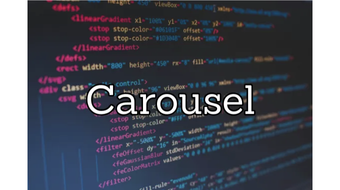
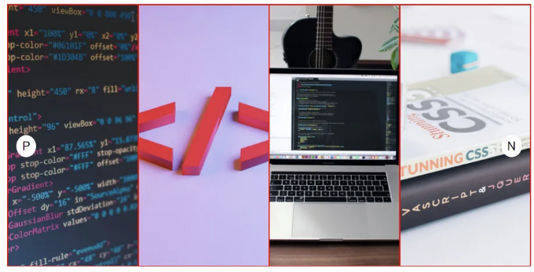
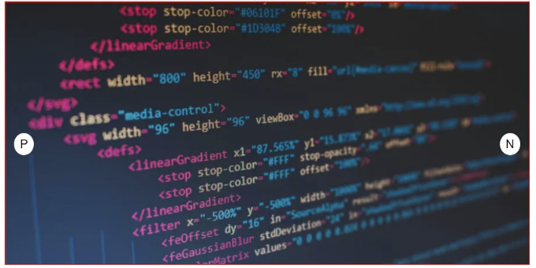

안녕하세요!!

우리는 많은 웹 사이트에서 이미 캐러셀을 본 적이 있을 거예요. 여러분도 부트스트랩과 같은 프레임워크를 사용하여 웹 프로젝트에서 사용해봤을 겁니다.

하지만 오늘은 HTML, CSS 및 JavaScript를 사용하여 직접 구현해보겠습니다. 그리고 몇몇 기계 코딩 면접에서 여러분에게 물어볼 수도 있습니다.

<!-- ui-log 수평형 -->

<ins class="adsbygoogle"
      style="display:block"
      data-ad-client="ca-pub-4877378276818686"
      data-ad-slot="9743150776"
      data-ad-format="auto"
      data-full-width-responsive="true"></ins>
<component is="script">
(adsbygoogle = window.adsbygoogle || []).push({});
</component>

코딩 부분에 들어가기 전에 캐러셀의 구조를 이해해 봅시다.

- 메인 div가 있습니다. 이를 컨테이너(div#container)라고 부를 수 있고 일정한 너비와 높이를 가지고 있습니다.
- 메인 div 안에 이미지를 포함하는 4개의 div가 있다고 가정해 봅시다 (div.image\_\_container).
- 각 내부 div에는 부모 요소의 전체 너비와 높이를 차지하는 이미지와 object-fit : cover 속성이 포함되어 있습니다. 이렇게 하면 각 이미지가 전체 div를 덮습니다.
- 이제 메인 div에는 내부 div가 행으로 배치되도록 display : flex 속성이 있어야 하지만 한 번에 하나의 이미지만 표시해야 하므로 overflow : hidden 속성을 적용해야 합니다.
- 다음 이미지로 이동하는 버튼 하나와 이전 이미지로 돌아가는 버튼 하나가 필요합니다.

# 이 5단계를 거치면 출력물은 아래와 같이 됩니다.



<!-- ui-log 수평형 -->

<ins class="adsbygoogle"
      style="display:block"
      data-ad-client="ca-pub-4877378276818686"
      data-ad-slot="9743150776"
      data-ad-format="auto"
      data-full-width-responsive="true"></ins>
<component is="script">
(adsbygoogle = window.adsbygoogle || []).push({});
</component>

6. 이제 한 가지 노트할 사항이 있습니다. 기본적으로 flex 속성에는 자식 요소인 flex-shrink : 1이 설정되어 있기 때문에 이미지가 축소되는 것입니다. 그러나 우리의 사용 사례에서는 div가 메인 컨테이너의 전체 너비를 차지하기를 원합니다. 이를 달성하기 위해 내부 div에 flex-shrink : 0을 넣어주어야 합니다.

# 그리고 6 단계 이후에 우리의 출력물은 다음과 같이 될 것입니다.



이제 코딩에 대해 알아봅시다!!

<!-- ui-log 수평형 -->

<ins class="adsbygoogle"
      style="display:block"
      data-ad-client="ca-pub-4877378276818686"
      data-ad-slot="9743150776"
      data-ad-format="auto"
      data-full-width-responsive="true"></ins>
<component is="script">
(adsbygoogle = window.adsbygoogle || []).push({});
</component>

- HTML

```js
<!DOCTYPE html>
<head>
    <link href="carousel.css" rel="stylesheet" />
</head>
<body>
    <div id="carousel__container">
        <div class="img__container">
            
        </div>
        <div class="img__container">
            
        </div>
        <div class="img__container">
            
        </div>
        <div class="img__container">
            
        </div>
        <button id="prev-btn" class="btn">P</button>
        <button id="next-btn" class="btn">N</button>
        </div>
</body>
<script src="carousel.js"></script>
</html>
```

2. CSS

```js
#carousel__container {
  position: relative;
  display: flex;
  width: 600px;
  height: 300px;
  overflow: hidden;
  border: 1px solid red;
}
```

<!-- ui-log 수평형 -->

<ins class="adsbygoogle"
      style="display:block"
      data-ad-client="ca-pub-4877378276818686"
      data-ad-slot="9743150776"
      data-ad-format="auto"
      data-full-width-responsive="true"></ins>
<component is="script">
(adsbygoogle = window.adsbygoogle || []).push({});
</component>

```js
.img__container {
  width: 100%;
  height: 100%;
  flex-shrink: 0;
}
.img__container > img {
  width: 100%;
  height: 100%;
  object-fit: cover;
}
.btn {
  position: absolute;
  top: 50%;
  border-radius: 50%;
  color: black;
  background-color: white;
  border: none;
  outline: none;
  padding: 5px 7px;
  cursor: pointer;
}
#prev-btn {
  left: 10px;
}
#next-btn {
  right: 10px;
}
```

3. 자바스크립트: 이곳에서 마법이 일어납니다.

이 코드 블록을 이해하는 데 어려움이 없습니다. 버튼에 이벤트 리스너를 추가하여 해당 기능을 호출합니다.

이미지를 DOM에서 가져와 배열에 저장합니다.```

<!-- ui-log 수평형 -->

<ins class="adsbygoogle"
      style="display:block"
      data-ad-client="ca-pub-4877378276818686"
      data-ad-slot="9743150776"
      data-ad-format="auto"
      data-full-width-responsive="true"></ins>
<component is="script">
(adsbygoogle = window.adsbygoogle || []).push({});
</component>

```js
const nextBtn = document.getElementById("next-btn");
const prevBtn = document.getElementById("prev-btn");
```

```js
nextBtn.addEventListener("click", showNextImage);
prevBtn.addEventListener("click", showPrevImage);
//document.getElementsByClassName는 HTML 컬렉션을 반환하기 때문에
//"Array.from" 메소드를 사용하여 이를 반복 가능한 형태로 변환합니다
const images = Array.from(document.getElementsByClassName("carousel__img"));
const totalImages = images.length;
let currentImageIndex = 0; // 화면에 표시되고 있는 이미지의 인덱스
```

카루셀에서 이미지가 부드럽게 슬라이딩되는 것을 보셨을 겁니다. 동일한 효과를 추가하기 위해, 이미지에 CSS 스타일을 추가하는 함수를 만들고

```js
function addTransitionEffectToImages() {
  images.forEach((img) => {
    img.style.transition = "transform 0.8s ease";
  });
}
```

<!-- ui-log 수평형 -->

<ins class="adsbygoogle"
      style="display:block"
      data-ad-client="ca-pub-4877378276818686"
      data-ad-slot="9743150776"
      data-ad-format="auto"
      data-full-width-responsive="true"></ins>
<component is="script">
(adsbygoogle = window.adsbygoogle || []).push({});
</component>

자, 이제 사용자가 다음 버튼을 클릭했을 때 어떤 일이 일어나는지 이해해 봅시다.

- 먼저, 이미지에 전환 효과를 추가하여 이미지들이 부드럽게 슬라이딩되어 슬라이딩 효과가 나타나게 합니다.
- CSS에서는 HTML 요소를 다양한 방법으로 애니메이션화할 수 있는 transform 속성이 있습니다. 그러나 우리의 사용 사례에서는 특정 픽셀 또는 퍼센트로 내부 div를 X(수평) 방향으로 이동하고 싶습니다. 이를 위해 translateX 함수를 사용합니다. 요소를 오른쪽으로 이동시키려면 전달되는 값은 양수여야 하고 그 반대의 경우도 마찬가지입니다.

```js
transform: translateX(50px); // 50픽셀만큼 오른쪽으로 요소를 이동합니다
transform: translateX(-30px); // 30픽셀만큼 왼쪽으로 요소를 이동합니다
```

```js
transform: translateX(100%); // 길이만큼 요소를 오른쪽으로 이동합니다
transform: translateX(-100%); // 길이만큼 요소를 왼쪽으로 이동합니다
```

<!-- ui-log 수평형 -->

<ins class="adsbygoogle"
      style="display:block"
      data-ad-client="ca-pub-4877378276818686"
      data-ad-slot="9743150776"
      data-ad-format="auto"
      data-full-width-responsive="true"></ins>
<component is="script">
(adsbygoogle = window.adsbygoogle || []).push({});
</component>

3. 이제 다음 버튼을 클릭할 때마다 각 이미지는 현재 위치에 따라 왼쪽으로 이동하고 인덱스가 1씩 업데이트됩니다.

4. 마지막 이미지에 도달하면 resetCarousel() 함수를 사용하여 캐러셀을 재설정합니다.

```js
function showNextImage() {
  // 만약 마지막 이미지에 있다면 캐러셀을 재설정합니다
  if (currentImageIndex == totalImages - 1) {
    resetCarousel();
    return;
  }
```

```js
if (currentImageIndex === 0) addTransitionEffectToImages();
  // 다음 이미지로 이동할 때마다 모든 이미지를 (-100%)만큼 이동합니다
  images.forEach((img) => {
    img.style.transform = `translate(${(currentImageIndex + 1) * -100}%)`;
  });
  currentImageIndex++;
}
```

<!-- ui-log 수평형 -->

<ins class="adsbygoogle"
      style="display:block"
      data-ad-client="ca-pub-4877378276818686"
      data-ad-slot="9743150776"
      data-ad-format="auto"
      data-full-width-responsive="true"></ins>
<component is="script">
(adsbygoogle = window.adsbygoogle || []).push({});
</component>

```js
function resetCarousel() {
  images.forEach((img) => {
    // 모든 이미지가 처음 위치로 돌아오면 슬라이딩 효과를 보여주고 싶지 않기 때문에 "none"을 설정합니다.
    img.style.transition = "none";
    img.style.transform = `translate(0)`; // 모든 이미지가 처음 위치로 돌아갑니다.
  });
  currentImageIndex = 0;
}
```

이제 이전 버튼을 작동하는 방법에 대해 마지막으로 남은 작업이 있습니다.

- 만약 1번째 이미지에 있을 때는 단순히 반환합니다.
- 이 부분의 로직은 다음 버튼의 기능과 반대입니다. 우리는 이미지를 -100%로 translateX하고 인덱스를 1씩 감소시킵니다.

```js
function showPrevImage() {
  if (currentImageIndex === 0) return; // 만약 첫 번째 이미지에 있으면 단순히 반환합니다.
```

<!-- ui-log 수평형 -->

<ins class="adsbygoogle"
      style="display:block"
      data-ad-client="ca-pub-4877378276818686"
      data-ad-slot="9743150776"
      data-ad-format="auto"
      data-full-width-responsive="true"></ins>
<component is="script">
(adsbygoogle = window.adsbygoogle || []).push({});
</component>

```js
// showNextImage에서 한 것과 반대로 로직을 변경
images.forEach((img) => {
  img.style.transform = `translateX(${(currentImageIndex - 1) * -100}%)`;
});
currentImageIndex--;
}
```

코딩 즐기세요!!

읽어 주셔서 감사합니다… 좋아요와 댓글도 부탁드려요!!
