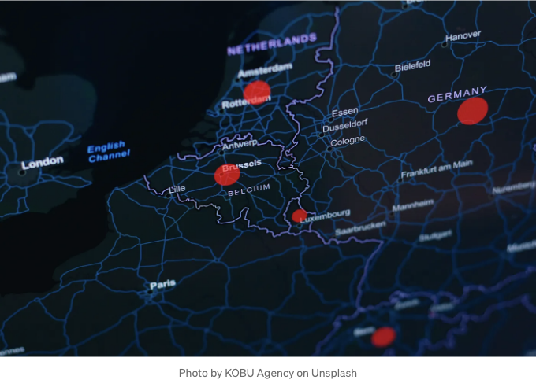

인터랙티브 맵은 웹사이트에서 사용자에게 위치를 탐색하거나 사업장을 찾을 때 또는 서비스 지역을 이해할 때 시각적이고 직관적인 방법을 제공하는 데 귀중한 도구입니다. 워드프레스에서 사용자 정의 맵을 통합하면 연락처 페이지, 서비스 지역 설명 또는 이벤트 위치를 더욱 풍부한 사용자 경험을 제공할 수 있습니다. 이 기사에서는 Google Maps와 Leaflet을 예시로 사용하여 JavaScript (JS) 및 Cascading Style Sheets (CSS)를 사용하여 사용자 정의 인터랙티브 맵을 워드프레스 사이트에 삽입하는 방법을 안내합니다.

# 왜 사용자 정의 맵인가요?

사용자 정의 맵은 지리적 데이터의 맞춤형 표현을 가능하게 하며 웹사이트의 디자인 및 기능 요구 사항과 맞닿습니다. 정적인 맵 이미지 이상으로 사용자 정의 맵은 확대, 축소, 이동 및 마커 또는 루트 추가를 통해 위치 기반 정보를 동적으로 표시하는 방법을 제공하여 위치 기반 정보를 표시하는 동적 방법을 제공합니다.

<!-- ui-log 수평형 -->

<ins class="adsbygoogle"
      style="display:block"
      data-ad-client="ca-pub-4877378276818686"
      data-ad-slot="9743150776"
      data-ad-format="auto"
      data-full-width-responsive="true"></ins>
<component is="script">
(adsbygoogle = window.adsbygoogle || []).push({});
</component>

테이블 태그를 Markdown 형식으로 변경해주세요.

<!-- ui-log 수평형 -->

<ins class="adsbygoogle"
      style="display:block"
      data-ad-client="ca-pub-4877378276818686"
      data-ad-slot="9743150776"
      data-ad-format="auto"
      data-full-width-responsive="true"></ins>
<component is="script">
(adsbygoogle = window.adsbygoogle || []).push({});
</component>

- API 키: 먼저 Google 클라우드 플랫폼 콘솔을 방문하여 Google Maps API 키를 얻으세요. 이 키를 사용하면 웹사이트에서 Google Maps 서비스를 사용할 수 있습니다.
- 지도 삽입: 보통 연락처 또는 위치 페이지에 지도를 표시하고 싶다면 아래 HTML을 삽입합니다.

```js
<div id="map" style="height:400px; width:100%;"></div>
```

3. 지도 초기화: 원하는 좌표와 옵션으로 지도를 초기화하기 위한 JS 스크립트를 추가하세요.

```js
<script>
  function initMap() {
    var location = {lat: -34.397, lng: 150.644};
    var map = new google.maps.Map(document.getElementById('map'), {
      zoom: 8,
      center: location
    });
    var marker = new google.maps.Marker({
      position: location,
      map: map
    });
  }
</script>
<script async defer
  src="https://maps.googleapis.com/maps/api/js?key=당신의_API_키&callback=initMap">
</script>
```

<!-- ui-log 수평형 -->

<ins class="adsbygoogle"
      style="display:block"
      data-ad-client="ca-pub-4877378276818686"
      data-ad-slot="9743150776"
      data-ad-format="auto"
      data-full-width-responsive="true"></ins>
<component is="script">
(adsbygoogle = window.adsbygoogle || []).push({});
</component>

다음은 신규 Google Maps API 키를 YOUR_API_KEY 자리에 넣어주세요.

# 맵 사용자 정의하기

Google Maps JavaScript API를 사용하여 맵의 외관을 사용자 정의하고 마커를 추가하거나 경로를 그릴 수 있습니다. CSS를 사용하여 반응형 디자인을 위해 맵의 컨테이너를 스타일링할 수 있어 모든 디바이스에서 훌륭하게 보이도록 할 수 있습니다.

# Leaflet 통합

<!-- ui-log 수평형 -->

<ins class="adsbygoogle"
      style="display:block"
      data-ad-client="ca-pub-4877378276818686"
      data-ad-slot="9743150776"
      data-ad-format="auto"
      data-full-width-responsive="true"></ins>
<component is="script">
(adsbygoogle = window.adsbygoogle || []).push({});
</component>

리플릿(Leaflet)은 모바일 친화적 대화형 지도를 만들 수 있는 오픈 소스 JavaScript 라이브러리입니다. 가벼우며 다양한 플러그인을 지원합니다.

# 리플릿(Leaflet) 시작하기

- 리플릿(Leaflet) 링크: WordPress 테마의 헤더나 푸터에 리플릿(Leaflet)의 CSS와 JS를 추가하세요.

```js
<link rel="stylesheet" href="https://unpkg.com/leaflet/dist/leaflet.css" />
<script src="https://unpkg.com/leaflet/dist/leaflet.js"></script>
```

<!-- ui-log 수평형 -->

<ins class="adsbygoogle"
      style="display:block"
      data-ad-client="ca-pub-4877378276818686"
      data-ad-slot="9743150776"
      data-ad-format="auto"
      data-full-width-responsive="true"></ins>
<component is="script">
(adsbygoogle = window.adsbygoogle || []).push({});
</component>

2. 지도 삽입:

```js
<div id="map" style="height: 400px;"></div>
```

3. 지도 초기화:

```js
var map = L.map("map").setView([51.505, -0.09], 13);

L.tileLayer("https://{s}.tile.openstreetmap.org/{z}/{x}/{y}.png", {
  attribution: '&copy; <a href="https://www.openstreetmap.org/copyright">OpenStreetMap</a> contributors',
}).addTo(map);

L.marker([51.5, -0.09]).addTo(map).bindPopup("아주 멋진 CSS3 팝업.<br> 쉽게 사용자 정의할 수 있어요.").openPopup();
```

<!-- ui-log 수평형 -->

<ins class="adsbygoogle"
      style="display:block"
      data-ad-client="ca-pub-4877378276818686"
      data-ad-slot="9743150776"
      data-ad-format="auto"
      data-full-width-responsive="true"></ins>
<component is="script">
(adsbygoogle = window.adsbygoogle || []).push({});
</component>

# Leaflet으로 지도 사용자 정의하기

Leaflet은 마커 클러스터링, 히트맵 또는 복잡한 지리적 시각화를 위한 geoJSON 데이터 추가와 같은 기능을 위한 플러그인을 통해 광범위한 사용자 정의가 가능합니다. CSS를 활용하여 지도의 크기를 조절하고 사이트 레이아웃에 깔끔하게 적합하도록 스타일을 지정할 수 있습니다.

# 스타일링과 반응성

지도가 반응형이 되어 워드프레스 사이트 레이아웃 내에 잘 맞도록 하려면 CSS를 사용하세요. 미디어 쿼리를 추가하여 다른 화면 크기에 맞게 지도의 크기를 조정하거나 항상 컨테이너 내에서 중앙에 위치하도록 보장할 수 있습니다.

<!-- ui-log 수평형 -->

<ins class="adsbygoogle"
      style="display:block"
      data-ad-client="ca-pub-4877378276818686"
      data-ad-slot="9743150776"
      data-ad-format="auto"
      data-full-width-responsive="true"></ins>
<component is="script">
(adsbygoogle = window.adsbygoogle || []).push({});
</component>

```js
#map {
    height: 400px;
    width: 100%;
}

@media (max-width: 600px) {
    #map {
        height: 200px;
    }
}
```

# 워드프레스 사이트를 위한 편리한 호스팅

워드프레스 사이트를 위한 좋은 호스팅을 찾고 계신가요? Host4Biz를 주목해보세요. 유럽에 위치한 현대적인 서버와 우크라이나 팀으로 구성된 신뢰할 수 있는 호스팅입니다.

그리고 프로모션 코드 MYHOST10을 입력하시면 첫 결제 시 10% 할인 혜택을 받을 수 있습니다. 이를 위해 여기에서 등록하고 결제 전에 코드를 입력해주세요.```

<!-- ui-log 수평형 -->

<ins class="adsbygoogle"
      style="display:block"
      data-ad-client="ca-pub-4877378276818686"
      data-ad-slot="9743150776"
      data-ad-format="auto"
      data-full-width-responsive="true"></ins>
<component is="script">
(adsbygoogle = window.adsbygoogle || []).push({});
</component>

다른 WordPress 호스팅의 훌륭한 옵션은 Hostinger입니다. 다음 링크를 통해 계정을 등록하고 https://hostinger.com.ua?REFERRALCODE=1VOLODYMYR55 내 블로그 업데이트를 확인하세요.

# 결론

사용자 정의 맵을 WordPress 사이트에 통합하면 상호 작용적이고 시각적으로 매력적인 위치 기반 정보를 제공하여 사용자 경험을 크게 향상시킬 수 있습니다. Google Maps의 강력한 데이터와 기능 또는 Leaflet의 유연성과 오픈 소스 성격 중 어느 것을 선택하더라도 둘 다 JS와 CSS를 활용하여 사이트의 필요에 맞게 광범위하게 사용자 정의할 수 있습니다. 모든 디바이스에서 멋지게 보이도록 반응형 디자인에 중점을 두어 사이트를 전문적이고 사용자 친화적으로 유지하도록 합니다.

참고: 위에 제공된 링크에는 제휴 링크가 있으며 무언가를 구매하면 추가 비용 없이 수수료를 받습니다.
