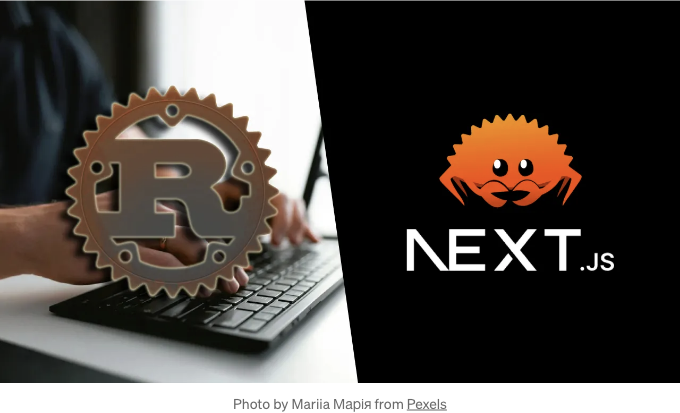
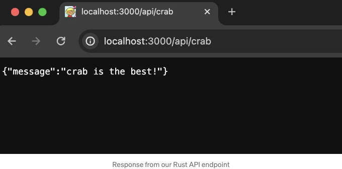
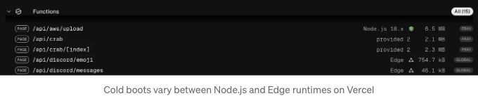

러스트는 최근에 개발자 커뮤니티에서 큰 주목을 받는 최신 언어 중 하나입니다. 성능 면에서 C/C++과 경쟁할 만큼이나 우수하지만 여러 다양한 작업에 활용할 수 있고 여러 플랫폼에서 실행할 수 있을 만큼 접근성이 좋습니다. 물론 그 중 하나가 웹 플랫폼입니다. 이 글에서는 어떻게하여 웹 프로젝트에서 Rust를 사용할 수 있는지 그리고 이미 익숙한 플랫폼에 어떻게 통합할 수 있는지 알아볼 것입니다.

웹 개발도 러스트의 휩씬을 탔고 아주 잘 어울린다고 보이고 있습니다. 러스트는 표준 JavaScript 도구인 번들러, 컴파일러, 테스트 실행기 및 심지어 런타임이 러스트로 재작성되어 엄청난 성능 향상을 이루는 등 놀라운 시작을 했습니다. 서로 다른 언어인 PHP, Python, Objective C, Swift, JavaScript 등을 사용해 프로덕션 프로젝트에서 일한 경험이 있는 오랜 기간 프로그래머로서 새로운 언어를 배울 때 항상 가능한 빨리 프로덕션 코드를 작성하는 것이 목표입니다. 기본 개념은 중요하지만 언어를 실제 문제 해결로써 보고 배우는 것이 중요합니다.

최근에는 주로 백엔드 및 API에 초점을 맞추어 왔기 때문에 러스트로 내 프로젝트에 새로운 API 엔드포인트를 작성하기로 했습니다. 제 글 중 어느 것을 읽으셨다면 대부분의 프로젝트를 호스팅하는 데 Vercel을 사용한다는 것을 이미 아실 것입니다. 제가 작업 중인 앱들의 인프라 관리를 걱정하지 않고 기능을 전달하기만에 초점을 맞출 수 있게 해주는 다양성이 마음에 들기 때문입니다. 당연히 Vercel 플랫폼에서 러스트 코드를 빌드, 배포 및 실행할 수 있는지, 그리고 현재 (대부분) JavaScript 기반 프로젝트에 통합할 수 있는지 궁금했습니다.

<!-- ui-log 수평형 -->

<ins class="adsbygoogle"
      style="display:block"
      data-ad-client="ca-pub-4877378276818686"
      data-ad-slot="9743150776"
      data-ad-format="auto"
      data-full-width-responsive="true"></ins>
<component is="script">
(adsbygoogle = window.adsbygoogle || []).push({});
</component>

기쁨 가득한 소식! Vercel에서 Rust 코드를 배포하는 여러 가지 방법이 있습니다. 다양한 옵션을 살펴보고 선택한 방법에 대해 자세히 살펴보겠습니다.

- 엣지(Edge)에서 WebAssembly (Wasm) 사용: Rust 코드를 작성하여 .wasm 이진 파일로 컴파일한 다음 JavaScript 코드에서 다른 패키지/파일처럼 가져올 수 있습니다.
- 사용자 정의 Rust 런타임 사용: Node.js 및 Next.js와 같은 프레임워크를 배포하는 것 외에도, Vercel은 Go, Python 및 Rust와 같은 다른 언어에서 컴파일된 네이티브 코드를 배포할 수 있는 다양한 사용자 정의 런타임을 지원합니다. 이러한 런타임 중 일부는 Vercel에서 관리하고 일부는 커뮤니티가 관리하는데, 둘 다 잘 작동합니다 (이전에 PHP 및 Python 런타임을 사용해봤습니다).
- Next.js 프로젝트에서 Rust 런타임 사용: Vercel과 함께 Rust 런타임을 사용하는 것이 좋지만, 실제로 많은 프로젝트가 Next.js와 같은 프레임워크에서 진행되고 있습니다. Rust를 사용할 수 있는 프로젝트 수를 늘리기 위해 Rust 런타임을 Next.js와 통합하기로 결정했습니다. 이렇게 하면 Rust로 프로젝트에 몇 가지 기능을 점진적으로 구현할 수 있을 뿐만 아니라 매일 Rust를 사용함으로써 Rust를 더 잘 익힐 수도 있습니다.

설정

이 작업을 수행하려면 새로운 create-next-app 프로젝트를 시작하여 작업에 필요한 수정 사항을 보여드리겠습니다. 이는 귀하의 프로젝트에서 이를 수행하는 데 필요한 단계도 제공할 것입니다. 물론 아래 GitHub에서 제 템플릿에 대한 링크도 제공하겠습니다.

<!-- ui-log 수평형 -->

<ins class="adsbygoogle"
      style="display:block"
      data-ad-client="ca-pub-4877378276818686"
      data-ad-slot="9743150776"
      data-ad-format="auto"
      data-full-width-responsive="true"></ins>
<component is="script">
(adsbygoogle = window.adsbygoogle || []).push({});
</component>

Next.js 프로젝트가 실행 중이면 러스트를 결합해볼 수 있어요. 혹시 궁금하신 점이 있으시다면, 이 모든 것이 Next.js 버전 12.x, 13.x, 14.x에서 pages 또는 app 디렉토리와 함께 작동할 거예요. 커스텀 런타임을 활용하려면 vercel.json 구성 파일을 프로젝트에 추가해야 해요.

또한 개발 의존성에 vercel CLI를 추가하기 위해 npm install vercel -D 명령어를 실행할 거에요. 이 CLI를 사용하여 러스트 API 엔드포인트를 위한 로컬 서버를 실행할 거에요. 이것을 통해 Vercel에게 .rs 파일을 러스트 런타임으로 서버리스 API 함수로 배포하도록 알릴 거예요. 다음으로 프로젝트 내에 최상위 api/ 디렉토리를 작성할 거에요. 이는 이미 Next.js 프로젝트에 있는 pages/api/ 디렉토리와 다르다는 점을 주목하세요. 만약 이미 pages/api/ 안에 코드가 있다면 그대로 두고 그 다음으로 러스트 런타임 함수를 위한 최상위 /api 디렉토리를 작성하세요.

또한 로컬 머신에 러스트가 설치되어 있어야 해요. 가장 빠른 방법은 rustup을 사용하는 것이니 이미 설치되어 있지 않다면 설치하세요. 러스트는 cargo를 패키지 매니저이자 빌드 시스템으로 사용해요. cargo를 활성화하기 위해 프로젝트 루트에 Cargo.toml 구성 파일을 생성해야 해요.

만약 package.json을 알고 계시다면 몇 가지 유사한 점이 있을 거예요. 이름과 버전 같은 일반 메타데이터를 추가하고 API 엔드포인트를 빌드하는 데 필요한 의존성을 추가해요. 러스트에서는 의존성을 "크레이트(crate)"라고 부르며 crates.io에 등록되어 있어요. 우리는 async 런타임으로 tokio를 사용하고 JSON 파싱/변환을 위해 serde_json을 사용하며 요청과 응답을 다루는 Vercel이나 Next.js API의 러스트 버전인 vercel_runtime을 사용할 거에요. 또한 VSCode를 사용 중이시라면 rust-analyzer 확장을 설치할 수 있어요. 이렇게 하면 러스트 언어 기능을 활성화하고 코드 작성 시 더 많은 도움과 컨텍스트를 제공할 거에요.

<!-- ui-log 수평형 -->

<ins class="adsbygoogle"
      style="display:block"
      data-ad-client="ca-pub-4877378276818686"
      data-ad-slot="9743150776"
      data-ad-format="auto"
      data-full-width-responsive="true"></ins>
<component is="script">
(adsbygoogle = window.adsbygoogle || []).push({});
</component>

다음으로, 우리는 첫 번째 Rust API 엔드포인트를 생성할 것입니다. 우리는 우리의 cargo 구성 파일에 작성한대로 api/crab.rs로 이름을 지정할 것입니다.

이제, Rust에서 한 줄의 코드도 작성해보지 않은 경우에는 100% 명확하지 않을 수 있지만, Vercel을 사용해본 적이 있거나 다른 언어로 HTTP 서버를 사용해본 적이 있다면 대부분 읽기 쉬울 것입니다. 우리는 API 요청이 GET /api/crab 로 들어올 때 응담하는 핸들러 함수를 생성할 것입니다. 이는 200 OK 상태 코드로 응답하고 JSON 형식의 메시지를 반환합니다.

빠르게 테스트하기 위해 npx vercel dev를 실행하여 테스트할 것입니다. 만약 새 프로젝트를 생성했다면 Vercel 프로젝트를 설정하라는 메시지가 표시될 것입니다. 그냥 지시에 따라 설정을 완료하면 됩니다. 모두 완료되면 "준비됨! http://localhost:3000에서 이용 가능합니다"와 같은 메시지가 표시될 것입니다. 브라우저에서 몇 초 후에 http://localhost:3000/api/crab를 열면 응답을 확인할 수 있어야 합니다.

<!-- ui-log 수평형 -->

<ins class="adsbygoogle"
      style="display:block"
      data-ad-client="ca-pub-4877378276818686"
      data-ad-slot="9743150776"
      data-ad-format="auto"
      data-full-width-responsive="true"></ins>
<component is="script">
(adsbygoogle = window.adsbygoogle || []).push({});
</component>

다시 새로 고침하면 응답이 거의 즉시 돌아온다는 것을 알 수 있습니다. 이는 vercel dev가 내부적으로 Cargo를 사용하여 Rust 파일을 빌드하고 실행하기 때문입니다. 이는 변경 사항을 자동으로 감지하여 코드를 변경할 때만 다시 컴파일합니다. 그냥 코드를 작성하고 즐기세요. 이제 루트 디렉토리에 target/ 폴더가 있는 것을 알게 되었을 것입니다. 이는 Rust 이진 파일의 표준 출력 폴더이므로 .gitignore 파일에 추가해야 합니다. .vercelignore에도 추가할 수 있습니다(참고용으로 마지막에 있는 템플릿을 확인하세요).

이제 모든 것이 작동 중이므로 조금 정리하고 나머지 Next.js 코드베이스와 함께 실행해 보겠습니다. Rust 런타임은 Vercel에 배포할 때 Rust 코드를 실행하는 데 관여하지만 개발 중에는 npm run dev 명령을 약간 수정해야 합니다.

여기서 우리가 하는 일은 새로운 dev:rust 스크립트로 Rust API를 다른 포트에서 실행하는 것입니다. 그런 다음 next dev를 실행하는 것 외에도 표준 dev 스크립트에 추가합니다. 이제 Next.js 프로젝트에서 익숙한 단일 명령으로 모든 것을 실행할 수 있습니다.

또 하나 주의할 점은 Rust 엔드포인트에 대해 localhost:3001로 이동하길 원하지 않는다는 것입니다. 이는 Next.js의 기본 localhost:3000과 다른 포트입니다. next.config.js 내에 리다이렉트를 추가하여 수정할 수 있습니다.

<!-- ui-log 수평형 -->

<ins class="adsbygoogle"
      style="display:block"
      data-ad-client="ca-pub-4877378276818686"
      data-ad-slot="9743150776"
      data-ad-format="auto"
      data-full-width-responsive="true"></ins>
<component is="script">
(adsbygoogle = window.adsbygoogle || []).push({});
</component>

우리는 개발 단계에서만 코드를 재작성합니다. Vercel에서는 모든 것이 동일한 배포로 배포되므로 재작성할 필요가 없습니다. 이제 http://localhost:3000/api/crab에 다시 접속하여 똑같이 작동됩니다. 물론 다른 개발 서버에서 실행 중이지만요. fallback에 rewrite를 추가하면, 현재의 페이지나 API 엔드포인트들이 개발 중인 Rust API 엔드포인트에 덮어씌워지지 않도록 보장해줍니다.

모든 것이 작동 중이니, 일상적인 API 개발에서 필요할 수 있는 일반적인 패턴들을 살펴보겠습니다.

캐싱

운영 준비된 API는 어떤 형태의 캐싱을 사용합니다. Vercel에 배포할 때 우리는 그들의 Edge Network (CDN)를 사용하여 API 응답을 캐싱할 수 있습니다. 표준 cache-control 헤더와 응답의 s-maxage 지시문과 함께 작동합니다. API 엔드포인트를 1시간 동안 캐싱하려면 다음과 같이 할 수 있습니다.

<!-- ui-log 수평형 -->

<ins class="adsbygoogle"
      style="display:block"
      data-ad-client="ca-pub-4877378276818686"
      data-ad-slot="9743150776"
      data-ad-format="auto"
      data-full-width-responsive="true"></ins>
<component is="script">
(adsbygoogle = window.adsbygoogle || []).push({});
</component>

요청 매개변수 읽기

vercel_runtime을 사용하면 들어오는 요청에서 데이터를 읽을 수 있습니다. 여기에는 일반적인 예제가 있습니다.

일반적인 유틸/라이브러리

더 큰 프로젝트에서는 다양한 API 엔드포인트에서 사용되는 일련의 유틸을 갖고 있을 것입니다. 러스트에서는 Cargo 구성에서 로컬 크레이트도 등록할 수 있습니다.

<!-- ui-log 수평형 -->

<ins class="adsbygoogle"
      style="display:block"
      data-ad-client="ca-pub-4877378276818686"
      data-ad-slot="9743150776"
      data-ad-format="auto"
      data-full-width-responsive="true"></ins>
<component is="script">
(adsbygoogle = window.adsbygoogle || []).push({});
</component>

나는 나의 공유된 Rust 코드를 다른 JavaScript 파일들과 분리하기 위해 src/rs 디렉토리 안에 모두 넣기로 결정했어. 이 크레이트 안에서는 Rust API 엔드포인트에서 재사용할 함수들과 매크로들을 정의할 수 있어. 이러한 함수들을 사용하려면 그냥 다른 Rust 크레이트들과 마찬가지로 가져오면 돼. 만약 IDE에 rust-analyzer나 비슬한 언어 통합이 설치되어 있다면 함수 이름을 입력하기 시작하면 자동으로 가져올 수 있을 거야.

환경 변수

로컬 .env 파일이나 Vercel 배포로부터 모든 환경 변수에 접근할 수 있어. 사용하기 편하고 간단한 dotenv 크레이트를 추천해.

에러 처리

<!-- ui-log 수평형 -->

<ins class="adsbygoogle"
      style="display:block"
      data-ad-client="ca-pub-4877378276818686"
      data-ad-slot="9743150776"
      data-ad-format="auto"
      data-full-width-responsive="true"></ins>
<component is="script">
(adsbygoogle = window.adsbygoogle || []).push({});
</component>

JSON APIs가 예쁘지 않은 처리되지 않은 예외로 크래시하는 걸 원치 않겠지요. Rust는 에러를 처리하는 특정한 방식을 갖고 있지만 API 엔드포인트에서 구조화된 에러를 잡거나 던지기 위해 내 유틸리티에 매크로를 추가했습니다. 프로젝트 전체에서 이를 사용하고 있어요.

이 매크로는 메시지, 에러, 그리고 HTTP 상태 코드를 받아들여서 그것들을 기록하며 제공된 좋은 에러 메시지와 상태 코드를 반환합니다. 또한, 일반적인 경우에 대해 제네릭 500 에러를 던지는 데 쓰이는 몇 가지 매크로가 있습니다.

다양한 요청 방식

POST, PUT, DELETE와 같은 다양한 요청 방식을 지원할 수 있어요. 각 API 함수는 여러 요청 방식을 처리할 수 있으므로 어떻게 API 엔드포인트가 받아들일지를 검증하고 제한해보죠. 먼저, 우리의 각 요청 방식에 대해 별도의 함수를 정의할 거에요. 예를 들어, POST 방식을 위한 것이죠.

<!-- ui-log 수평형 -->

<ins class="adsbygoogle"
      style="display:block"
      data-ad-client="ca-pub-4877378276818686"
      data-ad-slot="9743150776"
      data-ad-format="auto"
      data-full-width-responsive="true"></ins>
<component is="script">
(adsbygoogle = window.adsbygoogle || []).push({});
</component>

그럼 핸들러에서 올바른 함수를 요청 메서드에 매핑하고 유효성을 검사합니다.

다른 서비스와 통신

API 엔드포인트는 다른 프로토콜을 통해 다른 서비스와 통신할 수 있습니다. 대부분의 경우 HTTP를 통해 통신하는데, 이를 위해 이미 사용 중인 다른 패키지와 잘 작동하는 reqwest 크레이트를 추천합니다. 제가 연결한 템플릿 프로젝트 안에 몇 가지 예제를 확인할 수 있어요.

Cold boot 및 시작 설정

<!-- ui-log 수평형 -->

<ins class="adsbygoogle"
      style="display:block"
      data-ad-client="ca-pub-4877378276818686"
      data-ad-slot="9743150776"
      data-ad-format="auto"
      data-full-width-responsive="true"></ins>
<component is="script">
(adsbygoogle = window.adsbygoogle || []).push({});
</component>

서버리스 배포는 비용이 발생합니다. 때로는 사용자가 준비된 인스턴스 없이 엔드포인트에 접근하여 냉장 부팅 지연을 경험할 수 있습니다. 냉장 부팅에 영향을 미치는 요인 중 하나는 크기입니다. 제가 검증한 바에 따르면, Vercel에서 러스트 런타임을 사용하는 컴파일된 서버리스 함수는 코드 양이 유사한 Node.js 함수보다 작지만 Edge 함수보다 큽니다.

냉장 부팅 성능에 대해 측정한 결과, 500~1000ms 범위 내에 있음을 확인했습니다. 웜/준비 상태의 인스턴스에 접근할 때 성능이 크게 향상되며, 프로젝트가 많은 요청을 받는 경우(캐싱과 함께) Rust로 구현된 API 엔드포인트에는 문제가 없습니다.

저는 지난 몇 달간 일부 프로젝트에서 이 설정을 성공적으로 사용하고 있습니다. 그중 하나인 https://shareimdb.com/은 API 측면에서 완전히 Rust 런타임으로 구성되어 있으며, HTML 렌더링이 필요한 페이지에만 JavaScript/React를 사용하고 있습니다. Rust를 사용하여 Node.js 대신 기본 크롤링 및 파싱 작업을 한 결과, 프로젝트가 크게 이익을 얻었습니다. 예를 들어, 무료로 사용할 수 있는 50MB 제한이 있는 서버리스 함수에 헤드리스 브라우저 런타임을 적용하기 어려웠지만, Rust를 사용하여 작업을 수행할 때 문제가 없었습니다. 가장 중요한 것은 작업에 적합한 올바른 도구를 선택하는 것입니다. 장기적인 프로젝트에 참여한 사람이라면 "모든 것을 다시 작성"이 가능한 접근법이 아니라는 것을 알 것입니다. 이러한 부분적 통합과 다양한 기술/언어를 단일 프로젝트에서 사용하는 것은 프로젝트를 더 나아지게 만들 수 있는 이상적인 방법입니다.

<!-- ui-log 수평형 -->

<ins class="adsbygoogle"
      style="display:block"
      data-ad-client="ca-pub-4877378276818686"
      data-ad-slot="9743150776"
      data-ad-format="auto"
      data-full-width-responsive="true"></ins>
<component is="script">
(adsbygoogle = window.adsbygoogle || []).push({});
</component>

문제점

제가 Vercel에서 Rust를 사용하면서 마주친 몇 가지 문제점을 지적하며 마무리하고 싶습니다. 지금까지 잘 실행되고 있지만, 결정을 내릴 때와 디버깅에 시간을 절약할 수 있도록 몇 가지 아픔을 지적하고 마주한 버그를 언급하고 싶어합니다.

먼저, 가끔 Rust 런타임 함수를 실행하는 vercel dev가 명백한 이유 없이 갑자기 충돌하는 문제를 발견했습니다. 예를 들어, cargo를 통해 특정 종속성을 추가할 때 vercel dev를 재시작해야 할 수도 있습니다. cargo 구성에 새 파일을 추가하거나 lib로 추가할 때에도 개발 명령을 다시 실행하거나 서버를 실행하고 있는 노드 프로세스를 종료해야 할 수 있습니다. 이는 Vercel에서 커뮤니티 런타임임을 인정했지만, 향후 공식 런타임으로 Rust를 추가해주길 희망합니다.

또 다른 큰 문제는 사용자 지정 런타임(그냥 Rust뿐만 아니라 모든 사용자 지정 럠타임)과 함께 동적 라우트를 배포할 때 Vercel에 문제가 있는 것입니다. Vercel GitHub에 올린 버그 보고서에서 자세한 내용을 확인할 수 있습니다. 해당 티켓 내에서 이 문제를 피하는 방법에 대한 대안도 제시되고 있습니다.

<!-- ui-log 수평형 -->

<ins class="adsbygoogle"
      style="display:block"
      data-ad-client="ca-pub-4877378276818686"
      data-ad-slot="9743150776"
      data-ad-format="auto"
      data-full-width-responsive="true"></ins>
<component is="script">
(adsbygoogle = window.adsbygoogle || []).push({});
</component>

모두를 정리하면, 저는 Rust를 기존 개발 스택과 프로젝트에 추가할 수 있어서 좋았습니다. 이 블로그 포스트에서 만든 내 Next.js + Rust 템플릿에서 코드와 예제를 더 자세히 살펴볼 수 있습니다. 또한 이를 새로운 프로젝트의 템플릿으로 사용할 수도 있습니다.

이 포스트를 즐기셨다면 좋아요 또는 공유를 감사히 받겠습니다. 또한 이 주제에 대해 더 알고 싶다면 아래 링크들을 참고해보세요.

- Vercel을 위한 Rust 런타임 (커뮤니티)
- Vercel에서 지원하는 사용자 지정 런타임
- Rust Book — Rust 기본 학습에 대한 중요 자료
- Web Assembly를 위한 Rust 및 Vercel에서의 Wasm
- 내 Next.js + Rust 템플릿

그리고 제 다른 포스트/프로젝트 중 일부는:

<!-- ui-log 수평형 -->

<ins class="adsbygoogle"
      style="display:block"
      data-ad-client="ca-pub-4877378276818686"
      data-ad-slot="9743150776"
      data-ad-format="auto"
      data-full-width-responsive="true"></ins>
<component is="script">
(adsbygoogle = window.adsbygoogle || []).push({});
</component>

- https://jawa.sh— 시각적 스크래퍼 인터페이스, 아무 곳에서나 실행하고 어떤 것이든 스크래핑할 수 있는 퍼피티어 스크립트로 내보냅니다 🤖
- https://medium.com/@capJavert/doing-100-000-push-ups-this-year-with-the-help-of-siri-605c3c8eb18f — 1년 동안 100,000개의 푸시업을 어떻게 했는지에 대한 이야기 💪
- https://get.komfy.app — 즐겨 보는 비디오 콘텐츠를 직접 PC 또는 Mac으로 스트리밍합니다 📺
- https://medium.com/@capJavert/re-hacking-wordle-114ba75d1344 — 세계에서 가장 인기 있는 게임을 해킹한 내 경험 ⌨️

# 평범한 영어로 🚀

평범한 영어 커뮤니티의 일원이 되어 주셔서 감사합니다! 떠나시기 전에:

- 반드시 글쓴이를 클랩하고 팔로우해주세요 ️👏️️
- 팔로우하세요: X | 링크드인 | 유튜브 | 디스코드 | 뉴스레터
- 다른 플랫폼 방문하기: Stackademic | CoFeed | Venture | Cubed
- PlainEnglish.io에서 더 많은 콘텐츠 확인하기
