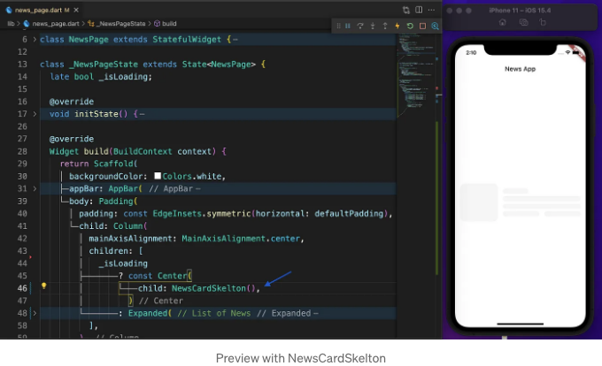
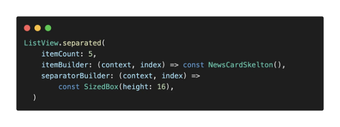

앱에서 데이터를 가져올 때, 보통 CircularProgressIndicator를 사용하지만 사용자 경험을 향상시킬 수 있는 shimmer 효과를 사용할 수 있습니다. 오늘의 글에서는 Flutter를 사용하여 쉽게 이를 구현하는 방법을 보여드리겠습니다.

## 프로젝트 설정

제가 보여드릴 내용을 따라가려면 GitHub에서 시작 프로젝트를 다운로드하세요.

<!-- ui-log 수평형 -->

<ins class="adsbygoogle"
      style="display:block"
      data-ad-client="ca-pub-4877378276818686"
      data-ad-slot="9743150776"
      data-ad-format="auto"
      data-full-width-responsive="true"></ins>
<component is="script">
(adsbygoogle = window.adsbygoogle || []).push({});
</component>

우리에게는 모든 뉴스를 보여주는 NewsPage가 있습니다. initState에서는 백엔드로부터 데이터를 가져오는 데 2초가 걸린다고 가정합니다. 그래서 2초 후에 \_isLoading을 false로 설정합니다. 앱을 실행하면 2초 동안 CircularProgressIndicator가 표시됩니다.

## Skelton 위젯 만들기

<!-- ui-log 수평형 -->

<ins class="adsbygoogle"
      style="display:block"
      data-ad-client="ca-pub-4877378276818686"
      data-ad-slot="9743150776"
      data-ad-format="auto"
      data-full-width-responsive="true"></ins>
<component is="script">
(adsbygoogle = window.adsbygoogle || []).push({});
</component>

셰머 효과는 아무 것도 아닌데, 연한 회색으로 된 컨테이너입니다. 저희 컨테이너의 색은 투명도가 4%인 백 색입니다. 또한, borderRadius를 적용하여 코너를 둥글게 만들 것입니다. 마지막으로, 우리 컨테이너가 현재 16픽셀의 미니 높이를 갖도록 패딩을 추가할 것입니다. 이는 컨테이너 주위에 8의 패딩을 적용하기 때문입니다.

이제 이 컨테이너에 이름을 지어볼까요? "Skelton"이라고 부르겠습니다. 때로는 높이와 너비를 정의해야 할 수도 있습니다. 그래서 Skelton 위젯에 높이와 너비 매개변수를 추가할 것입니다.

<!-- ui-log 수평형 -->

<ins class="adsbygoogle"
      style="display:block"
      data-ad-client="ca-pub-4877378276818686"
      data-ad-slot="9743150776"
      data-ad-format="auto"
      data-full-width-responsive="true"></ins>
<component is="script">
(adsbygoogle = window.adsbygoogle || []).push({});
</component>

## 희미한 효과

이 뉴스 카드에 희미한 효과를 만들어 보도록 하겠습니다. NewsCard에는 오른쪽에 이미지가 있으며, 카테고리, 제목 및 시간을 나타내는 몇 줄이 있습니다.

CircularProgressIndicator를 NewsCardSkeleton으로 대체할 때입니다.

<!-- ui-log 수평형 -->

<ins class="adsbygoogle"
      style="display:block"
      data-ad-client="ca-pub-4877378276818686"
      data-ad-slot="9743150776"
      data-ad-format="auto"
      data-full-width-responsive="true"></ins>
<component is="script">
(adsbygoogle = window.adsbygoogle || []).push({});
</component>

지금은 하나만 표시되는데, 몇 개가 필요합니다. 그래서 ListView.separated를 사용하고 있습니다.

<!-- ui-log 수평형 -->

<ins class="adsbygoogle"
      style="display:block"
      data-ad-client="ca-pub-4877378276818686"
      data-ad-slot="9743150776"
      data-ad-format="auto"
      data-full-width-responsive="true"></ins>
<component is="script">
(adsbygoogle = window.adsbygoogle || []).push({});
</component>
