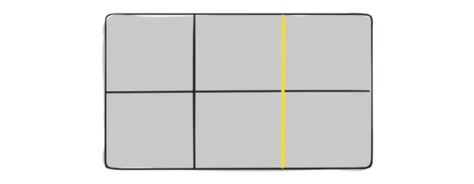
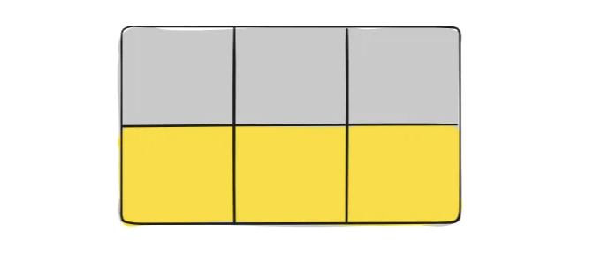
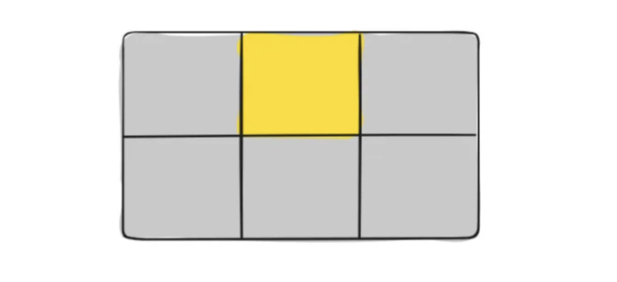
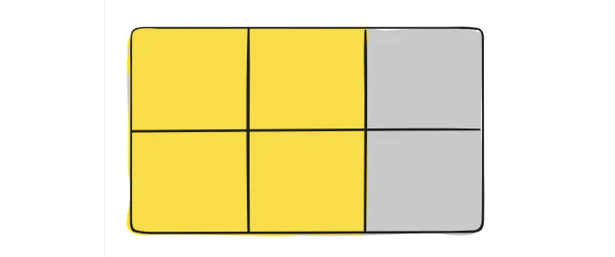
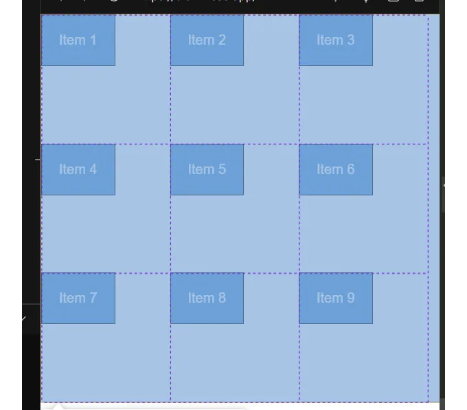

웹 개발 분야에서 CSS Grid를 숙달하는 것은 강력한 도구를 다루는 것과 같아졌어요. CSS Grid는 복잡한 레이아웃을 쉽고 효율적으로 만들 수 있는 능력을 갖추고 있어, 웹사이트 디자인 방식을 혁신적으로 변화시켰어요. 경험 많은 개발자든 막 시작한 개발자든, CSS Grid를 이해하는 것이 현대적이고 반응형 웹 레이아웃을 만드는 데 꼭 필요해요. 이 간단한 튜토리얼에서는 CSS Grid의 기본을 살펴보고, 어떻게 CSS Grid의 힘을 활용하여 멋진 웹 페이지를 디자인할 수 있는지 알아볼 거예요.

# CSS Grid의 기본

CSS Grid는 두 차원의 그리드 시스템을 소개하여 개발자들이 요소를 행과 열로 정렬할 수 있게 해줘요. 이전 기술인 CSS Flexbox가 1차원 레이아웃에 초점을 맞추는 반면, CSS Grid는 수평과 수직 축 모두에 더 많은 제어를 제공해요.

CSS Grid를 시작하려면 display: grid; 속성을 사용하여 그리드 컨테이너를 정의해야 해요. 이는 브라우저에게 컨테이너의 자식이 그리드 형식으로 배치될 것이라고 알려줘요. 예를 들면:

<!-- ui-log 수평형 -->

<ins class="adsbygoogle"
      style="display:block"
      data-ad-client="ca-pub-4877378276818686"
      data-ad-slot="9743150776"
      data-ad-format="auto"
      data-full-width-responsive="true"></ins>
<component is="script">
(adsbygoogle = window.adsbygoogle || []).push({});
</component>

```css
.grid-container {
  display: grid;
}
```

그리드 컨테이너를 생성하면 grid-template-rows 및 grid-template-columns 속성을 사용하여 행과 열의 수를 지정할 수 있습니다. 이 속성들을 고정 길이, 백분율 또는 사용 가능한 공간의 일부인 fr 단위를 사용하여 값을 정의할 수 있습니다. 다음은 예시입니다:

```css
.grid-container {
  display: grid;
  grid-template-rows: 100px 200px;
  grid-template-columns: 1fr 2fr;
}
```

이 예시에서 생성한 그리드 컨테이너는 두 개의 행과 두 개의 열을 가지고 있습니다. 첫 번째 행은 높이가 100px이고, 두 번째 행은 높이가 200px이며, 각각의 열은 사용 가능한 공간의 1/2와 1/3을 차지합니다.```

<!-- ui-log 수평형 -->

<ins class="adsbygoogle"
      style="display:block"
      data-ad-client="ca-pub-4877378276818686"
      data-ad-slot="9743150776"
      data-ad-format="auto"
      data-full-width-responsive="true"></ins>
<component is="script">
(adsbygoogle = window.adsbygoogle || []).push({});
</component>

만약 grid-template-columns에 1fr만 넣으면 어떻게 될까요? grid-template-rows에 100px는 어떨까요? 이를 잠시 멈춰 생각하거나 실험하여 행동을 더 잘 이해해 보세요.

그래서 grid-template-columns 또는 grid-template-rows은 무엇을 하는 걸까요?

CSS 그리드의 grid-template-columns 속성은 그리드 컨테이너 내의 열의 크기를 정의하는 데 사용됩니다. 각 열의 너비를 개별적으로 또는 모두 같은 패턴으로 지정할 수 있게 합니다. grid-template-rows에 대해서도 같은 말이 적용되지만, 정의하는 것은 행의 크기입니다.

다음은 grid-template-columns를 사용하는 방법에 대한 설명입니다:

<!-- ui-log 수평형 -->

<ins class="adsbygoogle"
      style="display:block"
      data-ad-client="ca-pub-4877378276818686"
      data-ad-slot="9743150776"
      data-ad-format="auto"
      data-full-width-responsive="true"></ins>
<component is="script">
(adsbygoogle = window.adsbygoogle || []).push({});
</component>

- 고정 크기 열: 단위를 픽셀(px)이나 센티미터(cm)와 같이 고정 단위로 지정할 수 있습니다. 예를 들어:

```js
.grid-container {
  display: grid;
  grid-template-columns: 100px 200px 150px;
}
```

이렇게 하면 첫 번째 열이 100px 너비, 두 번째 열이 200px, 세 번째 열이 150px인 세 개의 열이 생성됩니다.

2. 유연한 크기 열: 고정 단위 대신 백분율(%)이나 분수(fr)와 같은 유연한 단위를 사용할 수 있습니다. fr 단위는 분수 값에 따라 열 사이의 사용 가능한 공간을 분배합니다. 예를 들어:

<!-- ui-log 수평형 -->

<ins class="adsbygoogle"
      style="display:block"
      data-ad-client="ca-pub-4877378276818686"
      data-ad-slot="9743150776"
      data-ad-format="auto"
      data-full-width-responsive="true"></ins>
<component is="script">
(adsbygoogle = window.adsbygoogle || []).push({});
</component>

```js
.grid-container {
  display: grid;
  grid-template-columns: 1fr 2fr 1fr;
}
```

이 경우 사용 가능한 공간이 네 부분으로 나누어지며, 첫 번째와 세 번째 열은 각각 한 부분을 차지하고 두 번째 열은 두 부분을 차지하게 됩니다.

3. 고정 크기와 유동적 크기 혼합: 고정 크기와 유동적 단위를 혼합하여 더 복잡한 레이아웃을 만들 수 있습니다. 예를 들어:

```js
.grid-container {
  display: grid;
  grid-template-columns: 100px 1fr 2fr;
}
```

<!-- ui-log 수평형 -->

<ins class="adsbygoogle"
      style="display:block"
      data-ad-client="ca-pub-4877378276818686"
      data-ad-slot="9743150776"
      data-ad-format="auto"
      data-full-width-responsive="true"></ins>
<component is="script">
(adsbygoogle = window.adsbygoogle || []).push({});
</component>

이 코드는 첫 번째 열이 100px 너비이고 나머지 공간이 두 번째와 세 번째 열 사이에 1:2 비율로 나뉘는 세 개의 열을 만들 것입니다.

4. 자동 크기 조정 열: auto 키워드를 사용하여 브라우저가 열의 너비를 자동으로 콘텐츠에 따라 결정하도록 할 수 있습니다. 예를 들어:

```js
.grid-container {
  display: grid;
  grid-template-columns: auto auto auto;
}
```

이 경우 각 열은 포함된 콘텐츠에 기초하여 크기가 결정됩니다.

<!-- ui-log 수평형 -->

<ins class="adsbygoogle"
      style="display:block"
      data-ad-client="ca-pub-4877378276818686"
      data-ad-slot="9743150776"
      data-ad-format="auto"
      data-full-width-responsive="true"></ins>
<component is="script">
(adsbygoogle = window.adsbygoogle || []).push({});
</component>

5. 반복 표기법: 열 크기를 반복하고 싶다면 repeat() 함수를 사용할 수 있어요. 예를 들어:

```js
.grid-container {
  display: grid;
  grid-template-columns: repeat(3, 100px);
}
```

이렇게 하면 각각 너비가 100px인 세 개의 열이 생성됩니다.

# 그리드에 항목 배치하기

<!-- ui-log 수평형 -->

<ins class="adsbygoogle"
      style="display:block"
      data-ad-client="ca-pub-4877378276818686"
      data-ad-slot="9743150776"
      data-ad-format="auto"
      data-full-width-responsive="true"></ins>
<component is="script">
(adsbygoogle = window.adsbygoogle || []).push({});
</component>

그리드 구조를 정의한 후에는 그리드 행 및 열에 항목을 배치할 수 있습니다. 이를 위해 grid-row 및 grid-column 속성을 사용합니다. 이러한 속성은 각 행과 열에 대해 그리드 라인의 시작 및 끝 위치를 지정합니다. 예를 들어:

```js
.item {
  grid-row: 1 / 2;
  grid-column: 1 / 3;
}
```

이 예에서 .item 요소는 첫 번째 행부터 두 번째 행까지 및 첫 번째 열부터 세 번째 열까지 확장됩니다.

# CSS Grid를 활용한 반응형 레이아웃

<!-- ui-log 수평형 -->

<ins class="adsbygoogle"
      style="display:block"
      data-ad-client="ca-pub-4877378276818686"
      data-ad-slot="9743150776"
      data-ad-format="auto"
      data-full-width-responsive="true"></ins>
<component is="script">
(adsbygoogle = window.adsbygoogle || []).push({});
</component>

CSS 그리드의 가장 강력한 기능 중 하나는 반응형 레이아웃을 쉽게 생성할 수 있다는 점입니다. CSS 그리드 속성과 미디어 쿼리를 함께 사용하여 레이아웃을 뷰포트 크기에 맞게 조절할 수 있습니다. 예를 들어:

```js
@media screen and (max-width: 768px) {
  .grid-container {
    grid-template-columns: 1fr;
  }
}
```

이 예에서는 뷰포트 너비가 768px 이하일 때 그리드 컨테이너가 하나의 열 레이아웃으로 전환되어, 더 작은 화면에서도 원활한 경험을 제공합니다.

Code Sandbox의 예시:

<!-- ui-log 수평형 -->

<ins class="adsbygoogle"
      style="display:block"
      data-ad-client="ca-pub-4877378276818686"
      data-ad-slot="9743150776"
      data-ad-format="auto"
      data-full-width-responsive="true"></ins>
<component is="script">
(adsbygoogle = window.adsbygoogle || []).push({});
</component>

# 용어 해설

CSS Grid의 주요 용어를 이해하는 것은 이 강력한 레이아웃 시스템을 숙달하는 데 중요합니다. 여기 몇 가지 중요한 용어가 있습니다:

- 그리드 컨테이너(Grid Container): display: grid;가 적용된 요소입니다. 이는 그리드의 부모 요소가 되며 직계 자식 요소는 그리드 항목이 됩니다. 예시:

```js
<div class="container">
  <div class="item item-1"> </div>
  <div class="item item-2"> </div>
  <div class="item item-3"> </div>
</div>
```

<!-- ui-log 수평형 -->

<ins class="adsbygoogle"
      style="display:block"
      data-ad-client="ca-pub-4877378276818686"
      data-ad-slot="9743150776"
      data-ad-format="auto"
      data-full-width-responsive="true"></ins>
<component is="script">
(adsbygoogle = window.adsbygoogle || []).push({});
</component>

2. 그리드 항목: 그리드 컨테이너의 직계 자식 요소입니다. 참고: 항목은 그리드 항목입니다만, 서브-항목은 그렇지 않습니다.

```js
<div class="container">
  <div class="item"> </div>
  <div class="item">
    <p class="sub-item"> </p>
  </div>
  <div class="item"> </div>
</div>
```

3. 그리드 라인: 그리드를 구성하는 분할선입니다. 이 라인은 수평 또는 수직일 수 있으며, 그리드의 위쪽과 왼쪽 가장자리부터 번호가 매겨집니다. 그리드 라인은 그리드 항목을 위치시키는 데 사용됩니다.



<!-- ui-log 수평형 -->

<ins class="adsbygoogle"
      style="display:block"
      data-ad-client="ca-pub-4877378276818686"
      data-ad-slot="9743150776"
      data-ad-format="auto"
      data-full-width-responsive="true"></ins>
<component is="script">
(adsbygoogle = window.adsbygoogle || []).push({});
</component>

4. Grid Track: 두 인접한 그리드 선 사이의 공간을 의미합니다. 트랙은 행(row) 또는 열(column)이 될 수 있습니다.



5. Grid Cell: 그리드 내의 행과 열이 교차하는 지점을 의미합니다. 각각의 그리드 셀은 하나 이상의 그리드 아이템을 포함할 수 있습니다.



<!-- ui-log 수평형 -->

<ins class="adsbygoogle"
      style="display:block"
      data-ad-client="ca-pub-4877378276818686"
      data-ad-slot="9743150776"
      data-ad-format="auto"
      data-full-width-responsive="true"></ins>
<component is="script">
(adsbygoogle = window.adsbygoogle || []).push({});
</component>

6. 그리드 영역: 네 개의 그리드 라인으로 정의된 그리드의 직사각형 영역입니다. 여러 그리드 셀을 포함할 수 있으며 그리드 배치 속성을 사용하여 여러 그리드 항목을 병합하여 만듭니다.



7. 그리드 행: 그리드의 가로 트랙입니다. 행은 그리드 라인으로 정의됩니다.

8. 그리드 열: 그리드의 세로 트랙입니다. 열은 그리드 라인으로 정의됩니다.

<!-- ui-log 수평형 -->

<ins class="adsbygoogle"
      style="display:block"
      data-ad-client="ca-pub-4877378276818686"
      data-ad-slot="9743150776"
      data-ad-format="auto"
      data-full-width-responsive="true"></ins>
<component is="script">
(adsbygoogle = window.adsbygoogle || []).push({});
</component>

9. 그리드 갭 : 그리드 트랙(행과 열) 사이의 간격입니다. grid-gap 또는 gap 속성을 사용하여 설정할 수 있습니다.

10. 그리드 라인 네이밍 : grid-template-rows 및 grid-template-columns 속성을 사용하여 그리드 라인에 이름을 할당할 수 있습니다. 이를 통해 항목을 배치할 때 그리드 라인을 쉽게 참조할 수 있습니다.

11. 명시적 그리드 : grid-template-rows 및 grid-template-columns 속성에 의해 정의된 그리드입니다. 이는 CSS에서 명시적으로 정의하는 그리드입니다.

12. 암시적 그리드 : 명시적 그리드 바깥에 배치된 그리드 항목에 의해 생성된 그리드입니다. 이는 이러한 항목을 수용하기 위해 확장됩니다.

<!-- ui-log 수평형 -->

<ins class="adsbygoogle"
      style="display:block"
      data-ad-client="ca-pub-4877378276818686"
      data-ad-slot="9743150776"
      data-ad-format="auto"
      data-full-width-responsive="true"></ins>
<component is="script">
(adsbygoogle = window.adsbygoogle || []).push({});
</component>

13. 자동 배치: 그리드 항목이 명시적인 위치 지정 없이 그리드에 배치되면 HTML 마크업에 나타나는 순서대로 자동으로 배치됩니다.

14. 콘텐츠 정렬: 그리드 항목이 그리드의 인라인(행) 축을 따라 정렬되는 방법을 결정합니다.

15. 항목 정렬: 그리드 항목이 그리드의 블록(열) 축을 따라 정렬되는 방법을 결정합니다.

16. 자기 정렬: 단일 그리드 항목이 그리드 셀 내에서 인라인(행) 축을 따라 정렬되는 방법을 결정합니다.

<!-- ui-log 수평형 -->

<ins class="adsbygoogle"
      style="display:block"
      data-ad-client="ca-pub-4877378276818686"
      data-ad-slot="9743150776"
      data-ad-format="auto"
      data-full-width-responsive="true"></ins>
<component is="script">
(adsbygoogle = window.adsbygoogle || []).push({});
</component>

17. Align Self: 그리드 셀 내에서 단일 그리드 항목이 블록(열) 축을 따라 정렬되는 방식을 결정합니다.

이 용어들을 이해하면 CSS 그리드 레이아웃 작업에 튼튼한 기초를 제공받을 수 있으며, 쉽게 복잡하고 반응형 디자인을 만들 수 있습니다.

# 심층 탐구

CSS 그리드와 관련된 많은 속성이 있으며, 이를 컨테이너(부모)용 속성과 항목(자식)용 속성으로 나눌 수 있습니다.

<!-- ui-log 수평형 -->

<ins class="adsbygoogle"
      style="display:block"
      data-ad-client="ca-pub-4877378276818686"
      data-ad-slot="9743150776"
      data-ad-format="auto"
      data-full-width-responsive="true"></ins>
<component is="script">
(adsbygoogle = window.adsbygoogle || []).push({});
</component>

## 컨테이너에 자주 사용되는 속성:

1. display: 요소를 그리드 컨테이너로 설정하여 그 안에 있는 자식 요소들을 그리드 형식으로 배치할 수 있습니다. 이 속성은 grid, inline-grid, 또는 none(그리드 레이아웃을 제거)으로 설정할 수 있습니다.

2. grid-template-rows / grid-template-columns: 그리드 내 각 행과 열의 크기를 정의합니다. 픽셀(px), 백분율(%), 분수(fr), 또는 auto 키워드와 같은 다양한 단위로 크기를 지정할 수 있습니다.

grid-template-rows 속성의 구문은 다음과 같습니다:

<!-- ui-log 수평형 -->

<ins class="adsbygoogle"
      style="display:block"
      data-ad-client="ca-pub-4877378276818686"
      data-ad-slot="9743150776"
      data-ad-format="auto"
      data-full-width-responsive="true"></ins>
<component is="script">
(adsbygoogle = window.adsbygoogle || []).push({});
</component>

```js
grid-template-rows: <track-size> | <line-name> <track-size> | repeat(<number>, <track-size>) | auto | min-content | max-content | minmax(<min>, <max>) | fit-content(<size>);
```

위 문법을 자세히 살펴보겠습니다:

- `track-size`: 단일 행의 크기를 지정합니다. 길이 값(예: 100px, 50%), 분수 값(예: 1fr, 2fr) 또는 다음 키워드 중 하나일 수 있습니다:

- auto: 콘텐츠에 따라 행을 자동으로 크기 조정합니다.
- min-content: 행을 최소 콘텐츠에 맞게 크기 조정합니다.
- max-content: 행을 최대 콘텐츠에 맞게 크기 조정합니다.
- minmax(`min`, `max`): 행의 최소 및 최대 크기를 지정합니다. 사용 가능한 공간에 맞도록 행이 이 값 사이에 맞추어 크기가 조정됩니다.
- fit-content(`size`): 행을 사용 가능한 콘텐츠에 맞게 크기 조정하지만 지정된 크기를 초과하지는 않습니다.```

<!-- ui-log 수평형 -->

<ins class="adsbygoogle"
      style="display:block"
      data-ad-client="ca-pub-4877378276818686"
      data-ad-slot="9743150776"
      data-ad-format="auto"
      data-full-width-responsive="true"></ins>
<component is="script">
(adsbygoogle = window.adsbygoogle || []).push({});
</component>

2. `line-name`: 행을 정의하는 그리드 라인에 이름을 지정할 수 있습니다. 이름이 지정된 그리드 라인은 그리드 영역을 정의하거나 그리드 항목을 위치시킬 때 참조할 수 있습니다.

3. repeat(`number`, `track-size`): 지정된 트랙 크기를 특정 횟수만큼 반복하여 동일한 크기의 여러 행을 정의합니다. 일관된 행 패턴의 그리드를 만드는 데 유용합니다.

grid-template-rows 사용 예시:

```js
/* 고정 크기의 행 정의 */
grid-template-rows: 100px 200px 150px;

/* 사용 가능한 공간의 분수로 행 정의 */
grid-template-rows: 1fr 2fr 1fr;

/* 자동 크기 조정 행 정의 */
grid-template-rows: auto auto auto;

/* 고정 크기와 분수를 혼합한 행 정의 */
grid-template-rows: 100px 1fr 2fr;

/* 패턴화된 행 반복 */
grid-template-rows: repeat(3, 100px);

/* minmax로 행 정의 */
grid-template-rows: minmax(100px, auto) minmax(200px, 1fr);

/* 이름이 지정된 그리드 라인으로 행 정의 */
grid-template-rows: [header-start] 100px [header-end content-start] 1fr [content-end footer-start] 200px [footer-end];
```

<!-- ui-log 수평형 -->

<ins class="adsbygoogle"
      style="display:block"
      data-ad-client="ca-pub-4877378276818686"
      data-ad-slot="9743150776"
      data-ad-format="auto"
      data-full-width-responsive="true"></ins>
<component is="script">
(adsbygoogle = window.adsbygoogle || []).push({});
</component>

3. grid-template-areas: 그리드 컨테이너 내에서 명명된 그리드 영역을 정의합니다. 이 속성을 사용하면 특정 영역에 이름을 할당한 다음 아이템을 해당 영역에 배치하여 복잡한 레이아웃을 만들 수 있습니다.

grid-template-areas 속성의 구문은 다음과 같습니다:

```js
grid-template-areas: "<value>"
                    "<value>"
                    ...
                    "<value>";
```

다음은 구문의 세부 내용입니다:

<!-- ui-log 수평형 -->

<ins class="adsbygoogle"
      style="display:block"
      data-ad-client="ca-pub-4877378276818686"
      data-ad-slot="9743150776"
      data-ad-format="auto"
      data-full-width-responsive="true"></ins>
<component is="script">
(adsbygoogle = window.adsbygoogle || []).push({});
</component>

`value`: 그리드 영역의 레이아웃을 정의하는 문자열 값입니다. 각 값은 그리드 컨테이너의 행에 해당합니다. 각 값 내에서는 공백으로 구분된 문자열을 사용하여 그리드 항목의 배치를 지정합니다. 이러한 문자열은 그리드 영역의 이름 또는 빈 셀을 나타내는 점 (.)으로 구성됩니다.

예를 들어, 세 개의 행과 세 개의 열을 갖는 그리드를 고려해보겠습니다:

```js
grid-template-areas:
  "header header header"
  "sidebar main main"
  "footer footer footer";
```

이 예제에서:

<!-- ui-log 수평형 -->

<ins class="adsbygoogle"
      style="display:block"
      data-ad-client="ca-pub-4877378276818686"
      data-ad-slot="9743150776"
      data-ad-format="auto"
      data-full-width-responsive="true"></ins>
<component is="script">
(adsbygoogle = window.adsbygoogle || []).push({});
</component>

- 첫 번째 행에는 header로 명명된 세 개의 그리드 영역이 포함되어 있습니다.
- 두 번째 행에는 sidebar로 명명된 하나의 그리드 영역과 main으로 명명된 두 개의 영역이 포함되어 있습니다.
- 세 번째 행에는 footer로 명명된 세 개의 그리드 영역이 포함되어 있습니다.

또한 빈 그리드 셀이나 그리드 영역 사이의 여백을 나타내기 위해 점(.)을 사용할 수 있습니다:

```js
grid-template-areas:
  "header header header"
  ".      main   ."
  "footer footer footer";
```

이 예제에서 두 번째 행은 레이아웃에서 갭을 생성하는 main 그리드 영역을 가진 두 번째 열에만 셀을 포함하고 있습니다.

<!-- ui-log 수평형 -->

<ins class="adsbygoogle"
      style="display:block"
      data-ad-client="ca-pub-4877378276818686"
      data-ad-slot="9743150776"
      data-ad-format="auto"
      data-full-width-responsive="true"></ins>
<component is="script">
(adsbygoogle = window.adsbygoogle || []).push({});
</component>

4. `grid-template`: `grid-template-rows` 및 `grid-template-columns`을 한 번에 정의하는 데 사용되는 속기 속성입니다.

`grid-template` 속성의 구문은 다음과 같습니다:

```js
grid-template: [행 라인 이름] / [열 라인 이름];
```

위의 구문을 자세히 살펴보겠습니다:

<!-- ui-log 수평형 -->

<ins class="adsbygoogle"
      style="display:block"
      data-ad-client="ca-pub-4877378276818686"
      data-ad-slot="9743150776"
      data-ad-format="auto"
      data-full-width-responsive="true"></ins>
<component is="script">
(adsbygoogle = window.adsbygoogle || []).push({});
</component>

- [행 라인 이름]: 이 구문은 그리드 내의 행의 크기와 배치를 정의합니다. 각 행의 크기를 길이 값 (px, em, rem 등), 백분율 값 (%), 분수 (fr) 또는 auto 키워드로 개별적으로 지정할 수 있습니다. 또한 grid-template-areas 속성 내에서 참조할 수 있는 이름이 지정된 그리드 라인을 정의할 수도 있습니다.
- [열 라인 이름]: 이 구문은 그리드 내의 열의 크기와 배치를 정의합니다. 행과 유사하게, 각 열의 크기를 각각 다양한 단위를 사용하여 지정하거나 이름이 지정된 그리드 라인을 정의할 수 있습니다.

예를 들어, 다음 CSS 코드를 고려해 보겠습니다:

```js
grid-template: 100px 200px / 1fr 2fr;
```

이 예제에서:

<!-- ui-log 수평형 -->

<ins class="adsbygoogle"
      style="display:block"
      data-ad-client="ca-pub-4877378276818686"
      data-ad-slot="9743150776"
      data-ad-format="auto"
      data-full-width-responsive="true"></ins>
<component is="script">
(adsbygoogle = window.adsbygoogle || []).push({});
</component>

- 그리드 컨테이너에는 각각 높이가 100px와 200px인 두 개의 행이 있습니다.
- 또한 첫 번째 열은 사용 가능한 공간의 한 부분(1fr)을 차지하고 두 번째 열은 두 부분(2fr)을 차지합니다.

또는 템플릿을 정의할 때 이름 있는 그리드 라인을 사용할 수 있습니다:

```js
grid-template:
  [row1-start] "header header header" 100px [row1-end]
  [row2-start] "sidebar main main" 200px [row2-end]
  [row3-start] "footer footer footer" 100px [row3-end]
  / [col1-start] 1fr [col2-start] 2fr [col3-start];
```

이 예시에서:

<!-- ui-log 수평형 -->

<ins class="adsbygoogle"
      style="display:block"
      data-ad-client="ca-pub-4877378276818686"
      data-ad-slot="9743150776"
      data-ad-format="auto"
      data-full-width-responsive="true"></ins>
<component is="script">
(adsbygoogle = window.adsbygoogle || []).push({});
</component>

- 각 행은 이름(예: row1-start, row1-end)과 그리드 템플릿 영역 문자열로 정의됩니다.
- 각 열도 비슷하게 이름(예: col1-start, col2-start)으로 정의됩니다.
- 그리드의 레이아웃은 명명된 영역을 사용하여 지정되어 그리드 정의에서 명확성과 유연성을 제공합니다.

grid-template 속성을 사용하여 그리드 레이아웃의 행과 열 트랙을 간결하게 정의할 수 있어 그리드 구조를 쉽게 관리하고 수정할 수 있습니다.

5. column-gap | row-gap | gap: 그리드 내의 행과 열 사이 간격의 크기를 지정합니다. gap 속성은 행과 열 간격을 동시에 설정하는 단축형입니다.

column-gap 또는 row-gap의 구문

<!-- ui-log 수평형 -->

<ins class="adsbygoogle"
      style="display:block"
      data-ad-client="ca-pub-4877378276818686"
      data-ad-slot="9743150776"
      data-ad-format="auto"
      data-full-width-responsive="true"></ins>
<component is="script">
(adsbygoogle = window.adsbygoogle || []).push({});
</component>

```js
/* 키워드 값 */
column-gap: normal;

/* <길이> 값 */
column-gap: 3px;
column-gap: 2.5em;

/* <백분율> 값 */
column-gap: 3%;

/* 전역 값 */
column-gap: 상속;
column-gap: 초기;
column-gap: 되돌림;
column-gap: 되돌림-레이어;
column-gap: 초기화;

```

간격에 대한 구문:

```js
/* 하나의 <길이> 값 */
gap: 20px;
gap: 1em;
gap: 3vmin;
gap: 0.5cm;

/* 하나의 <백분율> 값 */
gap: 16%;
gap: 100%;

/* 두 개의 <길이> 값 */
gap: 20px 10px;
gap: 1em 0.5em;
gap: 3vmin 2vmax;
gap: 0.5cm 2mm;

/* 하나 또는 두 개의 <백분율> 값 */
gap: 16% 100%;
gap: 21px 82%;

/* calc() 값 */
gap: calc(10% + 20px);
gap: calc(20px + 10%) calc(10% - 5px);

/* 전역 값 */
gap: 상속;
gap: 초기;
gap: 되돌림;
gap: 되돌림-레이어;
gap: 초기화;
```

6. justify-items / align-items: 이 속성들은 그리드 항목이 그리드의 인라인(행) 및 블록(열) 축을 따라 정렬되는 방식을 결정합니다. 이러한 속성들은 컨테이너 내의 모든 그리드 항목에 적용됩니다.

<!-- ui-log 수평형 -->

<ins class="adsbygoogle"
      style="display:block"
      data-ad-client="ca-pub-4877378276818686"
      data-ad-slot="9743150776"
      data-ad-format="auto"
      data-full-width-responsive="true"></ins>
<component is="script">
(adsbygoogle = window.adsbygoogle || []).push({});
</component>

`justify-items` 및 `align-items`에 대한 구문:

```js
justify-items: start | end | center | stretch;
```

- start: 그리드 셀 내에서 그리드 영역의 시작 부분에 그리드 항목을 정렬합니다.
- end: 그리드 셀 내에서 그리드 영역의 끝 부분에 그리드 항목을 정렬합니다.
- center: 그리드 셀 내에서 그리드 영역의 중앙에 그리드 항목을 정렬합니다.
- stretch: 그리드 셀 내에서 그리드 항목을 전체 그리드 영역으로 늘려 채웁니다 (기본값).

코드 예시:

<!-- ui-log 수평형 -->

<ins class="adsbygoogle"
      style="display:block"
      data-ad-client="ca-pub-4877378276818686"
      data-ad-slot="9743150776"
      data-ad-format="auto"
      data-full-width-responsive="true"></ins>
<component is="script">
(adsbygoogle = window.adsbygoogle || []).push({});
</component>

그리드 선을 확인하려면 요소를 검사하십시오:



7. justify-content / align-content: justify-items 및 align-items와 유사하지만, 이러한 속성들은 전체 그리드 컨테이너의 콘텐츠가 행과 열 축을 따라 정렬되는 방법을 결정합니다.

justify-content 또는 align-content의 구문:

<!-- ui-log 수평형 -->

<ins class="adsbygoogle"
      style="display:block"
      data-ad-client="ca-pub-4877378276818686"
      data-ad-slot="9743150776"
      data-ad-format="auto"
      data-full-width-responsive="true"></ins>
<component is="script">
(adsbygoogle = window.adsbygoogle || []).push({});
</component>

```js
justify-content: start | end | center | stretch | space-around | space-between | space-evenly;
```

- start: 그리드 컨테이너의 콘텐츠를 인라인 축의 시작 부분에 맞춥니다 (수평 글쓰기 모드에서는 왼쪽).
- end: 그리드 컨테이너의 콘텐츠를 인라인 축의 끝 부분에 맞춥니다 (수평 글쓰기 모드에서는 오른쪽).
- center: 그리드 컨테이너의 콘텐츠를 인라인 축을 따라 가운데 정렬합니다.
- stretch: 그리드 컨테이너의 콘텐츠를 인라인 축 전체를 채우도록 늘립니다.
- space-around: 각 항목 주변에 동일한 간격으로 그리드 컨테이너의 콘텐츠를 고르게 배치합니다.
- space-between: 시작과 끝에 여백이 없이 각 항목 사이에 동일한 간격으로 그리드 컨테이너의 콘텐츠를 고르게 배치합니다.
- space-evenly: 각 항목 주변과 사이에 동일한 간격으로 그리드 컨테이너의 콘텐츠를 고르게 배치합니다.

예시:

8. grid-auto-rows / grid-auto-columns: 그리드 항목이 명시적 위치 지정 없이 그리드에 배치되었을 때 암묵적으로 생성되는 행과 열의 크기를 정의합니다.```

<!-- ui-log 수평형 -->

<ins class="adsbygoogle"
      style="display:block"
      data-ad-client="ca-pub-4877378276818686"
      data-ad-slot="9743150776"
      data-ad-format="auto"
      data-full-width-responsive="true"></ins>
<component is="script">
(adsbygoogle = window.adsbygoogle || []).push({});
</component>

그리드 자동 행 또는 자동 열의 구문:

```js
grid-auto-rows: <track-size> | min-content | max-content | auto | minmax(min, max) | fit-content(length);
```

- `track-size`: 길이 값(예: 픽셀, 퍼센트), 분수(fr) 또는 다른 길이 단위를 사용하여 자동으로 생성된 행의 크기를 지정합니다.
- min-content: 자동으로 생성된 행을 최소 내용에 맞게 크기 조정합니다.
- max-content: 자동으로 생성된 행을 최대 내용에 맞게 크기 조정합니다.
- auto: 내용에 따라 자동으로 생성된 행의 크기를 조정합니다.
- minmax(min, max): 자동으로 생성된 행의 최소 및 최대 크기를 지정합니다. 해당 값 사이에 맞게 크기가 조정되며 사용 가능한 공간을 고려합니다.
- fit-content(length): 자동으로 생성된 행을 사용 가능한 내용에 맞게 크기 조정합니다. 그러나 지정된 길이를 초과하지는 않습니다.

예제 스니펫:

<!-- ui-log 수평형 -->

<ins class="adsbygoogle"
      style="display:block"
      data-ad-client="ca-pub-4877378276818686"
      data-ad-slot="9743150776"
      data-ad-format="auto"
      data-full-width-responsive="true"></ins>
<component is="script">
(adsbygoogle = window.adsbygoogle || []).push({});
</component>

```js
/* 자동 생성된 행의 고정 크기 정의 */
grid-auto-rows: 100px;

/* 콘텐츠에 따라 행을 자동으로 크기 조정 */
grid-auto-rows: auto;

/* 자동 생성된 행의 최소 및 최대 크기 설정 */
grid-auto-rows: minmax(100px, auto);

/* 열 크기를 열 내의 최대 콘텐츠에 맞게 자동 조정 */
grid-auto-columns: max-content;

/* 콘텐츠에 따라 열을 자동으로 크기 조정 */
grid-auto-columns: auto;

/* 자동 생성된 열의 최소 및 최대 크기 설정 */
grid-auto-columns: minmax(100px, auto);
```

9. grid-auto-flow: 자동 배치된 그리드 항목이 그리드 내에서 배치되는 방식을 결정합니다. 행, 열, dense 또는 inherit 중 하나로 설정할 수 있습니다.

- row: 자동 배치가 행 축을 따라 발생해야 함을 나타냅니다(왼쪽에서 오른쪽으로, 위에서 아래로). 이것이 기본값입니다.
- column: 자동 배치가 열 축을 따라 발생해야 함을 나타냅니다(위에서 아래로, 왼쪽에서 오른쪽으로).
- row dense: 행과 유사하지만 항목이 밀집되어 채워 넣어지며 그리드의 간격을 채웁니다.
- column dense: 열과 유사하지만 항목이 밀집되어 채워 넣어집니다.

grid-auto-flow 값을 조정함으로써 그리드 내에서 명시적 배치가 없는 그리드 항목들의 흐름과 패킹 동작을 제어할 수 있습니다. 이 속성을 통해 그리드 레이아웃이 정의된 그리드 트랙을 넘어서거나 동적으로 추가된 항목을 처리하는 방법에 유연성을 제공합니다.

<!-- ui-log 수평형 -->

<ins class="adsbygoogle"
      style="display:block"
      data-ad-client="ca-pub-4877378276818686"
      data-ad-slot="9743150776"
      data-ad-format="auto"
      data-full-width-responsive="true"></ins>
<component is="script">
(adsbygoogle = window.adsbygoogle || []).push({});
</component>

## 자주 사용되는 자식 요소 속성:

CSS 그리드 레이아웃 내의 자식 요소 (그리드 항목)에 대해 자리 지정, 크기 조절, 정렬 및 스타일링을 제어하는 몇 가지 흔히 사용되는 속성이 있습니다. 다음은 가장 자주 사용되는 속성 중 일부입니다:

1. grid-column / grid-row: 이러한 속성은 그리드 항목이 열 및 행에 대해 시작하고 끝나게 될 그리드 라인을 지정합니다. 이는 grid-column-start + grid-column-end 및 grid-row-start + grid-row-end의 빠른 표기법입니다.

구문:

<!-- ui-log 수평형 -->

<ins class="adsbygoogle"
      style="display:block"
      data-ad-client="ca-pub-4877378276818686"
      data-ad-slot="9743150776"
      data-ad-format="auto"
      data-full-width-responsive="true"></ins>
<component is="script">
(adsbygoogle = window.adsbygoogle || []).push({});
</component>

```js
.item {
  grid-column: <시작-라인> / <끝-라인> | <시작-라인> / span <값>;
  grid-row: <시작-라인> / <끝-라인> | <시작-라인> / span <값>;
}
```

예시 코드:

```js
.item-a {
  grid-column: 2/ span 3;
  grid-row: third-line / 5;
}
```

2. grid-area: 이 속성은 grid 템플릿에 지정된 그리드 영역 이름을 사용하여 그리드 항목의 크기와 위치를 단일 압축형 선언으로 지정할 수 있습니다.```

<!-- ui-log 수평형 -->

<ins class="adsbygoogle"
      style="display:block"
      data-ad-client="ca-pub-4877378276818686"
      data-ad-slot="9743150776"
      data-ad-format="auto"
      data-full-width-responsive="true"></ins>
<component is="script">
(adsbygoogle = window.adsbygoogle || []).push({});
</component>

문법:

```js
grid-area: <row-start> / <column-start> / <row-end> / <column-end>;
```

- `row-start`: 그리드 항목의 행이 시작되는 선입니다.
- `column-start`: 그리드 항목의 열이 시작되는 선입니다.
- `row-end`: 그리드 항목의 행이 끝나는 선입니다.
- `column-end`: 그리드 항목의 열이 끝나는 선입니다.

그리드 트랙을 나타내는 선 번호, 이름 또는 몇 개의 그리드 트랙을 건너뛰는지 나타내기 위해 span 키워드를 사용할 수 있습니다. 예시:

<!-- ui-log 수평형 -->

<ins class="adsbygoogle"
      style="display:block"
      data-ad-client="ca-pub-4877378276818686"
      data-ad-slot="9743150776"
      data-ad-format="auto"
      data-full-width-responsive="true"></ins>
<component is="script">
(adsbygoogle = window.adsbygoogle || []).push({});
</component>

```js
.item {
  grid-area: 1 / 1 / 3 / 3; /* 아이템이 행 1, 열 1에서 시작하여 행 3, 열 3에서 끝납니다. */
}
```

이렇게 함으로써 .item 그리드 항목은 그리드 컨테이너 내에서 행 1부터 3까지와 열 1부터 3까지로 정의된 영역에 배치됩니다.

또 다른 방법으로는 그리드 라인 이름이나 span 키워드를 사용할 수도 있습니다:

```js
.item {
  grid-area: header-start / sidebar-start / footer-end / content-end; /* 라인 이름을 사용합니다 */
}
```

<!-- ui-log 수평형 -->

<ins class="adsbygoogle"
      style="display:block"
      data-ad-client="ca-pub-4877378276818686"
      data-ad-slot="9743150776"
      data-ad-format="auto"
      data-full-width-responsive="true"></ins>
<component is="script">
(adsbygoogle = window.adsbygoogle || []).push({});
</component>

```js
.item {
  grid-area: 1 / 1 / span 2 / span 2; /* 2행 2열을 차지합니다 */
}
```

3. justify-self / align-self: 이 속성은 그리드 항목을 그리드 셀 내에서 인라인 (행) / 블록 (열) 축을 따라 정렬합니다. 그리드 컨테이너에서 설정된 justify-items 또는 align-items 속성을 해당 항목에 재정의합니다.

```js
.item {
  justify-self: start | end | center | stretch;
}
```

- start: 그리드 항목을 시작 부분에 정렬합니다 (글쓰기 방향이 왼쪽에서 오른쪽인 경우 왼쪽).
- end: 그리드 항목을 끝 부분에 정렬합니다 (글쓰기 방향이 왼쪽에서 오른쪽인 경우 오른쪽).
- center: 그리드 항목을 그리드 셀 내에서 수평으로 가운데 정렬합니다.
- stretch: 그리드 항목을 그리드 셀의 전체 너비로 늘립니다.

<!-- ui-log 수평형 -->

<ins class="adsbygoogle"
      style="display:block"
      data-ad-client="ca-pub-4877378276818686"
      data-ad-slot="9743150776"
      data-ad-format="auto"
      data-full-width-responsive="true"></ins>
<component is="script">
(adsbygoogle = window.adsbygoogle || []).push({});
</component>

예시:

.item {
justify-self: start; /_ 항목을 수평으로 시작 부분에 정렬합니다 _/
align-self: end; /_ 항목을 수직으로 끝 부분에 정렬합니다 _/
}

이 예시에서 .item 그리드 항목은 그리드 셀 내에서 수평으로 시작 부분에 정렬되었습니다 (justify-self: start;) 그리고 세로로 끝 부분에 정렬되었습니다 (align-self: end;).

다른 값들인 center나 stretch와 같이 레이아웃 요구에 따라 다른 값들을 사용할 수도 있습니다. 이러한 속성들은 그리드 컨테이너 내에서 그리드 항목의 정렬에 대해 세밀한 제어를 제공합니다.

<!-- ui-log 수평형 -->

<ins class="adsbygoogle"
      style="display:block"
      data-ad-client="ca-pub-4877378276818686"
      data-ad-slot="9743150776"
      data-ad-format="auto"
      data-full-width-responsive="true"></ins>
<component is="script">
(adsbygoogle = window.adsbygoogle || []).push({});
</component>

코드 샌드박스:

4. order: 이 속성은 그리드 항목이 HTML의 소스 순서를 변경하지 않고 시각적으로 재배열되는 방식을 지정하여 그리드 레이아웃에서 그리드 항목의 순서를 바꿀 수 있습니다.

```js
.item {
  order: 2; /* 그리드 항목을 시각적으로 두 번째 위치에 배치합니다. */
}
```

이 예시에서는 .item 그리드 항목이 2의 값을 가진 order가 할당되어 있습니다. 이는 HTML 소스 코드에서의 위치와 상관없이 그리드 레이아웃에서 두 번째 항목으로 시각적으로 표시됨을 의미합니다.

<!-- ui-log 수평형 -->

<ins class="adsbygoogle"
      style="display:block"
      data-ad-client="ca-pub-4877378276818686"
      data-ad-slot="9743150776"
      data-ad-format="auto"
      data-full-width-responsive="true"></ins>
<component is="script">
(adsbygoogle = window.adsbygoogle || []).push({});
</component>

`order` 속성을 사용하면 페이지의 요소를 배열하는 데 더 많은 유연성을 제공하여 HTML 소스 순서를 변경하지 않고 그리드 항목에 사용자 정의 시각적 레이아웃을 만들 수 있습니다. 원하는 레이아웃을 달성하기 위해 필요에 따라 `order` 값을 조정하세요.

# 결론

CSS Grid는 웹 레이아웃에 대한 탁월한 유연성과 제어를 제공하여 현대 웹 개발에 꼭 필요한 도구입니다. 이 짧은 자습서에서는 CSS Grid의 가능성을 소개했을 뿐입니다. 다양한 속성과 기술을 실험하여 CSS Grid의 잠재력을 최대로 발휘하고 웹사이트에 멋진 반응형 디자인을 만들어보세요.

그러니 무슨 말이 필요할까요? CSS Grid에 몸담아 웹 개발 기술을 높여보세요! 연습과 실험을 통해 곧 그리드 기반 레이아웃의 기술을 숙달하고 웹에서 창의력을 발휘할 수 있게 됩니다.

<!-- ui-log 수평형 -->

<ins class="adsbygoogle"
      style="display:block"
      data-ad-client="ca-pub-4877378276818686"
      data-ad-slot="9743150776"
      data-ad-format="auto"
      data-full-width-responsive="true"></ins>
<component is="script">
(adsbygoogle = window.adsbygoogle || []).push({});
</component>

CSS 그리드를 더 잘 이해하기 위해 이 자료들을 찾아보세요!
